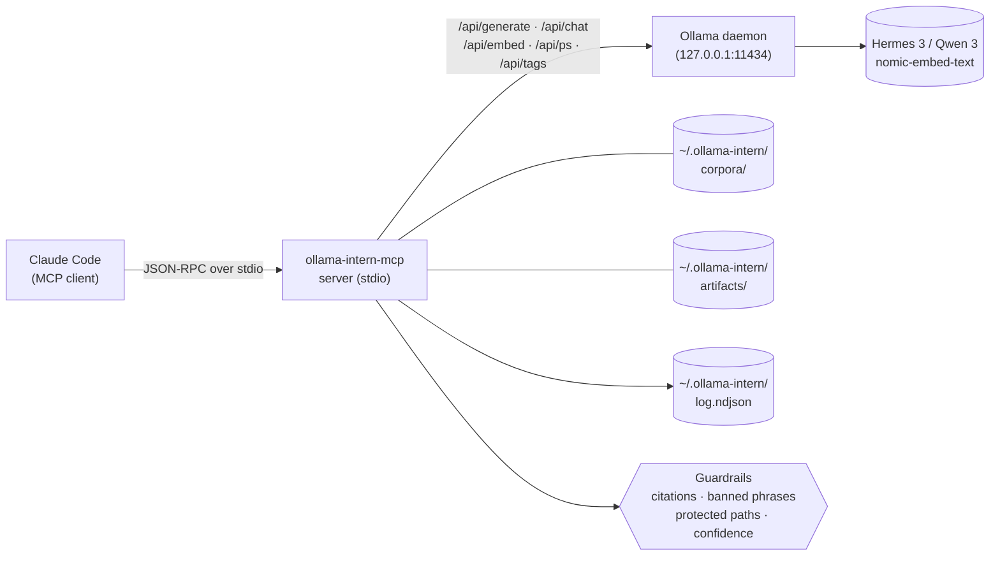

<p align="center">
  <a href="README.ja.md">日本語</a> | <a href="README.zh.md">中文</a> | <a href="README.md">English</a> | <a href="README.fr.md">Français</a> | <a href="README.hi.md">हिन्दी</a> | <a href="README.it.md">Italiano</a> | <a href="README.pt-BR.md">Português (BR)</a>
</p>

<p align="center">
  
</p>

<p align="center">
  <a href="https://github.com/mcp-tool-shop-org/ollama-intern-mcp/actions"></a>
  <a href="LICENSE"></a>
  <a href="https://mcp-tool-shop-org.github.io/ollama-intern-mcp/"></a>
  <a href="https://mcp-tool-shop-org.github.io/ollama-intern-mcp/handbook/"></a>
</p>

> **El pasante local para Claude Code.** <!-- TOOL_COUNT:start -->42<!-- TOOL_COUNT:end --> herramientas con forma de trabajo, briefings basados en evidencia, artefactos duraderos.

Un servidor MCP que le da a Claude Code un **pasante local** con reglas, niveles, un escritorio y un archivador. Claude elige la _herramienta_; la herramienta elige el _nivel_ (Instant / Workhorse / Deep / Embed); el nivel escribe un archivo que puedes abrir la próxima semana.

**También dirige [Hermes Agent](https://github.com/NousResearch/hermes-agent) en `hermes3:8b`** — validado de extremo a extremo el 2026-04-19. La escalera por defecto es `hermes3:8b`; `qwen3:*` es el riel alternativo. Ver [Uso con Hermes](#use-with-hermes) más abajo.

**Requisitos de hardware:** ~6 GB de VRAM para `hermes3:8b`, o ~16 GB de RAM para inferencia en CPU. Ver [handbook/getting-started](https://mcp-tool-shop-org.github.io/ollama-intern-mcp/handbook/getting-started/#hardware-minimums) para el desglose completo.

**¿No usas Claude?** El directorio [`examples/`](./examples/) tiene un cliente MCP mínimo en Node.js y Python que puedes lanzar sobre stdio. Ver también [handbook/with-hermes](https://mcp-tool-shop-org.github.io/ollama-intern-mcp/handbook/with-hermes/).

**Local primero** — cero tráfico de salida de red hasta que optes por activarlo. Sin telemetría. Nada "autónomo". Cada llamada muestra su trabajo. El enrutamiento opcional a [Ollama Cloud](#ollama-cloud-optional) pone modelos de clase 600B detrás de las mismas herramientas cuando el hardware local es el cuello de botella — con fallback automático a local.

---

## Nuevo en v2.7.0

**Enrutamiento opcional a Ollama Cloud — nube-primario, fallback local.** Opta por participar con una clave + una bandera y los niveles generativos enrutan a un modelo en la nube de clase 600B; los embeddings se quedan locales; un circuit breaker hace fallback a tu perfil local ante cualquier fallo en la nube. **Desactivado por defecto — cero salida de red a menos que establezcas tanto `OLLAMA_API_KEY` como `OLLAMA_CLOUD_PRIMARY=1`.** Cambio aditivo menor — los llamantes de versiones previas a v2.7.0 (y cualquiera que no opte por participar) ven un comportamiento byte a byte idéntico. Ver [Ollama Cloud (opcional)](#ollama-cloud-optional).

- **Nube-primario con red de seguridad.** Un `RoutingOllamaClient` intenta primero la nube y hace fallback al perfil local ante timeout / 5xx / 429 / red. Las claves incorrectas (401/403) se manifiestan ruidosamente mediante un breaker pegajoso en lugar de degradarse silenciosamente para siempre; un ID de modelo en la nube retirado/con error tipográfico (404) también se manifiesta.
- **Nunca una degradación silenciosa.** Cada sobre gana `backend` (`cloud`|`local`), `degraded` y `degrade_reason` para que siempre sepas cuándo obtuviste el modelo local en lugar del grande. Un evento NDJSON `backend_fallback` hace visible la tasa de fallback de nube→local en `ollama_log_tail`.
- **`ollama_doctor` reporta autenticación + accesibilidad de la nube** como un bloque distinto; `ollama-intern-mcp doctor` muestra una sección `Cloud (primary)`.
- El modelo en la nube por defecto es `minimax-m3:cloud`; sobrescribe por nivel con `INTERN_CLOUD_MODEL` / `INTERN_CLOUD_DEEP_MODEL` (por ejemplo, `deepseek-v3.1:671b`).

## Nuevo en v2.6.0

Anulación de presupuesto por nivel por llamada en `ollama_extract`. Cambio aditivo menor — los llamantes de versiones previas a v2.6.0 sin cambios. Entrada detallada en [CHANGELOG.md](./CHANGELOG.md).

- **`tier_budget_ms_override?: number` campo de esquema en `ollama_extract`** (opcional, acotado `[1, 600000]` ms). Cuando está presente, aplica la anulación a cada nivel (tier) visitado por el ejecutor para que el mecanismo interno `runWithTimeoutAndFallback` en `src/guardrails/timeouts.ts:61` respete el presupuesto proporcionado por el operador en lugar del valor predeterminado del perfil. La cascada (workhorse → instant en caso de timeout) sigue disparándose; la anulación gobierna cada salto de la cascada de forma uniforme.
- **Por qué existe.** El envoltorio R-018 de research-os (v0.12.1) envolvía `callTool` del MCP con `Promise.race` y descubrió que el presupuesto del envoltorio no llegaba al nivel interno — `DEV_RTX5080_TIMEOUTS.instant = 15_000` continuaba disparando `TIER_TIMEOUT` a los 15000ms independientemente del presupuesto de 180000ms del envoltorio. v2.6.0 suministra el presupuesto autoritativo del lado del MCP para que la bandera `--planner-timeout-ms` del operador (research-os) finalmente controle los timeouts del nivel interno según lo diseñado.
- **Comportamiento predeterminado preservado.** Campo omitido = los valores predeterminados del perfil gobiernan de forma byte-idéntica. Los llamadores anteriores a v2.6.0 no ven ningún cambio.
- **Expresión regular de causa de fallback R-010 preservada.** El mensaje de error `TIER_TIMEOUT` del lado del servidor aún coincide con `/elapsed=(\d+)ms/` + `/budget=(\d+)ms/`, por lo que la visibilidad de AI-advisor en downstream funciona tanto en la ruta con anulación como en la predeterminada.
- Consumido por research-os v0.13.0 (cableado de cliente R-019 acumulativo + R-020 + R-021) en un lanzamiento coordinado multi-repositorio.

### Histórico — entregables de v2.4.0

Consulte [CHANGELOG.md](./CHANGELOG.md) y [docs/release-notes/v2.4.0.md](./docs/release-notes/v2.4.0.md) para la entrada completa de v2.4.0 (control de `num_ctx` por nivel en el sistema de perfiles).

## Novedades en v2.4.0

Control de `num_ctx` (ventana de contexto) por nivel en el sistema de perfiles. Cambio menor aditivo — los llamadores de v2.3.0 no cambian. Entradas detalladas en [CHANGELOG.md](./CHANGELOG.md) y [docs/release-notes/v2.4.0.md](./docs/release-notes/v2.4.0.md).

- **Mapa `TierConfig.num_ctx` (nuevo)** — opcional `{ instant?, workhorse?, deep?, embed? }` en el perfil. Cuando se establece para un nivel, el servidor MCP coloca `options.num_ctx = <valor>` en cada solicitud generate/chat de Ollama enrutada a ese nivel (inicial + fallback). Cuando no se establece, la solicitud omite `num_ctx` por completo para que Ollama use su valor predeterminado cargado por el modelo — comportamiento de v2.3.0 preservado exactamente.
- **Nuevo campo de sobre `num_ctx_used?: number`** — presente solo cuando el servidor MCP realmente envió `num_ctx`. Ausente cuando la solicitud dejó que Ollama eligiera. No infiera un valor predeterminado — el servidor MCP no consulta a Ollama sobre el valor efectivo.
- **Valores predeterminados del perfil**: `dev-rtx5080` / `dev-rtx5080-qwen3` se envían con `instant: 4096`, `workhorse: 8192`, `deep`/`embed` NO ESTABLECIDOS. Dimensionados para mantener `hermes3:8b` residente en el presupuesto de 16GB de VRAM de la RTX 5080 para herramientas rápidas. `m5-max` deja todos los niveles NO ESTABLECIDOS — 128GB de memoria unificada no tienen problema de desbordamiento.
- **Cierra el diagnóstico de Fase 1 de v0.8.0** — `hermes3:8b` en el contexto predeterminado de 32K en la RTX 5080 desbordaba a la CPU y comenzó a generar timeouts en las llamadas `ollama_extract` del nivel workhorse. v2.4.0 previene eso en la capa de perfil.

### Control de `num_ctx` por nivel (nuevo en v2.4.0)

Perfil (extracto de `src/profiles.ts`):

```ts
"dev-rtx5080": {
  tiers: {
    instant: "hermes3:8b",
    workhorse: "hermes3:8b",
    deep: "hermes3:8b",
    embed: "nomic-embed-text",
    num_ctx: {
      instant: 4096,    // fast classify/summarize
      workhorse: 8192,  // schema-bound extract / batch
      // deep: UNSET — long-context briefs keep current behavior
      // embed: UNSET — no context-window pressure on embed
    },
  },
  // ... timeouts, prewarm
}
```

Sobre en una llamada de nivel workhorse (p. ej. `ollama_extract`):

```jsonc
{
  "result": { /* extracted data */ },
  "tier_used": "workhorse",
  "model": "hermes3:8b",
  "num_ctx_used": 8192,        // present because the profile set workhorse=8192
  // ... rest of envelope unchanged
}
```

En `m5-max` (o cualquier perfil que deje un nivel sin establecer), `num_ctx_used` está ausente del sobre y la solicitud por cable a Ollama no incluye el campo `num_ctx` — Ollama usa su valor predeterminado cargado por el modelo.

Los operadores ajustan seleccionando / editando el perfil; no hay entrada de `num_ctx` por llamada en los esquemas de herramientas. Si una llamada futura surge la necesidad, el patrón sigue la anulación de `model` de v2.3.0.

### Histórico — entregables de v2.3.0

Consulte [CHANGELOG.md](./CHANGELOG.md) y [docs/release-notes/v2.3.0.md](./docs/release-notes/v2.3.0.md) para la entrada completa de v2.3.0 (anulación de modelo por llamada).

## Novedades en v2.3.0

Anulación de modelo por llamada en herramientas atómicas respaldadas por LLM. Aditivo menor — los llamadores de v2.2.0 sin cambios. Entradas detalladas en [CHANGELOG.md](./CHANGELOG.md) y [docs/release-notes/v2.3.0.md](./docs/release-notes/v2.3.0.md).

- **Entrada opcional `model: string` en 8 herramientas atómicas** — `ollama_extract`, `ollama_classify`, `ollama_summarize_fast`, `ollama_summarize_deep`, `ollama_research`, `ollama_corpus_answer`, `ollama_chat`, `ollama_code_citation`. El primer intento en el nivel de la herramienta se ejecuta contra el modelo especificado por el llamador; en caso de tiempo de espera agotado, la cascada `TIER_FALLBACK` existente resuelve el modelo propio del nivel más económico (NO la anulación del llamador). Las herramientas compuestas/brief/pack deliberadamente NO aceptan `model` — los átomos obtienen control por llamada, los compuestos usan los valores predeterminados del nivel.
- **Nuevo campo de sobre `model_requested?: string`** — presente solo cuando se proporcionó la anulación. Los llamadores conscientes de la calibración comparan `model_requested` con `model` para detectar la sustitución por respaldo: `if (env.model_requested && env.model !== env.model_requested) { /* substitution */ }`. Las entradas vacías o con solo espacios en blanco lanzan `ZodError` al analizar el esquema, no una caída silenciosa.
- **Corrección de error — deriva en `src/version.ts`.** La constante `VERSION` en tiempo de ejecución ahora se lee desde `package.json` al cargar el módulo; v2.1.0 y v2.2.0 se habían publicado reportando la cadena de identidad obsoleta `"2.0.0"`. El nuevo `tests/version.test.ts` bloquea `VERSION === pkg.version`.

### Anulación de modelo por llamada (nuevo en v2.3.0)

```jsonc
{
  "tool": "ollama_classify",
  "arguments": {
    "text": "patch null pointer in auth",
    "labels": ["feat", "fix", "chore"],
    "frame": "what is the change kind?",
    "model": "hermes3:8b"
  }
}
```

Sobre:

```jsonc
{
  "result": { "label": "fix", "confidence": 0.9, "off_topic": false, ... },
  "tier_used": "instant",
  "model": "hermes3:8b",
  "model_requested": "hermes3:8b",       // present because override was supplied
  // ... rest of envelope unchanged
}
```

Si el nivel workhorse/deep hubiera agotado el tiempo de espera y la llamada hubiera caído en cascada al nivel instant, `env.model` sería el modelo resuelto del nivel instant y `env.fallback_from` sería `"workhorse"` — `env.model_requested` seguiría siendo `"hermes3:8b"`, y `env.model !== env.model_requested` es la señal de sustitución. La anulación deliberadamente NO se traslada al nivel más económico; el modelo elegido podría no encajar en absoluto en el rol de ese nivel.

### Histórico — entregables de v2.2.0

Consulte [CHANGELOG.md](./CHANGELOG.md) y [docs/release-notes/v2.2.0.md](./docs/release-notes/v2.2.0.md) para la entrada completa de v2.2.0 (topicalidad limitada por marco + abstención estructurada).

## Nuevo en v2.2.0

Contrato de rol de trabajador de evidencia local: topicalidad limitada por marco y abstención estructurada. Aditivo menor — los llamadores de v2.1.0 sin cambios. Entradas detalladas en [CHANGELOG.md](./CHANGELOG.md) y [docs/release-notes/v2.2.0.md](./docs/release-notes/v2.2.0.md).

- **Extracción limitada por marco** en `ollama_extract`, `ollama_classify`, `ollama_summarize_fast`, `ollama_summarize_deep` — entrada opcional `frame: string` + salidas estructuradas `frame_alignment` / `on_topic` / `frame_addressed`. Las fuentes fuera de tema se marcan en lugar de parafrasearse en el esquema.
- **Abstención estructurada** en `ollama_research` — campos `weak` / `abstained` / `sources_address_question`. Un `citations[]` vacío con un `answer` no vacío ya no es un éxito silencioso.
- **Umbral de topicalidad** en `ollama_corpus_answer` — `min_top_score` opcional. Por debajo del suelo, la herramienta se interrumpe con `abstained: true` y omite la síntesis. El `score` por cita ahora es visible en cada cita.
- **Preservación de la puntuación de recuperación** a través de la evidencia brief — `corpusHitsToEvidence` transporta `score` (y la perilla `corpus_min_evidence_score` filtra en el momento del ensamblaje en `incident_brief` / `repo_brief` / `change_brief`).
- **Límites de rango de línea en citas** — `guardrails/citations.ts` rechaza rangos fuera de límites en `ollama_research`, coincidiendo con la postura existente en `ollama_code_citation`.
- **Documentación del contrato del operador corregida** — corrección de `chunk_id`/`chunk_index` en el README, "validado del lado del servidor" reescrito, sección de Leyes de Evidencia calificada, eslogan de marketing anotado.

### Regresión de semilla — la verificación

El contrato del slice se verifica contra el fallo literal de paquete-fresco de research-os: arxiv 2112.10422 (Cosmological Standard Timers) bajo el marco de la sección 01 *"¿Qué significa la custodia de evidencia en los flujos de trabajo de investigación profunda con LLM local-first vs en la nube?"* — 9 / 9 pruebas de contrato de LLM simulado confirman que la fuente fuera de tema ahora está contenida (`frame_alignment.on_topic = false` en extract; `off_topic: true` en classify; `frame_addressed: false` en summarize_deep; `abstained: true` en corpus_answer con `min_top_score` establecido).

### Histórico — entregables de v2.1.0

Consulte [CHANGELOG.md](./CHANGELOG.md) para ver la entrada completa de v2.1.0 (pasada de funcionalidades: 13 herramientas nuevas + 4 mejoras + levantamiento de congelación).

---

## Arquitectura de un vistazo



Cada llamada de herramienta de Claude entra al servidor MCP a través de stdio JSON-RPC. El servidor valida la llamada contra el esquema [zod](https://zod.dev) de la herramienta, ejecuta las barandas configuradas (validación de citas, eliminación de frases prohibidas, aplicación de rutas protegidas, umbrales de confianza) y luego enruta a un renderizador determinista (nivel de artefacto) o a una llamada HTTP a Ollama (cualquier otro nivel). El demonio de Ollama nunca ve las rutas proporcionadas por el usuario — solo el nivel del modelo y el prompt preparado. Cada llamada añade un evento estructurado al registro NDJSON en `~/.ollama-intern/log.ndjson`, donde `ollama_log_tail` y su shell pueden leerlo.

---

## Ejemplo principal — una llamada, un artefacto

```jsonc
// Claude → ollama-intern-mcp
{
  "tool": "ollama_incident_pack",
  "arguments": {
    "title": "sprite pipeline 5 AM paging regression",
    "logs": "[2026-04-16 05:07] worker-3 OOM killed\n[2026-04-16 05:07] ollama /api/ps reports evicted=true size=8.1GB\n...",
    "source_paths": ["F:/AI/sprite-foundry/src/worker.ts", "memory/sprite-foundry-visual-mastery.md"]
  }
}
```

Devuelve un sobre que apunta a un archivo en disco:

```jsonc
{
  "result": {
    "pack": "incident",
    "slug": "2026-04-16-sprite-pipeline-5-am-paging-regression",
    "artifact_md":   "~/.ollama-intern/artifacts/incident/2026-04-16-sprite-pipeline-5-am-paging-regression.md",
    "artifact_json": "~/.ollama-intern/artifacts/incident/2026-04-16-sprite-pipeline-5-am-paging-regression.json",
    "weak": false,
    "evidence_count": 6,
    "next_checks": ["residency.evicted across last 24h", "OLLAMA_MAX_LOADED_MODELS vs loaded size"]
  },
  "tier_used": "deep",
  "model": "hermes3:8b",
  "hardware_profile": "dev-rtx5080",
  "tokens_in": 4180, "tokens_out": 612,
  "elapsed_ms": 8410,
  "residency": { "in_vram": true, "evicted": false }
}
```

→ `weak: false` significa que se ensamblaron ≥2 elementos de evidencia; NO significa que las hipótesis estén verificadas. Vea [Leyes de la evidencia](#evidence-laws) más abajo.

Ese archivo markdown es la salida de escritorio del interno — encabezados, bloque de evidencia con identificadores citados, `next_checks` de investigación, banner `weak: true` si la evidencia es escasa. Es determinista: el renderizador es código, no un prompt. (El renderizador es determinista; el *contenido* de las hipótesis y superficies es generativo — léalos como borrador, no como verificado.) Ábrelo mañana, compáralo la próxima semana, expórtalo a un manual con `ollama_artifact_export_to_path`.

Cada competidor en esta categoría lidera con "ahorra tokens." Nosotros lideramos con _aquí está el archivo que escribió el interno._

### Segundo ejemplo — construye un corpus y luego consúltalo

```jsonc
// 1. Build a persistent, searchable corpus over your project.
{ "tool": "ollama_corpus_index",
  "arguments": { "name": "sprite-foundry",
                 "paths": ["F:/AI/sprite-foundry/src"],
                 "embed_model": "nomic-embed-text" } }
// → { chunks_written: 1204, paths_indexed: 312, failed_paths: [] }

// 2. Ask an evidence-bound question against it.
{ "tool": "ollama_corpus_answer",
  "arguments": { "name": "sprite-foundry",
                 "query": "how does the worker handle OOM eviction?",
                 "top_k": 8 } }
// → { answer: "...", citations: [{chunk_index, path}...], weak: false }
```

El servidor valida la identidad de las citas y que cada `chunk_index` esté en el rango de los hits recuperados. NO prueba que cada afirmación generada esté respaldada semánticamente por el contenido del fragmento citado — esa es la responsabilidad del modelo, y una recuperación débil aún puede producir respuestas con forma de citas. Recorrido completo en [handbook/corpora](https://mcp-tool-shop-org.github.io/ollama-intern-mcp/handbook/corpora/).

---

## Extracción vinculada a marco (nuevo en v2.2.0)

`ollama_extract`, `ollama_classify`, `ollama_summarize_fast` y `ollama_summarize_deep` aceptan una entrada opcional `frame: string`. El marco nombra la pregunta a la que se le pide a la fuente que responda; se indica al modelo que se abstenga en lugar de emitir contenido verdadero pero fuera de tema cuando la fuente no aborda el marco.

```jsonc
{
  "tool": "ollama_extract",
  "arguments": {
    "text": "<long source document>",
    "schema": { /* your fields */ },
    "frame": "section purpose here — e.g. 'OOM eviction behavior in the sprite worker'"
  }
}
// → result includes frame_alignment: { on_topic: boolean, reason: string, unaddressed_aspects: string[] }
```

Si se omite `frame`, el comportamiento no cambia desde v2.1.0. Cuando se proporciona, `frame_alignment.on_topic = false` señala que los campos extraídos pueden ser ciertos respecto a la fuente pero no relevantes para el marco — trátelo de la misma forma que un resumen `weak: true`: útil, pero verifique de forma puntual antes de promoverlo a evidencia posterior.

---

## Contrato de abstención (nuevo en v2.2.0)

`ollama_research` devuelve campos de abstención estructurados: `weak: boolean`, `abstained: boolean`, `sources_address_question: boolean | null`. Un `citations[]` vacío con un `answer` no vacío ya no es silencioso — `abstained: true` indica que el modelo declinó sintetizar porque las rutas proporcionadas por el llamador no abordaban la pregunta. Trata la abstención como un éxito, no como un fallo: es la herramienta negándose a blanquear una recuperación débil en salida autoritativa.

`ollama_corpus_answer` acepta un umbral de topicalidad opcional `min_top_score: number` (0.0–1.0). Cuando la puntuación de recuperación superior para una consulta cae por debajo de `min_top_score`, la herramienta hace cortocircuito con `abstained: true` y omite la síntesis — previniendo el modo de fallo "5 fragmentos fuera de tema con puntuación 0.21 aún impulsan una respuesta completa" que la regla `weak: true` de v2.1.0 no detectó (`weak: true` solo se disparaba con `hits.length < 2`). Combina esto con el campo `score` por citación, recién expuesto en cada citación, para auditar la calidad de recuperación directamente desde el sobre.

---

## Qué hay aquí — cuatro niveles, <!-- TOOL_COUNT:start -->42<!-- TOOL_COUNT:end --> herramientas

**Con forma de trabajo** significa que cada herramienta nombra un trabajo que le asignarías a un becario — clasifica esto, extrae aquello, triagea estos registros, redacta esta nota de versión, empaqueta este incidente. La entrada de la herramienta es el especificación del trabajo; la salida es el entregable. Ninguna primitiva genérica `run_model` / `chat_with_llm` en la parte superior.

| Nivel | Cantidad | Qué vive aquí |
|---|---|---|
| **Atoms** | 28 | Primitivas con forma de trabajo. **15 originales:** `classify`, `extract`, `triage_logs`, `summarize_fast` / `deep`, `draft`, `research`, `corpus_search` / `answer` / `index` / `refresh` / `list`, `embed_search`, `embed`, `chat`. **+13 añadidos en v2.1.0:** `doctor`, `log_tail`, `batch_proof_check` (ops); `code_map`, `code_citation`, `multi_file_refactor_propose`, `refactor_plan` (refactor); `artifact_prune`, `hypothesis_drill` (artifact/brief); `corpus_health`, `corpus_amend`, `corpus_amend_history`, `corpus_rerank` (corpus). Los átomos compatibles con lotes (`classify`, `extract`, `triage_logs`) aceptan `items: [{id, text}]`. |
| **Briefs** | 3 | Briefs de operador estructurados con respaldo de evidencia. `incident_brief`, `repo_brief`, `change_brief`. Cada afirmación cita un id de evidencia; los desconocidos se eliminan en el servidor. La evidencia débil aparece como `weak: true` en lugar de narrativa falsa. |
| **Packs** | 3 | Trabajos compuestos de pipeline fijo que escriben markdown + JSON duraderos en `~/.ollama-intern/artifacts/`. `incident_pack`, `repo_pack`, `change_pack`. Renderizadores deterministas — sin llamadas al modelo sobre la forma del artefacto. |
| **Artifacts** | 7 | Superficie de continuidad sobre las salidas de packs. `artifact_list` / `read` / `diff` / `export_to_path`, más tres fragmentos deterministas: `incident_note`, `onboarding_section`, `release_note`. |

Total: **28 átomos + 3 briefs + 3 packs + 7 herramientas de artefacto = <!-- TOOL_COUNT:start -->42<!-- TOOL_COUNT:end -->**.

Líneas de congelación:
- Átomos: congelación **levantada en v2.1.0** (28 hoy; +13 añadidos en el pase de funciones de v2.1.0). Los nuevos átomos aún requieren una brecha justificada por auditoría, pruebas, página de manual y entrada en CHANGELOG — sin adiciones casuales.
- Packs congelados en 3. No hay nuevos tipos de pack.
- Nivel de artefactos congelado en 7.

La referencia completa de herramientas vive en el [manual](https://mcp-tool-shop-org.github.io/ollama-intern-mcp/handbook/tools/).

---

## Instalación

Requiere [Ollama](https://ollama.com) ejecutándose localmente y los modelos de nivel descargados (ver [Descarga de modelos](#descarga-de-modelos) abajo).

### Claude Code (recomendado)

La mayoría de los usuarios instalan esto agregándolo a su configuración del servidor MCP de Claude Code — no se requiere instalación global. Claude Code ejecuta el servidor bajo demanda mediante `npx`:

```json
{
  "mcpServers": {
    "ollama-intern": {
      "command": "npx",
      "args": ["-y", "ollama-intern-mcp"],
      "env": {
        "OLLAMA_HOST": "http://127.0.0.1:11434",
        "INTERN_PROFILE": "dev-rtx5080"
      }
    }
  }
}
```

### Claude Desktop

Mismo bloque, escrito en `~/Library/Application Support/Claude/claude_desktop_config.json` (macOS) o `%APPDATA%\Claude\claude_desktop_config.json` (Windows).

### Instalación global (avanzada)

Solo se necesita si quieres el binario en tu `PATH` para uso ad-hoc fuera de Claude Code:

```bash
npm install -g ollama-intern-mcp
```

### Uso con Hermes

Este MCP fue validado de extremo a extremo con [Hermes Agent](https://github.com/NousResearch/hermes-agent) contra `hermes3:8b` en Ollama (2026-04-19). Hermes es un agente externo que *invoca* la superficie de primitivas congelada de este MCP — él hace la planificación, nosotros hacemos el trabajo.

Configuración de referencia ([hermes.config.example.yaml](hermes.config.example.yaml) en este repositorio):

```yaml
model:
  provider: custom
  base_url: http://localhost:11434/v1
  default: hermes3:8b
  context_length: 65536    # Hermes requires 64K floor under model.*

providers:
  local-ollama:
    name: local-ollama
    base_url: http://localhost:11434/v1
    api_mode: openai_chat
    api_key: ollama
    model: hermes3:8b

mcp_servers:
  ollama-intern:
    command: npx
    args: ["-y", "ollama-intern-mcp"]
    env:
      OLLAMA_HOST: http://localhost:11434
      INTERN_PROFILE: dev-rtx5080
      # hermes3:8b is the default ladder in v2.0.0, so tier overrides are
      # only needed if you're pinning a different local model.
```

**La forma del prompt importa.** Los prompts imperativos de invocación de herramientas ("Llama a X con args…") son la prueba de integración — le dan a un modelo local 8B suficiente andamiaje para emitir `tool_calls` limpios. Los prompts multitarea en formato lista ("haz A, luego B, luego C") son benchmarks de capacidad para modelos más grandes; no interpretes un fallo en formato lista en 8B como "el cableado está roto". Consulta [handbook/with-hermes](https://mcp-tool-shop-org.github.io/ollama-intern-mcp/handbook/with-hermes/) para el recorrido completo de integración + advertencias conocidas del transporte (streaming `/v1` de Ollama + adaptador no-streaming de openai-SDK).

### Descarga de modelos

**Perfil de desarrollo predeterminado (RTX 5080 16GB y similares):**

```bash
ollama pull hermes3:8b
ollama pull nomic-embed-text
export OLLAMA_MAX_LOADED_MODELS=2
export OLLAMA_KEEP_ALIVE=-1
```

**Alternativa con Qwen 3 (mismo hardware, para herramientas Qwen):**

```bash
ollama pull qwen3:8b
ollama pull qwen3:14b
ollama pull nomic-embed-text
export INTERN_PROFILE=dev-rtx5080-qwen3
```

**Perfil M5 Max (128GB unificada):**

```bash
ollama pull qwen3:14b
ollama pull qwen3:32b
ollama pull nomic-embed-text
export INTERN_PROFILE=m5-max
```

Las variables de entorno por nivel (`INTERN_TIER_INSTANT`, `INTERN_TIER_WORKHORSE`, `INTERN_TIER_DEEP`, `INTERN_EMBED_MODEL`) aún sobrescriben las selecciones del perfil para casos puntuales.

---

## Sobre (envelope) uniforme

Cada herramienta devuelve la misma forma:

```ts
{
  result: <tool-specific>,
  tier_used: "instant" | "workhorse" | "deep" | "embed",
  model: string,
  hardware_profile: string,     // "dev-rtx5080" | "dev-rtx5080-qwen3" | "m5-max"
  tokens_in: number,
  tokens_out: number,
  elapsed_ms: number,
  residency: {
    in_vram: boolean,
    size_bytes: number,
    size_vram_bytes: number,
    evicted: boolean
  } | null
}
```

`residency` proviene del `/api/ps` de Ollama. Cuando `evicted: true` o `size_vram < size`, el modelo pasó a paginación en disco y la inferencia cayó 5–10× — muestra esto al usuario para que sepa que debe reiniciar Ollama o reducir la cantidad de modelos cargados.

En el modo [Ollama Cloud](#ollama-cloud-optional) el sobre también incluye `backend` (`"cloud"` | `"local"`) y, en una caída de cloud→local, `degraded: true` + `degrade_reason`. Estos campos están **ausentes** en la ruta predeterminada solo-local, por lo que los consumidores existentes no se ven afectados. `residency` es `null` para las llamadas servidas desde la nube (la nube sin estado no tiene residencia en VRAM local).

Cada llamada se registra como una línea NDJSON en `~/.ollama-intern/log.ndjson`. Filtra por `hardware_profile` para mantener los números de desarrollo fuera de los benchmarks publicables.

---

## Perfiles de hardware

| Perfil | Instant | Workhorse | Deep | Embed |
|---|---|---|---|---|
| **`dev-rtx5080`** (predeterminado) | hermes3 8B | hermes3 8B | hermes3 8B | nomic-embed-text |
| `dev-rtx5080-qwen3` | qwen3 8B | qwen3 8B | qwen3 14B | nomic-embed-text |
| `m5-max` | qwen3 14B | qwen3 14B | qwen3 32B | nomic-embed-text |

**El perfil de desarrollo predeterminado** colapsa los tres niveles de trabajo sobre `hermes3:8b` — la ruta validada de integración con Hermes Agent. El mismo modelo de arriba a abajo significa que hay una cosa que descargar, un costo de residencia, un conjunto de comportamientos que entender. Los usuarios que prefieren Qwen 3 (con su plumbing `THINK_BY_SHAPE`) optan por `dev-rtx5080-qwen3`. `m5-max` es la escalera de Qwen 3 dimensionada para memoria unificada.

---

## Ollama Cloud (opcional)

Los modelos locales 8B son el cuello de botella de hardware que la mayoría de la gente encuentra. [Ollama Cloud](https://ollama.com/cloud) sirve modelos de clase 600B detrás de la **misma** superficie `/api/*`, por lo que puedes enrutar las herramientas pesadas a un modelo mucho más fuerte y liberar VRAM local — manteniendo local como fallback siempre activo.

**Esto es opcional y está desactivado por defecto.** El paquete se mantiene local-primero con **cero salida de datos** a menos que establezcas *ambas* opciones. Cualquiera que no lo active no se ve afectado.

```json
{
  "mcpServers": {
    "ollama-intern": {
      "command": "npx",
      "args": ["-y", "ollama-intern-mcp"],
      "env": {
        "OLLAMA_CLOUD_PRIMARY": "1",
        "OLLAMA_API_KEY": "sk-...your-key...",
        "INTERN_PROFILE": "dev-rtx5080"
      }
    }
  }
}
```

> **La clave es una variable de entorno de tiempo de ejecución, no un secreto de CI.** Un secreto de GitHub Actions solo es visible dentro de las ejecuciones de CI — nunca llega al servidor en ejecución. Crea una clave en [ollama.com/settings/keys](https://ollama.com/settings/keys) y colócala en el bloque `env` de tu cliente MCP (o en el entorno de tu shell).

**Cómo funciona el enrutamiento.** Cuando la nube está activada, los niveles generativos (instant / workhorse / deep) van al modelo en la nube; **los embeddings siempre permanecen locales** (Ollama Cloud no ofrece modelos de embeddings, por lo que las herramientas corpus/embed no se ven afectadas). Un disyuntor prueba primero la nube y recurre a tu perfil local ante timeout / 5xx / 429 / errores de red. Una clave incorrecta (401/403) activa un disyuntor *persistente* que se manifiesta de forma ruidosa en lugar de degradarse silenciosamente. El perfil local (`INTERN_PROFILE`) es la escalera de respaldo, así que mantén sus modelos descargados.

**Nunca se te degrada silenciosamente.** Cada sobre indica qué backend atendió la llamada:

```ts
{ ...envelope, backend: "cloud" | "local", degraded?: true, degrade_reason?: "cloud_timeout" | "cloud_5xx" | "cloud_rate_limited" | "cloud_unreachable" | "cloud_auth_failed" | "circuit_open" }
```

Una línea `backend_fallback` llega a `~/.ollama-intern/log.ndjson` en cada caída de nube→local (`ollama_log_tail --filter_kind backend_fallback`), y `ollama-intern-mcp doctor` muestra un bloque **Nube (principal)** con accesibilidad + estado de autenticación.

**Latencia vs calidad.** Los modelos grandes en la nube funcionan mucho más lento por token que un 8B local (segundos, no milisegundos) — una mejora de calidad, no de velocidad. Los niveles en la nube usan una escalera de tiempos de espera generosa (instant 30s / workhorse 120s / deep 300s por defecto).

### Variables de entorno de la nube

| Var | Predeterminado | Propósito |
|---|---|---|
| `OLLAMA_CLOUD_PRIMARY` | _(sin establecer)_ | **El interruptor de activación voluntaria.** `1`/`true`/`yes`/`on` activa la nube como principal. Sin establecer = solo local, cero tráfico de salida. |
| `OLLAMA_API_KEY` | _(sin establecer)_ | Clave Bearer para Ollama Cloud. **Requerida** cuando la nube está activada (fallo rápido al iniciar si falta). |
| `OLLAMA_CLOUD_HOST` | `https://ollama.com` | Host base de la nube. |
| `INTERN_CLOUD_MODEL` | `minimax-m3:cloud` | Modelo en la nube para instant + workhorse + deep. |
| `INTERN_CLOUD_DEEP_MODEL` | _(= `INTERN_CLOUD_MODEL`)_ | Anulación opcional solo para el nivel deep, p. ej. `deepseek-v3.1:671b`. |
| `INTERN_CLOUD_TIMEOUT_{INSTANT,WORKHORSE,DEEP}_MS` | `30000`/`120000`/`300000` | Tiempos de espera por intento en la nube para cada nivel. |
| `INTERN_CLOUD_NUM_CTX` | `32768` | Límite de ventana de contexto para llamadas a la nube (la nube factura por tiempo de GPU; el límite controla el costo). |

> **La disponibilidad de modelos cambia.** Ollama retira periódicamente modelos de la nube. `minimax-m3:cloud`, `deepseek-v3.1:671b`, `gpt-oss:120b` y `qwen3-coder:480b` son opciones actuales; consulta [ollama.com/search?c=cloud](https://ollama.com/search?c=cloud) antes de fijar un id.

**Nota de privacidad.** El enrutamiento a Ollama Cloud envía prompts a un tercero. La [política de privacidad](https://ollama.com/privacy) de Ollama indica que los prompts en la nube se procesan de forma transitoria, no se conservan más allá de la solicitud y no se usan para entrenamiento — pero sigue siendo tráfico de salida, por lo que es de activación voluntaria y divulgado. El modo solo local (el predeterminado) no envía nada fuera de la máquina.

---

## Leyes de evidencia

Estas se aplican en el servidor, no en el prompt:

- **Citas obligatorias.** Cada afirmación breve cita un id de evidencia.
- **Desconocidos eliminados en el servidor.** Los modelos que citen ids que no estén en el conjunto de evidencia reciben un aviso y esos ids se eliminan antes de devolver el resultado.
- **Validado por ID, no por contenido.** El servidor comprueba que cada `evidence_ref` citado apunte a un id de evidencia real en el conjunto ensamblado. NO verifica que el texto de la afirmación sea derivable de la evidencia citada — eso es tarea del modelo, y los resúmenes débiles a veces contienen afirmaciones no respaldadas con referencias válidas. Usa `weak: true` + coverage_notes + el campo `excerpt` incluido para hacer comprobaciones puntuales.
- **Débil es débil.** La evidencia escasa marca `weak: true` con notas de cobertura. Nunca se suaviza hasta convertirlo en una narrativa falsa.
- **Investigativo, no prescriptivo.** Solo `next_checks` / `read_next` / `likely_breakpoints`. Los prompts prohíben "aplica esta solución".
- **Renderizadores deterministas.** La forma del markdown del artefacto es código, no un prompt. `draft` queda reservado para prosa donde la redacción del modelo importa.
- **Solo diferencias dentro del mismo paquete.** `artifact_diff` entre paquetes se rechaza de forma explícita; las cargas útiles se mantienen separadas.

---

## Artefactos y continuidad

Los paquetes escriben en `~/.ollama-intern/artifacts/{incident,repo,change}/<slug>.(md|json)`. El nivel de artefactos te ofrece una superficie de continuidad sin convertir esto en una herramienta de gestión de archivos:

- `artifact_list` — índice solo de metadatos, filtrable por paquete, fecha, glob de slug
- `artifact_read` — lectura tipada por `{pack, slug}` o `{json_path}`
- `artifact_diff` — comparación estructurada dentro del mismo paquete; se marca el cambio a débil
- `artifact_export_to_path` — escribe un artefacto existente (con encabezado de procedencia) en un `allowed_roots` declarado por el llamador. Rechaza archivos existentes a menos que `overwrite: true`.
- `artifact_incident_note_snippet` — fragmento de nota de operador
- `artifact_onboarding_section_snippet` — fragmento de manual
- `artifact_release_note_snippet` — fragmento de nota de versión en BORRADOR

No hay llamadas al modelo en este nivel. Todo se renderiza desde el contenido almacenado.

---

## Modelo de amenazas y telemetría

**Datos tratados:** rutas de archivo que el llamador entrega explícitamente (`ollama_research`, herramientas de corpus), texto en línea y artefactos que el llamador pide que se escriban bajo `~/.ollama-intern/artifacts/` o un `allowed_roots` declarado por el llamador.

**Datos NO tratados:** nada fuera de `source_paths` / `allowed_roots`. `..` se rechaza antes de normalizar. `artifact_export_to_path` rechaza archivos existentes a menos que `overwrite: true`. Los borradores dirigidos a rutas protegidas (`memory/`, `.claude/`, `docs/canon/`, etc.) requieren `confirm_write: true` explícito, aplicado en el servidor.

**Salida de red:** **desactivada por defecto.** De fábrica, el único tráfico saliente va al endpoint HTTP local de Ollama — sin llamadas a la nube, sin pings de actualización, sin informes de fallos. **Excepción opcional:** si activas [Ollama Cloud](#ollama-cloud-optional) (`OLLAMA_CLOUD_PRIMARY=1` + `OLLAMA_API_KEY`), los prompts de los niveles generativos se envían a `ollama.com` por HTTPS con una clave Bearer. Esto es explícito, divulgado y desactivado salvo que establezcas ambas variables; los embeddings siguen sin salir nunca de la máquina. Consulta [SECURITY.md](SECURITY.md) §11.

**Telemetría:** **ninguna.** Cada llamada se registra como una línea NDJSON en `~/.ollama-intern/log.ndjson` en tu máquina. El servidor por sí solo no llama a casa.

**Errores:** forma estructurada `{ code, message, hint, retryable }`. Los stack traces nunca se exponen a través de los resultados de las herramientas.

Política completa: [SECURITY.md](SECURITY.md).

---

## Estándares

Construido conforme al estándar [Shipcheck](https://github.com/mcp-tool-shop-org/shipcheck). Las puertas estrictas A–D pasan; consulta [SHIP_GATE.md](SHIP_GATE.md) y [SCORECARD.md](SCORECARD.md).

- **A. Seguridad** — SECURITY.md, modelo de amenazas, sin telemetría, seguridad de rutas, `confirm_write` en rutas protegidas
- **B. Errores** — forma estructurada en todos los resultados de herramientas; sin trazas de pila en bruto
- **C. Documentación** — README actualizado, CHANGELOG, LICENSE; los esquemas de herramientas se autodocumentan
- **D. Higiene** — `npm run verify` (suite completa de vitest), CI con escaneo de dependencias, Dependabot, lockfile, `engines.node`

---

## Hoja de ruta (endurecimiento, no expansión del alcance)

- **Fase 1 — Columna vertebral de delegación** ✓ enviada: superficie de átomos, sobre uniforme, enrutamiento por niveles, guardarraíles
- **Fase 2 — Columna vertebral de verdad** ✓ enviada: fragmentación del esquema v2, BM25 + RRF, corpus vivos, informes respaldados por evidencia, paquete de evaluación de recuperación
- **Fase 3 — Columna vertebral de paquetes y artefactos** ✓ enviada: paquetes de pipeline fijo con artefactos duraderos + nivel de continuidad
- **Fase 4 — Columna vertebral de adopción** ✓ v2.0.1: corpus endurecido por pase de salud de tres etapas (TOCTOU, límite de archivo de 50 MB, rechazo de enlaces simbólicos, escrituras atómicas, captura de fallos por archivo), path traversal de herramientas, observabilidad (eventos de espera de semáforo, contexto de error por tiempo de espera, registro de anulación de entorno del perfil, señal de inicio en frío por precalentamiento), seguridad de pruebas (instantánea de entorno en carga de módulos a lo largo de 10 archivos, E2E de `tools/call`). Manual de solución de problemas + requisitos mínimos de hardware añadidos para los operadores.
- **Fase 5 — Benchmarks de M5 Max** — cifras publicables una vez llegue el hardware (~2026-04-24)

Fase por capa de endurecimiento. Los niveles de paquetes y artefactos permanecen congelados en 3 y 7. La congelación de átomos se levantó en la v2.1.0: los nuevos átomos requieren una brecha justificada por auditoría, pruebas, página en el manual y entrada en el CHANGELOG.

---

## Licencia

MIT — ver [LICENSE](LICENSE).

---

<p align="center">Built by <a href="https://mcp-tool-shop.github.io/">MCP Tool Shop</a></p>
