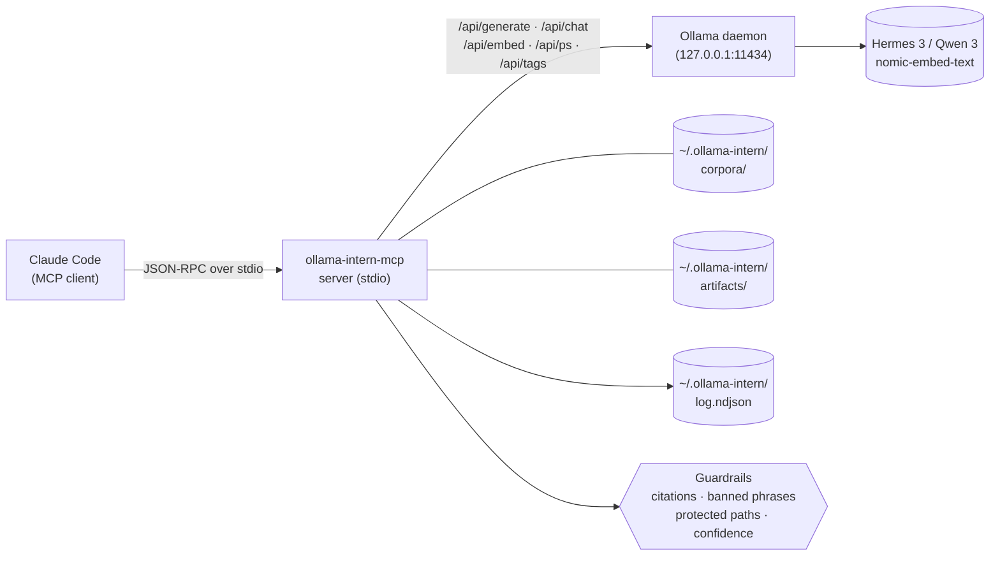

<p align="center">
  <a href="README.ja.md">日本語</a> | <a href="README.zh.md">中文</a> | <a href="README.md">English</a> | <a href="README.fr.md">Français</a> | <a href="README.hi.md">हिन्दी</a> | <a href="README.it.md">Italiano</a> | <a href="README.pt-BR.md">Português (BR)</a>
</p>

<p align="center">
  
</p>

<p align="center">
  <a href="https://github.com/mcp-tool-shop-org/ollama-intern-mcp/actions"></a>
  <a href="LICENSE"></a>
  <a href="https://mcp-tool-shop-org.github.io/ollama-intern-mcp/"></a>
  <a href="https://mcp-tool-shop-org.github.io/ollama-intern-mcp/handbook/"></a>
</p>

**El becario local para Claude Code.** <!-- TOOL_COUNT:start -->42<!-- TOOL_COUNT:end --> herramientas diseñadas para tareas específicas, informes basados en evidencia, artefactos duraderos.

Un servidor MCP que proporciona a Claude Code un **agente local** con reglas, niveles, un escritorio y un archivador. Claude elige la _herramienta_; la herramienta elige el _nivel_ (Instantáneo / Potente / Profundo / Integrado); el nivel escribe un archivo que puedes abrir la semana que viene.

**También ejecuta [Hermes Agent](https://github.com/NousResearch/hermes-agent) en `hermes3:8b`** — validado de extremo a extremo el 19 de abril de 2026. El nivel predeterminado es `hermes3:8b`; `qwen3:*` es la opción alternativa. Consulta [Uso con Hermes](#use-with-hermes) a continuación.

**Requisitos de hardware:** ~6 GB de VRAM para `hermes3:8b`, o ~16 GB de RAM para inferencia en CPU. Consulta [handbook/getting-started](https://mcp-tool-shop-org.github.io/ollama-intern-mcp/handbook/getting-started/#hardware-minimums) para obtener más detalles.

**¿No estás usando Claude?** El directorio [`examples/`](./examples/) contiene un cliente MCP mínimo de Node.js y Python que puedes ejecutar a través de stdio. Consulta también [handbook/with-hermes](https://mcp-tool-shop-org.github.io/ollama-intern-mcp/handbook/with-hermes/).

Sin nube. Sin telemetría. Nada de "autonomía". Cada llamada muestra su trabajo.

---

## Novedades en la versión 2.4.0

Control individual `num_ctx` (tamaño de la ventana de contexto) por nivel en el sistema de perfiles. Pequeña mejora adicional: los usuarios de la versión v2.3.0 no se ven afectados. Detalles en [CHANGELOG.md](./CHANGELOG.md) y [docs/release-notes/v2.4.0.md](./docs/release-notes/v2.4.0.md).

- **Mapa `TierConfig.num_ctx` (nuevo)**: Opcional `{ instant?, workhorse?, deep?, embed? }` en el perfil. Cuando se establece para un nivel, el servidor MCP coloca `options.num_ctx = <valor>` en cada solicitud de generación/chat de Ollama dirigida a ese nivel (inicial + alternativa). Si no se establece, la solicitud omite completamente `num_ctx`, por lo que Ollama utiliza su valor predeterminado cargado con el modelo; se conserva exactamente el comportamiento de la versión v2.3.0.
- **Nuevo campo de la envolvente `num_ctx_used?: number`**: Solo está presente cuando el servidor MCP realmente envió `num_ctx`. No está presente cuando la solicitud permitió que Ollama eligiera. No se debe inferir un valor predeterminado: el servidor MCP no consulta a Ollama para obtener el valor efectivo.
- **Valores predeterminados del perfil**: `dev-rtx5080` / `dev-rtx5080-qwen3` se entregan con `instant: 4096`, `workhorse: 8192`, `deep`/`embed` SIN ESTABLECER. Se dimensionaron para mantener `hermes3:8b` en la memoria VRAM de 16 GB de la RTX 5080 para herramientas rápidas. `m5-max` deja todos los niveles SIN ESTABLECER: la memoria unificada de 128 GB no tiene problemas de desbordamiento.
- **Cierra la fase 1 de diagnóstico de la versión v0.8.0**: `hermes3:8b` con el contexto predeterminado de 32K en la RTX 5080 se volcaba a la CPU y comenzaba a provocar tiempos de espera en las llamadas `ollama_extract` de "workhorse". La versión v2.4.0 evita esto a nivel de perfil.

### Control individual de `num_ctx` (nuevo en v2.4.0)

Perfil (fragmento de `src/profiles.ts`):

```ts
"dev-rtx5080": {
  tiers: {
    instant: "hermes3:8b",
    workhorse: "hermes3:8b",
    deep: "hermes3:8b",
    embed: "nomic-embed-text",
    num_ctx: {
      instant: 4096,    // fast classify/summarize
      workhorse: 8192,  // schema-bound extract / batch
      // deep: UNSET — long-context briefs keep current behavior
      // embed: UNSET — no context-window pressure on embed
    },
  },
  // ... timeouts, prewarm
}
```

Envolvente en una llamada de nivel "workhorse" (por ejemplo, `ollama_extract`):

```jsonc
{
  "result": { /* extracted data */ },
  "tier_used": "workhorse",
  "model": "hermes3:8b",
  "num_ctx_used": 8192,        // present because the profile set workhorse=8192
  // ... rest of envelope unchanged
}
```

En `m5-max` (o cualquier perfil que deje un nivel sin establecer), `num_ctx_used` no está presente en la envolvente y la solicitud enviada a Ollama no incluye el campo `num_ctx`: Ollama utiliza su valor predeterminado cargado con el modelo.

Los operadores configuran ajustando o editando el perfil; no hay una entrada de `num_ctx` por llamada en los esquemas de las herramientas. Si una llamada futura revela la necesidad, el patrón sigue la sobreescritura de `model` de la versión v2.3.0.

### Versiones anteriores — Entregables de la versión 2.3.0

Consulte [CHANGELOG.md](./CHANGELOG.md) y [docs/release-notes/v2.3.0.md](./docs/release-notes/v2.3.0.md) para la entrada completa de la versión v2.3.0 (sobreescritura de modelo por llamada).

## Novedades en la versión 2.3.0

Sobreescritura de modelo por llamada en herramientas basadas en LLM. Pequeña mejora adicional: los usuarios de la versión v2.2.0 no se ven afectados. Detalles en [CHANGELOG.md](./CHANGELOG.md) y [docs/release-notes/v2.3.0.md](./docs/release-notes/v2.3.0.md).

- **Entrada opcional `model: string` en 8 herramientas**: `ollama_extract`, `ollama_classify`, `ollama_summarize_fast`, `ollama_summarize_deep`, `ollama_research`, `ollama_corpus_answer`, `ollama_chat`, `ollama_code_citation`. El primer intento en el nivel de la herramienta se ejecuta con el modelo especificado por el llamador; en caso de tiempo de espera, la cascada `TIER_FALLBACK` existente resuelve el modelo propio del nivel más económico (NO la sobreescritura del llamador). Las herramientas compuestas/resumidas/empaquetadas NO aceptan deliberadamente `model`: los átomos tienen control por llamada, las herramientas compuestas utilizan los valores predeterminados del nivel.
- **Nuevo campo de la envolvente `model_requested?: string`**: Solo está presente cuando se proporcionó la sobreescritura. Los llamadores conscientes de la calibración comparan `model_requested` con `model` para detectar la sustitución de la alternativa: `if (env.model_requested && env.model !== env.model_requested) { /* sustitución */ }`. Las entradas vacías o solo con espacios en blanco generan un error `ZodError` durante el análisis del esquema, no una omisión silenciosa.
- **Corrección de errores: deriva en `src/version.ts`**. La constante de tiempo de ejecución `VERSION` ahora se lee de `package.json` al cargar el módulo; las versiones v2.1.0 y v2.2.0 enviaron información incorrecta con la cadena de identidad "2.0.0". Se agregó una nueva prueba `tests/version.test.ts` que verifica que `VERSION === pkg.version`.

### Sobreescritura de modelo por llamada (nuevo en v2.3.0)

```jsonc
{
  "tool": "ollama_classify",
  "arguments": {
    "text": "patch null pointer in auth",
    "labels": ["feat", "fix", "chore"],
    "frame": "what is the change kind?",
    "model": "hermes3:8b"
  }
}
```

Envolvente:

```jsonc
{
  "result": { "label": "fix", "confidence": 0.9, "off_topic": false, ... },
  "tier_used": "instant",
  "model": "hermes3:8b",
  "model_requested": "hermes3:8b",       // present because override was supplied
  // ... rest of envelope unchanged
}
```

Si el servidor principal o la capa de procesamiento intensivo hubiera alcanzado su límite de tiempo y la solicitud se hubiera redirigido a la capa de respuesta rápida, `env.model` sería el modelo asignado por la capa de respuesta rápida, y `env.fallback_from` sería "workhorse" (servidor principal). `env.model_requested` seguiría siendo "hermes3:8b", y la condición `env.model !== env.model_requested` indica que se ha realizado una sustitución. Esta sustitución se realiza deliberadamente y no se aplica a la capa de menor costo, ya que el modelo elegido podría no ser adecuado para el rol de esa capa.

### Versiones anteriores — Entregables de la versión 2.2.0

Consulte [CHANGELOG.md](./CHANGELOG.md) y [docs/release-notes/v2.2.0.md](./docs/release-notes/v2.2.0.md) para ver la entrada completa de la versión 2.2.0 (relevancia temática contextual + abstención estructurada).

## Novedades en v2.2.0

Contrato de rol de agente local de procesamiento de evidencia: relevancia temática y abstención estructurada. Pequeña adición — las llamadas de la versión v2.1.0 no han cambiado. Consulta las entradas detalladas en [CHANGELOG.md](./CHANGELOG.md) y [docs/release-notes/v2.2.0.md](./docs/release-notes/v2.2.0.md).

- **Extracción basada en el contexto** en `ollama_extract`, `ollama_classify`, `ollama_summarize_fast`, `ollama_summarize_deep` — entrada opcional `frame: string` + salidas estructuradas `frame_alignment` / `on_topic` / `frame_addressed`. Las fuentes que no son relevantes se marcan en lugar de parafrasearse en el esquema.
- **Abstención estructurada** en `ollama_research` — campos `weak` / `abstained` / `sources_address_question`. Un `answer` no vacío con `citations[]` vacío ya no se considera un éxito silencioso.
- **Umbral de relevancia temática** en `ollama_corpus_answer` — `min_top_score` opcional. Si el valor está por debajo del umbral, la herramienta se detiene con `abstained: true` y omite la síntesis. La puntuación de cada cita ahora es visible.
- **Preservación de la puntuación de recuperación** a través de evidencia concisa — `corpusHitsToEvidence` incluye la `score` (y el parámetro `corpus_min_evidence_score` filtra en el momento de la compilación en `incident_brief` / `repo_brief` / `change_brief`).
- **Límites del rango de citas** — `guardrails/citations.ts` rechaza rangos fuera de los límites en `ollama_research`, lo que coincide con el comportamiento existente en `ollama_code_citation`.
- **Documentación del contrato del operador corregida** — corrección de `chunk_id`/`chunk_index` en el README, reescritura de "validado en el lado del servidor", la sección de Leyes de Evidencia está calificada, el eslogan de marketing está anotado.

### Regresión de la semilla — la verificación

El contrato de la sección se verifica contra el fallo literal de la nueva instalación de research-os: arxiv 2112.10422 (Cosmological Standard Timers) en la sección-01 con el título *"¿Qué significa la custodia de la evidencia en los flujos de trabajo de investigación profunda locales frente a la nube con LLM?"* — 9 de 9 pruebas de contrato de LLM simuladas confirman que la fuente que no es relevante ahora está contenida (`frame_alignment.on_topic = false` en la extracción; `off_topic: true` en la clasificación; `frame_addressed: false` en el resumen profundo; `abstained: true` en `corpus_answer` con `min_top_score` establecido).

### Histórico — entregables de v2.1.0

Consulta [CHANGELOG.md](./CHANGELOG.md) para ver la entrada completa de v2.1.0 (paquete de funciones: 13 nuevas herramientas + 4 mejoras + actualización).

---

## Arquitectura general



Cada llamada a una herramienta de Claude se envía al servidor MCP a través de JSON-RPC estándar. El servidor valida la llamada según el esquema [zod](https://zod.dev) de la herramienta, ejecuta las restricciones configuradas (validación de citas, eliminación de frases prohibidas, aplicación de rutas protegidas, umbrales de confianza) y luego la dirige a un renderizador determinista (nivel de artefacto) o a una llamada HTTP a Ollama (todos los demás niveles). El demonio de Ollama nunca ve las rutas proporcionadas por el usuario, solo el nivel del modelo y la solicitud preparada. Cada llamada agrega un evento estructurado al registro NDJSON en `~/.ollama-intern/log.ndjson`, donde `ollama_log_tail` y su shell pueden leerlo.

---

## Ejemplo principal — una llamada, un artefacto

```jsonc
// Claude → ollama-intern-mcp
{
  "tool": "ollama_incident_pack",
  "arguments": {
    "title": "sprite pipeline 5 AM paging regression",
    "logs": "[2026-04-16 05:07] worker-3 OOM killed\n[2026-04-16 05:07] ollama /api/ps reports evicted=true size=8.1GB\n...",
    "source_paths": ["F:/AI/sprite-foundry/src/worker.ts", "memory/sprite-foundry-visual-mastery.md"]
  }
}
```

Devuelve un envoltorio que apunta a un archivo en el disco:

```jsonc
{
  "result": {
    "pack": "incident",
    "slug": "2026-04-16-sprite-pipeline-5-am-paging-regression",
    "artifact_md":   "~/.ollama-intern/artifacts/incident/2026-04-16-sprite-pipeline-5-am-paging-regression.md",
    "artifact_json": "~/.ollama-intern/artifacts/incident/2026-04-16-sprite-pipeline-5-am-paging-regression.json",
    "weak": false,
    "evidence_count": 6,
    "next_checks": ["residency.evicted across last 24h", "OLLAMA_MAX_LOADED_MODELS vs loaded size"]
  },
  "tier_used": "deep",
  "model": "hermes3:8b",
  "hardware_profile": "dev-rtx5080",
  "tokens_in": 4180, "tokens_out": 612,
  "elapsed_ms": 8410,
  "residency": { "in_vram": true, "evicted": false }
}
```

→ `weak: false` significa que se han ensamblado ≥2 elementos de evidencia; NO significa que las hipótesis estén verificadas. Consulta [Leyes de la evidencia](#evidence-laws) a continuación.

Ese archivo Markdown es el resultado del trabajo del becario: encabezados, bloques de evidencia con identificadores citados, la etiqueta de investigación `next_checks`, y una advertencia `weak: true` si la evidencia es insuficiente. Es determinista: el renderizador es código, no una instrucción. (El renderizador es determinista; el *contenido* de las hipótesis y los resultados es generado, así que considérenlo como un borrador, no como algo verificado). Ábrelo mañana, compáralo la semana que viene y expórtalo a un manual utilizando `ollama_artifact_export_to_path`.

Cada competidor en esta categoría comienza con "ahorra tokens". Nosotros comenzamos con "_aquí está el archivo que escribió el becario_".

### Segundo ejemplo: crea un corpus y luego hazle una pregunta

```jsonc
// 1. Build a persistent, searchable corpus over your project.
{ "tool": "ollama_corpus_index",
  "arguments": { "name": "sprite-foundry",
                 "paths": ["F:/AI/sprite-foundry/src"],
                 "embed_model": "nomic-embed-text" } }
// → { chunks_written: 1204, paths_indexed: 312, failed_paths: [] }

// 2. Ask an evidence-bound question against it.
{ "tool": "ollama_corpus_answer",
  "arguments": { "name": "sprite-foundry",
                 "query": "how does the worker handle OOM eviction?",
                 "top_k": 8 } }
// → { answer: "...", citations: [{chunk_index, path}...], weak: false }
```

El servidor valida la identidad de la cita y que cada `chunk_index` esté dentro del rango de los resultados recuperados. NO prueba que cada afirmación generada esté semánticamente respaldada por el contenido del fragmento citado; esa es la responsabilidad del modelo, y una recuperación deficiente aún puede producir respuestas con formato de cita. Consulte la guía completa en [handbook/corpora](https://mcp-tool-shop-org.github.io/ollama-intern-mcp/handbook/corpora/).

---

## Extracción basada en contexto (nuevo en v2.2.0)

`ollama_extract`, `ollama_classify`, `ollama_summarize_fast` y `ollama_summarize_deep` aceptan una entrada opcional `frame: string`. El nombre del "frame" indica la pregunta a la que se espera que responda la fuente; el modelo se instruye para que se abstenga de generar contenido irrelevante en lugar de contenido verdadero pero fuera de tema cuando la fuente no aborda el "frame".

```jsonc
{
  "tool": "ollama_extract",
  "arguments": {
    "text": "<long source document>",
    "schema": { /* your fields */ },
    "frame": "section purpose here — e.g. 'OOM eviction behavior in the sprite worker'"
  }
}
// → result includes frame_alignment: { on_topic: boolean, reason: string, unaddressed_aspects: string[] }
```

Si se omite el `frame`, el comportamiento no cambia con respecto a la versión 2.1.0. Cuando se proporciona, `frame_alignment.on_topic = false` indica que los campos extraídos pueden ser verdaderos para la fuente, pero no relevantes para el "frame"; considérelos como un resumen con `weak: true`: útiles, pero verifiquen antes de incluirlos en la evidencia.

---

## Contrato de abstención (nuevo en v2.2.0)

`ollama_research` devuelve campos de abstención estructurados: `weak: boolean`, `abstained: boolean`, `sources_address_question: boolean | null`. Un `citations[]` vacío con una `answer` no vacía ya no es silencioso; `abstained: true` indica que el modelo se negó a sintetizar porque las rutas proporcionadas por el llamador no abordaban la pregunta. Trate la abstención como un éxito, no como un fracaso: es la herramienta que se niega a convertir una recuperación deficiente en una salida autorizada.

`ollama_corpus_answer` acepta un umbral de relevancia opcional `min_top_score: number` (0.0–1.0). Cuando la puntuación de recuperación superior para una consulta está por debajo de `min_top_score`, la herramienta se detiene con `abstained: true` y omite la síntesis, evitando el modo de falla "5 fragmentos fuera de tema con una puntuación de 0.21 aún generan una respuesta completa" que la regla `weak: true` de la versión 2.1.0 no detectó (la regla `weak: true` solo se activaba cuando `hits.length < 2`). Combine esto con el campo `score` por cita que ahora se muestra en cada cita para auditar la calidad de la recuperación directamente desde el paquete.

---

## ¿Qué hay aquí? — Cuatro niveles, <!-- TOOL_COUNT:start -->42<!-- TOOL_COUNT:end --> herramientas

**Con forma de tarea** significa que cada herramienta define una tarea que se le asignaría a un becario: clasifica esto, extrae eso, triaje estos registros, redacta esta nota de lanzamiento, empaqueta este incidente. La entrada de la herramienta es la especificación de la tarea; la salida es el resultado. No hay una función primitiva genérica `run_model` / `chat_with_llm` en la parte superior.

| Nivel | Cantidad | Qué hay aquí |
|---|---|---|
| **Atoms** | 28 | Elementos básicos diseñados para tareas específicas. **Originales (15):** `classify` (clasificar), `extract` (extraer), `triage_logs` (triaje de registros), `summarize_fast` / `deep` (resumir, rápido / profundo), `draft` (borrador), `research` (investigación), `corpus_search` (búsqueda en corpus) / `answer` (responder) / `index` (indexar) / `refresh` (actualizar) / `list` (listar), `embed_search` (búsqueda de incrustaciones), `embed` (incrustar), `chat` (chat). **+13 añadidos en la versión 2.1.0:** `doctor` (diagnóstico), `log_tail` (seguimiento de registros), `batch_proof_check` (verificación por lotes) (operaciones); `code_map` (mapa de código), `code_citation` (cita de código), `multi_file_refactor_propose` (proponer refactorización de varios archivos), `refactor_plan` (plan de refactorización) (refactorización); `artifact_prune` (poda de artefactos), `hypothesis_drill` (análisis de hipótesis) (artefacto/informe); `corpus_health` (salud del corpus), `corpus_amend` (modificación del corpus), `corpus_amend_history` (historial de modificaciones del corpus), `corpus_rerank` (reordenación del corpus) (corpus). Los elementos básicos que admiten procesamiento por lotes (`classify`, `extract`, `triage_logs`) aceptan `items: [{id, text}]`. |
| **Briefs** | 3 | Resúmenes estructurados con respaldo de evidencia. `incident_brief`, `repo_brief`, `change_brief`. Cada afirmación cita un identificador de evidencia; los desconocidos se eliminan en el servidor. La evidencia débil muestra `weak: true` en lugar de una narrativa falsa. |
| **Packs** | 3 | Tareas compuestas con un flujo de trabajo fijo que escriben datos duraderos en formato Markdown y JSON en el directorio `~/.ollama-intern/artifacts/`. Incluyen `incident_pack`, `repo_pack` y `change_pack`. Renderizadores deterministas: no se realizan llamadas a modelos en la estructura de los artefactos. |
| **Artifacts** | 7 | Interfaz de consistencia sobre las salidas de los paquetes. Incluye `artifact_list`, `read`, `diff`, `export_to_path`, y tres fragmentos deterministas: `incident_note`, `onboarding_section` y `release_note`. |

Total: **28 elementos básicos + 3 informes + 3 paquetes + 7 herramientas de artefactos = <!-- TOOL_COUNT:start -->42<!-- TOOL_COUNT:end -->**.

Líneas congeladas:
- Elementos básicos: congelados, **levantada en la versión 2.1.0** (28 actualmente; +13 añadidos en la versión 2.1.0). Los nuevos elementos básicos aún requieren una justificación auditada, pruebas, una página del manual y una entrada en el CHANGELOG; no se permiten adiciones casuales.
- Los paquetes están congelados en 3. No hay nuevos tipos de paquetes.
- El nivel de artefacto está congelado en 7.

La referencia completa de las herramientas se encuentra en el [manual](https://mcp-tool-shop-org.github.io/ollama-intern-mcp/handbook/tools/).

---

## Instalación

Requiere que [Ollama](https://ollama.com) se ejecute localmente y que se hayan descargado los modelos correspondientes (ver la sección [Descarga de modelos](#model-pulls) a continuación).

### Claude Code (recomendado)

La mayoría de los usuarios instalan esto agregándolo a la configuración del servidor MCP de Claude Code; no se requiere una instalación global. Claude Code ejecuta el servidor bajo demanda mediante `npx`:

```json
{
  "mcpServers": {
    "ollama-intern": {
      "command": "npx",
      "args": ["-y", "ollama-intern-mcp"],
      "env": {
        "OLLAMA_HOST": "http://127.0.0.1:11434",
        "INTERN_PROFILE": "dev-rtx5080"
      }
    }
  }
}
```

### Claude Desktop

Mismo bloque, escrito en `~/Library/Application Support/Claude/claude_desktop_config.json` (macOS) o `%APPDATA%\Claude\claude_desktop_config.json` (Windows).

### Instalación global (avanzado)

Solo es necesario si desea tener el ejecutable en su `PATH` para uso ad-hoc fuera de Claude Code:

```bash
npm install -g ollama-intern-mcp
```

### Uso con Hermes

Este MCP se validó de extremo a extremo con [Hermes Agent](https://github.com/NousResearch/hermes-agent) contra `hermes3:8b` en Ollama (19 de abril de 2026). Hermes es un agente externo que *llama* a la interfaz de elementos básicos congelados de este MCP; él se encarga de la planificación, y nosotros realizamos el trabajo.

Configuración de referencia ([hermes.config.example.yaml](hermes.config.example.yaml) en este repositorio):

```yaml
model:
  provider: custom
  base_url: http://localhost:11434/v1
  default: hermes3:8b
  context_length: 65536    # Hermes requires 64K floor under model.*

providers:
  local-ollama:
    name: local-ollama
    base_url: http://localhost:11434/v1
    api_mode: openai_chat
    api_key: ollama
    model: hermes3:8b

mcp_servers:
  ollama-intern:
    command: npx
    args: ["-y", "ollama-intern-mcp"]
    env:
      OLLAMA_HOST: http://localhost:11434
      INTERN_PROFILE: dev-rtx5080
      # hermes3:8b is the default ladder in v2.0.0, so tier overrides are
      # only needed if you're pinning a different local model.
```

**La estructura de la solicitud es importante.** Las solicitudes de invocación de herramientas imperativas ("Llama a X con argumentos...") son la prueba de integración; proporcionan a un modelo local de 8B suficiente estructura para generar `tool_calls` limpios. Las solicitudes de tareas múltiples en formato de lista ("haz A, luego B, luego C") son puntos de referencia de capacidad para modelos más grandes; no interpretes un fallo en formato de lista en un modelo de 8B como "el sistema está roto". Consulta [handbook/with-hermes](https://mcp-tool-shop-org.github.io/ollama-intern-mcp/handbook/with-hermes/) para obtener una guía completa de la integración y las advertencias de transporte conocidas (transmisión de Ollama `/v1` + shim no de transmisión de openai-SDK).

### Descarga de modelos

**Perfil de desarrollo predeterminado (RTX 5080 16GB y similar):**

```bash
ollama pull hermes3:8b
ollama pull nomic-embed-text
export OLLAMA_MAX_LOADED_MODELS=2
export OLLAMA_KEEP_ALIVE=-1
```

**Ruta alternativa de Qwen 3 (mismo hardware, para herramientas de Qwen):**

```bash
ollama pull qwen3:8b
ollama pull qwen3:14b
ollama pull nomic-embed-text
export INTERN_PROFILE=dev-rtx5080-qwen3
```

**Perfil de M5 Max (128GB unificados):**

```bash
ollama pull qwen3:14b
ollama pull qwen3:32b
ollama pull nomic-embed-text
export INTERN_PROFILE=m5-max
```

Las variables de entorno por nivel (`INTERN_TIER_INSTANT`, `INTERN_TIER_WORKHORSE`, `INTERN_TIER_DEEP`, `INTERN_EMBED_MODEL`) aún anulan las selecciones de perfil para casos individuales.

---

## Interfaz uniforme

Cada herramienta devuelve la misma estructura:

```ts
{
  result: <tool-specific>,
  tier_used: "instant" | "workhorse" | "deep" | "embed",
  model: string,
  hardware_profile: string,     // "dev-rtx5080" | "dev-rtx5080-qwen3" | "m5-max"
  tokens_in: number,
  tokens_out: number,
  elapsed_ms: number,
  residency: {
    in_vram: boolean,
    size_bytes: number,
    size_vram_bytes: number,
    evicted: boolean
  } | null
}
```

`residency` proviene de `/api/ps` de Ollama. Cuando `evicted: true` o `size_vram < size`, el modelo se carga en el disco y la inferencia disminuye entre 5 y 10 veces; muestra esto al usuario para que sepa que debe reiniciar Ollama o reducir el número de modelos cargados.

Cada llamada se registra como una línea en `~/.ollama-intern/log.ndjson`. Filtra por `hardware_profile` para evitar que los datos de desarrollo contaminen los puntos de referencia publicados.

---

## Perfiles de hardware

| Perfil | Instantáneo | Workhorse | Profundo | Embed |
|---|---|---|---|---|
| **`dev-rtx5080`** (predeterminado) | hermes3 8B | hermes3 8B | hermes3 8B | nomic-embed-text |
| `dev-rtx5080-qwen3` | qwen3 8B | qwen3 8B | qwen3 14B | nomic-embed-text |
| `m5-max` | qwen3 14B | qwen3 14B | qwen3 32B | nomic-embed-text |

**Configuración predeterminada de desarrollo:** Esta configuración consolida los tres niveles de trabajo en `hermes3:8b`, que es la ruta de integración validada de Hermes Agent. Utilizar el mismo modelo de principio a fin significa que solo hay un componente que descargar, un único costo de uso y un único conjunto de comportamientos que comprender. Los usuarios que prefieren Qwen 3 (con su mecanismo `THINK_BY_SHAPE`) pueden optar por la configuración `dev-rtx5080-qwen3`. `m5-max` es la versión de Qwen 3 optimizada para memoria unificada.

---

## Leyes de evidencia

Estas reglas se aplican en el servidor, no en la solicitud:

- **Se requieren citas.** Cada afirmación breve cita un identificador de evidencia.
- **Información desconocida se elimina en el servidor.** Los modelos que citan identificadores que no están en el conjunto de evidencia tienen esos identificadores eliminados, con una advertencia, antes de que se devuelva el resultado.
- **Validación por ID, no por contenido.** El servidor verifica que cada `evidence_ref` citado apunte a un identificador de evidencia real en el conjunto ensamblado. NO verifica que el texto de la afirmación se pueda derivar de la evidencia citada; esa es la tarea del modelo. A veces, las afirmaciones débiles contienen afirmaciones no respaldadas con referencias válidas. Utilice `weak: true` + notas de cobertura + el campo `excerpt` incluido para realizar una verificación puntual.
- **"Débil" significa "débil".** La evidencia con poca solidez se marca como `weak: true` con notas de cobertura. Nunca se suaviza para crear una narrativa falsa.
- **Investigación, no prescripción.** Solo se incluyen `next_checks` / `read_next` / `likely_breakpoints`. Las solicitudes prohíben la instrucción "aplique esta corrección".
- **Renderizado determinista.** La forma del marcado de los artefactos es código, no una solicitud. `draft` se reserva para texto donde la redacción del modelo es importante.
- **Solo diferencias dentro del mismo paquete.** Se rechaza explícitamente cualquier `artifact_diff` entre paquetes; los paquetes permanecen distintos.

---

## Artefactos y continuidad

Los paquetes escriben en `~/.ollama-intern/artifacts/{incident,repo,change}/<slug>.(md|json)`. El nivel de artefactos proporciona una superficie de continuidad sin convertir esto en una herramienta de gestión de archivos:

- `artifact_list`: índice que contiene solo metadatos, filtrable por paquete, fecha, patrón de slug.
- `artifact_read`: lectura tipada por `{pack, slug}` o `{json_path}`.
- `artifact_diff`: comparación estructurada dentro del mismo paquete; se muestra la posibilidad de una corrección.
- `artifact_export_to_path`: escribe un artefacto existente (con un encabezado de procedencia) en una ubicación declarada por el usuario en `allowed_roots`. Rechaza archivos existentes a menos que `overwrite: true`.
- `artifact_incident_note_snippet`: fragmento de nota del operador.
- `artifact_onboarding_section_snippet`: fragmento del manual.
- `artifact_release_note_snippet`: fragmento de nota de la versión (BORRADOR).

No hay llamadas a modelos en este nivel. Todo se genera a partir de contenido almacenado.

---

## Modelo de amenazas y telemetría

**Datos accedidos:** rutas de archivos que el usuario proporciona explícitamente (`ollama_research`, herramientas de corpus), texto incrustado y artefactos que el usuario solicita que se escriban en `~/.ollama-intern/artifacts/` o en una ubicación declarada por el usuario en `allowed_roots`.

**Datos NO accedidos:** cualquier cosa fuera de `source_paths` / `allowed_roots`. Se rechaza `..` antes de la normalización. `artifact_export_to_path` rechaza archivos existentes a menos que `overwrite: true`. Los borradores dirigidos a rutas protegidas (`memory/`, `.claude/`, `docs/canon/`, etc.) requieren explícitamente `confirm_write: true`, lo que se aplica en el servidor.

**Tráfico de salida:** **deshabilitado de forma predeterminada.** El único tráfico de salida es al punto final HTTP local de Ollama. No hay llamadas a la nube, ni notificaciones de actualización, ni informes de fallos.

**Telemetría:** **ninguna.** Cada llamada se registra como una línea NDJSON en `~/.ollama-intern/log.ndjson` en su máquina. Nada sale del sistema.

**Errores:** estructura `{ code, message, hint, retryable }`. Los rastros de pila nunca se muestran a través de los resultados de la herramienta.

Política completa: [SECURITY.md](SECURITY.md).

---

## Estándares

Construido según el estándar de [Shipcheck](https://github.com/mcp-tool-shop-org/shipcheck). Se superan las pruebas A–D; consulte [SHIP_GATE.md](SHIP_GATE.md) y [SCORECARD.md](SCORECARD.md).

- **A. Seguridad** — SECURITY.md, modelo de amenazas, sin telemetría, seguridad de rutas, `confirm_write` en rutas protegidas.
- **B. Errores** — Estructura consistente en todos los resultados de las herramientas; sin pilas de errores sin procesar.
- **C. Documentación** — README actualizado, CHANGELOG, LICENCIA; los esquemas de las herramientas se auto-documentan.
- **D. Mantenimiento** — `npm run verify` (conjunto completo de pruebas de vitest), CI con análisis de dependencias, Dependabot, archivo de bloqueo, `engines.node`.

---

## Hoja de ruta (endurecimiento, no ampliación del alcance)

- **Fase 1 — Núcleo de Delegación** ✓ Implementado: interfaz de Atom, envoltorio uniforme, enrutamiento por niveles, mecanismos de protección.
- **Fase 2 — Núcleo de Veracidad** ✓ Implementado: fragmentación de esquemas v2, BM25 + RRF, corpus vivos, resúmenes respaldados por evidencia, paquete de evaluación de recuperación.
- **Fase 3 — Núcleo de Paquetes y Artefactos** ✓ Implementado: paquetes con canalizaciones fijas y artefactos duraderos + nivel de continuidad.
- **Fase 4 — Núcleo de Adopción** ✓ v2.0.1: corpus de salud endurecido en tres etapas (protección contra ataques TOCTOU, límite de archivo de 50 MB, rechazo de enlaces simbólicos, escrituras atómicas, captura de fallos por archivo), recorrido de rutas de herramientas, observabilidad (registro de eventos de espera de semáforos, contexto de error de tiempo de espera, registro de anulación de entorno, señal de precalentamiento para inicio en frío), seguridad de pruebas (instantánea del entorno de carga de módulos en 10 archivos, `tools/call` de extremo a extremo). Se agregó un manual de solución de problemas y los requisitos mínimos de hardware para los operadores.
- **Fase 5 — Pruebas de rendimiento en M5 Max** — Números publicables una vez que se disponga del hardware (aproximadamente 24 de abril de 2026).

Fase por capa de endurecimiento. Los niveles de paquete y artefacto permanecen congelados en 3 y 7. La congelación de los elementos básicos se levantó en la versión 2.1.0; los nuevos elementos básicos requieren una justificación auditada, pruebas, una página del manual y una entrada en el CHANGELOG.

---

## Licencia

MIT — ver [LICENCIA](LICENCIA).

---

<p align="center">Built by <a href="https://mcp-tool-shop.github.io/">MCP Tool Shop</a></p>
