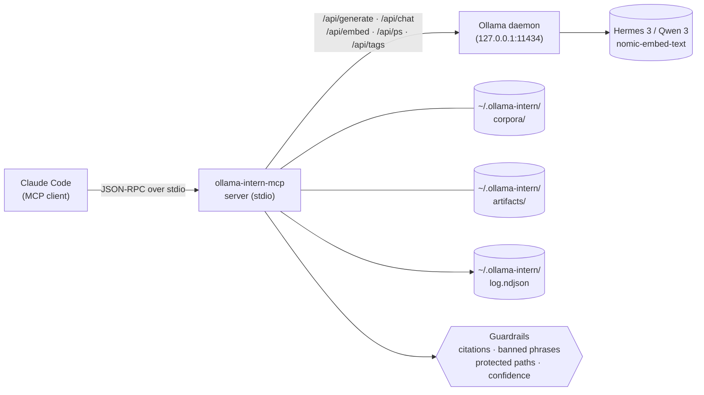

<p align="center">
  <a href="README.ja.md">日本語</a> | <a href="README.zh.md">中文</a> | <a href="README.md">English</a> | <a href="README.fr.md">Français</a> | <a href="README.hi.md">हिन्दी</a> | <a href="README.it.md">Italiano</a> | <a href="README.pt-BR.md">Português (BR)</a>
</p>

<p align="center">
  
</p>

<p align="center">
  <a href="https://github.com/mcp-tool-shop-org/ollama-intern-mcp/actions"></a>
  <a href="LICENSE"></a>
  <a href="https://mcp-tool-shop-org.github.io/ollama-intern-mcp/"></a>
  <a href="https://www.npmjs.com/package/ollama-intern-mcp"></a>
  <a href="https://mcp-tool-shop-org.github.io/ollama-intern-mcp/handbook/"></a>
  <a href="#ollama-cloud"></a>
</p>

> **El becario local para Claude Code.** <!-- TOOL_COUNT:start -->44<!-- TOOL_COUNT:end --> herramientas diseñadas para tareas específicas, resúmenes basados en evidencia, artefactos duraderos.

Un servidor MCP que proporciona a Claude Code un **becario local** con reglas, niveles, un escritorio y un archivador. Claude elige la _herramienta_; la herramienta elige el _nivel_ (Instantáneo / De trabajo intensivo / Profundo / Integrado); el nivel escribe un archivo que puedes abrir la semana que viene.

**También ejecuta [Hermes Agent](https://github.com/NousResearch/hermes-agent) en `hermes3:8b`** — validado de extremo a extremo el 19 de abril de 2026. La escala predeterminada es `hermes3:8b`; `qwen3:*` es la vía alternativa. Consulte [Uso con Hermes](#use-with-hermes) a continuación.

**Requisitos de hardware:** ~6 GB de VRAM para `hermes3:8b`, o ~16 GB de RAM para la inferencia en CPU. Consulte [handbook/getting-started](https://mcp-tool-shop-org.github.io/ollama-intern-mcp/handbook/getting-started/#hardware-minimums) para obtener información detallada.

**¿No estás usando Claude?** El directorio [`examples/`](./examples/) tiene un cliente MCP mínimo de Node.js y Python que puedes ejecutar a través de stdio. Consulte también [handbook/with-hermes](https://mcp-tool-shop-org.github.io/ollama-intern-mcp/handbook/with-hermes/).

**Prioridad local** — cero salida de red hasta que decidas activarla. Sin telemetría. Nada "autónomo". Cada llamada muestra su proceso.

**¿No tienes una GPU lo suficientemente potente? [Ollama Cloud](#ollama-cloud) ejecuta todas las <!-- TOOL_COUNT:start -->44<!-- TOOL_COUNT:end --> herramientas en modelos de la clase 600B.** La mayoría de las personas no pueden alojar un modelo de vanguardia en su propia tarjeta; esa es la verdadera limitación de la IA local, y esta solución la supera. La misma superficie `/api/*`, las mismas herramientas diseñadas para tareas específicas, los mismos parámetros; las incrustaciones permanecen locales; cualquier fallo en la nube vuelve automáticamente a tu perfil local. Escala **una** llamada (`backend: "cloud"`) o enruta cada llamada generativa (`OLLAMA_CLOUD_PRIMARY=1`), y cada parámetro te indica qué backend la atendió. Desactivado hasta que establezcas una clave.

---

## Nuevo en la v2.10.0

**La versión que prioriza la honestidad en la nube.** La v2.9.0 incluyó la escalada a la nube por llamada y este archivo README anunciaba "escala una revisión de alta importancia a un modelo de 600B", pero la entrada `backend` existía en exactamente **una** de las 44 herramientas, y era `ollama_chat`, que su propia descripción califica como último recurso. Cada tarea de revisión estaba asignada a un modelo local de 8B. La prioridad local no ha cambiado: no tener una clave sigue significando cero salida de red y ninguna sonda de inicio, las incrustaciones nunca abandonan el sistema y cada nueva opción tiene por defecto el comportamiento actual.

- **La escalada por llamada ahora llega a 15 herramientas, no a 1.** `backend: "cloud"` es una entrada opcional en `research`, `summarize_deep`, `code_review`, `code_citation`, `corpus_answer`, `hypothesis_drill`, `multi_file_refactor_propose`, `refactor_plan`, los tres resúmenes, los tres paquetes y `chat`. Omitirla y el comportamiento será idéntico a la v2.9.x. **Los paquetes escalan solo su paso de síntesis** —el ensamblaje de evidencia, la clasificación y la escritura de artefactos permanecen locales— y rechazan una escalada que no se pueda atender *antes* de realizar cualquier trabajo local.
- **`INTERN_CLOUD_STANDBY_TIERS` — declara la política una sola vez.** Indica qué niveles (`instant|workhorse|deep`) escalarán en modo de espera sin una directiva por llamada. Vacío por defecto. Una directiva `backend` por llamada sigue teniendo prioridad en ambas direcciones. `embed` se rechaza al cargar la configuración *y* en la capa de enrutamiento: las incrustaciones siempre permanecen locales.
- **`doctor --cloud-check` — demuestra que la clave realmente funciona.** La sonda anterior accedía a `/api/tags`, que devuelve 200 para una clave no válida, por lo que la autenticación solo podía leer "no verificada". Esto ejecuta una generación de 8 tokens y devuelve `ok` / `failed` / `unverified` / `unreachable` —cuatro estados que se mantienen distintos a propósito, porque un error 404 en un ID de modelo no es un problema de clave y no debería hacer que busques una. También informa de cada ID de nube configurado como presente o NO EN EL CATÁLOGO con una sugerencia del ID activo más cercano, para que se encuentre un ID retirado antes de que pagues por una llamada degradada.
- **Corregido: `init` estaba roto en cada instalación de npm.** `hermes.config.example.yaml` nunca llegó al archivo tar publicado, por lo que el binario informaba de su propio error de "error de empaquetado" a cualquiera que lo instalara desde npm. Ahora se incluye y el CI instala y ejecuta el archivo tar empaquetado para que no pueda volver a ocurrir.
- **Las puntuaciones de recuperación finalmente son comparables.** `CorpusHit.score` contenía cuatro escalas incomparables bajo un solo campo: el modo híbrido predeterminado llegaba a `0.0328`, mientras que `corpus_min_evidence_score` se documentaba como "0–1", por lo que un límite natural de `0.1` eliminaba silenciosamente cada fragmento del corpus. Las puntuaciones fusionadas se vuelven a escalar a 0–1 y cada resultado contiene `score_scale`.

Más detalles en [CHANGELOG.md](./CHANGELOG.md).

## Nuevo en la v2.9.0

**La actualización de las funciones de la nube: una vía de verificación entre familias, escalada a la nube bajo demanda y la economía para verlo.** La prioridad local no ha cambiado: sin una clave establecida, el comportamiento es idéntico a la v2.8.0 (cero salida de red, sin sonda de inicio en la nube).

- **`ollama_verify_claims`: verificación entre diferentes modelos.** `ollama_code_review` *genera* resultados; esto *valida* los resultados. Ejecuta un panel principal de Ollama Cloud con modelos de diferentes familias (deepseek / kimi / glm por defecto) sobre sus afirmaciones y pruebas, y devuelve por cada afirmación: CONFIRMADA / REFUTADA / NECESITA REVISIÓN. La agregación se basa en el principio de que la disidencia individual no es decisiva (≥2 para refutar, ≥2 para confirmar); cada evaluador utiliza un modelo verificado (se excluye un modelo local de respaldo o sustituto, y nunca se tiene en cuenta); y las entradas de las afirmaciones están estructuradas para eliminar cualquier razonamiento. El límite de honestidad está documentado: una afirmación CONFIRMADA es una evidencia de apoyo, no una prueba — es fiable para señalar errores graves, pero menos eficaz para detectar errores sutiles en un modelo de vanguardia.
- **Escalado en la nube por llamada + modo de espera.** Configure `OLLAMA_API_KEY` *solo* (sin `OLLAMA_CLOUD_PRIMARY`) y estará en **modo de espera**: modelo local principal, sin transferencia de datos, sin sonda de inicio, hasta que una sola llamada active la opción con `backend:'cloud'`. Escale una revisión de alta importancia a un modelo de 600B sin cambiar todas las llamadas a la nube. La primera escalada revela la transferencia de datos de forma clara en el momento en que ocurre; una anulación `model` por llamada ahora se aplica a la solicitud de la nube de forma literal.
- **`ollama_log_stats`: la economía medida que promete el eslogan.** Un resumen sin LLM de sus recibos NDJSON: división entre nube y local, tasa de respaldo de nube a local, tokens por herramienta, p50/p95 de latencia, limitado por una ventana `since`.
- **Herramienta de diagnóstico para CI + herramientas legibles por máquina.** `doctor --json --fail-unhealthy` proporciona a las canalizaciones una puerta de enlace real (con una bandera `healthy` que tiene en cuenta la nube), y cada herramienta ahora incluye anotaciones MCP `readOnlyHint`/`destructiveHint`/`title` para que los clientes obtengan la interfaz de usuario de permisos correcta. Además, `init --claude` crea un fragmento listo para pegar `.mcp.json`.

Todos los detalles en [CHANGELOG.md](./CHANGELOG.md).

## Novedades en la v2.8.0

**Mayor fiabilidad, durabilidad y seguridad: 25 correcciones, todas ellas con pruebas iniciales y verificación entre diferentes modelos.** El comportamiento predeterminado es local y no se ha eliminado ningún contrato de herramienta; las llamadas existentes siguen funcionando. Las ventajas son significativas:

- **Ya no se produce la pérdida silenciosa de datos del corpus.** Un error de lectura transitorio durante `ollama_corpus_refresh` (un bloqueo de archivos de Windows, una retención de un antivirus, una ventana de guardado de un editor) solía clasificar el archivo como "faltante" y **eliminar permanentemente su contenido indexado**. Ahora, solo se elimina un archivo que realmente no existe; un error transitorio conserva la ruta, lo marca para que se reintente y preserva sus fragmentos.
- **Concurrencia que respeta sus límites.** Un tiempo de espera de nivel ahora puede cancelar una llamada que aún está en cola para obtener un permiso (antes, se quedaba bloqueada mucho después del límite, mientras que los recibos indicaban lo contrario), y `ollama_chat` finalmente se enruta a través del límite de tiempo de espera/nivel, de modo que una generación local bloqueada no pueda detener todas las herramientas y, de hecho, llegue a la nube en el modo de nube principal.
- **La nube se degrada en lugar de dejar de funcionar.** Un ID de modelo de nube retirado ahora vuelve a un modelo local con una razón clara `cloud_model_missing` y una sugerencia específica de la nube en lugar de una interrupción total; el interruptor automático no puede bloquearse permanentemente; un modelo que falta persistentemente deja de realizar solicitudes de ida y vuelta a la nube en cada llamada.
- **Superficie de seguridad que coincide con su documentación.** `ollama_batch_proof_check` ahora realmente aplica la contención de cwd (con una nueva restricción de entorno del operador `INTERN_BATCH_PROOF_ALLOWED_ROOTS` que un llamador no puede ampliar), los sanitizadores de inyección de prompts han ganado cobertura y tienen un límite honestamente divulgado, y la protección de la ruta es insensible a mayúsculas y minúsculas en macOS.
- **Artefactos y recibos honestos.** Las escrituras de paquetes son atómicas y nunca se sobrescriben silenciosamente; los sobres de lotes degradados informan del nivel que se utilizó realmente; el detector de escrituras interrumpidas detecta las escrituras incompletas en cualquier modificación; los ID de fragmentos ya no entran en conflicto entre archivos con contenido idéntico. La auditoría de dependencias es completamente clara (0 vulnerabilidades).

Todos los detalles en [CHANGELOG.md](./CHANGELOG.md).

## Novedades en la v2.7.0

**Enrutamiento opcional a Ollama Cloud: nube principal, respaldo local.** Active la opción con una clave y una bandera, y los niveles generativos se enrutarán a un modelo de nube de clase 600B; las incrustaciones permanecen locales; un interruptor automático vuelve a su perfil local en caso de fallo de la nube. **Desactivado por defecto: sin transferencia de datos a menos que configure tanto `OLLAMA_API_KEY` como `OLLAMA_CLOUD_PRIMARY=1`.** Mejora menor aditiva: las llamadas anteriores a la v2.7.0 (y cualquier persona que no active la opción) verán un comportamiento idéntico. Consulte [Ollama Cloud](#ollama-cloud).

- **Nube principal con una red de seguridad.** Una `RoutingOllamaClient` intenta primero la nube y vuelve al perfil local en caso de tiempo de espera / 5xx / 429 / problema de red. Las claves incorrectas (401/403) se muestran claramente a través de un interruptor automático persistente en lugar de degradarse silenciosamente para siempre; un ID de modelo de nube retirado o con errores tipográficos (404) también se muestra.
- **Nunca una degradación silenciosa.** Cada sobre obtiene `backend` (`cloud`|`local`), `degraded` y `degrade_reason` para que siempre sepa cuándo obtuvo el modelo local en lugar del modelo grande. Un evento NDJSON `backend_fallback` hace que la tasa de respaldo de nube a local sea visible en `ollama_log_tail`.
- **`ollama_doctor` informa sobre la autenticación y la accesibilidad de la nube** como un bloque distinto; `ollama-intern-mcp doctor` muestra una sección `Cloud (primary)`.
- El modelo de nube predeterminado era `minimax-m3:cloud` en el lanzamiento de la v2.7.0 *(desde que se volvió a fijar a `qwen3-coder-next:cloud`: un valor predeterminado reflexivo devolvía respuestas vacías en herramientas con límites de `num_predict`; consulte la [tabla de entornos](#cloud-env-vars))*; anule por nivel con `INTERN_CLOUD_MODEL` / `INTERN_CLOUD_DEEP_MODEL`.

## Novedades en la v2.6.0

Anulación del presupuesto de nivel por llamada en `ollama_extract`. Mejora menor aditiva: las llamadas anteriores a la v2.6.0 no se ven afectadas. Entrada detallada en [CHANGELOG.md](./CHANGELOG.md).

- **`tier_budget_ms_override?: number` schema field on `ollama_extract`** (optional, bounded `[1, 600000]` ms). When present, applies the override to every tier visited by the runner so the inner `runWithTimeoutAndFallback` machinery at `src/guardrails/timeouts.ts:61` honors the operator-supplied budget instead of the profile default. The cascade (workhorse → instant on timeout) still fires; the override governs each cascade hop uniformly.
- **Why this exists.** The research-os R-018 wrapper (v0.12.1) wrapped MCP `callTool` with `Promise.race` and found the wrapper's budget did not reach the inner tier — `DEV_RTX5080_TIMEOUTS.instant = 15_000` continued to fire `TIER_TIMEOUT` at 15000ms regardless of a 180000ms wrapper budget. v2.6.0 supplies the MCP-side authoritative budget so the operator's `--planner-timeout-ms` flag (research-os) finally controls inner-tier timeouts as designed.
- **Default behavior preserved.** Field omitted = profile defaults govern byte-identically. Pre-v2.6.0 callers see zero change.
- **R-010 fallback-cause regex preserved.** Server-side `TIER_TIMEOUT` error message still matches `/elapsed=(\d+)ms/` + `/budget=(\d+)ms/` so AI-advisor visibility downstream works on override and default paths alike.
- Consumed by research-os v0.13.0 (cumulative R-019 client wire-up + R-020 + R-021) in a coordinated multi-repo release.

### Histórico: entregables de v2.4.0

Consulte [CHANGELOG.md](./CHANGELOG.md) y [docs/release-notes/v2.4.0.md](./docs/release-notes/v2.4.0.md) para obtener la entrada completa de v2.4.0 (control por nivel `num_ctx` en el sistema de perfiles).

## Novedades en v2.4.0

Control por nivel `num_ctx` (ventana de contexto) en el sistema de perfiles. Mejora menor aditiva: los usuarios de v2.3.0 no se verán afectados. Entradas detalladas en [CHANGELOG.md](./CHANGELOG.md) y [docs/release-notes/v2.4.0.md](./docs/release-notes/v2.4.0.md).

- **Mapa `TierConfig.num_ctx` (nuevo)**: `{ instant?, workhorse?, deep?, embed? }` opcional en el perfil. Cuando se establece para un nivel, el servidor MCP coloca `options.num_ctx = <value>` en cada solicitud de generación/chat de Ollama enrutada a ese nivel (inicial + de respaldo). Cuando no se establece, la solicitud omite `num_ctx` por completo, por lo que Ollama utiliza su valor predeterminado cargado en el modelo; se conserva exactamente el comportamiento de v2.3.0.
- **Nuevo campo de envoltorio `num_ctx_used?: number`**: presente solo cuando el servidor MCP realmente envió `num_ctx`. Ausente cuando la solicitud permitió que Ollama eligiera. No infiera un valor predeterminado: el servidor MCP no consulta a Ollama para obtener el valor efectivo.
- **Valores predeterminados del perfil**: `dev-rtx5080` / `dev-rtx5080-qwen3` se envían con `instant: 4096`, `workhorse: 8192`, `deep`/`embed` NO ESTABLECIDOS. Dimensionados para mantener `hermes3:8b` residente en los 16 GB de VRAM de la RTX 5080 para herramientas rápidas. `m5-max` deja cada nivel NO ESTABLECIDO: los 128 GB de memoria unificada no tienen problemas de desbordamiento.
- **Cierra el diagnóstico de la fase 1 de v0.8.0**: `hermes3:8b` en el contexto predeterminado de 32K en la RTX 5080 se desbordó a la CPU y comenzó a provocar tiempos de espera en las llamadas del motor principal `ollama_extract`. v2.4.0 evita esto en la capa del perfil.

### Control por nivel `num_ctx` (novedad en v2.4.0)

Perfil (extracto de `src/profiles.ts`):

```ts
"dev-rtx5080": {
  tiers: {
    instant: "hermes3:8b",
    workhorse: "hermes3:8b",
    deep: "hermes3:8b",
    embed: "nomic-embed-text",
    num_ctx: {
      instant: 4096,    // fast classify/summarize
      workhorse: 8192,  // schema-bound extract / batch
      // deep: UNSET — long-context briefs keep current behavior
      // embed: UNSET — no context-window pressure on embed
    },
  },
  // ... timeouts, prewarm
}
```

Envoltorio en una llamada al nivel del motor principal (por ejemplo, `ollama_extract`):

```jsonc
{
  "result": { /* extracted data */ },
  "tier_used": "workhorse",
  "model": "hermes3:8b",
  "num_ctx_used": 8192,        // present because the profile set workhorse=8192
  // ... rest of envelope unchanged
}
```

En `m5-max` (o cualquier perfil que deje un nivel sin establecer), `num_ctx_used` está ausente del envoltorio y la solicitud de red a Ollama no incluye el campo `num_ctx`; Ollama utiliza su valor predeterminado cargado en el modelo.

Los operadores ajustan seleccionando/editando el perfil; no hay una entrada `num_ctx` por llamada en los esquemas de herramientas. Si una llamada futura revela la necesidad, el patrón sigue la anulación `model` de v2.3.0.

### Histórico: entregables de v2.3.0

Consulte [CHANGELOG.md](./CHANGELOG.md) y [docs/release-notes/v2.3.0.md](./docs/release-notes/v2.3.0.md) para obtener la entrada completa de v2.3.0 (anulación del modelo por llamada).

## Novedades en v2.3.0

Anulación del modelo por llamada en las herramientas atómicas basadas en LLM. Mejora menor aditiva: los usuarios de v2.2.0 no se verán afectados. Entradas detalladas en [CHANGELOG.md](./CHANGELOG.md) y [docs/release-notes/v2.3.0.md](./docs/release-notes/v2.3.0.md).

- **Entrada `model: string` opcional en 8 herramientas atómicas**: `ollama_extract`, `ollama_classify`, `ollama_summarize_fast`, `ollama_summarize_deep`, `ollama_research`, `ollama_corpus_answer`, `ollama_chat`, `ollama_code_citation`. El primer intento en el nivel de la herramienta se realiza con el modelo especificado por el llamante; en caso de tiempo de espera, la cascada `TIER_FALLBACK` existente resuelve el modelo del nivel más económico (NO la anulación del llamante). Las herramientas compuestas/breves/de empaquetado NO aceptan deliberadamente `model`; las herramientas atómicas obtienen control por llamada, las herramientas compuestas utilizan los valores predeterminados del nivel.
- **Nuevo campo de envoltorio `model_requested?: string`**: presente solo cuando se proporcionó la anulación. Los llamantes con conocimiento de la calibración comparan `model_requested` con `model` para detectar la sustitución de respaldo: `if (env.model_requested && env.model !== env.model_requested) { /* substitution */ }`. Las entradas vacías o que solo contienen espacios en blanco generan `ZodError` en el análisis del esquema, no una conmutación silenciosa.
- **Corrección de errores: deriva `src/version.ts`.** La constante de tiempo de ejecución `VERSION` ahora se lee de `package.json` en el momento de la carga del módulo; v2.1.0 y v2.2.0 se enviaron informando la cadena de identidad obsoleta `"2.0.0"`. La nueva `tests/version.test.ts` bloquea `VERSION === pkg.version`.

### Anulación del modelo por llamada (novedad en v2.3.0)

```jsonc
{
  "tool": "ollama_classify",
  "arguments": {
    "text": "patch null pointer in auth",
    "labels": ["feat", "fix", "chore"],
    "frame": "what is the change kind?",
    "model": "hermes3:8b"
  }
}
```

Envoltorio:

```jsonc
{
  "result": { "label": "fix", "confidence": 0.9, "off_topic": false, ... },
  "tier_used": "instant",
  "model": "hermes3:8b",
  "model_requested": "hermes3:8b",       // present because override was supplied
  // ... rest of envelope unchanged
}
```

Si el nivel del motor principal o el nivel profundo hubieran agotado el tiempo y la llamada hubiera realizado una cascada al nivel instantáneo, `env.model` sería el modelo resuelto del nivel instantáneo y `env.fallback_from` sería `"workhorse"`; `env.model_requested` seguiría siendo `"hermes3:8b"`, y `env.model !== env.model_requested` es la señal de sustitución. La anulación no se incluye deliberadamente en el nivel más económico; el modelo elegido puede que ni siquiera se ajuste al papel de ese nivel.

### Histórico: entregables de v2.2.0

Consulte [CHANGELOG.md](./CHANGELOG.md) y [docs/release-notes/v2.2.0.md](./docs/release-notes/v2.2.0.md) para obtener la entrada completa de v2.2.0 (temporalidad limitada al marco + abstención estructurada).

## Novedades en v2.2.0

Rol del trabajador de evidencia local: temporalidad limitada al marco y abstención estructurada. Mejora menor aditiva: los usuarios de v2.1.0 no se verán afectados. Entradas detalladas en [CHANGELOG.md](./CHANGELOG.md) y [docs/release-notes/v2.2.0.md](./docs/release-notes/v2.2.0.md).

- **Extracción delimitada por un marco** en `ollama_extract`, `ollama_classify`, `ollama_summarize_fast`, `ollama_summarize_deep` — entrada `frame: string` opcional + salidas estructuradas `frame_alignment` / `on_topic` / `frame_addressed`. En lugar de parafrasear las fuentes que no están relacionadas con el tema en el esquema, se marcan como tales.
- **Abstención estructurada** en `ollama_research` — campos `weak` / `abstained` / `sources_address_question`. Un `citations[]` vacío con un `answer` no vacío ya no se considera un éxito silencioso.
- **Umbral de relevancia** en `ollama_corpus_answer` — `min_top_score` opcional. Por debajo del umbral, la herramienta interrumpe el proceso con `abstained: true` y omite la síntesis. La relevancia por cita `score` ahora es visible en cada cita.
- **Preservación de la puntuación de recuperación** a través de pruebas concisas — `corpusHitsToEvidence` contiene `score` (y los filtros de ajuste `corpus_min_evidence_score` en el momento del ensamblaje en `incident_brief` / `repo_brief` / `change_brief`).
- **Límites del rango de líneas de cita** — `guardrails/citations.ts` rechaza los rangos que están fuera de los límites en `ollama_research`, lo que coincide con la postura existente en `ollama_code_citation`.
- **Documentación del contrato del operador corregida** — corrección de README `chunk_id`/`chunk_index`, se reescribe "validado en el lado del servidor", se califica la sección de Leyes de la evidencia y se anota el eslogan de marketing.

### Regresión de la semilla: la verificación

Se verifica el contrato del fragmento con respecto al fallo literal del paquete "research-os" recién creado: arxiv 2112.10422 (Temporizadores estándar cosmológicos) en el marco de la sección 01 *"¿Qué significa la custodia de la evidencia en los flujos de trabajo de investigación profunda de LLM basados en la nube frente a los locales?"* — 9 de 9 pruebas de contrato de LLM simulado confirman que la fuente que no está relacionada con el tema ahora está contenida (`frame_alignment.on_topic = false` en la extracción; `off_topic: true` en la clasificación; `frame_addressed: false` en el resumen profundo; `abstained: true` en la respuesta del corpus con `min_top_score` configurado).

### Histórico: entregables de la v2.1.0

Consulte [CHANGELOG.md](./CHANGELOG.md) para obtener la entrada completa de la v2.1.0 (aprobación de funciones: 13 nuevas herramientas + 4 mejoras + eliminación de restricciones).

---

## Arquitectura de un vistazo


```mermaid
flowchart LR
  Claude["Claude Code<br/>(MCP client)"]
  MCP["ollama-intern-mcp<br/>server (stdio)"]
  Ollama["Ollama daemon<br/>(127.0.0.1:11434)"]
  Models[("Hermes 3 / Qwen 3<br/>nomic-embed-text")]
  Corpus[("~/.ollama-intern/<br/>corpora/")]
  Artifacts[("~/.ollama-intern/<br/>artifacts/")]
  NDJSON[("~/.ollama-intern/<br/>log.ndjson")]
  Guards{{"Guardrails<br/>citations · banned phrases<br/>protected paths · confidence"}}

  Claude -- "JSON-RPC over stdio" --> MCP
  MCP --> Guards
  MCP -- "/api/generate · /api/chat<br/>/api/embed · /api/ps · /api/tags" --> Ollama
  Ollama --> Models
  MCP --- Corpus
  MCP --- Artifacts
  MCP --> NDJSON
```

Cada llamada a una herramienta de Claude entra en el servidor MCP a través de stdio JSON-RPC. El servidor valida la llamada con respecto al esquema [zod](https://zod.dev) de la herramienta, ejecuta las barreras de seguridad configuradas (validación de citas, eliminación de frases prohibidas, aplicación de rutas protegidas, umbrales de confianza) y, a continuación, la dirige a un renderizador determinista (nivel de artefacto) o a una llamada HTTP de Ollama (en todos los demás niveles). El daemon de Ollama nunca ve las rutas proporcionadas por el usuario; solo el nivel del modelo y la solicitud preparada. Cada llamada agrega un evento estructurado al registro NDJSON en `~/.ollama-intern/log.ndjson`, donde `ollama_log_tail` y su shell pueden leerlo.

---

## Ejemplo principal: una llamada, un artefacto

```jsonc
// Claude → ollama-intern-mcp
{
  "tool": "ollama_incident_pack",
  "arguments": {
    "title": "sprite pipeline 5 AM paging regression",
    "logs": "[2026-04-16 05:07] worker-3 OOM killed\n[2026-04-16 05:07] ollama /api/ps reports evicted=true size=8.1GB\n...",
    "source_paths": ["F:/AI/sprite-foundry/src/worker.ts", "memory/sprite-foundry-visual-mastery.md"]
  }
}
```

Devuelve un sobre que apunta a un archivo en el disco:

```jsonc
{
  "result": {
    "pack": "incident",
    "slug": "2026-04-16-sprite-pipeline-5-am-paging-regression",
    "artifact_md":   "~/.ollama-intern/artifacts/incident/2026-04-16-sprite-pipeline-5-am-paging-regression.md",
    "artifact_json": "~/.ollama-intern/artifacts/incident/2026-04-16-sprite-pipeline-5-am-paging-regression.json",
    "weak": false,
    "evidence_count": 6,
    "next_checks": ["residency.evicted across last 24h", "OLLAMA_MAX_LOADED_MODELS vs loaded size"]
  },
  "tier_used": "deep",
  "model": "hermes3:8b",
  "hardware_profile": "dev-rtx5080",
  "tokens_in": 4180, "tokens_out": 612,
  "elapsed_ms": 8410,
  "residency": { "in_vram": true, "evicted": false }
}
```

→ `weak: false` significa que se ensamblaron ≥2 elementos de evidencia; NO significa que se hayan validado las hipótesis. Consulte [Leyes de la evidencia](#evidence-laws) a continuación.

Ese archivo Markdown es el resultado del trabajo del becario: encabezados, bloque de evidencia con identificadores de citas, investigación `next_checks`, banner `weak: true` si la evidencia es escasa. Es determinista: el renderizador es código, no una solicitud. (El renderizador es determinista; el *contenido* de las hipótesis y las superficies es generativo; léalos como un borrador, no como algo verificado). Ábralo mañana, compárelo la semana que viene, expórtelo a un manual con `ollama_artifact_export_to_path`.

Todos los competidores de esta categoría comienzan con "ahorrar tokens". Nosotros comenzamos con _aquí está el archivo que escribió el becario_.

### Segundo ejemplo: cree un corpus y, a continuación, hágale preguntas

```jsonc
// 1. Build a persistent, searchable corpus over your project.
{ "tool": "ollama_corpus_index",
  "arguments": { "name": "sprite-foundry",
                 "paths": ["F:/AI/sprite-foundry/src"],
                 "embed_model": "nomic-embed-text" } }
// → { chunks_written: 1204, paths_indexed: 312, failed_paths: [] }

// 2. Ask an evidence-bound question against it.
{ "tool": "ollama_corpus_answer",
  "arguments": { "name": "sprite-foundry",
                 "query": "how does the worker handle OOM eviction?",
                 "top_k": 8 } }
// → { answer: "...", citations: [{chunk_index, path}...], weak: false }
```

El servidor valida la identidad de la cita y que cada `chunk_index` está dentro del rango de los resultados recuperados. NO prueba que cada afirmación generada esté respaldada semánticamente por el contenido del fragmento citado; esa es la responsabilidad del modelo, y una recuperación deficiente aún puede producir respuestas con formato de cita. Explicación completa en [handbook/corpora](https://mcp-tool-shop-org.github.io/ollama-intern-mcp/handbook/corpora/).

---

## Extracción delimitada por un marco (nuevo en la v2.2.0)

`ollama_extract`, `ollama_classify`, `ollama_summarize_fast` y `ollama_summarize_deep` aceptan una entrada `frame: string` opcional. El marco nombra la pregunta a la que se le pide a la fuente que responda; se indica al modelo que se abstenga en lugar de emitir contenido verdadero pero que no esté relacionado con el tema cuando la fuente no aborde el marco.

```jsonc
{
  "tool": "ollama_extract",
  "arguments": {
    "text": "<long source document>",
    "schema": { /* your fields */ },
    "frame": "section purpose here — e.g. 'OOM eviction behavior in the sprite worker'"
  }
}
// → result includes frame_alignment: { on_topic: boolean, reason: string, unaddressed_aspects: string[] }
```

Si se omite `frame`, el comportamiento no cambia con respecto a la v2.1.0. Cuando se proporciona, `frame_alignment.on_topic = false` indica que los campos extraídos pueden ser verdaderos para la fuente, pero no relevantes para el marco; trate eso de la misma manera que un breve resumen `weak: true`: útil, pero verifique antes de promoverlo a la evidencia posterior.

---

## Contrato de abstención (nuevo en la v2.2.0)

`ollama_research` devuelve campos de abstención estructurados: `weak: boolean`, `abstained: boolean`, `sources_address_question: boolean | null`. Un `citations[]` vacío con un `answer` no vacío ya no se considera un éxito; `abstained: true` indica que el modelo se negó a sintetizar porque las rutas proporcionadas por el llamante no abordaban la pregunta. Trate la abstención como un éxito, no como un fracaso: es la herramienta que se niega a manipular una recuperación deficiente en una salida autorizada.

`ollama_corpus_answer` acepta un umbral de relevancia `min_top_score: number` opcional (0.0–1.0). Cuando la puntuación de recuperación más alta para una consulta cae por debajo de `min_top_score`, la herramienta interrumpe el proceso con `abstained: true` y omite la síntesis, lo que evita el modo de fallo "5 fragmentos que no están relacionados con el tema con una puntuación de 0.21 aún generan una respuesta completa" que la regla de la v2.1.0 `weak: true` no detectaba (`weak: true` solo se activaba en `hits.length < 2`). Combine esto con el campo de relevancia por cita `score` que ahora se muestra en cada cita para auditar directamente la calidad de la recuperación a partir del sobre.

---

## ¿Qué hay aquí? Cuatro niveles, <!-- TOOL_COUNT:start -->44<!-- TOOL_COUNT:end --> herramientas

**Definido por el trabajo** significa que cada herramienta nombra un trabajo que le encomendaría a un becario: clasifique esto, extraiga aquello, clasifique estos registros, redacte esta nota de lanzamiento, empaquete este incidente. La entrada de la herramienta es la especificación del trabajo; la salida es el resultado. No hay una primitiva genérica `run_model` / `chat_with_llm` en la parte superior.

| Nivel | Recuento | Qué hay aquí |
|---|---|---|
| **Atoms** | 31 | Primitivas diseñadas para tareas específicas. **Original 15:** `classify`, `extract`, `triage_logs`, `summarize_fast` / `deep`, `draft`, `research`, `corpus_search` / `answer` / `index` / `refresh` / `list`, `embed_search`, `embed`, `chat`. **+13 añadidas en v2.1.0:** `doctor`, `log_tail`, `batch_proof_check` (operaciones); `code_map`, `code_citation`, `multi_file_refactor_propose`, `refactor_plan` (refactorización); `artifact_prune`, `hypothesis_drill` (artefacto/resumen); `corpus_health`, `corpus_amend`, `corpus_amend_history`, `corpus_rerank` (corpus). **+1 átomo de revisión:** `code_review` (hallazgos estructurados de la revisión de PR, herramienta principal; solo para revisión). **+2 en v2.9:** `verify_claims` (panel insignia en la nube que abarca varias familias y que evalúa las afirmaciones; requiere la nube) y `log_stats` (agrega los recibos NDJSON en métricas económicas — división entre nube y local, tasa de respaldo, p50/p95 por herramienta; no se realiza ninguna llamada al modelo). Los átomos con capacidad de procesamiento por lotes (`classify`, `extract`, `triage_logs`) aceptan `items: [{id, text}]`. |
| **Briefs** | 3 | Resúmenes estructurados basados en evidencia. `incident_brief`, `repo_brief`, `change_brief`. Cada afirmación cita un ID de evidencia; se eliminan los datos desconocidos en el lado del servidor. La evidencia débil muestra `weak: true` en lugar de una narrativa falsa. |
| **Packs** | 3 | Trabajos compuestos de canalización fija que escriben Markdown y JSON duraderos en `~/.ollama-intern/artifacts/`. `incident_pack`, `repo_pack`, `change_pack`. Renderizadores deterministas: no se realizan llamadas al modelo en la forma del artefacto. |
| **Artifacts** | 7 | Superficie de continuidad sobre los resultados del paquete. `artifact_list` / `read` / `diff` / `export_to_path`, más tres fragmentos deterministas: `incident_note`, `onboarding_section`, `release_note`. |

Total: **31 átomos + 3 resúmenes + 3 paquetes + 7 herramientas de artefacto = <!-- TOOL_COUNT:start -->44<!-- TOOL_COUNT:end -->**.

Líneas de congelación:
- Átomos: la congelación se **levantó en v2.1.0** (31 en la actualidad; +13 se añadieron en la versión de características v2.1.0, +1 `code_review` más tarde, +2 en v2.9: `verify_claims`, `log_stats`). Los nuevos átomos aún requieren una justificación de auditoría, pruebas, una página del manual y una entrada en el archivo CHANGELOG; no se permiten adiciones casuales.
- Paquetes congelados en 3. No hay nuevos tipos de paquetes.
- Nivel de artefacto congelado en 7.

La referencia completa de las herramientas se encuentra en el [manual](https://mcp-tool-shop-org.github.io/ollama-intern-mcp/handbook/tools/).

---

## Instalación

Requiere que [Ollama](https://ollama.com) se esté ejecutando localmente y que se hayan descargado los modelos del nivel (consulte [Descarga de modelos](#model-pulls) a continuación).

### Claude Code (recomendado)

La mayoría de los usuarios lo instalan agregándolo a la configuración del servidor Claude Code MCP; no se requiere una instalación global. Claude Code ejecuta el servidor bajo demanda a través de `npx`:

```json
{
  "mcpServers": {
    "ollama-intern": {
      "command": "npx",
      "args": ["-y", "ollama-intern-mcp"],
      "env": {
        "OLLAMA_HOST": "http://127.0.0.1:11434",
        "INTERN_PROFILE": "dev-rtx5080"
      }
    }
  }
}
```

### Claude Desktop

El mismo bloque, escrito en `~/Library/Application Support/Claude/claude_desktop_config.json` (macOS) o `%APPDATA%\Claude\claude_desktop_config.json` (Windows).

### Instalación global (avanzada)

Solo es necesario si desea que el binario esté en su `PATH` para su uso ocasional fuera de Claude Code:

```bash
npm install -g ollama-intern-mcp
```

### Uso con Hermes

Este MCP se validó de extremo a extremo con [Hermes Agent](https://github.com/NousResearch/hermes-agent) contra `hermes3:8b` en Ollama (19 de abril de 2026). Hermes es un agente externo que *llama* a la superficie de primitivas congeladas de este MCP; él se encarga de la planificación, nosotros del trabajo.

Configuración de referencia ([hermes.config.example.yaml](hermes.config.example.yaml) en este repositorio):

```yaml
model:
  provider: custom
  base_url: http://localhost:11434/v1
  default: hermes3:8b
  context_length: 65536    # Hermes requires 64K floor under model.*

providers:
  local-ollama:
    name: local-ollama
    base_url: http://localhost:11434/v1
    api_mode: openai_chat
    api_key: ollama
    model: hermes3:8b

mcp_servers:
  ollama-intern:
    command: npx
    args: ["-y", "ollama-intern-mcp"]
    env:
      OLLAMA_HOST: http://localhost:11434
      INTERN_PROFILE: dev-rtx5080
      # hermes3:8b is the default ladder in v2.0.0, so tier overrides are
      # only needed if you're pinning a different local model.
```

**La forma del mensaje es importante.** Los mensajes imperativos que invocan herramientas ("Llama a X con los argumentos...") son la prueba de integración; le brindan a un modelo local de 8B suficiente estructura para emitir un `tool_calls` limpio. Los mensajes de tareas múltiples en forma de lista ("haz A, luego B, luego C") son puntos de referencia de capacidad para modelos más grandes; no interprete un fallo en el formato de lista en un modelo de 8B como "el cableado está roto". Consulte [handbook/with-hermes](https://mcp-tool-shop-org.github.io/ollama-intern-mcp/handbook/with-hermes/) para obtener la guía de integración completa y las advertencias conocidas sobre la transmisión (transmisión de Ollama `/v1` y ajuste de no transmisión de openai-SDK).

### Descarga de modelos

**Perfil de desarrollo predeterminado (RTX 5080 16 GB y similares):**

```bash
ollama pull hermes3:8b
ollama pull nomic-embed-text
export OLLAMA_MAX_LOADED_MODELS=2
```

**Alternativa Qwen 3 (el mismo hardware, para las herramientas de Qwen):**

```bash
ollama pull qwen3:8b
ollama pull qwen3:14b
ollama pull nomic-embed-text
export INTERN_PROFILE=dev-rtx5080-qwen3
```

**Perfil M5 Max (128 GB unificados):**

```bash
ollama pull qwen3:14b
ollama pull qwen3:32b
ollama pull nomic-embed-text
export INTERN_PROFILE=m5-max
```

Las variables de entorno por nivel (`INTERN_TIER_INSTANT`, `INTERN_TIER_WORKHORSE`, `INTERN_TIER_DEEP`, `INTERN_EMBED_MODEL`) aún anulan las selecciones del perfil para casos únicos.

**Residencia.** En los perfiles de desarrollo, el servidor precalienta el modelo Instant al inicio con un `keep_alive` **limitado** (10 minutos) para que la primera llamada nunca sea "fría"; después de cualquier llamada real, la propia función de desalojo inactivo de Ollama (predeterminado de 5 minutos después de la última solicitud) se encarga de ello. Establezca `INTERN_PREWARM=off` para omitir por completo el precalentamiento de inicio; este es el modo correcto cuando la GPU se comparte con el entrenamiento o la representación: los modelos se cargan en el primer uso y se eliminan de la memoria por sí solos. Aumentar `OLLAMA_KEEP_ALIVE` es para las máquinas dedicadas a Ollama; `-1` fija cada modelo al que se accede en la VRAM hasta que se reinicia el servidor.

---

## Sobre uniforme

Cada herramienta devuelve la misma estructura:

```ts
{
  result: <tool-specific>,
  tier_used: "instant" | "workhorse" | "deep" | "embed",
  model: string,
  hardware_profile: string,     // "dev-rtx5080" | "dev-rtx5080-qwen3" | "m5-max"
  tokens_in: number,
  tokens_out: number,
  elapsed_ms: number,
  residency: {
    in_vram: boolean,
    size_bytes: number,
    size_vram_bytes: number,
    evicted: boolean
  } | null
}
```

`residency` proviene de `/api/ps` de Ollama. Cuando `evicted: true` o `size_vram < size`, el modelo se paginó al disco y la inferencia disminuyó de 5 a 10 veces; muestre esto al usuario para que sepa que debe reiniciar Ollama o reducir la cantidad de modelos cargados.

En el modo [Ollama Cloud](#ollama-cloud), el sobre también contiene `backend` (`"cloud"` | `"local"`) y, en caso de una reversión de la nube a local, `degraded: true` + `degrade_reason`. Estos campos están **ausentes** en la ruta local predeterminada, por lo que los consumidores existentes no se ven afectados. `residency` es `null` para las llamadas servidas en la nube (la nube sin estado no tiene residencia en la VRAM local).

Cada llamada se registra como una línea NDJSON en `~/.ollama-intern/log.ndjson`. Filtre por `hardware_profile` para evitar que los números de desarrollo aparezcan en los puntos de referencia publicables.

---

## Perfiles de hardware

| Perfil | Instant | Principal | Profundo | Incrustación |
|---|---|---|---|---|
| **`dev-rtx5080`** (predeterminado) | hermes3 8B | hermes3 8B | hermes3 8B | nomic-embed-text |
| `dev-rtx5080-qwen3` | qwen3 8B | qwen3 8B | qwen3 14B | nomic-embed-text |
| `m5-max` | qwen3 14B | qwen3 14B | qwen3 32B | nomic-embed-text |

**El perfil de desarrollo predeterminado** combina los tres niveles de trabajo en `hermes3:8b`: esta es la ruta de integración validada de Hermes Agent. El mismo modelo de arriba a abajo significa que solo hay una cosa que descargar, un costo de residencia y un conjunto de comportamientos que comprender. Los usuarios que prefieren Qwen 3 (con su `THINK_BY_SHAPE`) pueden optar por `dev-rtx5080-qwen3`. `m5-max` es la escala de Qwen 3, diseñada para la memoria unificada.

---

## Ollama Cloud

**Se ha eliminado el límite de hardware.** La mayoría de las máquinas pueden manejar localmente un modelo de 8B, y este es el cuello de botella que casi todos enfrentan: no es el presupuesto, ni el interés, sino la VRAM. [Ollama Cloud](https://ollama.com/cloud) ofrece modelos de la clase 600B detrás de la **misma** `/api/*` interfaz, por lo que las herramientas más potentes se ejecutan en un modelo de vanguardia y su VRAM vuelve a estar disponible para otras tareas. La ejecución local sigue siendo la opción predeterminada, por lo que se obtiene un límite superior sin perder la base.

Nada cambia en la interfaz de la herramienta: las mismas <!-- TOOL_COUNT:start -->44<!-- TOOL_COUNT:end --> herramientas adaptadas a cada tarea, el mismo conjunto de parámetros, las mismas restricciones. Los embeddings nunca se envían a la nube (Ollama Cloud no ofrece modelos de embedding), por lo que los corpus permanecen completamente locales en cualquier caso.

**Activación opcional y desactivación por defecto.** Si no se establece ninguna clave, el paquete permanece en modo local-primero con **cero transferencia de datos**: cualquier usuario que no active la opción no se verá afectado. Hay dos formas de activar la opción:

- **Cloud-primary** (below): set *both* `OLLAMA_CLOUD_PRIMARY=1` and `OLLAMA_API_KEY` — the generative tiers route to cloud with local fallback.
- **Cloud standby** (v2.9): set **only** `OLLAMA_API_KEY` — everything stays local (still zero egress, not even a startup probe) until a single call explicitly asks to escalate with `backend: "cloud"`. See [Cloud standby & per-call escalation](#cloud-standby--per-call-escalation) below.

```json
{
  "mcpServers": {
    "ollama-intern": {
      "command": "npx",
      "args": ["-y", "ollama-intern-mcp"],
      "env": {
        "OLLAMA_CLOUD_PRIMARY": "1",
        "OLLAMA_API_KEY": "sk-...your-key...",
        "INTERN_PROFILE": "dev-rtx5080"
      }
    }
  }
}
```

> **La clave es una variable de entorno en tiempo de ejecución, no un secreto de CI.** Un secreto de GitHub Actions solo es visible dentro de las ejecuciones de CI; nunca llega al servidor en ejecución. Cree una clave en [ollama.com/settings/keys](https://ollama.com/settings/keys) y colóquela en el bloque `env` de su cliente MCP (o en su entorno de shell).

**Cómo funciona el enrutamiento.** Cuando la nube está activada, las capas generativas (instantánea, de trabajo y profunda) se dirigen al modelo de la nube; **los embeddings siempre permanecen locales** (Ollama Cloud no ofrece modelos de embedding, por lo que las herramientas de corpus/embedding no se ven afectadas). Un interruptor de circuito intenta primero la conexión con la nube y, si se produce un tiempo de espera, un error 5xx, 429 o un error de red, vuelve a su perfil local. Una clave incorrecta (401/403) activa un interruptor *persistente* que muestra un mensaje claro en lugar de degradar el rendimiento de forma silenciosa. El perfil local (`INTERN_PROFILE`) es la opción de respaldo, por lo que mantenga sus modelos descargados.

**Nunca se degradará el rendimiento de forma silenciosa.** Cada solicitud informa qué backend atendió la llamada:

```ts
{ ...envelope, backend: "cloud" | "local", degraded?: true, degrade_reason?: "cloud_timeout" | "cloud_5xx" | "cloud_rate_limited" | "cloud_unreachable" | "cloud_auth_failed" | "circuit_open" }
```

Una línea `backend_fallback` aparece en `~/.ollama-intern/log.ndjson` en cada cambio de nube a local (`ollama_log_tail --filter_kind backend_fallback`), y `ollama-intern-mcp doctor` muestra un bloque **Nube (primaria | en espera)** con el modo, la accesibilidad y el estado de autenticación.

### Nube en espera y escalado por llamada

Establecer `OLLAMA_API_KEY` **sin** `OLLAMA_CLOUD_PRIMARY` activa el modo **en espera**: el enrutamiento permanece en modo local-primario y nada sale de la máquina, hasta que una llamada incluya `backend: "cloud"` (que se expone en `ollama_chat` y se utiliza internamente por `ollama_verify_claims`). Esa única llamada se escala al modelo de la nube, con el mismo interruptor y el mismo mecanismo de respaldo local, y con la misma procedencia de la solicitud; todas las demás llamadas permanecen locales. La **primera** llamada escalada imprime un mensaje de error en stderr que indica el host y escribe una línea `cloud_egress` en el registro NDJSON: la transferencia de datos se revela en el momento en que ocurre, no solo aquí en la documentación.

Las reglas, aplicadas mecánicamente:

- Sin clave → `backend: "cloud"` falla con `CLOUD_NOT_CONFIGURED`. **Nunca** se atenderá silenciosamente la solicitud con el modelo local, afirmando que se ha escalado.
- Modo en espera + sin directiva → local, cero transferencia de datos (el inicio tampoco comprueba el host de la nube).
- En modo de prioridad en la nube, `backend: "local"` fija una llamada en local: la vía de escape inversa.
- Ahora, una anulación `model` por llamada sigue la ruta de la nube al pie de la letra (antes se modificaba con el mapa de capa a modelo de la nube), por lo que los orquestadores basados en recibos pueden especificar el modelo de la nube exacto por llamada.

El principal usuario es **`ollama_verify_claims`**: arbitrar reclamaciones/hallazgos con un panel de 3 modelos de diferentes familias en la nube (por defecto `deepseek-v4-pro:cloud` / `kimi-k2.7-code:cloud` / `glm-5.2:cloud`): agregación con la regla de que nunca se debe tomar una decisión basándose en la disidencia de un solo miembro, comprobación del modelo servido en cada jurado y una bandera `weak` honesta cuando el panel se reduce. Una confirmación del panel sobre reclamaciones autorizadas por modelos de vanguardia es *evidencia de apoyo, no prueba*: el panel detecta de forma fiable los errores graves y es menos eficaz con los errores sutiles. Consulte la [página del manual](https://mcp-tool-shop-org.github.io/ollama-intern-mcp/handbook/tools/verify-claims/).

**Latencia frente a calidad.** Los modelos grandes de la nube se ejecutan mucho más lentamente por token que un modelo de 8B local (segundos, no milisegundos): es una mejora de la calidad, no de la velocidad. Las capas de la nube utilizan un margen de tiempo de espera generoso (instantánea: 30 s / de trabajo: 120 s / profunda: 300 s por defecto).

### Variables de entorno de la nube

| Variable | Valor predeterminado | Propósito |
|---|---|---|
| `OLLAMA_CLOUD_PRIMARY` | _(no establecido)_ | **El interruptor de prioridad en la nube.** `1`/`true`/`yes`/`on` enruta las capas generativas a la nube. No establecido con una clave = **en espera** (prioridad local, solo escalado por llamada). No establecido sin clave = solo local, cero transferencia de datos. |
| `OLLAMA_API_KEY` | _(no establecido)_ | Clave de autenticación para Ollama Cloud. Establecerla sola activa el modo **en espera**; **es obligatoria** cuando `OLLAMA_CLOUD_PRIMARY` está habilitado (falla rápidamente al inicio si falta). |
| `OLLAMA_CLOUD_HOST` | `https://ollama.com` | Host base de la nube. |
| `INTERN_CLOUD_MODEL` | `qwen3-coder-next:cloud` | Modelo de la nube para las capas instantánea, de trabajo y profunda. Mantenga el valor predeterminado **no pensante**: un modelo pensante aquí agotará los presupuestos de salida corta en CoT (coloque los razonadores más potentes en la anulación de la capa profunda). |
| `INTERN_CLOUD_DEEP_MODEL` | _(= `INTERN_CLOUD_MODEL`)_ | Anulación opcional solo para la capa profunda, por ejemplo, `deepseek-v3.1:671b`. |
| `INTERN_CLOUD_TIMEOUT_{INSTANT,WORKHORSE,DEEP}_MS` | `30000`/`120000`/`300000` | Tiempos de espera para los intentos de conexión con la nube por capa. |
| `INTERN_CLOUD_NUM_CTX` | `32768` | Límite de ventana de contexto para las llamadas a la nube (la nube cobra por el tiempo de GPU; el límite controla el coste). |

> **La disponibilidad de los modelos cambia.** Ollama rota/retira los identificadores de la nube en el lado del servidor. A partir de 2026-07, `qwen3-coder-next:cloud` (el valor predeterminado no pensante) y los modelos insignia pensantes `deepseek-v4-pro:cloud` / `kimi-k2.7-code:cloud` / `glm-5.2:cloud` están disponibles actualmente; consulte [ollama.com/search?c=cloud](https://ollama.com/search?c=cloud) antes de fijar un identificador. Un identificador retirado se degrada de forma visible (`cloud_model_missing`), nunca de forma silenciosa.

**Nota sobre la privacidad.** El enrutamiento a Ollama Cloud envía las indicaciones a un tercero. La [política de privacidad](https://ollama.com/privacy) de Ollama establece que las indicaciones de la nube se procesan de forma transitoria, no se conservan más allá de la solicitud y no se utilizan para el entrenamiento, pero sigue siendo una salida de datos, por lo que es opcional y se informa al usuario. El modo solo local (el predeterminado) no envía nada fuera del sistema.

---

## Leyes sobre pruebas

Estas se aplican en el servidor, no en la indicación:

- **Se requieren citas.** Cada afirmación breve cita un ID de prueba.
- **Se eliminan los elementos desconocidos en el lado del servidor.** Los modelos que citan ID que no están en el conjunto de pruebas tienen esos ID eliminados con una advertencia antes de que se devuelva el resultado.
- **Validación por ID, no por contenido.** El servidor verifica que cada `evidence_ref` citado apunte a un ID de prueba real en el conjunto ensamblado. NO verifica que el texto de la afirmación se pueda derivar de la prueba citada; ese es el trabajo del modelo, y a veces las afirmaciones débiles contienen afirmaciones no respaldadas con referencias válidas. Utilice `weak: true` + notas de cobertura + el campo `excerpt` incluido para realizar una verificación aleatoria.
- **Débil es débil.** Las pruebas débiles marcan `weak: true` con notas de cobertura. Nunca se suavizan para crear una narrativa falsa.
- **Investigativo, no prescriptivo.** Solo `next_checks` / `read_next` / `likely_breakpoints`. Las indicaciones prohíben "aplicar esta corrección".
- **Renderizadores deterministas.** La forma del artefacto markdown es código, no una indicación. `draft` se reserva para la prosa donde la redacción del modelo es importante.
- **Solo diferencias dentro del mismo paquete.** Se rechazan las `artifact_diff` entre paquetes; las cargas útiles permanecen distintas.

---

## Artefactos y continuidad

Los paquetes escriben en `~/.ollama-intern/artifacts/{incident,repo,change}/<slug>.(md|json)`. La capa de artefactos le brinda una superficie de continuidad sin convertir esto en una herramienta de administración de archivos:

- `artifact_list`: índice solo de metadatos, filtrable por paquete, fecha, comodín de nombre corto
- `artifact_read`: lectura tipada por `{pack, slug}` o `{json_path}`
- `artifact_diff`: comparación estructurada dentro del mismo paquete; se muestra la diferencia débil
- `artifact_export_to_path`: escribe un artefacto existente (con encabezado de procedencia) en un `allowed_roots` declarado por el llamador. Rechaza los archivos existentes a menos que sea `overwrite: true`.
- `artifact_incident_note_snippet`: fragmento de nota del operador
- `artifact_onboarding_section_snippet`: fragmento del manual
- `artifact_release_note_snippet`: fragmento de nota de lanzamiento DRAFT

No hay llamadas de modelo en esta capa. Todo se renderiza a partir del contenido almacenado.

---

## Modelo de amenazas y telemetría

**Datos afectados:** rutas de archivo que el llamador proporciona explícitamente (`ollama_research`, herramientas de corpus), texto en línea y artefactos que el llamador solicita que se escriban en `~/.ollama-intern/artifacts/` o en un `allowed_roots` declarado por el llamador.

**Datos NO afectados:** cualquier cosa fuera de `source_paths` / `allowed_roots`. `..` se rechaza antes de la normalización. `artifact_export_to_path` rechaza los archivos existentes a menos que sea `overwrite: true`. Los borradores dirigidos a rutas protegidas (`memory/`, `.claude/`, `docs/canon/`, etc.) requieren un `confirm_write: true` explícito, que se aplica en el lado del servidor.

**Salida de red:** **desactivada por defecto.** De forma predeterminada, el único tráfico de salida es hacia el punto final HTTP local de Ollama; no hay llamadas a la nube, ni sondeos de actualización, ni informes de fallos. **Excepción opcional:** si habilita [Ollama Cloud](#ollama-cloud) (`OLLAMA_CLOUD_PRIMARY=1` + `OLLAMA_API_KEY`), las indicaciones para las capas generativas se envían a `ollama.com` a través de HTTPS con una clave de tipo Bearer. Esto es explícito, se informa al usuario y está desactivado a menos que configure ambas variables; los embeddings nunca abandonan el sistema. Consulte [SECURITY.md](SECURITY.md) §11.

**Telemetría:** **ninguna.** Cada llamada se registra como una línea NDJSON en `~/.ollama-intern/log.ndjson` en su máquina. El servidor en sí no se comunica con ningún servicio externo.

**Errores:** forma estructurada `{ code, message, hint, retryable }`. Los rastreos de pila nunca se exponen a través de los resultados de la herramienta.

Política completa: [SECURITY.md](SECURITY.md).

---

## Estándares

Construido según el estándar [Shipcheck](https://github.com/mcp-tool-shop-org/shipcheck). Las barreras A–D se superan; consulte [SHIP_GATE.md](SHIP_GATE.md) y [SCORECARD.md](SCORECARD.md).

- **A. Seguridad:** SECURITY.md, modelo de amenazas, sin telemetría, seguridad de la ruta, `confirm_write` en rutas protegidas
- **B. Errores:** forma estructurada en todos los resultados de la herramienta; sin rastreos sin procesar
- **C. Documentación:** README actualizado, CHANGELOG, LICENSE; los esquemas de las herramientas se documentan por sí mismos
- **D. Higiene:** `npm run verify` (conjunto completo de pruebas vitest), CI con escaneo de dependencias, Dependabot, archivo de bloqueo, `engines.node`

---

## Hoja de ruta (refuerzo, no ampliación del alcance)

- **Fase 1: Eje de delegación:** ✓ lanzado: superficie atómica, sobre uniforme, enrutamiento por niveles, salvaguardas
- **Fase 2: Eje de la verdad:** ✓ lanzado: fragmentación de esquema v2, BM25 + RRF, corpus en vivo, resúmenes basados en pruebas, paquete de evaluación de recuperación
- **Fase 3: Eje de paquetes y artefactos:** ✓ lanzado: paquetes de canalización fija con artefactos duraderos + capa de continuidad
- **Fase 4: Eje de adopción:** ✓ v2.0.1: pase de salud de tres etapas, corpus reforzado (TOCTOU, límite de archivo de 50 MB, rechazo de enlaces simbólicos, escrituras atómicas, captura de fallos por archivo), recorrido de ruta de la herramienta, observabilidad (eventos de espera de semáforo, contexto de error de tiempo de espera, registro de anulación de entorno de perfil, señal de inicio en frío), seguridad de las pruebas (instantánea del entorno de carga de módulos en 10 archivos, `tools/call` E2E). Se agregó un manual de solución de problemas y requisitos mínimos de hardware para los operadores.
- **Fase 5: Pruebas de referencia M5 Max:** números publicables una vez que se disponga del hardware (~2026-04-24)

Fase por capa de refuerzo. Las capas de paquetes y artefactos permanecen congeladas en 3 y 7. El congelamiento de la capa atómica se levantó en v2.1.0: los nuevos átomos requieren una justificación de auditoría, pruebas, una página del manual y una entrada en el archivo CHANGELOG.

---

## Licencia

MIT: consulte [LICENSE](LICENSE).

---

<p align="center">Built by <a href="https://mcp-tool-shop.github.io/">MCP Tool Shop</a></p>
