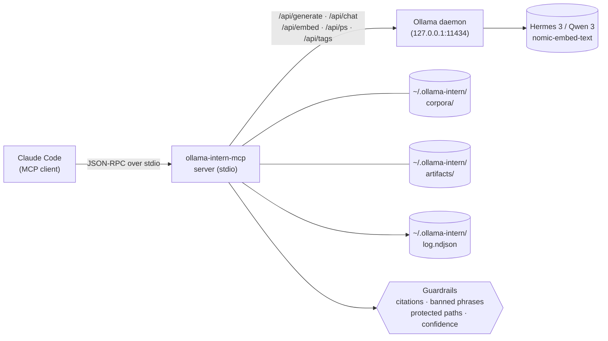

<p align="center">
  <a href="README.ja.md">日本語</a> | <a href="README.zh.md">中文</a> | <a href="README.md">English</a> | <a href="README.fr.md">Français</a> | <a href="README.hi.md">हिन्दी</a> | <a href="README.it.md">Italiano</a> | <a href="README.pt-BR.md">Português (BR)</a>
</p>

<p align="center">
  
</p>

<p align="center">
  <a href="https://github.com/mcp-tool-shop-org/ollama-intern-mcp/actions"></a>
  <a href="LICENSE"></a>
  <a href="https://mcp-tool-shop-org.github.io/ollama-intern-mcp/"></a>
  <a href="https://mcp-tool-shop-org.github.io/ollama-intern-mcp/handbook/"></a>
</p>

> **El becario local para Claude Code.** <!-- TOOL_COUNT:start -->42<!-- TOOL_COUNT:end --> herramientas diseñadas para el trabajo, resúmenes basados en pruebas, artefactos duraderos.

Un servidor MCP que le proporciona a Claude Code un **becario local** con reglas, niveles, un escritorio y un archivador. Claude elige la _herramienta_; la herramienta elige el _nivel_ (Instantáneo / De trabajo intensivo / Profundo / Integrado); el nivel escribe un archivo que puede abrir la semana que viene.

**También ejecuta [Hermes Agent](https://github.com/NousResearch/hermes-agent) en `hermes3:8b`** — validado de principio a fin el 19 de abril de 2026. La configuración predeterminada es `hermes3:8b`; `qwen3:*` es la vía alternativa. Consulte [Uso con Hermes](#use-with-hermes) más abajo.

**Requisitos de hardware:** ~6 GB de VRAM para `hermes3:8b`, o ~16 GB de RAM para la inferencia en CPU. Consulte [handbook/getting-started](https://mcp-tool-shop-org.github.io/ollama-intern-mcp/handbook/getting-started/#hardware-minimums) para obtener información detallada.

**¿No está utilizando Claude?** El directorio [`examples/`](./examples/) contiene un cliente MCP mínimo de Node.js y Python que puede ejecutar a través de stdio. Consulte también [handbook/with-hermes](https://mcp-tool-shop-org.github.io/ollama-intern-mcp/handbook/with-hermes/).

**Prioriza el funcionamiento local:** cero transferencia de datos a través de la red hasta que decida activarla. Sin telemetría. Nada "autónomo". Cada llamada muestra su proceso. El enrutamiento opcional a [Ollama Cloud](#ollama-cloud-optional) permite utilizar modelos de clase 600B con las mismas herramientas cuando el hardware local es el cuello de botella, y realiza una conmutación automática al funcionamiento local.

---

## Novedades en la versión 2.8.0

**Mayor fiabilidad, durabilidad y seguridad: 25 correcciones, todas ellas probadas primero y verificadas entre diferentes versiones.** El comportamiento que prioriza el funcionamiento local no ha cambiado y no se eliminó ningún contrato de herramienta; las llamadas existentes siguen funcionando. Las mejoras más importantes son:

- **Ya no hay pérdida silenciosa de datos del corpus.** Un error de lectura transitorio durante `ollama_corpus_refresh` (un bloqueo de archivos de Windows, una retención de un antivirus, una ventana de guardado de un editor) solía clasificar el archivo como "faltante" y **eliminar permanentemente su contenido indexado**. Ahora solo se elimina un archivo que realmente no existe; un error transitorio conserva la ruta, lo marca para reintentar y preserva sus fragmentos.
- **Concurrencia que respeta sus límites.** Un tiempo de espera del nivel ahora puede cancelar una llamada que aún está en cola para obtener un permiso (antes se bloqueaba mucho más allá del límite mientras los registros indicaban otra cosa), y `ollama_chat` finalmente se enruta a través del límite de tiempo/nivel, por lo que una generación local interrumpida no puede detener todas las herramientas y realmente llega a la nube en el modo principal de la nube.
- **La nube se degrada en lugar de dejar de funcionar.** Un ID de modelo en la nube retirado ahora vuelve al funcionamiento local con una razón clara `cloud_model_missing` y una sugerencia específica de la nube en lugar de un fallo total; el interruptor automático no puede bloquearse permanentemente; un modelo que falta persistentemente deja de realizar solicitudes a la nube en cada llamada.
- **Superficie de seguridad que coincide con su documentación.** `ollama_batch_proof_check` ahora realmente aplica la contención del directorio de trabajo actual (con una nueva restricción de entorno del operador `INTERN_BATCH_PROOF_ALLOWED_ROOTS` que un llamador no puede ampliar), los sanitizadores de inyección de indicaciones obtuvieron cobertura + un límite revelado honestamente y el protector de ruta protegido no distingue entre mayúsculas y minúsculas en macOS.
- **Artefactos y registros honestos.** Las escrituras del paquete son atómicas y nunca sobrescriben silenciosamente; los paquetes degradados informan sobre el nivel que se utilizó realmente; el detector de escritura interrumpida detecta las escrituras incompletas en cualquier modificación; los ID de fragmento ya no coinciden entre archivos con contenido idéntico. La auditoría de dependencias está completamente limpia (0 vulnerabilidades).

Información completa en [CHANGELOG.md](./CHANGELOG.md).

## Novedades en la versión 2.7.0

**Enrutamiento opcional a Ollama Cloud: prioriza la nube, conmutación de seguridad al funcionamiento local.** Active la opción con una clave + una marca y los niveles generativos se enrutarán a un modelo de nube de clase 600B; las incrustaciones permanecen locales; un interruptor automático vuelve a su perfil local en caso de cualquier fallo de la nube. **Desactivado por defecto: cero transferencia de datos a menos que configure tanto `OLLAMA_API_KEY` como `OLLAMA_CLOUD_PRIMARY=1`.** Mejora menor y aditiva: los llamadores anteriores a la versión 2.7.0 (y cualquier persona que no active la opción) verán un comportamiento idéntico. Consulte [Ollama Cloud (opcional)](#ollama-cloud-optional).

- **Prioriza la nube con una red de seguridad.** Un `RoutingOllamaClient` intenta utilizar la nube primero y vuelve al perfil local en caso de tiempo de espera / 5xx / 429 / problemas de red. Las claves incorrectas (401/403) se muestran claramente a través de un interruptor automático persistente en lugar de degradarse silenciosamente para siempre; un ID de modelo en la nube retirado o con errores tipográficos (404) también se muestra.
- **Nunca una degradación silenciosa.** Cada paquete obtiene `backend` (`cloud`|`local`), `degraded` y `degrade_reason`, por lo que siempre sabrá cuándo obtuvo el modelo local en lugar del grande. Un evento NDJSON de `backend_fallback` hace que la tasa de conmutación de nube a local sea visible en `ollama_log_tail`.
- **`ollama_doctor` informa sobre la autenticación y la conectividad de la nube** como un bloque distinto; `ollama-intern-mcp doctor` muestra una sección de `Cloud (primary)`.
- El modelo predeterminado de la nube es `minimax-m3:cloud`; anule por nivel con `INTERN_CLOUD_MODEL` / `INTERN_CLOUD_DEEP_MODEL` (por ejemplo, `deepseek-v3.1:671b`).

## Novedades en la versión 2.6.0

Anulación del presupuesto de nivel por llamada en `ollama_extract`. Mejora menor y aditiva: los llamadores anteriores a la versión 2.6.0 no se ven afectados. Entrada detallada en [CHANGELOG.md](./CHANGELOG.md).

- **Campo de esquema `tier_budget_ms_override?: number` en `ollama_extract`** (opcional, limitado a `[1, 600000]` ms). Cuando está presente, aplica la anulación a cada nivel visitado por el ejecutor, de modo que el mecanismo interno `runWithTimeoutAndFallback` en `src/guardrails/timeouts.ts:61` respete el presupuesto proporcionado por el operador en lugar del valor predeterminado del perfil. La cascada (motor principal → instantáneo al agotarse el tiempo) sigue activándose; la anulación rige cada salto de la cascada de forma uniforme.
- **Por qué existe esto.** El wrapper R-018 de research-os (v0.12.1) envolvió `callTool` de MCP con `Promise.race` y descubrió que el presupuesto del wrapper no alcanzaba el nivel interno; `DEV_RTX5080_TIMEOUTS.instant = 15_000` continuó activando `TIER_TIMEOUT` a los 15000 ms, independientemente de un presupuesto de wrapper de 180000 ms. v2.6.0 proporciona el presupuesto autoritativo del lado de MCP para que la bandera `--planner-timeout-ms` del operador (research-os) controle finalmente los tiempos de espera internos como se diseñó.
- **Se conserva el comportamiento predeterminado.** Si se omite el campo, los valores predeterminados del perfil rigen byte a byte. Los llamadores anteriores a v2.6.0 no ven ningún cambio.
- **Se conserva la expresión regular `fallback-cause` de R-010.** El mensaje de error `TIER_TIMEOUT` del lado del servidor sigue coincidiendo con `/elapsed=(\d+)ms/` + `/budget=(\d+)ms/`, por lo que la visibilidad del asesor de IA en las rutas posteriores funciona tanto para la anulación como para los valores predeterminados.
- Utilizado por research-os v0.13.0 (acumulativo, configuración del cliente R-019 + R-020 + R-021) en una versión multirrepositorio coordinada.

### Histórico: entregables de la v2.4.0

Consulte [CHANGELOG.md](./CHANGELOG.md) y [docs/release-notes/v2.4.0.md](./docs/release-notes/v2.4.0.md) para obtener la entrada completa de la v2.4.0 (control por nivel de `num_ctx` en el sistema de perfiles).

## Novedades de la v2.4.0

Control por nivel de `num_ctx` (ventana de contexto) en el sistema de perfiles. Mejora menor aditiva: los llamadores de la v2.3.0 no se ven afectados. Entradas detalladas en [CHANGELOG.md](./CHANGELOG.md) y [docs/release-notes/v2.4.0.md](./docs/release-notes/v2.4.0.md).

- **Mapa `TierConfig.num_ctx` (nuevo)**: opcional `{ instant?, workhorse?, deep?, embed? }` en el perfil. Cuando se establece para un nivel, el servidor MCP coloca `options.num_ctx = <value>` en cada solicitud de generación/chat de Ollama dirigida a ese nivel (inicial + de respaldo). Cuando no se establece, la solicitud omite por completo `num_ctx`, por lo que Ollama utiliza su valor predeterminado cargado con el modelo; se conserva exactamente el comportamiento de la v2.3.0.
- **Nuevo campo de envoltorio `num_ctx_used?: number`**: presente solo cuando el servidor MCP realmente envió `num_ctx`. Ausente cuando la solicitud permitió que Ollama eligiera. No infiera un valor predeterminado: el servidor MCP no consulta a Ollama para obtener el valor efectivo.
- **Valores predeterminados del perfil**: `dev-rtx5080` / `dev-rtx5080-qwen3` se envían con `instant: 4096`, `workhorse: 8192`, `deep`/`embed` NO ESTABLECIDOS. Dimensionado para mantener `hermes3:8b` residente en los 16 GB de VRAM de la RTX 5080 para herramientas rápidas. `m5-max` deja cada nivel SIN ESTABLECER; los 128 GB de memoria unificada no tienen problemas de desbordamiento.
- **Cierra el diagnóstico de la fase 1 de la v0.8.0**: `hermes3:8b` con el contexto predeterminado de 32K en RTX 5080 se derramó a la CPU y comenzó a agotar el tiempo de las llamadas `ollama_extract` del motor principal. La v2.4.0 evita esto en la capa del perfil.

### Control por nivel de `num_ctx` (novedad en la v2.4.0)

Perfil (fragmento de `src/profiles.ts`):

```ts
"dev-rtx5080": {
  tiers: {
    instant: "hermes3:8b",
    workhorse: "hermes3:8b",
    deep: "hermes3:8b",
    embed: "nomic-embed-text",
    num_ctx: {
      instant: 4096,    // fast classify/summarize
      workhorse: 8192,  // schema-bound extract / batch
      // deep: UNSET — long-context briefs keep current behavior
      // embed: UNSET — no context-window pressure on embed
    },
  },
  // ... timeouts, prewarm
}
```

Envoltorio en una llamada del nivel del motor principal (por ejemplo, `ollama_extract`):

```jsonc
{
  "result": { /* extracted data */ },
  "tier_used": "workhorse",
  "model": "hermes3:8b",
  "num_ctx_used": 8192,        // present because the profile set workhorse=8192
  // ... rest of envelope unchanged
}
```

En `m5-max` (o cualquier perfil que deje un nivel sin establecer), `num_ctx_used` está ausente del envoltorio y la solicitud de red a Ollama no incluye el campo `num_ctx`; Ollama utiliza su valor predeterminado cargado con el modelo.

Los operadores ajustan seleccionando/editando el perfil; no hay una entrada `num_ctx` por llamada en los esquemas de las herramientas. Si una llamada futura revela la necesidad, el patrón sigue a la anulación `model` de la v2.3.0.

### Histórico: entregables de la v2.3.0

Consulte [CHANGELOG.md](./CHANGELOG.md) y [docs/release-notes/v2.3.0.md](./docs/release-notes/v2.3.0.md) para obtener la entrada completa de la v2.3.0 (anulación del modelo por llamada).

## Novedades de la v2.3.0

Anulación del modelo por llamada en todas las herramientas atómicas basadas en LLM. Mejora menor aditiva: los llamadores de la v2.2.0 no se ven afectados. Entradas detalladas en [CHANGELOG.md](./CHANGELOG.md) y [docs/release-notes/v2.3.0.md](./docs/release-notes/v2.3.0.md).

- **Entrada opcional `model: string` en 8 herramientas atómicas**: `ollama_extract`, `ollama_classify`, `ollama_summarize_fast`, `ollama_summarize_deep`, `ollama_research`, `ollama_corpus_answer`, `ollama_chat`, `ollama_code_citation`. El primer intento en el nivel de la herramienta se realiza con el modelo especificado por el llamador; al agotarse el tiempo, la cascada existente `TIER_FALLBACK` resuelve el propio modelo del nivel más económico (NO la anulación del llamador). Las herramientas compuestas/breves/de empaquetado NO aceptan deliberadamente `model`; las herramientas atómicas obtienen control por llamada y las herramientas compuestas utilizan los valores predeterminados del nivel.
- **Nuevo campo de envoltorio `model_requested?: string`**: presente solo cuando se proporcionó la anulación. Los llamadores con conocimiento de la calibración comparan `model_requested` con `model` para detectar la sustitución de respaldo: `if (env.model_requested && env.model !== env.model_requested) { /* sustitución */ }`. Las entradas vacías o que solo contienen espacios en blanco generan un `ZodError` en el análisis del esquema, no una omisión silenciosa.
- **Corrección de errores: deriva de `src/version.ts`.** La constante `VERSION` en tiempo de ejecución ahora se lee desde `package.json` al cargar el módulo; la v2.1.0 y la v2.2.0 enviaron la cadena de identidad obsoleta `"2.0.0"`. El nuevo `tests/version.test.ts` bloquea `VERSION === pkg.version`.

### Anulación del modelo por llamada (novedad en la v2.3.0)

```jsonc
{
  "tool": "ollama_classify",
  "arguments": {
    "text": "patch null pointer in auth",
    "labels": ["feat", "fix", "chore"],
    "frame": "what is the change kind?",
    "model": "hermes3:8b"
  }
}
```

Envoltorio:

```jsonc
{
  "result": { "label": "fix", "confidence": 0.9, "off_topic": false, ... },
  "tier_used": "instant",
  "model": "hermes3:8b",
  "model_requested": "hermes3:8b",       // present because override was supplied
  // ... rest of envelope unchanged
}
```

Si el nivel del motor principal/profundo se había agotado y la llamada había realizado una cascada al nivel instantáneo, `env.model` sería el modelo resuelto del nivel instantáneo y `env.fallback_from` sería `"workhorse"`; `env.model_requested` seguiría siendo `"hermes3:8b"` y `env.model !== env.model_requested` es la señal de sustitución. La anulación no se incluye deliberadamente en el nivel más económico; el modelo elegido puede que ni siquiera sea adecuado para el papel de ese nivel.

### Histórico: entregables de la v2.2.0

Consulte [CHANGELOG.md](./CHANGELOG.md) y [docs/release-notes/v2.2.0.md](./docs/release-notes/v2.2.0.md) para obtener la entrada completa de la versión 2.2.0 (pertinencia delimitada por el marco + abstención estructurada).

## Novedades en la versión 2.2.0

Contrato de rol local para la recopilación de pruebas: pertinencia delimitada por el marco y abstención estructurada. Adición menor, los usuarios de la versión 2.1.0 no se ven afectados. Entradas detalladas en [CHANGELOG.md](./CHANGELOG.md) y [docs/release-notes/v2.2.0.md](./docs/release-notes/v2.2.0.md).

- **Extracción delimitada por el marco** en `ollama_extract`, `ollama_classify`, `ollama_summarize_fast`, `ollama_summarize_deep`: entrada opcional `frame: string` + salidas estructuradas `frame_alignment`/`on_topic`/`frame_addressed`. Las fuentes que no están relacionadas con el tema se marcan en lugar de parafrasearlas en el esquema.
- **Abstención estructurada** en `ollama_research`: campos `weak`/`abstained`/`sources_address_question`. Un `citations[]` vacío con un `answer` no vacío ya no se considera un éxito silencioso.
- **Umbral de pertinencia** en `ollama_corpus_answer`: entrada opcional `min_top_score`. Si está por debajo del umbral, la herramienta interrumpe el proceso con `abstained: true` y omite la síntesis. El `score` por cita ahora es visible en cada cita.
- **Preservación de la puntuación de recuperación** a través de pruebas breves: `corpusHitsToEvidence` incluye `score` (y el parámetro `corpus_min_evidence_score` filtra durante el ensamblaje en `incident_brief`/`repo_brief`/`change_brief`).
- **Límites del rango de líneas de cita**: `guardrails/citations.ts` rechaza los rangos que están fuera de los límites en `ollama_research`, lo que coincide con la postura existente en `ollama_code_citation`.
- **Corrección de la documentación del contrato del operador**: corrección de `chunk_id`/`chunk_index` en el archivo README, se reescribió "validado en el lado del servidor", se calificó la sección de Leyes de Evidencia y se anotó el eslogan de marketing.

### Regresión de pruebas: la verificación

Se verifica el contrato del fragmento con respecto al fallo literal del paquete "fresh-pack" de research-os: arxiv 2112.10422 (Temporizadores estándar cosmológicos) en el marco de la sección 01 *"¿Qué significa la custodia de las pruebas en los flujos de trabajo de investigación profunda de LLM basados en la nube frente a los locales?"* — 9/9 pruebas del contrato mock-LLM confirman que la fuente que no está relacionada con el tema ahora está contenida (`frame_alignment.on_topic = false` en extract; `off_topic: true` en classify; `frame_addressed: false` en summarize_deep; `abstained: true` en corpus_answer con `min_top_score` establecido).

### Entregables históricos: versión 2.1.0

Consulte [CHANGELOG.md](./CHANGELOG.md) para obtener la entrada completa de la versión 2.1.0 (aprobación de funciones: 13 herramientas nuevas + 4 mejoras + eliminación de restricciones).

---

## Arquitectura en resumen


```mermaid
flowchart LR
  Claude["Claude Code<br/>(MCP client)"]
  MCP["ollama-intern-mcp<br/>server (stdio)"]
  Ollama["Ollama daemon<br/>(127.0.0.1:11434)"]
  Models[("Hermes 3 / Qwen 3<br/>nomic-embed-text")]
  Corpus[("~/.ollama-intern/<br/>corpora/")]
  Artifacts[("~/.ollama-intern/<br/>artifacts/")]
  NDJSON[("~/.ollama-intern/<br/>log.ndjson")]
  Guards{{"Guardrails<br/>citations · banned phrases<br/>protected paths · confidence"}}

  Claude -- "JSON-RPC over stdio" --> MCP
  MCP --> Guards
  MCP -- "/api/generate · /api/chat<br/>/api/embed · /api/ps · /api/tags" --> Ollama
  Ollama --> Models
  MCP --- Corpus
  MCP --- Artifacts
  MCP --> NDJSON
```

Cada llamada a una herramienta de Claude ingresa al servidor MCP a través de stdio JSON-RPC. El servidor valida la llamada con el esquema [zod](https://zod.dev) de la herramienta, ejecuta las protecciones configuradas (validación de citas, eliminación de frases prohibidas, aplicación de rutas protegidas, umbrales de confianza) y luego enruta a un renderizador determinista (nivel de artefacto) o una llamada HTTP de Ollama (todos los demás niveles). El daemon de Ollama nunca ve las rutas proporcionadas por el usuario; solo el nivel del modelo y la solicitud preparada. Cada llamada agrega un evento estructurado al registro NDJSON en `~/.ollama-intern/log.ndjson`, donde `ollama_log_tail` y su shell pueden leerlo.

---

## Ejemplo principal: una llamada, un artefacto

```jsonc
// Claude → ollama-intern-mcp
{
  "tool": "ollama_incident_pack",
  "arguments": {
    "title": "sprite pipeline 5 AM paging regression",
    "logs": "[2026-04-16 05:07] worker-3 OOM killed\n[2026-04-16 05:07] ollama /api/ps reports evicted=true size=8.1GB\n...",
    "source_paths": ["F:/AI/sprite-foundry/src/worker.ts", "memory/sprite-foundry-visual-mastery.md"]
  }
}
```

Devuelve un sobre que apunta a un archivo en el disco:

```jsonc
{
  "result": {
    "pack": "incident",
    "slug": "2026-04-16-sprite-pipeline-5-am-paging-regression",
    "artifact_md":   "~/.ollama-intern/artifacts/incident/2026-04-16-sprite-pipeline-5-am-paging-regression.md",
    "artifact_json": "~/.ollama-intern/artifacts/incident/2026-04-16-sprite-pipeline-5-am-paging-regression.json",
    "weak": false,
    "evidence_count": 6,
    "next_checks": ["residency.evicted across last 24h", "OLLAMA_MAX_LOADED_MODELS vs loaded size"]
  },
  "tier_used": "deep",
  "model": "hermes3:8b",
  "hardware_profile": "dev-rtx5080",
  "tokens_in": 4180, "tokens_out": 612,
  "elapsed_ms": 8410,
  "residency": { "in_vram": true, "evicted": false }
}
```

→ `weak: false` significa que se ensamblaron ≥2 elementos de prueba; NO significa que las hipótesis estén validadas. Consulte [Leyes de la evidencia](#evidence-laws) más abajo.

Ese archivo Markdown es el resultado del trabajo del asistente: encabezados, bloque de evidencia con identificadores citados, `next_checks` para la investigación, banner `weak: true` si la evidencia es escasa. Es determinista: el renderizador es código, no una solicitud. (El renderizador es determinista; el *contenido* de las hipótesis y los resultados es generativo: léalos como un borrador, no como algo verificado). Ábralo mañana, compárelo la semana que viene, expórtelo a un manual con `ollama_artifact_export_to_path`.

Todos los competidores en esta categoría comienzan con "ahorrar tokens". Nosotros comenzamos con _aquí está el archivo que escribió el asistente_.

### Segundo ejemplo: cree un corpus y luego pregúntele

```jsonc
// 1. Build a persistent, searchable corpus over your project.
{ "tool": "ollama_corpus_index",
  "arguments": { "name": "sprite-foundry",
                 "paths": ["F:/AI/sprite-foundry/src"],
                 "embed_model": "nomic-embed-text" } }
// → { chunks_written: 1204, paths_indexed: 312, failed_paths: [] }

// 2. Ask an evidence-bound question against it.
{ "tool": "ollama_corpus_answer",
  "arguments": { "name": "sprite-foundry",
                 "query": "how does the worker handle OOM eviction?",
                 "top_k": 8 } }
// → { answer: "...", citations: [{chunk_index, path}...], weak: false }
```

El servidor valida la identidad de la cita y que cada `chunk_index` esté dentro del rango de los resultados recuperados. NO prueba que cada afirmación generada esté respaldada semánticamente por el contenido del fragmento citado; esa es la responsabilidad del modelo, y una recuperación deficiente aún puede producir respuestas con formato de cita. Explicación completa en [handbook/corpora](https://mcp-tool-shop-org.github.io/ollama-intern-mcp/handbook/corpora/).

---

## Extracción delimitada por el marco (novedad en la versión 2.2.0)

`ollama_extract`, `ollama_classify`, `ollama_summarize_fast` y `ollama_summarize_deep` aceptan una entrada opcional `frame: string`. El marco especifica la pregunta a la que se le está pidiendo a la fuente que responda; se instruye al modelo para que se abstenga en lugar de emitir contenido verdadero pero que no esté relacionado con el tema cuando la fuente no aborde el marco.

```jsonc
{
  "tool": "ollama_extract",
  "arguments": {
    "text": "<long source document>",
    "schema": { /* your fields */ },
    "frame": "section purpose here — e.g. 'OOM eviction behavior in the sprite worker'"
  }
}
// → result includes frame_alignment: { on_topic: boolean, reason: string, unaddressed_aspects: string[] }
```

Si se omite `frame`, el comportamiento no cambia con respecto a la versión 2.1.0. Cuando se proporciona, `frame_alignment.on_topic = false` indica que los campos extraídos pueden ser verdaderos para la fuente, pero no relevantes para el marco; trate eso como lo mismo que un resumen `weak: true`: útil, pero verifique antes de promoverlo a la evidencia posterior.

---

## Contrato de abstención (novedad en la versión 2.2.0)

`ollama_research` devuelve campos de abstención estructurados: `weak: boolean`, `abstained: boolean`, `sources_address_question: boolean | null`. Un `citations[]` vacío con un `answer` no vacío ya no se considera silencioso; `abstained: true` indica que el modelo se negó a sintetizar porque las rutas proporcionadas por el usuario no abordaron la pregunta. Trate la abstención como un éxito, no como un fracaso: es la herramienta que se niega a manipular una recuperación deficiente en una salida autorizada.

`ollama_corpus_answer` acepta un umbral opcional de relevancia temática (`min_top_score: number`) que varía entre 0,0 y 1,0. Cuando la puntuación más alta obtenida para una consulta es inferior a `min_top_score`, la herramienta interrumpe el proceso con `abstained: true` y omite la síntesis, evitando así el problema de "5 fragmentos irrelevantes con una puntuación de 0,21 que aún generan una respuesta completa", que no detectaba la regla `weak: true` en la versión 2.1.0 (la regla `weak: true` solo se activaba cuando `hits.length < 2`). Combine esto con el campo `score` por cita, que ahora está disponible para cada cita y permite auditar directamente la calidad de los resultados obtenidos.

---

## ¿Qué hay aquí? — Cuatro niveles, <!-- TOOL_COUNT:start -->42<!-- TOOL_COUNT:end --> herramientas

"Orientado al trabajo" significa que cada herramienta tiene un nombre que describe la tarea que se le asignaría a un becario: clasificar esto, extraer aquello, priorizar estos registros, redactar esta nota de lanzamiento, organizar este incidente. La entrada de la herramienta es la especificación del trabajo; la salida es el resultado final. No hay ninguna función genérica `run_model` / `chat_with_llm` al principio.

| Nivel | Cantidad | Qué contiene |
|---|---|---|
| **Atoms** | 29 | Funciones básicas orientadas al trabajo. **Originales 15:** `classify`, `extract`, `triage_logs`, `summarize_fast` / `deep`, `draft`, `research`, `corpus_search` / `answer` / `index` / `refresh` / `list`, `embed_search`, `embed`, `chat`. **+13 añadidas en la versión 2.1.0:** `doctor`, `log_tail`, `batch_proof_check` (operaciones); `code_map`, `code_citation`, `multi_file_refactor_propose`, `refactor_plan` (refactorización); `artifact_prune`, `hypothesis_drill` (artefacto/resumen); `corpus_health`, `corpus_amend`, `corpus_amend_history`, `corpus_rerank` (corpus). **+1 elemento de revisión:** `code_review` (hallazgos estructurados de la revisión del código, herramienta principal; solo para revisión). Los elementos que admiten procesamiento por lotes (`classify`, `extract`, `triage_logs`) aceptan `items: [{id, text}]`. |
| **Briefs** | 3 | Resúmenes estructurados respaldados por pruebas. `incident_brief`, `repo_brief`, `change_brief`. Cada afirmación cita un ID de evidencia; se eliminan los datos desconocidos en el lado del servidor. La evidencia débil muestra `weak: true` en lugar de una narrativa falsa. |
| **Packs** | 3 | Trabajos compuestos de flujo fijo que escriben Markdown y JSON duraderos en `~/.ollama-intern/artifacts/`. `incident_pack`, `repo_pack`, `change_pack`. Renderizadores deterministas; no se realizan llamadas al modelo para dar forma al artefacto. |
| **Artifacts** | 7 | Superficie de continuidad sobre las salidas del paquete. `artifact_list` / `read` / `diff` / `export_to_path`, más tres fragmentos deterministas: `incident_note`, `onboarding_section`, `release_note`. |

Total: **29 elementos + 3 resúmenes + 3 paquetes + 7 herramientas de artefacto = <!-- TOOL_COUNT:start -->42<!-- TOOL_COUNT:end -->**.

Líneas congeladas:
- Elementos: la restricción se levantó en la versión **v2.1.0** (29 hoy; +13 añadidos en el lanzamiento de funciones v2.1.0, +1 `code_review` más adelante). Los nuevos elementos aún requieren una justificación basada en auditorías, pruebas, una página del manual y una entrada en el archivo CHANGELOG; no se realizarán adiciones casuales.
- Paquetes congelados en 3. No hay nuevos tipos de paquetes.
- Nivel de artefactos congelado en 7.

La referencia completa de las herramientas está disponible en el [manual](https://mcp-tool-shop-org.github.io/ollama-intern-mcp/handbook/tools/).

---

## Instalación

Requiere que [Ollama](https://ollama.com) se esté ejecutando localmente y que los modelos del nivel estén descargados (consulte la sección [Descarga de modelos](#model-pulls) a continuación).

### Claude Code (recomendado)

La mayoría de los usuarios lo instalan añadiéndolo a la configuración del servidor Claude Code MCP; no se requiere una instalación global. Claude Code ejecuta el servidor bajo demanda mediante `npx`:

```json
{
  "mcpServers": {
    "ollama-intern": {
      "command": "npx",
      "args": ["-y", "ollama-intern-mcp"],
      "env": {
        "OLLAMA_HOST": "http://127.0.0.1:11434",
        "INTERN_PROFILE": "dev-rtx5080"
      }
    }
  }
}
```

### Claude Desktop

El mismo bloque, escrito en `~/Library/Application Support/Claude/claude_desktop_config.json` (macOS) o `%APPDATA%\Claude\claude_desktop_config.json` (Windows).

### Instalación global (avanzada)

Solo es necesario si desea que el archivo binario esté en su `PATH` para usarlo de forma ad hoc fuera de Claude Code:

```bash
npm install -g ollama-intern-mcp
```

### Uso con Hermes

Este MCP se validó de extremo a extremo con [Hermes Agent](https://github.com/NousResearch/hermes-agent) contra `hermes3:8b` en Ollama (19 de abril de 2026). Hermes es un agente externo que *llama* a la superficie de funciones básicas congeladas de este MCP; él se encarga de la planificación y nosotros del trabajo.

Configuración de referencia ([hermes.config.example.yaml](hermes.config.example.yaml) en este repositorio):

```yaml
model:
  provider: custom
  base_url: http://localhost:11434/v1
  default: hermes3:8b
  context_length: 65536    # Hermes requires 64K floor under model.*

providers:
  local-ollama:
    name: local-ollama
    base_url: http://localhost:11434/v1
    api_mode: openai_chat
    api_key: ollama
    model: hermes3:8b

mcp_servers:
  ollama-intern:
    command: npx
    args: ["-y", "ollama-intern-mcp"]
    env:
      OLLAMA_HOST: http://localhost:11434
      INTERN_PROFILE: dev-rtx5080
      # hermes3:8b is the default ladder in v2.0.0, so tier overrides are
      # only needed if you're pinning a different local model.
```

**La forma del mensaje es importante.** Los mensajes imperativos que invocan herramientas ("Llama a X con los argumentos...") son la prueba de integración; proporcionan suficiente estructura a un modelo local de 8B para generar `tool_calls` limpios. Los mensajes en forma de lista que contienen múltiples tareas ("haz A, luego B, luego C") son puntos de referencia de capacidad para modelos más grandes; no interprete el fallo de una instrucción en forma de lista en un modelo de 8B como "el cableado está roto". Consulte [handbook/with-hermes](https://mcp-tool-shop-org.github.io/ollama-intern-mcp/handbook/with-hermes/) para obtener la guía completa de integración y las advertencias conocidas sobre el transporte (Ollama `/v1` streaming + openai-SDK non-streaming shim).

### Descarga de modelos

**Perfil predeterminado para desarrollo (RTX 5080 16 GB y similares):**

```bash
ollama pull hermes3:8b
ollama pull nomic-embed-text
export OLLAMA_MAX_LOADED_MODELS=2
export OLLAMA_KEEP_ALIVE=-1
```

**Alternativa Qwen 3 (el mismo hardware, para las herramientas de Qwen):**

```bash
ollama pull qwen3:8b
ollama pull qwen3:14b
ollama pull nomic-embed-text
export INTERN_PROFILE=dev-rtx5080-qwen3
```

**Perfil M5 Max (128 GB unificados):**

```bash
ollama pull qwen3:14b
ollama pull qwen3:32b
ollama pull nomic-embed-text
export INTERN_PROFILE=m5-max
```

Las variables de entorno por nivel (`INTERN_TIER_INSTANT`, `INTERN_TIER_WORKHORSE`, `INTERN_TIER_DEEP`, `INTERN_EMBED_MODEL`) siguen anulando las selecciones del perfil para casos únicos.

---

## Sobre uniforme

Cada herramienta devuelve la misma estructura:

```ts
{
  result: <tool-specific>,
  tier_used: "instant" | "workhorse" | "deep" | "embed",
  model: string,
  hardware_profile: string,     // "dev-rtx5080" | "dev-rtx5080-qwen3" | "m5-max"
  tokens_in: number,
  tokens_out: number,
  elapsed_ms: number,
  residency: {
    in_vram: boolean,
    size_bytes: number,
    size_vram_bytes: number,
    evicted: boolean
  } | null
}
```

`residency` proviene de `/api/ps` de Ollama. Cuando `evicted: true` o `size_vram < size`, el modelo se paginó al disco y la inferencia disminuyó entre 5 y 10 veces; muestre esto al usuario para que sepa que debe reiniciar Ollama o reducir la cantidad de modelos cargados.

En modo [Ollama Cloud](#ollama-cloud-optional), el sobre también contiene `backend` (`"cloud"` | `"local"`) y, en caso de una reversión de la nube a local, `degraded: true` + `degrade_reason`. Estos campos **no** están presentes en la ruta predeterminada solo local, por lo que los consumidores existentes no se ven afectados. `residency` es `null` para las llamadas servidas desde la nube (la nube sin estado no tiene residencia de VRAM local).

Cada llamada se registra como una línea NDJSON en `~/.ollama-intern/log.ndjson`. Filtre por `hardware_profile` para evitar que los números de desarrollo aparezcan en las pruebas comparativas publicables.

---

## Perfiles de hardware

| Perfil | Instantáneo | De trabajo intensivo | Profundo | Incrustar |
|---|---|---|---|---|
| **`dev-rtx5080`** (predeterminado) | hermes3 8B | hermes3 8B | hermes3 8B | nomic-embed-text |
| `dev-rtx5080-qwen3` | qwen3 8B | qwen3 8B | qwen3 14B | nomic-embed-text |
| `m5-max` | qwen3 14B | qwen3 14B | qwen3 32B | nomic-embed-text |

**El perfil predeterminado** combina los tres niveles de trabajo en `hermes3:8b`, que es la ruta de integración validada del Agente Hermes. El uso del mismo modelo en todos los niveles significa que solo hay una cosa que descargar, un costo de residencia y un conjunto de comportamientos para comprender. Los usuarios que prefieren Qwen 3 (con su configuración `THINK_BY_SHAPE`) pueden optar por `dev-rtx5080-qwen3`. `m5-max` es la escala de Qwen 3 diseñada para memoria unificada.

---

## Ollama Cloud (opcional)

Los modelos locales de 8B son el cuello de botella de hardware que la mayoría de las personas encuentran. [Ollama Cloud](https://ollama.com/cloud) ofrece modelos de clase 600B detrás de la **misma** interfaz `/api/*`, por lo que puede dirigir las herramientas más pesadas a un modelo mucho más potente y liberar VRAM local, al tiempo que mantiene el acceso local como una opción siempre activa.

**Esta es una opción y está desactivada de forma predeterminada.** El paquete sigue siendo principalmente local con **cero transferencia de datos** a menos que configure *ambas* opciones. Cualquiera que no active esta opción no se verá afectado.

```json
{
  "mcpServers": {
    "ollama-intern": {
      "command": "npx",
      "args": ["-y", "ollama-intern-mcp"],
      "env": {
        "OLLAMA_CLOUD_PRIMARY": "1",
        "OLLAMA_API_KEY": "sk-...your-key...",
        "INTERN_PROFILE": "dev-rtx5080"
      }
    }
  }
}
```

> **La clave es una variable de entorno en tiempo de ejecución, no un secreto de CI.** Un secreto de GitHub Actions solo es visible dentro de las ejecuciones de CI; nunca llega al servidor en funcionamiento. Cree una clave en [ollama.com/settings/keys](https://ollama.com/settings/keys) y colóquela en el bloque `env` de su cliente MCP (o en su entorno de shell).

**Cómo funciona el enrutamiento.** Cuando la nube está activada, los niveles generativos (instantáneo / de trabajo intensivo / profundo) se dirigen al modelo de la nube; **las incrustaciones siempre permanecen locales** (Ollama Cloud no ofrece modelos de incrustación, por lo que las herramientas de corpus/incrustación no se ven afectadas). Un mecanismo de seguridad primero intenta usar la nube y luego recurre a su perfil local en caso de tiempo de espera / errores 5xx / 429 / errores de red. Una clave incorrecta (401/403) activa un mecanismo de seguridad *persistente* que muestra una advertencia clara en lugar de degradar el rendimiento silenciosamente. El perfil local (`INTERN_PROFILE`) es la opción de respaldo, por lo que mantenga sus modelos descargados.

**Nunca se reducirá el rendimiento de forma silenciosa.** Cada solicitud informa qué backend atendió la llamada:

```ts
{ ...envelope, backend: "cloud" | "local", degraded?: true, degrade_reason?: "cloud_timeout" | "cloud_5xx" | "cloud_rate_limited" | "cloud_unreachable" | "cloud_auth_failed" | "circuit_open" }
```

Una línea `backend_fallback` aparece en `~/.ollama-intern/log.ndjson` cada vez que se produce un cambio de nube a local (`ollama_log_tail --filter_kind backend_fallback`), y `ollama-intern-mcp doctor` muestra un bloque **Cloud (primario)** con el estado de disponibilidad y autenticación.

**Latencia frente a calidad.** Los modelos grandes de la nube se ejecutan mucho más lentamente por token que un modelo local de 8B (segundos, no milisegundos), lo que representa una mejora en la calidad, no en la velocidad. Los niveles de la nube utilizan un tiempo de espera generoso (instantáneo: 30 s / de trabajo intensivo: 120 s / profundo: 300 s por defecto).

### Variables de entorno de la nube

| Variable | Predeterminado | Propósito |
|---|---|---|
| `OLLAMA_CLOUD_PRIMARY` | _(no definido)_ | **El interruptor para activar la opción.** `1`/`true`/`yes`/`on` habilita el uso principal de la nube. Si no se define, solo se utiliza el acceso local y no se transfieren datos. |
| `OLLAMA_API_KEY` | _(no definido)_ | Clave Bearer para Ollama Cloud. **Obligatorio** cuando la nube está habilitada (falla rápidamente al inicio si falta). |
| `OLLAMA_CLOUD_HOST` | `https://ollama.com` | Host base de la nube. |
| `INTERN_CLOUD_MODEL` | `minimax-m3:cloud` | Modelo de la nube para los niveles instantáneo, de trabajo intensivo y profundo. |
| `INTERN_CLOUD_DEEP_MODEL` | _(= `INTERN_CLOUD_MODEL`)_ | Opcional: anulación solo para el nivel profundo, por ejemplo, `deepseek-v3.1:671b`. |
| `INTERN_CLOUD_TIMEOUT_{INSTANT,WORKHORSE,DEEP}_MS` | `30000`/`120000`/`300000` | Tiempos de espera para los intentos en la nube por nivel. |
| `INTERN_CLOUD_NUM_CTX` | `32768` | Límite de ventana de contexto para las llamadas a la nube (la nube cobra por el tiempo de GPU; el límite controla el costo). |

> **La disponibilidad del modelo cambia.** Ollama retira periódicamente los modelos de la nube. `minimax-m3:cloud`, `deepseek-v3.1:671b`, `gpt-oss:120b` y `qwen3-coder:480b` son las opciones actuales; consulte [ollama.com/search?c=cloud](https://ollama.com/search?c=cloud) antes de fijar un ID.

**Nota sobre la privacidad.** El enrutamiento a Ollama Cloud envía indicaciones a un tercero. La [política de privacidad](https://ollama.com/privacy) de Ollama establece que las indicaciones de la nube se procesan de forma transitoria, no se conservan más allá de la solicitud y no se utilizan para el entrenamiento, pero sigue siendo una transferencia de datos, por lo que es una opción y se divulga. El modo solo local (el predeterminado) no envía nada fuera del dispositivo.

---

## Leyes sobre pruebas

Estas se aplican en el servidor, no en la indicación:

- **Se requieren citas.** Cada afirmación breve cita un ID de evidencia.
- **Los elementos desconocidos se eliminan del lado del servidor.** Los modelos que citan ID que no están en el conjunto de evidencias tienen esos ID eliminados con una advertencia antes de devolver el resultado.
- **Validación por ID, no por contenido.** El servidor verifica que cada `evidence_ref` citado apunte a un ID de evidencia real en el conjunto ensamblado. No verifica que el texto de la afirmación se pueda derivar de la evidencia citada; ese es el trabajo del modelo, y las indicaciones débiles a veces contienen afirmaciones no respaldadas con referencias válidas. Utilice `weak: true` + notas de cobertura + el campo `excerpt` incluido para realizar una verificación aleatoria.
- **Débil es débil.** Las evidencias tenues marcan `weak: true` con notas de cobertura. Nunca se suavizan en una narrativa falsa.
- **Investigativo, no prescriptivo.** Solo `next_checks` / `read_next` / `likely_breakpoints`. Las indicaciones prohíben "aplicar esta corrección".
- **Renderizadores deterministas.** La forma del arte en Markdown es código, no una indicación. `draft` se reserva para la prosa donde el estilo del modelo importa.
- **Diferencias solo dentro del mismo paquete.** Se rechaza de forma contundente la comparación entre paquetes (`artifact_diff`); las cargas útiles permanecen distintas.

---

## Artefactos y continuidad

Los paquetes se escriben en `~/.ollama-intern/artifacts/{incident,repo,change}/<slug>.(md|json)`. El nivel de artefactos le brinda una superficie de continuidad sin convertir esto en una herramienta de administración de archivos:

- `artifact_list`: índice que contiene solo metadatos, con la posibilidad de filtrar por paquete, fecha y patrón de nombre de archivo.
- `artifact_read`: lectura tipificada mediante `{pack, slug}` o `{json_path}`.
- `artifact_diff`: comparación estructurada dentro del mismo paquete; se muestra una versión simplificada.
- `artifact_export_to_path`: escribe un artefacto existente (con encabezado de procedencia) en las carpetas `allowed_roots` especificadas por el llamante. Rechaza archivos existentes a menos que `overwrite: true`.
- `artifact_incident_note_snippet`: fragmento de nota del operador.
- `artifact_onboarding_section_snippet`: fragmento del manual.
- `artifact_release_note_snippet`: fragmento de la nota de lanzamiento (BORRADOR).

No se realizan llamadas al modelo en este nivel. Todo se renderiza a partir del contenido almacenado.

---

## Modelo de amenazas y telemetría

**Datos accedidos:** rutas de archivo que el llamante proporciona explícitamente (`ollama_research`, herramientas de corpus), texto en línea y artefactos para los cuales el llamante solicita que se escriban en `~/.ollama-intern/artifacts/` o en las carpetas `allowed_roots` especificadas por el llamante.

**Datos NO accedidos:** cualquier cosa fuera de `source_paths` / `allowed_roots`. Se rechaza `..` antes de la normalización. `artifact_export_to_path` rechaza archivos existentes a menos que `overwrite: true`. Los borradores dirigidos a rutas protegidas (`memory/`, `.claude/`, `docs/canon/`, etc.) requieren una confirmación explícita mediante `confirm_write: true`, que se aplica en el lado del servidor.

**Comunicación de red:** **desactivada por defecto.** De forma predeterminada, la única comunicación saliente es hacia el punto final HTTP local de Ollama; no hay llamadas a la nube, ni señales de actualización, ni informes de fallos. **Excepción opcional:** si habilita [Ollama Cloud](#ollama-cloud-optional) (`OLLAMA_CLOUD_PRIMARY=1` + `OLLAMA_API_KEY`), las solicitudes para los niveles generativos se envían a `ollama.com` a través de HTTPS con una clave Bearer. Esto es explícito, está documentado y está desactivado a menos que configure ambas variables; los embeddings nunca abandonan el sistema. Consulte [SECURITY.md](SECURITY.md) §11.

**Telemetría:** **ninguna.** Cada llamada se registra como una línea NDJSON en `~/.ollama-intern/log.ndjson` en su máquina. El servidor en sí no envía información a ningún otro lugar.

**Errores:** formato estructurado `{ code, message, hint, retryable }`. Los rastreos de pila nunca se exponen a través de los resultados de las herramientas.

Política completa: [SECURITY.md](SECURITY.md).

---

## Estándares

Construido según el estándar [Shipcheck](https://github.com/mcp-tool-shop-org/shipcheck). Las barreras A–D se superan; consulte [SHIP_GATE.md](SHIP_GATE.md) y [SCORECARD.md](SCORECARD.md).

- **A. Seguridad:** SECURITY.md, modelo de amenazas, sin telemetría, seguridad de la ruta, `confirm_write` en rutas protegidas.
- **B. Errores:** formato estructurado en todos los resultados de las herramientas; no hay rastreos sin procesar.
- **C. Documentación:** README actualizado, CHANGELOG, LICENSE; los esquemas de las herramientas se documentan por sí mismos.
- **D. Buenas prácticas:** `npm run verify` (conjunto completo de pruebas vitest), CI con análisis de dependencias, Dependabot, archivo lockfile, `engines.node`.

---

## Hoja de ruta (refuerzo, no ampliación del alcance)

- **Fase 1: Eje de delegación:** ✓ implementado: superficie atómica, envoltorio uniforme, enrutamiento por niveles, medidas de seguridad.
- **Fase 2: Eje de la verdad:** ✓ implementado: fragmentación del esquema v2, BM25 + RRF, corpus dinámicos, resúmenes basados en evidencia, paquete de evaluación de recuperación.
- **Fase 3: Eje de paquetes y artefactos:** ✓ implementado: paquetes de canalización fija con artefactos duraderos + nivel de continuidad.
- **Fase 4: Eje de adopción:** ✓ v2.0.1: paso de salud de tres etapas, corpus reforzado (TOCTOU, límite de archivo de 50 MB, rechazo de enlaces simbólicos, escrituras atómicas, captura de fallos por archivo), recorrido del camino de la herramienta, observabilidad (eventos de espera del semáforo, contexto de error de tiempo de espera, registro de anulación de entorno de perfil, señal de precalentamiento de inicio en frío), seguridad de las pruebas (instantánea del entorno de carga de módulos en 10 archivos, `tools/call` E2E). Se agregó un manual de solución de problemas y los requisitos mínimos de hardware para los operadores.
- **Fase 5: Pruebas comparativas M5 Max:** se publicarán los números una vez que el hardware esté disponible (~24 de abril de 2026).

Fases por capa de refuerzo. Las capas de paquetes y artefactos permanecen congeladas en las versiones 3 y 7. La congelación atómica se levantó en la v2.1.0; los nuevos átomos requieren una justificación basada en auditoría, pruebas, una página del manual y una entrada en el CHANGELOG.

---

## Licencia

MIT: consulte [LICENSE](LICENSE).

---

<p align="center">Built by <a href="https://mcp-tool-shop.github.io/">MCP Tool Shop</a></p>
