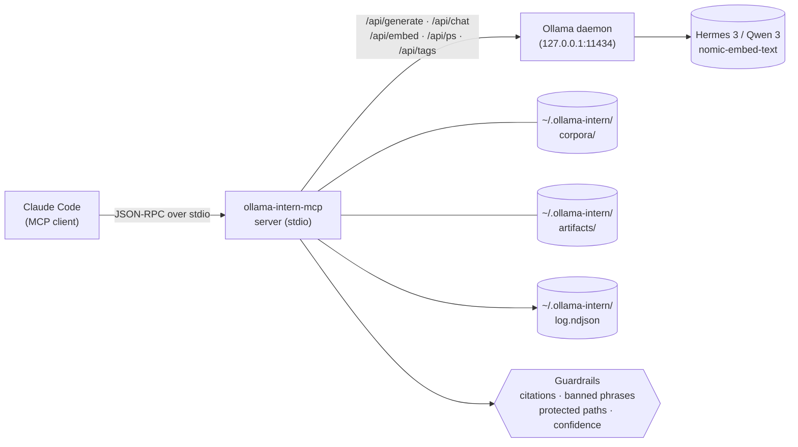

<p align="center">
  <a href="README.ja.md">日本語</a> | <a href="README.zh.md">中文</a> | <a href="README.md">English</a> | <a href="README.fr.md">Français</a> | <a href="README.hi.md">हिन्दी</a> | <a href="README.it.md">Italiano</a> | <a href="README.pt-BR.md">Português (BR)</a>
</p>

<p align="center">
  
</p>

<p align="center">
  <a href="https://github.com/mcp-tool-shop-org/ollama-intern-mcp/actions"></a>
  <a href="LICENSE"></a>
  <a href="https://mcp-tool-shop-org.github.io/ollama-intern-mcp/"></a>
  <a href="https://mcp-tool-shop-org.github.io/ollama-intern-mcp/handbook/"></a>
</p>

> **El becario local para Claude Code.** <!-- TOOL_COUNT:start -->44<!-- TOOL_COUNT:end --> herramientas diseñadas para tareas específicas, resúmenes basados en evidencia, artefactos duraderos.

Un servidor MCP que proporciona a Claude Code un **becario local** con reglas, niveles, un escritorio y un archivador. Claude elige la _herramienta_; la herramienta elige el _nivel_ (Instantáneo / de trabajo intensivo / Profundo / Integrado); el nivel escribe un archivo que puedes abrir la semana que viene.

**También ejecuta [Hermes Agent](https://github.com/NousResearch/hermes-agent) en `hermes3:8b`** — validado de principio a fin el 19 de abril de 2026. La configuración predeterminada es `hermes3:8b`; `qwen3:*` es la alternativa. Consulta [Uso con Hermes](#use-with-hermes) más abajo.

**Requisitos de hardware:** ~6 GB de VRAM para `hermes3:8b`, o ~16 GB de RAM para la inferencia en CPU. Consulta [handbook/getting-started](https://mcp-tool-shop-org.github.io/ollama-intern-mcp/handbook/getting-started/#hardware-minimums) para obtener información detallada.

**¿No usas Claude?** El directorio [`examples/`](./examples/) contiene un cliente MCP mínimo de Node.js y Python que puedes ejecutar a través de stdio. Consulta también [handbook/with-hermes](https://mcp-tool-shop-org.github.io/ollama-intern-mcp/handbook/with-hermes/).

**Prioridad local:** cero transferencia de datos a través de la red hasta que decidas activarla. Sin telemetría. Nada "autónomo". Cada llamada muestra su proceso. El enrutamiento opcional a [Ollama Cloud](#ollama-cloud-optional) permite utilizar modelos de clase 600B con las mismas herramientas cuando el hardware local es el cuello de botella, con una reversión automática al modo local.

---

## Nuevo en la versión 2.9.0

**La función de nube — un proceso de verificación entre familias, escalamiento a la nube bajo demanda y la economía para verlo.** El comportamiento con prioridad local no cambia: sin una clave configurada, el comportamiento es idéntico al de la versión 2.8.0 (cero transferencia de datos, sin comprobación inicial en la nube).

- **`ollama_verify_claims` — verificación entre familias.** `ollama_code_review` *genera* los resultados; esto *los evalúa*. Ejecuta un panel insignia de Ollama Cloud de una familia diferente (deepseek / kimi / glm por defecto) sobre tus afirmaciones + evidencia y devuelve CONFIRMADO / REFUTADO / NECESITA_REVISIÓN para cada afirmación. La agregación se basa en el principio de que la disidencia única nunca decide (≥2 para refutar, ≥2 para confirmar), cada jurado está verificado con un modelo servido localmente (se excluye y no se cuenta un modelo local alternativo o sustituto) y las entradas de las afirmaciones están estructuradas sin razonamiento. El límite honesto está documentado: una confirmación es evidencia de respaldo, no prueba; es fiable para señalar errores graves, pero menos eficaz con los errores sutiles de un modelo de vanguardia.
- **Escalamiento a la nube por llamada + modo de espera.** Establece `OLLAMA_API_KEY` *solo* (sin `OLLAMA_CLOUD_PRIMARY`) y estarás en **modo de espera**: prioridad local, cero transferencia de datos, sin comprobación inicial, hasta que una sola llamada active el modo con `backend:'cloud'`. Escala una revisión de alto riesgo a un modelo de 600B sin cambiar todas las llamadas al modo nube. La primera escalada revela la transferencia de datos de forma clara en el momento en que ocurre; ahora, una anulación de `model` por llamada se aplica literalmente al intento en la nube.
- **`ollama_log_stats` — las métricas económicas prometidas en el eslogan.** Un resumen sin LLM de tus recibos NDJSON: división entre nube y local, tasa de reversión de nube a local, tokens por herramienta, p50/p95 de latencia, limitado por una ventana `since`.
- **Herramienta de diagnóstico para CI + herramientas legibles por máquina.** `doctor --json --fail-unhealthy` proporciona a las canalizaciones una puerta de enlace real (con un indicador `healthy` compatible con la nube), y ahora cada herramienta incluye anotaciones MCP `readOnlyHint`/`destructiveHint`/`title`, para que los clientes obtengan la experiencia de usuario de permisos correcta. Además, `init --claude` crea un archivo `.mcp.json` listo para pegar.

Más detalles en [CHANGELOG.md](./CHANGELOG.md).

## Nuevo en la versión 2.8.0

**Mayor fiabilidad, durabilidad y seguridad — 25 correcciones, todas ellas probadas primero y verificadas entre familias.** El comportamiento con prioridad local no cambia y no se eliminó ningún contrato de herramienta; las llamadas existentes siguen funcionando. Las mejoras más importantes son:

- **No más pérdida silenciosa de datos del corpus.** Un error de lectura transitorio durante `ollama_corpus_refresh` (un bloqueo de archivos de Windows, una retención de un antivirus, una ventana de guardado de un editor) solía clasificar el archivo como "faltante" y **eliminar permanentemente su contenido indexado**. Ahora solo se elimina un archivo que realmente no existe; un error transitorio conserva la ruta, lo marca para reintentar y preserva sus fragmentos.
- **Concurrencia que respeta sus límites.** Un tiempo de espera de nivel ahora puede cancelar una llamada que aún está en cola para obtener un permiso (antes se quedaba bloqueada mucho después del límite mientras los recibos indicaban otra cosa), y `ollama_chat` finalmente se enruta a través de la unión de tiempo de espera/nivel, por lo que una generación local atascada no puede detener todas las herramientas y realmente llega a la nube en el modo con prioridad en la nube.
- **Nube que se degrada en lugar de fallar.** Un ID de modelo de nube retirado ahora vuelve al modo local con una razón clara `cloud_model_missing` y una indicación específica de la nube en lugar de un fallo total; el interruptor automático no puede bloquearse permanentemente; un modelo persistentemente faltante deja de realizar una solicitud a la nube en cada llamada.
- **Superficie de seguridad que coincide con su documentación.** `ollama_batch_proof_check` ahora realmente aplica la contención del directorio de trabajo (con una nueva restricción de entorno del operador `INTERN_BATCH_PROOF_ALLOWED_ROOTS` que un llamador no puede ampliar), los sanitizadores de inyección de prompts obtuvieron cobertura + un límite honestamente divulgado, y el protector de ruta protegido no distingue entre mayúsculas y minúsculas en macOS.
- **Artefactos y recibos honestos.** Las escrituras de paquetes son atómicas y nunca sobrescriben silenciosamente; los sobre de lotes degradados informan del nivel que se utilizó realmente; el detector de escritura interrumpida detecta las escrituras incompletas en cualquier modificación; los ID de fragmento ya no entran en conflicto entre archivos con contenido idéntico. La auditoría de dependencias es completamente clara (0 vulnerabilidades).

Más detalles en [CHANGELOG.md](./CHANGELOG.md).

## Nuevo en la versión 2.7.0

**Enrutamiento opcional de Ollama Cloud: primario en la nube, con respaldo local.** Para activarlo, utilice una clave y un indicador, y las capas generativas se dirigirán a un modelo en la nube de clase 600B; los embeddings permanecerán locales; un mecanismo de seguridad volverá al perfil local en caso de cualquier fallo en la nube. **Desactivado por defecto: sin transferencia de datos a menos que configure tanto `OLLAMA_API_KEY` como `OLLAMA_CLOUD_PRIMARY=1`.** Mejora menor y aditiva: los usuarios de versiones anteriores a v2.7.0 (y aquellos que no activen la función) verán un comportamiento idéntico. Consulte [Ollama Cloud (opcional)](#ollama-cloud-optional).

- **Primario en la nube con una red de seguridad.** Un `RoutingOllamaClient` intenta primero utilizar la nube y, si se produce un tiempo de espera / error 5xx / 429 / problema de red, vuelve al perfil local. Las claves incorrectas (401/403) se detectan claramente mediante un mecanismo de seguridad persistente en lugar de degradarse silenciosamente para siempre; también se detecta un ID de modelo en la nube retirado o con errores tipográficos (404).
- **Nunca una degradación silenciosa.** Cada mensaje incluye `backend` (`cloud`|`local`), `degraded` y `degrade_reason`, por lo que siempre sabrá cuándo se utilizó el modelo local en lugar del modelo principal. Un evento NDJSON `backend_fallback` hace visible la tasa de cambio de nube a local en `ollama_log_tail`.
- **`ollama_doctor` informa sobre la autenticación y la accesibilidad de la nube** como un bloque distinto; `ollama-intern-mcp doctor` muestra una sección `Cloud (primary)`.
- El modelo predeterminado en la nube era `minimax-m3:cloud` en el lanzamiento v2.7.0 *(desde entonces se ha cambiado a `qwen3-coder-next:cloud`: un valor predeterminado que devuelve respuestas vacías en las herramientas con un límite de `num_predict`; consulte la [tabla de variables de entorno](#cloud-env-vars))*; puede anularlo por capa con `INTERN_CLOUD_MODEL` / `INTERN_CLOUD_DEEP_MODEL`.

## Nuevo en v2.6.0

Anulación del presupuesto por llamada y por capa en `ollama_extract`. Mejora menor y aditiva: los usuarios de versiones anteriores a v2.6.0 no se verán afectados. Entrada detallada en [CHANGELOG.md](./CHANGELOG.md).

- **Campo del esquema `tier_budget_ms_override?: number` en `ollama_extract`** (opcional, con un límite de `[1, 600000]` ms). Cuando está presente, aplica la anulación a cada capa visitada por el ejecutor, de modo que el mecanismo interno `runWithTimeoutAndFallback` en `src/guardrails/timeouts.ts:61` respete el presupuesto proporcionado por el operador en lugar del valor predeterminado del perfil. La cascada (motor principal → instantáneo al alcanzar el tiempo de espera) sigue activándose; la anulación rige cada salto de la cascada de forma uniforme.
- **Por qué existe esto.** El wrapper R-018 de research-os (v0.12.1) envolvió `callTool` de MCP con `Promise.race` y descubrió que el presupuesto del wrapper no alcanzaba la capa interna: `DEV_RTX5080_TIMEOUTS.instant = 15_000` continuó activando `TIER_TIMEOUT` a los 15000 ms, independientemente del presupuesto de 180000 ms del wrapper. v2.6.0 proporciona el presupuesto autoritativo en el lado de MCP para que la bandera `--planner-timeout-ms` del operador (research-os) controle finalmente los tiempos de espera de las capas internas según lo previsto.
- **Se conserva el comportamiento predeterminado.** Si se omite el campo, se aplican los valores predeterminados del perfil de forma idéntica. Los usuarios de versiones anteriores a v2.6.0 no notarán ningún cambio.
- **Se conserva la expresión regular `R-010 fallback-cause`.** El mensaje de error `TIER_TIMEOUT` en el lado del servidor sigue coincidiendo con `/elapsed=(\d+)ms/` + `/budget=(\d+)ms/`, por lo que la visibilidad del asesor de IA aguas abajo funciona tanto en las rutas de anulación como en las predeterminadas.
- Utilizado por research-os v0.13.0 (integración acumulativa del cliente R-019 + R-020 + R-021) en un lanzamiento coordinado entre varios repositorios.

### Histórico: entregas de v2.4.0

Consulte [CHANGELOG.md](./CHANGELOG.md) y [docs/release-notes/v2.4.0.md](./docs/release-notes/v2.4.0.md) para obtener la entrada completa de v2.4.0 (control por capa de `num_ctx` en el sistema de perfiles).

## Nuevo en v2.4.0

Control por capa de `num_ctx` (tamaño de la ventana de contexto) en el sistema de perfiles. Mejora menor y aditiva: los usuarios de v2.3.0 no se verán afectados. Entradas detalladas en [CHANGELOG.md](./CHANGELOG.md) y [docs/release-notes/v2.4.0.md](./docs/release-notes/v2.4.0.md).

- **Nuevo mapa `TierConfig.num_ctx`:** opcional `{ instant?, workhorse?, deep?, embed? }` en el perfil. Cuando se establece para una capa, el servidor MCP coloca `options.num_ctx = <value>` en cada solicitud de generación/chat de Ollama dirigida a esa capa (inicial + de respaldo). Cuando no está establecido, la solicitud omite por completo `num_ctx`, por lo que Ollama utiliza su valor predeterminado cargado con el modelo; se conserva exactamente el comportamiento de v2.3.0.
- **Nuevo campo en el mensaje: `num_ctx_used?: number`:** presente solo cuando el servidor MCP realmente envió `num_ctx`. Ausente cuando la solicitud permitió que Ollama eligiera. No infiera un valor predeterminado: el servidor MCP no consulta a Ollama para obtener el valor efectivo.
- **Valores predeterminados del perfil:** `dev-rtx5080` / `dev-rtx5080-qwen3` se envían con `instant: 4096`, `workhorse: 8192`, `deep`/`embed` NO ESTABLECIDOS. Dimensionados para mantener `hermes3:8b` residente en los 16 GB de VRAM de la RTX 5080 para herramientas rápidas. `m5-max` deja todas las capas SIN ESTABLECER: no hay problemas de desbordamiento con 128 GB de memoria unificada.
- **Cierra el diagnóstico de la Fase 1 de v0.8.0:** `hermes3:8b` con el contexto predeterminado de 32K en RTX 5080 se derramó a la CPU y comenzó a provocar tiempos de espera en las llamadas `ollama_extract`. v2.4.0 evita esto en la capa del perfil.

### Control por capa de `num_ctx` (nuevo en v2.4.0)

Perfil (fragmento de `src/profiles.ts`):

```ts
"dev-rtx5080": {
  tiers: {
    instant: "hermes3:8b",
    workhorse: "hermes3:8b",
    deep: "hermes3:8b",
    embed: "nomic-embed-text",
    num_ctx: {
      instant: 4096,    // fast classify/summarize
      workhorse: 8192,  // schema-bound extract / batch
      // deep: UNSET — long-context briefs keep current behavior
      // embed: UNSET — no context-window pressure on embed
    },
  },
  // ... timeouts, prewarm
}
```

Mensaje en una llamada a la capa "workhorse" (por ejemplo, `ollama_extract`):

```jsonc
{
  "result": { /* extracted data */ },
  "tier_used": "workhorse",
  "model": "hermes3:8b",
  "num_ctx_used": 8192,        // present because the profile set workhorse=8192
  // ... rest of envelope unchanged
}
```

En `m5-max` (o cualquier perfil que deje una capa sin establecer), `num_ctx_used` está ausente del mensaje y la solicitud al cable de Ollama no incluye el campo `num_ctx`: Ollama utiliza su valor predeterminado cargado con el modelo.

Los operadores ajustan seleccionando o editando el perfil; no hay una entrada `num_ctx` por llamada en los esquemas de las herramientas. Si una llamada futura revela la necesidad, el patrón sigue a la anulación de `model` de v2.3.0.

### Histórico: entregas de v2.3.0

Consulte [CHANGELOG.md](./CHANGELOG.md) y [docs/release-notes/v2.3.0.md](./docs/release-notes/v2.3.0.md) para obtener la entrada completa de v2.3.0 (anulación del modelo por llamada).

## Nuevo en v2.3.0

Anulación del modelo por llamada en todas las herramientas atómicas basadas en LLM. Mejora menor y aditiva: los usuarios de v2.2.0 no se verán afectados. Entradas detalladas en [CHANGELOG.md](./CHANGELOG.md) y [docs/release-notes/v2.3.0.md](./docs/release-notes/v2.3.0.md).

- **Parámetro opcional `model: string` en 8 herramientas de atomización** — `ollama_extract`, `ollama_classify`, `ollama_summarize_fast`, `ollama_summarize_deep`, `ollama_research`, `ollama_corpus_answer`, `ollama_chat`, `ollama_code_citation`. El primer intento en el nivel de la herramienta se ejecuta con el modelo especificado por quien realiza la llamada; si se agota el tiempo, la cascada existente de `TIER_FALLBACK` resuelve el modelo del nivel más económico (NO el que especificó quien realizó la llamada). Las herramientas compuestas/breves/de agrupación NO aceptan deliberadamente `model`; los átomos tienen control por llamada, las herramientas compuestas utilizan los valores predeterminados del nivel.
- **Nuevo campo de envoltorio `model_requested?: string`** — presente solo cuando se proporcionó el parámetro de anulación. Los programas que tienen en cuenta la calibración comparan `model_requested` con `model` para detectar una sustitución: `if (env.model_requested && env.model !== env.model_requested) { /* sustitución */ }`. Las entradas vacías o que solo contienen espacios generan un error de `ZodError` durante el análisis del esquema, en lugar de realizar una sustitución silenciosa.
- **Corrección de errores: desviación de `src/version.ts`.** La constante `VERSION` en tiempo de ejecución ahora se lee desde `package.json` cuando se carga el módulo; las versiones v2.1.0 y v2.2.0 mostraban la cadena de identidad obsoleta `"2.0.0"`. El nuevo archivo `tests/version.test.ts` bloquea `VERSION === pkg.version`.

### Anulación del modelo por llamada (nuevo en v2.3.0)

```jsonc
{
  "tool": "ollama_classify",
  "arguments": {
    "text": "patch null pointer in auth",
    "labels": ["feat", "fix", "chore"],
    "frame": "what is the change kind?",
    "model": "hermes3:8b"
  }
}
```

Envoltorio:

```jsonc
{
  "result": { "label": "fix", "confidence": 0.9, "off_topic": false, ... },
  "tier_used": "instant",
  "model": "hermes3:8b",
  "model_requested": "hermes3:8b",       // present because override was supplied
  // ... rest of envelope unchanged
}
```

Si el nivel principal o profundo hubiera excedido el tiempo límite y la llamada hubiera pasado al nivel instantáneo, `env.model` sería el modelo resuelto del nivel instantáneo y `env.fallback_from` sería `"workhorse"`; `env.model_requested` seguiría siendo `"hermes3:8b"`, y `env.model !== env.model_requested` es la señal de sustitución. La anulación NO se aplica deliberadamente al nivel más económico; el modelo elegido puede que no se ajuste en absoluto a la función de ese nivel.

### Histórico: entregas de v2.2.0

Consulte [CHANGELOG.md](./CHANGELOG.md) y [docs/release-notes/v2.2.0.md](./docs/release-notes/v2.2.0.md) para obtener la entrada completa de v2.2.0 (pertinencia limitada al marco + abstención estructurada).

## Nuevo en v2.2.0

Contrato del rol de trabajador de evidencia local: pertinencia limitada al marco y abstención estructurada. Mejora menor aditiva: los programas de v2.1.0 no se modifican. Entradas detalladas en [CHANGELOG.md](./CHANGELOG.md) y [docs/release-notes/v2.2.0.md](./docs/release-notes/v2.2.0.md).

- **Extracción limitada al marco** en `ollama_extract`, `ollama_classify`, `ollama_summarize_fast`, `ollama_summarize_deep` — parámetro opcional `frame: string` + salidas estructuradas `frame_alignment`/`on_topic`/`frame_addressed`. En lugar de parafrasear las fuentes que no están relacionadas con el tema, se marcan.
- **Abstención estructurada** en `ollama_research` — campos `weak`/`abstained`/`sources_address_question`. Un archivo `citations[]` vacío con un `answer` no vacío ya no se considera un éxito silencioso.
- **Umbral de pertinencia** en `ollama_corpus_answer` — parámetro opcional `min_top_score`. Por debajo del umbral, la herramienta interrumpe el proceso con `abstained: true` y omite la síntesis. El `score` por cita ahora es visible en cada cita.
- **Preservación de la puntuación de recuperación** a través de evidencia breve — `corpusHitsToEvidence` conserva `score` (y el parámetro `corpus_min_evidence_score` filtra en el momento del ensamblaje en `incident_brief`/`repo_brief`/`change_brief`).
- **Límites del rango de líneas de cita** — `guardrails/citations.ts` rechaza los rangos fuera de límites en `ollama_research`, lo que coincide con la postura existente en `ollama_code_citation`.
- **Se corrigieron los documentos del contrato del operador** — se corrigió `chunk_id`/`chunk_index` en el archivo README, se reescribió "validado en el lado del servidor", se calificó la sección de las leyes de la evidencia y se anotó el eslogan de marketing.

### Regresión de la semilla: la verificación

Se verifica el contrato del fragmento con respecto al fallo literal de fresh-pack de research-os: arxiv 2112.10422 (Temporizadores estándar cosmológicos) en el marco de la sección 01 *"¿Qué significa la custodia de la evidencia en los flujos de trabajo de investigación profunda de LLM locales frente a los basados en la nube?"* — 9 de 9 pruebas del contrato de LLM simulado confirman que ahora se contiene la fuente que no está relacionada con el tema (`frame_alignment.on_topic = false` en extract; `off_topic: true` en classify; `frame_addressed: false` en summarize_deep; `abstained: true` en corpus_answer con `min_top_score` establecido).

### Histórico: entregas de v2.1.0

Consulte [CHANGELOG.md](./CHANGELOG.md) para obtener la entrada completa de v2.1.0 (éxito de la función: 13 nuevas herramientas + 4 mejoras + eliminación de la restricción).

---

## Arquitectura en resumen


```mermaid
flowchart LR
  Claude["Claude Code<br/>(MCP client)"]
  MCP["ollama-intern-mcp<br/>server (stdio)"]
  Ollama["Ollama daemon<br/>(127.0.0.1:11434)"]
  Models[("Hermes 3 / Qwen 3<br/>nomic-embed-text")]
  Corpus[("~/.ollama-intern/<br/>corpora/")]
  Artifacts[("~/.ollama-intern/<br/>artifacts/")]
  NDJSON[("~/.ollama-intern/<br/>log.ndjson")]
  Guards{{"Guardrails<br/>citations · banned phrases<br/>protected paths · confidence"}}

  Claude -- "JSON-RPC over stdio" --> MCP
  MCP --> Guards
  MCP -- "/api/generate · /api/chat<br/>/api/embed · /api/ps · /api/tags" --> Ollama
  Ollama --> Models
  MCP --- Corpus
  MCP --- Artifacts
  MCP --> NDJSON
```

Cada llamada a una herramienta de Claude entra en el servidor MCP a través de stdio JSON-RPC. El servidor valida la llamada con respecto al esquema [zod](https://zod.dev) de la herramienta, ejecuta las protecciones configuradas (validación de citas, eliminación de frases prohibidas, aplicación de rutas protegidas, umbrales de confianza) y luego enruta a un renderizador determinista (nivel de artefactos) o a una llamada HTTP de Ollama (todos los demás niveles). El daemon de Ollama nunca ve las rutas proporcionadas por el usuario; solo el nivel del modelo y la solicitud preparada. Cada llamada agrega un evento estructurado al registro NDJSON en `~/.ollama-intern/log.ndjson`, donde `ollama_log_tail` y su shell pueden leerlo.

---

## Ejemplo principal: una llamada, un artefacto

```jsonc
// Claude → ollama-intern-mcp
{
  "tool": "ollama_incident_pack",
  "arguments": {
    "title": "sprite pipeline 5 AM paging regression",
    "logs": "[2026-04-16 05:07] worker-3 OOM killed\n[2026-04-16 05:07] ollama /api/ps reports evicted=true size=8.1GB\n...",
    "source_paths": ["F:/AI/sprite-foundry/src/worker.ts", "memory/sprite-foundry-visual-mastery.md"]
  }
}
```

Devuelve un envoltorio que apunta a un archivo en el disco:

```jsonc
{
  "result": {
    "pack": "incident",
    "slug": "2026-04-16-sprite-pipeline-5-am-paging-regression",
    "artifact_md":   "~/.ollama-intern/artifacts/incident/2026-04-16-sprite-pipeline-5-am-paging-regression.md",
    "artifact_json": "~/.ollama-intern/artifacts/incident/2026-04-16-sprite-pipeline-5-am-paging-regression.json",
    "weak": false,
    "evidence_count": 6,
    "next_checks": ["residency.evicted across last 24h", "OLLAMA_MAX_LOADED_MODELS vs loaded size"]
  },
  "tier_used": "deep",
  "model": "hermes3:8b",
  "hardware_profile": "dev-rtx5080",
  "tokens_in": 4180, "tokens_out": 612,
  "elapsed_ms": 8410,
  "residency": { "in_vram": true, "evicted": false }
}
```

→ `weak: false` significa que se ensamblaron ≥2 elementos de evidencia; NO significa que las hipótesis estén verificadas. Consulte [Leyes de la evidencia](#evidence-laws) a continuación.

Ese archivo Markdown es el resultado del trabajo del becario: encabezados, bloque de evidencia con identificadores citados, `next_checks` investigativos, banner `weak: true` si la evidencia es escasa. Es determinista: el renderizador es código, no una solicitud. (El renderizador es determinista; el *contenido* de las hipótesis y los elementos es generativo; léalos como un borrador, no como algo verificado). Ábralo mañana, compárelo la semana que viene, expórtelo a un manual con `ollama_artifact_export_to_path`.

Todos los competidores en esta categoría comienzan con "ahorrar tokens". Nosotros comenzamos con _aquí está el archivo que escribió el becario_.

### Segundo ejemplo: cree un corpus y luego pregúntele

```jsonc
// 1. Build a persistent, searchable corpus over your project.
{ "tool": "ollama_corpus_index",
  "arguments": { "name": "sprite-foundry",
                 "paths": ["F:/AI/sprite-foundry/src"],
                 "embed_model": "nomic-embed-text" } }
// → { chunks_written: 1204, paths_indexed: 312, failed_paths: [] }

// 2. Ask an evidence-bound question against it.
{ "tool": "ollama_corpus_answer",
  "arguments": { "name": "sprite-foundry",
                 "query": "how does the worker handle OOM eviction?",
                 "top_k": 8 } }
// → { answer: "...", citations: [{chunk_index, path}...], weak: false }
```

El servidor valida la identidad de la cita y que cada `chunk_index` esté dentro del rango de los resultados obtenidos. NO prueba que cada afirmación generada esté respaldada semánticamente por el contenido del fragmento citado; esa es la responsabilidad del modelo, y una recuperación deficiente aún puede producir respuestas con formato de cita. Consulta completa en [handbook/corpora](https://mcp-tool-shop-org.github.io/ollama-intern-mcp/handbook/corpora/).

---

## Extracción delimitada por un marco (nuevo en la v2.2.0)

`ollama_extract`, `ollama_classify`, `ollama_summarize_fast` y `ollama_summarize_deep` aceptan una entrada opcional `frame: string`. El parámetro `frame` especifica la pregunta a la que se le pide al origen que responda; se indica al modelo que se abstenga en lugar de emitir contenido verdadero pero fuera de tema cuando el origen no aborda el marco.

```jsonc
{
  "tool": "ollama_extract",
  "arguments": {
    "text": "<long source document>",
    "schema": { /* your fields */ },
    "frame": "section purpose here — e.g. 'OOM eviction behavior in the sprite worker'"
  }
}
// → result includes frame_alignment: { on_topic: boolean, reason: string, unaddressed_aspects: string[] }
```

Si se omite `frame`, el comportamiento no cambia con respecto a la v2.1.0. Cuando se proporciona, `frame_alignment.on_topic = false` indica que los campos extraídos pueden ser verdaderos para la fuente, pero no relevantes para el marco; trate esto como lo mismo que un resumen con `weak: true`: útil, pero verifique antes de promoverlo a evidencia posterior.

---

## Acuerdo de abstención (nuevo en la v2.2.0)

`ollama_research` devuelve campos de abstención estructurados: `weak: boolean`, `abstained: boolean`, `sources_address_question: boolean | null`. Una lista de `citations[]` vacía con una `answer` no vacía ya no se considera silencio; `abstained: true` indica que el modelo se negó a sintetizar porque las rutas proporcionadas por el llamante no abordaban la pregunta. Considere la abstención como un éxito, no como un fracaso: es la herramienta negándose a "lavar" una recuperación deficiente para producir resultados autorizados.

`ollama_corpus_answer` acepta un umbral de relevancia opcional `min_top_score: number` (de 0,0 a 1,0). Cuando la puntuación de recuperación más alta para una consulta cae por debajo de `min_top_score`, la herramienta interrumpe el proceso con `abstained: true` y omite la síntesis, evitando el modo de falla "5 fragmentos fuera de tema con una puntuación de 0,21 aún generan una respuesta completa" que la regla `weak: true` de la v2.1.0 no detectaba (`weak: true` solo se activaba cuando `hits.length < 2`). Combine esto con el campo `score` por cita recién incluido en cada cita para auditar directamente la calidad de la recuperación desde el sobre.

---

## ¿Qué hay aquí? — Cuatro niveles, <!-- TOOL_COUNT:start -->44<!-- TOOL_COUNT:end --> herramientas

**Orientado al trabajo** significa que cada herramienta especifica un trabajo que se le asignaría a un becario: clasificar esto, extraer aquello, priorizar estos registros, redactar esta nota de lanzamiento, organizar este incidente. La entrada de la herramienta es la especificación del trabajo; la salida es el resultado final. No hay una función genérica `run_model` / `chat_with_llm` en la parte superior.

| Nivel | Cantidad | Qué contiene |
|---|---|---|
| **Atoms** | 31 | Funciones básicas orientadas al trabajo. **Originales 15:** `classify`, `extract`, `triage_logs`, `summarize_fast` / `deep`, `draft`, `research`, `corpus_search` / `answer` / `index` / `refresh` / `list`, `embed_search`, `embed`, `chat`. **+13 agregadas en la v2.1.0:** `doctor`, `log_tail`, `batch_proof_check` (operaciones); `code_map`, `code_citation`, `multi_file_refactor_propose`, `refactor_plan` (refactorización); `artifact_prune`, `hypothesis_drill` (artefacto/resumen); `corpus_health`, `corpus_amend`, `corpus_amend_history`, `corpus_rerank` (corpus). **+1 átomo de revisión:** `code_review` (hallazgos estructurados de la revisión de solicitudes de extracción, herramienta principal; solo para revisión). **+2 en la v2.9:** `verify_claims` (un panel insignia de nube inter-familiar adjudica las afirmaciones; requiere la nube) y `log_stats` (agrega los recibos NDJSON en métricas económicas: división entre nube/local, tasa de respaldo, p50/p95 por herramienta; no se realiza ninguna llamada al modelo). Los átomos con capacidad por lotes (`classify`, `extract`, `triage_logs`) aceptan `items: [{id, text}]`. |
| **Briefs** | 3 | Resúmenes estructurados de operadores respaldados por evidencia. `incident_brief`, `repo_brief`, `change_brief`. Cada afirmación cita un ID de evidencia; los datos desconocidos se eliminan en el lado del servidor. La evidencia débil muestra `weak: true` en lugar de una narrativa falsa. |
| **Packs** | 3 | Trabajos compuestos de canalización fija que escriben Markdown + JSON duraderos en `~/.ollama-intern/artifacts/`. `incident_pack`, `repo_pack`, `change_pack`. Renderizadores deterministas: no se realizan llamadas al modelo en el formato del artefacto. |
| **Artifacts** | 7 | Superficie de continuidad sobre las salidas del paquete. `artifact_list` / `read` / `diff` / `export_to_path`, más tres fragmentos deterministas: `incident_note`, `onboarding_section`, `release_note`. |

Total: **31 átomos + 3 resúmenes + 3 paquetes + 7 herramientas de artefacto = <!-- TOOL_COUNT:start -->44<!-- TOOL_COUNT:end -->**.

Líneas congeladas:
- Átomos: la congelación se levantó en la v2.1.0 (31 hoy; +13 agregados en el lanzamiento de funciones de la v2.1.0, +1 `code_review` más tarde, +2 en la v2.9: `verify_claims`, `log_stats`). Los nuevos átomos aún requieren una justificación basada en auditorías, pruebas, una página del manual y una entrada en el registro de cambios; no se realizarán adiciones casuales.
- Paquetes congelados en 3. No hay nuevos tipos de paquetes.
- Nivel de artefactos congelado en 7.

La referencia completa de las herramientas está disponible en el [manual](https://mcp-tool-shop-org.github.io/ollama-intern-mcp/handbook/tools/).

---

## Instalación

Requiere que [Ollama](https://ollama.com) se esté ejecutando localmente y que los modelos del nivel se hayan descargado (consulte [Descarga de modelos](#model-pulls) a continuación).

### Claude Code (recomendado)

La mayoría de los usuarios lo instalan agregándolo a la configuración del servidor Claude Code MCP; no se requiere una instalación global. Claude Code ejecuta el servidor bajo demanda mediante `npx`:

```json
{
  "mcpServers": {
    "ollama-intern": {
      "command": "npx",
      "args": ["-y", "ollama-intern-mcp"],
      "env": {
        "OLLAMA_HOST": "http://127.0.0.1:11434",
        "INTERN_PROFILE": "dev-rtx5080"
      }
    }
  }
}
```

### Claude Desktop

El mismo bloque, escrito en `~/Library/Application Support/Claude/claude_desktop_config.json` (macOS) o `%APPDATA%\Claude\claude_desktop_config.json` (Windows).

### Instalación global (avanzada)

Solo es necesario si desea que el binario esté en su `PATH` para uso ad hoc fuera de Claude Code:

```bash
npm install -g ollama-intern-mcp
```

### Uso con Hermes

Este MCP se validó de principio a fin con [Hermes Agent](https://github.com/NousResearch/hermes-agent) contra `hermes3:8b` en Ollama (19 de abril de 2026). Hermes es un agente externo que *se comunica* con la superficie primitiva congelada de este MCP; él se encarga de la planificación, nosotros del trabajo.

Configuración de referencia ([hermes.config.example.yaml](hermes.config.example.yaml) en este repositorio):

```yaml
model:
  provider: custom
  base_url: http://localhost:11434/v1
  default: hermes3:8b
  context_length: 65536    # Hermes requires 64K floor under model.*

providers:
  local-ollama:
    name: local-ollama
    base_url: http://localhost:11434/v1
    api_mode: openai_chat
    api_key: ollama
    model: hermes3:8b

mcp_servers:
  ollama-intern:
    command: npx
    args: ["-y", "ollama-intern-mcp"]
    env:
      OLLAMA_HOST: http://localhost:11434
      INTERN_PROFILE: dev-rtx5080
      # hermes3:8b is the default ladder in v2.0.0, so tier overrides are
      # only needed if you're pinning a different local model.
```

**La estructura del mensaje es importante.** Los mensajes imperativos que invocan herramientas ("Llama a X con los argumentos...") son la prueba de integración; proporcionan a un modelo local de 8B suficiente base para generar `tool_calls` limpios. Los mensajes en forma de lista para múltiples tareas ("haz A, luego B, luego C") son puntos de referencia de capacidad para modelos más grandes; no interpretes un fallo en el formato de lista en un modelo de 8B como "la conexión está rota". Consulta [handbook/with-hermes](https://mcp-tool-shop-org.github.io/ollama-intern-mcp/handbook/with-hermes/) para obtener la guía completa de integración y las limitaciones conocidas del transporte (Ollama `/v1` en streaming + openai-SDK sin streaming).

### Descarga de modelos

**Perfil predeterminado para desarrollo (RTX 5080 16 GB y similares):**

```bash
ollama pull hermes3:8b
ollama pull nomic-embed-text
export OLLAMA_MAX_LOADED_MODELS=2
export OLLAMA_KEEP_ALIVE=-1
```

**Alternativa Qwen 3 (mismo hardware, para las herramientas de Qwen):**

```bash
ollama pull qwen3:8b
ollama pull qwen3:14b
ollama pull nomic-embed-text
export INTERN_PROFILE=dev-rtx5080-qwen3
```

**Perfil M5 Max (128 GB unificado):**

```bash
ollama pull qwen3:14b
ollama pull qwen3:32b
ollama pull nomic-embed-text
export INTERN_PROFILE=m5-max
```

Las variables de entorno por nivel (`INTERN_TIER_INSTANT`, `INTERN_TIER_WORKHORSE`, `INTERN_TIER_DEEP`, `INTERN_EMBED_MODEL`) siguen anulando las selecciones del perfil para casos puntuales.

---

## Sobre uniforme

Cada herramienta devuelve la misma estructura:

```ts
{
  result: <tool-specific>,
  tier_used: "instant" | "workhorse" | "deep" | "embed",
  model: string,
  hardware_profile: string,     // "dev-rtx5080" | "dev-rtx5080-qwen3" | "m5-max"
  tokens_in: number,
  tokens_out: number,
  elapsed_ms: number,
  residency: {
    in_vram: boolean,
    size_bytes: number,
    size_vram_bytes: number,
    evicted: boolean
  } | null
}
```

`residency` proviene de `/api/ps` de Ollama. Cuando `evicted: true` o `size_vram < size`, el modelo se guarda en disco y la inferencia disminuye entre 5 y 10 veces; muestra esto al usuario para que sepa que debe reiniciar Ollama o reducir la cantidad de modelos cargados.

En el modo [Ollama Cloud](#ollama-cloud-optional), el sobre también contiene `backend` (`"cloud"` | `"local"`) y, en caso de cambio a un entorno local desde la nube, `degraded: true` + `degrade_reason`. Estos campos **no están presentes** en la ruta predeterminada solo local, por lo que los consumidores existentes no se ven afectados. `residency` es `null` para las llamadas servidas desde la nube (la nube sin estado no tiene residencia de VRAM local).

Cada llamada se registra como una línea NDJSON en `~/.ollama-intern/log.ndjson`. Filtra por `hardware_profile` para evitar que los números de desarrollo aparezcan en puntos de referencia publicables.

---

## Perfiles de hardware

| Perfil | Instantáneo | De trabajo intensivo | Profundo | Incrustación |
|---|---|---|---|---|
| **`dev-rtx5080` (predeterminado)** | hermes3 8B | hermes3 8B | hermes3 8B | nomic-embed-text |
| `dev-rtx5080-qwen3` | qwen3 8B | qwen3 8B | qwen3 14B | nomic-embed-text |
| `m5-max` | qwen3 14B | qwen3 14B | qwen3 32B | nomic-embed-text |

**El perfil `dev` predeterminado** agrupa los tres niveles de trabajo en `hermes3:8b`; esta es la ruta de integración validada para Hermes Agent. El uso del mismo modelo de arriba a abajo significa que solo hay una cosa que descargar, un costo de residencia y un conjunto de comportamientos que comprender. Los usuarios que prefieren Qwen 3 (con su sistema `THINK_BY_SHAPE`) pueden optar por `dev-rtx5080-qwen3`. `m5-max` es la escala de Qwen 3 diseñada para memoria unificada.

---

## Ollama Cloud (opcional)

Los modelos locales de 8B son el cuello de botella de hardware que la mayoría de las personas encuentran. [Ollama Cloud](https://ollama.com/cloud) sirve modelos de clase 600B detrás de la **misma** superficie `/api/*`, por lo que puedes dirigir las herramientas más pesadas a un modelo mucho más potente y liberar VRAM local, al tiempo que mantienes el entorno local como una opción siempre activa.

**Esto es opcional y está desactivado de forma predeterminada.** Sin establecer ninguna clave, el paquete permanece en modo local primero con **cero transferencia de datos**: cualquier persona que no active esta función no se verá afectada. Hay dos formas de activarlo:

- **Principalmente en la nube** (abajo): establece tanto `OLLAMA_CLOUD_PRIMARY=1` como `OLLAMA_API_KEY`; los niveles generativos se dirigen a la nube con una opción de cambio a un entorno local.
- **En espera en la nube** (v2.9): establece solo `OLLAMA_API_KEY`; todo permanece local (sigue sin haber transferencia de datos, ni siquiera una sonda de inicio) hasta que una sola llamada solicite explícitamente escalar con `backend: "cloud"`. Consulta [Cambio a la nube en espera y escalado por llamada](#cloud-standby--per-call-escalation) a continuación.

```json
{
  "mcpServers": {
    "ollama-intern": {
      "command": "npx",
      "args": ["-y", "ollama-intern-mcp"],
      "env": {
        "OLLAMA_CLOUD_PRIMARY": "1",
        "OLLAMA_API_KEY": "sk-...your-key...",
        "INTERN_PROFILE": "dev-rtx5080"
      }
    }
  }
}
```

> **La clave es una variable de entorno en tiempo de ejecución, no un secreto de CI.** Un secreto de GitHub Actions solo es visible dentro de las ejecuciones de CI; nunca llega al servidor en funcionamiento. Crea una clave en [ollama.com/settings/keys](https://ollama.com/settings/keys) y colócala en el bloque `env` del cliente MCP o en tu entorno de shell.

**Cómo funciona el enrutamiento.** Cuando la nube está activada, los niveles generativos (instantáneo / de trabajo intensivo / profundo) se dirigen al modelo de la nube; **las incrustaciones siempre permanecen locales** (Ollama Cloud no sirve modelos de incrustación, por lo que las herramientas de corpus/incrustación no se ven afectadas). Un interruptor automático intenta primero conectarse a la nube y vuelve a tu perfil local en caso de tiempo de espera / errores 5xx / 429 / problemas de red. Una clave incorrecta (401/403) activa un interruptor *persistente* que muestra una advertencia clara en lugar de degradar silenciosamente el rendimiento. El perfil local (`INTERN_PROFILE`) es la escala de respaldo, así que mantén sus modelos descargados.

**Nunca se te reducirá el rendimiento de forma silenciosa.** Cada sobre informa qué backend atendió la llamada:

```ts
{ ...envelope, backend: "cloud" | "local", degraded?: true, degrade_reason?: "cloud_timeout" | "cloud_5xx" | "cloud_rate_limited" | "cloud_unreachable" | "cloud_auth_failed" | "circuit_open" }
```

Una línea `backend_fallback` aparece en `~/.ollama-intern/log.ndjson` en cada cambio a un entorno local desde la nube (`ollama_log_tail --filter_kind backend_fallback`), y `ollama-intern-mcp doctor` muestra un bloque **Nube (principal | en espera)** con el modo, la capacidad de conexión y el estado de autenticación.

### Cambio a la nube en espera y escalado por llamada

Establecer `OLLAMA_API_KEY` **sin** `OLLAMA_CLOUD_PRIMARY` activa el modo **en espera**: el enrutamiento permanece principalmente local y nada sale de la máquina, hasta que una llamada contenga `backend: "cloud"` (expuesto en `ollama_chat`, utilizado internamente por `ollama_verify_claims`). Esa única llamada se escala al modelo de la nube, con el mismo interruptor automático + mecanismo de cambio a un entorno local y la misma procedencia del sobre; todas las demás llamadas permanecen locales. La **primera** llamada escalada imprime una advertencia clara en stderr que indica el host y escribe una línea `cloud_egress` en el registro NDJSON; la transferencia de datos se revela en el momento en que ocurre, no solo aquí en la documentación.

Las reglas se aplican de forma automática:

- Si no se proporciona una clave → `backend: "cloud"` falla con `CLOUD_NOT_CONFIGURED`. Nunca se utiliza silenciosamente el modelo local, aunque afirme haber realizado una escalada.
- En modo de espera + sin directiva → local, sin transferencia de datos (el inicio tampoco comprueba el host en la nube).
- Si se configura como principal en la nube, `backend: "local"` asigna una llamada al entorno local; es la opción inversa para evitar el uso de la nube.
- Ahora, cada llamada puede anular el modelo y utilizar la configuración de la nube (anteriormente, esta configuración era reemplazada por el mapa de niveles a modelos en la nube), lo que permite a los orquestadores basados en recibos especificar el modelo exacto de la nube para cada llamada.

El producto estrella es **`ollama_verify_claims`**: evalúa las afirmaciones y los resultados utilizando un panel de 3 modelos diferentes alojados en la nube (el valor predeterminado es `deepseek-v4-pro:cloud` / `kimi-k2.7-code:cloud` / `glm-5.2:cloud`). La agregación nunca se decide por una sola opinión disidente, se comprueban los modelos utilizados en cada evaluación y se utiliza un indicador honesto de "débil" cuando el panel tiene pocos miembros. Una confirmación del panel sobre las afirmaciones generadas por modelos avanzados es *evidencia de apoyo, no prueba*; el panel detecta de forma fiable errores graves y es menos eficaz para detectar errores sutiles. Consulte la [página del manual](https://mcp-tool-shop-org.github.io/ollama-intern-mcp/handbook/tools/verify-claims/).

**Latencia frente a calidad.** Los modelos grandes alojados en la nube se ejecutan mucho más lentamente por token que un modelo local de 8B (segundos, no milisegundos); es una mejora de la calidad, no de la velocidad. Los niveles de la nube utilizan un intervalo de tiempo de espera generoso (30 segundos inmediatos / 120 segundos para el uso principal / 300 segundos en profundidad por defecto).

### Variables de entorno de la nube

| Variable | Valor predeterminado | Propósito |
|---|---|---|
| `OLLAMA_CLOUD_PRIMARY` | _(sin definir)_ | **El interruptor "principal en la nube".** `1`/`true`/`yes`/`on` dirige los niveles generativos a la nube. Si no se define con una clave, se activa el modo de **espera** (principal local, escalada por llamada). Si no se define sin una clave, solo se utiliza el entorno local, sin transferencia de datos. |
| `OLLAMA_API_KEY` | _(sin definir)_ | Clave de acceso para Ollama Cloud. Establecerla activa el modo de **espera**; es **obligatoria** cuando `OLLAMA_CLOUD_PRIMARY` está habilitado (falla rápidamente al inicio si falta). |
| `OLLAMA_CLOUD_HOST` | `https://ollama.com` | Host base de la nube. |
| `INTERN_CLOUD_MODEL` | `qwen3-coder-next:cloud` | Modelo de la nube para los niveles inmediato, principal y profundo. Mantenga el valor predeterminado como **no reflexivo**; un modelo reflexivo aquí agotaría los presupuestos de salida corta en CoT (coloque los modelos de razonamiento más complejos en la opción de anulación profunda que se muestra a continuación). |
| `INTERN_CLOUD_DEEP_MODEL` | _(= `INTERN_CLOUD_MODEL`)_ | Anulación opcional solo para el nivel profundo, por ejemplo, `deepseek-v3.1:671b`. |
| `INTERN_CLOUD_TIMEOUT_{INSTANT,WORKHORSE,DEEP}_MS` | `30000`/`120000`/`300000` | Tiempos de espera para los intentos en la nube por nivel. |
| `INTERN_CLOUD_NUM_CTX` | `32768` | Límite de ventana de contexto para las llamadas a la nube (la nube cobra por el tiempo de GPU; el límite controla el coste). |

> **Cambios en la disponibilidad del modelo.** Ollama rota o retira los identificadores de la nube en el lado del servidor. A partir del 7 de julio de 2026, `qwen3-coder-next:cloud` (valor predeterminado no reflexivo) y los modelos estrella reflexivos `deepseek-v4-pro:cloud` / `kimi-k2.7-code:cloud` / `glm-5.2:cloud` están disponibles; consulte [ollama.com/search?c=cloud](https://ollama.com/search?c=cloud) antes de fijar un identificador. Un identificador retirado se degrada visiblemente (`cloud_model_missing`), pero nunca lo hace de forma silenciosa.

**Nota sobre la privacidad.** El enrutamiento a Ollama Cloud envía las indicaciones a un tercero. La [política de privacidad](https://ollama.com/privacy) de Ollama establece que las indicaciones de la nube se procesan de forma transitoria, no se conservan más allá de la solicitud y no se utilizan para el entrenamiento; sin embargo, sigue siendo una transferencia de datos, por lo que es opcional y se informa al usuario. El modo solo local (el valor predeterminado) no envía nada fuera del sistema.

---

## Leyes sobre las pruebas

Estas reglas se aplican en el servidor, no en la indicación:

- **Se requieren citas.** Cada afirmación breve cita un identificador de prueba.
- **Los elementos desconocidos se eliminan en el lado del servidor.** Los modelos que citan identificadores que no están en el conjunto de pruebas tienen esos identificadores eliminados con una advertencia antes de devolver el resultado.
- **Validación por ID, no por contenido.** El servidor comprueba que cada `evidence_ref` citado apunta a un identificador de prueba real en el conjunto ensamblado. No verifica que el texto de la afirmación se pueda derivar de la prueba citada; ese es el trabajo del modelo, y las pruebas débiles a veces contienen afirmaciones no respaldadas con referencias válidas. Utilice `weak: true` + notas de cobertura + el campo `excerpt` incluido para realizar una comprobación aleatoria.
- **Débil es débil.** Las pruebas débiles marcan `weak: true` con notas de cobertura. Nunca se suavizan en una narrativa falsa.
- **Investigativa, no prescriptiva.** Solo `next_checks` / `read_next` / `likely_breakpoints`. Las indicaciones prohíben "aplicar esta corrección".
- **Renderizadores deterministas.** La forma del formato Markdown es código, no una indicación. `draft` se reserva para la prosa donde el estilo del modelo importa.
- **Diferencias solo dentro del mismo paquete.** Se rechaza de forma contundente la comparación entre paquetes con `artifact_diff`; las cargas útiles permanecen distintas.

---

## Artefactos y continuidad

Los paquetes se escriben en `~/.ollama-intern/artifacts/{incident,repo,change}/<slug>.(md|json)`. El nivel de artefactos le proporciona una superficie de continuidad sin convertir esto en una herramienta de gestión de archivos:

- `artifact_list`: índice solo con metadatos, filtrable por paquete, fecha y patrón de nombre.
- `artifact_read`: lectura tipada por `{pack, slug}` o `{json_path}`.
- `artifact_diff`: comparación estructurada dentro del mismo paquete; se muestra la inversión débil.
- `artifact_export_to_path`: escribe un artefacto existente (con encabezado de procedencia) en una ruta `allowed_roots` declarada por el llamador. Rechaza los archivos existentes a menos que `overwrite: true`.
- `artifact_incident_note_snippet`: fragmento de nota del operador.
- `artifact_onboarding_section_snippet`: fragmento del manual.
- `artifact_release_note_snippet`: fragmento BORRADOR de la nota de lanzamiento.

No se realizan llamadas al modelo en este nivel. Todo se renderiza a partir del contenido almacenado.

---

## Modelo de amenazas y telemetría

**Datos afectados:** rutas de archivo que el llamador proporciona explícitamente (`ollama_research`, herramientas de corpus), texto en línea y artefactos que el llamador solicita que se escriban en `~/.ollama-intern/artifacts/` o en una ruta `allowed_roots` declarada por el llamador.

**Datos que NO se modifican:** cualquier cosa fuera de `source_paths` / `allowed_roots`. Se rechaza `..` antes de la normalización. `artifact_export_to_path` rechaza los archivos existentes a menos que `overwrite: true`. Los borradores dirigidos a rutas protegidas (`memory/`, `.claude/`, `docs/canon/`, etc.) requieren un `confirm_write: true` explícito, aplicado en el servidor.

**Comunicación de red:** **desactivada por defecto.** De fábrica, el único tráfico saliente es hacia el punto final HTTP local de Ollama; no hay llamadas a la nube, ni señales de actualización, ni informes de fallos. **Excepción opcional:** si habilita [Ollama Cloud](#ollama-cloud-optional) (`OLLAMA_CLOUD_PRIMARY=1` + `OLLAMA_API_KEY`), las indicaciones para los niveles generativos se envían a `ollama.com` a través de HTTPS con una clave Bearer. Esto es explícito, está declarado y está desactivado a menos que configure ambas variables; los embeddings nunca abandonan el sistema. Consulte [SECURITY.md](SECURITY.md) §11.

**Telemetría:** **ninguna.** Cada llamada se registra como una línea NDJSON en `~/.ollama-intern/log.ndjson` en su máquina. El servidor en sí no envía información a ningún lugar.

**Errores:** formato estructurado `{ code, message, hint, retryable }`. Los rastreos de pila nunca se exponen a través de los resultados de las herramientas.

Política completa: [SECURITY.md](SECURITY.md).

---

## Estándares

Construido según el estándar [Shipcheck](https://github.com/mcp-tool-shop-org/shipcheck). Las pruebas A–D se superan; consulte [SHIP_GATE.md](SHIP_GATE.md) y [SCORECARD.md](SCORECARD.md).

- **A. Seguridad:** SECURITY.md, modelo de amenazas, sin telemetría, seguridad de la ruta, `confirm_write` en rutas protegidas
- **B. Errores:** formato estructurado en todos los resultados de las herramientas; no hay rastreos brutos
- **C. Documentación:** README actualizado, CHANGELOG, LICENSE; los esquemas de las herramientas se auto documentan
- **D. Buenas prácticas:** `npm run verify` (conjunto completo de pruebas vitest), CI con análisis de dependencias, Dependabot, archivo lockfile, `engines.node`

---

## Hoja de ruta (refuerzo, no ampliación del alcance)

- **Fase 1: Eje de delegación:** ✓ lanzado: superficie atómica, envoltorio uniforme, enrutamiento por niveles, medidas de seguridad
- **Fase 2: Eje de la verdad:** ✓ lanzado: fragmentación del esquema v2, BM25 + RRF, corpus dinámicos, resúmenes basados en evidencia, paquete de evaluación de recuperación
- **Fase 3: Eje de paquetes y artefactos:** ✓ lanzado: paquetes de canalización fija con artefactos duraderos + nivel de continuidad
- **Fase 4: Eje de adopción:** ✓ v2.0.1: prueba de salud de tres etapas, corpus reforzado (TOCTOU, límite de archivo de 50 MB, rechazo de enlaces simbólicos, escrituras atómicas, captura de fallos por archivo), recorrido del camino de la herramienta, capacidad de observación (eventos de espera de semáforo, contexto de error de tiempo de espera, registro de anulación de entorno de perfil, señal de precalentamiento de inicio en frío), seguridad de las pruebas (instantánea del entorno de carga de módulos en 10 archivos, `tools/call` E2E). Se agregó un manual de solución de problemas y los requisitos mínimos de hardware para los operadores.
- **Fase 5: Pruebas comparativas M5 Max:** números publicables una vez que se disponga del hardware (~24 de abril de 2026)

Fase por capa de refuerzo. Las capas de paquetes y artefactos permanecen congeladas en 3 y 7. La congelación atómica se levantó en v2.1.0; los nuevos átomos requieren una justificación basada en auditoría, pruebas, una página del manual y una entrada en CHANGELOG.

---

## Licencia

MIT: consulte [LICENSE](LICENSE).

---

<p align="center">Built by <a href="https://mcp-tool-shop.github.io/">MCP Tool Shop</a></p>
