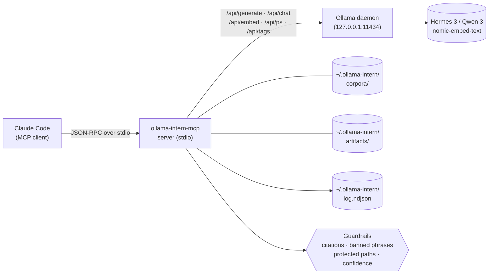

<p align="center">
  <a href="README.ja.md">日本語</a> | <a href="README.zh.md">中文</a> | <a href="README.es.md">Español</a> | <a href="README.md">English</a> | <a href="README.hi.md">हिन्दी</a> | <a href="README.it.md">Italiano</a> | <a href="README.pt-BR.md">Português (BR)</a>
</p>

<p align="center">
  
</p>

<p align="center">
  <a href="https://github.com/mcp-tool-shop-org/ollama-intern-mcp/actions"></a>
  <a href="LICENSE"></a>
  <a href="https://mcp-tool-shop-org.github.io/ollama-intern-mcp/"></a>
  <a href="https://mcp-tool-shop-org.github.io/ollama-intern-mcp/handbook/"></a>
</p>

> **Le stagiaire local pour Claude Code.** <!-- TOOL_COUNT:start -->42<!-- TOOL_COUNT:end --> outils adaptés aux tâches, briefs axés sur les preuves, artefacts durables.

Un serveur MCP qui donne à Claude Code un **stagiaire local** avec des règles, des niveaux, un bureau et un classeur. Claude choisit l'_outil_ ; l'outil choisit le _niveau_ (Instant / Workhorse / Deep / Embed) ; le niveau écrit un fichier que vous pouvez ouvrir la semaine prochaine.

**Pilote également [Hermes Agent](https://github.com/NousResearch/hermes-agent) sur `hermes3:8b`** — validé de bout en bout le 2026-04-19. L'échelle par défaut est `hermes3:8b` ; `qwen3:*` est le rail alternatif. Voir [Utiliser avec Hermes](#use-with-hermes) ci-dessous.

**Configuration matérielle requise :** ~6 Go de VRAM pour `hermes3:8b`, ou ~16 Go de RAM pour l'inférence CPU. Voir [handbook/getting-started](https://mcp-tool-shop-org.github.io/ollama-intern-mcp/handbook/getting-started/#hardware-minimums) pour le détail complet.

**Vous n'utilisez pas Claude ?** Le répertoire [`examples/`](./examples/) contient un client MCP minimal en Node.js et Python que vous pouvez lancer via stdio. Voir aussi [handbook/with-hermes](https://mcp-tool-shop-org.github.io/ollama-intern-mcp/handbook/with-hermes/).

**Local d'abord** — zéro sortie réseau tant que vous n'activez pas. Pas de télémétrie. Rien d'« autonome ». Chaque appel montre son travail. Le routage optionnel [Ollama Cloud](#ollama-cloud-optional) place des modèles de classe 600B derrière les mêmes outils lorsque le matériel local est le goulot d'étranglement — avec basculement automatique vers le local.

---

## Nouveau dans v2.7.0

**Routage Ollama Cloud optionnel — cloud en priorité, basculement local.** Activez avec une clé + un flag et les niveaux génératifs routent vers un modèle cloud de classe 600B ; les embeddings restent locaux ; un circuit breaker bascule vers votre profil local en cas de défaillance du cloud. **Désactivé par défaut — zéro sortie sauf si vous définissez à la fois `OLLAMA_API_KEY` et `OLLAMA_CLOUD_PRIMARY=1`.** Mineur additif — les appelants d'avant v2.7.0 (et toute personne n'activant pas) conservent un comportement identique au bit près. Voir [Ollama Cloud (optionnel)](#ollama-cloud-optional).

- **Cloud en priorité avec un filet de sécurité.** Un `RoutingOllamaClient` essaie d'abord le cloud et bascule vers le profil local en cas de timeout / 5xx / 429 / réseau. Les mauvaises clés (401/403) remontent bruyamment via un sticky breaker au lieu de se dégrader silencieusement pour toujours ; un identifiant de modèle cloud retiré/typé (404) remonte aussi.
- **Jamais de dégradation silencieuse.** Chaque enveloppe gagne `backend` (`cloud`|`local`), `degraded` et `degrade_reason` pour que vous sachiez toujours quand vous avez obtenu le modèle local au lieu du gros. Un événement NDJSON `backend_fallback` rend le taux de basculement cloud→local visible dans `ollama_log_tail`.
- **`ollama_doctor` rapporte l'auth + l'accessibilité cloud** comme un bloc distinct ; `ollama-intern-mcp doctor` affiche une section `Cloud (primary)`.
- Le modèle cloud par défaut est `minimax-m3:cloud` ; surcharge par niveau avec `INTERN_CLOUD_MODEL` / `INTERN_CLOUD_DEEP_MODEL` (par ex. `deepseek-v3.1:671b`).

## Nouveau dans v2.6.0

Surcharge du budget de niveau par appel sur `ollama_extract`. Mineur additif — les appelants d'avant v2.6.0 inchangés. Entrée détaillée dans [CHANGELOG.md](./CHANGELOG.md).

- **`tier_budget_ms_override?: number` champ de schéma sur `ollama_extract`** (facultatif, borné `[1, 600000]` ms). Lorsqu'il est présent, applique la surcharge à chaque niveau visité par le runner afin que le mécanisme interne `runWithTimeoutAndFallback` à `src/guardrails/timeouts.ts:61` respecte le budget fourni par l'opérateur au lieu du défaut du profil. La cascade (workhorse → instant en cas de timeout) se déclenche toujours ; la surcharge régit chaque saut de cascade de manière uniforme.
- **Pourquoi cela existe.** Le wrapper R-018 de research-os (v0.12.1) a enveloppé le `callTool` du MCP avec `Promise.race` et a constaté que le budget du wrapper n'atteignait pas le niveau interne — `DEV_RTX5080_TIMEOUTS.instant = 15_000` continuait à déclencher `TIER_TIMEOUT` à 15000 ms indépendamment d'un budget wrapper de 180000 ms. v2.6.0 fournit le budget faisant autorité côté MCP afin que le drapeau `--planner-timeout-ms` de l'opérateur (research-os) contrôle enfin les timeouts des niveaux internes comme prévu.
- **Comportement par défaut préservé.** Champ omis = les défauts du profil s'appliquent à l'octet près. Les appelants antérieurs à v2.6.0 ne constatent aucun changement.
- **Regex de cause de repli R-010 préservée.** Le message d'erreur `TIER_TIMEOUT` côté serveur correspond toujours à `/elapsed=(\d+)ms/` + `/budget=(\d+)ms/` afin que la visibilité en aval pour le conseiller IA fonctionne tant sur le chemin de surcharge que sur le chemin par défaut.
- Consommé par research-os v0.13.0 (câblage client cumulatif R-019 + R-020 + R-021) dans une version coordonnée multi-dépôts.

### Historique — livrables v2.4.0

Voir [CHANGELOG.md](./CHANGELOG.md) et [docs/release-notes/v2.4.0.md](./docs/release-notes/v2.4.0.md) pour l'entrée complète v2.4.0 (contrôle de `num_ctx` par niveau sur le système de profils).

## Nouveauté de v2.4.0

Contrôle de `num_ctx` (fenêtre de contexte) par niveau sur le système de profils. Mineure additive — les appelants v2.3.0 restent inchangés. Entrées détaillées dans [CHANGELOG.md](./CHANGELOG.md) et [docs/release-notes/v2.4.0.md](./docs/release-notes/v2.4.0.md).

- **Carte `TierConfig.num_ctx` (nouveau)** — `{ instant?, workhorse?, deep?, embed? }` facultatif sur le profil. Lorsqu'elle est définie pour un niveau, le serveur MCP place `options.num_ctx = <value>` sur toute requête generate/chat Ollama routée vers ce niveau (initiale + repli). Lorsqu'elle n'est pas définie, la requête omet complètement `num_ctx` afin qu'Ollama utilise son défaut chargé par le modèle — comportement v2.3.0 préservé à l'identique.
- **Nouveau champ d'enveloppe `num_ctx_used?: number`** — présent uniquement lorsque le serveur MCP a effectivement envoyé `num_ctx`. Absent lorsque la requête a laissé Ollama choisir. N'inférez pas de défaut — le serveur MCP n'interroge pas Ollama pour obtenir la valeur effective.
- **Défauts du profil** : `dev-rtx5080` / `dev-rtx5080-qwen3` sont livrés avec `instant : 4096`, `workhorse : 8192`, `deep`/`embed` NON DÉFINI. Dimensionnés pour maintenir `hermes3:8b` résident dans le budget VRAM de 16 Go du RTX 5080 pour des outils rapides. `m5-max` laisse chaque niveau NON DÉFINI — la mémoire unifiée de 128 Go n'a pas de problème de débordement.
- **Clôt le diagnostic Phase 1 de v0.8.0** — `hermes3:8b` au contexte par défaut de 32K sur le RTX 5080 a débordé vers le CPU et a commencé à faire expirer les appels `ollama_extract` du niveau workhorse. v2.4.0 empêche cela au niveau du profil.

### Contrôle de `num_ctx` par niveau (nouveauté de v2.4.0)

Profil (extrait de `src/profiles.ts`) :

```ts
"dev-rtx5080": {
  tiers: {
    instant: "hermes3:8b",
    workhorse: "hermes3:8b",
    deep: "hermes3:8b",
    embed: "nomic-embed-text",
    num_ctx: {
      instant: 4096,    // fast classify/summarize
      workhorse: 8192,  // schema-bound extract / batch
      // deep: UNSET — long-context briefs keep current behavior
      // embed: UNSET — no context-window pressure on embed
    },
  },
  // ... timeouts, prewarm
}
```

Enveloppe sur un appel de niveau workhorse (par ex. `ollama_extract`) :

```jsonc
{
  "result": { /* extracted data */ },
  "tier_used": "workhorse",
  "model": "hermes3:8b",
  "num_ctx_used": 8192,        // present because the profile set workhorse=8192
  // ... rest of envelope unchanged
}
```

Sur `m5-max` (ou tout profil qui laisse un niveau non défini), `num_ctx_used` est absent de l'enveloppe et la requête envoyée à Ollama n'inclut pas le champ `num_ctx` — Ollama utilise son défaut chargé par le modèle.

Les opérateurs ajustent en sélectionnant / modifiant le profil ; il n'y a pas d'entrée `num_ctx` par appel dans les schémas d'outils. Si un futur appel fait apparaître ce besoin, le modèle suit la surcharge de `model` de v2.3.0.

### Historique — livrables v2.3.0

Voir [CHANGELOG.md](./CHANGELOG.md) et [docs/release-notes/v2.3.0.md](./docs/release-notes/v2.3.0.md) pour l'entrée complète v2.3.0 (surcharge de modèle par appel).

## Nouveauté de v2.3.0

Surcharge de modèle par appel pour les outils atomiques soutenus par LLM. Mineur additif — les appelants v2.2.0 restent inchangés. Entrées détaillées dans [CHANGELOG.md](./CHANGELOG.md) et [docs/release-notes/v2.3.0.md](./docs/release-notes/v2.3.0.md).

- **Entrée optionnelle `model: string` sur 8 outils atomiques** — `ollama_extract`, `ollama_classify`, `ollama_summarize_fast`, `ollama_summarize_deep`, `ollama_research`, `ollama_corpus_answer`, `ollama_chat`, `ollama_code_citation`. La première tentative sur le niveau de l'outil s'exécute avec le modèle spécifié par l'appelant ; en cas de dépassement de délai, la cascade `TIER_FALLBACK` existante résout le modèle propre du niveau le moins cher (PAS la surcharge de l'appelant). Les outils composite/brief/pack n'acceptent délibérément PAS `model` — les atomes obtiennent un contrôle par appel, les composites utilisent les défauts du niveau.
- **Nouveau champ d'enveloppe `model_requested?: string`** — présent uniquement lorsque la surcharge a été fournie. Les appelants conscients de l'étalonnage comparent `model_requested` à `model` pour détecter la substitution de repli : `if (env.model_requested && env.model !== env.model_requested) { /* substitution */ }`. Les entrées vides / contenant uniquement des espaces lèvent une `ZodError` lors de l'analyse du schéma, et non un passage silencieux.
- **Correction de bogue — dérive de `src/version.ts`.** La constante `VERSION` d'exécution est maintenant lue depuis `package.json` au chargement du module ; les versions v2.1.0 et v2.2.0 avaient été livrées en signalant l'identité obsolète `"2.0.0"`. Le nouveau `tests/version.test.ts` verrouille `VERSION === pkg.version`.

### Surcharge de modèle par appel (nouveau dans v2.3.0)

```jsonc
{
  "tool": "ollama_classify",
  "arguments": {
    "text": "patch null pointer in auth",
    "labels": ["feat", "fix", "chore"],
    "frame": "what is the change kind?",
    "model": "hermes3:8b"
  }
}
```

Enveloppe :

```jsonc
{
  "result": { "label": "fix", "confidence": 0.9, "off_topic": false, ... },
  "tier_used": "instant",
  "model": "hermes3:8b",
  "model_requested": "hermes3:8b",       // present because override was supplied
  // ... rest of envelope unchanged
}
```

Si le niveau workhorse/deep avait dépassé le délai et que l'appel avait basculé en cascade vers le niveau instant, `env.model` serait le modèle résolu du niveau instant et `env.fallback_from` serait `"workhorse"` — `env.model_requested` serait toujours `"hermes3:8b"`, et `env.model !== env.model_requested` est le signal de substitution. La surcharge n'est délibérément PAS reportée dans le niveau le moins cher ; le modèle choisi peut ne pas du tout convenir au rôle de ce niveau.

### Historique — livrables v2.2.0

Consultez [CHANGELOG.md](./CHANGELOG.md) et [docs/release-notes/v2.2.0.md](./docs/release-notes/v2.2.0.md) pour l'entrée complète v2.2.0 (topicalité liée au cadre + abstention structurée).

## Nouveau dans v2.2.0

Contrat de rôle de l'ouvrier de preuves local : topicalité liée au cadre et abstention structurée. Mineur additif — les appelants v2.1.0 restent inchangés. Entrées détaillées dans [CHANGELOG.md](./CHANGELOG.md) et [docs/release-notes/v2.2.0.md](./docs/release-notes/v2.2.0.md).

- **Extraction liée au cadre** sur `ollama_extract`, `ollama_classify`, `ollama_summarize_fast`, `ollama_summarize_deep` — entrée optionnelle `frame: string` + sorties structurées `frame_alignment` / `on_topic` / `frame_addressed`. Les sources hors sujet sont signalées au lieu d'être paraphrasées dans le schéma.
- **Abstention structurée** sur `ollama_research` — champs `weak` / `abstained` / `sources_address_question`. Un `citations[]` vide avec un `answer` non vide n'est plus un succès silencieux.
- **Seuil de topicalité** sur `ollama_corpus_answer` — `min_top_score` optionnel. En dessous du seuil, l'outil court-circuite avec `abstained: true` et saute la synthèse. Le `score` par citation est maintenant visible sur chaque citation.
- **Préservation du score de récupération** à travers les preuves brèves — `corpusHitsToEvidence` transporte le `score` (et le bouton `corpus_min_evidence_score` filtre au moment de l'assemblage sur `incident_brief` / `repo_brief` / `change_brief`).
- **Limites de plage de lignes de citation** — `guardrails/citations.ts` rejette les plages hors limites sur `ollama_research`, correspondant à la posture existante sur `ollama_code_citation`.
- **Documents du contrat d'opérateur corrigés** — correction README `chunk_id`/`chunk_index`, « validé côté serveur » réécrit, section Lois des preuves qualifiée, slogan marketing annoté.

### Régression de semence — la vérification

Le contrat de la tranche est vérifié par rapport à l'échec littéral du pack-frais de l'OS de recherche : arxiv 2112.10422 (Cosmological Standard Timers) sous le cadre de la section-01 *« Que signifie la garde des preuves dans les flux de travail de recherche approfondie LLM en local-first vs cloud ? »* — 9 / 9 tests de contrat LLM simulés confirment que la source hors-sujet est désormais contenue (`frame_alignment.on_topic = false` à l'extraction ; `off_topic: true` à la classification ; `frame_addressed: false` à summarize_deep ; `abstained: true` à corpus_answer avec `min_top_score` défini).

### Historique — livrables v2.1.0

Voir [CHANGELOG.md](./CHANGELOG.md) pour l'entrée complète v2.1.0 (passage de fonctionnalités : 13 nouveaux outils + 4 améliorations + levée du gel).

---

## L'architecture en un coup d'œil



Chaque appel d'outil Claude entre dans le serveur MCP via stdio JSON-RPC. Le serveur valide l'appel par rapport au schéma [zod](https://zod.dev) de l'outil, exécute les garde-fous configurés (validation des citations, suppression des expressions interdites, application des chemins protégés, seuils de confiance), puis route vers soit un moteur de rendu déterministe (niveau artefact), soit un appel HTTP Ollama (tout autre niveau). Le démon Ollama ne voit jamais les chemins fournis par l'utilisateur — seulement le niveau du modèle et le prompt préparé. Chaque appel ajoute un événement structuré au journal NDJSON à `~/.ollama-intern/log.ndjson`, où `ollama_log_tail` et votre shell peuvent le lire.

---

## Exemple principal — un appel, un artefact

```jsonc
// Claude → ollama-intern-mcp
{
  "tool": "ollama_incident_pack",
  "arguments": {
    "title": "sprite pipeline 5 AM paging regression",
    "logs": "[2026-04-16 05:07] worker-3 OOM killed\n[2026-04-16 05:07] ollama /api/ps reports evicted=true size=8.1GB\n...",
    "source_paths": ["F:/AI/sprite-foundry/src/worker.ts", "memory/sprite-foundry-visual-mastery.md"]
  }
}
```

Renvoie une enveloppe pointant vers un fichier sur disque :

```jsonc
{
  "result": {
    "pack": "incident",
    "slug": "2026-04-16-sprite-pipeline-5-am-paging-regression",
    "artifact_md":   "~/.ollama-intern/artifacts/incident/2026-04-16-sprite-pipeline-5-am-paging-regression.md",
    "artifact_json": "~/.ollama-intern/artifacts/incident/2026-04-16-sprite-pipeline-5-am-paging-regression.json",
    "weak": false,
    "evidence_count": 6,
    "next_checks": ["residency.evicted across last 24h", "OLLAMA_MAX_LOADED_MODELS vs loaded size"]
  },
  "tier_used": "deep",
  "model": "hermes3:8b",
  "hardware_profile": "dev-rtx5080",
  "tokens_in": 4180, "tokens_out": 612,
  "elapsed_ms": 8410,
  "residency": { "in_vram": true, "evicted": false }
}
```

→ `weak: false` signifie qu'au moins 2 éléments de preuve ont été assemblés ; cela ne signifie PAS que les hypothèses sont vérifiées. Voir [Lois sur les preuves](#lois-sur-les-preuves) ci-dessous.

Ce fichier markdown est la sortie de bureau du stagiaire — titres, bloc de preuves avec identifiants cités, `next_checks` d'investigation, bannière `weak: true` si les preuves sont minces. C'est déterministe : le moteur de rendu est du code, pas un prompt. (Le moteur de rendu est déterministe ; le *contenu* des hypothèses et des surfaces est génératif — considérez-les comme un brouillon, non vérifié.) Ouvrez-le demain, faites-en un diff la semaine prochaine, exportez-le dans un manuel avec `ollama_artifact_export_to_path`.

Chaque concurrent dans cette catégorie commence par « économisez des tokens. » Nous, nous commençons par _voici le fichier que le stagiaire a écrit._

### Deuxième exemple — construire un corpus, puis l'interroger

```jsonc
// 1. Build a persistent, searchable corpus over your project.
{ "tool": "ollama_corpus_index",
  "arguments": { "name": "sprite-foundry",
                 "paths": ["F:/AI/sprite-foundry/src"],
                 "embed_model": "nomic-embed-text" } }
// → { chunks_written: 1204, paths_indexed: 312, failed_paths: [] }

// 2. Ask an evidence-bound question against it.
{ "tool": "ollama_corpus_answer",
  "arguments": { "name": "sprite-foundry",
                 "query": "how does the worker handle OOM eviction?",
                 "top_k": 8 } }
// → { answer: "...", citations: [{chunk_index, path}...], weak: false }
```

Le serveur valide l'identité de la citation et que chaque `chunk_index` est dans la plage des résultats récupérés. Il ne prouve PAS que chaque affirmation générée est sémantiquement soutenue par le contenu du chunk cité — c'est la responsabilité du modèle, et une récupération faible peut toujours produire des réponses en forme de citation. Procédure complète dans [handbook/corpora](https://mcp-tool-shop-org.github.io/ollama-intern-mcp/handbook/corpora/).

---

## Extraction liée au cadre (nouveau dans v2.2.0)

`ollama_extract`, `ollama_classify`, `ollama_summarize_fast`, et `ollama_summarize_deep` acceptent une entrée `frame: string` facultative. Le cadre nomme la question à laquelle la source doit répondre ; le modèle est instruit de s'abstenir plutôt que d'émettre un contenu vrai mais hors sujet lorsque la source n'aborde pas le cadre.

```jsonc
{
  "tool": "ollama_extract",
  "arguments": {
    "text": "<long source document>",
    "schema": { /* your fields */ },
    "frame": "section purpose here — e.g. 'OOM eviction behavior in the sprite worker'"
  }
}
// → result includes frame_alignment: { on_topic: boolean, reason: string, unaddressed_aspects: string[] }
```

Si `frame` est omis, le comportement est inchangé par rapport à v2.1.0. Lorsqu'il est fourni, `frame_alignment.on_topic = false` signale que les champs extraits peuvent être vrais-de-la-source mais non pertinents par rapport au cadre — considérez cela comme la même forme qu'un brief `weak: true` : utile, mais à vérifier ponctuellement avant de les promouvoir en preuves en aval.

---

## Contrat d'abstention (nouveau dans v2.2.0)

`ollama_research` renvoie des champs d'abstention structurés : `weak: boolean`, `abstained: boolean`, `sources_address_question: boolean | null`. Un `citations[]` vide avec un `answer` non vide n'est plus silencieux — `abstained: true` indique que le modèle a refusé de synthétiser parce que les chemins fournis par l'appelant n'abordaient pas la question. Traitez l'abstention comme un succès, non comme un échec : c'est l'outil qui refuse de blanchir une récupération faible en une sortie faisant autorité.

`ollama_corpus_answer` accepte un seuil de topicalité optionnel `min_top_score: number` (0.0–1.0). Lorsque le score de récupération maximal pour une requête tombe en dessous de `min_top_score`, l'outil court-circuite avec `abstained: true` et saute la synthèse — empêchant le mode de défaillance « 5 chunks hors sujet à 0.21 de score produisent quand même une réponse complète » que la règle `weak: true` de v2.1.0 ne détectait pas (`weak: true` ne se déclenchait que sur `hits.length < 2`). Associez cela au champ `score` par citation nouvellement exposé sur chaque citation pour auditer la qualité de récupération directement depuis l'enveloppe.

---

## Ce qu'il y a ici — quatre niveaux, <!-- TOOL_COUNT:start -->42<!-- TOOL_COUNT:end --> outils

**Orienté tâche** signifie que chaque outil nomme une tâche que vous confieriez à un stagiaire — classer ceci, extraire cela, trier ces logs, rédiger cette note de version, préparer cet incident. L'entrée de l'outil est le cahier des charges ; la sortie est le livrable. Pas de primitive générique `run_model` / `chat_with_llm` au sommet.

| Niveau | Nombre | Ce qui vit ici |
|---|---|---|
| **Atoms** | 28 | Primitives orientées tâche. **15 d'origine :** `classify`, `extract`, `triage_logs`, `summarize_fast` / `deep`, `draft`, `research`, `corpus_search` / `answer` / `index` / `refresh` / `list`, `embed_search`, `embed`, `chat`. **+13 ajoutés en v2.1.0 :** `doctor`, `log_tail`, `batch_proof_check` (ops) ; `code_map`, `code_citation`, `multi_file_refactor_propose`, `refactor_plan` (refactor) ; `artifact_prune`, `hypothesis_drill` (artefact/brève) ; `corpus_health`, `corpus_amend`, `corpus_amend_history`, `corpus_rerank` (corpus). Les atomes compatibles batch (`classify`, `extract`, `triage_logs`) acceptent `items: [{id, text}]`. |
| **Briefs** | 3 | Brèves d'opérateur structurées étayées par des preuves. `incident_brief`, `repo_brief`, `change_brief`. Chaque affirmation cite un identifiant de preuve ; les inconnues sont supprimées côté serveur. Une preuve faible expose `weak: true` plutôt qu'un récit factice. |
| **Packs** | 3 | Tâches composées à pipeline fixe qui écrivent du markdown + JSON durables dans `~/.ollama-intern/artifacts/`. `incident_pack`, `repo_pack`, `change_pack`. Moteurs de rendu déterministes — aucun appel de modèle sur la forme de l'artefact. |
| **Artifacts** | 7 | Surface de continuité au-dessus des sorties de pack. `artifact_list` / `read` / `diff` / `export_to_path`, plus trois extraits déterministes : `incident_note`, `onboarding_section`, `release_note`. |

Total : **28 atomes + 3 brèves + 3 packs + 7 outils d'artefact = <!-- TOOL_COUNT:start -->42<!-- TOOL_COUNT:end -->**.

Lignes de gel :
- Atomes : gel **levé en v2.1.0** (28 aujourd'hui ; +13 ajoutés lors du passage de fonctionnalités v2.1.0). Les nouveaux atomes nécessitent toujours un gap justifié par audit, des tests, une page de manuel et une entrée de CHANGELOG — pas d'ajout à la légère.
- Packs gelés à 3. Pas de nouveaux types de pack.
- Niveau artefact gelé à 7.

La référence complète des outils vit dans le [manuel](https://mcp-tool-shop-org.github.io/ollama-intern-mcp/handbook/tools/).

---

## Installation

Nécessite [Ollama](https://ollama.com) tournant en local et les modèles de niveau tirés (voir [Tirages de modèles](#model-pulls) ci-dessous).

### Claude Code (recommandé)

La plupart des utilisateurs installent ceci en l'ajoutant à leur config de serveur MCP de Claude Code — aucune installation globale requise. Claude Code exécute le serveur à la demande via `npx` :

```json
{
  "mcpServers": {
    "ollama-intern": {
      "command": "npx",
      "args": ["-y", "ollama-intern-mcp"],
      "env": {
        "OLLAMA_HOST": "http://127.0.0.1:11434",
        "INTERN_PROFILE": "dev-rtx5080"
      }
    }
  }
}
```

### Claude Desktop

Même bloc, écrit dans `~/Library/Application Support/Claude/claude_desktop_config.json` (macOS) ou `%APPDATA%\Claude\claude_desktop_config.json` (Windows).

### Installation globale (avancé)

Nécessaire uniquement si vous souhaitez que le binaire soit dans votre `PATH` pour une utilisation ponctuelle en dehors de Claude Code :

```bash
npm install -g ollama-intern-mcp
```

### Utilisation avec Hermes

Ce MCP a été validé de bout en bout avec [Hermes Agent](https://github.com/NousResearch/hermes-agent) contre `hermes3:8b` sur Ollama (2026-04-19). Hermes est un agent externe qui *appelle* la surface de primitives figée de ce MCP — il fait la planification, nous faisons le travail.

Configuration de référence ([hermes.config.example.yaml](hermes.config.example.yaml) dans ce dépôt) :

```yaml
model:
  provider: custom
  base_url: http://localhost:11434/v1
  default: hermes3:8b
  context_length: 65536    # Hermes requires 64K floor under model.*

providers:
  local-ollama:
    name: local-ollama
    base_url: http://localhost:11434/v1
    api_mode: openai_chat
    api_key: ollama
    model: hermes3:8b

mcp_servers:
  ollama-intern:
    command: npx
    args: ["-y", "ollama-intern-mcp"]
    env:
      OLLAMA_HOST: http://localhost:11434
      INTERN_PROFILE: dev-rtx5080
      # hermes3:8b is the default ladder in v2.0.0, so tier overrides are
      # only needed if you're pinning a different local model.
```

**La forme du prompt est importante.** Les prompts impératifs d'invocation d'outils (« Appelle X avec les args … ») sont le test d'intégration — ils fournissent à un modèle local 8B suffisamment de structure pour émettre des `tool_calls` propres. Les prompts multi-tâches sous forme de liste (« fais A, puis B, puis C ») sont des benchmarks de capacité pour des modèles plus grands ; n'interprétez pas un échec en forme de liste sur 8B comme « le câblage est cassé ». Consultez [handbook/with-hermes](https://mcp-tool-shop-org.github.io/ollama-intern-mcp/handbook/with-hermes/) pour la procédure d'intégration complète + les caveats de transport connus (Ollama `/v1` streaming + shim openai-SDK non-streaming).

### Téléchargement des modèles

**Profil de développement par défaut (RTX 5080 16GB et similaires) :**

```bash
ollama pull hermes3:8b
ollama pull nomic-embed-text
export OLLAMA_MAX_LOADED_MODELS=2
export OLLAMA_KEEP_ALIVE=-1
```

**Voie alternative Qwen 3 (même matériel, pour l'outillage Qwen) :**

```bash
ollama pull qwen3:8b
ollama pull qwen3:14b
ollama pull nomic-embed-text
export INTERN_PROFILE=dev-rtx5080-qwen3
```

**Profil M5 Max (128GB unifiée) :**

```bash
ollama pull qwen3:14b
ollama pull qwen3:32b
ollama pull nomic-embed-text
export INTERN_PROFILE=m5-max
```

Les variables d'environnement par niveau (`INTERN_TIER_INSTANT`, `INTERN_TIER_WORKHORSE`, `INTERN_TIER_DEEP`, `INTERN_EMBED_MODEL`) remplacent toujours les choix de profil pour les usages ponctuels.

---

## Enveloppe uniforme

Chaque outil renvoie la même forme :

```ts
{
  result: <tool-specific>,
  tier_used: "instant" | "workhorse" | "deep" | "embed",
  model: string,
  hardware_profile: string,     // "dev-rtx5080" | "dev-rtx5080-qwen3" | "m5-max"
  tokens_in: number,
  tokens_out: number,
  elapsed_ms: number,
  residency: {
    in_vram: boolean,
    size_bytes: number,
    size_vram_bytes: number,
    evicted: boolean
  } | null
}
```

`residency` provient de `/api/ps` d'Ollama. Quand `evicted: true` ou `size_vram < size`, le modèle est paginé sur disque et l'inférence chute de 5 à 10× — signalez-le à l'utilisateur pour qu'il sache qu'il faut redémarrer Ollama ou réduire le nombre de modèles chargés.

En mode [Ollama Cloud](#ollama-cloud-optional) l'enveloppe porte aussi `backend` (`"cloud"` | `"local"`) et, lors d'un repli cloud→local, `degraded: true` + `degrade_reason`. Ces champs sont **absents** dans le chemin local uniquement par défaut, donc les consommateurs existants ne sont pas affectés. `residency` vaut `null` pour les appels servis par le cloud (le cloud sans état n'a pas de résidence en VRAM locale).

Chaque appel est journalisé sous forme d'une ligne NDJSON dans `~/.ollama-intern/log.ndjson`. Filtrez par `hardware_profile` pour exclure les chiffres de développement des benchmarks publiables.

---

## Profils matériels

| Profil | Instant | Cheval de bataille | Deep | Embed |
|---|---|---|---|---|
| **`dev-rtx5080`** (par défaut) | hermes3 8B | hermes3 8B | hermes3 8B | nomic-embed-text |
| `dev-rtx5080-qwen3` | qwen3 8B | qwen3 8B | qwen3 14B | nomic-embed-text |
| `m5-max` | qwen3 14B | qwen3 14B | qwen3 32B | nomic-embed-text |

Le profil **Default dev** collapse les trois niveaux de travail sur `hermes3:8b` — le chemin d'intégration Hermes Agent validé. Le même modèle de bout en bout signifie qu'il n'y a qu'une chose à télécharger, un seul coût de résidence, un seul ensemble de comportements à comprendre. Les utilisateurs qui préfèrent Qwen 3 (avec sa plomberie `THINK_BY_SHAPE`) optent pour `dev-rtx5080-qwen3`. `m5-max` est l'échelle Qwen 3 dimensionnée pour la mémoire unifiée.

---

## Ollama Cloud (optionnel)

Les modèles locaux 8B constituent le goulot d'étranglement matériel que la plupart des gens rencontrent. [Ollama Cloud](https://ollama.com/cloud) sert des modèles de classe 600B derrière la **même** surface `/api/*`, vous pouvez donc router les outils lourds vers un modèle bien plus puissant et libérer la VRAM locale — tout en conservant le local comme repli toujours disponible.

**C'est opt-in et désactivé par défaut.** Le package reste local-first avec **zéro sortie réseau** sauf si vous définissez *ces deux* paramètres. Toute personne qui n'active pas cette option n'est pas affectée.

```json
{
  "mcpServers": {
    "ollama-intern": {
      "command": "npx",
      "args": ["-y", "ollama-intern-mcp"],
      "env": {
        "OLLAMA_CLOUD_PRIMARY": "1",
        "OLLAMA_API_KEY": "sk-...your-key...",
        "INTERN_PROFILE": "dev-rtx5080"
      }
    }
  }
}
```

> **La clé est une variable d'environnement d'exécution, pas un secret CI.** Un secret GitHub Actions n'est visible qu'à l'intérieur des exécutions CI — il n'atteint jamais le serveur en cours d'exécution. Créez une clé sur [ollama.com/settings/keys](https://ollama.com/settings/keys) et placez-la dans le bloc `env` de votre client MCP (ou dans votre environnement shell).

**Comment fonctionne le routage.** Lorsque le cloud est activé, les niveaux génératifs (instant / workhorse / deep) vont vers le modèle cloud ; **les embeddings restent toujours locaux** (Ollama Cloud ne sert aucun modèle d'embedding, donc les outils corpus/embed ne sont pas affectés). Un coupe-circuit essaie le cloud en premier et bascule vers votre profil local en cas de timeout / 5xx / 429 / erreurs réseau. Une mauvaise clé (401/403) déclenche un coupe-circuit *collant* qui se manifeste bruyamment plutôt que de se dégrader silencieusement. Le profil local (`INTERN_PROFILE`) constitue l'échelle de secours, donc gardez ses modèles téléchargés.

**Vous n'êtes jamais silencieusement rétrogradé.** Chaque enveloppe indique quel backend a servi l'appel :

```ts
{ ...envelope, backend: "cloud" | "local", degraded?: true, degrade_reason?: "cloud_timeout" | "cloud_5xx" | "cloud_rate_limited" | "cloud_unreachable" | "cloud_auth_failed" | "circuit_open" }
```

Une ligne `backend_fallback` arrive dans `~/.ollama-intern/log.ndjson` à chaque basculement cloud→local (`ollama_log_tail --filter_kind backend_fallback`), et `ollama-intern-mcp doctor` affiche un bloc **Cloud (primaire)** avec l'état d'accessibilité et d'authentification.

**Latence vs qualité.** Les gros modèles cloud s'exécutent beaucoup plus lentement par token qu'un 8B local (secondes, pas millisecondes) — une amélioration de qualité, pas de vitesse. Les niveaux cloud utilisent une échelle de timeout généreuse (instant 30s / workhorse 120s / deep 300s par défaut).

### Variables d'environnement cloud

| Var | Défaut | Objet |
|---|---|---|
| `OLLAMA_CLOUD_PRIMARY` | _(non défini)_ | **L'interrupteur d'opt-in.** `1`/`true`/`yes`/`on` active cloud-primary. Non défini = local uniquement, zéro sortie. |
| `OLLAMA_API_KEY` | _(non défini)_ | Clé Bearer pour Ollama Cloud. **Requis** lorsque le cloud est activé (échec rapide au démarrage si manquant). |
| `OLLAMA_CLOUD_HOST` | `https://ollama.com` | Hôte de base cloud. |
| `INTERN_CLOUD_MODEL` | `minimax-m3:cloud` | Modèle cloud pour instant + workhorse + deep. |
| `INTERN_CLOUD_DEEP_MODEL` | _(= `INTERN_CLOUD_MODEL`)_ | Substitution optionnelle uniquement pour le niveau deep, par ex. `deepseek-v3.1:671b`. |
| `INTERN_CLOUD_TIMEOUT_{INSTANT,WORKHORSE,DEEP}_MS` | `30000`/`120000`/`300000` | Timeouts par tentative cloud et par niveau. |
| `INTERN_CLOUD_NUM_CTX` | `32768` | Plafond de fenêtre de contexte pour les appels cloud (le cloud facture au temps GPU ; le plafond contrôle le coût). |

> **Changements de disponibilité des modèles.** Ollama retire périodiquement des modèles cloud. `minimax-m3:cloud`, `deepseek-v3.1:671b`, `gpt-oss:120b` et `qwen3-coder:480b` sont les choix actuels ; consultez [ollama.com/search?c=cloud](https://ollama.com/search?c=cloud) avant d'épingler un identifiant.

**Note de confidentialité.** Le routage vers Ollama Cloud envoie les prompts à un tiers. La [politique de confidentialité](https://ollama.com/privacy) d'Ollama indique que les prompts cloud sont traités de manière transitoire, non conservés au-delà de la requête, et non utilisés pour l'entraînement — mais il s'agit toujours d'une sortie, c'est pourquoi c'est opt-in et divulgué. Le mode local uniquement (par défaut) n'envoie rien hors de la machine.

---

## Lois sur la preuve

Celles-ci sont appliquées dans le serveur, pas dans le prompt :

- **Citations obligatoires.** Chaque affirmation brève cite un identifiant de preuve.
- **Éléments inconnus supprimés côté serveur.** Les modèles qui citent des identifiants absents du paquet de preuves voient ces identifiants supprimés avec un avertissement avant le retour du résultat.
- **Validé par identifiant, pas par contenu.** Le serveur vérifie que chaque `evidence_ref` cité pointe vers un identifiant de preuve réel dans l'ensemble assemblé. Il ne vérifie PAS que le texte de l'affirmation peut être dérivé de la preuve citée — c'est le travail du modèle, et certains briefs faibles contiennent des affirmations non étayées avec des références valides. Utilisez `weak: true` + coverage_notes + le champ `excerpt` inclus pour une vérification ponctuelle.
- **Faible reste faible.** Des preuves minces signalent `weak: true` avec des notes de couverture. Jamais lissées en un faux récit.
- **Investigatif, pas prescriptif.** Uniquement `next_checks` / `read_next` / `likely_breakpoints`. Les invites interdisent « appliquer ce correctif ».
- **Rendu déterministe.** La forme markdown de l'artefact est du code, pas une invite. `draft` reste réservé à la prose où la formulation du modèle compte.
- **Différences uniquement dans le même paquet.** Les `artifact_diff` inter-paquets sont refusés de manière explicite ; les charges utiles restent distinctes.

---

## Artefacts et continuité

Les paquets s'écrivent dans `~/.ollama-intern/artifacts/{incident,repo,change}/<slug>.(md|json)`. Le niveau d'artefact vous offre une surface de continuité sans transformer cet outil en gestionnaire de fichiers :

- `artifact_list` — index métadonnées uniquement, filtrable par paquet, date, glob de slug
- `artifact_read` — lecture typée par `{pack, slug}` ou `{json_path}`
- `artifact_diff` — comparaison structurée dans le même paquet ; flip faible mis en évidence
- `artifact_export_to_path` — écrit un artefact existant (avec en-tête de provenance) vers un `allowed_roots` déclaré par l'appelant. Refuse les fichiers existants sauf si `overwrite: true`.
- `artifact_incident_note_snippet` — fragment de note d'opérateur
- `artifact_onboarding_section_snippet` — fragment de manuel
- `artifact_release_note_snippet` — fragment de note de version DRAFT

Aucun appel de modèle dans ce niveau. Tout est rendu à partir du contenu stocké.

---

## Modèle de menace et télémétrie

**Données touchées :** chemins de fichiers fournis explicitement par l'appelant (`ollama_research`, outils de corpus), texte en ligne, et artefacts dont l'appelant demande l'écriture sous `~/.ollama-intern/artifacts/` ou un `allowed_roots` déclaré par l'appelant.

**Données NON touchées :** tout ce qui se trouve en dehors de `source_paths` / `allowed_roots`. `..` est rejeté avant normalisation. `artifact_export_to_path` refuse les fichiers existants sauf si `overwrite: true`. Les brouillons ciblant des chemins protégés (`memory/`, `.claude/`, `docs/canon/`, etc.) nécessitent un `confirm_write: true` explicite, appliqué côté serveur.

**Sortie réseau :** **désactivée par défaut.** Dès l'installation, le seul trafic sortant va vers le point de terminaison HTTP Ollama local — aucun appel cloud, aucun ping de mise à jour, aucun rapport de plantage. **Exception opt-in :** si vous activez [Ollama Cloud](#ollama-cloud-optionnel) (`OLLAMA_CLOUD_PRIMARY=1` + `OLLAMA_API_KEY`), les invites des niveaux génératifs sont envoyées à `ollama.com` via HTTPS avec une clé Bearer. Cela est explicite, divulgué, et désactivé sauf si vous définissez les deux variables ; les embeddings ne quittent jamais la machine. Voir [SECURITY.md](SECURITY.md) §11.

**Télémétrie :** **aucune.** Chaque appel est enregistré sous forme d'une ligne NDJSON dans `~/.ollama-intern/log.ndjson` sur votre machine. Le serveur lui-même ne téléphone à rien.

**Erreurs :** forme structurée `{ code, message, hint, retryable }`. Les traces de pile ne sont jamais exposées via les résultats d'outils.

Politique complète : [SECURITY.md](SECURITY.md).

---

## Normes

Construit selon le standard [Shipcheck](https://github.com/mcp-tool-shop-org/shipcheck). Les portes strictes A–D sont validées ; voir [SHIP_GATE.md](SHIP_GATE.md) et [SCORECARD.md](SCORECARD.md).

- **A. Sécurité** — SECURITY.md, modèle de menace, aucune télémétrie, sécurité des chemins, `confirm_write` sur les chemins protégés
- **B. Erreurs** — format structuré pour tous les résultats d'outils ; pas de piles brutes
- **C. Documentation** — README à jour, CHANGELOG, LICENSE ; les schémas d'outils s'auto-documentent
- **D. Hygiène** — `npm run verify` (suite vitest complète), CI avec analyse des dépendances, Dependabot, lockfile, `engines.node`

---

## Feuille de route (renforcement, pas d'extension du périmètre)

- **Phase 1 — Architecture de délégation** ✓ livrée : surface des atomes, enveloppe uniforme, routage hiérarchisé, garde-fous
- **Phase 2 — Architecture de vérité** ✓ livrée : découpage en blocs schéma v2, BM25 + RRF, corpus vivants, synthèses étayées par des preuves, pack d'évaluation de la récupération
- **Phase 3 — Architecture des packs et artefacts** ✓ livrée : packs à pipeline fixe avec artefacts durables + niveau de continuité
- **Phase 4 — Architecture d'adoption (du produit)** ✓ v2.0.1 : vérification de santé en trois étapes, corpus renforcé (TOCTOU, limite de fichier de 50 Mo, rejet des liens symboliques, écritures atomiques, capture des erreurs par fichier), parcours des chemins d'outils, observabilité (événements d'attente de sémaphore, contexte d'erreur de délai d'expiration, journalisation du remplacement d'env de profil, signal de préchauffage du démarrage à froid), sécurité des tests (instantané d'env de chargement de module sur 10 fichiers, `tools/call` E2E). Manuel de dépannage et configuration matérielle minimale ajoutés pour les opérateurs.
- **Phase 5 — Benchmarks M5 Max** — chiffres publiables une fois le matériel disponible (~2026-04-24)

Phase par couche de renforcement. Les niveaux de pack et d'artefact restent figés à 3 et 7. Le gel des atomes a été levé en v2.1.0 — les nouveaux atomes nécessitent un écart justifié par audit, des tests, une page de manuel et une entrée au CHANGELOG.

---

## Licence

MIT — voir [LICENSE](LICENSE).

---

<p align="center">Built by <a href="https://mcp-tool-shop.github.io/">MCP Tool Shop</a></p>
