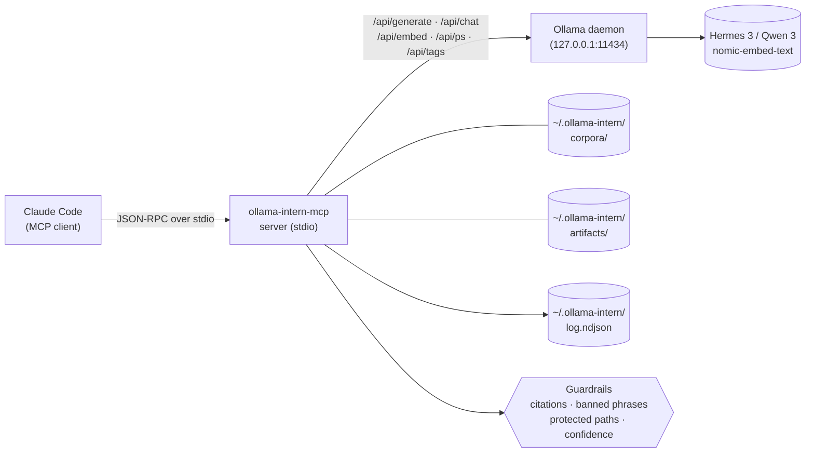

<p align="center">
  <a href="README.ja.md">日本語</a> | <a href="README.zh.md">中文</a> | <a href="README.es.md">Español</a> | <a href="README.md">English</a> | <a href="README.hi.md">हिन्दी</a> | <a href="README.it.md">Italiano</a> | <a href="README.pt-BR.md">Português (BR)</a>
</p>

<p align="center">
  
</p>

<p align="center">
  <a href="https://github.com/mcp-tool-shop-org/ollama-intern-mcp/actions"></a>
  <a href="LICENSE"></a>
  <a href="https://mcp-tool-shop-org.github.io/ollama-intern-mcp/"></a>
  <a href="https://mcp-tool-shop-org.github.io/ollama-intern-mcp/handbook/"></a>
</p>

> **L'assistant local pour Claude Code.** <!-- TOOL_COUNT:start -->42<!-- TOOL_COUNT:end --> outils, briefs basés sur des preuves, artefacts durables.

Un serveur MCP qui fournit à Claude Code un **assistant local**, avec des règles, des niveaux de complexité, un bureau et un classeur. Claude choisit l' _outil_ ; l'outil choisit le _niveau_ (Instant / Travail intensif / Approfondi / Intégré) ; le niveau génère un fichier que vous pourrez ouvrir la semaine prochaine.

**Fonctionne également avec [Hermes Agent](https://github.com/NousResearch/hermes-agent) sur `hermes3:8b`** — validation de bout en bout le 19 avril 2026. Le niveau par défaut est `hermes3:8b` ; `qwen3:*` est l'alternative. Voir [Utilisation avec Hermes](#use-with-hermes) ci-dessous.

**Exigences matérielles :** ~6 Go de VRAM pour `hermes3:8b`, ou ~16 Go de RAM pour l'inférence CPU. Consultez [handbook/getting-started](https://mcp-tool-shop-org.github.io/ollama-intern-mcp/handbook/getting-started/#hardware-minimums) pour une description détaillée.

**N'utilisez pas Claude ?** Le répertoire [`examples/`](./examples/) contient un client MCP minimal en Node.js et Python que vous pouvez lancer via stdio. Consultez également [handbook/with-hermes](https://mcp-tool-shop-org.github.io/ollama-intern-mcp/handbook/with-hermes/).

Pas de cloud. Pas de télémétrie. Rien d' "autonome". Chaque appel montre son processus.

---

## Nouveautés dans la version 2.4.0

Contrôle individuel de `num_ctx` (fenêtre de contexte) pour chaque niveau dans le système de profil. Amélioration mineure, les appels inchangés dans la version 2.3.0. Détails dans [CHANGELOG.md](./CHANGELOG.md) et [docs/release-notes/v2.4.0.md](./docs/release-notes/v2.4.0.md).

- **Carte `TierConfig.num_ctx` (nouveau)** : optionnel `{ instant?, workhorse?, deep?, embed? }` dans le profil. Lorsqu'elle est définie pour un niveau, le serveur MCP ajoute `options.num_ctx = <valeur>` à chaque requête de génération/chat Ollama dirigée vers ce niveau (initiale + de secours). Lorsqu'elle n'est pas définie, la requête omet complètement `num_ctx`, ce qui permet à Ollama d'utiliser sa valeur par défaut chargée dans le modèle, comme dans la version 2.3.0.
- **Nouveau champ de l'enveloppe `num_ctx_used?: number`** : présent uniquement lorsque le serveur MCP a réellement envoyé `num_ctx`. Absent lorsque la requête a permis à Ollama de choisir. Ne pas déduire de valeur par défaut : le serveur MCP ne demande pas à Ollama la valeur effective.
- **Valeurs par défaut du profil** : `dev-rtx5080` / `dev-rtx5080-qwen3` sont livrés avec `instant: 4096`, `workhorse: 8192`, `deep`/`embed` non définis. Dimensionnés pour maintenir `hermes3:8b` dans la mémoire VRAM de 16 Go de la RTX 5080, ce qui permet d'utiliser rapidement les outils. `m5-max` laisse tous les niveaux non définis : les 128 Go de mémoire unifiée ne présentent aucun problème de débordement.
- **Résout le diagnostic de la phase 1 de la version 0.8.0** : `hermes3:8b` avec le contexte par défaut de 32 Ko sur la RTX 5080 provoquait un débordement vers le CPU et des délais d'attente pour les appels `ollama_extract` du niveau "workhorse". La version 2.4.0 empêche cela au niveau du profil.

### Contrôle individuel de `num_ctx` (nouveau dans la version 2.4.0)

Profil (extrait de `src/profiles.ts`) :

```ts
"dev-rtx5080": {
  tiers: {
    instant: "hermes3:8b",
    workhorse: "hermes3:8b",
    deep: "hermes3:8b",
    embed: "nomic-embed-text",
    num_ctx: {
      instant: 4096,    // fast classify/summarize
      workhorse: 8192,  // schema-bound extract / batch
      // deep: UNSET — long-context briefs keep current behavior
      // embed: UNSET — no context-window pressure on embed
    },
  },
  // ... timeouts, prewarm
}
```

Enveloppe pour un appel au niveau "workhorse" (par exemple, `ollama_extract`) :

```jsonc
{
  "result": { /* extracted data */ },
  "tier_used": "workhorse",
  "model": "hermes3:8b",
  "num_ctx_used": 8192,        // present because the profile set workhorse=8192
  // ... rest of envelope unchanged
}
```

Sur `m5-max` (ou tout profil qui laisse un niveau non défini), `num_ctx_used` est absent de l'enveloppe et la requête envoyée à Ollama ne contient pas le champ `num_ctx` : Ollama utilise sa valeur par défaut chargée dans le modèle.

Les opérateurs configurent les paramètres en sélectionnant ou en modifiant le profil ; il n'y a pas de saisie `num_ctx` par appel dans les schémas des outils. Si un appel futur révèle la nécessité, le modèle suit le `model` de la version 2.3.0.

### Historique — livrables de la version 2.3.0

Consultez [CHANGELOG.md](./CHANGELOG.md) et [docs/release-notes/v2.3.0.md](./docs/release-notes/v2.3.0.md) pour l'intégralité de la version 2.3.0 (surcharge de modèle par appel).

## Nouveautés dans la version 2.3.0

Modification du modèle par appel pour les outils atomiques basés sur les LLM. Amélioration mineure additive — les appelants de la version v2.2.0 restent inchangés. Détails dans [CHANGELOG.md](./CHANGELOG.md) et [docs/release-notes/v2.3.0.md](./docs/release-notes/v2.3.0.md).

- **Entrée optionnelle `model: string` pour 8 outils atomiques** — `ollama_extract`, `ollama_classify`, `ollama_summarize_fast`, `ollama_summarize_deep`, `ollama_research`, `ollama_corpus_answer`, `ollama_chat`, `ollama_code_citation`. La première tentative sur le niveau de l'outil utilise le modèle spécifié par l'appelant ; en cas de dépassement de délai, la cascade `TIER_FALLBACK` existante utilise le modèle du niveau le moins coûteux (et non le modèle spécifié par l'appelant). Les outils composites/résumés/groupés n'acceptent *délibérément* pas l'argument `model` ; les atomes permettent un contrôle par appel, tandis que les composites utilisent les paramètres par défaut du niveau.
- **Nouveau champ de l'enveloppe `model_requested?: string`** — présent uniquement lorsque le modèle a été spécifié. Les appelants sensibles à la calibration comparent `model_requested` à `model` pour détecter le remplacement par défaut : `if (env.model_requested && env.model !== env.model_requested) { /* remplacement */ }`. Les entrées vides ou contenant uniquement des espaces déclenchent une erreur `ZodError` lors de l'analyse du schéma, et non un comportement silencieux.
- **Correction de bug — dérive dans `src/version.ts`.** La constante `VERSION` est maintenant lue à partir de `package.json` lors du chargement du module ; les versions v2.1.0 et v2.2.0 contenaient une chaîne d'identification obsolète `"2.0.0"`. Un nouveau fichier `tests/version.test.ts` vérifie que `VERSION === pkg.version`.

### Modification du modèle par appel (nouvelle fonctionnalité dans la version v2.3.0)

```jsonc
{
  "tool": "ollama_classify",
  "arguments": {
    "text": "patch null pointer in auth",
    "labels": ["feat", "fix", "chore"],
    "frame": "what is the change kind?",
    "model": "hermes3:8b"
  }
}
```

Enveloppe :

```jsonc
{
  "result": { "label": "fix", "confidence": 0.9, "off_topic": false, ... },
  "tier_used": "instant",
  "model": "hermes3:8b",
  "model_requested": "hermes3:8b",       // present because override was supplied
  // ... rest of envelope unchanged
}
```

Si le niveau "workhorse/deep" a expiré et que l'appel a été redirigé vers le niveau "instant", `env.model` serait le modèle utilisé par le niveau "instant" et `env.fallback_from` serait `"workhorse"` — `env.model_requested` serait toujours `"hermes3:8b"`, et `env.model !== env.model_requested` indique le remplacement. Le modèle spécifié par l'appelant n'est *délibérément* pas transmis au niveau le moins coûteux ; le modèle choisi peut ne pas correspondre à la fonction de ce niveau.

### Historique — livrables de la version 2.2.0

Consultez [CHANGELOG.md](./CHANGELOG.md) et [docs/release-notes/v2.2.0.md](./docs/release-notes/v2.2.0.md) pour l'intégralité de l'entrée de la version v2.2.0 (pertinence contextuelle et abstention structurée).

## Nouveau dans la version 2.2.0

Contrat du rôle d'agent de collecte de preuves local : pertinence thématique et abstention structurée. Amélioration mineure — les appels de la version 2.1.0 restent inchangés. Détails dans [CHANGELOG.md](./CHANGELOG.md) et [docs/release-notes/v2.2.0.md](./docs/release-notes/v2.2.0.md).

- **Extraction contextuelle** sur `ollama_extract`, `ollama_classify`, `ollama_summarize_fast`, `ollama_summarize_deep` — entrée optionnelle `frame: string` + sorties structurées `frame_alignment` / `on_topic` / `frame_addressed`. Les sources hors sujet sont signalées au lieu d'être paraphrasées dans le schéma.
- **Abstention structurée** sur `ollama_research` — champs `weak` / `abstained` / `sources_address_question`. Une liste de citations vide avec une réponse non vide n'indique plus un succès silencieux.
- **Seuil de pertinence thématique** sur `ollama_corpus_answer` — `min_top_score` optionnel. En dessous du seuil, l'outil s'arrête avec `abstained: true` et saute la synthèse. Le score de chaque citation est maintenant visible.
- **Préservation du score de récupération** grâce à des preuves concises — `corpusHitsToEvidence` conserve le `score` (et le paramètre `corpus_min_evidence_score` filtre au moment de l'assemblage sur `incident_brief` / `repo_brief` / `change_brief`).
- **Limites de plage de citations** — `guardrails/citations.ts` rejette les plages hors limites sur `ollama_research`, ce qui correspond à la configuration existante sur `ollama_code_citation`.
- **Documentation du contrat de l'opérateur corrigée** — correction de `chunk_id`/`chunk_index` dans le fichier README, reformulation de la section "validated server-side", qualification de la section "Evidence Laws", annotation du slogan marketing.

### Régression de la graine — la vérification

Le contrat de la tranche est vérifié par rapport à l'échec du paquet "fresh-pack" de recherche-os : arxiv 2112.10422 (Cosmological Standard Timers) dans la section-01 intitulée *"Que signifie la garde des preuves dans les flux de recherche approfondie LLM locaux par rapport au cloud ?"* — 9 tests de contrat LLM simulés confirment que la source hors sujet est maintenant contenue (`frame_alignment.on_topic = false` pour l'extraction ; `off_topic: true` pour la classification ; `frame_addressed: false` pour la synthèse approfondie ; `abstained: true` pour `corpus_answer` avec `min_top_score` défini).

### Historique — livrables de la version 2.1.0

Consultez [CHANGELOG.md](./CHANGELOG.md) pour l'intégralité de l'entrée de la version 2.1.0 (ensemble de fonctionnalités : 13 nouveaux outils + 4 améliorations + mise à jour).

---

## Architecture en bref



Chaque appel d'outil Claude passe par le serveur MCP via JSON-RPC sur stdio. Le serveur valide l'appel par rapport au schéma [zod](https://zod.dev) de l'outil, exécute les règles de sécurité configurées (validation des citations, suppression des phrases interdites, application des chemins protégés, seuils de confiance), puis le dirige vers soit un moteur de rendu déterministe (niveau des artefacts) soit un appel HTTP à Ollama (tous les autres niveaux). Le démon Ollama ne voit jamais les chemins fournis par l'utilisateur, mais uniquement le niveau du modèle et l'invite préparée. Chaque appel ajoute un événement structuré au journal NDJSON à l'emplacement `~/.ollama-intern/log.ndjson`, que `ollama_log_tail` et votre shell peuvent lire.

---

## Exemple principal — un appel, un artefact

```jsonc
// Claude → ollama-intern-mcp
{
  "tool": "ollama_incident_pack",
  "arguments": {
    "title": "sprite pipeline 5 AM paging regression",
    "logs": "[2026-04-16 05:07] worker-3 OOM killed\n[2026-04-16 05:07] ollama /api/ps reports evicted=true size=8.1GB\n...",
    "source_paths": ["F:/AI/sprite-foundry/src/worker.ts", "memory/sprite-foundry-visual-mastery.md"]
  }
}
```

Renvoie une enveloppe pointant vers un fichier sur le disque :

```jsonc
{
  "result": {
    "pack": "incident",
    "slug": "2026-04-16-sprite-pipeline-5-am-paging-regression",
    "artifact_md":   "~/.ollama-intern/artifacts/incident/2026-04-16-sprite-pipeline-5-am-paging-regression.md",
    "artifact_json": "~/.ollama-intern/artifacts/incident/2026-04-16-sprite-pipeline-5-am-paging-regression.json",
    "weak": false,
    "evidence_count": 6,
    "next_checks": ["residency.evicted across last 24h", "OLLAMA_MAX_LOADED_MODELS vs loaded size"]
  },
  "tier_used": "deep",
  "model": "hermes3:8b",
  "hardware_profile": "dev-rtx5080",
  "tokens_in": 4180, "tokens_out": 612,
  "elapsed_ms": 8410,
  "residency": { "in_vram": true, "evicted": false }
}
```

→ `weak: false` signifie qu'au moins 2 éléments de preuve ont été assemblés ; cela NE signifie PAS que les hypothèses sont validées. Consultez [Lois sur les preuves](#evidence-laws) ci-dessous.

Ce fichier Markdown est le résultat du travail de l'apprenti : titres, blocs de preuves avec identifiants cités, bannière "investigation : prochaines vérifications", et bannière "faible : vrai" si les preuves sont insuffisantes. C'est déterministe : le rendu est du code, pas une requête. (Le rendu est déterministe ; le *contenu* des hypothèses et des surfaces est génératif — considérez-le comme une ébauche, non vérifiée.) Ouvrez-le demain, comparez-le la semaine prochaine, exportez-le dans un manuel avec `ollama_artifact_export_to_path`.

Chaque concurrent dans cette catégorie commence par "économisez des jetons". Nous commençons par "_voici le fichier que l'apprenti a écrit._"

### Deuxième exemple : créez un corpus, puis posez-lui une question

```jsonc
// 1. Build a persistent, searchable corpus over your project.
{ "tool": "ollama_corpus_index",
  "arguments": { "name": "sprite-foundry",
                 "paths": ["F:/AI/sprite-foundry/src"],
                 "embed_model": "nomic-embed-text" } }
// → { chunks_written: 1204, paths_indexed: 312, failed_paths: [] }

// 2. Ask an evidence-bound question against it.
{ "tool": "ollama_corpus_answer",
  "arguments": { "name": "sprite-foundry",
                 "query": "how does the worker handle OOM eviction?",
                 "top_k": 8 } }
// → { answer: "...", citations: [{chunk_index, path}...], weak: false }
```

Le serveur valide l'identité des citations et que chaque `chunk_index` se trouve dans la plage des résultats récupérés. Il ne prouve PAS que chaque affirmation générée est sémantiquement étayée par le contenu du fragment cité ; c'est la responsabilité du modèle, et une récupération faible peut toujours produire des réponses qui ressemblent à des citations. Consultez le guide complet dans [handbook/corpora](https://mcp-tool-shop-org.github.io/ollama-intern-mcp/handbook/corpora/).

---

## Extraction basée sur un contexte (nouvelle dans la version 2.2.0)

`ollama_extract`, `ollama_classify`, `ollama_summarize_fast` et `ollama_summarize_deep` acceptent une entrée optionnelle `frame: string`. Le nom du contexte indique la question à laquelle la source doit répondre ; le modèle est invité à s'abstenir plutôt qu'à produire du contenu pertinent mais hors sujet lorsque la source ne traite pas le contexte.

```jsonc
{
  "tool": "ollama_extract",
  "arguments": {
    "text": "<long source document>",
    "schema": { /* your fields */ },
    "frame": "section purpose here — e.g. 'OOM eviction behavior in the sprite worker'"
  }
}
// → result includes frame_alignment: { on_topic: boolean, reason: string, unaddressed_aspects: string[] }
```

Si le `frame` est omis, le comportement ne change pas par rapport à la version 2.1.0. Lorsqu'il est fourni, `frame_alignment.on_topic = false` indique que les champs extraits peuvent être vrais pour la source, mais ne sont pas pertinents pour le contexte ; considérez cela comme une brève description de type "faible : vrai" : utile, mais vérifiez avant de l'intégrer dans les preuves.

---

## Contrat d'abstention (nouveau dans la version 2.2.0)

`ollama_research` renvoie des champs d'abstention structurés : `weak: boolean`, `abstained: boolean`, `sources_address_question: boolean | null`. Une liste `citations[]` vide avec une liste `answer` non vide n'est plus silencieuse ; `abstained: true` indique que le modèle a refusé de synthétiser car les chemins fournis par l'appelant ne répondaient pas à la question. Considérez l'abstention comme un succès, et non comme un échec : c'est l'outil qui refuse de transformer une récupération faible en un résultat fiable.

`ollama_corpus_answer` accepte un seuil de pertinence optionnel `min_top_score: number` (de 0,0 à 1,0). Lorsque le score de récupération le plus élevé pour une requête est inférieur à `min_top_score`, l'outil s'arrête avec `abstained: true` et saute la synthèse, ce qui évite le mode de défaillance "5 fragments hors sujet avec un score de 0,21 génèrent toujours une réponse complète" que la règle `weak: true` de la version 2.1.0 ne détectait pas (la règle `weak: true` ne s'activait que lorsque `hits.length < 2`). Combinez cela avec le champ `score` par citation, qui est désormais affiché pour chaque citation, afin d'auditer directement la qualité de la récupération à partir de l'enveloppe.

---

## Ce qu'il y a ici : quatre niveaux, <!-- TOOL_COUNT:start -->42<!-- TOOL_COUNT:end --> outils

**Conçu pour des tâches** signifie que chaque outil décrit une tâche que vous confieriez à un apprenti : classifiez ceci, extrayez cela, triez ces journaux, rédigez cette note de publication, emballez cet incident. L'entrée de l'outil est la spécification de la tâche ; la sortie est le résultat. Pas de primitive générique `run_model` / `chat_with_llm` au sommet.

| Niveau | Nombre | Ce qui se trouve ici |
|---|---|---|
| **Atoms** | 28 | Primitives adaptées aux tâches. **15 originaux :** `classify`, `extract`, `triage_logs`, `summarize_fast` / `deep`, `draft`, `research`, `corpus_search` / `answer` / `index` / `refresh` / `list`, `embed_search`, `embed`, `chat`. **+13 ajoutés dans la version 2.1.0 :** `doctor`, `log_tail`, `batch_proof_check` (opérations) ; `code_map`, `code_citation`, `multi_file_refactor_propose`, `refactor_plan` (refactorisation) ; `artifact_prune`, `hypothesis_drill` (artefact/brief) ; `corpus_health`, `corpus_amend`, `corpus_amend_history`, `corpus_rerank` (corpus). Les atomes capables de traiter par lots (`classify`, `extract`, `triage_logs`) acceptent `items: [{id, text}]`. |
| **Briefs** | 3 | Brefs structurés basés sur des preuves. `incident_brief`, `repo_brief`, `change_brief`. Chaque affirmation cite un identifiant de preuve ; les inconnus sont supprimés côté serveur. Les preuves faibles affichent "faible : vrai" plutôt qu'une narration fausse. |
| **Packs** | 3 | Les tâches composites utilisent un pipeline fixe et écrivent des données Markdown et JSON durables dans le répertoire `~/.ollama-intern/artifacts/`.  `incident_pack`, `repo_pack`, `change_pack`.  Rendu déterministe : aucune requête de modèle n'est effectuée sur la forme de l'artefact. |
| **Artifacts** | 7 | Interface cohérente basée sur les résultats des tâches. `artifact_list` / `read` / `diff` / `export_to_path`, plus trois extraits déterministes : `incident_note`, `onboarding_section`, `release_note`. |

Total : **28 atomes + 3 ensembles + 3 paquets + 7 outils d'artefacts = <!-- TOOL_COUNT:start -->42<!-- TOOL_COUNT:end -->**.

Fonctionnalités bloquées :
- Atomes : la restriction a été **levée dans la version 2.1.0** (28 aujourd'hui ; +13 ajoutés dans la version 2.1.0). Les nouveaux atomes nécessitent toujours une justification basée sur une analyse, des tests, une page dans le manuel et une entrée dans le CHANGELOG ; aucune modification ne peut être apportée de manière informelle.
- Les ensembles sont bloqués à 3. Aucun nouveau type d'ensemble.
- Le niveau des artefacts est bloqué à 7.

La référence complète des outils est disponible dans le [manuel](https://mcp-tool-shop-org.github.io/ollama-intern-mcp/handbook/tools/).

---

## Installation

Nécessite [Ollama](https://ollama.com) installé localement et les modèles correspondants téléchargés (voir la section [Téléchargement des modèles](#model-pulls) ci-dessous).

### Claude Code (recommandé)

La plupart des utilisateurs installent ceci en l'ajoutant à la configuration du serveur MCP Claude Code ; aucune installation globale n'est requise. Claude Code exécute le serveur à la demande via `npx` :

```json
{
  "mcpServers": {
    "ollama-intern": {
      "command": "npx",
      "args": ["-y", "ollama-intern-mcp"],
      "env": {
        "OLLAMA_HOST": "http://127.0.0.1:11434",
        "INTERN_PROFILE": "dev-rtx5080"
      }
    }
  }
}
```

### Claude Desktop

Même bloc, écrit dans `~/Library/Application Support/Claude/claude_desktop_config.json` (macOS) ou `%APPDATA%\Claude\claude_desktop_config.json` (Windows).

### Installation globale (avancé)

Uniquement nécessaire si vous souhaitez que le binaire soit présent dans votre `PATH` pour une utilisation ponctuelle en dehors de Claude Code :

```bash
npm install -g ollama-intern-mcp
```

### Utilisation avec Hermes

Ce MCP a été validé de bout en bout avec [Hermes Agent](https://github.com/NousResearch/hermes-agent) contre `hermes3:8b` sur Ollama (19 avril 2026). Hermes est un agent externe qui *appelle* l'interface déterministe des éléments primitifs de ce MCP ; il effectue la planification, nous effectuons le travail.

Configuration de référence ([hermes.config.example.yaml](hermes.config.example.yaml) dans ce dépôt) :

```yaml
model:
  provider: custom
  base_url: http://localhost:11434/v1
  default: hermes3:8b
  context_length: 65536    # Hermes requires 64K floor under model.*

providers:
  local-ollama:
    name: local-ollama
    base_url: http://localhost:11434/v1
    api_mode: openai_chat
    api_key: ollama
    model: hermes3:8b

mcp_servers:
  ollama-intern:
    command: npx
    args: ["-y", "ollama-intern-mcp"]
    env:
      OLLAMA_HOST: http://localhost:11434
      INTERN_PROFILE: dev-rtx5080
      # hermes3:8b is the default ladder in v2.0.0, so tier overrides are
      # only needed if you're pinning a different local model.
```

**La forme de l'invite est importante.** Les invites d'invocation d'outils impératives ("Appeler X avec les arguments...") sont le test d'intégration ; elles permettent à un modèle local de 8 Go de générer des `tool_calls` propres. Les invites multi-tâches en liste ("faire A, puis B, puis C") sont des références de performance pour les modèles plus importants ; ne considérez pas qu'une erreur sur une liste avec un modèle de 8 Go signifie que "le câblage est défectueux". Consultez [handbook/with-hermes](https://mcp-tool-shop-org.github.io/ollama-intern-mcp/handbook/with-hermes/) pour le guide d'intégration complet et les limitations de transport connues (streaming Ollama `/v1` + shim non-streaming openai-SDK).

### Téléchargement des modèles

**Profil de développement par défaut (RTX 5080 16 Go et similaire) :**

```bash
ollama pull hermes3:8b
ollama pull nomic-embed-text
export OLLAMA_MAX_LOADED_MODELS=2
export OLLAMA_KEEP_ALIVE=-1
```

**Chemin alternatif Qwen 3 (même matériel, pour les outils Qwen) :**

```bash
ollama pull qwen3:8b
ollama pull qwen3:14b
ollama pull nomic-embed-text
export INTERN_PROFILE=dev-rtx5080-qwen3
```

**Profil M5 Max (128 Go unifiés) :**

```bash
ollama pull qwen3:14b
ollama pull qwen3:32b
ollama pull nomic-embed-text
export INTERN_PROFILE=m5-max
```

Les variables d'environnement par niveau (`INTERN_TIER_INSTANT`, `INTERN_TIER_WORKHORSE`, `INTERN_TIER_DEEP`, `INTERN_EMBED_MODEL`) remplacent toujours les choix de profil pour les configurations ponctuelles.

---

## Enveloppe uniforme

Chaque outil renvoie la même structure :

```ts
{
  result: <tool-specific>,
  tier_used: "instant" | "workhorse" | "deep" | "embed",
  model: string,
  hardware_profile: string,     // "dev-rtx5080" | "dev-rtx5080-qwen3" | "m5-max"
  tokens_in: number,
  tokens_out: number,
  elapsed_ms: number,
  residency: {
    in_vram: boolean,
    size_bytes: number,
    size_vram_bytes: number,
    evicted: boolean
  } | null
}
```

`residency` provient de l'API Ollama `/api/ps`. Lorsque `evicted: true` ou `size_vram < size`, le modèle est déchargé sur le disque et la vitesse d'inférence est réduite de 5 à 10 fois. Affichez cette information à l'utilisateur afin qu'il sache de redémarrer Ollama ou de réduire le nombre de modèles chargés.

Chaque appel est enregistré sous forme d'une seule ligne NDJSON dans `~/.ollama-intern/log.ndjson`. Filtrez par `hardware_profile` pour éviter que les données de développement ne soient incluses dans les références publiables.

---

## Profils matériels

| Profil | Instant | Workhorse | Deep | Embed |
|---|---|---|---|---|
| **`dev-rtx5080`** (par défaut) | hermes3 8B | hermes3 8B | hermes3 8B | nomic-embed-text |
| `dev-rtx5080-qwen3` | qwen3 8B | qwen3 8B | qwen3 14B | nomic-embed-text |
| `m5-max` | qwen3 14B | qwen3 14B | qwen3 32B | nomic-embed-text |

**Configuration par défaut :** La configuration par défaut regroupe les trois niveaux de travail sur `hermes3:8b`, qui correspond au chemin d'intégration validé de l'agent Hermes. L'utilisation du même modèle de haut en bas permet de n'avoir qu'une seule source à consulter, un seul coût d'exécution et un seul ensemble de comportements à comprendre. Les utilisateurs qui préfèrent Qwen 3 (avec son mécanisme `THINK_BY_SHAPE`) peuvent choisir la configuration `dev-rtx5080-qwen3`. `m5-max` est une version de Qwen 3 optimisée pour la mémoire unifiée.

---

## Règles de preuve

Ces règles sont appliquées côté serveur, et non dans la requête :

- **Citations obligatoires.** Chaque affirmation concise doit être étayée par un identifiant de preuve.
- **Informations inconnues supprimées côté serveur.** Les modèles qui citent des identifiants qui ne figurent pas dans le lot de preuves voient ces identifiants supprimés, avec un avertissement, avant que le résultat ne soit renvoyé.
- **Validation par identifiant, pas par contenu.** Le serveur vérifie que chaque `evidence_ref` cité correspond à un identifiant de preuve valide dans l'ensemble assemblé. Il NE vérifie PAS que le texte de l'affirmation peut être déduit de la preuve citée ; c'est le rôle du modèle. Parfois, les affirmations faibles contiennent des affirmations non étayées avec des références valides. Utilisez `weak: true` + des notes de couverture + le champ `excerpt` inclus pour une vérification ponctuelle.
- **Faible est faible.** Les preuves "faibles" sont marquées avec `weak: true` et des notes de couverture. Elles ne sont jamais transformées en récits artificiels.
- **Fonction d'investigation, pas de prescription.** Seuls les éléments `next_checks` / `read_next` / `likely_breakpoints` sont autorisés. Les requêtes qui demandent "appliquer cette correction" sont interdites.
- **Rendu déterministe.** La forme du balisage des artefacts est du code, et non une requête. `draft` est réservé aux textes où la formulation du modèle est importante.
- **Différences au sein du même lot uniquement.** Les comparaisons `artifact_diff` entre différents lots sont refusées ; les charges utiles restent distinctes.

---

## Artefacts et continuité

Les lots écrivent dans `~/.ollama-intern/artifacts/{incident,repo,change}/<slug>.(md|json)`. Le niveau des artefacts offre une continuité sans transformer cela en un outil de gestion de fichiers :

- `artifact_list` : index contenant uniquement des métadonnées, filtrable par lot, date, motif de slug.
- `artifact_read` : lecture typée par `{pack, slug}` ou `{json_path}`.
- `artifact_diff` : comparaison structurée au sein du même lot ; les changements "faibles" sont mis en évidence.
- `artifact_export_to_path` : écrit un artefact existant (avec un en-tête de provenance) dans un répertoire déclaré par l'utilisateur (`allowed_roots`). Refuse les fichiers existants, sauf si `overwrite: true` est spécifié.
- `artifact_incident_note_snippet` : fragment de note d'incident.
- `artifact_onboarding_section_snippet` : fragment de section d'intégration.
- `artifact_release_note_snippet` : fragment de note de version (DRAFT).

Aucun appel de modèle dans ce niveau. Tout est généré à partir de contenu stocké.

---

## Modèle de menace et télémétrie

**Données traitées :** chemins de fichiers que l'utilisateur fournit explicitement (outils `ollama_research` et corpus), texte intégré et artefacts que l'utilisateur demande d'être écrits dans `~/.ollama-intern/artifacts/` ou dans un répertoire déclaré par l'utilisateur (`allowed_roots`).

**Données NON traitées :** tout ce qui se trouve en dehors de `source_paths` / `allowed_roots`. `..` est rejeté avant la normalisation. `artifact_export_to_path` refuse les fichiers existants, sauf si `overwrite: true` est spécifié. Les brouillons ciblant les chemins protégés (`memory/`, `.claude/`, `docs/canon/`, etc.) nécessitent une confirmation explicite (`confirm_write: true`), qui est appliquée côté serveur.

**Trafic sortant :** **désactivé par défaut.** Le seul trafic sortant est vers le point de terminaison HTTP local d'Ollama. Aucun appel cloud, aucune requête de mise à jour, aucun rapport de crash.

**Télémétrie :** **aucune.** Chaque appel est enregistré sous forme d'une seule ligne NDJSON dans `~/.ollama-intern/log.ndjson` sur votre machine. Rien ne quitte la machine.

**Erreurs :** format structuré `{ code, message, hint, retryable }`. Les traces de pile ne sont jamais exposées dans les résultats de l'outil.

Politique complète : [SECURITY.md](SECURITY.md).

---

## Normes

Conforme aux normes [Shipcheck](https://github.com/mcp-tool-shop-org/shipcheck). Les tests A à D sont obligatoires ; voir [SHIP_GATE.md](SHIP_GATE.md) et [SCORECARD.md](SCORECARD.md).

- **A. Sécurité** — SECURITY.md, modèle de menace, pas de télémétrie, sécurité des chemins, `confirm_write` pour les chemins protégés.
- **B. Erreurs** — Structure uniforme des résultats de tous les outils ; pas de piles d'appels brutes.
- **C. Documentation** — README actuel, CHANGELOG, LICENSE ; les schémas des outils sont auto-documentés.
- **D. Qualité** — `npm run verify` (suite de tests vitest complète), CI avec analyse des dépendances, Dependabot, fichier de verrouillage, `engines.node`.

---

## Feuille de route (renforcement de la sécurité, pas extension des fonctionnalités)

- **Phase 1 — Infrastructure de délégation** ✓ Livrée : interface atom, enveloppe uniforme, routage par niveaux, protections.
- **Phase 2 — Infrastructure de vérité** ✓ Livrée : découpage de schéma v2, BM25 + RRF, corpus dynamiques, résumés étayés par des preuves, ensemble d'évaluation de la récupération.
- **Phase 3 — Infrastructure de regroupement et d'artefacts** ✓ Livrée : regroupements avec pipelines fixes et artefacts durables + niveau de continuité.
- **Phase 4 — Infrastructure d'adoption (du produit)** ✓ v2.0.1 : corpus de sécurité renforcé en trois étapes (TOCTOU, limite de taille des fichiers à 50 Mo, rejet des liens symboliques, écritures atomiques, capture des échecs par fichier), exploration des chemins des outils, observabilité (journalisation des événements d'attente de sémaphores, contexte d'erreur de délai d'attente, journalisation des remplacements d'environnement, signal de pré-échauffement pour le démarrage à froid), sécurité des tests (instantané de l'environnement de chargement des modules pour 10 fichiers, `tools/call` test de bout en bout). Guide de dépannage et exigences matérielles minimales ajoutés pour les administrateurs.
- **Phase 5 — Benchmarks M5 Max** — Chiffres publiables une fois le matériel disponible (environ 2026-04-24).

Phase par couche de durcissement. Les niveaux des ensembles et des artefacts restent bloqués à 3 et 7. La restriction sur les atomes a été levée dans la version 2.1.0 ; les nouveaux atomes nécessitent une justification basée sur une analyse, des tests, une page dans le manuel et une entrée dans le CHANGELOG.

---

## Licence

MIT — voir [LICENSE](LICENSE).

---

<p align="center">Built by <a href="https://mcp-tool-shop.github.io/">MCP Tool Shop</a></p>
