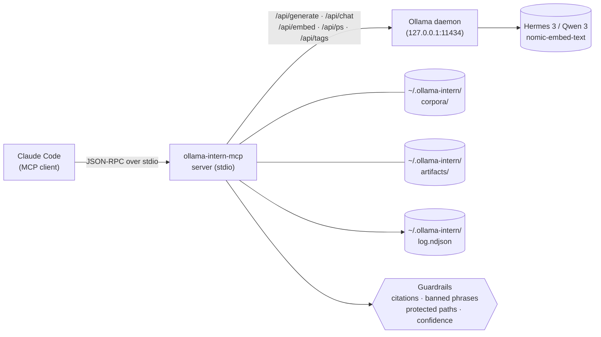

<p align="center">
  <a href="README.ja.md">日本語</a> | <a href="README.zh.md">中文</a> | <a href="README.es.md">Español</a> | <a href="README.md">English</a> | <a href="README.hi.md">हिन्दी</a> | <a href="README.it.md">Italiano</a> | <a href="README.pt-BR.md">Português (BR)</a>
</p>

<p align="center">
  
</p>

<p align="center">
  <a href="https://github.com/mcp-tool-shop-org/ollama-intern-mcp/actions"></a>
  <a href="LICENSE"></a>
  <a href="https://mcp-tool-shop-org.github.io/ollama-intern-mcp/"></a>
  <a href="https://mcp-tool-shop-org.github.io/ollama-intern-mcp/handbook/"></a>
</p>

> **Le stagiaire local pour Claude Code.** <!-- TOOL_COUNT:start -->42<!-- TOOL_COUNT:end --> outils adaptés à la tâche, instructions basées sur les preuves, artefacts durables.

Un serveur MCP qui donne à Claude Code un **stagiaire local** avec des règles, des niveaux, un bureau et une armoire de rangement. Claude choisit l'_outil_; l’outil choisit le _niveau_ (Instantané / Polyvalent / Approfondi / Intégré); le niveau crée un fichier que vous pouvez ouvrir la semaine prochaine.

**Il prend également en charge [Hermes Agent](https://github.com/NousResearch/hermes-agent) sur `hermes3:8b`** — validé de bout en bout le 2026-04-19. L’échelle par défaut est `hermes3:8b`; `qwen3:*` est la voie alternative. Voir [Utilisation avec Hermes](#use-with-hermes) ci-dessous.

**Configuration matérielle requise :** environ 6 Go de VRAM pour `hermes3:8b`, ou environ 16 Go de RAM pour l’inférence CPU. Voir [handbook/getting-started](https://mcp-tool-shop-org.github.io/ollama-intern-mcp/handbook/getting-started/#hardware-minimums) pour une description complète.

**Vous n’utilisez pas Claude ?** Le répertoire [`examples/`](./examples/) contient un client MCP minimal en Node.js et Python que vous pouvez lancer via stdio. Voir également [handbook/with-hermes](https://mcp-tool-shop-org.github.io/ollama-intern-mcp/handbook/with-hermes/).

**Priorité au local** — aucune donnée ne quitte le réseau tant que vous n’acceptez pas explicitement. Pas de télémétrie. Rien d’« autonome ». Chaque appel montre son fonctionnement. Le routage optionnel vers [Ollama Cloud](#ollama-cloud-optional) permet d’utiliser des modèles de classe 600B avec les mêmes outils lorsque le matériel local est la principale limitation, avec un retour automatique au mode local.

---

## Nouveautés dans la version 2.9.0

**La fonctionnalité du « cloud » est désormais disponible : une vérification inter-familles, une mise à l’échelle du cloud à la demande et les avantages économiques que cela représente.** Le mode local reste inchangé : sans clé définie, le comportement est identique à celui de la version 2.8.0 (zéro transfert de données vers l’extérieur, pas de sondage initial du cloud).

- **`ollama_verify_claims` : vérification inter-familles.** `ollama_code_review` *génère* les résultats ; cet outil *évalue* ces résultats. Il exécute un ensemble de modèles Ollama Cloud (deepseek / kimi / glm par défaut) sur vos affirmations et preuves, puis renvoie pour chaque affirmation CONFIRMÉ / RÉFUTÉ / NÉCESSITE_UNE_RÉVISION. L’agrégation est basée sur le principe selon lequel une seule opinion dissidente ne décide pas (≥ 2 pour réfuter, ≥ 2 pour confirmer), chaque évaluateur utilise un modèle vérifié (un modèle de secours local ou substitué est exclu et n’est jamais pris en compte), et les entrées des affirmations sont structurées de manière à supprimer tout raisonnement. Le seuil d’honnêteté est documenté : une affirmation CONFIRMÉE est une preuve à l’appui, pas une preuve irréfutable (fiable pour signaler les erreurs flagrantes, mais moins efficace pour détecter les subtilités d’un modèle de pointe).
- **Mise à l’échelle du cloud par appel + mode veille.** Définissez `OLLAMA_API_KEY` *seul* (sans `OLLAMA_CLOUD_PRIMARY`), et vous êtes en **mode veille** : priorité locale, zéro transfert de données vers l’extérieur, pas de sondage initial, jusqu’à ce qu’un seul appel opte pour le mode cloud avec `backend:'cloud'`. Mettez à l’échelle une seule évaluation importante vers un modèle de 600 milliards de paramètres sans forcer tous les appels à utiliser le cloud. La première mise à l’échelle révèle clairement le transfert de données au moment où il se produit ; un remplacement du `model` par appel est désormais appliqué directement à la tentative d’utilisation du cloud.
- **`ollama_log_stats` : les avantages économiques mesurés promis dans le slogan.** Un résumé sans LLM de vos enregistrements NDJSON : répartition entre le cloud et le local, taux de repli vers le local depuis le cloud, nombre de jetons par outil, p50/p95 de latence, limité par une fenêtre `since`.
- **Outil de diagnostic pour CI + outils lisibles par machine.** `doctor --json --fail-unhealthy` fournit aux pipelines une véritable porte d’entrée (avec un indicateur `healthy` prenant en compte le cloud), et chaque outil inclut désormais les annotations MCP `readOnlyHint`/`destructiveHint`/`title`, afin que les clients obtiennent des autorisations correctes dans l’interface utilisateur. De plus, `init --claude` crée une structure de base pour un fichier `.mcp.json` prêt à être utilisé.

Détails complets dans [CHANGELOG.md](./CHANGELOG.md).

## Nouveau dans la version 2.8.0

**Amélioration de la fiabilité, de la durabilité et de la sécurité — 25 corrections, chacune étant testée en premier et vérifiée sur l’ensemble des familles.** Le comportement axé sur le local reste inchangé et aucun contrat d’outil n’a été supprimé ; les appelants existants continuent de fonctionner. Les avantages sont clairs :

- **Plus de perte silencieuse de données du corpus.** Une erreur de lecture transitoire pendant `ollama_corpus_refresh` (un verrouillage de fichier Windows, un antivirus qui bloque l’accès, une fenêtre d’enregistrement d’un éditeur) classait auparavant le fichier comme « manquant » et **supprimait définitivement son contenu indexé**. Désormais, seul un fichier réellement absent est supprimé ; une erreur transitoire conserve le chemin, signale qu’il faut réessayer et préserve ses fragments.
- **Concurrence qui respecte ses limites.** Un délai d’attente de niveau peut maintenant annuler un appel qui est toujours en attente d’un permis (auparavant, il restait bloqué bien au-delà du temps imparti alors que les reçus indiquaient le contraire), et `ollama_chat` achemine enfin les requêtes à travers la limite de délai/niveau — ainsi, une génération locale qui se bloque ne peut pas paralyser tous les outils, et elle parvient réellement au cloud en mode principal.
- **Cloud qui se dégrade plutôt que de s’arrêter.** Un ID de modèle cloud retiré revient maintenant au mode local avec une raison claire `cloud_model_missing` et un indice spécifique au cloud au lieu d’une panne totale ; le disjoncteur ne peut pas bloquer définitivement l’accès ; un modèle manquant en permanence cesse de solliciter des requêtes vers le cloud à chaque appel.
- **Surface de sécurité qui correspond à sa documentation.** `ollama_batch_proof_check` applique désormais réellement la restriction au répertoire courant (avec une nouvelle limite d’environnement opérateur `INTERN_BATCH_PROOF_ALLOWED_ROOTS` qu’un appelant ne peut pas étendre), les filtres de désinfection contre l’injection de requêtes ont gagné en couverture + un plafond honnêtement divulgué, et la protection du chemin est insensible à la casse sur macOS.
- **Artefacts et reçus honnêtes.** Les écritures de paquets sont atomiques et ne se corrompent jamais silencieusement ; les enveloppes dégradées indiquent le niveau réellement utilisé ; le détecteur d’écriture interrompue détecte les écritures incomplètes lors de toute modification ; les ID de fragments ne coïncident plus pour les fichiers ayant un contenu identique. L’audit des dépendances est entièrement clair (0 vulnérabilités).

Détails complets dans [CHANGELOG.md](./CHANGELOG.md).

## Nouveau dans la version 2.7.0

**Routage optionnel vers Ollama Cloud — mode principal en cloud, retour au local en cas d’échec.** Activez-le avec une clé + un indicateur et les niveaux génératifs acheminent les requêtes vers un modèle cloud de classe 600B ; les intégrations restent locales ; un disjoncteur revient à votre profil local en cas de panne du cloud. **Désactivé par défaut — aucune donnée ne quitte le réseau tant que vous n’avez pas défini `OLLAMA_API_KEY` et `OLLAMA_CLOUD_PRIMARY=1`.** Amélioration mineure : les appelants antérieurs à la version 2.7.0 (et ceux qui n’activent pas cette fonctionnalité) conservent le même comportement. Voir [Ollama Cloud (optionnel)](#ollama-cloud-optional).

- **Priorité au cloud avec filet de sécurité.** Un `RoutingOllamaClient` tente d’abord d’utiliser le cloud et revient au profil local en cas de dépassement du délai / erreur 5xx / 429 / problème réseau. Les clés incorrectes (401/403) sont clairement signalées via un disjoncteur, plutôt que de provoquer une dégradation silencieuse et permanente ; l’ID d’un modèle cloud obsolète ou mal orthographié (404) est également signalé.
- **Pas de rétrogradation silencieuse.** Chaque enveloppe contient `backend` (`cloud`|`local`), `degraded` et `degrade_reason`, afin que vous sachiez toujours quand le modèle local a été utilisé au lieu du modèle principal. Un événement NDJSON `backend_fallback` rend visible le taux de repli vers le local depuis le cloud dans `ollama_log_tail`.
- **`ollama_doctor` signale l’authentification et la connectivité au cloud** dans une section distincte ; `ollama-intern-mcp doctor` affiche une section « Cloud (principal) ».
- Le modèle cloud par défaut était `minimax-m3:cloud` lors de la sortie de la version 2.7.0 *(depuis, il a été modifié pour utiliser `qwen3-coder-next:cloud` — un modèle qui renvoyait des réponses vides sur les outils avec un nombre maximal de prédictions limité ; voir le [tableau des variables d’environnement](#cloud-env-vars)) *; remplacez-le par niveau avec `INTERN_CLOUD_MODEL` / `INTERN_CLOUD_DEEP_MODEL`.

## Nouveau dans la version 2.6.0

Remplacement du budget de niveau par appel sur `ollama_extract`. Amélioration mineure — les appelants antérieurs à la version 2.6.0 restent inchangés. Description détaillée dans [CHANGELOG.md](./CHANGELOG.md).

- Le champ de schéma **`tier_budget_ms_override?: number`** dans `ollama_extract` (facultatif, limité à l’intervalle `[1, 600000]` ms). Lorsqu’il est présent, il applique la valeur spécifiée à chaque niveau visité par le processus, de sorte que le mécanisme interne `runWithTimeoutAndFallback` situé dans `src/guardrails/timeouts.ts:61` respecte le délai défini par l’utilisateur au lieu de celui du profil par défaut. La cascade (processus principal → activation immédiate en cas de dépassement du délai) se déclenche toujours ; la valeur spécifiée contrôle uniformément chaque étape de la cascade.
- **Pourquoi ce champ existe.** L’enveloppe R-018 de research-os (v0.12.1) a enveloppé MCP `callTool` avec `Promise.race` et a constaté que le délai défini par l’enveloppe n’était pas respecté au niveau interne — `DEV_RTX5080_TIMEOUTS.instant = 15_000` continuait de déclencher `TIER_TIMEOUT` après 15 000 ms, quel que soit le délai de 180 000 ms défini par l’enveloppe. La version v2.6.0 fournit le délai définitif côté MCP, de sorte que l’indicateur `--planner-timeout-ms` (research-os) défini par l’utilisateur contrôle enfin les délais au niveau interne, comme prévu.
- **Comportement par défaut conservé.** Si le champ est omis, ce sont les valeurs par défaut du profil qui s’appliquent, octet pour octet. Les versions antérieures à la v2.6.0 ne présentent aucun changement.
- **Expression régulière `fallback-cause` de R-010 conservée.** Le message d’erreur `TIER_TIMEOUT` côté serveur correspond toujours à `/elapsed=(\d+)ms/` + `/budget=(\d+)ms/`, ce qui permet au système d’assistance IA d’analyser les données, que ce soit avec la valeur spécifiée ou avec les valeurs par défaut.
- Utilisé dans research-os v0.13.0 (mise à jour cumulative des clients R-019 + R-020 + R-021) dans le cadre d’une publication coordonnée pour plusieurs référentiels.

### Éléments à livrer – version historique 2.4.0

Consultez les fichiers [CHANGELOG.md](./CHANGELOG.md) et [docs/release-notes/v2.4.0.md](./docs/release-notes/v2.4.0.md) pour obtenir la liste complète des modifications apportées dans la version 2.4.0 (contrôle du paramètre `num_ctx` par niveau sur le système de profils).

## Nouveautés dans la version 2.4.0

Contrôle de `num_ctx` (fenêtre contextuelle) par niveau dans le système de profil. Modification mineure additive – les fonctions appelantes restent inchangées en v2.3.0. Informations détaillées disponibles dans [CHANGELOG.md](./CHANGELOG.md) et [docs/release-notes/v2.4.0.md](./docs/release-notes/v2.4.0.md).

- **Paramètre `TierConfig.num_ctx` (nouveau)** : paramètre optionnel `{ instant?, workhorse?, deep?, embed? }` dans le profil. Lorsqu’il est défini pour une couche, le serveur MCP ajoute `options.num_ctx = <valeur>` à chaque requête de génération/chat Ollama acheminée vers cette couche (initiale + de secours). Lorsqu’il n’est pas défini, la requête omet complètement `num_ctx`, ce qui fait qu’Ollama utilise sa valeur par défaut chargée avec le modèle – comportement préservé exactement comme dans la version v2.3.0.
- **Nouveau champ d’enveloppe `num_ctx_used?: number`** : présent uniquement lorsque le serveur MCP a effectivement envoyé `num_ctx`. Absent lorsque la requête laisse Ollama choisir. Ne pas déduire de valeur par défaut – le serveur MCP n’interroge pas Ollama pour connaître la valeur effective.
- **Valeurs par défaut du profil** : `dev-rtx5080` / `dev-rtx5080-qwen3` sont configurés avec `instant: 4096`, `workhorse: 8192`, `deep`/`embed` non définis. Les valeurs sont ajustées pour que `hermes3:8b` reste en mémoire dans les 16 Go de VRAM du RTX 5080, afin d’optimiser la vitesse des outils. `m5-max` laisse chaque couche sans valeur définie – les 128 Go de mémoire unifiée ne présentent aucun problème de débordement.
- **Clôture de la phase 1 du diagnostic v0.8.0** : avec `hermes3:8b` et le contexte par défaut de 32 Ko sur RTX 5080, des données ont été déversées vers le CPU, ce qui a entraîné des délais d’exécution pour les appels à la fonction `ollama_extract`. La version v2.4.0 empêche cela au niveau du profil.

### Contrôle de `num_ctx` par niveau (nouveau dans la version 2.4.0)

Profil (extrait du fichier `src/profiles.ts`) :

```ts
"dev-rtx5080": {
  tiers: {
    instant: "hermes3:8b",
    workhorse: "hermes3:8b",
    deep: "hermes3:8b",
    embed: "nomic-embed-text",
    num_ctx: {
      instant: 4096,    // fast classify/summarize
      workhorse: 8192,  // schema-bound extract / batch
      // deep: UNSET — long-context briefs keep current behavior
      // embed: UNSET — no context-window pressure on embed
    },
  },
  // ... timeouts, prewarm
}
```

Enveloppe pour une fonction de base (par exemple, « ollama_extract ») :

```jsonc
{
  "result": { /* extracted data */ },
  "tier_used": "workhorse",
  "model": "hermes3:8b",
  "num_ctx_used": 8192,        // present because the profile set workhorse=8192
  // ... rest of envelope unchanged
}
```

Dans le cas de « m5-max » (ou de tout autre profil où un niveau n’est pas défini), la valeur « num_ctx_used » est absente de l’enveloppe et la requête envoyée à Ollama ne contient pas le champ « num_ctx ». Dans ce cas, Ollama utilise sa valeur par défaut, qui correspond aux paramètres du modèle chargé.

Les opérateurs peuvent ajuster les paramètres en sélectionnant ou en modifiant le profil ; il n’y a pas de paramètre « num_ctx » spécifique à chaque appel dans les schémas d’outils. Si, lors d’un appel ultérieur, un tel paramètre s’avère nécessaire, la méthode utilisée sera celle de la version 2.3.0, qui consiste à remplacer le modèle par défaut.

### Éléments à livrer – version historique 2.3.0

Consultez les fichiers [CHANGELOG.md](./CHANGELOG.md) et [docs/release-notes/v2.3.0.md](./docs/release-notes/v2.3.0.md) pour obtenir la description complète de la version v2.3.0 (avec notamment la possibilité de remplacer le modèle par appel).

## Nouveautés dans la version 2.3.0

Possibilité de remplacer le modèle par appel pour tous les outils atomiques basés sur un LLM. Modification mineure additive : les appels de la version v2.2.0 restent inchangés. Vous trouverez des informations détaillées dans les fichiers [CHANGELOG.md](./CHANGELOG.md) et [docs/release-notes/v2.3.0.md](./docs/release-notes/v2.3.0.md).

- **Paramètre d’entrée optionnel `model: string` pour les 8 outils atomiques** — `ollama_extract`, `ollama_classify`, `ollama_summarize_fast`, `ollama_summarize_deep`, `ollama_research`, `ollama_corpus_answer`, `ollama_chat`, `ollama_code_citation`. La première tentative pour chaque outil utilise le modèle spécifié par l’appelant ; en cas de dépassement du temps imparti, la séquence existante `TIER_FALLBACK` résout le problème en utilisant le modèle du niveau inférieur (et non le modèle spécifié par l’appelant). Les outils composites/brefs/regroupés n’acceptent délibérément pas le paramètre `model` ; les outils atomiques ont un contrôle spécifique pour chaque appel, tandis que les outils composites utilisent les valeurs par défaut du niveau.
- **Nouveau champ d’enveloppe `model_requested?: string`** — présent uniquement lorsque l’appelant a fourni une valeur de remplacement. Les appelants qui tiennent compte de la calibration comparent `model_requested` à `model` pour détecter un remplacement en cas de repli : `if (env.model_requested && env.model !== env.model_requested) { /* remplacement */ }`. Les entrées vides ou ne contenant que des espaces génèrent une erreur `ZodError` lors de l’analyse du schéma, et non un simple passage au niveau inférieur sans avertissement.
- **Correction d’un bug — dérive dans le fichier `src/version.ts`.** La constante `VERSION` utilisée pendant l’exécution est désormais lue à partir du fichier `package.json` lors du chargement du module ; les versions v2.1.0 et v2.2.0 affichaient incorrectement la chaîne d’identification obsolète `"2.0.0"`. Le nouveau fichier `tests/version.test.ts` vérifie que `VERSION === pkg.version`.

### Possibilité de remplacer le modèle par défaut pour chaque appel (nouveau dans la version 2.3.0)

```jsonc
{
  "tool": "ollama_classify",
  "arguments": {
    "text": "patch null pointer in auth",
    "labels": ["feat", "fix", "chore"],
    "frame": "what is the change kind?",
    "model": "hermes3:8b"
  }
}
```

Enveloppe :

```jsonc
{
  "result": { "label": "fix", "confidence": 0.9, "off_topic": false, ... },
  "tier_used": "instant",
  "model": "hermes3:8b",
  "model_requested": "hermes3:8b",       // present because override was supplied
  // ... rest of envelope unchanged
}
```

Si le serveur principal/de niveau inférieur a atteint sa limite de temps et que la requête a été redirigée vers le serveur instantané, `env.model` correspondrait au modèle résolu du serveur instantané et `env.fallback_from` vaudrait `"workhorse"`. Cependant, `env.model_requested` resterait `"hermes3:8b"` et `env.model !== env.model_requested` signalerait le remplacement. Le remplacement n’est pas intentionnellement appliqué au serveur moins coûteux ; le modèle choisi pourrait ne pas convenir du tout aux fonctions de ce serveur.

### Éléments à fournir – version historique 2.2.0

Consultez [CHANGELOG.md](./CHANGELOG.md) et [docs/release-notes/v2.2.0.md](./docs/release-notes/v2.2.0.md) pour obtenir la description complète de la version v2.2.0 (pertinence liée au contexte + abstention structurée).

## Nouveautés dans la version v2.2.0

Contrat de rôle local pour l’analyse des preuves : pertinence liée au contexte et abstention structurée. Amélioration mineure additive — les appelants de la version v2.1.0 restent inchangés. Descriptions détaillées dans [CHANGELOG.md](./CHANGELOG.md) et [docs/release-notes/v2.2.0.md](./docs/release-notes/v2.2.0.md).

- **Extraction liée au contexte** pour `ollama_extract`, `ollama_classify`, `ollama_summarize_fast`, `ollama_summarize_deep` — entrée optionnelle `frame: string` + sorties structurées `frame_alignment` / `on_topic` / `frame_addressed`. Les sources hors sujet sont signalées au lieu d’être reformulées pour correspondre au schéma.
- **Abstention structurée** pour `ollama_research` — champs `weak` / `abstained` / `sources_address_question`. Un tableau `citations[]` vide avec un champ `answer` non vide n’est plus considéré comme une réussite silencieuse.
- **Seuil de pertinence** pour `ollama_corpus_answer` — entrée optionnelle `min_top_score`. En dessous du seuil, l’outil s’arrête et renvoie `abstained: true`, puis ignore la synthèse. Le score par citation est désormais visible dans chaque citation.
- **Préservation du score de récupération** grâce à des preuves succinctes — `corpusHitsToEvidence` conserve le `score` (et le paramètre `corpus_min_evidence_score` filtre lors de l’assemblage sur `incident_brief` / `repo_brief` / `change_brief`).
- **Limites de plage pour les lignes de citation** — `guardrails/citations.ts` rejette les plages hors limites dans `ollama_research`, ce qui correspond au comportement existant dans `ollama_code_citation`.
- **Correction des documents du contrat opérateur** — correction de `chunk_id`/`chunk_index` dans le fichier README, reformulation de la phrase « validé côté serveur », qualification de la section sur les lois relatives aux preuves et annotation du slogan marketing.

### Régression des tests — vérification

Le contrat de la tranche est vérifié par rapport à l’échec littéral du pack « fresh-pack » de research-os : arxiv 2112.10422 (Cosmological Standard Timers) dans la section 01, intitulé « Que signifie la gestion des preuves dans les flux de travail d’analyse approfondie en local ou dans le cloud avec un LLM ? » — 9 tests contractuels sur 9 pour le LLM simulé confirment que la source hors sujet est désormais contenue (`frame_alignment.on_topic = false` lors de l’extraction ; `off_topic: true` lors de la classification ; `frame_addressed: false` lors de la synthèse approfondie ; `abstained: true` pour `corpus_answer` avec `min_top_score` défini).

### Éléments livrables historiques — version v2.1.0

Consultez [CHANGELOG.md](./CHANGELOG.md) pour obtenir la description complète de la version v2.1.0 (validation des fonctionnalités : 13 nouveaux outils + 4 améliorations + suppression du gel).

---

## Architecture en bref


```mermaid
flowchart LR
  Claude["Claude Code<br/>(MCP client)"]
  MCP["ollama-intern-mcp<br/>server (stdio)"]
  Ollama["Ollama daemon<br/>(127.0.0.1:11434)"]
  Models[("Hermes 3 / Qwen 3<br/>nomic-embed-text")]
  Corpus[("~/.ollama-intern/<br/>corpora/")]
  Artifacts[("~/.ollama-intern/<br/>artifacts/")]
  NDJSON[("~/.ollama-intern/<br/>log.ndjson")]
  Guards{{"Guardrails<br/>citations · banned phrases<br/>protected paths · confidence"}}

  Claude -- "JSON-RPC over stdio" --> MCP
  MCP --> Guards
  MCP -- "/api/generate · /api/chat<br/>/api/embed · /api/ps · /api/tags" --> Ollama
  Ollama --> Models
  MCP --- Corpus
  MCP --- Artifacts
  MCP --> NDJSON
```

Chaque appel d’outil Claude est transmis au serveur MCP via stdio JSON-RPC. Le serveur valide l’appel par rapport au schéma [zod](https://zod.dev) de l’outil, exécute les contrôles configurés (validation des citations, suppression des phrases interdites, application des chemins protégés, seuils de confiance), puis redirige vers un moteur déterministe (niveau artefact) ou un appel HTTP Ollama (pour tous les autres niveaux). Le démon Ollama ne voit jamais les chemins fournis par l’utilisateur — seul le niveau du modèle et l’invite préparée. Chaque appel ajoute un événement structuré au journal NDJSON situé à `~/.ollama-intern/log.ndjson`, où `ollama_log_tail` et votre shell peuvent le lire.

---

## Exemple principal — un appel, un artefact

```jsonc
// Claude → ollama-intern-mcp
{
  "tool": "ollama_incident_pack",
  "arguments": {
    "title": "sprite pipeline 5 AM paging regression",
    "logs": "[2026-04-16 05:07] worker-3 OOM killed\n[2026-04-16 05:07] ollama /api/ps reports evicted=true size=8.1GB\n...",
    "source_paths": ["F:/AI/sprite-foundry/src/worker.ts", "memory/sprite-foundry-visual-mastery.md"]
  }
}
```

Renvoie une enveloppe pointant vers un fichier sur le disque :

```jsonc
{
  "result": {
    "pack": "incident",
    "slug": "2026-04-16-sprite-pipeline-5-am-paging-regression",
    "artifact_md":   "~/.ollama-intern/artifacts/incident/2026-04-16-sprite-pipeline-5-am-paging-regression.md",
    "artifact_json": "~/.ollama-intern/artifacts/incident/2026-04-16-sprite-pipeline-5-am-paging-regression.json",
    "weak": false,
    "evidence_count": 6,
    "next_checks": ["residency.evicted across last 24h", "OLLAMA_MAX_LOADED_MODELS vs loaded size"]
  },
  "tier_used": "deep",
  "model": "hermes3:8b",
  "hardware_profile": "dev-rtx5080",
  "tokens_in": 4180, "tokens_out": 612,
  "elapsed_ms": 8410,
  "residency": { "in_vram": true, "evicted": false }
}
```

→ `weak: false` signifie qu’au moins 2 éléments de preuve ont été assemblés ; cela ne signifie PAS que les hypothèses sont validées. Consultez la section [Lois relatives aux preuves](#evidence-laws) ci-dessous.

Ce fichier Markdown est le résultat du travail de l’analyste — titres, bloc de preuves avec des identifiants cités, `next_checks` pour l’enquête et une bannière `weak: true` si les preuves sont limitées. Il est déterministe : le moteur est un code, pas une invite. (Le moteur est déterministe ; le *contenu* des hypothèses et des surfaces est génératif — considérez-les comme des brouillons, pas comme des éléments validés.) Ouvrez-le demain, comparez-le la semaine prochaine, exportez-le dans un manuel avec `ollama_artifact_export_to_path`.

Tous les concurrents de cette catégorie mettent en avant « l’économie de jetons ». Nous mettons en avant « voici le fichier que l’analyste a écrit ».

### Deuxième exemple — créez un corpus, puis interrogez-le

```jsonc
// 1. Build a persistent, searchable corpus over your project.
{ "tool": "ollama_corpus_index",
  "arguments": { "name": "sprite-foundry",
                 "paths": ["F:/AI/sprite-foundry/src"],
                 "embed_model": "nomic-embed-text" } }
// → { chunks_written: 1204, paths_indexed: 312, failed_paths: [] }

// 2. Ask an evidence-bound question against it.
{ "tool": "ollama_corpus_answer",
  "arguments": { "name": "sprite-foundry",
                 "query": "how does the worker handle OOM eviction?",
                 "top_k": 8 } }
// → { answer: "...", citations: [{chunk_index, path}...], weak: false }
```

Le serveur valide l’identité de la citation et vérifie que chaque `chunk_index` se trouve dans la plage des résultats récupérés. Il ne prouve PAS que chaque affirmation générée est soutenue sémantiquement par le contenu du bloc cité — c’est la responsabilité du modèle, et une récupération médiocre peut toujours produire des réponses qui ressemblent à des citations. Explication complète dans [handbook/corpora](https://mcp-tool-shop-org.github.io/ollama-intern-mcp/handbook/corpora/).

---

## Extraction liée au contexte (nouveauté de la version v2.2.0)

`ollama_extract`, `ollama_classify`, `ollama_summarize_fast` et `ollama_summarize_deep` acceptent une entrée optionnelle `frame: string`. Le paramètre `frame` indique la question à laquelle on demande à la source de répondre ; le modèle est invité à s’abstenir plutôt qu’à produire un contenu vrai mais hors sujet lorsque la source n’aborde pas le contexte.

```jsonc
{
  "tool": "ollama_extract",
  "arguments": {
    "text": "<long source document>",
    "schema": { /* your fields */ },
    "frame": "section purpose here — e.g. 'OOM eviction behavior in the sprite worker'"
  }
}
// → result includes frame_alignment: { on_topic: boolean, reason: string, unaddressed_aspects: string[] }
```

Si le paramètre `frame` est omis, le comportement reste inchangé par rapport à la version v2.1.0. Lorsqu’il est fourni, `frame_alignment.on_topic = false` indique que les champs extraits peuvent être vrais pour la source, mais pas pertinents pour le contexte — considérez cela comme ayant la même signification qu’un bref avec `weak: true : utile, mais vérifiez avant de l’intégrer dans les preuves ultérieures.

---

## Contrat d’abstention (nouveauté de la version v2.2.0)

`ollama_research` renvoie des champs d’abstention structurés : `weak: boolean`, `abstained: boolean`, `sources_address_question: boolean | null`. Un tableau `citations[]` vide avec un champ `answer` non vide n’est plus considéré comme une réussite silencieuse — `abstained: true` indique que le modèle a refusé de synthétiser parce que les chemins fournis par l’appelant n’abordaient pas la question. Considérez l’abstention comme une réussite, et non comme un échec : il s’agit de l’outil qui refuse de transformer des résultats médiocres en informations faisant autorité.

`ollama_corpus_answer` accepte un seuil de pertinence thématique optionnel `min_top_score: number` (de 0,0 à 1,0). Lorsque le score de récupération maximal pour une requête est inférieur à `min_top_score`, l’outil interrompt le processus avec `abstained: true` et saute la synthèse, ce qui empêche le mode d’échec « 5 fragments hors sujet avec un score de 0,21 qui génèrent toujours une réponse complète » que la règle `weak: true` de la version 2.1.0 ne détectait pas (`weak: true` n’était appliqué que lorsque `hits.length < 2`). Associez ceci au champ `score` par citation, nouvellement ajouté pour chaque citation, afin d’évaluer directement la qualité de la récupération à partir des données.

---

## Qu’est-ce qui se trouve ici : quatre niveaux, <!-- TOOL_COUNT:start -->42<!-- TOOL_COUNT:end --> outils

« Orienté tâche » signifie que chaque outil correspond à une tâche que vous confieriez à un stagiaire : classer ceci, extraire cela, trier ces journaux, rédiger cette note de version, organiser cet incident. L’entrée de l’outil est la spécification de la tâche ; la sortie est le résultat attendu. Pas d’opération générique `run_model` / `chat_with_llm` au niveau supérieur.

| Niveau | Nombre | Ce qui s’y trouve |
|---|---|---|
| **Atoms** | 31 | Primitives de type « job ». **Original 15 :** `classify`, `extract`, `triage_logs`, `summarize_fast` / `deep`, `draft`, `research`, `corpus_search` / `answer` / `index` / `refresh` / `list`, `embed_search`, `embed`, `chat`. **+13 ajoutés dans la version 2.1.0 :** `doctor`, `log_tail`, `batch_proof_check` (opérations) ; `code_map`, `code_citation`, `multi_file_refactor_propose`, `refactor_plan` (refactoring) ; `artifact_prune`, `hypothesis_drill` (artefact/brouillon) ; `corpus_health`, `corpus_amend`, `corpus_amend_history`, `corpus_rerank` (corpus). **+1 atome de révision :** `code_review` (résultats structurés de la révision des demandes d’extraction, outil principal ; uniquement pour la révision). **+2 dans la version 2.9 :** `verify_claims` (un ensemble de modèles cloud inter-familles évalue les affirmations ; nécessite l’utilisation du cloud) et `log_stats` (agrège les enregistrements NDJSON en avantages économiques mesurés — répartition entre le cloud et le local, taux de repli, p50/p95 par outil ; aucun appel au modèle). Les atomes capables de traiter des lots (`classify`, `extract`, `triage_logs`) acceptent `items: [{id, text}]`. |
| **Briefs** | 3 | Brefs structurés et étayés par des preuves. `incident_brief`, `repo_brief`, `change_brief`. Chaque affirmation cite un identifiant de preuve ; les éléments inconnus sont supprimés côté serveur. Les preuves faibles affichent `weak: true` plutôt qu’un récit inventé. |
| **Packs** | 3 | Tâches composées à pipeline fixe qui écrivent des données Markdown + JSON durables dans `~/.ollama-intern/artifacts/`. `incident_pack`, `repo_pack`, `change_pack`. Renders déterministes ; aucune requête de modèle n’est effectuée sur la forme de l’artefact. |
| **Artifacts** | 7 | Surface de continuité sur les sorties des packs. `artifact_list` / `read` / `diff` / `export_to_path`, ainsi que trois extraits déterministes : `incident_note`, `onboarding_section`, `release_note`. |

Total : **29 opérations + 3 brefs + 3 packs + 7 outils d’artefact = <!-- TOOL_COUNT:start -->42<!-- TOOL_COUNT:end -->**.

Lignes figées :
- Opérations : gel **levé dans la version 2.1.0** (29 aujourd’hui ; +13 ajoutés lors de la mise à jour des fonctionnalités de la version 2.1.0, +1 `code_review` ultérieurement). Les nouvelles opérations nécessitent toujours une justification basée sur une analyse, des tests, une page du manuel et une entrée dans le journal des modifications ; aucun ajout occasionnel n’est autorisé.
- Packs figés à 3. Aucun nouveau type de pack.
- Niveau artefact figé à 7.

La référence complète des outils se trouve dans le [manuel](https://mcp-tool-shop-org.github.io/ollama-intern-mcp/handbook/tools/).

---

## Installation

Nécessite que [Ollama](https://ollama.com) soit en cours d’exécution localement et que les modèles du niveau soient téléchargés (voir [Téléchargement des modèles](#model-pulls) ci-dessous).

### Claude Code (recommandé)

La plupart des utilisateurs l’installent en l’ajoutant à la configuration de leur serveur Claude Code MCP ; aucune installation globale n’est requise. Claude Code exécute le serveur à la demande via `npx` :

```json
{
  "mcpServers": {
    "ollama-intern": {
      "command": "npx",
      "args": ["-y", "ollama-intern-mcp"],
      "env": {
        "OLLAMA_HOST": "http://127.0.0.1:11434",
        "INTERN_PROFILE": "dev-rtx5080"
      }
    }
  }
}
```

### Claude Desktop

Même bloc, écrit dans `~/Library/Application Support/Claude/claude_desktop_config.json` (macOS) ou `%APPDATA%\Claude\claude_desktop_config.json` (Windows).

### Installation globale (avancée)

N’est nécessaire que si vous souhaitez que le binaire se trouve dans votre variable `PATH` pour une utilisation ponctuelle en dehors de Claude Code :

```bash
npm install -g ollama-intern-mcp
```

### Utilisation avec Hermes

Ce MCP a été validé de bout en bout avec [Hermes Agent](https://github.com/NousResearch/hermes-agent) par rapport à `hermes3:8b` sur Ollama (19 avril 2026). Hermes est un agent externe qui *appelle* la surface d’opérations figées de ce MCP ; il effectue la planification, et nous effectuons le travail.

Configuration de référence ([hermes.config.example.yaml](hermes.config.example.yaml) dans ce dépôt) :

```yaml
model:
  provider: custom
  base_url: http://localhost:11434/v1
  default: hermes3:8b
  context_length: 65536    # Hermes requires 64K floor under model.*

providers:
  local-ollama:
    name: local-ollama
    base_url: http://localhost:11434/v1
    api_mode: openai_chat
    api_key: ollama
    model: hermes3:8b

mcp_servers:
  ollama-intern:
    command: npx
    args: ["-y", "ollama-intern-mcp"]
    env:
      OLLAMA_HOST: http://localhost:11434
      INTERN_PROFILE: dev-rtx5080
      # hermes3:8b is the default ladder in v2.0.0, so tier overrides are
      # only needed if you're pinning a different local model.
```

**La forme de l’invite est importante.** Les invites impératives d’invocation d’outils (« Appeler X avec les arguments… ») constituent le test d’intégration ; elles fournissent à un modèle local de 8 milliards de paramètres suffisamment d’éléments pour générer des `tool_calls` propres. Les invites multitâches sous forme de liste (« faire A, puis B, puis C ») sont des références de capacité pour les modèles plus volumineux ; ne considérez pas un échec d’une invite sous forme de liste sur un modèle de 8 milliards de paramètres comme signifiant que « le câblage est défectueux ». Voir [handbook/with-hermes](https://mcp-tool-shop-org.github.io/ollama-intern-mcp/handbook/with-hermes/) pour l’intégralité du processus d’intégration et les mises en garde connues concernant le transport (streaming Ollama `/v1` + shim de streaming non pris en charge par openai-SDK).

### Téléchargement des modèles

**Profil de développement par défaut (RTX 5080 16 Go et équivalent) :**

```bash
ollama pull hermes3:8b
ollama pull nomic-embed-text
export OLLAMA_MAX_LOADED_MODELS=2
export OLLAMA_KEEP_ALIVE=-1
```

**Rail alternatif Qwen 3 (même matériel, pour les outils Qwen) :**

```bash
ollama pull qwen3:8b
ollama pull qwen3:14b
ollama pull nomic-embed-text
export INTERN_PROFILE=dev-rtx5080-qwen3
```

**Profil M5 Max (128 Go de mémoire unifiée) :**

```bash
ollama pull qwen3:14b
ollama pull qwen3:32b
ollama pull nomic-embed-text
export INTERN_PROFILE=m5-max
```

Les variables d’environnement par niveau (`INTERN_TIER_INSTANT`, `INTERN_TIER_WORKHORSE`, `INTERN_TIER_DEEP`, `INTERN_EMBED_MODEL`) remplacent toujours les choix du profil pour des cas ponctuels.

---

## Enveloppe uniforme

Chaque outil renvoie la même structure :

```ts
{
  result: <tool-specific>,
  tier_used: "instant" | "workhorse" | "deep" | "embed",
  model: string,
  hardware_profile: string,     // "dev-rtx5080" | "dev-rtx5080-qwen3" | "m5-max"
  tokens_in: number,
  tokens_out: number,
  elapsed_ms: number,
  residency: {
    in_vram: boolean,
    size_bytes: number,
    size_vram_bytes: number,
    evicted: boolean
  } | null
}
```

`residency` provient de l’API `/api/ps` d’Ollama. Lorsque `evicted: true` ou `size_vram < size`, le modèle est mis en mémoire virtuelle et l’inférence est ralentie de 5 à 10 fois ; affichez ces informations à l’utilisateur afin qu’il sache qu’il doit redémarrer Ollama ou réduire le nombre de modèles chargés.

En mode [Ollama Cloud](#ollama-cloud-optional), l’enveloppe contient également `backend` (`"cloud"` | `"local"`) et, en cas de basculement du cloud vers le local, `degraded: true` + `degrade_reason`. Ces champs sont **absents** dans le chemin local par défaut, de sorte que les consommateurs existants ne sont pas affectés. `residency` est `null` pour les appels traités sur le cloud (le cloud sans état n’a aucune résidence en mémoire VRAM locale).

Chaque appel est enregistré sous forme d’une ligne NDJSON dans `~/.ollama-intern/log.ndjson`. Filtrez par `hardware_profile` pour exclure les numéros de développement des références comparatives publiables.

---

## Profils matériels

| Profil | Instantané | Polyvalent | Approfondi | Intégration |
|---|---|---|---|---|
| **`dev-rtx5080`** (par défaut) | hermes3 8B | hermes3 8B | hermes3 8B | nomic-embed-text |
| `dev-rtx5080-qwen3` | qwen3 8B | qwen3 8B | qwen3 14B | nomic-embed-text |
| `m5-max` | qwen3 14B | qwen3 14B | qwen3 32B | nomic-embed-text |

**Le profil par défaut** regroupe les trois niveaux de performance sur `hermes3:8b`, qui est la configuration validée pour l’intégration d’Hermes Agent. L’utilisation du même modèle à tous les niveaux signifie qu’il n’y a qu’un seul élément à télécharger, un seul coût de stockage et un seul ensemble de comportements à comprendre. Les utilisateurs qui préfèrent Qwen 3 (avec son système `THINK_BY_SHAPE`) peuvent opter pour `dev-rtx5080-qwen3`. `m5-max` est la configuration Qwen 3 optimisée pour une mémoire unifiée.

---

## Ollama Cloud (facultatif)

Les modèles locaux de 8 Go représentent le principal goulot d’étranglement matériel rencontré par la plupart des utilisateurs. [Ollama Cloud](https://ollama.com/cloud) propose des modèles de classe 600B derrière la **même** interface `/api/*`, ce qui vous permet de diriger les outils les plus gourmands vers un modèle beaucoup plus puissant et de libérer la VRAM locale, tout en conservant une option locale comme solution de secours toujours disponible.

**Cette fonctionnalité est activable et désactivée par défaut.** Sans clé définie, le package reste en mode local avec **zéro transfert de données vers l’extérieur** — toute personne qui n’active pas cette fonctionnalité n’est pas affectée. Il existe deux façons d’activer cette fonctionnalité :

- **Priorité au cloud** (ci-dessous) : définissez *les deux* `OLLAMA_CLOUD_PRIMARY=1` et `OLLAMA_API_KEY` — les niveaux génératifs sont acheminés vers le cloud avec un repli local.
- **Cloud en veille** (version 2.9) : définissez **uniquement** `OLLAMA_API_KEY` — tout reste local (zéro transfert de données vers l’extérieur, même pas de sondage initial) jusqu’à ce qu’un seul appel demande explicitement une mise à l’échelle avec `backend: "cloud"`. Voir [Cloud en veille et mise à l’échelle par appel](#cloud-standby--per-call-escalation) ci-dessous.

```json
{
  "mcpServers": {
    "ollama-intern": {
      "command": "npx",
      "args": ["-y", "ollama-intern-mcp"],
      "env": {
        "OLLAMA_CLOUD_PRIMARY": "1",
        "OLLAMA_API_KEY": "sk-...your-key...",
        "INTERN_PROFILE": "dev-rtx5080"
      }
    }
  }
}
```

> **La clé est une variable d’environnement d’exécution, et non un secret CI.** Un secret GitHub Actions n’est visible que dans les exécutions CI ; il n’atteint jamais le serveur en cours d’exécution. Créez une clé sur [ollama.com/settings/keys](https://ollama.com/settings/keys) et placez-la dans le bloc `env` de votre client MCP (ou dans votre environnement shell).

**Fonctionnement du routage.** Lorsque le cloud est activé, les niveaux de génération (instantané / polyvalent / approfondi) sont dirigés vers le modèle du cloud ; **les intégrations restent toujours locales** (Ollama Cloud ne propose aucun modèle d’intégration, de sorte que les outils de corpus/d’intégration ne sont pas affectés). Un système de basculement tente d’abord d’utiliser le cloud et revient à votre profil local en cas de dépassement du délai / erreur 5xx / 429 / erreurs réseau. Une clé incorrecte (401/403) déclenche un système de basculement *persistant* qui signale clairement le problème plutôt que de dégrader silencieusement les performances. Le profil local (`INTERN_PROFILE`) est la solution de secours, conservez donc ses modèles téléchargés.

**Vous ne serez jamais rétrogradé en silence.** Chaque requête indique quel backend a traité l’appel :

```ts
{ ...envelope, backend: "cloud" | "local", degraded?: true, degrade_reason?: "cloud_timeout" | "cloud_5xx" | "cloud_rate_limited" | "cloud_unreachable" | "cloud_auth_failed" | "circuit_open" }
```

Une ligne `backend_fallback` est ajoutée à `~/.ollama-intern/log.ndjson` pour chaque basculement du cloud vers le local (`ollama_log_tail --filter_kind backend_fallback`), et la commande `ollama-intern-mcp doctor` affiche un bloc **Cloud (principal)** avec l’état d’accessibilité et d’authentification.

### Cloud en veille et mise à l’échelle par appel

Définir `OLLAMA_API_KEY` **sans** `OLLAMA_CLOUD_PRIMARY` active le **mode veille :** le routage reste en mode local, et rien ne quitte la machine — jusqu’à ce qu’un appel contienne `backend: "cloud"` (exposé dans `ollama_chat`, utilisé en interne par `ollama_verify_claims`). Ce seul appel est mis à l’échelle vers le modèle cloud, avec le même mécanisme de disjoncteur + repli local et la même provenance des données ; tous les autres appels restent locaux. Le **premier** appel mis à l’échelle affiche un message clair dans stderr indiquant le nom de l’hôte et écrit une ligne `cloud_egress` dans le journal NDJSON — le transfert de données est signalé au moment où il se produit, et non pas seulement ici dans la documentation.

Les règles, appliquées mécaniquement :

- Pas de clé → `backend: "cloud"` échoue avec `CLOUD_NOT_CONFIGURED`. Le modèle local ne répond **jamais** silencieusement en prétendant avoir effectué une mise à l’échelle.
- Mode veille + pas d’instruction → mode local, zéro transfert de données vers l’extérieur (le démarrage ne sonde pas non plus l’hôte cloud).
- En mode priorité au cloud, `backend: "local"` force un appel à utiliser le modèle local — la solution de repli.
- Un remplacement du `model` par appel est désormais appliqué directement au chemin d’accès au cloud (il était auparavant écrasé par le mappage niveau → modèle cloud), afin que les orchestrateurs basés sur des enregistrements puissent spécifier le modèle cloud exact pour chaque appel.

Le modèle phare pour les utilisateurs est **`ollama_verify_claims`** : il permet d’évaluer les revendications et les conclusions à l’aide d’un groupe de modèles hébergés dans le cloud, issus de différentes familles (par défaut : `deepseek-v4-pro:cloud` / `kimi-k2.7-code:cloud` / `glm-5.2:cloud`). Il utilise une méthode d’agrégation où un seul vote dissident ne suffit pas à prendre une décision, effectue des vérifications sur chaque modèle utilisé et affiche un indicateur « faible » lorsque le groupe de modèles est réduit. Une confirmation du groupe concernant les revendications formulées par les modèles les plus récents constitue une *preuve à l’appui, mais pas une preuve définitive*. Le groupe détecte efficacement les erreurs flagrantes, mais il est moins performant pour détecter les erreurs subtiles. Consultez la [page du manuel](https://mcp-tool-shop-org.github.io/ollama-intern-mcp/handbook/tools/verify-claims/).

**Latence par rapport à la qualité.** Les grands modèles du cloud s’exécutent beaucoup plus lentement que les modèles locaux de 8 Go (en secondes, pas en millisecondes) ; il s’agit d’une amélioration de la qualité, et non de la vitesse. Les niveaux du cloud utilisent un délai d’attente généreux (instantané : 30 s / polyvalent : 120 s / approfondi : 300 s par défaut).

### Variables d’environnement du cloud

| Variable | Valeur par défaut | Objectif |
|---|---|---|
| `OLLAMA_CLOUD_PRIMARY` | _(non défini)_ | **Activation de l’option « cloud-primary ».** `1`/`true`/`yes`/`on` redirige les niveaux génératifs vers le cloud. Si cette option n’est pas définie avec une clé, elle est réglée sur **standby** (mode principal local, escalade uniquement pour chaque appel). Si l’option n’est pas définie sans clé, seul le mode local est utilisé, sans transfert de données vers l’extérieur. |
| `OLLAMA_API_KEY` | _(non défini)_ | Clé d’authentification pour Ollama Cloud. Sa simple définition active le mode **standby** ; elle est **obligatoire** lorsque `OLLAMA_CLOUD_PRIMARY` est activé (en cas d’absence, une erreur se produit au démarrage). |
| `OLLAMA_CLOUD_HOST` | `https://ollama.com` | Hôte de base du cloud. |
| `INTERN_CLOUD_MODEL` | `qwen3-coder-next:cloud` | Modèle cloud pour un usage immédiat et intensif. Conservez la valeur par défaut **non-analytique** ; l’utilisation d’un modèle analytique ici épuiserait rapidement les ressources allouées pour le raisonnement (placez les modèles de raisonnement complexes dans la section « deep override » ci-dessous). |
| `INTERN_CLOUD_DEEP_MODEL` | _(= `INTERN_CLOUD_MODEL`)_ | Remplacement facultatif uniquement pour le niveau approfondi, par exemple `deepseek-v3.1:671b`. |
| `INTERN_CLOUD_TIMEOUT_{INSTANT,WORKHORSE,DEEP}_MS` | `30000`/`120000`/`300000` | Délai d’attente pour chaque tentative de connexion au cloud. |
| `INTERN_CLOUD_NUM_CTX` | `32768` | Limite de la taille de la fenêtre de contexte pour les appels au cloud (le cloud facture en fonction du temps GPU ; la limite contrôle le coût). |

> **Modifications de la disponibilité des modèles.** Ollama met à jour ou retire les identifiants cloud côté serveur. Au 2026-07, `qwen3-coder-next:cloud` (valeur par défaut non-analytique) et les modèles analytiques phares `deepseek-v4-pro:cloud` / `kimi-k2.7-code:cloud` / `glm-5.2:cloud` sont disponibles ; vérifiez [ollama.com/search?c=cloud](https://ollama.com/search?c=cloud) avant de fixer un identifiant. Un identifiant retiré entraîne une dégradation visible (`cloud_model_missing`), mais jamais silencieuse.

**Note sur la confidentialité.** Le routage vers Ollama Cloud envoie les requêtes à un tiers. La politique de confidentialité d’Ollama indique que les requêtes du cloud sont traitées de manière transitoire, qu’elles ne sont pas conservées au-delà de la requête et qu’elles ne sont pas utilisées pour l’entraînement, mais il s’agit tout de même d’un transfert de données, c’est pourquoi cette fonctionnalité est facultative et doit être explicitement activée. En mode uniquement local (par défaut), rien n’est envoyé en dehors du système.

---

## Lois sur les preuves

Ces lois sont appliquées au niveau du serveur, et non dans la requête :

- **Les citations sont obligatoires.** Chaque affirmation doit citer un identifiant de preuve.
- **Les éléments inconnus sont supprimés côté serveur.** Les modèles qui citent des identifiants qui ne figurent pas dans l’ensemble des preuves voient ces identifiants supprimés avec un avertissement avant que le résultat ne soit renvoyé.
- **Validation des identifiants, et non du contenu.** Le serveur vérifie que chaque `evidence_ref` cité pointe vers un identifiant de preuve réel dans l’ensemble assemblé. Il ne vérifie PAS que le texte de l’affirmation peut être déduit de la preuve citée ; c’est le travail du modèle, et les résumés faibles contiennent parfois des affirmations non étayées avec des références valides. Utilisez `weak: true` + notes sur la couverture + le champ `excerpt` inclus pour vérifier.
- **Faible est faible.** Les preuves minces signalent `weak: true` avec des notes sur la couverture. Elles ne sont jamais transformées en un récit artificiel.
- **Enquête, et non prescription.** Uniquement `next_checks` / `read_next` / `likely_breakpoints`. Les requêtes interdisent l’application d’une correction.
- **Rendu déterministe.** La forme du markdown de l’artefact est du code, et non une requête. `draft` reste réservé aux textes où le style du modèle compte.
- **Différences uniquement dans le même ensemble.** Les différences entre les ensembles (`artifact_diff`) sont refusées avec un message clair ; les charges utiles restent distinctes.

---

## Artefacts et continuité

Les ensembles écrivent dans `~/.ollama-intern/artifacts/{incident,repo,change}/<slug>.(md|json)`. La couche des artefacts vous offre une surface de continuité sans transformer cela en un outil de gestion de fichiers :

- `artifact_list` — index ne contenant que les métadonnées, filtrable par paquet, date et motif de recherche de fichiers
- `artifact_read` — lecture typée à partir de `{pack, slug}` ou `{json_path}`
- `artifact_diff` — comparaison structurée au sein d’un même paquet ; affichage des différences minimales
- `artifact_export_to_path` — écrit un artefact existant (avec en-tête de provenance) dans un répertoire `allowed_roots` défini par l’appelant. Refuse les fichiers existants, sauf si `overwrite: true`.
- `artifact_incident_note_snippet` — fragment de note pour l’opérateur
- `artifact_onboarding_section_snippet` — fragment du manuel d’utilisation
- `artifact_release_note_snippet` — fragment de la note de version (PROJET)

Aucun appel de modèle dans cette couche. Tout est généré à partir du contenu stocké.

---

## Modèle de menace et télémétrie

**Données concernées :** chemins d’accès aux fichiers que l’appelant fournit explicitement (`ollama_research`, outils de corpus), texte en ligne et artefacts pour lesquels l’appelant demande qu’ils soient écrits dans `~/.ollama-intern/artifacts/` ou un répertoire `allowed_roots` défini par l’appelant.

**Données non concernées :** tout ce qui se trouve en dehors de `source_paths` / `allowed_roots`. `..` est rejeté avant la normalisation. `artifact_export_to_path` refuse les fichiers existants, sauf si `overwrite: true`. Les versions provisoires ciblant des chemins protégés (`memory/`, `.claude/`, `docs/canon/`, etc.) nécessitent une confirmation explicite avec `confirm_write: true`, appliquée côté serveur.

**Sortie réseau :** **désactivée par défaut.** Par défaut, la seule communication sortante est vers le point de terminaison HTTP local d’Ollama — aucun appel au cloud, aucune notification de mise à jour, aucun rapport d’erreur. **Exception facultative :** si vous activez [Ollama Cloud](#ollama-cloud-optional) (`OLLAMA_CLOUD_PRIMARY=1` + `OLLAMA_API_KEY`), les requêtes pour les couches génératives sont envoyées à `ollama.com` via HTTPS avec une clé Bearer. Ceci est explicite, divulgué et désactivé par défaut, sauf si vous définissez les deux variables ; les intégrations ne quittent jamais le système. Voir [SECURITY.md](SECURITY.md) §11.

**Télémétrie :** **aucune.** Chaque appel est enregistré sous la forme d’une seule ligne NDJSON dans `~/.ollama-intern/log.ndjson` sur votre machine. Le serveur lui-même ne communique avec aucun autre système.

**Erreurs :** format structuré `{ code, message, hint, retryable }`. Les traces de pile ne sont jamais exposées dans les résultats des outils.

Politique complète : [SECURITY.md](SECURITY.md).

---

## Normes

Conçu pour répondre aux exigences de [Shipcheck](https://github.com/mcp-tool-shop-org/shipcheck). Les contrôles A à D sont réussis ; voir [SHIP_GATE.md](SHIP_GATE.md) et [SCORECARD.md](SCORECARD.md).

- **A. Sécurité** — SECURITY.md, modèle de menace, aucune télémétrie, sécurité des chemins d’accès, `confirm_write` sur les chemins protégés
- **B. Erreurs** — format structuré pour tous les résultats des outils ; pas de traces de pile brutes
- **C. Documentation** — README à jour, CHANGELOG, LICENSE ; les schémas d’outils s’auto-documentent
- **D. Hygiène** — `npm run verify` (suite complète de tests Vitest), CI avec analyse des dépendances, Dependabot, fichier lockfile, `engines.node`

---

## Feuille de route (amélioration continue, pas d’extension du périmètre)

- **Phase 1 — Colonne principale de délégation** ✓ livrée : surface atomique, enveloppe uniforme, routage à plusieurs niveaux, garde-fous
- **Phase 2 — Colonne principale de vérité** ✓ livrée : schéma v2, découpage en blocs, BM25 + RRF, corpus évolutifs, résumés basés sur des preuves, pack d’évaluation de la récupération
- **Phase 3 — Colonne principale de paquets et d’artefacts** ✓ livrée : paquets à pipeline fixe avec artefacts durables + couche de continuité
- **Phase 4 — Colonne principale d’adoption** ✓ v2.0.1 : passage en trois étapes pour la validation de l’intégrité du corpus (TOCTOU, limite de taille des fichiers de 50 Mo, rejet des liens symboliques, écritures atomiques, capture des échecs par fichier), parcours des chemins d’accès aux outils, observabilité (événements d’attente de sémaphore, contexte d’erreur de délai d’attente, journalisation de remplacement de l’environnement du profil, signal de préchargement pour le démarrage à froid), sécurité des tests (instantané de l’environnement de chargement des modules sur 10 fichiers, `tools/call` E2E). Manuel de dépannage et exigences matérielles minimales ajoutés pour les opérateurs.
- **Phase 5 — Benchmarks M5 Max** — chiffres publiables une fois que le matériel sera disponible (environ le 24 avril 2026)

Phases par couche d’amélioration continue. Les couches de paquets et d’artefacts restent figées aux niveaux 3 et 7. Le gel des atomes a été levé à la version 2.1.0 — les nouveaux atomes nécessitent un écart justifié par une analyse, des tests, une page du manuel d’utilisation et une entrée dans le CHANGELOG.

---

## Licence

MIT — voir [LICENSE](LICENSE).

---

<p align="center">Built by <a href="https://mcp-tool-shop.github.io/">MCP Tool Shop</a></p>
