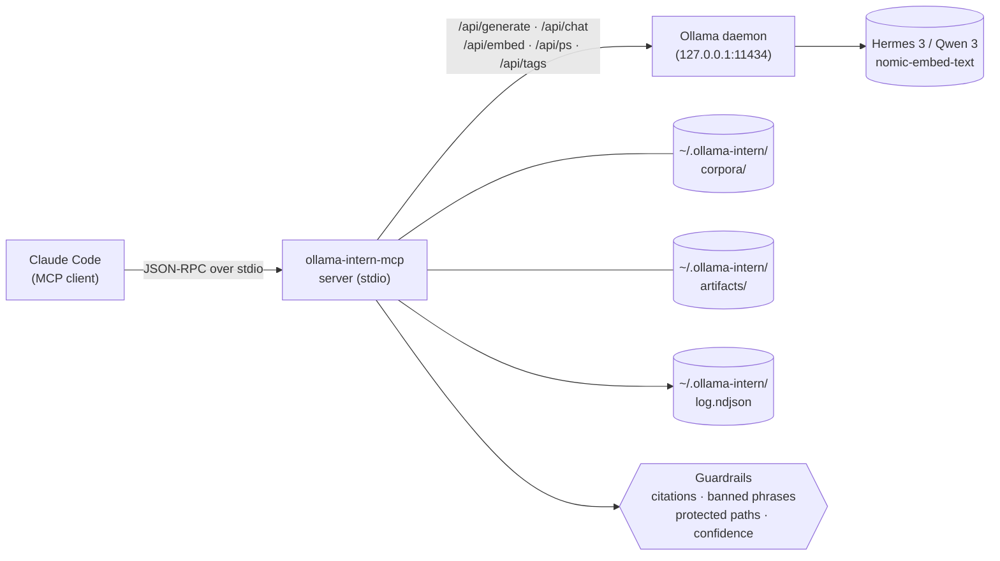

<p align="center">
  <a href="README.ja.md">日本語</a> | <a href="README.zh.md">中文</a> | <a href="README.es.md">Español</a> | <a href="README.md">English</a> | <a href="README.hi.md">हिन्दी</a> | <a href="README.it.md">Italiano</a> | <a href="README.pt-BR.md">Português (BR)</a>
</p>

<p align="center">
  
</p>

<p align="center">
  <a href="https://github.com/mcp-tool-shop-org/ollama-intern-mcp/actions"></a>
  <a href="LICENSE"></a>
  <a href="https://mcp-tool-shop-org.github.io/ollama-intern-mcp/"></a>
  <a href="https://www.npmjs.com/package/ollama-intern-mcp"></a>
  <a href="https://mcp-tool-shop-org.github.io/ollama-intern-mcp/handbook/"></a>
  <a href="#ollama-cloud"></a>
</p>

> **Le stagiaire local pour Claude Code.** <!-- TOOL_COUNT:start -->44<!-- TOOL_COUNT:end --> outils adaptés aux tâches, instructions axées sur les preuves, artefacts durables.

Un serveur MCP qui donne à Claude Code un **stagiaire local** avec des règles, des niveaux, un bureau et une armoire de classement. Claude choisit l'_outil_; l'outil choisit le _niveau_ (Instantané / Polyvalent / Approfondi / Intégré); le niveau crée un fichier que vous pouvez ouvrir la semaine prochaine.

**Il pilote également [Hermes Agent](https://github.com/NousResearch/hermes-agent) sur `hermes3:8b`** — validé de bout en bout le 2026-04-19. L'échelle par défaut est `hermes3:8b`; `qwen3:*` est le rail alternatif. Voir [Utilisation avec Hermes](#use-with-hermes) ci-dessous.

**Configuration matérielle requise :** environ 6 Go de VRAM pour `hermes3:8b`, ou environ 16 Go de RAM pour l’inférence CPU. Voir [handbook/getting-started](https://mcp-tool-shop-org.github.io/ollama-intern-mcp/handbook/getting-started/#hardware-minimums) pour tous les détails.

**Vous n’utilisez pas Claude ?** Le répertoire [`examples/`](./examples/) contient un client MCP minimal en Node.js et en Python que vous pouvez lancer via stdio. Voir également [handbook/with-hermes](https://mcp-tool-shop-org.github.io/ollama-intern-mcp/handbook/with-hermes/).

**Priorité au local** — aucune donnée n’est envoyée sur le réseau tant que vous n’acceptez pas. Pas de télémétrie. Rien d’« autonome ». Chaque appel montre son fonctionnement.

**Pas assez de GPU ? [Ollama Cloud](#ollama-cloud) exécute tous les <!-- TOOL_COUNT:start -->44<!-- TOOL_COUNT:end --> outils sur des modèles de classe 600 milliards de paramètres.** La plupart des gens ne peuvent pas héberger un modèle de pointe sur leur propre carte — c’est la véritable limite de l’IA locale, et c’est ce que cela permet de dépasser. Même surface `/api/*`, mêmes outils adaptés aux tâches, mêmes enveloppes ; les intégrations restent locales ; tout problème avec le cloud revient automatiquement à votre profil local. Augmentez **un** appel (`backend: "cloud"`) ou redirigez chaque appel génératif (`OLLAMA_CLOUD_PRIMARY=1`) — et chaque enveloppe vous indique quel backend l’a réellement traité. Inactif jusqu’à ce que vous définissiez une clé.

---

## Nouveau dans la version 2.10.0

**La version axée sur l’honnêteté du cloud.** La version 2.9.0 a introduit l’escalade des appels vers le cloud et ce fichier README annonçait « l’escalade d’une seule évaluation importante vers un modèle de 600 milliards de paramètres » — mais l’entrée `backend` n’existait que sur **un** des 44 outils, et c’était `ollama_chat`, dont la propre description la qualifie de dernier recours. Chaque tâche de type évaluation était associée à un modèle local de 8 milliards de paramètres. La priorité au local reste inchangée : l’absence de clé signifie toujours aucune donnée envoyée sur le réseau et aucun test de démarrage, les intégrations ne quittent jamais le système, et chaque nouveau paramètre a par défaut le comportement actuel.

- **L’escalade par appel peut désormais atteindre 15 outils, et non plus 1.** `backend: "cloud"` est une entrée facultative sur `research`, `summarize_deep`, `code_review`, `code_citation`, `corpus_answer`, `hypothesis_drill`, `multi_file_refactor_propose`, `refactor_plan`, les trois types d’instructions, les trois types de packs et `chat`. Si vous l’omettez, le comportement est identique à celui de la version 2.9.x. **Les packs n’escaladent que leur étape de synthèse** — l’assemblage des preuves, le tri et l’écriture des artefacts restent locaux — et refusent une escalade impossible *avant* d’effectuer tout travail local.
- **`INTERN_CLOUD_STANDBY_TIERS` — définissez la politique une seule fois.** Indiquez quels niveaux (`instant|workhorse|deep`) doivent être utilisés en cas d’attente sans directive par appel. Vide par défaut. Une directive par appel `backend` a toujours la priorité dans les deux sens. `embed` est refusé lors du chargement de la configuration *et* au niveau du routage : les intégrations restent toujours locales.
- **`doctor --cloud-check` — prouvez que la clé fonctionne réellement.** L’ancien test vérifiait `/api/tags`, qui renvoie 200 pour une clé non valide, de sorte que l’authentification ne pouvait que lire « non vérifié ». Cela exécute une seule génération de 8 jetons et renvoie `ok` / `failed` / `unverified` / `unreachable` — quatre états maintenus distincts à des fins spécifiques, car une erreur 404 sur un ID de modèle n’est pas un problème de clé et ne doit pas vous inciter à en chercher une. Il signale également chaque ID de cloud configuré comme présent ou NON DANS LE CATALOGUE avec une suggestion d’ID actif le plus proche, de sorte qu’un ID retiré est détecté avant que vous ne payiez pour un appel dégradé.
- **Correction : `init` était défectueux à chaque installation npm.** `hermes.config.example.yaml` n’a jamais été inclus dans le fichier tar publié, de sorte que le binaire signalait sa propre erreur de « bug d’empaquetage » à toute personne qui l’installait à partir de npm. Il est maintenant inclus, et l’intégration continue installe et exécute le fichier tar empaqueté afin qu’il ne puisse pas régresser.
- **Les scores de récupération sont enfin comparables.** `CorpusHit.score` contenait quatre échelles incomparables dans un seul champ — le mode hybride par défaut atteignait `0.0328`, tandis que `corpus_min_evidence_score` était documenté comme étant « 0 à 1 », de sorte qu’un seuil naturel de `0.1` supprimait silencieusement chaque bloc de corpus. Les scores fusionnés sont mis à l’échelle sur 0 à 1 et chaque résultat contient `score_scale`.

Tous les détails dans [CHANGELOG.md](./CHANGELOG.md).

## Nouveau dans la version 2.9.0

**La série de fonctionnalités du cloud — une voie de vérification inter-familles, une escalade du cloud à la demande et les avantages économiques pour l’observer.** La priorité au local reste inchangée : sans clé définie, le comportement est identique à celui de la version 2.8.0 (aucune donnée envoyée sur le réseau, pas de test de démarrage du cloud).

- **`ollama_verify_claims` — vérification inter-familles.** `ollama_code_review` *génère* des résultats ; cela *valide* ces résultats. Il exécute un ensemble de modèles phares Ollama Cloud (deepseek / kimi / glm par défaut) sur vos affirmations + preuves, et renvoie pour chaque affirmation CONFIRMÉ / RÉFUTÉ / NÉCESSITE_UNE_EXAMEN. L’agrégation est basée sur le principe selon lequel une seule opposition ne décide pas (≥2 pour réfuter, ≥2 pour confirmer), chaque juré est soumis à une vérification du modèle (un modèle de secours local ou substitué est exclu et n’est pas pris en compte), et les entrées des affirmations sont structurées de manière à supprimer les éléments de raisonnement. Le seuil de fiabilité est documenté : un résultat CONFIRMÉ est une preuve à l’appui, et non une preuve définitive — il est fiable pour signaler les erreurs flagrantes, mais moins efficace pour détecter les subtilités d’un modèle de pointe.
- **Escalade par appel vers le cloud + mode veille.** Définissez `OLLAMA_API_KEY` *seul* (sans `OLLAMA_CLOUD_PRIMARY`) et vous êtes en **mode veille** : modèle local principal, pas de transfert de données, pas de sonde de démarrage, jusqu’à ce qu’un seul appel opte pour `backend:'cloud'`. Faites passer une évaluation à haut risque à un modèle de 600 milliards de paramètres sans modifier tous les appels pour qu’ils utilisent le cloud. La première escalade signale clairement le transfert de données au moment où il se produit ; une substitution `model` par appel est désormais appliquée à la tentative de connexion au cloud.
- **`ollama_log_stats` — les avantages économiques mesurables promis par le slogan.** Un résumé sans LLM de vos reçus NDJSON : répartition cloud/local, taux de repli cloud→local, nombre de jetons par outil, p50/p95 de latence, limité par une fenêtre `since`.
- **Outil de diagnostic pour CI + outils lisibles par machine.** `doctor --json --fail-unhealthy` donne aux pipelines une véritable porte d’entrée (avec un indicateur `healthy` prenant en compte le cloud), et chaque outil comporte désormais des annotations MCP `readOnlyHint`/`destructiveHint`/`title` afin que les clients obtiennent une expérience utilisateur de permission correcte. De plus, `init --claude` crée une structure prête à être collée `.mcp.json`.

Tous les détails dans [CHANGELOG.md](./CHANGELOG.md).

## Nouveauté dans la version 2.8.0

**Amélioration de la fiabilité, de la durabilité et de la sécurité — 25 corrections, chacune étant testée en premier et vérifiée entre les familles.** Le comportement privilégiant le local reste inchangé et aucun contrat d’outil n’a été supprimé ; les appelants existants continuent de fonctionner. Les avantages sont importants :

- **Plus de perte silencieuse de données du corpus.** Une erreur de lecture transitoire pendant `ollama_corpus_refresh` (un verrouillage de fichier Windows, une restriction antivirus, une fenêtre d’enregistrement d’un éditeur) classifiait auparavant le fichier comme « manquant » et **supprimait définitivement son contenu indexé**. Désormais, seul un fichier réellement absent est supprimé ; une erreur transitoire conserve le chemin, signale qu’il faut réessayer et conserve ses fragments.
- **Concurrence qui respecte ses budgets.** Un délai d’expiration de niveau peut désormais annuler un appel qui est toujours en attente d’un permis (il se bloquait auparavant bien au-delà du budget, alors que les reçus en indiquaient le contraire), et `ollama_chat` achemine enfin les requêtes à travers la limite de délai d’expiration/niveau, de sorte qu’une génération locale bloquée ne puisse pas paralyser tous les outils, et qu’elle atteigne réellement le cloud en mode cloud principal.
- **Cloud qui se dégrade au lieu de s’arrêter.** Un ID de modèle cloud retiré revient désormais au local avec une raison claire `cloud_model_missing` et une indication spécifique au cloud au lieu d’une panne totale ; le disjoncteur ne peut pas se bloquer définitivement ; un modèle manquant de manière persistante cesse de générer des requêtes vers le cloud pour chaque appel.
- **Surface de sécurité qui correspond à sa documentation.** `ollama_batch_proof_check` applique désormais réellement le confinement du répertoire de travail (avec une nouvelle limite d’environnement opérateur `INTERN_BATCH_PROOF_ALLOWED_ROOTS` qu’un appelant ne peut pas étendre), les filtres de désinfection contre l’injection de requêtes ont gagné en couverture et présentent un seuil honnêtement divulgué, et la protection du chemin est insensible à la casse sous macOS.
- **Artefacts et reçus honnêtes.** Les écritures de paquets sont atomiques et ne se corrompent jamais silencieusement ; les enveloppes de lots dégradées indiquent le niveau réellement utilisé ; le détecteur d’écriture interrompue détecte les écritures incomplètes sur toute mutation ; les ID de fragments ne se chevauchent plus entre les fichiers ayant un contenu identique. L’audit des dépendances est entièrement clair (0 vulnérabilités).

Tous les détails dans [CHANGELOG.md](./CHANGELOG.md).

## Nouveauté dans la version 2.7.0

**Routage optionnel vers Ollama Cloud — cloud principal, repli local.** Activez-le avec une clé + un indicateur, et les niveaux génératifs acheminent les requêtes vers un modèle cloud de 600 milliards de paramètres ; les intégrations restent locales ; un disjoncteur revient à votre profil local en cas de panne du cloud. **Désactivé par défaut — aucun transfert de données sauf si vous définissez à la fois `OLLAMA_API_KEY` et `OLLAMA_CLOUD_PRIMARY=1`.** Amélioration mineure additive — les appelants antérieurs à la version 2.7.0 (et ceux qui n’activent pas cette fonctionnalité) conservent le même comportement. Voir [Ollama Cloud](#ollama-cloud).

- **Cloud principal avec une sécurité.** Un `RoutingOllamaClient` tente d’abord d’utiliser le cloud, puis revient au profil local en cas de délai d’expiration / 5xx / 429 / problème de réseau. Les clés incorrectes (401/403) sont signalées de manière claire via un disjoncteur persistant au lieu de se dégrader silencieusement à jamais ; un ID de modèle cloud retiré ou mal orthographié (404) est également signalé.
- **Plus jamais de rétrogradation silencieuse.** Chaque enveloppe reçoit `backend` (`cloud`|`local`), `degraded` et `degrade_reason`, de sorte que vous savez toujours quand vous avez obtenu le modèle local au lieu du modèle principal. Un événement NDJSON `backend_fallback` rend le taux de repli cloud→local visible dans `ollama_log_tail`.
- **`ollama_doctor` signale l’authentification et la connectivité au cloud** sous forme d’un bloc distinct ; `ollama-intern-mcp doctor` affiche une section `Cloud (primary)`.
- Le modèle cloud par défaut était `minimax-m3:cloud` lors de la sortie de la version 2.7.0 *(puis il a été réaffecté à `qwen3-coder-next:cloud` — un modèle par défaut plus réfléchi renvoyait des réponses vides sur les outils à `num_predict` limité ; voir le [tableau des variables d’environnement](#cloud-env-vars)) ; remplacez-le par niveau avec `INTERN_CLOUD_MODEL` / `INTERN_CLOUD_DEEP_MODEL`.

## Nouveauté dans la version 2.6.0

Substitution du budget de niveau par appel sur `ollama_extract`. Amélioration mineure additive — les appelants antérieurs à la version 2.6.0 restent inchangés. Entrée détaillée dans [CHANGELOG.md](./CHANGELOG.md).

- **`tier_budget_ms_override?: number` schema field on `ollama_extract`** (optional, bounded `[1, 600000]` ms). When present, applies the override to every tier visited by the runner so the inner `runWithTimeoutAndFallback` machinery at `src/guardrails/timeouts.ts:61` honors the operator-supplied budget instead of the profile default. The cascade (workhorse → instant on timeout) still fires; the override governs each cascade hop uniformly.
- **Why this exists.** The research-os R-018 wrapper (v0.12.1) wrapped MCP `callTool` with `Promise.race` and found the wrapper's budget did not reach the inner tier — `DEV_RTX5080_TIMEOUTS.instant = 15_000` continued to fire `TIER_TIMEOUT` at 15000ms regardless of a 180000ms wrapper budget. v2.6.0 supplies the MCP-side authoritative budget so the operator's `--planner-timeout-ms` flag (research-os) finally controls inner-tier timeouts as designed.
- **Default behavior preserved.** Field omitted = profile defaults govern byte-identically. Pre-v2.6.0 callers see zero change.
- **R-010 fallback-cause regex preserved.** Server-side `TIER_TIMEOUT` error message still matches `/elapsed=(\d+)ms/` + `/budget=(\d+)ms/` so AI-advisor visibility downstream works on override and default paths alike.
- Consumed by research-os v0.13.0 (cumulative R-019 client wire-up + R-020 + R-021) in a coordinated multi-repo release.

### Historique — livrables de la version 2.4.0

Voir [CHANGELOG.md](./CHANGELOG.md) et [docs/release-notes/v2.4.0.md](./docs/release-notes/v2.4.0.md) pour l’entrée complète de la version 2.4.0 (contrôle par niveau `num_ctx` sur le système de profil).

## Nouveauté de la version 2.4.0

Contrôle par niveau `num_ctx` (fenêtre de contexte) sur le système de profil. Amélioration mineure additive — les appelants de la version 2.3.0 ne sont pas affectés. Entrées détaillées dans [CHANGELOG.md](./CHANGELOG.md) et [docs/release-notes/v2.4.0.md](./docs/release-notes/v2.4.0.md).

- **Mappage `TierConfig.num_ctx` (nouveau)** — `{ instant?, workhorse?, deep?, embed? }` facultatif sur le profil. Lorsqu’il est défini pour un niveau, le serveur MCP place `options.num_ctx = <value>` sur chaque requête Ollama generate/chat acheminée vers ce niveau (initiale + de repli). Lorsqu’il n’est pas défini, la requête omet complètement `num_ctx`, de sorte qu’Ollama utilise sa valeur par défaut chargée avec le modèle — le comportement de la version 2.3.0 est conservé exactement.
- **Nouveau champ d’enveloppe `num_ctx_used?: number`** — présent uniquement lorsque le serveur MCP a effectivement envoyé `num_ctx`. Absent lorsque la requête a permis à Ollama de choisir. Ne pas déduire de valeur par défaut — le serveur MCP n’interroge pas Ollama pour obtenir la valeur effective.
- **Valeurs par défaut du profil :** `dev-rtx5080` / `dev-rtx5080-qwen3` sont fournis avec `instant: 4096`, `workhorse: 8192`, `deep`/`embed` NON DÉFINI. Dimensionnés pour maintenir `hermes3:8b` en mémoire résidente dans le budget de 16 Go de VRAM de la RTX 5080 pour des outils rapides. `m5-max` laisse chaque niveau NON DÉFINI — la mémoire unifiée de 128 Go ne pose aucun problème de dépassement.
- **Résout le diagnostic de la phase 1 de la version 0.8.0** — `hermes3:8b` avec le contexte par défaut de 32  000 sur la RTX 5080 a débordé vers le CPU et a commencé à provoquer le dépassement du temps imparti pour les appels du moteur principal `ollama_extract`. La version 2.4.0 empêche cela au niveau du profil.

### Contrôle par niveau `num_ctx` (nouveau dans la version 2.4.0)

Profil (extrait de `src/profiles.ts`) :

```ts
"dev-rtx5080": {
  tiers: {
    instant: "hermes3:8b",
    workhorse: "hermes3:8b",
    deep: "hermes3:8b",
    embed: "nomic-embed-text",
    num_ctx: {
      instant: 4096,    // fast classify/summarize
      workhorse: 8192,  // schema-bound extract / batch
      // deep: UNSET — long-context briefs keep current behavior
      // embed: UNSET — no context-window pressure on embed
    },
  },
  // ... timeouts, prewarm
}
```

Enveloppe lors d’un appel au niveau du moteur principal (par exemple, `ollama_extract`) :

```jsonc
{
  "result": { /* extracted data */ },
  "tier_used": "workhorse",
  "model": "hermes3:8b",
  "num_ctx_used": 8192,        // present because the profile set workhorse=8192
  // ... rest of envelope unchanged
}
```

Sur `m5-max` (ou tout profil qui laisse un niveau non défini), `num_ctx_used` est absent de l’enveloppe et la requête transmise à Ollama n’inclut pas le champ `num_ctx` — Ollama utilise sa valeur par défaut chargée avec le modèle.

Les opérateurs ajustent en sélectionnant/modifiant le profil ; il n’y a pas d’entrée `num_ctx` par appel sur les schémas d’outils. Si une demande ultérieure révèle la nécessité, le modèle suit la substitution `model` de la version 2.3.0.

### Historique — livrables de la version 2.3.0

Voir [CHANGELOG.md](./CHANGELOG.md) et [docs/release-notes/v2.3.0.md](./docs/release-notes/v2.3.0.md) pour l’entrée complète de la version 2.3.0 (substitution du modèle par appel).

## Nouveauté de la version 2.3.0

Substitution du modèle par appel dans tous les outils atomiques basés sur un LLM. Amélioration mineure additive — les appelants de la version 2.2.0 ne sont pas affectés. Entrées détaillées dans [CHANGELOG.md](./CHANGELOG.md) et [docs/release-notes/v2.3.0.md](./docs/release-notes/v2.3.0.md).

- **Entrée `model: string` facultative sur 8 outils atomiques** — `ollama_extract`, `ollama_classify`, `ollama_summarize_fast`, `ollama_summarize_deep`, `ollama_research`, `ollama_corpus_answer`, `ollama_chat`, `ollama_code_citation`. La première tentative sur le niveau de l’outil s’effectue avec le modèle spécifié par l’appelant ; en cas de dépassement du temps imparti, la cascade `TIER_FALLBACK` existante résout le modèle du niveau moins coûteux (et non la substitution de l’appelant). Les outils composites/rapides/de regroupement n’acceptent délibérément PAS `model` — les outils atomiques bénéficient d’un contrôle par appel, les outils composites utilisent les valeurs par défaut du niveau.
- **Nouveau champ d’enveloppe `model_requested?: string`** — présent uniquement lorsque la substitution a été fournie. Les appelants conscients de l’étalonnage comparent `model_requested` à `model` pour détecter la substitution de repli : `if (env.model_requested && env.model !== env.model_requested) { /* substitution */ }`. Les entrées vides ou contenant uniquement des espaces provoquent une erreur `ZodError` lors de l’analyse du schéma, et non une substitution silencieuse.
- **Correction de bug — dérive `src/version.ts`.** La constante d’exécution `VERSION` est désormais lue à partir de `package.json` lors du chargement du module ; les versions 2.1.0 et 2.2.0 ont été publiées en indiquant la chaîne d’identité obsolète `"2.0.0"`. La nouvelle valeur `tests/version.test.ts` verrouille `VERSION === pkg.version`.

### Substitution du modèle par appel (nouveau dans la version 2.3.0)

```jsonc
{
  "tool": "ollama_classify",
  "arguments": {
    "text": "patch null pointer in auth",
    "labels": ["feat", "fix", "chore"],
    "frame": "what is the change kind?",
    "model": "hermes3:8b"
  }
}
```

Enveloppe :

```jsonc
{
  "result": { "label": "fix", "confidence": 0.9, "off_topic": false, ... },
  "tier_used": "instant",
  "model": "hermes3:8b",
  "model_requested": "hermes3:8b",       // present because override was supplied
  // ... rest of envelope unchanged
}
```

Si le niveau du moteur principal ou du niveau profond avait dépassé le temps imparti et que l’appel avait basculé vers le niveau instantané, `env.model` serait le modèle résolu du niveau instantané et `env.fallback_from` serait `"workhorse"` — `env.model_requested` serait toujours `"hermes3:8b"`, et `env.model !== env.model_requested` est le signal de substitution. La substitution n’est délibérément PAS transmise au niveau moins coûteux ; le modèle choisi peut ne pas convenir au rôle de ce niveau.

### Historique — livrables de la version 2.2.0

Voir [CHANGELOG.md](./CHANGELOG.md) et [docs/release-notes/v2.2.0.md](./docs/release-notes/v2.2.0.md) pour l’entrée complète de la version 2.2.0 (pertinence limitée dans le temps + abstention structurée).

## Nouveauté de la version 2.2.0

Contrat de rôle de l’outil d’inférence local : pertinence limitée dans le temps et abstention structurée. Amélioration mineure additive — les appelants de la version 2.1.0 ne sont pas affectés. Entrées détaillées dans [CHANGELOG.md](./CHANGELOG.md) et [docs/release-notes/v2.2.0.md](./docs/release-notes/v2.2.0.md).

- **Extraction limitée au cadre** sur `ollama_extract`, `ollama_classify`, `ollama_summarize_fast`, `ollama_summarize_deep` — entrée `frame: string` facultative + sorties structurées `frame_alignment` / `on_topic` / `frame_addressed`. Les sources hors sujet sont signalées au lieu d’être paraphrasées dans le schéma.
- **Abstention structurée** sur `ollama_research` — champs `weak` / `abstained` / `sources_address_question`. Un `citations[]` vide avec un `answer` non vide n’est plus considéré comme un succès silencieux.
- **Seuil de pertinence** sur `ollama_corpus_answer` — `min_top_score` facultatif. En dessous du seuil, l’outil interrompt le processus avec `abstained: true` et saute l’étape de synthèse. La pertinence par citation `score` est désormais visible pour chaque citation.
- **Préservation du score de récupération** grâce à des preuves succinctes — `corpusHitsToEvidence` contient `score` (et les filtres de paramètres `corpus_min_evidence_score` lors de l’assemblage sur `incident_brief` / `repo_brief` / `change_brief`).
- **Limites de plage de lignes de citation** — `guardrails/citations.ts` rejette les plages hors limites sur `ollama_research`, ce qui correspond à la posture existante sur `ollama_code_citation`.
- **Documents de contrat de l’opérateur corrigés** — correction du fichier README `chunk_id`/`chunk_index`, reformulation de la mention « validé côté serveur », qualification de la section sur les lois relatives aux preuves, annotation du slogan marketing.

### Régression de la base

Le contrat de la tranche est vérifié par rapport à l’échec littéral de la version « fresh-pack » de research-os : arxiv 2112.10422 (Cosmological Standard Timers) dans le cadre 01 intitulé « Que signifie la gestion des preuves dans les flux de travail de recherche approfondie basés sur le cloud et locaux ? » — 9 / 9 tests de contrat LLM simulés confirment que la source hors sujet est désormais contenue (`frame_alignment.on_topic = false` pour l’extraction ; `off_topic: true` pour la classification ; `frame_addressed: false` pour le résumé approfondi ; `abstained: true` pour la réponse au corpus avec `min_top_score` défini).

### Historique — livrables de la v2.1.0

Consultez le fichier [CHANGELOG.md](./CHANGELOG.md) pour obtenir la description complète de la v2.1.0 (validation des fonctionnalités : 13 nouveaux outils + 4 améliorations + suppression des restrictions).

---

## Architecture en bref


```mermaid
flowchart LR
  Claude["Claude Code<br/>(MCP client)"]
  MCP["ollama-intern-mcp<br/>server (stdio)"]
  Ollama["Ollama daemon<br/>(127.0.0.1:11434)"]
  Models[("Hermes 3 / Qwen 3<br/>nomic-embed-text")]
  Corpus[("~/.ollama-intern/<br/>corpora/")]
  Artifacts[("~/.ollama-intern/<br/>artifacts/")]
  NDJSON[("~/.ollama-intern/<br/>log.ndjson")]
  Guards{{"Guardrails<br/>citations · banned phrases<br/>protected paths · confidence"}}

  Claude -- "JSON-RPC over stdio" --> MCP
  MCP --> Guards
  MCP -- "/api/generate · /api/chat<br/>/api/embed · /api/ps · /api/tags" --> Ollama
  Ollama --> Models
  MCP --- Corpus
  MCP --- Artifacts
  MCP --> NDJSON
```

Chaque appel d’outil Claude entre dans le serveur MCP via JSON-RPC sur stdio. Le serveur valide l’appel par rapport au schéma [zod](https://zod.dev) de l’outil, exécute les garde-fous configurés (validation des citations, suppression des phrases interdites, application des chemins protégés, seuils de confiance), puis redirige vers un moteur de rendu déterministe (niveau artefact) ou un appel HTTP Ollama (pour tous les autres niveaux). Le démon Ollama n’a jamais accès aux chemins fournis par l’utilisateur — seul le niveau du modèle et l’invite préparée. Chaque appel ajoute un événement structuré au journal NDJSON à l’adresse `~/.ollama-intern/log.ndjson`, où `ollama_log_tail` et votre shell peuvent le lire.

---

## Exemple principal — un appel, un artefact

```jsonc
// Claude → ollama-intern-mcp
{
  "tool": "ollama_incident_pack",
  "arguments": {
    "title": "sprite pipeline 5 AM paging regression",
    "logs": "[2026-04-16 05:07] worker-3 OOM killed\n[2026-04-16 05:07] ollama /api/ps reports evicted=true size=8.1GB\n...",
    "source_paths": ["F:/AI/sprite-foundry/src/worker.ts", "memory/sprite-foundry-visual-mastery.md"]
  }
}
```

Renvoie une enveloppe pointant vers un fichier sur le disque :

```jsonc
{
  "result": {
    "pack": "incident",
    "slug": "2026-04-16-sprite-pipeline-5-am-paging-regression",
    "artifact_md":   "~/.ollama-intern/artifacts/incident/2026-04-16-sprite-pipeline-5-am-paging-regression.md",
    "artifact_json": "~/.ollama-intern/artifacts/incident/2026-04-16-sprite-pipeline-5-am-paging-regression.json",
    "weak": false,
    "evidence_count": 6,
    "next_checks": ["residency.evicted across last 24h", "OLLAMA_MAX_LOADED_MODELS vs loaded size"]
  },
  "tier_used": "deep",
  "model": "hermes3:8b",
  "hardware_profile": "dev-rtx5080",
  "tokens_in": 4180, "tokens_out": 612,
  "elapsed_ms": 8410,
  "residency": { "in_vram": true, "evicted": false }
}
```

→ `weak: false` signifie qu’au moins 2 éléments de preuve ont été assemblés ; cela ne signifie PAS que les hypothèses ont été vérifiées. Voir les [lois relatives aux preuves](#evidence-laws) ci-dessous.

Ce fichier Markdown est le résultat du travail de l’interne — titres, bloc de preuves avec identifiants de citation, `next_checks` d’investigation, `weak: true` si les preuves sont limitées. Il est déterministe : le moteur de rendu est un code, et non une invite. (Le moteur de rendu est déterministe ; le *contenu* des hypothèses et des surfaces est génératif — considérez-les comme des brouillons, et non comme des éléments vérifiés.) Ouvrez-le demain, comparez-le la semaine prochaine, exportez-le dans un manuel avec `ollama_artifact_export_to_path`.

Tous les concurrents de cette catégorie mettent en avant « économiser des jetons ». Nous mettons en avant « voici le fichier que l’interne a écrit ».

### Deuxième exemple — créer un corpus, puis le questionner

```jsonc
// 1. Build a persistent, searchable corpus over your project.
{ "tool": "ollama_corpus_index",
  "arguments": { "name": "sprite-foundry",
                 "paths": ["F:/AI/sprite-foundry/src"],
                 "embed_model": "nomic-embed-text" } }
// → { chunks_written: 1204, paths_indexed: 312, failed_paths: [] }

// 2. Ask an evidence-bound question against it.
{ "tool": "ollama_corpus_answer",
  "arguments": { "name": "sprite-foundry",
                 "query": "how does the worker handle OOM eviction?",
                 "top_k": 8 } }
// → { answer: "...", citations: [{chunk_index, path}...], weak: false }
```

Le serveur valide l’identité de la citation et que chaque `chunk_index` se situe dans la plage des résultats récupérés. Il ne prouve PAS que chaque affirmation générée est sémantiquement étayée par le contenu du fragment cité — c’est la responsabilité du modèle, et une récupération médiocre peut toujours produire des réponses qui ressemblent à des citations. Explication complète dans [handbook/corpora](https://mcp-tool-shop-org.github.io/ollama-intern-mcp/handbook/corpora/).

---

## Extraction limitée au cadre (nouveau dans la v2.2.0)

`ollama_extract`, `ollama_classify`, `ollama_summarize_fast` et `ollama_summarize_deep` acceptent une entrée `frame: string` facultative. Le cadre définit la question à laquelle la source est invitée à répondre ; le modèle est invité à s’abstenir plutôt qu’à produire un contenu vrai mais hors sujet lorsque la source n’aborde pas le cadre.

```jsonc
{
  "tool": "ollama_extract",
  "arguments": {
    "text": "<long source document>",
    "schema": { /* your fields */ },
    "frame": "section purpose here — e.g. 'OOM eviction behavior in the sprite worker'"
  }
}
// → result includes frame_alignment: { on_topic: boolean, reason: string, unaddressed_aspects: string[] }
```

Si `frame` est omis, le comportement ne change pas par rapport à la v2.1.0. Lorsqu’il est fourni, `frame_alignment.on_topic = false` indique que les champs extraits peuvent être valables pour la source, mais pas pertinents pour le cadre — traitez cela de la même manière qu’un bref `weak: true` : utile, mais vérifiez-le avant de l’intégrer dans les preuves en aval.

---

## Contrat d’abstention (nouveau dans la v2.2.0)

`ollama_research` renvoie des champs d’abstention structurés : `weak: boolean`, `abstained: boolean`, `sources_address_question: boolean | null`. Un `citations[]` vide avec un `answer` non vide n’est plus considéré comme un succès — `abstained: true` indique que le modèle a refusé de synthétiser parce que les chemins fournis par l’appelant n’abordaient pas la question. Considérez l’abstention comme un succès, et non comme un échec : c’est l’outil qui refuse de transformer une récupération médiocre en une sortie faisant autorité.

`ollama_corpus_answer` accepte un seuil de pertinence `min_top_score: number` facultatif (de 0,0 à 1,0). Lorsque le score de récupération le plus élevé pour une requête tombe en dessous de `min_top_score`, l’outil interrompt le processus avec `abstained: true` et saute l’étape de synthèse — ce qui empêche le mode d’échec « 5 fragments hors sujet avec un score de 0,21 génèrent toujours une réponse complète » que la règle de la v2.1.0 `weak: true` ne détectait pas (`weak: true` ne se déclenchait que sur `hits.length < 2`). Associez cela au champ de pertinence par citation `score` nouvellement affiché pour chaque citation afin d’auditer directement la qualité de la récupération à partir de l’enveloppe.

---

## Ce qui s’y trouve — quatre niveaux, <!-- TOOL_COUNT:start -->44<!-- TOOL_COUNT:end --> outils

**Adapté à un travail** signifie que chaque outil définit un travail que vous confieriez à un stagiaire — classer ceci, extraire cela, trier ces journaux, rédiger cette note de version, regrouper cet incident. L’entrée de l’outil est la spécification du travail ; la sortie est le résultat. Pas de primitive générique `run_model` / `chat_with_llm` en haut.

| Niveau | Nombre | Ce qui s’y trouve |
|---|---|---|
| **Atoms** | 31 | Primitives adaptées aux tâches. **Original 15 :** `classify`, `extract`, `triage_logs`, `summarize_fast` / `deep`, `draft`, `research`, `corpus_search` / `answer` / `index` / `refresh` / `list`, `embed_search`, `embed`, `chat`. **+13 ajoutés dans la version 2.1.0 :** `doctor`, `log_tail`, `batch_proof_check` (opérations) ; `code_map`, `code_citation`, `multi_file_refactor_propose`, `refactor_plan` (refactorisation) ; `artifact_prune`, `hypothesis_drill` (artefact/bref) ; `corpus_health`, `corpus_amend`, `corpus_amend_history`, `corpus_rerank` (corpus). **+1 atome pour l’évaluation :** `code_review` (résultats structurés de l’évaluation des demandes d’amélioration, outil principal ; évaluation uniquement). **+2 dans la version 2.9 :** `verify_claims` (un groupe d’experts de chaque famille évalue les revendications sur le cloud ; nécessite le cloud) et `log_stats` (agrège les reçus NDJSON en données économiques mesurables : répartition cloud/local, taux de repli, p50/p95 par outil ; aucun appel de modèle). Les atomes capables de traiter des lots (`classify`, `extract`, `triage_logs`) acceptent `items: [{id, text}]`. |
| **Briefs** | 3 | Brefs structurés basés sur des preuves. `incident_brief`, `repo_brief`, `change_brief`. Chaque revendication cite un identifiant de preuve ; les éléments inconnus sont supprimés côté serveur. Les preuves faibles mettent en évidence `weak: true` plutôt qu’un récit fictif. |
| **Packs** | 3 | Tâches composées à pipeline fixe qui écrivent des données Markdown et JSON durables dans `~/.ollama-intern/artifacts/`. `incident_pack`, `repo_pack`, `change_pack`. Générateurs déterministes : aucun appel de modèle sur la forme de l’artefact. |
| **Artifacts** | 7 | Surface de continuité sur les résultats du paquet. `artifact_list` / `read` / `diff` / `export_to_path`, plus trois extraits déterministes : `incident_note`, `onboarding_section`, `release_note`. |

Total : **31 atomes + 3 brefs + 3 paquets + 7 outils d’artefact = <!-- TOOL_COUNT:start -->44<!-- TOOL_COUNT:end -->**.

Lignes figées :
- Atomes : figés **à partir de la version 2.1.0** (31 aujourd’hui ; +13 ajoutés dans la version 2.1.0, +1 `code_review` plus tard, +2 dans la version 2.9 : `verify_claims`, `log_stats`). Les nouveaux atomes nécessitent toujours une justification basée sur une évaluation, des tests, une page du manuel et une entrée dans le journal des modifications : aucun ajout occasionnel.
- Paquets figés à 3. Aucun nouveau type de paquet.
- Niveau d’artefact figé à 7.

La référence complète des outils se trouve dans le [manuel](https://mcp-tool-shop-org.github.io/ollama-intern-mcp/handbook/tools/).

---

## Installation

Nécessite [Ollama](https://ollama.com) en cours d’exécution localement et les modèles du niveau téléchargés (voir [Téléchargement des modèles](#model-pulls) ci-dessous).

### Claude Code (recommandé)

La plupart des utilisateurs l’installent en l’ajoutant à la configuration de leur serveur Claude Code MCP : aucune installation globale n’est requise. Claude Code exécute le serveur à la demande via `npx` :

```json
{
  "mcpServers": {
    "ollama-intern": {
      "command": "npx",
      "args": ["-y", "ollama-intern-mcp"],
      "env": {
        "OLLAMA_HOST": "http://127.0.0.1:11434",
        "INTERN_PROFILE": "dev-rtx5080"
      }
    }
  }
}
```

### Claude Desktop

Même bloc, écrit dans `~/Library/Application Support/Claude/claude_desktop_config.json` (macOS) ou `%APPDATA%\Claude\claude_desktop_config.json` (Windows).

### Installation globale (avancée)

N’est nécessaire que si vous souhaitez que le binaire se trouve dans votre `PATH` pour une utilisation ponctuelle en dehors de Claude Code :

```bash
npm install -g ollama-intern-mcp
```

### Utilisation avec Hermes

Ce MCP a été validé de bout en bout avec [Hermes Agent](https://github.com/NousResearch/hermes-agent) par rapport à `hermes3:8b` sur Ollama (2026-04-19). Hermes est un agent externe qui *appelle* la surface primitive figée de ce MCP : il effectue la planification, nous effectuons le travail.

Configuration de référence ([hermes.config.example.yaml](hermes.config.example.yaml) dans ce dépôt) :

```yaml
model:
  provider: custom
  base_url: http://localhost:11434/v1
  default: hermes3:8b
  context_length: 65536    # Hermes requires 64K floor under model.*

providers:
  local-ollama:
    name: local-ollama
    base_url: http://localhost:11434/v1
    api_mode: openai_chat
    api_key: ollama
    model: hermes3:8b

mcp_servers:
  ollama-intern:
    command: npx
    args: ["-y", "ollama-intern-mcp"]
    env:
      OLLAMA_HOST: http://localhost:11434
      INTERN_PROFILE: dev-rtx5080
      # hermes3:8b is the default ladder in v2.0.0, so tier overrides are
      # only needed if you're pinning a different local model.
```

**La forme de l’invite est importante.** Les invites impératives d’invocation d’outils (« Appeler X avec les arguments… ») constituent le test d’intégration : elles fournissent à un modèle local de 8 milliards de paramètres suffisamment d’éléments pour générer un `tool_calls` propre. Les invites multitâches sous forme de liste (« faire A, puis B, puis C ») sont des références de capacité pour les modèles plus volumineux ; ne considérez pas un échec d’une invite sous forme de liste sur un modèle de 8 milliards de paramètres comme signifiant que « le câblage est défectueux ». Voir [handbook/with-hermes](https://mcp-tool-shop-org.github.io/ollama-intern-mcp/handbook/with-hermes/) pour l’intégralité du processus d’intégration et les mises en garde connues concernant le transport (Ollama `/v1` en streaming + shim non en streaming d’openai-SDK).

### Téléchargement des modèles

**Profil de développement par défaut (RTX 5080 16 Go et modèles similaires) :**

```bash
ollama pull hermes3:8b
ollama pull nomic-embed-text
export OLLAMA_MAX_LOADED_MODELS=2
```

**Rail alternatif Qwen 3 (même matériel, pour les outils Qwen) :**

```bash
ollama pull qwen3:8b
ollama pull qwen3:14b
ollama pull nomic-embed-text
export INTERN_PROFILE=dev-rtx5080-qwen3
```

**Profil M5 Max (128 Go de mémoire unifiée) :**

```bash
ollama pull qwen3:14b
ollama pull qwen3:32b
ollama pull nomic-embed-text
export INTERN_PROFILE=m5-max
```

Les variables d’environnement par niveau (`INTERN_TIER_INSTANT`, `INTERN_TIER_WORKHORSE`, `INTERN_TIER_DEEP`, `INTERN_EMBED_MODEL`) remplacent toujours les choix du profil pour les cas ponctuels.

**Résidence.** Sur les profils de développement, le serveur préchauffe le modèle Instant au démarrage avec une valeur **limitée** de `keep_alive` (10 minutes) afin que le premier appel ne soit jamais froid ; après tout appel réel, l’éviction au ralenti d’Ollama (par défaut 5 minutes après la dernière requête) s’applique. Définissez `INTERN_PREWARM=off` pour ignorer complètement le préchauffage au démarrage : c’est le mode approprié lorsque le GPU est partagé avec la formation ou le rendu : les modèles se chargent lors de la première utilisation et se désactivent au ralenti par eux-mêmes. L’augmentation de `OLLAMA_KEEP_ALIVE` est destinée aux boîtiers dédiés à Ollama ; `-1` fixe chaque modèle utilisé dans la mémoire VRAM jusqu’au redémarrage du serveur.

---

## Enveloppe uniforme

Chaque outil renvoie la même forme :

```ts
{
  result: <tool-specific>,
  tier_used: "instant" | "workhorse" | "deep" | "embed",
  model: string,
  hardware_profile: string,     // "dev-rtx5080" | "dev-rtx5080-qwen3" | "m5-max"
  tokens_in: number,
  tokens_out: number,
  elapsed_ms: number,
  residency: {
    in_vram: boolean,
    size_bytes: number,
    size_vram_bytes: number,
    evicted: boolean
  } | null
}
```

`residency` provient de `/api/ps` d’Ollama. Lorsque `evicted: true` ou `size_vram < size`, le modèle est paginé sur le disque et l’inférence diminue de 5 à 10 fois : affichez ces informations à l’utilisateur afin qu’il sache qu’il doit redémarrer Ollama ou réduire le nombre de modèles chargés.

Dans le mode [Ollama Cloud](#ollama-cloud), l’enveloppe contient également `backend` (`"cloud"` | `"local"`) et, en cas de repli cloud→local, `degraded: true` + `degrade_reason`. Ces champs sont **absents** dans le chemin local par défaut, de sorte que les consommateurs existants ne sont pas affectés. `residency` est `null` pour les appels servis par le cloud (le cloud sans état n’a pas de résidence en mémoire VRAM locale).

Chaque appel est enregistré sous forme d’une ligne NDJSON dans `~/.ollama-intern/log.ndjson`. Filtrez par `hardware_profile` pour exclure les chiffres de développement des références publiables.

---

## Profils matériels

| Profil | Instant | Principal | Approfondi | Intégré |
|---|---|---|---|---|
| **`dev-rtx5080`** (par défaut) | hermes3 8B | hermes3 8B | hermes3 8B | nomic-embed-text |
| `dev-rtx5080-qwen3` | qwen3 8B | qwen3 8B | qwen3 14B | nomic-embed-text |
| `m5-max` | qwen3 14B | qwen3 14B | qwen3 32B | nomic-embed-text |

Le **profil de développement par défaut** regroupe les trois niveaux de travail en `hermes3:8b` : il s’agit du chemin d’intégration validé avec Hermes Agent. Le fait d’avoir le même modèle de haut en bas signifie qu’il n’y a qu’une seule chose à télécharger, un seul coût de résidence et un seul ensemble de comportements à comprendre. Les utilisateurs qui préfèrent Qwen 3 (avec son `THINK_BY_SHAPE`) peuvent opter pour `dev-rtx5080-qwen3`. `m5-max` est l’échelle Qwen 3 dimensionnée pour la mémoire unifiée.

---

## Ollama Cloud

**La limite matérielle est levée.** La plupart des machines peuvent gérer un modèle local de 8 milliards de paramètres, et c’est ce qui constitue le principal obstacle pour presque tous les utilisateurs : ce n’est pas le budget, ni l’intérêt, mais la VRAM. [Ollama Cloud](https://ollama.com/cloud) prend en charge des modèles de 600 milliards de paramètres derrière la **même** `/api/*` interface, de sorte que les outils les plus performants fonctionnent sur un modèle de pointe et que votre VRAM est libérée pour d’autres tâches. Le mode local reste une option de secours toujours disponible, vous bénéficiez donc d’une amélioration sans perdre les performances de base.

Rien ne change au niveau de l’interface des outils : les mêmes <!-- TOOL_COUNT:start -->44<!-- TOOL_COUNT:end --> outils adaptés aux tâches, la même enveloppe, les mêmes garde-fous. Les intégrations ne sont jamais envoyées vers le cloud (Ollama Cloud ne prend pas en charge les modèles d’intégration), de sorte que les corpus restent entièrement locaux, quelle que soit la configuration.

**Activation facultative et désactivation par défaut.** Sans clé définie, le paquet reste configuré pour une utilisation locale en priorité, avec **aucune transmission de données** ; toute personne qui n’active pas l’option n’est pas affectée. Il existe deux façons d’activer l’option :

- **Priorité au cloud** (ci-dessous) : définissez *les deux* `OLLAMA_CLOUD_PRIMARY=1` et `OLLAMA_API_KEY` : les niveaux génératifs sont dirigés vers le cloud, avec une option de repli local.
- **Cloud en veille** (v2.9) : définissez **uniquement** `OLLAMA_API_KEY` : tout reste local (toujours aucune transmission de données, même pas de vérification au démarrage) jusqu’à ce qu’un appel unique demande explicitement de passer au cloud avec `backend: "cloud"`. Voir [Cloud en veille et activation par appel](#cloud-en-veille--activation-par-appel) ci-dessous.

```json
{
  "mcpServers": {
    "ollama-intern": {
      "command": "npx",
      "args": ["-y", "ollama-intern-mcp"],
      "env": {
        "OLLAMA_CLOUD_PRIMARY": "1",
        "OLLAMA_API_KEY": "sk-...your-key...",
        "INTERN_PROFILE": "dev-rtx5080"
      }
    }
  }
}
```

> **La clé est une variable d’environnement d’exécution, et non un secret CI.** Un secret GitHub Actions n’est visible que dans les exécutions CI ; il n’atteint jamais le serveur en cours d’exécution. Créez une clé sur [ollama.com/settings/keys](https://ollama.com/settings/keys) et placez-la dans le bloc `env` de votre client MCP (ou dans votre environnement shell).

**Fonctionnement du routage.** Lorsque le cloud est activé, les niveaux génératifs (instantané / principal / approfondi) sont dirigés vers le modèle du cloud ; **les intégrations restent toujours locales** (Ollama Cloud ne prend pas en charge les modèles d’intégration, de sorte que les outils de corpus/intégration ne sont pas affectés). Un disjoncteur tente d’abord d’utiliser le cloud, puis revient à votre profil local en cas de dépassement du délai d’attente, d’erreur 5xx, 429 ou d’erreur réseau. Une clé incorrecte (401/403) déclenche un disjoncteur *persistant* qui signale clairement le problème plutôt que de le masquer silencieusement. Le profil local (`INTERN_PROFILE`) est l’échelle de repli, conservez donc ses modèles téléchargés.

**Vous ne serez jamais rétrogradé silencieusement.** Chaque enveloppe indique quel backend a traité l’appel :

```ts
{ ...envelope, backend: "cloud" | "local", degraded?: true, degrade_reason?: "cloud_timeout" | "cloud_5xx" | "cloud_rate_limited" | "cloud_unreachable" | "cloud_auth_failed" | "circuit_open" }
```

Une ligne `backend_fallback` apparaît dans `~/.ollama-intern/log.ndjson` pour chaque retour au mode local à partir du cloud (`ollama_log_tail --filter_kind backend_fallback`), et `ollama-intern-mcp doctor` affiche un bloc **Cloud (principal | en veille)** avec le mode, la disponibilité et l’état d’authentification.

### Cloud en veille et activation par appel

La définition de `OLLAMA_API_KEY` **sans** `OLLAMA_CLOUD_PRIMARY` active le mode **veille** : le routage reste configuré pour une utilisation locale en priorité et rien ne quitte la machine, jusqu’à ce qu’un appel contienne `backend: "cloud"` (exposé sur `ollama_chat`, utilisé en interne par `ollama_verify_claims`). Cet appel unique active le modèle du cloud, avec le même disjoncteur et le même mécanisme de repli local, et la même provenance de l’enveloppe ; tous les autres appels restent locaux. Le **premier** appel activé affiche un message d’erreur clair sur stderr, indiquant l’hôte et écrit une ligne `cloud_egress` dans le journal NDJSON ; la transmission de données est signalée au moment où elle se produit, et non uniquement ici dans la documentation.

Les règles, appliquées mécaniquement :

- Pas de clé → `backend: "cloud"` échoue avec `CLOUD_NOT_CONFIGURED`. Le modèle local ne traite **jamais** silencieusement l’appel en prétendant qu’il a été activé.
- Veille + pas de directive → mode local, aucune transmission de données (le démarrage ne vérifie pas non plus l’hôte du cloud).
- En mode cloud-principal, `backend: "local"` force un appel à rester local : c’est la solution de repli inverse.
- Une option `model` par appel remplace désormais le chemin du cloud (elle était auparavant écrasée par le mappage niveau→modèle cloud), de sorte que les orchestrateurs basés sur les accusés de réception peuvent spécifier le modèle cloud exact par appel.

L’utilisation principale est **`ollama_verify_claims`** : évaluer les affirmations/conclusions à l’aide d’un panel cloud inter-familles de 3 modèles (par défaut `deepseek-v4-pro:cloud` / `kimi-k2.7-code:cloud` / `glm-5.2:cloud`) : agrégation avec une règle selon laquelle une seule opinion divergente ne décide jamais, vérification des modèles utilisés par chaque membre du jury et un indicateur `weak` honnête lorsque le panel est réduit. Une confirmation du panel sur les affirmations créées par un modèle de pointe est une *preuve à l’appui, et non une preuve* : le panel détecte de manière fiable les erreurs flagrantes et est moins performant pour les erreurs subtiles. Voir la [page du manuel](https://mcp-tool-shop-org.github.io/ollama-intern-mcp/handbook/tools/verify-claims/).

**Latence par rapport à la qualité.** Les grands modèles du cloud fonctionnent beaucoup plus lentement par jeton qu’un modèle local de 8 milliards de paramètres (secondes, et non millisecondes) : il s’agit d’une amélioration de la qualité, et non de la vitesse. Les niveaux du cloud utilisent une marge de dépassement du délai d’attente généreuse (instantané 30 s / principal 120 s / approfondi 300 s par défaut).

### Variables d’environnement du cloud

| Variable | Valeur par défaut | Objectif |
|---|---|---|
| `OLLAMA_CLOUD_PRIMARY` | _(non défini)_ | **L’option cloud-principal.** `1`/`true`/`yes`/`on` dirige les niveaux génératifs vers le cloud. Non défini avec une clé = **veille** (priorité locale, activation par appel uniquement). Non défini sans clé = uniquement local, aucune transmission de données. |
| `OLLAMA_API_KEY` | _(non défini)_ | Clé de porteur pour Ollama Cloud. La définir seule active le mode **veille** ; elle est **requise** lorsque `OLLAMA_CLOUD_PRIMARY` est activé (échec rapide au démarrage si elle est manquante). |
| `OLLAMA_CLOUD_HOST` | `https://ollama.com` | Hôte de base du cloud. |
| `INTERN_CLOUD_MODEL` | `qwen3-coder-next:cloud` | Modèle cloud pour les niveaux instantané + principal + approfondi. Conservez la valeur par défaut **non réflexive** : un modèle réflexif ici épuiserait les budgets de sortie courts pour le raisonnement (placez les modèles de raisonnement importants dans l’option de remplacement approfondi ci-dessous). |
| `INTERN_CLOUD_DEEP_MODEL` | _(= `INTERN_CLOUD_MODEL`)_ | Optionnel, remplacement uniquement pour le niveau approfondi, par exemple `deepseek-v3.1:671b`. |
| `INTERN_CLOUD_TIMEOUT_{INSTANT,WORKHORSE,DEEP}_MS` | `30000`/`120000`/`300000` | Dépassements de délai d’attente pour les tentatives de cloud par niveau. |
| `INTERN_CLOUD_NUM_CTX` | `32768` | Limite de la fenêtre de contexte pour les appels au cloud (le cloud facture en fonction du temps GPU ; la limite contrôle les coûts). |

> **La disponibilité des modèles change.** Ollama fait pivoter/retire les ID du cloud côté serveur. Au 2026-07, `qwen3-coder-next:cloud` (valeur par défaut non réflexive) et les modèles réflexifs `deepseek-v4-pro:cloud` / `kimi-k2.7-code:cloud` / `glm-5.2:cloud` sont à jour ; vérifiez [ollama.com/search?c=cloud](https://ollama.com/search?c=cloud) avant de fixer un ID. Un ID retiré se dégrade visiblement (`cloud_model_missing`), et non silencieusement.

**Note sur la confidentialité.** Le routage vers Ollama Cloud envoie des requêtes à un tiers. La [politique de confidentialité](https://ollama.com/privacy) d’Ollama indique que les requêtes au cloud sont traitées de manière transitoire, ne sont pas conservées au-delà de la requête et ne sont pas utilisées pour l’entraînement, mais il s’agit tout de même d’une transmission de données, ce qui explique pourquoi son utilisation est facultative et explicitement indiquée. Le mode local uniquement (par défaut) n’envoie rien vers l’extérieur.

---

## Lois sur les preuves

Ces règles sont appliquées au niveau du serveur, et non au niveau de la requête :

- **Citations obligatoires.** Chaque affirmation concise cite un identifiant de preuve.
- **Suppression des éléments inconnus côté serveur.** Les modèles qui citent des identifiants qui ne figurent pas dans l’ensemble des preuves voient ces identifiants supprimés avec un avertissement avant que le résultat ne soit renvoyé.
- **Validation des identifiants, et non du contenu.** Le serveur vérifie que chaque `evidence_ref` cité pointe vers un identifiant de preuve réel dans l’ensemble assemblé. Il ne vérifie PAS que le texte de l’affirmation peut être déduit de la preuve citée ; c’est le travail du modèle, et les résumés faibles contiennent parfois des affirmations non étayées avec des références valides. Utilisez `weak: true` + coverage_notes + le champ `excerpt` inclus pour effectuer des vérifications ponctuelles.
- **Faible est faible.** Les preuves peu convaincantes sont marquées avec `weak: true` et des notes de couverture. Elles ne sont jamais transformées en un récit artificiel.
- **Axé sur l’investigation, et non sur la prescription.** `next_checks` / `read_next` / `likely_breakpoints` uniquement. Les requêtes interdisent l’utilisation de la phrase « appliquer cette correction ».
- **Générateurs déterministes.** La forme du markdown de l’artefact est du code, et non une requête. `draft` est réservé au texte où la formulation du modèle est importante.
- **Différences uniquement au sein du même ensemble.** Les références croisées à d’autres ensembles (`artifact_diff`) sont rejetées de manière explicite ; les charges utiles restent distinctes.

---

## Artefacts et continuité

Les ensembles écrivent dans `~/.ollama-intern/artifacts/{incident,repo,change}/<slug>.(md|json)`. La couche d’artefacts vous offre une surface de continuité sans en faire un outil de gestion de fichiers :

- `artifact_list` — index contenant uniquement des métadonnées, filtrable par ensemble, date, motif de nom de fichier
- `artifact_read` — lecture typée par `{pack, slug}` ou `{json_path}`
- `artifact_diff` — comparaison structurée au sein du même ensemble ; les différences mineures sont mises en évidence
- `artifact_export_to_path` — écrit un artefact existant (avec un en-tête de provenance) dans un `allowed_roots` déclaré par l’appelant. Refuse les fichiers existants, sauf si `overwrite: true`.
- `artifact_incident_note_snippet` — fragment de note de l’opérateur
- `artifact_onboarding_section_snippet` — fragment du manuel
- `artifact_release_note_snippet` — fragment de note de version DRAFT

Aucun appel de modèle dans cette couche. Tout est généré à partir du contenu stocké.

---

## Modèle de menace et télémétrie

**Données concernées :** chemins de fichiers que l’appelant fournit explicitement (`ollama_research`, outils de corpus), texte en ligne et artefacts que l’appelant demande à écrire dans `~/.ollama-intern/artifacts/` ou un `allowed_roots` déclaré par l’appelant.

**Données NON concernées :** tout ce qui se trouve en dehors de `source_paths` / `allowed_roots`. `..` est rejeté avant la normalisation. `artifact_export_to_path` refuse les fichiers existants, sauf si `overwrite: true`. Les brouillons ciblant des chemins protégés (`memory/`, `.claude/`, `docs/canon/`, etc.) nécessitent un `confirm_write: true` explicite, appliqué au niveau du serveur.

**Transmission de données sur le réseau :** **désactivée par défaut.** Par défaut, la seule communication sortante est vers le point de terminaison HTTP Ollama local ; aucun appel au cloud, aucune notification de mise à jour, aucun rapport d’erreur. **Exception facultative :** si vous activez [Ollama Cloud](#ollama-cloud) (`OLLAMA_CLOUD_PRIMARY=1` + `OLLAMA_API_KEY`), les requêtes pour les couches génératives sont envoyées à `ollama.com` via HTTPS avec une clé Bearer. Cela est explicite, indiqué et désactivé par défaut, sauf si vous définissez les deux variables ; les intégrations ne quittent jamais le système. Voir [SECURITY.md](SECURITY.md) §11.

**Télémétrie :** **aucune.** Chaque appel est enregistré sous la forme d’une seule ligne NDJSON dans `~/.ollama-intern/log.ndjson` sur votre machine. Le serveur lui-même n’envoie aucune information à l’extérieur.

**Erreurs :** forme structurée `{ code, message, hint, retryable }`. Les traces de pile ne sont jamais exposées dans les résultats des outils.

Politique complète : [SECURITY.md](SECURITY.md).

---

## Normes

Conçu pour répondre aux exigences de [Shipcheck](https://github.com/mcp-tool-shop-org/shipcheck). Les contrôles stricts A à D sont réussis ; voir [SHIP_GATE.md](SHIP_GATE.md) et [SCORECARD.md](SCORECARD.md).

- **A. Sécurité** — SECURITY.md, modèle de menace, aucune télémétrie, sécurité des chemins, `confirm_write` sur les chemins protégés
- **B. Erreurs** — forme structurée pour tous les résultats des outils ; aucune trace de pile brute
- **C. Documentation** — README à jour, CHANGELOG, LICENSE ; les schémas des outils s’auto-documentent
- **D. Hygiène** — `npm run verify` (suite complète de tests Vitest), CI avec analyse des dépendances, Dependabot, fichier de verrouillage, `engines.node`

---

## Feuille de route (amélioration, et non extension du champ d’application)

- **Phase 1 — Delegation Spine** ✓ shipped: atom surface, uniform envelope, tiered routing, guardrails
- **Phase 2 — Truth Spine** ✓ shipped: schema v2 chunking, BM25 + RRF, living corpora, evidence-backed briefs, retrieval eval pack
- **Phase 3 — Pack & Artifact Spine** ✓ shipped: fixed-pipeline packs with durable artifacts + continuity tier
- **Phase 4 — Adoption Spine** ✓ v2.0.1: three-stage health pass hardened corpus (TOCTOU, 50 MB file cap, symlink rejection, atomic writes, per-file failure capture), tool path traversal, observability (semaphore wait events, timeout error context, profile env-override logging, prewarm cold-start signal), test safety (module-load env snapshot across 10 files, `tools/call` E2E). Troubleshooting handbook + hardware minimums added for operators.
- **Phase 5 — M5 Max benchmarks** — publishable numbers once the hardware lands (~2026-04-24)

Phase par couche d’amélioration. Les couches des ensembles et des artefacts restent figées aux niveaux 3 et 7. Le gel de la couche atomique a été levé à la version 2.1.0 ; les nouveaux atomes nécessitent une justification, des tests, une page du manuel et une entrée dans le CHANGELOG.

---

## Licence

MIT — voir [LICENSE](LICENSE).

---

<p align="center">Built by <a href="https://mcp-tool-shop.github.io/">MCP Tool Shop</a></p>
