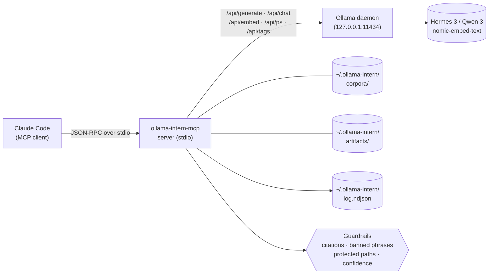

<p align="center">
  <a href="README.ja.md">日本語</a> | <a href="README.zh.md">中文</a> | <a href="README.es.md">Español</a> | <a href="README.fr.md">Français</a> | <a href="README.md">English</a> | <a href="README.it.md">Italiano</a> | <a href="README.pt-BR.md">Português (BR)</a>
</p>

<p align="center">
  
</p>

<p align="center">
  <a href="https://github.com/mcp-tool-shop-org/ollama-intern-mcp/actions"></a>
  <a href="LICENSE"></a>
  <a href="https://mcp-tool-shop-org.github.io/ollama-intern-mcp/"></a>
  <a href="https://mcp-tool-shop-org.github.io/ollama-intern-mcp/handbook/"></a>
</p>

> **Claude Code के लिए स्थानीय इंटर्न।** <!-- TOOL_COUNT:start -->42<!-- TOOL_COUNT:end --> जॉब-आकार के टूल, साक्ष्य-प्रथम संक्षिप्तियाँ, टिकाऊ कृतियाँ।

एक MCP सर्वर जो Claude Code को नियमों, टियरों, डेस्क और फाइलिंग कैबिनेट के साथ एक **स्थानीय इंटर्न** देता है। Claude टूल चुनता है; टूल टियर चुनता है (Instant / Workhorse / Deep / Embed); टियर एक ऐसी फ़ाइल लिखता है जिसे आप अगले सप्ताह खोल सकते हैं।

यह `hermes3:8b` पर [Hermes Agent](https://github.com/NousResearch/hermes-agent) को भी **चलाता है** — 2026-04-19 को एंड-टू-एंड मान्य। डिफ़ॉल्ट लैडर `hermes3:8b` है; `qwen3:*` वैकल्पिक रेल है। नीचे [Hermes के साथ उपयोग](#use-with-hermes) देखें।

**हार्डवेयर आवश्यकताएँ:** `hermes3:8b` के लिए ~6 GB VRAM, या CPU अनुमान के लिए ~16 GB RAM। पूर्ण विवरण के लिए [handbook/getting-started](https://mcp-tool-shop-org.github.io/ollama-intern-mcp/handbook/getting-started/#hardware-minimums) देखें।

**Claude का उपयोग नहीं कर रहे?** [`examples/`](./examples/) डायरेक्टरी में एक न्यूनतम Node.js और Python MCP क्लाइंट है जिसे आप stdio पर स्पॉन कर सकते हैं। [handbook/with-hermes](https://mcp-tool-shop-org.github.io/ollama-intern-mcp/handbook/with-hermes/) भी देखें।

**स्थानीय-प्रथम** — जब तक आप ऑप्ट-इन नहीं करते, तब तक शून्य नेटवर्क एग्रेस। कोई टेलीमेट्री नहीं। कुछ भी "स्वायत्त" नहीं। हर कॉल अपना काम दिखाती है। वैकल्पिक [Ollama Cloud](#ollama-cloud-optional) राउटिंग 600B-क्लास मॉडल को उन्हीं टूल्स के पीछे रखती है जब स्थानीय हार्डवेयर बाधा हो — स्थानीय पर स्वचालित फ़ॉलबैक के साथ।

---

## v2.7.0 में नया

**वैकल्पिक Ollama Cloud राउटिंग — क्लाउड-प्राथमिक, स्थानीय-फ़ॉलबैक।** एक कुंजी + एक फ़्लैग के साथ ऑप्ट-इन करें और जनरेटिव टियर 600B-क्लास क्लाउड मॉडल पर रूट होते हैं; एम्बेडिंग स्थानीय रहती हैं; कोई भी क्लाउड विफलता होने पर एक सर्किट ब्रेकर आपकी स्थानीय प्रोफ़ाइल पर वापस आ जाता है। **डिफ़ॉल्ट रूप से बंद — जब तक आप `OLLAMA_API_KEY` और `OLLAMA_CLOUD_PRIMARY=1` दोनों सेट नहीं करते, तब तक शून्य एग्रेस।** योज्य नाबालिग — v2.7.0 से पहले के कॉलर (और जो कोई ऑप्ट-इन नहीं कर रहा) बाइट-समान व्यवहार देखते हैं। [Ollama Cloud (वैकल्पिक)](#ollama-cloud-optional) देखें।

- **सुरक्षा जाल के साथ क्लाउड-प्राथमिक।** एक `RoutingOllamaClient` पहले क्लाउड का प्रयास करता है और टाइमआउट / 5xx / 429 / नेटवर्क पर स्थानीय प्रोफ़ाइल पर वापस आ जाता है। खराब कुंजियाँ (401/403) चुपचाप हमेशा के लिए डिग्रेड होने के बजाय एक स्टिकी ब्रेकर के माध्यम से ज़ोर से सामने आती हैं; एक रिटायर्ड/टाइपो वाला क्लाउड मॉडल आईडी (404) भी सामने आता है।
- **कभी कोई मूक डाउनग्रेड नहीं।** हर एनवेलोप को `backend` (`cloud`|`local`), `degraded`, और `degrade_reason` मिलते हैं ताकि आपको हमेशा पता रहे कि आपको बड़े मॉडल के बजाय स्थानीय मॉडल कब मिला। एक `backend_fallback` NDJSON इवेंट `ollama_log_tail` में क्लाउड→स्थानीय फ़ॉलबैक दर को दृश्यमान बनाता है।
- **`ollama_doctor` क्लाउड प्रमाणीकरण + पहुँचयोग्यता को** एक अलग ब्लॉक के रूप में रिपोर्ट करता है; `ollama-intern-mcp doctor` एक `Cloud (primary)` अनुभाग दिखाता है।
- डिफ़ॉल्ट क्लाउड मॉडल `minimax-m3:cloud` है; `INTERN_CLOUD_MODEL` / `INTERN_CLOUD_DEEP_MODEL` के साथ प्रति-टियर ओवरराइड करें (उदा. `deepseek-v3.1:671b`)।

## v2.6.0 में नया

`ollama_extract` पर प्रति-कॉल टियर-बजट ओवरराइड। योज्य नाबालिग — v2.6.0 से पहले के कॉलर अपरिवर्तित। [CHANGELOG.md](./CHANGELOG.md) में विस्तृत प्रविष्टि।

- **`ollama_extract` पर `tier_budget_ms_override?: number` स्कीमा फ़ील्ड** (वैकल्पिक, सीमित `[1, 600000]` ms)। जब मौजूद हो, तो रनर द्वारा देखी गई हर टियर पर ओवरराइड लागू करता है ताकि `src/guardrails/timeouts.ts:61` पर आंतरिक `runWithTimeoutAndFallback` मशीनरी प्रोफ़ाइल डिफ़ॉल्ट के बजाय ऑपरेटर द्वारा आपूर्ति किए गए बजट का पालन करे। कैस्केड (workhorse → instant on timeout) अभी भी चालू होता है; ओवरराइड प्रत्येक कैस्केड हॉप को एकसमान रूप से नियंत्रित करता है।
- **यह क्यों मौजूद है।** research-os R-018 रैपर (v0.12.1) ने MCP `callTool` को `Promise.race` के साथ रैप किया और पाया कि रैपर का बजट आंतरिक टियर तक नहीं पहुँचा — `DEV_RTX5080_TIMEOUTS.instant = 15_000` 180000ms रैपर बजट की परवाह किए बिना 15000ms पर `TIER_TIMEOUT` चालू करता रहा। v2.6.0 MCP-साइड आधिकारिक बजट आपूर्ति करता है ताकि ऑपरेटर का `--planner-timeout-ms` फ़्लैग (research-os) अंततः आंतरिक-टियर टाइमआउट को जैसा डिज़ाइन किया गया है, नियंत्रित करे।
- **डिफ़ॉल्ट व्यवहार संरक्षित।** फ़ील्ड छोड़ी गई = प्रोफ़ाइल डिफ़ॉल्ट बाइट-समान रूप से नियंत्रित करते हैं। v2.6.0 से पहले के कॉलर कोई बदलाव नहीं देखते।
- **R-010 फ़ॉलबैक-कारण रेगेक्स संरक्षित।** सर्वर-साइड `TIER_TIMEOUT` एरर मैसेज अभी भी `/elapsed=(\d+)ms/` + `/budget=(\d+)ms/` से मेल खाता है ताकि डाउनस्ट्रीम AI-सलाहकार दृश्यता ओवरराइड और डिफ़ॉल्ट पाथ दोनों पर समान रूप से काम करे।
- समन्वित मल्टी-रिलीज़ में research-os v0.13.0 (संचयी R-019 क्लाइंट वायर-अप + R-020 + R-021) द्वारा उपभोग किया गया।

### ऐतिहासिक — v2.4.0 डिलीवरेबल्स

पूर्ण v2.4.0 प्रविष्टि (प्रोफ़ाइल सिस्टम पर प्रति-टियर `num_ctx` नियंत्रण) के लिए [CHANGELOG.md](./CHANGELOG.md) और [docs/release-notes/v2.4.0.md](./docs/release-notes/v2.4.0.md) देखें।

## v2.4.0 में नया

प्रोफ़ाइल सिस्टम पर प्रति-टियर `num_ctx` (कॉन्टेक्स्ट विंडो) नियंत्रण। योज्य माइनर — v2.3.0 कॉलर अपरिवर्तित। विस्तृत प्रविष्टियाँ [CHANGELOG.md](./CHANGELOG.md) और [docs/release-notes/v2.4.0.md](./docs/release-notes/v2.4.0.md) में।

- **`TierConfig.num_ctx` मैप (नया)** — प्रोफ़ाइल पर वैकल्पिक `{ instant?, workhorse?, deep?, embed? }`। जब टियर के लिए सेट किया जाता है, तो MCP सर्वर उस टियर पर रूट किए गए हर Ollama जनरेट/चैट अनुरोध (प्रारंभिक + फ़ॉलबैक) पर `options.num_ctx = <value>` रखता है। जब अनसेट होता है, तो अनुरोध `num_ctx` को पूरी तरह से छोड़ देता है ताकि Ollama अपना मॉडल-लोडेड डिफ़ॉल्ट उपयोग करे — v2.3.0 व्यवहार बिल्कुल संरक्षित।
- **नया एनवलप फ़ील्ड `num_ctx_used?: number`** — केवल तब मौजूद जब MCP सर्वर ने वास्तव में `num_ctx` भेजा हो। अनुपस्थित जब अनुरोध ने Ollama को चुनने दिया। डिफ़ॉल्ट का अनुमान न लगाएँ — MCP सर्वर प्रभावी मान के लिए Ollama को क्वेरी नहीं करता।
- **प्रोफ़ाइल डिफ़ॉल्ट्स**: `dev-rtx5080` / `dev-rtx5080-qwen3` `instant: 4096`, `workhorse: 8192`, `deep`/`embed` UNSET के साथ आते हैं। तेज़ टूल्स के लिए RTX 5080 के 16GB VRAM बजट में `hermes3:8b` को रेज़िडेंट रखने के लिए आकार दिया गया। `m5-max` हर टियर को UNSET छोड़ता है — 128GB यूनिफ़ाइड मेमोरी में कोई स्पिल समस्या नहीं है।
- **v0.8.0 चरण 1 निदान बंद करता है** — RTX 5080 पर डिफ़ॉल्ट 32K कॉन्टेक्स्ट में `hermes3:8b` CPU पर स्पिल हो गया और workhorse `ollama_extract` कॉल टाइमआउट होने लगे। v2.4.0 प्रोफ़ाइल लेयर पर इसे रोकता है।

### प्रति-टियर `num_ctx` नियंत्रण (v2.4.0 में नया)

प्रोफ़ाइल (`src/profiles.ts` से अंश):

```ts
"dev-rtx5080": {
  tiers: {
    instant: "hermes3:8b",
    workhorse: "hermes3:8b",
    deep: "hermes3:8b",
    embed: "nomic-embed-text",
    num_ctx: {
      instant: 4096,    // fast classify/summarize
      workhorse: 8192,  // schema-bound extract / batch
      // deep: UNSET — long-context briefs keep current behavior
      // embed: UNSET — no context-window pressure on embed
    },
  },
  // ... timeouts, prewarm
}
```

workhorse-टियर कॉल पर एनवलप (उदा. `ollama_extract`):

```jsonc
{
  "result": { /* extracted data */ },
  "tier_used": "workhorse",
  "model": "hermes3:8b",
  "num_ctx_used": 8192,        // present because the profile set workhorse=8192
  // ... rest of envelope unchanged
}
```

`m5-max` पर (या कोई भी प्रोफ़ाइल जो टियर को अनसेट छोड़ती है), `num_ctx_used` एनवलप से अनुपस्थित होता है और Ollama को वायर अनुरोध में `num_ctx` फ़ील्ड शामिल नहीं होती — Ollama अपना मॉडल-लोडेड डिफ़ॉल्ट उपयोग करता है।

ऑपरेटर प्रोफ़ाइल चुनकर / संपादित करके ट्यून करते हैं; टूल स्कीमा पर कोई प्रति-कॉल `num_ctx` इनपुट नहीं है। यदि भविष्य का कॉल आवश्यकता को उजागर करता है, तो पैटर्न v2.3.0 के `model` ओवरराइड का पालन करता है।

### ऐतिहासिक — v2.3.0 डिलीवरेबल्स

पूर्ण v2.3.0 प्रविष्टि (प्रति-कॉल मॉडल ओवरराइड) के लिए [CHANGELOG.md](./CHANGELOG.md) और [docs/release-notes/v2.3.0.md](./docs/release-notes/v2.3.0.md) देखें।

## v2.3.0 में नया

LLM-बैक्ड एटम टूल्स पर प्रति-कॉल मॉडल ओवरराइड। योज्य (additive) माइनर — v2.2.0 कॉलर्स अपरिवर्तित। विस्तृत प्रविष्टियाँ [CHANGELOG.md](./CHANGELOG.md) और [docs/release-notes/v2.3.0.md](./docs/release-notes/v2.3.0.md) में।

- **8 एटम टूल्स पर वैकल्पिक `model: string` इनपुट** — `ollama_extract`, `ollama_classify`, `ollama_summarize_fast`, `ollama_summarize_deep`, `ollama_research`, `ollama_corpus_answer`, `ollama_chat`, `ollama_code_citation`। टूल के टियर पर पहला प्रयास कॉलर-निर्दिष्ट मॉडल के विरुद्ध चलता है; टाइमआउट पर, मौजूदा `TIER_FALLBACK` कैस्केड सस्ते टियर के अपने मॉडल को हल करता है (कॉलर के ओवरराइड को नहीं)। कम्पोज़िट/ब्रीफ/पैक टूल्स जानबूझकर `model` स्वीकार नहीं करते — एटम्स को प्रति-कॉल नियंत्रण मिलता है, कम्पोज़िट्स टियर डिफॉल्ट्स का उपयोग करते हैं।
- **नया एनवलप फ़ील्ड `model_requested?: string`** — केवल तब मौजूद रहता है जब ओवरराइड प्रदान किया गया हो। कैलिब्रेशन-जागरूक कॉलर्स फ़ॉलबैक प्रतिस्थापन का पता लगाने के लिए `model_requested` और `model` की तुलना करते हैं: `if (env.model_requested && env.model !== env.model_requested) { /* substitution */ }`। रिक्त / केवल-व्हाइटस्पेस इनपुट स्कीमा पार्स पर `ZodError` फेंकते हैं, मूक फ़ॉल-थ्रू नहीं।
- **बग फ़िक्स — `src/version.ts` ड्रिफ़्ट।** रनटाइम `VERSION` कॉन्स्टेंट अब मॉड्यूल लोड पर `package.json` से पढ़ा जाता है; v2.1.0 और v2.2.0 ने पुरानी `"2.0.0"` आइडेंटिटी स्ट्रिंग रिपोर्ट करके शिप किया था। नया `tests/version.test.ts` `VERSION === pkg.version` को लॉक करता है।

### प्रति-कॉल मॉडल ओवरराइड (v2.3.0 में नया)

```jsonc
{
  "tool": "ollama_classify",
  "arguments": {
    "text": "patch null pointer in auth",
    "labels": ["feat", "fix", "chore"],
    "frame": "what is the change kind?",
    "model": "hermes3:8b"
  }
}
```

एनवलप:

```jsonc
{
  "result": { "label": "fix", "confidence": 0.9, "off_topic": false, ... },
  "tier_used": "instant",
  "model": "hermes3:8b",
  "model_requested": "hermes3:8b",       // present because override was supplied
  // ... rest of envelope unchanged
}
```

यदि वर्कहॉर्स/डीप टियर टाइमआउट हो गया होता और कॉल इंस्टेंट टियर पर कैस्केड हो गया होता, तो `env.model` इंस्टेंट टियर का हल किया गया मॉडल होता और `env.fallback_from` `"workhorse"` होता — `env.model_requested` अभी भी `"hermes3:8b"` होता, और `env.model !== env.model_requested` प्रतिस्थापन संकेत है। ओवरराइड जानबूझकर सस्ते टियर में नहीं ले जाया जाता; चुना गया मॉडल उस टियर की भूमिका के लिए बिल्कुल भी उपयुक्त नहीं हो सकता।

### ऐतिहासिक — v2.2.0 डिलीवरेबल्स

पूर्ण v2.2.0 प्रविष्टि (फ़्रेम-बाउंड टॉपिकैलिटी + स्ट्रक्चर्ड एब्स्टेंशन) के लिए [CHANGELOG.md](./CHANGELOG.md) और [docs/release-notes/v2.2.0.md](./docs/release-notes/v2.2.0.md) देखें।

## v2.2.0 में नया

लोकल एविडेंस-वर्कर भूमिका अनुबंध: फ़्रेम-बाउंड टॉपिकैलिटी और स्ट्रक्चर्ड एब्स्टेंशन। योज्य (additive) माइनर — v2.1.0 कॉलर्स अपरिवर्तित। विस्तृत प्रविष्टियाँ [CHANGELOG.md](./CHANGELOG.md) और [docs/release-notes/v2.2.0.md](./docs/release-notes/v2.2.0.md) में।

- **`ollama_extract`, `ollama_classify`, `ollama_summarize_fast`, `ollama_summarize_deep` पर फ़्रेम-बाउंड एक्सट्रैक्शन** — वैकल्पिक `frame: string` इनपुट + स्ट्रक्चर्ड `frame_alignment` / `on_topic` / `frame_addressed` आउटपुट। ऑफ़-टॉपिक स्रोतों को स्कीमा में पैराफ़्रेज़ करने के बजाय फ़्लैग किया जाता है।
- **`ollama_research` पर स्ट्रक्चर्ड एब्स्टेंशन** — `weak` / `abstained` / `sources_address_question` फ़ील्ड्स। गैर-रिक्त `answer` के साथ रिक्त `citations[]` अब मूक सफलता नहीं है।
- **`ollama_corpus_answer` पर टॉपिकैलिटी थ्रेशोल्ड** — वैकल्पिक `min_top_score`। फ़्लोर से नीचे, टूल `abstained: true` के साथ शॉर्ट-सर्किट हो जाता है और सिंथेसिस छोड़ देता है। प्रति-साइटेशन `score` अब प्रत्येक साइटेशन पर दिखाई देता है।
- **ब्रीफ़ एविडेंस के माध्यम से रिट्रीवल स्कोर संरक्षण** — `corpusHitsToEvidence` `score` वहन करता है (और `corpus_min_evidence_score` नॉब `incident_brief` / `repo_brief` / `change_brief` पर असेंबली के समय फ़िल्टर करता है)।
- **साइटेशन लाइन-रेंज बाउंड्स** — `guardrails/citations.ts` `ollama_research` पर आउट-ऑफ़-बाउंड्स रेंज को अस्वीकार करता है, `ollama_code_citation` पर मौजूदा पोस्चर से मेल खाता है।
- **ऑपरेटर-अनुबंध दस्तावेज़ सुधारे गए** — README `chunk_id`/`chunk_index` फ़िक्स, "validated server-side" पुनर्लिखित, एविडेंस लॉज़ सेक्शन योग्य, मार्केटिंग स्लोगन एनोटेट।

### सीड रिग्रेशन — वेरिफ़िकेशन

स्लाइस का अनुबंध शाब्दिक research-os fresh-pack विफलता के विरुद्ध सत्यापित किया जाता है: arxiv 2112.10422 (कॉस्मोलॉजिकल स्टैंडर्ड टाइमर्स) section-01 फ्रेम के अंतर्गत *"What does evidence custody mean in local-first vs cloud LLM deep-research workflows?"* — 9 / 9 मॉक्ड-LLM अनुबंध परीक्षण पुष्टि करते हैं कि ऑफ-टॉपिक स्रोत अब नियंत्रित है (`frame_alignment.on_topic = false` एक्सट्रैक्ट पर; `off_topic: true` क्लासिफ़ाई पर; `frame_addressed: false` summarize_deep पर; `abstained: true` corpus_answer पर जब `min_top_score` सेट हो)।

### ऐतिहासिक — v2.1.0 डिलीवरेबल्स

पूर्ण v2.1.0 प्रविष्टि के लिए [CHANGELOG.md](./CHANGELOG.md) देखें (फ़ीचर पास: 13 नए टूल + 4 एनहांसमेंट + फ़्रीज़ लिफ़्ट)।

---

## एक नज़र में आर्किटेक्चर



हर Claude टूल कॉल stdio JSON-RPC पर MCP सर्वर में प्रवेश करता है। सर्वर कॉल को टूल के [zod](https://zod.dev) स्कीमा के विरुद्ध मान्य करता है, कॉन्फ़िगर किए गए गार्डरेल्स (साइटेशन वैलिडेशन, बैन्ड-फ़्रेज़ स्ट्रिप, प्रोटेक्टेड-पाथ एनफ़ोर्समेंट, कॉन्फिडेंस थ्रेशोल्ड्स) चलाता है, फिर या तो डिटर्मिनिस्टिक रेंडरर (आर्टिफ़ैक्ट टियर) या Ollama HTTP कॉल (हर अन्य टियर) पर रूट करता है। Ollama डेमॉन कभी उपयोगकर्ता-आपूर्तित पाथ नहीं देखता — केवल मॉडल टियर और तैयार किया गया प्रॉम्प्ट। हर कॉल `~/.ollama-intern/log.ndjson` पर NDJSON लॉग में एक स्ट्रक्चर्ड इवेंट जोड़ता है, जहाँ `ollama_log_tail` और आपका शेल उसे पढ़ सकते हैं।

---

## लीड उदाहरण — एक कॉल, एक आर्टिफ़ैक्ट

```jsonc
// Claude → ollama-intern-mcp
{
  "tool": "ollama_incident_pack",
  "arguments": {
    "title": "sprite pipeline 5 AM paging regression",
    "logs": "[2026-04-16 05:07] worker-3 OOM killed\n[2026-04-16 05:07] ollama /api/ps reports evicted=true size=8.1GB\n...",
    "source_paths": ["F:/AI/sprite-foundry/src/worker.ts", "memory/sprite-foundry-visual-mastery.md"]
  }
}
```

डिस्क पर एक फ़ाइल की ओर इशारा करने वाला एक एनवलप लौटाता है:

```jsonc
{
  "result": {
    "pack": "incident",
    "slug": "2026-04-16-sprite-pipeline-5-am-paging-regression",
    "artifact_md":   "~/.ollama-intern/artifacts/incident/2026-04-16-sprite-pipeline-5-am-paging-regression.md",
    "artifact_json": "~/.ollama-intern/artifacts/incident/2026-04-16-sprite-pipeline-5-am-paging-regression.json",
    "weak": false,
    "evidence_count": 6,
    "next_checks": ["residency.evicted across last 24h", "OLLAMA_MAX_LOADED_MODELS vs loaded size"]
  },
  "tier_used": "deep",
  "model": "hermes3:8b",
  "hardware_profile": "dev-rtx5080",
  "tokens_in": 4180, "tokens_out": 612,
  "elapsed_ms": 8410,
  "residency": { "in_vram": true, "evicted": false }
}
```

→ `weak: false` का अर्थ है कि ≥2 साक्ष्य आइटम इकट्ठा किए गए थे; इसका अर्थ यह नहीं है कि परिकल्पनाएँ सत्यापित हैं। नीचे [साक्ष्य नियम](#evidence-laws) देखें।

वह मार्कडाउन फ़ाइल इंटर्न की डेस्क आउटपुट है — हेडिंग्स, उद्धृत ids के साथ साक्ष्य ब्लॉक, जाँच-पड़ताल `next_checks`, यदि साक्ष्य पतला है तो `weak: true` बैनर। यह डिटर्मिनिस्टिक है: रेंडरर कोड है, प्रॉम्प्ट नहीं। (रेंडरर डिटर्मिनिस्टिक है; परिकल्पनाओं और सतहों की *सामग्री* जेनरेटिव है — उन्हें ड्राफ़्ट के रूप में पढ़ें, सत्यापित नहीं।) कल खोलें, अगले हफ़्ते diff करें, `ollama_artifact_export_to_path` के साथ हैंडबुक में निर्यात करें।

इस श्रेणी का हर प्रतिद्वंद्वी "टोकन बचाओ" से शुरू करता है। हम _यहाँ वह फ़ाइल है जो इंटर्न ने लिखी_ से शुरू करते हैं।

### दूसरा उदाहरण — एक कॉर्पस बनाएँ, फिर उससे पूछें

```jsonc
// 1. Build a persistent, searchable corpus over your project.
{ "tool": "ollama_corpus_index",
  "arguments": { "name": "sprite-foundry",
                 "paths": ["F:/AI/sprite-foundry/src"],
                 "embed_model": "nomic-embed-text" } }
// → { chunks_written: 1204, paths_indexed: 312, failed_paths: [] }

// 2. Ask an evidence-bound question against it.
{ "tool": "ollama_corpus_answer",
  "arguments": { "name": "sprite-foundry",
                 "query": "how does the worker handle OOM eviction?",
                 "top_k": 8 } }
// → { answer: "...", citations: [{chunk_index, path}...], weak: false }
```

सर्वर साइटेशन पहचान और यह मान्य करता है कि प्रत्येक `chunk_index` प्राप्त हिट्स की रेंज में है। यह साबित नहीं करता कि हर जेनरेट किया गया दावा उद्धृत चंक सामग्री द्वारा शब्दार्थतः समर्थित है — यह मॉडल की ज़िम्मेदारी है, और कमज़ोर रिट्रीवल अभी भी साइटेशन-आकार के उत्तर पैदा कर सकता है। [handbook/corpora](https://mcp-tool-shop-org.github.io/ollama-intern-mcp/handbook/corpora/) में पूरी वॉकथ्रू।

---

## फ्रेम-बाउंड एक्सट्रैक्शन (v2.2.0 में नया)

`ollama_extract`, `ollama_classify`, `ollama_summarize_fast`, और `ollama_summarize_deep` एक वैकल्पिक `frame: string` इनपुट स्वीकार करते हैं। फ्रेम उस प्रश्न का नाम है जिसका उत्तर स्रोत से माँगा जा रहा है; मॉडल को निर्देश दिया जाता है कि जब स्रोत फ्रेम को संबोधित नहीं करता तो true-but-off-topic सामग्री उत्सर्जित करने के बजाय उत्तर देने से विरत रहे।

```jsonc
{
  "tool": "ollama_extract",
  "arguments": {
    "text": "<long source document>",
    "schema": { /* your fields */ },
    "frame": "section purpose here — e.g. 'OOM eviction behavior in the sprite worker'"
  }
}
// → result includes frame_alignment: { on_topic: boolean, reason: string, unaddressed_aspects: string[] }
```

यदि `frame` छोड़ा गया है, तो व्यवहार v2.1.0 से अपरिवर्तित है। जब आपूर्ति की जाती है, `frame_alignment.on_topic = false` संकेत देता है कि निकाले गए फ़ील्ड स्रोत के सत्य हो सकते हैं लेकिन फ्रेम के लिए प्रासंगिक नहीं — इसे `weak: true` ब्रीफ़ के समान आकार मानें: उपयोगी, लेकिन डाउनस्ट्रीम साक्ष्य में प्रोत्साहित करने से पहले स्पॉट-चेक करें।

---

## अनुपस्थिति अनुबंध (v2.2.0 में नया)

`ollama_research` संरचित अस्वीकरण फ़ील्ड लौटाता है: `weak: boolean`, `abstained: boolean`, `sources_address_question: boolean | null`। एक गैर-रिक्त `answer` के साथ एक रिक्त `citations[]` अब मौन नहीं है — `abstained: true` कहता है कि मॉडल ने संश्लेषण करने से इनकार कर दिया क्योंकि कॉलर-प्रदत्त पथों ने प्रश्न का समाधान नहीं किया। अस्वीकरण को विफलता नहीं, बल्कि सफलता के रूप में मानें: यह टूल कमज़ोर रिट्रीवल को आधिकारिक आउटपुट में तब्दील करने से मना कर रहा है।

`ollama_corpus_answer` एक वैकल्पिक `min_top_score: number` विषयगत सीमा (0.0–1.0) स्वीकार करता है। जब किसी क्वेरी के लिए शीर्ष रिट्रीवल स्कोर `min_top_score` से नीचे गिरता है, तो टूल `abstained: true` के साथ शॉर्ट-सर्किट हो जाता है और संश्लेषण को छोड़ देता है — "5 ऑफ-टॉपिक चंक्स 0.21 स्कोर पर अभी भी पूर्ण उत्तर को चलाते हैं" विफलता मोड को रोकता है जिसे v2.1.0 का `weak: true` नियम पकड़ नहीं पाया था (`weak: true` केवल `hits.length < 2` पर चलता था)। इसे प्रत्येक उद्धरण पर नई तरह से सामने आए `score` फ़ील्ड के साथ जोड़ें ताकि एनवलप से सीधे रिट्रीवल गुणवत्ता का ऑडिट किया जा सके।

---

## यहाँ क्या है — चार स्तर, <!-- TOOL_COUNT:start -->42<!-- TOOL_COUNT:end --> टूल्स

**जॉब-आकार का** मतलब है कि प्रत्येक टूल एक इंटर्न को सौंपे जाने वाले कार्य का नाम देता है — इसे वर्गीकृत करो, उसे निकालो, इन लॉग्स को ट्राइएज करो, यह रिलीज़ नोट ड्राफ्ट करो, इस घटना को पैक करो। टूल का इनपुट कार्य विशिष्टता है; आउटपुट डिलीवरेबल है। शीर्ष पर कोई सामान्य `run_model` / `chat_with_llm` प्रिमिटिव नहीं।

| स्तर | गणना | यहाँ क्या रहता है |
|---|---|---|
| **Atoms** | 28 | जॉब-आकार के प्रिमिटिव। **मूल 15:** `classify`, `extract`, `triage_logs`, `summarize_fast` / `deep`, `draft`, `research`, `corpus_search` / `answer` / `index` / `refresh` / `list`, `embed_search`, `embed`, `chat`। **v2.1.0 में +13 जोड़े गए:** `doctor`, `log_tail`, `batch_proof_check` (ऑप्स); `code_map`, `code_citation`, `multi_file_refactor_propose`, `refactor_plan` (रिफैक्टर); `artifact_prune`, `hypothesis_drill` (आर्टिफैक्ट/ब्रीफ़); `corpus_health`, `corpus_amend`, `corpus_amend_history`, `corpus_rerank` (कॉर्पस)। बैच-सक्षम एटम (`classify`, `extract`, `triage_logs`) `items: [{id, text}]` स्वीकार करते हैं। |
| **Briefs** | 3 | साक्ष्य-समर्थित संरचित ऑपरेटर ब्रीफ़। `incident_brief`, `repo_brief`, `change_brief`। हर दावा एक साक्ष्य आईडी का उद्धरण देता है; अज्ञात सर्वर-साइड हटा दिए जाते हैं। कमज़ोर साक्ष्य नकली कथा के बजाय `weak: true` को सतह पर लाता है। |
| **Packs** | 3 | निश्चित-पाइपलाइन यौगिक कार्य जो `~/.ollama-intern/artifacts/` में टिकाऊ markdown + JSON लिखते हैं। `incident_pack`, `repo_pack`, `change_pack`। निर्धारक रेंडरर्स — आर्टिफैक्ट आकार पर कोई मॉडल कॉल नहीं। |
| **Artifacts** | 7 | पैक आउटपुट पर निरंतरता सतह। `artifact_list` / `read` / `diff` / `export_to_path`, साथ ही तीन निर्धारक स्निपेट: `incident_note`, `onboarding_section`, `release_note`। |

कुल: **28 एटम + 3 ब्रीफ़ + 3 पैक + 7 आर्टिफैक्ट टूल = <!-- TOOL_COUNT:start -->42<!-- TOOL_COUNT:end -->**।

फ़्रीज़ लाइनें:
- एटम: फ़्रीज़ **v2.1.0 पर हटा दिया गया** (आज 28; v2.1.0 फ़ीचर पास में +13 जोड़े गए)। नए एटम को अभी भी ऑडिट-न्यायोचित अंतर, परीक्षण, हैंडबुक पृष्ठ और CHANGELOG प्रविष्टि की आवश्यकता है — कोई अनौपचारिक जोड़ नहीं।
- पैक 3 पर फ़्रीज़। कोई नए पैक प्रकार नहीं।
- आर्टिफैक्ट स्तर 7 पर फ़्रीज़।

पूर्ण टूल संदर्भ [handbook](https://mcp-tool-shop-org.github.io/ollama-intern-mcp/handbook/tools/) में रहता है।

---

## इंस्टॉल

स्थानीय रूप से चल रहे [Ollama](https://ollama.com) और खींचे गए टियर मॉडल्स की आवश्यकता है (नीचे [मॉडल पुल्स](#model-pulls) देखें)।

### Claude Code (अनुशंसित)

अधिकांश उपयोगकर्ता इसे अपने Claude Code MCP सर्वर कॉन्फ़िग में जोड़कर इंस्टॉल करते हैं — किसी वैश्विक इंस्टॉल की आवश्यकता नहीं। Claude Code `npx` के माध्यम से माँग पर सर्वर चलाता है:

```json
{
  "mcpServers": {
    "ollama-intern": {
      "command": "npx",
      "args": ["-y", "ollama-intern-mcp"],
      "env": {
        "OLLAMA_HOST": "http://127.0.0.1:11434",
        "INTERN_PROFILE": "dev-rtx5080"
      }
    }
  }
}
```

### Claude Desktop

वही ब्लॉक, `~/Library/Application Support/Claude/claude_desktop_config.json` (macOS) या `%APPDATA%\Claude\claude_desktop_config.json` (Windows) पर लिखा गया।

### ग्लोबल इंस्टॉल (उन्नत)

सिर्फ़ तब ज़रूरी है जब आप बाइनरी को अपने `PATH` पर Claude Code के बाहर ad-hoc उपयोग के लिए रखना चाहते हैं:

```bash
npm install -g ollama-intern-mcp
```

### Hermes के साथ उपयोग करें

यह MCP [Hermes Agent](https://github.com/NousResearch/hermes-agent) के साथ Ollama पर `hermes3:8b` के विरुद्ध end-to-end मान्य (validated) किया गया था (2026-04-19)। Hermes एक बाहरी एजेंट है जो इस MCP की जमी हुई (frozen) primitive सतह में *कॉल करता है* — प्लानिंग वह करता है, काम हम करते हैं।

रेफ़रेंस कॉन्फ़िगरेशन (इस रेपो में [hermes.config.example.yaml](hermes.config.example.yaml)):

```yaml
model:
  provider: custom
  base_url: http://localhost:11434/v1
  default: hermes3:8b
  context_length: 65536    # Hermes requires 64K floor under model.*

providers:
  local-ollama:
    name: local-ollama
    base_url: http://localhost:11434/v1
    api_mode: openai_chat
    api_key: ollama
    model: hermes3:8b

mcp_servers:
  ollama-intern:
    command: npx
    args: ["-y", "ollama-intern-mcp"]
    env:
      OLLAMA_HOST: http://localhost:11434
      INTERN_PROFILE: dev-rtx5080
      # hermes3:8b is the default ladder in v2.0.0, so tier overrides are
      # only needed if you're pinning a different local model.
```

**प्रॉम्प्ट का आकार मायने रखता है।** Imperative टूल-इनवोकेशन प्रॉम्प्ट ("X को args के साथ कॉल करें …") इंटीग्रेशन टेस्ट हैं — ये 8B लोकल मॉडल को साफ़ `tool_calls` emit करने के लिए पर्याप्त scaffolding देते हैं। List-form मल्टी-टास्क प्रॉम्प्ट ("A करो, फिर B, फिर C") बड़े मॉडलों के लिए क्षमता बेंचमार्क हैं; 8B पर list-form विफलता को "वायरिंग टूटी है" के रूप में न समझें। पूरा इंटीग्रेशन वॉकथ्रू + ज्ञात ट्रांसपोर्ट सावधानियों (Ollama `/v1` streaming + openai-SDK non-streaming shim) के लिए [handbook/with-hermes](https://mcp-tool-shop-org.github.io/ollama-intern-mcp/handbook/with-hermes/) देखें।

### मॉडल पुल

**डिफ़ॉल्ट dev प्रोफ़ाइल (RTX 5080 16GB और समान):**

```bash
ollama pull hermes3:8b
ollama pull nomic-embed-text
export OLLAMA_MAX_LOADED_MODELS=2
export OLLAMA_KEEP_ALIVE=-1
```

**Qwen 3 वैकल्पिक रेल (Qwen टूलिंग के लिए, समान हार्डवेयर):**

```bash
ollama pull qwen3:8b
ollama pull qwen3:14b
ollama pull nomic-embed-text
export INTERN_PROFILE=dev-rtx5080-qwen3
```

**M5 Max प्रोफ़ाइल (128GB unified):**

```bash
ollama pull qwen3:14b
ollama pull qwen3:32b
ollama pull nomic-embed-text
export INTERN_PROFILE=m5-max
```

प्रति-स्तर env vars (`INTERN_TIER_INSTANT`, `INTERN_TIER_WORKHORSE`, `INTERN_TIER_DEEP`, `INTERN_EMBED_MODEL`) अभी भी one-offs के लिए प्रोफ़ाइल चयनों को ओवरराइड करते हैं।

---

## एकरूप एनवलप

हर टूल एक ही आकार लौटाता है:

```ts
{
  result: <tool-specific>,
  tier_used: "instant" | "workhorse" | "deep" | "embed",
  model: string,
  hardware_profile: string,     // "dev-rtx5080" | "dev-rtx5080-qwen3" | "m5-max"
  tokens_in: number,
  tokens_out: number,
  elapsed_ms: number,
  residency: {
    in_vram: boolean,
    size_bytes: number,
    size_vram_bytes: number,
    evicted: boolean
  } | null
}
```

`residency` Ollama के `/api/ps` से आता है। जब `evicted: true` हो या `size_vram < size` हो, तो मॉडल डिस्क पर page हुआ और inference 5–10× गिर गया — इसे यूज़र के सामने लाएँ ताकि वे जान सकें कि Ollama को रीस्टार्ट करना है या लोड किए गए मॉडल की संख्या घटानी है।

[Ollama Cloud](#ollama-cloud-optional) मोड में एनवलप `backend` (`"cloud"` | `"local"`) भी वहन करता है, और cloud→local fallback पर `degraded: true` + `degrade_reason`। ये फ़ील्ड डिफ़ॉल्ट local-only पाथ में **अनुपस्थित** हैं, इसलिए मौजूदा उपभोक्ता (consumers) अप्रभावित हैं। cloud-served कॉल्स के लिए `residency` `null` होता है (stateless cloud में कोई local-VRAM residency नहीं होती)।

हर कॉल `~/.ollama-intern/log.ndjson` में एक NDJSON लाइन के रूप में लॉग होता है। प्रकाशन योग्य बेंचमार्क्स से dev नंबरों को बाहर रखने के लिए `hardware_profile` के अनुसार फ़िल्टर करें।

---

## हार्डवेयर प्रोफ़ाइल

| प्रोफ़ाइल | Instant | Workhorse | Deep | Embed |
|---|---|---|---|---|
| **`dev-rtx5080`** (डिफ़ॉल्ट) | hermes3 8B | hermes3 8B | hermes3 8B | nomic-embed-text |
| `dev-rtx5080-qwen3` | qwen3 8B | qwen3 8B | qwen3 14B | nomic-embed-text |
| `m5-max` | qwen3 14B | qwen3 14B | qwen3 32B | nomic-embed-text |

**डिफ़ॉल्ट dev** तीनों work tiers को `hermes3:8b` पर समेट देता है — यही मान्य (validated) Hermes Agent इंटीग्रेशन पाथ है। ऊपर से नीचे तक एक ही मॉडल होने का मतलब है कि pull करने के लिए एक चीज़ है, एक residency लागत है, और समझने के लिए व्यवहार का एक ही सेट है। जो यूज़र Qwen 3 (अपनी `THINK_BY_SHAPE` plumbing के साथ) पसंद करते हैं, वे `dev-rtx5080-qwen3` को चुनते हैं। `m5-max` Qwen 3 की सीढ़ी है जो unified memory के लिए साइज़ की गई है।

---

## Ollama Cloud (वैकल्पिक)

लोकल 8B मॉडल वह हार्डवेयर bottleneck है जिसमें अधिकांश लोग फँसते हैं। [Ollama Cloud](https://ollama.com/cloud) **उसी** `/api/*` सतह के पीछे 600B-क्लास मॉडल serve करता है, ताकि आप भारी टूल्स को कहीं अधिक शक्तिशाली मॉडल पर रूट कर सकें और लोकल VRAM खाली कर सकें — जबकि लोकल को हमेशा चालू (always-on) fallback के रूप में बनाए रखें।

**यह opt-in है और डिफ़ॉल्ट रूप से बंद है।** जब तक आप इनमें से *दोनों* सेट न करें, पैकेज **शून्य egress** के साथ local-first बना रहता है। जो कोई opt-in नहीं करता, वह अप्रभावित रहता है।

```json
{
  "mcpServers": {
    "ollama-intern": {
      "command": "npx",
      "args": ["-y", "ollama-intern-mcp"],
      "env": {
        "OLLAMA_CLOUD_PRIMARY": "1",
        "OLLAMA_API_KEY": "sk-...your-key...",
        "INTERN_PROFILE": "dev-rtx5080"
      }
    }
  }
}
```

> **कुंजी एक रनटाइम एनवायरनमेंट वेरिएबल है, CI सीक्रेट नहीं।** GitHub Actions सीक्रेट केवल CI रन के अंदर दिखाई देता है — यह कभी भी चालू सर्वर तक नहीं पहुँचता। [ollama.com/settings/keys](https://ollama.com/settings/keys) पर एक कुंजी बनाएं और इसे अपने MCP क्लाइंट के `env` ब्लॉक (या अपने शेल एनवायरनमेंट) में रखें।

**राउटिंग कैसे काम करती है।** जब क्लाउड चालू होता है, तो जनरेटिव टियर (instant / workhorse / deep) क्लाउड मॉडल पर जाते हैं; **एम्बेडिंग्स हमेशा स्थानीय रहती हैं** (Ollama Cloud कोई एम्बेडिंग मॉडल सर्व नहीं करता, इसलिए corpus/embed टूल अप्रभावित रहते हैं)। एक सर्किट ब्रेकर पहले क्लाउड को आज़माता है और टाइमआउट / 5xx / 429 / नेटवर्क एरर पर आपके स्थानीय प्रोफ़ाइल पर वापस आ जाता है। एक खराब कुंजी (401/403) एक *स्टिकी* ब्रेकर को ट्रिगर करती है जो चुपचाप डिग्रेड होने के बजाय ज़ोर से सामने आती है। स्थानीय प्रोफ़ाइल (`INTERN_PROFILE`) फ़ॉलबैक लैडर है, इसलिए इसके मॉडल्स को पुल रखें।

**आपको कभी चुपचाप डाउनग्रेड नहीं किया जाता।** हर एनवेलप रिपोर्ट करता है कि किस बैकएंड ने कॉल को सर्व किया:

```ts
{ ...envelope, backend: "cloud" | "local", degraded?: true, degrade_reason?: "cloud_timeout" | "cloud_5xx" | "cloud_rate_limited" | "cloud_unreachable" | "cloud_auth_failed" | "circuit_open" }
```

हर क्लाउड→लोकल फ़ॉलबैक पर `~/.ollama-intern/log.ndjson` में एक `backend_fallback` लाइन आती है (`ollama_log_tail --filter_kind backend_fallback`), और `ollama-intern-mcp doctor` रीचेबिलिटी + ऑथ स्टेटस के साथ एक **Cloud (primary)** ब्लॉक दिखाता है।

**विलंबता बनाम गुणवत्ता।** बड़े क्लाउड मॉडल्स प्रति टोकन स्थानीय 8B से काफ़ी धीमे चलते हैं (सेकंड, मिलीसेकंड नहीं) — यह एक गुणवत्ता अपग्रेड है, गति नहीं। क्लाउड टियर एक उदार टाइमआउट लैडर का उपयोग करते हैं (डिफ़ॉल्ट रूप से instant 30s / workhorse 120s / deep 300s)।

### क्लाउड एनवायरनमेंट वेरिएबल्स

| वेरिएबल | डिफ़ॉल्ट | उद्देश्य |
|---|---|---|
| `OLLAMA_CLOUD_PRIMARY` | _(सेट नहीं)_ | **ऑप्ट-इन स्विच।** `1`/`true`/`yes`/`on` क्लाउड-प्राइमरी सक्षम करता है। सेट नहीं = केवल स्थानीय, शून्य egress। |
| `OLLAMA_API_KEY` | _(सेट नहीं)_ | Ollama Cloud के लिए Bearer कुंजी। जब क्लाउड सक्षम हो तो **आवश्यक** (गायब होने पर स्टार्टअप पर fail-fast)। |
| `OLLAMA_CLOUD_HOST` | `https://ollama.com` | क्लाउड बेस होस्ट। |
| `INTERN_CLOUD_MODEL` | `minimax-m3:cloud` | instant + workhorse + deep के लिए क्लाउड मॉडल। |
| `INTERN_CLOUD_DEEP_MODEL` | _(= `INTERN_CLOUD_MODEL`)_ | वैकल्पिक केवल-डीप-टियर ओवरराइड, जैसे `deepseek-v3.1:671b`। |
| `INTERN_CLOUD_TIMEOUT_{INSTANT,WORKHORSE,DEEP}_MS` | `30000`/`120000`/`300000` | प्रति-टियर क्लाउड-प्रयास टाइमआउट। |
| `INTERN_CLOUD_NUM_CTX` | `32768` | क्लाउड कॉल के लिए कॉन्टेक्स्ट-विंडो कैप (क्लाउड GPU-टाइम के अनुसार बिल करता है; कैप लागत को नियंत्रित करता है)। |

> **मॉडल उपलब्धता बदलती रहती है।** Ollama समय-समय पर क्लाउड मॉडल्स को रिटायर करता है। `minimax-m3:cloud`, `deepseek-v3.1:671b`, `gpt-oss:120b`, और `qwen3-coder:480b` वर्तमान विकल्प हैं; कोई आईडी पिन करने से पहले [ollama.com/search?c=cloud](https://ollama.com/search?c=cloud) देखें।

**गोपनीयता नोट।** Ollama Cloud पर राउटिंग प्रॉम्प्ट्स को एक तृतीय पक्ष के पास भेजती है। Ollama की [गोपनीयता नीति](https://ollama.com/privacy) बताती है कि क्लाउड प्रॉम्प्ट्स क्षणिक रूप से प्रोसेस किए जाते हैं, अनुरोध से आगे रिटेन नहीं किए जाते, और ट्रेनिंग के लिए उपयोग नहीं किए जाते — लेकिन यह फिर भी egress है, इसीलिए यह ऑप्ट-इन और प्रकटित है। केवल-स्थानीय मोड (डिफ़ॉल्ट) बॉक्स से बाहर कुछ भी नहीं भेजता।

---

## साक्ष्य नियम

ये सर्वर में लागू होते हैं, प्रॉम्प्ट में नहीं:

- **उद्धरण आवश्यक।** हर संक्षिप्त दावा एक साक्ष्य आईडी का हवाला देता है।
- **अज्ञात तत्व सर्वर-साइड हटा दिए जाते हैं।** जो मॉडल साक्ष्य बंडल में नहीं मौजूद आईडी का हवाला देते हैं, उन आईडी को परिणाम लौटने से पहले चेतावनी के साथ हटा दिया जाता है।
- **आईडी-सत्यापित, सामग्री-सत्यापित नहीं।** सर्वर यह जाँचता है कि हर उद्धृत `evidence_ref` संकलित सेट में मौजूद वास्तविक साक्ष्य आईडी की ओर इशारा करता है। यह यह सत्यापित **नहीं** करता कि दावे का पाठ उद्धृत साक्ष्य से व्युत्पन्न किया जा सकता है — यह मॉडल का काम है, और कमज़ोर संक्षिप्तियों में कभी-कभी वैध संदर्भों के साथ असमर्थित दावे होते हैं। जाँचने के लिए `weak: true` + coverage_notes + शामिल `excerpt` फ़ील्ड का उपयोग करें।
- **कमज़ोर का मतलब कमज़ोर।** पतले साक्ष्य `weak: true` को coverage notes के साथ फ़्लैग करते हैं। इन्हें कभी भी नकली कथा में चिकना नहीं किया जाता।
- **खोजी, निर्देशात्मक नहीं।** केवल `next_checks` / `read_next` / `likely_breakpoints`। प्रॉम्प्ट "यह सुधार लागू करें" को मना करते हैं।
- **निर्धारक रेंडरर।** कलाकृति मार्कडाउन का आकार कोड है, प्रॉम्प्ट नहीं। `draft` उन प्रसंगों के लिए आरक्षित रहता है जहाँ मॉडल के शब्द चयन का महत्व होता है।
- **केवल समान-पैक अंतर।** क्रॉस-पैक `artifact_diff` को ज़ोर से मना कर दिया जाता है; पेलोड अलग रहते हैं।

---

## कलाकृतियाँ और निरंतरता

पैक `~/.ollama-intern/artifacts/{incident,repo,change}/<slug>.(md|json)` पर लिखते हैं। कलाकृति स्तर आपको फ़ाइल-प्रबंधन उपकरण में बदले बिना एक निरंतरता सतह देता है:

- `artifact_list` — केवल मेटाडेटा वाला सूचकांक, पैक, दिनांक, स्लग ग्लोब द्वारा फ़िल्टर करने योग्य
- `artifact_read` — `{pack, slug}` या `{json_path}` द्वारा टाइप किया गया पठन
- `artifact_diff` — संरचित समान-पैक तुलना; weak-flip सतह पर लाया गया
- `artifact_export_to_path` — किसी मौजूदा कलाकृति को (provenance शीर्षक के साथ) कॉलर-घोषित `allowed_roots` पर लिखता है। जब तक `overwrite: true` न हो, मौजूदा फ़ाइलों को मना कर देता है।
- `artifact_incident_note_snippet` — ऑपरेटर-नोट खंड
- `artifact_onboarding_section_snippet` — हैंडबुक खंड
- `artifact_release_note_snippet` — DRAFT रिलीज़-नोट खंड

इस स्तर में कोई मॉडल कॉल नहीं। सब कुछ संग्रहीत सामग्री से रेंडर होता है।

---

## खतरा मॉडल और टेलीमेट्री

**स्पर्श किया गया डेटा:** कॉलर द्वारा स्पष्ट रूप से दी गई फ़ाइल पथ (`ollama_research`, कॉर्पस उपकरण), इनलाइन पाठ, और कलाकृतियाँ जिन्हें कॉलर `~/.ollama-intern/artifacts/` के अंतर्गत या कॉलर-घोषित `allowed_roots` में लिखने के लिए कहता है।

**स्पर्श नहीं किया गया डेटा:** `source_paths` / `allowed_roots` के बाहर कुछ भी। सामान्य करने से पहले `..` को मना कर दिया जाता है। जब तक `overwrite: true` न हो, `artifact_export_to_path` मौजूदा फ़ाइलों को मना कर देता है। संरक्षित पथों (`memory/`, `.claude/`, `docs/canon/`, आदि) को लक्ष्य बनाने वाले ड्राफ़्ट के लिए स्पष्ट `confirm_write: true` आवश्यक है, सर्वर-साइड लागू।

**नेटवर्क निकास:** **डिफ़ॉल्ट रूप से बंद।** शुरू में एकमात्र आउटबाउंड ट्रैफ़िक स्थानीय Ollama HTTP एंडपॉइंट तक है — कोई क्लाउड कॉल नहीं, कोई अपडेट पिंग नहीं, कोई क्रैश रिपोर्टिंग नहीं। **ऑप्ट-इन अपवाद:** यदि आप [Ollama Cloud](#ollama-cloud-optional) सक्षम करते हैं (`OLLAMA_CLOUD_PRIMARY=1` + `OLLAMA_API_KEY`), तो जनरेटिव स्तरों के लिए प्रॉम्प्ट Bearer कुंजी के साथ HTTPS पर `ollama.com` पर भेजे जाते हैं। यह स्पष्ट, प्रकट, और बंद है जब तक आप दोनों वैरिएबल सेट नहीं करते; एम्बेडिंग कभी भी बॉक्स नहीं छोड़तीं। देखें [SECURITY.md](SECURITY.md) §11।

**टेलीमेट्री:** **कोई नहीं।** हर कॉल आपकी मशीन पर `~/.ollama-intern/log.ndjson` में एक NDJSON पंक्ति के रूप में लॉग होती है। सर्वर स्वयं किसी को फ़ोन नहीं करता।

**त्रुटियाँ:** संरचित आकार `{ code, message, hint, retryable }`। स्टैक ट्रेस कभी भी टूल परिणामों के माध्यम से प्रकट नहीं किए जाते।

पूरी नीति: [SECURITY.md](SECURITY.md)।

---

## मानक

[Shipcheck](https://github.com/mcp-tool-shop-org/shipcheck) के मानक पर निर्मित। हार्ड गेट A–D पास; देखें [SHIP_GATE.md](SHIP_GATE.md) और [SCORECARD.md](SCORECARD.md)।

- **A. सुरक्षा** — SECURITY.md, खतरे का मॉडल, कोई टेलीमेट्री नहीं, पथ-सुरक्षा, संरक्षित पथों पर `confirm_write`
- **B. त्रुटियाँ** — सभी टूल परिणामों में संरचित आकार; कोई कच्चे स्टैक नहीं
- **C. दस्तावेज़** — README वर्तमान, CHANGELOG, LICENSE; टूल स्कीमा स्व-दस्तावेजीकरण
- **D. स्वच्छता** — `npm run verify` (पूर्ण vitest सूट), निर्भरता स्कैनिंग के साथ CI, Dependabot, lockfile, `engines.node`

---

## रोडमैप (सख्त बनाना, गुंजाइश का विस्तार नहीं)

- **चरण 1 — प्रतिनिधिमंडल मेरुदंड** ✓ जारी: एटम सतह, एकसमान लिफाफा, स्तरीय रूटिंग, गार्डरेल
- **चरण 2 — सत्य मेरुदंड** ✓ जारी: स्कीमा v2 चंकिंग, BM25 + RRF, जीवंत कॉर्पोरा, साक्ष्य-आधारित संक्षेपण, पुनर्प्राप्ति मूल्यांकन पैक
- **चरण 3 — पैक और आर्टिफैक्ट मेरुदंड** ✓ जारी: टिकाऊ आर्टिफैक्ट के साथ निश्चित-पाइपलाइन पैक + निरंतरता स्तर
- **चरण 4 — अपनाना मेरुदंड** ✓ v2.0.1: तीन-चरणीय स्वास्थ्य पास ने कॉर्पस को सख्त किया (TOCTOU, 50 MB फ़ाइल सीमा, सिमलिंक अस्वीकृति, परमाणु लेखन, प्रति-फ़ाइल विफलता कैप्चर), टूल पथ ट्रैवर्सल, अवलोकनीयता (सेमाफोर प्रतीक्षा ईवेंट, टाइमआउट त्रुटि संदर्भ, प्रोफ़ाइल env-ओवरराइड लॉगिंग, प्रीवार्म कोल्ड-स्टार्ट सिग्नल), परीक्षण सुरक्षा (10 फ़ाइलों में मॉड्यूल-लोड env स्नैपशॉट, `tools/call` E2E)। ऑपरेटरों के लिए समस्या निवारण हैंडबुक + हार्डवेयर न्यूनतम जोड़े गए।
- **चरण 5 — M5 Max बेंचमार्क** — प्रकाशन योग्य संख्याएँ एक बार हार्डवेयर उपलब्ध होने पर (~2026-04-24)

सख्त बनाने की परत के अनुसार चरण। पैक और आर्टिफैक्ट स्तर 3 और 7 पर जमे रहते हैं। एटम फ्रीज को v2.1.0 पर हटा दिया गया था — नए एटम के लिए ऑडिट-औचित्यपूर्ण अंतर, परीक्षण, हैंडबुक पृष्ठ, और CHANGELOG प्रविष्टि की आवश्यकता होती है।

---

## लाइसेंस

MIT — देखें [LICENSE](LICENSE).

---

<p align="center">Built by <a href="https://mcp-tool-shop.github.io/">MCP Tool Shop</a></p>
