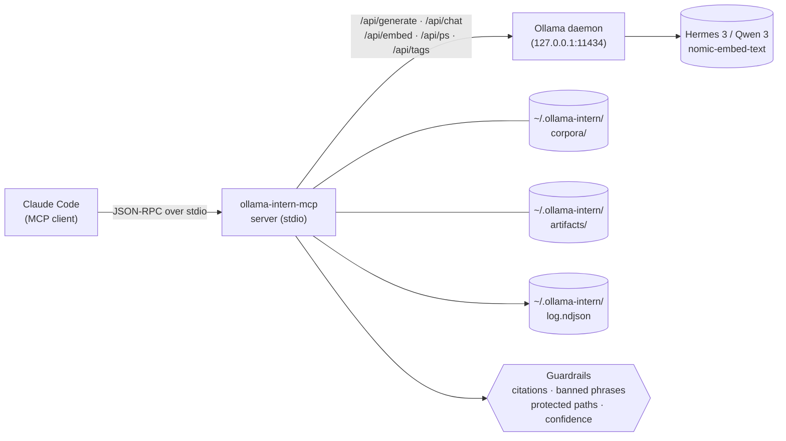

<p align="center">
  <a href="README.ja.md">日本語</a> | <a href="README.zh.md">中文</a> | <a href="README.es.md">Español</a> | <a href="README.fr.md">Français</a> | <a href="README.md">English</a> | <a href="README.it.md">Italiano</a> | <a href="README.pt-BR.md">Português (BR)</a>
</p>

<p align="center">
  
</p>

<p align="center">
  <a href="https://github.com/mcp-tool-shop-org/ollama-intern-mcp/actions"></a>
  <a href="LICENSE"></a>
  <a href="https://mcp-tool-shop-org.github.io/ollama-intern-mcp/"></a>
  <a href="https://mcp-tool-shop-org.github.io/ollama-intern-mcp/handbook/"></a>
</p>

**क्लॉड कोड के लिए स्थानीय इंटर्न।** <!-- TOOL_COUNT:start -->44<!-- TOOL_COUNT:end --> नौकरी से संबंधित उपकरण, प्रमाण-आधारित संक्षिप्त विवरण, टिकाऊ कलाकृतियाँ।

एक एमसीपी सर्वर जो क्लॉड कोड को नियम, स्तर, एक डेस्क और एक फाइलिंग कैबिनेट के साथ एक **स्थानीय इंटर्न** प्रदान करता है। क्लॉड _उपकरण_ का चयन करता है; उपकरण _स्तर_ (तत्काल / वर्कहॉर्स / गहन / एम्बेड) का चयन करता है; स्तर एक ऐसी फ़ाइल लिखता है जिसे आप अगले सप्ताह खोल सकते हैं।

**यह `hermes3:8b` पर [हरमीस एजेंट](https://github.com/NousResearch/hermes-agent) को भी चलाता है** — 2026-04-19 तक पूरी तरह से मान्य। डिफ़ॉल्ट लेडर `hermes3:8b` है; `qwen3:*` वैकल्पिक रेल है। नीचे [हरमीस के साथ उपयोग](#use-with-hermes) देखें।

**हार्डवेयर आवश्यकताएँ:** `hermes3:8b` के लिए लगभग 6 जीबी वीआरएएम, या सीपीयू अनुमान के लिए लगभग 16 जीबी रैम। पूर्ण विवरण के लिए [handbook/getting-started](https://mcp-tool-shop-org.github.io/ollama-intern-mcp/handbook/getting-started/#hardware-minimums) देखें।

**क्या आप क्लॉड का उपयोग नहीं कर रहे हैं?** [`examples/`](./examples/) निर्देशिका में एक न्यूनतम नोड.जेएस और पायथन एमसीपी क्लाइंट है जिसे आप एसटीडीआईओ पर चला सकते हैं। [handbook/with-hermes](https://mcp-tool-shop-org.github.io/ollama-intern-mcp/handbook/with-hermes/) भी देखें।

**स्थानीय-प्रथम** — जब तक आप इसमें शामिल नहीं होते, तब तक शून्य नेटवर्क आउटगोइंग। कोई टेलीमेट्री नहीं। कुछ भी "स्वायत्त" नहीं। प्रत्येक कॉल अपना काम दिखाता है। वैकल्पिक [ओलामा क्लाउड](#ollama-cloud-optional) रूटिंग 600बी-क्लास मॉडल को स्थानीय हार्डवेयर की कमी होने पर समान उपकरणों के पीछे रखता है — स्वचालित रूप से स्थानीय पर वापस जाने के साथ।

---

## v2.9.0 में नया

**क्लाउड सुविधा पास — एक क्रॉस-फ़ैमिली सत्यापन लेन, मांग पर क्लाउड एस्केलेशन और इसे देखने के लिए अर्थशास्त्र।** स्थानीय-प्रथम अपरिवर्तित है: कोई कुंजी सेट नहीं होने पर, व्यवहार v2.8.0 के समान होता है (शून्य आउटगोइंग, कोई स्टार्टअप क्लाउड जांच नहीं)।

- **`ollama_verify_claims` — क्रॉस-फ़ैमिली सत्यापन।** `ollama_code_review` *निष्कर्ष उत्पन्न करता है*; यह *उनका मूल्यांकन* करता है। यह आपके दावों + साक्ष्यों पर एक अलग-परिवार ओलामा क्लाउड प्रमुख पैनल (डिफ़ॉल्ट रूप से डीपसीक / किमी / जीएलएम) चलाता है और प्रति-दावा CONFIRMED / REFUTED / NEEDS_REVIEW लौटाता है। एकत्रीकरण अकेला-असहमति-कभी-निर्णय नहीं लेता है (खंडन करने के लिए ≥2, पुष्टि करने के लिए ≥2), प्रत्येक निर्णायक मॉडल द्वारा सत्यापित होता है (स्थानीय फ़ॉलबैक या प्रतिस्थापित मॉडल को बाहर रखा जाता है, कभी भी गणना नहीं की जाती है), और दावा इनपुट संरचनात्मक रूप से तर्क-मुक्त होते हैं। ईमानदार सीमा प्रलेखित है: एक CONFIRMED सहायक साक्ष्य है, प्रमाण नहीं — सकल त्रुटियों को चिह्नित करने में विश्वसनीय, किसी फ्रंटियर मॉडल की सूक्ष्म त्रुटियों पर कमजोर।
- **प्रति-कॉल क्लाउड एस्केलेशन + स्टैंडबाय मोड।** केवल `OLLAMA_API_KEY` सेट करें (बिना `OLLAMA_CLOUD_PRIMARY` के) और आप **स्टैंडबाय** में हैं: स्थानीय-प्राथमिक, शून्य आउटगोइंग, कोई स्टार्टअप जांच नहीं — जब तक कि एक एकल कॉल `backend:'cloud'` के साथ इसमें शामिल न हो जाए। प्रत्येक कॉल को क्लाउड पर स्विच किए बिना, एक उच्च-दांव समीक्षा को 600बी मॉडल पर बढ़ाएं। पहला एस्केलेशन उस बिंदु पर जोर से आउटगोइंग का खुलासा करता है जिस पर यह होता है; अब प्रति-कॉल `model` ओवरराइड क्लाउड प्रयास के साथ शाब्दिक रूप से चलता है।
- **`ollama_log_stats` — टैगलाइन में वादा किए गए मापे गए अर्थशास्त्र।** आपके एनडीजेएसओएन रसीदों का एक गैर-एलएलएम रोलअप: क्लाउड/स्थानीय विभाजन, क्लाउड → स्थानीय फ़ॉलबैक दर, प्रति उपकरण टोकन, p50/p95 विलंबता, `since` विंडो द्वारा सीमित।
- **सीआई + मशीन-पठनीय उपकरणों के लिए डॉक्टर।** `doctor --json --fail-unhealthy` पाइपलाइनों को एक वास्तविक गेट देता है (एक क्लाउड-जागरूक `healthy` ध्वज के साथ), और प्रत्येक उपकरण अब एमसीपी `readOnlyHint`/`destructiveHint`/`title` एनोटेशन रखता है ताकि ग्राहकों को सही अनुमति यूएक्स मिल सके। इसके अलावा `init --claude` एक पेस्ट-तैयार `.mcp.json` बनाता है।

[CHANGELOG.md](./CHANGELOG.md) में पूर्ण विवरण।

## v2.8.0 में नया

**विश्वसनीयता, स्थायित्व और सुरक्षा सख्त — 25 सुधार, प्रत्येक परीक्षण-प्रथम और क्रॉस-फ़ैमिली-सत्यापित।** स्थानीय-प्रथम व्यवहार अपरिवर्तित है और किसी भी उपकरण अनुबंध को नहीं हटाया गया; मौजूदा कॉलर काम करते रहते हैं। भार वहन करने वाले लाभ:

- **अब कोई मौन कॉर्पस डेटा हानि नहीं।** `ollama_corpus_refresh` के दौरान एक अस्थायी रीड त्रुटि (एक विंडोज फ़ाइल लॉक, एक एंटीवायरस होल्ड, एक संपादक की सहेजने वाली विंडो) ने फ़ाइल को "गायब" के रूप में वर्गीकृत किया और **स्थायी रूप से इसकी अनुक्रमित सामग्री को हटा दिया**। अब केवल वास्तव में अनुपस्थित फ़ाइल ही हटाई जाती है; एक अस्थायी त्रुटि पथ को बरकरार रखती है, इसे पुन: प्रयास के लिए चिह्नित करती है, और इसके टुकड़ों को संरक्षित करती है।
- **एक बजट का सम्मान करने वाली समवर्तीता।** एक स्तर टाइमआउट अब एक कॉल को रद्द कर सकता है जो अभी भी परमिट के लिए कतार में है (यह पहले बजट से अधिक समय तक लटका रहता था जबकि रसीदें अन्यथा दावा करती थीं), और `ollama_chat` अंततः टाइमआउट/स्तर सीम से होकर गुजरता है — इसलिए एक स्थानीय पीढ़ी जो अटक गई है, वह प्रत्येक उपकरण को नहीं रोक सकती है, और यह वास्तव में क्लाउड-प्राथमिक मोड में क्लाउड तक पहुंच जाती है।
- **क्लाउड जो मरने के बजाय कम हो जाता है।** अब सेवानिवृत्त क्लाउड-मॉडल आईडी स्पष्ट `cloud_model_missing` कारण और एक क्लाउड-विशिष्ट संकेत के साथ स्थानीय पर वापस आ जाती है, न कि कुल विफलता; सर्किट ब्रेकर स्थायी रूप से नहीं अटक सकता है; लगातार गायब मॉडल प्रत्येक कॉल पर क्लाउड राउंड-ट्रिप का भुगतान करना बंद कर देता है।
- **सुरक्षा सतह जो इसके दस्तावेज़ों से मेल खाती है।** `ollama_batch_proof_check` अब वास्तव में सीडब्ल्यूडी रोकथाम को लागू करता है (एक नए ऑपरेटर पर्यावरण कैप `INTERN_BATCH_PROOF_ALLOWED_ROOTS` के साथ जिसे एक कॉलर चौड़ा नहीं कर सकता है), प्रॉम्प्ट-इंजेक्शन सैनिटाइज़र ने कवरेज प्राप्त किया + ईमानदारी से प्रकटीत सीमा, और संरक्षित-पथ गार्ड मैकओएस पर भी केस-संवेदनशील है।
- **ईमानदार कलाकृतियाँ और रसीदें।** पैक लेखन परमाणु होते हैं और कभी भी चुपचाप नहीं टकराते हैं; कम हुई बैच लिफाफे वास्तव में उपयोग किए गए स्तर की रिपोर्ट करते हैं; बाधित-लेखन डिटेक्टर किसी भी परिवर्तन पर फटे हुए लेखन को पकड़ता है; अब चंक आईडी समान-सामग्री वाली फ़ाइलों में टकराव नहीं करते हैं। निर्भरता ऑडिट पूरी तरह से स्पष्ट है (0 कमजोरियां)।

[CHANGELOG.md](./CHANGELOG.md) में पूर्ण विवरण।

## v2.7.0 में नया

**वैकल्पिक ओलामा क्लाउड रूटिंग — क्लाउड-प्राथमिक, स्थानीय-बैकअप।** एक कुंजी और एक ध्वज के साथ ऑप्ट इन करें, और जेनरेटिव टियर 600B-क्लास क्लाउड मॉडल पर रूट किए जाएंगे; एम्बेडिंग स्थानीय रूप से रहेंगे; किसी भी क्लाउड विफलता पर एक सर्किट ब्रेकर आपके स्थानीय प्रोफाइल पर वापस आ जाएगा। **डिफ़ॉल्ट रूप से बंद — जब तक आप `OLLAMA_API_KEY` और `OLLAMA_CLOUD_PRIMARY=1` दोनों सेट नहीं करते, तब तक कोई आउटगोइंग डेटा नहीं होगा।** अतिरिक्त मामूली परिवर्तन — v2.7.0 से पहले के कॉलर (और जो ऑप्ट इन नहीं कर रहे हैं) बाइट-समान व्यवहार देखेंगे। [ओलामा क्लाउड (वैकल्पिक)]([#ollama-cloud-optional]) देखें।

- **सुरक्षा जाल के साथ क्लाउड-प्राथमिक।** एक `RoutingOllamaClient` पहले क्लाउड का प्रयास करता है और टाइमआउट / 5xx / 429 / नेटवर्क पर स्थानीय प्रोफाइल पर वापस आ जाता है। खराब कुंजियाँ (401/403) चुपचाप हमेशा के लिए कम होने के बजाय, एक स्टिकी ब्रेकर के माध्यम से स्पष्ट रूप से सामने आती हैं; एक सेवानिवृत्त/गलत क्लाउड मॉडल आईडी (404) भी सामने आता है।
- **कभी भी मौन डाउनग्रेड नहीं।** प्रत्येक एनवेलप `backend` (`cloud`|`local`), `degraded`, और `degrade_reason` प्राप्त करता है ताकि आप हमेशा जान सकें कि आपको बड़े मॉडल के बजाय स्थानीय मॉडल मिला है। एक `backend_fallback` NDJSON इवेंट क्लाउड→स्थानीय बैकअप दर को `ollama_log_tail` में दृश्यमान बनाता है।
- **`ollama_doctor` क्लाउड प्रमाणीकरण + पहुंच क्षमता की रिपोर्ट करता है** एक अलग ब्लॉक के रूप में; `ollama-intern-mcp doctor` एक `Cloud (primary)` अनुभाग दिखाता है।
- डिफ़ॉल्ट क्लाउड मॉडल v2.7.0 रिलीज़ पर `minimax-m3:cloud` था *(क्योंकि इसे `qwen3-coder-next:cloud` पर फिर से पिन किया गया — एक विचारशील डिफ़ॉल्ट, जो सीमित `num_predict` टूल पर खाली उत्तर देता है; [env तालिका](#cloud-env-vars) देखें)*; प्रति-टियर के साथ ओवरराइड करें `INTERN_CLOUD_MODEL` / `INTERN_CLOUD_DEEP_MODEL`।

## v2.6.0 में नया

`ollama_extract` पर प्रति-कॉल टियर-बजट ओवरराइड। अतिरिक्त मामूली परिवर्तन — v2.6.0 से पहले के कॉलर अपरिवर्तित हैं। [CHANGELOG.md](./CHANGELOG.md) में विस्तृत प्रविष्टि।

- **`ollama_extract` पर `tier_budget_ms_override?: number` स्कीमा फ़ील्ड** (वैकल्पिक, सीमित `[1, 600000]` एमएस)। जब मौजूद हो, तो यह ओवरराइड को प्रत्येक टियर पर लागू करता है जिस पर रनर द्वारा दौरा किया जाता है ताकि `src/guardrails/timeouts.ts:61` पर आंतरिक `runWithTimeoutAndFallback` मशीनरी प्रोफ़ाइल डिफ़ॉल्ट के बजाय ऑपरेटर-आपूर्ति किए गए बजट का सम्मान करे। कैस्केड (वर्कहॉर्स → टाइमआउट पर तत्काल) अभी भी ट्रिगर होता है; ओवरराइड प्रत्येक कैस्केड हॉप को समान रूप से नियंत्रित करता है।
- **यह क्यों मौजूद है।** रिसर्च-ओएस R-018 रैपर (v0.12.1) ने MCP `callTool` को `Promise.race` के साथ लपेटा और पाया कि रैपर का बजट आंतरिक टियर तक नहीं पहुंचा — `DEV_RTX5080_TIMEOUTS.instant = 15_000` अभी भी 15000ms पर `TIER_TIMEOUT` ट्रिगर करता है, भले ही 180000ms रैपर बजट हो। v2.6.0 MCP-साइड आधिकारिक बजट प्रदान करता है ताकि ऑपरेटर का `--planner-timeout-ms` ध्वज (रिसर्च-ओएस) अंततः आंतरिक-टियर टाइमआउट को डिज़ाइन के अनुसार नियंत्रित करे।
- **डिफ़ॉल्ट व्यवहार संरक्षित।** फ़ील्ड छोड़ा गया = प्रोफ़ाइल डिफ़ॉल्ट बाइट-समान रूप से नियंत्रित करते हैं। v2.6.0 से पहले के कॉलर में कोई बदलाव नहीं है।
- **R-010 बैकअप-कारण रेगुलर एक्सप्रेशन संरक्षित।** सर्वर-साइड `TIER_TIMEOUT` त्रुटि संदेश अभी भी `/elapsed=(\d+)ms/` + `/budget=(\d+)ms/` से मेल खाता है ताकि डाउनस्ट्रीम में एआई-सलाहकार दृश्यता ओवरराइड और डिफ़ॉल्ट पथ दोनों पर काम करे।
- रिसर्च-ओएस v0.13.0 द्वारा उपयोग किया जाता है (संचयी R-019 क्लाइंट वायर-अप + R-020 + R-021) एक समन्वित मल्टी-रिपो रिलीज़ में।

### ऐतिहासिक — v2.4.0 वितरण योग्य

v2.4.0 प्रविष्टि के लिए [CHANGELOG.md](./CHANGELOG.md) और [docs/release-notes/v2.4.0.md](./docs/release-notes/v2.4.0.md) देखें (प्रोफ़ाइल सिस्टम पर प्रति-टियर `num_ctx` नियंत्रण)।

## v2.4.0 में नया

प्रोफ़ाइल सिस्टम पर प्रति-टियर `num_ctx` (संदर्भ विंडो) नियंत्रण। अतिरिक्त मामूली परिवर्तन — v2.3.0 कॉलर अपरिवर्तित हैं। [CHANGELOG.md](./CHANGELOG.md) और [docs/release-notes/v2.4.0.md](./docs/release-notes/v2.4.0.md) में विस्तृत प्रविष्टियाँ।

- **`TierConfig.num_ctx` मानचित्र (नया)** — प्रोफ़ाइल पर वैकल्पिक `{ instant?, workhorse?, deep?, embed? }`। जब किसी टियर के लिए सेट किया जाता है, तो MCP सर्वर प्रत्येक Ollama जनरेट/चैट अनुरोध पर `options.num_ctx = <value>` रखता है जो उस टियर पर रूट किया गया है (प्रारंभिक + बैकअप)। जब अनसेट किया जाता है, तो अनुरोध पूरी तरह से `num_ctx` को छोड़ देता है ताकि Ollama अपने मॉडल-लोड किए गए डिफ़ॉल्ट का उपयोग करे — v2.3.0 व्यवहार बिल्कुल संरक्षित।
- **नया एनवेलप फ़ील्ड `num_ctx_used?: number`** — केवल तभी मौजूद होता है जब MCP सर्वर वास्तव में `num_ctx` भेजता है। अनुपस्थित जब अनुरोध Ollama को चुनने देता है। डिफ़ॉल्ट का अनुमान न लगाएं — MCP सर्वर प्रभावी मान के लिए Ollama से क्वेरी नहीं करता है।
- **प्रोफ़ाइल डिफ़ॉल्ट**: `dev-rtx5080` / `dev-rtx5080-qwen3` में `instant: 4096`, `workhorse: 8192`, `deep`/`embed` अनसेट के साथ शिप किया जाता है। RTX 5080 के 16GB VRAM बजट के लिए तेज़ टूल के लिए `hermes3:8b` को निवासी रखने के लिए आकार दिया गया। `m5-max` प्रत्येक टियर को अनसेट छोड़ देता है — 128GB एकीकृत मेमोरी में कोई स्पिल समस्या नहीं है।
- **v0.8.0 चरण 1 निदान बंद करता है** — RTX 5080 पर डिफ़ॉल्ट 32K संदर्भ पर `hermes3:8b` CPU में फैल गया और वर्कहॉर्स `ollama_extract` कॉल को समय समाप्त करना शुरू कर दिया। v2.4.0 प्रोफ़ाइल परत पर इसे रोकता है।

### प्रति-टियर `num_ctx` नियंत्रण (v2.4.0 में नया)

प्रोफ़ाइल (src/profiles.ts से उद्धरण):

```ts
"dev-rtx5080": {
  tiers: {
    instant: "hermes3:8b",
    workhorse: "hermes3:8b",
    deep: "hermes3:8b",
    embed: "nomic-embed-text",
    num_ctx: {
      instant: 4096,    // fast classify/summarize
      workhorse: 8192,  // schema-bound extract / batch
      // deep: UNSET — long-context briefs keep current behavior
      // embed: UNSET — no context-window pressure on embed
    },
  },
  // ... timeouts, prewarm
}
```

वर्कहॉर्स-टियर कॉल पर एनवेलप (उदाहरण के लिए, `ollama_extract`):

```jsonc
{
  "result": { /* extracted data */ },
  "tier_used": "workhorse",
  "model": "hermes3:8b",
  "num_ctx_used": 8192,        // present because the profile set workhorse=8192
  // ... rest of envelope unchanged
}
```

`m5-max` (या किसी भी प्रोफ़ाइल) पर जो एक टियर को अनसेट छोड़ देता है, `num_ctx_used` एनवेलप से अनुपस्थित होता है और Ollama को वायर अनुरोध में `num_ctx` फ़ील्ड शामिल नहीं होता है — Ollama अपने मॉडल-लोड किए गए डिफ़ॉल्ट का उपयोग करता है।

ऑपरेटर प्रोफ़ाइल का चयन/संपादित करके ट्यून करते हैं; टूल स्कीमा पर प्रति-कॉल `num_ctx` इनपुट नहीं है। यदि भविष्य में कोई कॉल आवश्यकता को सामने लाता है, तो पैटर्न v2.3.0 के `model` ओवरराइड का अनुसरण करता है।

### ऐतिहासिक — v2.3.0 वितरण योग्य

v2.3.0 प्रविष्टि के लिए [CHANGELOG.md](./CHANGELOG.md) और [docs/release-notes/v2.3.0.md](./docs/release-notes/v2.3.0.md) देखें (LLM-समर्थित एटम टूल में प्रति-कॉल मॉडल ओवरराइड)।

## v2.3.0 में नया

LLM-समर्थित एटम टूल में प्रति-कॉल मॉडल ओवरराइड। अतिरिक्त मामूली परिवर्तन — v2.2.0 कॉलर अपरिवर्तित हैं। [CHANGELOG.md](./CHANGELOG.md) और [docs/release-notes/v2.3.0.md](./docs/release-notes/v2.3.0.md) में विस्तृत प्रविष्टियाँ।

- **वैकल्पिक `model: string` इनपुट 8 एटम टूल पर** - `ollama_extract`, `ollama_classify`, `ollama_summarize_fast`, `ollama_summarize_deep`, `ollama_research`, `ollama_corpus_answer`, `ollama_chat`, `ollama_code_citation`. टूल के स्तर पर पहला प्रयास कॉलर द्वारा निर्दिष्ट मॉडल के विरुद्ध चलाया जाता है; टाइमआउट होने पर, मौजूदा `TIER_FALLBACK` कैस्केड सस्ते स्तर के अपने मॉडल को हल करता है (कॉलर के ओवरराइड को नहीं)। कंपोजिट/संक्षिप्त/पैक टूल जानबूझकर `model` स्वीकार नहीं करते हैं - एटम को प्रति-कॉल नियंत्रण मिलता है, कंपोजिट डिफ़ॉल्ट स्तर का उपयोग करते हैं।
- **नया एनवेलप फ़ील्ड `model_requested?: string`** - केवल तभी मौजूद होता है जब ओवरराइड प्रदान किया गया हो। कैलिब्रेशन-जागरूक कॉलर `model_requested` की तुलना `model` से करते हैं ताकि फॉलबैक प्रतिस्थापन का पता लगाया जा सके: `if (env.model_requested && env.model !== env.model_requested) { /* substitution */ }`. खाली / केवल व्हाइटस्पेस वाले इनपुट स्कीमा पार्स पर `ZodError` उत्पन्न करते हैं, मौन रूप से आगे नहीं बढ़ते।
- **बग फिक्स - `src/version.ts` में बदलाव।** रनटाइम `VERSION` स्थिरांक अब मॉड्यूल लोड होने पर `package.json` से पढ़ा जाता है; v2.1.0 और v2.2.0 ने `"2.0.0"` पहचान स्ट्रिंग की पुरानी रिपोर्ट के साथ शिप किया था। नया `tests/version.test.ts` `VERSION === pkg.version` को लॉक करता है।

### प्रति-कॉल मॉडल ओवरराइड (v2.3.0 में नया)

```jsonc
{
  "tool": "ollama_classify",
  "arguments": {
    "text": "patch null pointer in auth",
    "labels": ["feat", "fix", "chore"],
    "frame": "what is the change kind?",
    "model": "hermes3:8b"
  }
}
```

एनवेलप:

```jsonc
{
  "result": { "label": "fix", "confidence": 0.9, "off_topic": false, ... },
  "tier_used": "instant",
  "model": "hermes3:8b",
  "model_requested": "hermes3:8b",       // present because override was supplied
  // ... rest of envelope unchanged
}
```

यदि वर्कहॉर्स/डीप स्तर पर टाइमआउट हो गया और कॉल इंस्टेंट स्तर तक बढ़ गई, तो `env.model` इंस्टेंट स्तर के हल किए गए मॉडल होगा और `env.fallback_from` `"workhorse"` होगा - `env.model_requested` अभी भी `"hermes3:8b"` होगा, और `env.model !== env.model_requested` प्रतिस्थापन संकेत है। ओवरराइड को जानबूझकर सस्ते स्तर पर नहीं ले जाया जाता है; चुना गया मॉडल उस स्तर की भूमिका के लिए उपयुक्त नहीं हो सकता है।

### ऐतिहासिक - v2.2.0 डिलीवरी

पूर्ण v2.2.0 प्रविष्टि (फ़्रेम-बाउंड सामयिकता + संरचित परित्याग) के लिए [CHANGELOG.md](./CHANGELOG.md) और [docs/release-notes/v2.2.0.md](./docs/release-notes/v2.2.0.md) देखें।

## v2.2.0 में नया

स्थानीय साक्ष्य-कार्यकर्ता भूमिका अनुबंध: फ्रेम-बाउंड सामयिकता और संरचित परित्याग। योज्य मामूली - v2.1.0 कॉलर अपरिवर्तित। [CHANGELOG.md](./CHANGELOG.md) और [docs/release-notes/v2.2.0.md](./docs/release-notes/v2.2.0.md) में विस्तृत प्रविष्टियाँ।

- `ollama_extract`, `ollama_classify`, `ollama_summarize_fast`, `ollama_summarize_deep` पर **फ़्रेम-बाउंड निष्कर्षण** - वैकल्पिक `frame: string` इनपुट + संरचित `frame_alignment` / `on_topic` / `frame_addressed` आउटपुट। स्कीमा में पुन: वाक्यांशित करने के बजाय, गैर-विषयगत स्रोतों को चिह्नित किया जाता है।
- `ollama_research` पर **संरचित परित्याग** - `weak` / `abstained` / `sources_address_question` फ़ील्ड। खाली `citations[]` जिसमें खाली नहीं `answer` है, अब मौन सफलता नहीं है।
- `ollama_corpus_answer` पर **सामयिकता सीमा** - वैकल्पिक `min_top_score`. न्यूनतम से नीचे, टूल `abstained: true` के साथ शॉर्ट-सर्किट करता है और संश्लेषण को छोड़ देता है। प्रत्येक उद्धरण पर प्रति-उद्धरण `score` अब दिखाई देता है।
- **संक्षिप्त साक्ष्य के माध्यम से पुनर्प्राप्ति स्कोर का संरक्षण** - `corpusHitsToEvidence` `score` (और `corpus_min_evidence_score` नॉब) को असेंबली समय पर `incident_brief` / `repo_brief` / `change_brief` पर ले जाता है।
- **उद्धरण पंक्ति-श्रेणी सीमाएँ** - `guardrails/citations.ts` `ollama_research` पर सीमा से बाहर की श्रेणियों को अस्वीकार करता है, जो मौजूदा `ollama_code_citation` पर मौजूद रुख से मेल खाता है।
- **ऑपरेटर-अनुबंध दस्तावेज़ सही किए गए** - README `chunk_id`/`chunk_index` फिक्स, "सर्वर-साइड पर मान्य" वाक्यांश को फिर से लिखा गया, साक्ष्य कानून अनुभाग योग्य, विपणन नारा एनोटेट किया गया।

### बीज प्रतिगमन - सत्यापन

स्लाइस के अनुबंध को शाब्दिक अनुसंधान-ओएस ताजा-पैक विफलता के विरुद्ध सत्यापित किया जाता है: arxiv 2112.10422 (कॉस्मोलॉजिकल स्टैंडर्ड टाइमर) अनुभाग-01 फ्रेम *"स्थानीय-प्रथम बनाम क्लाउड एलएलएम डीप-रिसर्च वर्कफ़्लो में साक्ष्य हिरासत का क्या अर्थ है?"* - 9 / 9 मॉक-एलएलएम अनुबंध परीक्षण पुष्टि करते हैं कि गैर-विषयगत स्रोत अब समाहित है (`frame_alignment.on_topic = false` पर निष्कर्षण; `off_topic: true` पर वर्गीकरण; `frame_addressed: false` पर summarize_deep; `abstained: true` पर corpus_answer जिसमें `min_top_score` सेट है)।

### ऐतिहासिक - v2.1.0 डिलीवरी

पूर्ण v2.1.0 प्रविष्टि (फ़ीचर पास: 13 नए उपकरण + 4 संवर्द्धन + फ़्रीज़ लिफ्ट) के लिए [CHANGELOG.md](./CHANGELOG.md) देखें।

---

## आर्किटेक्चर एक नज़र में


```mermaid
flowchart LR
  Claude["Claude Code<br/>(MCP client)"]
  MCP["ollama-intern-mcp<br/>server (stdio)"]
  Ollama["Ollama daemon<br/>(127.0.0.1:11434)"]
  Models[("Hermes 3 / Qwen 3<br/>nomic-embed-text")]
  Corpus[("~/.ollama-intern/<br/>corpora/")]
  Artifacts[("~/.ollama-intern/<br/>artifacts/")]
  NDJSON[("~/.ollama-intern/<br/>log.ndjson")]
  Guards{{"Guardrails<br/>citations · banned phrases<br/>protected paths · confidence"}}

  Claude -- "JSON-RPC over stdio" --> MCP
  MCP --> Guards
  MCP -- "/api/generate · /api/chat<br/>/api/embed · /api/ps · /api/tags" --> Ollama
  Ollama --> Models
  MCP --- Corpus
  MCP --- Artifacts
  MCP --> NDJSON
```

प्रत्येक क्लाउड टूल कॉल stdio JSON-RPC पर एमसीपी सर्वर में प्रवेश करता है। सर्वर टूल के [zod](https://zod.dev) स्कीमा के विरुद्ध कॉल को मान्य करता है, कॉन्फ़िगर किए गए गार्डरेल चलाता है (उद्धरण सत्यापन, प्रतिबंधित-वाक्यांश स्ट्रिप, संरक्षित-पथ प्रवर्तन, आत्मविश्वास सीमाएँ), फिर या तो एक नियतात्मक रेंडरर (आर्टिफैक्ट स्तर) या ओलामा एचटीटीपी कॉल (प्रत्येक अन्य स्तर) पर रूट करता है। ओलामा डेमॉन कभी भी उपयोगकर्ता द्वारा प्रदान किए गए पथों को नहीं देखता है - केवल मॉडल स्तर और तैयार प्रॉम्प्ट। प्रत्येक कॉल `~/.ollama-intern/log.ndjson` पर NDJSON लॉग में एक संरचित ईवेंट जोड़ता है, जहाँ `ollama_log_tail` और आपका शेल इसे पढ़ सकता है।

---

## प्रमुख उदाहरण - एक कॉल, एक आर्टिफैक्ट

```jsonc
// Claude → ollama-intern-mcp
{
  "tool": "ollama_incident_pack",
  "arguments": {
    "title": "sprite pipeline 5 AM paging regression",
    "logs": "[2026-04-16 05:07] worker-3 OOM killed\n[2026-04-16 05:07] ollama /api/ps reports evicted=true size=8.1GB\n...",
    "source_paths": ["F:/AI/sprite-foundry/src/worker.ts", "memory/sprite-foundry-visual-mastery.md"]
  }
}
```

डिस्क पर एक फ़ाइल की ओर इशारा करते हुए एक एनवेलप लौटाता है:

```jsonc
{
  "result": {
    "pack": "incident",
    "slug": "2026-04-16-sprite-pipeline-5-am-paging-regression",
    "artifact_md":   "~/.ollama-intern/artifacts/incident/2026-04-16-sprite-pipeline-5-am-paging-regression.md",
    "artifact_json": "~/.ollama-intern/artifacts/incident/2026-04-16-sprite-pipeline-5-am-paging-regression.json",
    "weak": false,
    "evidence_count": 6,
    "next_checks": ["residency.evicted across last 24h", "OLLAMA_MAX_LOADED_MODELS vs loaded size"]
  },
  "tier_used": "deep",
  "model": "hermes3:8b",
  "hardware_profile": "dev-rtx5080",
  "tokens_in": 4180, "tokens_out": 612,
  "elapsed_ms": 8410,
  "residency": { "in_vram": true, "evicted": false }
}
```

→ `weak: false` का अर्थ है ≥2 साक्ष्य आइटम एकत्र किए गए थे; इसका मतलब यह नहीं है कि परिकल्पनाओं को मान्य किया गया है। नीचे [साक्ष्य कानून](#evidence-laws) देखें।

वह मार्कडाउन फ़ाइल इंटर्न के डेस्क आउटपुट है - शीर्षक, उद्धृत आईडी के साथ साक्ष्य ब्लॉक, जांच `next_checks`, यदि साक्ष्य पतला है तो `weak: true` बैनर। यह नियतात्मक है: रेंडरर कोड है, प्रॉम्प्ट नहीं। (रेंडरर नियतात्मक है; परिकल्पनाओं और सतहों की *सामग्री* जनरेटिव है - उन्हें मसौदा के रूप में पढ़ें, सत्यापित नहीं)। इसे कल खोलें, अगले सप्ताह इसकी तुलना करें, `ollama_artifact_export_to_path` का उपयोग करके इसे एक हैंडबुक में निर्यात करें।

इस श्रेणी में प्रत्येक प्रतियोगी "टोकन सहेजें" से शुरुआत करता है। हम कहते हैं _यह वह फ़ाइल है जो इंटर्न ने लिखी है।_

### दूसरा उदाहरण - एक कॉर्पस बनाएं, फिर उससे पूछें

```jsonc
// 1. Build a persistent, searchable corpus over your project.
{ "tool": "ollama_corpus_index",
  "arguments": { "name": "sprite-foundry",
                 "paths": ["F:/AI/sprite-foundry/src"],
                 "embed_model": "nomic-embed-text" } }
// → { chunks_written: 1204, paths_indexed: 312, failed_paths: [] }

// 2. Ask an evidence-bound question against it.
{ "tool": "ollama_corpus_answer",
  "arguments": { "name": "sprite-foundry",
                 "query": "how does the worker handle OOM eviction?",
                 "top_k": 8 } }
// → { answer: "...", citations: [{chunk_index, path}...], weak: false }
```

सर्वर उद्धरण की पहचान को मान्य करता है और यह सुनिश्चित करता है कि प्रत्येक `chunk_index` प्राप्त किए गए परिणामों की सीमा में हो। यह यह साबित नहीं करता है कि उत्पन्न किया गया प्रत्येक दावा उद्धृत अंश सामग्री द्वारा अर्थपूर्ण रूप से समर्थित है - यह मॉडल की जिम्मेदारी है, और कमजोर पुनर्प्राप्ति अभी भी उद्धरण-जैसी प्रतिक्रियाएँ उत्पन्न कर सकती है। पूरी जानकारी [हैंडबुक/कॉर्पुरा](https://mcp-tool-shop-org.github.io/ollama-intern-mcp/handbook/corpora/) में दी गई है।

---

## फ़्रेम-बाउंड निष्कर्षण (v2.2.0 में नया)

`ollama_extract`, `ollama_classify`, `ollama_summarize_fast` और `ollama_summarize_deep` एक वैकल्पिक `frame: string` इनपुट स्वीकार करते हैं। फ़्रेम उस प्रश्न को निर्दिष्ट करता है जिसका उत्तर स्रोत से पूछा जा रहा है; मॉडल को यह निर्देश दिया जाता है कि यदि स्रोत फ़्रेम का समाधान नहीं करता है तो वह सत्य लेकिन विषय से अलग सामग्री उत्पन्न करने के बजाय, प्रतिक्रिया देने से इनकार कर दे।

```jsonc
{
  "tool": "ollama_extract",
  "arguments": {
    "text": "<long source document>",
    "schema": { /* your fields */ },
    "frame": "section purpose here — e.g. 'OOM eviction behavior in the sprite worker'"
  }
}
// → result includes frame_alignment: { on_topic: boolean, reason: string, unaddressed_aspects: string[] }
```

यदि `frame` को छोड़ दिया जाता है, तो व्यवहार v2.1.0 से अपरिवर्तित रहता है। जब प्रदान किया जाता है, तो `frame_alignment.on_topic = false` यह संकेत देता है कि निकाले गए फ़ील्ड स्रोत के लिए सत्य हो सकते हैं लेकिन फ़्रेम के लिए प्रासंगिक नहीं हैं - इसे `weak: true` संक्षिप्त रूप के समान मानें: उपयोगी, लेकिन डाउनस्ट्रीम साक्ष्य में बढ़ावा देने से पहले सावधानीपूर्वक जांच करें।

---

## अस्वीकृति अनुबंध (v2.2.0 में नया)

`ollama_research` संरचित अस्वीकृति फ़ील्ड लौटाता है: `weak: boolean`, `abstained: boolean`, `sources_address_question: boolean | null`. एक खाली `citations[]` जिसमें एक गैर-खाली `answer` हो, अब चुप नहीं रहता - `abstained: true` इंगित करता है कि मॉडल संश्लेषित करने से इनकार कर देता है क्योंकि कॉलर द्वारा प्रदान किए गए पथ प्रश्न का समाधान नहीं करते हैं। अस्वीकृति को विफलता के बजाय सफलता के रूप में मानें: यह उपकरण कमजोर पुनर्प्राप्ति को आधिकारिक आउटपुट में बदलने से इनकार कर रहा है।

`ollama_corpus_answer` एक वैकल्पिक `min_top_score: number` विषयगत सीमा (0.0–1.0) स्वीकार करता है। जब किसी क्वेरी के लिए शीर्ष पुनर्प्राप्ति स्कोर `min_top_score` से नीचे गिर जाता है, तो उपकरण `abstained: true` के साथ जल्दी समाप्त हो जाता है और संश्लेषण को छोड़ देता है - "स्कोर 0.21 पर 5 विषय से अलग अंश अभी भी एक पूर्ण उत्तर उत्पन्न करते हैं" विफलता मोड को रोकता है जिसे v2.1.0 `weak: true` नियम ने नहीं पकड़ा था (`weak: true` केवल तभी सक्रिय होता है जब `hits.length < 2`)। प्रत्येक उद्धरण पर नए सिरे से सामने आए `score` फ़ील्ड के साथ इसे जोड़ें ताकि लिफाफे से सीधे पुनर्प्राप्ति गुणवत्ता का ऑडिट किया जा सके।

---

## यहां क्या है - चार स्तर, <!-- TOOL_COUNT:start -->44<!-- TOOL_COUNT:end --> उपकरण

**कार्य-आधारित** का अर्थ है कि प्रत्येक उपकरण एक ऐसे कार्य को निर्दिष्ट करता है जिसे आप किसी इंटर्न को सौंपेंगे - इसे वर्गीकृत करें, यह निकालें, इन लॉगों की जांच करें, इस रिलीज़ नोट का मसौदा तैयार करें, इस घटना को पैक करें। उपकरण का इनपुट नौकरी विनिर्देश है; आउटपुट डिलिवरेबल है। शीर्ष पर कोई सामान्य `run_model` / `chat_with_llm` प्रिमिटिव नहीं है।

| स्तर | गणना | यहां क्या मौजूद है |
|---|---|---|
| **Atoms** | 31 | कार्य-आधारित प्रिमिटिव। **मूल 15:** `classify`, `extract`, `triage_logs`, `summarize_fast` / `deep`, `draft`, `research`, `corpus_search` / `answer` / `index` / `refresh` / `list`, `embed_search`, `embed`, `chat`. **v2.1.0 में +13 जोड़े गए:** `doctor`, `log_tail`, `batch_proof_check` (ऑप्स); `code_map`, `code_citation`, `multi_file_refactor_propose`, `refactor_plan` (रिफैक्टर); `artifact_prune`, `hypothesis_drill` (आर्टिफैक्ट/संक्षिप्त); `corpus_health`, `corpus_amend`, `corpus_amend_history`, `corpus_rerank` (कॉर्पस)। **+1 समीक्षा परमाणु:** `code_review` (संरचित पीआर-समीक्षा निष्कर्ष, मुख्य; केवल समीक्षा)। **v2.9 में +2:** `verify_claims` (क्रॉस-फ़ैमिली क्लाउड प्रमुख पैनल दावों का मूल्यांकन करता है; क्लाउड की आवश्यकता) और `log_stats` (एनडीजेएसओएन रसीदों को मापे गए अर्थशास्त्र में एकत्रित करें - क्लाउड/स्थानीय विभाजन, विफलता दर, प्रति उपकरण p50/p95; कोई मॉडल कॉल नहीं)। बैच-सक्षम परमाणु (`classify`, `extract`, `triage_logs`) `items: [{id, text}]` स्वीकार करते हैं। |
| **Briefs** | 3 | साक्ष्य-समर्थित संरचित ऑपरेटर संक्षिप्त विवरण। `incident_brief`, `repo_brief`, `change_brief`. प्रत्येक दावा एक साक्ष्य आईडी का हवाला देता है; अज्ञात सर्वर-साइड पर हटा दिए जाते हैं। कमजोर साक्ष्य `weak: true` के बजाय नकली कथा प्रस्तुत करते हैं। |
| **Packs** | 3 | निश्चित-पाइपलाइन यौगिक कार्य जो स्थायी मार्कडाउन + JSON को `~/.ollama-intern/artifacts/` में लिखते हैं। `incident_pack`, `repo_pack`, `change_pack`. नियतात्मक रेंडरर - आर्टिफैक्ट आकार पर कोई मॉडल कॉल नहीं। |
| **Artifacts** | 7 | पैक आउटपुट पर निरंतरता सतह। `artifact_list` / `read` / `diff` / `export_to_path`, साथ ही तीन नियतात्मक स्निपेट: `incident_note`, `onboarding_section`, `release_note`. |

कुल: **31 परमाणु + 3 संक्षिप्त विवरण + 3 पैक + 7 आर्टिफैक्ट उपकरण = <!-- TOOL_COUNT:start -->44<!-- TOOL_COUNT:end -->**।

फ्रीज लाइनें:
- परमाणु: v2.1.0 पर **उठाया गया फ्रीज** (आज 31; +13 को v2.1.0 सुविधा पास में जोड़ा गया, बाद में +1 `code_review`, v2.9 में +2: `verify_claims`, `log_stats`)। नए परमाणुओं के लिए अभी भी ऑडिट-समर्थित अंतर, परीक्षण, हैंडबुक पृष्ठ और चेंजलॉग प्रविष्टि की आवश्यकता होती है - कोई आकस्मिक जोड़ नहीं।
- पैक 3 पर जमे हुए। कोई नया पैक प्रकार नहीं।
- आर्टिफैक्ट स्तर 7 पर जमा हुआ।

पूर्ण उपकरण संदर्भ [हैंडबुक](https://mcp-tool-shop-org.github.io/ollama-intern-mcp/handbook/tools/) में है।

---

## स्थापित करें

स्थानीय रूप से चल रहे [ओलामा](https://ollama.com) और खींचे गए स्तर मॉडल की आवश्यकता होती है (नीचे [मॉडल खींचना](#model-pulls) देखें)।

### क्लाउड कोड (अनुशंसित)

अधिकांश उपयोगकर्ता इसे अपने क्लाउड कोड एमसीपी सर्वर कॉन्फ़िगरेशन में जोड़कर स्थापित करते हैं - वैश्विक स्थापना की आवश्यकता नहीं है। क्लाउड कोड `npx` के माध्यम से मांग पर सर्वर चलाता है:

```json
{
  "mcpServers": {
    "ollama-intern": {
      "command": "npx",
      "args": ["-y", "ollama-intern-mcp"],
      "env": {
        "OLLAMA_HOST": "http://127.0.0.1:11434",
        "INTERN_PROFILE": "dev-rtx5080"
      }
    }
  }
}
```

### क्लाउड डेस्कटॉप

समान ब्लॉक, `~/Library/Application Support/Claude/claude_desktop_config.json` (macOS) या `%APPDATA%\Claude\claude_desktop_config.json` (विंडोज) में लिखा गया।

### वैश्विक स्थापना (उन्नत)

केवल तभी आवश्यक है जब आप क्लाउड कोड के बाहर एड-हॉक उपयोग के लिए अपने `PATH` पर बाइनरी चाहते हैं:

```bash
npm install -g ollama-intern-mcp
```

### हरमेस के साथ प्रयोग करें

यह एमसीपी [हर्मेस एजेंट](https://github.com/NousResearch/hermes-agent) के साथ `hermes3:8b` पर ओलामा (2026-04-19) में एंड-टू-एंड मान्य किया गया था। हर्मेस एक बाहरी एजेंट है जो इस एमसीपी की स्थिर आदिम सतह पर *कॉल करता* है - यह योजना बनाता है, और हम काम करते हैं।

संदर्भ कॉन्फ़िगरेशन (इस रिपॉजिटरी में [hermes.config.example.yaml](hermes.config.example.yaml)):

```yaml
model:
  provider: custom
  base_url: http://localhost:11434/v1
  default: hermes3:8b
  context_length: 65536    # Hermes requires 64K floor under model.*

providers:
  local-ollama:
    name: local-ollama
    base_url: http://localhost:11434/v1
    api_mode: openai_chat
    api_key: ollama
    model: hermes3:8b

mcp_servers:
  ollama-intern:
    command: npx
    args: ["-y", "ollama-intern-mcp"]
    env:
      OLLAMA_HOST: http://localhost:11434
      INTERN_PROFILE: dev-rtx5080
      # hermes3:8b is the default ladder in v2.0.0, so tier overrides are
      # only needed if you're pinning a different local model.
```

**प्रॉम्प्ट का स्वरूप मायने रखता है।** अनिवार्य टूल-इनवोकेशन प्रॉम्प्ट ("आर्ग्स के साथ X को कॉल करें...") एकीकरण परीक्षण हैं - वे 8B स्थानीय मॉडल को पर्याप्त ढांचा प्रदान करते हैं ताकि स्वच्छ `tool_calls` उत्पन्न हो सकें। सूची-स्वरूप बहु-कार्य प्रॉम्प्ट ("A करें, फिर B, फिर C") बड़े मॉडलों के लिए क्षमता बेंचमार्क हैं; 8B पर सूची-स्वरूप विफलता को "वायरिंग टूट गई है" के रूप में न समझें। पूर्ण एकीकरण वॉकथ्रू + ज्ञात परिवहन संबंधी सावधानियों (ओलामा `/v1` स्ट्रीमिंग + ओपनएआई-एसडीके गैर-स्ट्रीमिंग शिम) के लिए [handbook/with-hermes](https://mcp-tool-shop-org.github.io/ollama-intern-mcp/handbook/with-hermes/) देखें।

### मॉडल पुल

**डिफ़ॉल्ट देव प्रोफ़ाइल (आरटीएक्स 5080 16 जीबी और समान):**

```bash
ollama pull hermes3:8b
ollama pull nomic-embed-text
export OLLAMA_MAX_LOADED_MODELS=2
export OLLAMA_KEEP_ALIVE=-1
```

**क्वेन 3 वैकल्पिक रेल (समान हार्डवेयर, क्वेएन टूलिंग के लिए):**

```bash
ollama pull qwen3:8b
ollama pull qwen3:14b
ollama pull nomic-embed-text
export INTERN_PROFILE=dev-rtx5080-qwen3
```

**एम5 मैक्स प्रोफ़ाइल (128 जीबी एकीकृत):**

```bash
ollama pull qwen3:14b
ollama pull qwen3:32b
ollama pull nomic-embed-text
export INTERN_PROFILE=m5-max
```

प्रति-स्तरीय पर्यावरण चर (`INTERN_TIER_INSTANT`, `INTERN_TIER_WORKHORSE`, `INTERN_TIER_DEEP`, `INTERN_EMBED_MODEL`) अभी भी एक बार के उपयोग के लिए प्रोफ़ाइल विकल्पों को ओवरराइड करते हैं।

---

## एकसमान लिफाफा

प्रत्येक टूल समान स्वरूप लौटाता है:

```ts
{
  result: <tool-specific>,
  tier_used: "instant" | "workhorse" | "deep" | "embed",
  model: string,
  hardware_profile: string,     // "dev-rtx5080" | "dev-rtx5080-qwen3" | "m5-max"
  tokens_in: number,
  tokens_out: number,
  elapsed_ms: number,
  residency: {
    in_vram: boolean,
    size_bytes: number,
    size_vram_bytes: number,
    evicted: boolean
  } | null
}
```

`residency` ओलामा के `/api/ps` से आता है। जब `evicted: true` या `size_vram < size` होता है, तो मॉडल डिस्क पर पेज किया जाता है और अनुमान 5-10 गुना कम हो जाता है - इसे उपयोगकर्ता को बताएं ताकि वे जान सकें कि ओलामा को पुनरारंभ करना है या लोड किए गए मॉडल की संख्या को कम करना है।

[ओलामा क्लाउड](#ollama-cloud-optional) मोड में, लिफाफे में `backend` (`"cloud"` | `"local"`) और, क्लाउड से स्थानीय फॉलबैक पर, `degraded: true` + `degrade_reason` भी होता है। ये फ़ील्ड डिफ़ॉल्ट स्थानीय-केवल पथ में **अनुपस्थित** हैं, इसलिए मौजूदा उपभोक्ता अप्रभावित रहते हैं। क्लाउड-आधारित कॉल के लिए `residency` `null` है (स्टेटलेस क्लाउड में कोई स्थानीय-वीआरएएम निवास नहीं है)।

प्रत्येक कॉल को एक एनडीजेएसओएन लाइन के रूप में `~/.ollama-intern/log.ndjson` में लॉग किया जाता है। प्रकाशित बेंचमार्क से देव नंबरों को दूर रखने के लिए `hardware_profile` द्वारा फ़िल्टर करें।

---

## हार्डवेयर प्रोफ़ाइल

| प्रोफ़ाइल | तत्काल | वर्कहॉर्स | गहरा | एम्बेड |
|---|---|---|---|---|
| **`dev-rtx5080`** (डिफ़ॉल्ट) | hermes3 8B | hermes3 8B | hermes3 8B | nomic-embed-text |
| `dev-rtx5080-qwen3` | qwen3 8B | qwen3 8B | qwen3 14B | nomic-embed-text |
| `m5-max` | qwen3 14B | qwen3 14B | qwen3 32B | nomic-embed-text |

**डिफ़ॉल्ट देव** सभी तीन वर्क टियर को `hermes3:8b` पर समेकित करता है - मान्य हर्मेस एजेंट एकीकरण पथ। ऊपर से नीचे तक समान मॉडल का मतलब है कि खींचने के लिए केवल एक चीज, निवास लागत और समझने के लिए व्यवहार का एक सेट है। जो उपयोगकर्ता क्वेएन 3 (इसके `THINK_BY_SHAPE` प्लंबिंग के साथ) पसंद करते हैं, वे `dev-rtx5080-qwen3` में ऑप्ट इन करते हैं। `m5-max` एकीकृत मेमोरी के लिए आकार दिया गया क्वेएन 3 सीढ़ी है।

---

## ओलामा क्लाउड (वैकल्पिक)

स्थानीय 8B मॉडल वह हार्डवेयर बाधा है जिससे अधिकांश लोग प्रभावित होते हैं। [ओलामा क्लाउड](https://ollama.com/cloud) **समान** `/api/*` सतह के पीछे 600B-क्लास मॉडल प्रदान करता है, इसलिए आप भारी उपकरणों को बहुत मजबूत मॉडल पर रूट कर सकते हैं और स्थानीय वीआरएएम को मुक्त कर सकते हैं - जबकि स्थानीय को हमेशा चालू रहने वाले फॉलबैक के रूप में रखते हैं।

**यह ऑप्ट-इन है और डिफ़ॉल्ट रूप से बंद है।** कोई भी कुंजी सेट न होने पर, पैकेज शून्य इग्रेस के साथ स्थानीय-प्रथम रहता है - जो कोई भी ऑप्ट इन नहीं करता है वह अप्रभावित रहता है। ऑप्ट इन करने के दो तरीके हैं:

- **क्लाउड-प्राथमिक** (नीचे): *दोनों* `OLLAMA_CLOUD_PRIMARY=1` और `OLLAMA_API_KEY` सेट करें - जनरेटिव टियर क्लाउड पर स्थानीय फॉलबैक के साथ रूट करते हैं।
- **क्लाउड स्टैंडबाय** (v2.9): केवल `OLLAMA_API_KEY` सेट करें - सब कुछ स्थानीय रहता है (फिर भी शून्य इग्रेस, यहां तक कि स्टार्टअप जांच भी नहीं) जब तक कि एक एकल कॉल स्पष्ट रूप से `backend: "cloud"` के साथ बढ़ाने का अनुरोध नहीं करता है। नीचे [क्लाउड स्टैंडबाय और प्रति-कॉल वृद्धि](#cloud-standby--per-call-escalation) देखें।

```json
{
  "mcpServers": {
    "ollama-intern": {
      "command": "npx",
      "args": ["-y", "ollama-intern-mcp"],
      "env": {
        "OLLAMA_CLOUD_PRIMARY": "1",
        "OLLAMA_API_KEY": "sk-...your-key...",
        "INTERN_PROFILE": "dev-rtx5080"
      }
    }
  }
}
```

> **कुंजी रनटाइम पर्यावरण चर है, न कि सीआई गुप्त।** एक गिटहब एक्शन गुप्त केवल सीआई रनों के अंदर दिखाई देता है - यह कभी भी चल रहे सर्वर तक नहीं पहुंचता है। [ollama.com/settings/keys](https://ollama.com/settings/keys) पर एक कुंजी बनाएं और इसे अपने एमसीपी क्लाइंट के `env` ब्लॉक (या आपके शेल वातावरण) में रखें।

**रूटिंग कैसे काम करता है।** जब क्लाउड चालू होता है, तो जनरेटिव टियर (तत्काल / वर्कहॉर्स / गहरा) क्लाउड मॉडल पर जाते हैं; **एम्बेडिंग हमेशा स्थानीय रहते हैं** (ओलामा क्लाउड कोई एम्बेडिंग मॉडल प्रदान नहीं करता है, इसलिए कॉर्पस/एम्बेड उपकरण अप्रभावित रहते हैं)। एक सर्किट ब्रेकर पहले क्लाउड का प्रयास करता है और टाइमआउट / 5xx / 429 / नेटवर्क त्रुटियों पर आपके स्थानीय प्रोफ़ाइल पर वापस आ जाता है। एक खराब कुंजी (401/403) एक *स्थायी* ब्रेकर को ट्रिगर करती है जो चुपचाप कम होने के बजाय जोर से सतह पर दिखाई देता है। स्थानीय प्रोफ़ाइल (`INTERN_PROFILE`) फॉलबैक सीढ़ी है, इसलिए इसके मॉडल खींच कर रखें।

**आपको कभी भी चुपचाप कम नहीं किया जाएगा।** प्रत्येक लिफाफे में रिपोर्ट की जाती है कि किस बैकएंड ने कॉल को संसाधित किया:

```ts
{ ...envelope, backend: "cloud" | "local", degraded?: true, degrade_reason?: "cloud_timeout" | "cloud_5xx" | "cloud_rate_limited" | "cloud_unreachable" | "cloud_auth_failed" | "circuit_open" }
```

प्रत्येक क्लाउड से स्थानीय फॉलबैक पर एक `backend_fallback` लाइन `~/.ollama-intern/log.ndjson` में डाली जाती है (`ollama_log_tail --filter_kind backend_fallback`), और `ollama-intern-mcp doctor` एक **क्लाउड (प्राथमिक | स्टैंडबाय)** ब्लॉक दिखाता है जिसमें मोड, पहुंच क्षमता और प्रमाणीकरण स्थिति होती है।

### क्लाउड स्टैंडबाय और प्रति-कॉल वृद्धि

`OLLAMA_CLOUD_PRIMARY` **के बिना** `OLLAMA_API_KEY` सेट करने से **स्टैंडबाय** सक्षम होता है: रूटिंग स्थानीय-प्राथमिक रहती है और कुछ भी मशीन को नहीं छोड़ता है - जब तक कि किसी कॉल में `backend: "cloud"` न हो (जो `ollama_chat` पर उजागर है, आंतरिक रूप से `ollama_verify_claims` द्वारा उपयोग किया जाता है)। वह एक कॉल क्लाउड मॉडल पर बढ़ती है, जिसमें समान ब्रेकर + स्थानीय-फॉलबैक मशीनरी और समान लिफाफा उत्पत्ति होती है; अन्य सभी कॉल स्थानीय रहते हैं। **पहली** बढ़ी हुई कॉल मेजबान का नाम बताती है और एनडीजेएसओएन लॉग में `cloud_egress` लाइन लिखती है - इग्रेस को उस बिंदु पर प्रकट किया जाता है जिस पर यह होता है, न कि केवल यहां दस्तावेज़ों में।

नियम, यांत्रिक रूप से लागू:

- कोई कुंजी नहीं → `backend: "cloud"` विफल हो जाता है और `CLOUD_NOT_CONFIGURED` त्रुटि देता है। यह **कभी भी** चुपचाप स्थानीय मॉडल द्वारा प्रदान नहीं किया जाता है, भले ही यह दावा करे कि इसे बढ़ाया गया है।
- स्टैंडबाय + कोई निर्देश नहीं → स्थानीय, शून्य आउटगोइंग (स्टार्टअप क्लाउड होस्ट की जांच भी नहीं करता)।
- क्लाउड-प्राथमिक के तहत, `backend: "local"` एक कॉल को स्थानीय रूप से पिन करता है - यह विपरीत एस्केप तंत्र है।
- प्रति-कॉल `model` ओवरराइड अब सीधे क्लाउड पथ पर चलता है (पहले यह टियर→क्लाउड-मॉडल मानचित्र द्वारा बदल दिया जाता था), इसलिए रसीद-आधारित ऑर्केस्ट्रेटर प्रत्येक कॉल के लिए सटीक क्लाउड मॉडल का नाम दे सकते हैं।

प्रमुख उपभोक्ता **`ollama_verify_claims`** है: 3-मॉडल क्रॉस-फैमिली क्लाउड पैनल (डिफ़ॉल्ट `deepseek-v4-pro:cloud` / `kimi-k2.7-code:cloud` / `glm-5.2:cloud`) के साथ दावों/निष्कर्षों का मूल्यांकन करें - एकल असहमति कभी भी निर्णय नहीं लेती, प्रत्येक निर्णायक पर प्रदान किए गए मॉडल की जांच, और जब पैनल कम हो जाता है तो एक ईमानदार `weak` ध्वज। फ्रंटियर-मॉडल द्वारा लिखे गए दावों पर पैनल से प्राप्त CONFIRMED *समर्थनकारी प्रमाण है, सबूत नहीं* - पैनल विश्वसनीय रूप से बड़ी त्रुटियों को पकड़ता है और सूक्ष्म त्रुटियों में कमजोर होता है। [हैंडबुक पृष्ठ](https://mcp-tool-shop-org.github.io/ollama-intern-mcp/handbook/tools/verify-claims/) देखें।

**विलंब बनाम गुणवत्ता।** बड़े क्लाउड मॉडल प्रति टोकन की तुलना में स्थानीय 8B से बहुत धीमी गति से चलते हैं (सेकंड, मिलीसेकंड नहीं) - यह एक गुणवत्ता उन्नयन है, गति उन्नयन नहीं। क्लाउड टियर उदार समय सीमा का उपयोग करते हैं (डिफ़ॉल्ट रूप से तत्काल 30 सेकंड / वर्कहॉर्स 120 सेकंड / गहन 300 सेकंड)।

### क्लाउड पर्यावरण चर

| चर | डिफ़ॉल्ट | उद्देश्य |
|---|---|---|
| `OLLAMA_CLOUD_PRIMARY` | _(अनिर्धारित)_ | **क्लाउड-प्राथमिक स्विच।** `1`/`true`/`yes`/`on` जनरेटिव टियर को क्लाउड पर रूट करता है। एक कुंजी के साथ अनिर्धारित = **स्टैंडबाय** (स्थानीय-प्राथमिक, प्रति-कॉल एस्केलेशन केवल)। बिना किसी कुंजी के अनिर्धारित = स्थानीय-केवल, शून्य आउटगोइंग। |
| `OLLAMA_API_KEY` | _(अनिर्धारित)_ | ओलामा क्लाउड के लिए बेयरर कुंजी। इसे अकेले सेट करने से **स्टैंडबाय** सक्रिय हो जाता है; जब `OLLAMA_CLOUD_PRIMARY` सक्षम होता है तो यह **आवश्यक** है (यदि स्टार्टअप पर गायब है तो तेजी से विफल)। |
| `OLLAMA_CLOUD_HOST` | `https://ollama.com` | क्लाउड बेस होस्ट। |
| `INTERN_CLOUD_MODEL` | `qwen3-coder-next:cloud` | तत्काल + वर्कहॉर्स + गहन के लिए क्लाउड मॉडल। डिफ़ॉल्ट **गैर-सोचने वाला** रखें - यहां एक सोचने वाला मॉडल CoT पर कम-आउटपुट बजट को समाप्त कर देता है (बड़े तर्ककर्ताओं को नीचे दिए गए गहन ओवरराइड पर रखें)। |
| `INTERN_CLOUD_DEEP_MODEL` | _(= `INTERN_CLOUD_MODEL`)_ | वैकल्पिक, केवल गहन-टियर-केवल ओवरराइड, उदाहरण के लिए `deepseek-v3.1:671b`। |
| `INTERN_CLOUD_TIMEOUT_{INSTANT,WORKHORSE,DEEP}_MS` | `30000`/`120000`/`300000` | प्रति-टियर क्लाउड-प्रयास समय सीमा। |
| `INTERN_CLOUD_NUM_CTX` | `32768` | क्लाउड कॉल के लिए संदर्भ-विंडो कैप (क्लाउड GPU-समय द्वारा बिल करता है; कैप लागत को नियंत्रित करता है)। |

> **मॉडल उपलब्धता परिवर्तन।** ओलामा सर्वर-साइड पर क्लाउड आईडी को घुमाता/सेवानिवृत्त करता है। 2026-07 तक, `qwen3-coder-next:cloud` (गैर-सोचने वाला डिफ़ॉल्ट) और सोचने वाले प्रमुख मॉडल `deepseek-v4-pro:cloud` / `kimi-k2.7-code:cloud` / `glm-5.2:cloud` वर्तमान हैं; आईडी को पिन करने से पहले [ollama.com/search?c=cloud](https://ollama.com/search?c=cloud) देखें। एक सेवानिवृत्त आईडी स्पष्ट रूप से कम हो जाती है (`cloud_model_missing`), कभी भी चुपचाप नहीं।

**गोपनीयता नोट।** ओलामा क्लाउड पर रूटिंग प्रॉम्प्ट को तीसरे पक्ष को भेजती है। ओलामा की [गोपनीयता नीति](https://ollama.com/privacy) बताती है कि क्लाउड प्रॉम्प्ट को अस्थायी रूप से संसाधित किया जाता है, अनुरोध के बाद बनाए नहीं रखा जाता है, और प्रशिक्षण के लिए उपयोग नहीं किया जाता है - लेकिन यह अभी भी आउटगोइंग है, यही कारण है कि यह ऑप्ट-इन है और इसका खुलासा किया गया है। केवल स्थानीय मोड (डिफ़ॉल्ट) बॉक्स से कुछ भी नहीं भेजता है।

---

## साक्ष्य कानून

ये सर्वर में लागू होते हैं, प्रॉम्प्ट में नहीं:

- **उद्धरण आवश्यक।** प्रत्येक संक्षिप्त दावे में एक साक्ष्य आईडी का उल्लेख किया गया है।
- **अज्ञात को सर्वर-साइड पर हटा दिया जाता है।** जिन मॉडलों में उन आईडी का उल्लेख होता है जो साक्ष्य बंडल में नहीं हैं, उनमें उन आईडी को चेतावनी के साथ परिणाम वापस करने से पहले हटा दिया जाता है।
- **आईडी-मान्य, सामग्री-मान्य नहीं।** सर्वर जांच करता है कि प्रत्येक उद्धृत `evidence_ref` असेंबल किए गए सेट में एक वास्तविक साक्ष्य आईडी की ओर इशारा करता है या नहीं। यह सत्यापित नहीं करता है कि दावा पाठ उद्धृत साक्ष्य से प्राप्त किया जा सकता है - यह मॉडल का काम है, और कमजोर संक्षिप्त विवरणों में कभी-कभी मान्य संदर्भों के साथ असमर्थित दावे होते हैं। स्पॉट-चेक करने के लिए `weak: true` + कवरेज_नोट्स + शामिल `excerpt` फ़ील्ड का उपयोग करें।
- **कमजोर कमजोर है।** पतले साक्ष्य कवरेज नोट्स के साथ `weak: true` ध्वज लगाते हैं। कभी भी नकली कथा में सुचारू नहीं किया जाता है।
- **जांच, निर्देशात्मक नहीं।** केवल `next_checks` / `read_next` / `likely_breakpoints`। प्रॉम्प्ट "इस सुधार को लागू करें" कहने से मना करते हैं।
- **निर्धारित रेंडरर।** कलाकृति मार्कडाउन आकार कोड है, प्रॉम्प्ट नहीं। `draft` उन गद्य के लिए आरक्षित रहता है जहां मॉडल की शब्दावली मायने रखती है।
- **केवल एक ही पैक में अंतर।** क्रॉस-पैक `artifact_diff` को जोर से अस्वीकार कर दिया जाता है; पेलोड अलग रहते हैं।

---

## कलाकृतियाँ और निरंतरता

पैक `~/.ollama-intern/artifacts/{incident,repo,change}/<slug>.(md|json)` में लिखते हैं। कलाकृति टियर आपको फ़ाइल-प्रबंधन उपकरण में बदलने के बिना एक निरंतरता सतह प्रदान करता है:

- `artifact_list` - केवल मेटाडेटा इंडेक्स, पैक, तिथि, स्लग ग्लोब द्वारा फ़िल्टर किया जा सकता है
- `artifact_read` - `{pack, slug}` या `{json_path}` द्वारा टाइप किया गया पढ़ें
- `artifact_diff` - संरचित एक ही पैक तुलना; कमजोर-फ्लिप सतह पर
- `artifact_export_to_path` - एक मौजूदा कलाकृति (प्रोवेनैंस हेडर के साथ) को कॉलर-घोषित `allowed_roots` में लिखता है। यदि `overwrite: true` नहीं है तो मौजूदा फ़ाइलों को अस्वीकार करता है।
- `artifact_incident_note_snippet` - ऑपरेटर-नोट अंश
- `artifact_onboarding_section_snippet` - हैंडबुक अंश
- `artifact_release_note_snippet` - ड्राफ्ट रिलीज-नोट अंश

इस टियर में कोई मॉडल कॉल नहीं। सब कुछ संग्रहीत सामग्री से रेंडर किया गया है।

---

## खतरा मॉडल और टेलीमेट्री

**स्पर्श किया गया डेटा:** फ़ाइल पथ जो कॉलर स्पष्ट रूप से प्रदान करता है (`ollama_research`, कॉर्पस उपकरण), इनलाइन टेक्स्ट, और कलाकृतियाँ जिन्हें कॉलर `~/.ollama-intern/artifacts/` या कॉलर-घोषित `allowed_roots` के तहत लिखने के लिए कहता है।

**डेटा अपरिवर्तित:** `source_paths` / `allowed_roots` के बाहर की कोई भी चीज़। सामान्यीकरण से पहले `..` को अस्वीकार कर दिया जाता है। `artifact_export_to_path` मौजूदा फ़ाइलों को तब तक स्वीकार नहीं करता जब तक कि `overwrite: true` न हो। संरक्षित पथों (`memory/`, `.claude/`, `docs/canon/`, आदि) को लक्षित करने वाले ड्राफ्ट के लिए स्पष्ट रूप से `confirm_write: true` की आवश्यकता होती है, जिसे सर्वर-साइड पर लागू किया जाता है।

**नेटवर्क आउटगोइंग:** **डिफ़ॉल्ट रूप से बंद।** डिफ़ॉल्ट रूप से, एकमात्र आउटबाउंड ट्रैफ़िक स्थानीय ओलामा HTTP एंडपॉइंट के लिए होता है — कोई क्लाउड कॉल नहीं, कोई अपडेट पिंग नहीं, कोई क्रैश रिपोर्टिंग नहीं। **वैकल्पिक अपवाद:** यदि आप [ओलामा क्लाउड](#ollama-cloud-optional) (`OLLAMA_CLOUD_PRIMARY=1` + `OLLAMA_API_KEY`) सक्षम करते हैं, तो जनरेटिव टियर के लिए संकेत HTTPS पर एक बेयरर कुंजी के साथ `ollama.com` को भेजे जाते हैं। यह स्पष्ट है, इसका खुलासा किया गया है, और जब तक आप दोनों चर सेट नहीं करते, तब तक यह बंद रहता है; एम्बेडिंग कभी भी डिवाइस से बाहर नहीं जाती हैं। [SECURITY.md](SECURITY.md) §11 देखें।

**टेलीमेट्री:** **कोई नहीं।** प्रत्येक कॉल को आपके मशीन पर `~/.ollama-intern/log.ndjson` में एक NDJSON लाइन के रूप में लॉग किया जाता है। सर्वर स्वयं किसी भी चीज़ से कनेक्ट नहीं होता है।

**त्रुटियाँ:** संरचित प्रारूप `{ code, message, hint, retryable }`। स्टैक ट्रेस को कभी भी टूल परिणामों के माध्यम से उजागर नहीं किया जाता है।

पूर्ण नीति: [SECURITY.md](SECURITY.md)।

---

## मानक

[शिपचेक](https://github.com/mcp-tool-shop-org/shipcheck) के अनुसार बनाया गया। कठोर गेट A–D पास; [SHIP_GATE.md](SHIP_GATE.md) और [SCORECARD.md](SCORECARD.md) देखें।

- **A. सुरक्षा** — SECURITY.md, खतरे का मॉडल, कोई टेलीमेट्री नहीं, पथ-सुरक्षा, संरक्षित पथों पर `confirm_write`
- **B. त्रुटियाँ** — सभी टूल परिणामों में संरचित प्रारूप; कोई कच्चा स्टैक नहीं
- **C. दस्तावेज़** — README अद्यतित, CHANGELOG, LICENSE; टूल स्कीमा स्वयं प्रलेखित
- **D. स्वच्छता** — `npm run verify` (पूर्ण विटेस्ट सूट), निर्भरता स्कैनिंग के साथ CI, डिपेंडबॉट, लॉकफ़ाइल, `engines.node`

---

## रोडमैप (मजबूती, दायरे का विस्तार नहीं)

- **चरण 1 — डेलीगेशन स्पाइन** ✓ जारी: एटम सतह, एकसमान लिफाफा, स्तरीय रूटिंग, सुरक्षा उपाय
- **चरण 2 — ट्रुथ स्पाइन** ✓ जारी: स्कीमा v2 चंकिंग, BM25 + RRF, जीवित कॉर्पोरा, साक्ष्य-आधारित संक्षिप्त विवरण, पुनर्प्राप्ति मूल्यांकन पैक
- **चरण 3 — पैक और आर्टिफैक्ट स्पाइन** ✓ जारी: टिकाऊ कलाकृतियों + निरंतरता टियर के साथ निश्चित-पाइपलाइन पैक
- **चरण 4 — अपनाना स्पाइन** ✓ v2.0.1: तीन-चरणीय स्वास्थ्य पास मजबूत कॉर्पस (TOCTOU, 50 MB फ़ाइल सीमा, सिमलंक अस्वीकृति, परमाणु लेखन, प्रति-फ़ाइल विफलता कैप्चर), टूल पथ ट्रैवर्सल, अवलोकन क्षमता (सेमाफोर प्रतीक्षा घटनाएँ, टाइमआउट त्रुटि संदर्भ, प्रोफ़ाइल एनवी-ओवरराइड लॉगिंग, प्रीवार्म कोल्ड-स्टार्ट सिग्नल), परीक्षण सुरक्षा (10 फ़ाइलों में मॉड्यूल-लोड एनवी स्नैपशॉट, `tools/call` E2E)। ऑपरेटरों के लिए समस्या निवारण पुस्तिका + हार्डवेयर न्यूनतम जोड़ा गया।
- **चरण 5 — M5 मैक्स बेंचमार्क** — एक बार जब हार्डवेयर उपलब्ध हो जाता है तो प्रकाशित करने योग्य संख्याएँ (~2026-04-24)

परत के अनुसार चरण। पैक और आर्टिफैक्ट टियर 3 और 7 पर स्थिर रहते हैं। v2.1.0 पर एटम फ्रीज हटा दिया गया — नए परमाणुओं के लिए एक ऑडिट-न्यायसंगत अंतर, परीक्षण, पुस्तिका पृष्ठ और CHANGELOG प्रविष्टि की आवश्यकता होती है।

---

## लाइसेंस

MIT — [LICENSE](LICENSE) देखें।

---

<p align="center">Built by <a href="https://mcp-tool-shop.github.io/">MCP Tool Shop</a></p>
