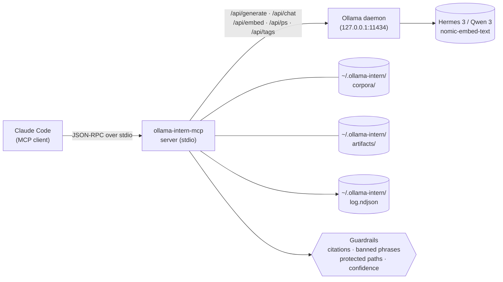

<p align="center">
  <a href="README.ja.md">日本語</a> | <a href="README.zh.md">中文</a> | <a href="README.es.md">Español</a> | <a href="README.fr.md">Français</a> | <a href="README.md">English</a> | <a href="README.it.md">Italiano</a> | <a href="README.pt-BR.md">Português (BR)</a>
</p>

<p align="center">
  
</p>

<p align="center">
  <a href="https://github.com/mcp-tool-shop-org/ollama-intern-mcp/actions"></a>
  <a href="LICENSE"></a>
  <a href="https://mcp-tool-shop-org.github.io/ollama-intern-mcp/"></a>
  <a href="https://www.npmjs.com/package/ollama-intern-mcp"></a>
  <a href="https://mcp-tool-shop-org.github.io/ollama-intern-mcp/handbook/"></a>
  <a href="#ollama-cloud"></a>
</p>

> **क्लॉड कोड के लिए स्थानीय इंटर्न।** <!-- TOOL_COUNT:start -->44<!-- TOOL_COUNT:end --> नौकरी-आधारित उपकरण, प्रमाण-आधारित संक्षिप्त विवरण, टिकाऊ कलाकृतियाँ।

एक एमसीपी सर्वर जो क्लॉड कोड को नियमों, स्तरों, एक डेस्क और एक फाइलिंग कैबिनेट के साथ एक **स्थानीय इंटर्न** प्रदान करता है। क्लॉड _उपकरण_ चुनता है; उपकरण _स्तर_ चुनता है (तत्काल / वर्कहॉर्स / गहन / एम्बेड); स्तर एक फ़ाइल लिखता है जिसे आप अगले सप्ताह खोल सकते हैं।

**यह `hermes3:8b` पर [हरमीस एजेंट](https://github.com/NousResearch/hermes-agent) को भी चलाता है** — 2026-04-19 तक मान्य एंड-टू-एंड। डिफ़ॉल्ट क्रम `hermes3:8b` है; `qwen3:*` वैकल्पिक रेल है। नीचे [हरमीस के साथ उपयोग](#use-with-hermes) देखें।

**हार्डवेयर आवश्यकताएँ:** `hermes3:8b` के लिए लगभग 6 जीबी वीआरएएम, या सीपीयू अनुमान के लिए लगभग 16 जीबी रैम। पूर्ण विवरण के लिए [हैंडबुक/गेट-स्टार्टेड](https://mcp-tool-shop-org.github.io/ollama-intern-mcp/handbook/getting-started/#hardware-minimums) देखें।

**क्या आप क्लॉड का उपयोग नहीं कर रहे हैं?** [`examples/`](./examples/) निर्देशिका में एक न्यूनतम नोड.जेएस और पायथन एमसीपी क्लाइंट है जिसे आप stdio पर चला सकते हैं। [हैंडबुक/विद-हरमीस](https://mcp-tool-shop-org.github.io/ollama-intern-mcp/handbook/with-hermes/) भी देखें।

**स्थानीय-प्रथम** — जब तक आप इसमें शामिल नहीं होते, तब तक शून्य नेटवर्क आउटगोइंग। कोई टेलीमेट्री नहीं। कोई "स्वायत्त" चीज़ नहीं। प्रत्येक कॉल अपना काम दिखाता है।

**क्या आपके पास पर्याप्त जीपीयू नहीं है? [ओलामा क्लाउड](#ollama-cloud) 600बी-क्लास मॉडल पर सभी <!-- TOOL_COUNT:start -->44<!-- TOOL_COUNT:end --> उपकरणों को चलाता है।** अधिकांश लोग अपने स्वयं के कार्ड पर एक फ्रंटियर मॉडल को होस्ट नहीं कर सकते हैं — यह स्थानीय एआई पर वास्तविक सीमा है, और यह वही है जिसे यह बढ़ाता है। समान `/api/*` सतह, समान नौकरी-आधारित उपकरण, समान लिफाफे; एम्बेडिंग स्थानीय रहते हैं; किसी भी क्लाउड विफलता के कारण यह स्वचालित रूप से आपकी स्थानीय प्रोफ़ाइल पर वापस आ जाता है। **एक** कॉल को बढ़ाएँ (`backend: "cloud"`) या प्रत्येक जेनरेटिव कॉल को रूट करें (`OLLAMA_CLOUD_PRIMARY=1`) — और प्रत्येक लिफाफा आपको बताता है कि वास्तव में कौन सा बैकएंड इसे प्रदान करता है। जब तक आप एक कुंजी सेट नहीं करते, तब तक यह बंद रहता है।

---

## v2.10.0 में नया

**क्लाउड-ईमानदारी रिलीज़।** v2.9.0 ने प्रति-कॉल क्लाउड एस्केलेशन जारी किया और इस रीडमी में "600बी मॉडल में एक उच्च-दांव समीक्षा को बढ़ाएँ" का विज्ञापन किया — लेकिन `backend` इनपुट वास्तव में 44 उपकरणों में से केवल **एक** पर मौजूद था, और यह `ollama_chat` था, जिसकी अपनी विवरणिका इसे अंतिम उपाय कहती है। प्रत्येक समीक्षा-आधारित नौकरी को एक स्थानीय 8बी पर पिन किया गया था। स्थानीय-प्रथम अपरिवर्तित है: कोई कुंजी नहीं होने का मतलब अभी भी शून्य आउटगोइंग और कोई स्टार्टअप जांच नहीं है, एम्बेडिंग कभी भी बॉक्स से बाहर नहीं जाते हैं, और प्रत्येक नई नॉब आज के व्यवहार पर डिफ़ॉल्ट होती है।

- **प्रति-कॉल एस्केलेशन अब 15 उपकरणों तक पहुँचता है, न कि 1 तक।** `backend: "cloud"`, `research`, `summarize_deep`, `code_review`, `code_citation`, `corpus_answer`, `hypothesis_drill`, `multi_file_refactor_propose`, `refactor_plan`, सभी तीन संक्षिप्त विवरणों, सभी तीन पैकों और `chat` पर एक वैकल्पिक इनपुट है। इसे छोड़ दें और व्यवहार v2.9.x के समान होगा। **पैक केवल अपने संश्लेषण चरण को बढ़ाते हैं** — प्रमाण असेंबली, छँटाई और कलाकृति लेखन स्थानीय रहते हैं — और किसी भी स्थानीय कार्य को करने से पहले एक गैर-सेवा योग्य एस्केलेशन को अस्वीकार करते हैं।
- **`INTERN_CLOUD_STANDBY_TIERS` — नीति को एक बार घोषित करें।** बताएं कि कौन से स्तर (`instant|workhorse|deep`) प्रति-कॉल निर्देश के बिना स्टैंडबाय के तहत बढ़ाते हैं। डिफ़ॉल्ट रूप से खाली। एक प्रति-कॉल `backend` अभी भी दोनों दिशाओं में इसे प्राथमिकता देता है। `embed` को कॉन्फ़िगरेशन लोड पर *और* रूटिंग परत पर अस्वीकार कर दिया जाता है: एम्बेडिंग हमेशा स्थानीय रहते हैं।
- **`doctor --cloud-check` — साबित करें कि कुंजी वास्तव में काम करती है।** पुरानी जांच `/api/tags` पर हिट करती थी, जो एक अमान्य कुंजी के लिए 200 लौटाती है, इसलिए प्रमाणीकरण केवल "अपरमाणित" पढ़ सकता था। यह एक 8-टोकन जेनरेट चलाता है और `ok` / `failed` / `unverified` / `unreachable` लौटाता है — चार अवस्थाएँ जानबूझकर अलग रखी गई हैं, क्योंकि किसी मॉडल आईडी पर 404 एक कुंजी समस्या नहीं है और आपको इसकी खोज नहीं करनी चाहिए। यह प्रत्येक कॉन्फ़िगर की गई क्लाउड आईडी को मौजूद या कैटलॉग में नहीं के रूप में भी रिपोर्ट करता है, साथ ही निकटतम-लाइव-आईडी सुझाव भी देता है, ताकि सेवानिवृत्त आईडी को भुगतान करने से पहले पाया जा सके।
- **ठीक किया गया: `init` हर npm इंस्टॉल पर टूट गया था।** `hermes.config.example.yaml` कभी भी प्रकाशित टारबॉल में नहीं गया, इसलिए बाइनरी ने जो कोई भी npm से इंस्टॉल करता है, उसे अपनी "पैकेजिंग बग" त्रुटि की सूचना दी। यह अब शिप करता है, और सीआई इंस्टॉल करता है और पैक किए गए टारबॉल को चलाता है ताकि यह वापस न आए।
- **पुनर्प्राप्ति स्कोर अंततः तुलनीय हैं।** `CorpusHit.score` ने एक ही फ़ील्ड के तहत चार अतुलनीय पैमाने रखे — डिफ़ॉल्ट हाइब्रिड मोड `0.0328` पर समाप्त हो गया, जबकि `corpus_min_evidence_score` को "0–1" के रूप में प्रलेखित किया गया था, इसलिए `0.1` का एक प्राकृतिक तल चुपचाप हर कॉर्पस चंक को छोड़ देता है। फ़्यूज़ किए गए स्कोर को 0–1 पर पुन: स्केल किया जाता है और प्रत्येक हिट `score_scale` रखता है।

[चेंजलॉग.एमडी](./CHANGELOG.md) में पूर्ण विवरण।

## v2.9.0 में नया

**क्लाउड सुविधा पास — एक क्रॉस-फ़ैमिली सत्यापन लेन, मांग पर क्लाउड एस्केलेशन, और इसे देखने के लिए अर्थशास्त्र।** स्थानीय-प्रथम अपरिवर्तित है: कोई कुंजी सेट नहीं होने पर, व्यवहार v2.8.0 के समान है (शून्य आउटगोइंग, कोई स्टार्टअप क्लाउड जांच नहीं)।

- **`ollama_verify_claims` — क्रॉस-फ़ैमिली सत्यापन।** `ollama_code_review` निष्कर्ष उत्पन्न करता है; यह उनका मूल्यांकन करता है। यह आपके दावों + साक्ष्यों पर एक अलग-परिवार वाला ओलामा क्लाउड फ्लैगशिप पैनल (डिफ़ॉल्ट रूप से डीपसीक / किमी / जीएलएम) चलाता है और प्रति-दावे के लिए CONFIRMED / REFUTED / NEEDS_REVIEW लौटाता है। एकीकरण इस प्रकार है: एक मतभेद होने पर कोई निर्णय नहीं लिया जाता (खंडन करने के लिए ≥2, पुष्टि करने के लिए ≥2), प्रत्येक निर्णायक को मॉडल-सत्यापित किया जाता है (स्थानीय फ़ॉलबैक या प्रतिस्थापित मॉडल को शामिल नहीं किया जाता है, इसकी गणना नहीं की जाती है), और दावों के इनपुट संरचनात्मक रूप से तर्क-मुक्त होते हैं। ईमानदार सीमा प्रलेखित है: CONFIRMED सहायक साक्ष्य है, प्रमाण नहीं — यह स्पष्ट त्रुटियों को चिह्नित करने में विश्वसनीय है, लेकिन एक फ्रंटियर मॉडल की सूक्ष्म त्रुटियों पर कमज़ोर है।
- **प्रति-कॉल क्लाउड एस्केलेशन + स्टैंडबाय मोड।** `OLLAMA_API_KEY` को *अकेले* (`OLLAMA_CLOUD_PRIMARY` के बिना) सेट करें और आप **स्टैंडबाय** में होंगे: स्थानीय-प्राथमिक, शून्य आउटगोइंग, कोई स्टार्टअप जांच नहीं — जब तक कि एक एकल कॉल `backend:'cloud'` के साथ इसमें शामिल न हो जाए। हर कॉल को क्लाउड पर भेजने के बजाय, एक उच्च-महत्व वाले समीक्षा को 600B मॉडल पर एस्केलेट करें। पहला एस्केलेशन उस समय आउटगोइंग को स्पष्ट रूप से प्रकट करता है जब यह होता है; प्रति-कॉल `model` ओवरराइड अब क्लाउड प्रयास को शाब्दिक रूप से अनुसरण करता है।
- **`ollama_log_stats` — टैगलाइन में वादा किए गए मापे गए अर्थशास्त्र।** आपके NDJSON रसीदों का एक नो-एलएलएम रोलअप: क्लाउड/स्थानीय विभाजन, क्लाउड→स्थानीय फ़ॉलबैक दर, प्रति उपकरण टोकन, p50/p95 विलंबता, `since` विंडो द्वारा सीमित।
- **सीआई के लिए डॉक्टर + मशीन-पठनीय उपकरण।** `doctor --json --fail-unhealthy` पाइपलाइनों को एक वास्तविक गेट देता है (एक क्लाउड-जागरूक `healthy` ध्वज के साथ), और अब प्रत्येक उपकरण MCP `readOnlyHint`/`destructiveHint`/`title` एनोटेशन रखता है ताकि ग्राहकों को सही अनुमति UX मिले। इसके अतिरिक्त `init --claude` एक पेस्ट-तैयार `.mcp.json` बनाता है।

पूर्ण विवरण [CHANGELOG.md](./CHANGELOG.md) में।

## v2.8.0 में नया

**विश्वसनीयता, स्थायित्व और सुरक्षा को मजबूत करना — 25 सुधार, जिनमें से प्रत्येक पहले परीक्षण किया गया और क्रॉस-फ़ैमिली द्वारा सत्यापित किया गया।** स्थानीय-प्रथम व्यवहार अपरिवर्तित है और किसी भी उपकरण अनुबंध को हटाया नहीं गया; मौजूदा कॉलर काम करना जारी रखते हैं। भार-वाहक जीतता है:

- **अब कोई भी मौन कॉर्पस डेटा-हानि नहीं।** `ollama_corpus_refresh` के दौरान एक अस्थायी रीड त्रुटि (एक विंडोज फ़ाइल लॉक, एक एंटीवायरस होल्ड, एक संपादक की सहेजने की विंडो) फ़ाइल को "गायब" के रूप में वर्गीकृत करती थी और **स्थायी रूप से इसकी अनुक्रमित सामग्री को हटा देती थी**। अब केवल एक वास्तविक रूप से अनुपस्थित फ़ाइल को हटाया जाता है; एक अस्थायी त्रुटि पथ को बरकरार रखती है, इसे पुन: प्रयास के लिए चिह्नित करती है, और इसके टुकड़ों को संरक्षित करती है।
- **समानता जो अपने बजट का सम्मान करती है।** एक स्तरीय टाइमआउट अब एक कॉल को रद्द कर सकता है जो अभी भी अनुमति के लिए कतार में है (यह पहले बजट से बहुत आगे तक लटका रहता था, जबकि रसीदों में अन्यथा दावा किया गया था), और `ollama_chat` अंततः टाइमआउट/स्तरीय सीम से होकर गुजरता है — इसलिए एक बाधित स्थानीय पीढ़ी हर उपकरण को बाधित नहीं कर सकती है, और यह वास्तव में क्लाउड-प्राथमिक मोड में क्लाउड तक पहुंचता है।
- **क्लाउड जो मरने के बजाय कम हो जाता है।** एक सेवानिवृत्त क्लाउड-मॉडल आईडी अब एक स्पष्ट `cloud_model_missing` कारण और एक क्लाउड-विशिष्ट संकेत के साथ स्थानीय पर वापस आ जाता है, बजाय पूर्ण आउटेज के; सर्किट ब्रेकर स्थायी रूप से बाधित नहीं हो सकता है; एक लगातार गायब मॉडल हर कॉल पर क्लाउड राउंड-ट्रिप का भुगतान करना बंद कर देता है।
- **सुरक्षा सतह जो इसके दस्तावेज़ों से मेल खाती है।** `ollama_batch_proof_check` अब वास्तव में cwd रोकथाम को लागू करता है (एक नए ऑपरेटर env कैप `INTERN_BATCH_PROOF_ALLOWED_ROOTS` के साथ जिसे एक कॉलर विस्तृत नहीं कर सकता है), प्रॉम्प्ट-इंजेक्शन सैनिटाइज़र को कवरेज + एक ईमानदारी से प्रकटीकृत सीमा प्राप्त हुई, और संरक्षित-पथ गार्ड macOS पर केस-संवेदनशील है।
- **ईमानदार कलाकृतियाँ और रसीदें।** पैक लेखन परमाणु होते हैं और कभी भी चुपचाप बाधित नहीं होते हैं; कम हुई बैच लिफाफे वास्तव में उपयोग किए गए स्तर की रिपोर्ट करते हैं; बाधित-लेखन डिटेक्टर किसी भी परिवर्तन पर फटे हुए लेखन को पकड़ता है; चंक आईडी अब समान-सामग्री वाली फ़ाइलों में टकराते नहीं हैं। निर्भरता ऑडिट पूरी तरह से स्पष्ट है (0 कमजोरियाँ)।

पूर्ण विवरण [CHANGELOG.md](./CHANGELOG.md) में।

## v2.7.0 में नया

**वैकल्पिक ओलामा क्लाउड रूटिंग — क्लाउड-प्राथमिक, स्थानीय-फ़ॉलबैक।** एक कुंजी + एक ध्वज के साथ ऑप्ट इन करें और जनरेटिव स्तर 600B-क्लास क्लाउड मॉडल पर रूट करते हैं; एम्बेडिंग स्थानीय रहते हैं; एक सर्किट ब्रेकर किसी भी क्लाउड विफलता पर आपके स्थानीय प्रोफ़ाइल पर वापस आ जाता है। **डिफ़ॉल्ट रूप से बंद — जब तक कि आप `OLLAMA_API_KEY` और `OLLAMA_CLOUD_PRIMARY=1` दोनों सेट नहीं करते, तब तक कोई आउटगोइंग नहीं।** अतिरिक्त मामूली — v2.7.0 से पहले के कॉलर (और जो ऑप्ट इन नहीं करते हैं) बाइट-समान व्यवहार देखते हैं। [ओलामा क्लाउड](#ollama-cloud) देखें।

- **सुरक्षा जाल के साथ क्लाउड-प्राथमिक।** `RoutingOllamaClient` पहले क्लाउड का प्रयास करता है और टाइमआउट / 5xx / 429 / नेटवर्क पर स्थानीय प्रोफ़ाइल पर वापस आ जाता है। खराब कुंजियाँ (401/403) एक चिपचिपे ब्रेकर के माध्यम से स्पष्ट रूप से सामने आती हैं, बजाय चुपचाप हमेशा के लिए कम होने के; एक सेवानिवृत्त/गलत टाइप किया गया क्लाउड मॉडल आईडी (404) भी सामने आता है।
- **कभी भी मौन डाउनग्रेड नहीं।** प्रत्येक लिफाफे में `backend` (`cloud`|`local`), `degraded`, और `degrade_reason` शामिल हैं ताकि आप हमेशा जानते हों कि आपको बड़े मॉडल के बजाय स्थानीय मॉडल मिला है। एक `backend_fallback` NDJSON ईवेंट `ollama_log_tail` में क्लाउड→स्थानीय फ़ॉलबैक दर को दृश्यमान बनाता है।
- **`ollama_doctor` क्लाउड प्रमाणीकरण + पहुंच क्षमता की रिपोर्ट करता है** एक अलग ब्लॉक के रूप में; `ollama-intern-mcp doctor` एक `Cloud (primary)` अनुभाग दिखाता है।
- डिफ़ॉल्ट क्लाउड मॉडल v2.7.0 रिलीज़ पर `minimax-m3:cloud` था *(चूंकि इसे `qwen3-coder-next:cloud` पर फिर से पिन किया गया है — एक विचारशील डिफ़ॉल्ट ने कैप किए गए `num_predict` उपकरणों पर खाली उत्तर लौटाए; [env तालिका](#cloud-env-vars) देखें)*; `INTERN_CLOUD_MODEL` / `INTERN_CLOUD_DEEP_MODEL` के साथ प्रति-स्तर ओवरराइड करें।

## v2.6.0 में नया

`ollama_extract` पर प्रति-कॉल स्तर-बजट ओवरराइड। अतिरिक्त मामूली — v2.6.0 से पहले के कॉलर अपरिवर्तित। [CHANGELOG.md](./CHANGELOG.md) में विस्तृत प्रविष्टि।

- **`tier_budget_ms_override?: number` स्कीमा फ़ील्ड `ollama_extract` पर** (वैकल्पिक, `[1, 600000]` एमएस तक सीमित)। यदि मौजूद है, तो यह उस प्रत्येक स्तर पर ओवरराइड लागू करता है जिस पर रनर जाता है, ताकि `src/guardrails/timeouts.ts:61` पर आंतरिक `runWithTimeoutAndFallback` मशीन ऑपरेटर द्वारा प्रदान किए गए बजट का पालन करे, न कि प्रोफ़ाइल डिफ़ॉल्ट का। कैस्केड (वर्कहॉर्स → टाइमआउट पर तत्काल) अभी भी ट्रिगर होता है; ओवरराइड प्रत्येक कैस्केड चरण को समान रूप से नियंत्रित करता है।
- **यह क्यों मौजूद है।** रिसर्च-ओएस आर-018 रैपर (v0.12.1) ने एमसीपी `callTool` को `Promise.race` के साथ रैप किया और पाया कि रैपर का बजट आंतरिक स्तर तक नहीं पहुंचा — `DEV_RTX5080_TIMEOUTS.instant = 15_000` ने 180000 एमएस रैपर बजट की परवाह किए बिना 15000 एमएस पर `TIER_TIMEOUT` को ट्रिगर करना जारी रखा। v2.6.0 एमसीपी-साइड आधिकारिक बजट प्रदान करता है ताकि ऑपरेटर का `--planner-timeout-ms` फ़्लैग (रिसर्च-ओएस) अंततः आंतरिक-स्तरीय टाइमआउट को डिज़ाइन के अनुसार नियंत्रित करे।
- **डिफ़ॉल्ट व्यवहार संरक्षित।** फ़ील्ड को छोड़ दिया गया = प्रोफ़ाइल डिफ़ॉल्ट बाइट-दर-बाइट नियंत्रित करते हैं। v2.6.0 से पहले के कॉलर्स में कोई बदलाव नहीं।
- **आर-010 फ़ॉलबैक-कारण रेगुलर एक्सप्रेशन संरक्षित।** सर्वर-साइड `TIER_TIMEOUT` त्रुटि संदेश अभी भी `/elapsed=(\d+)ms/` + `/budget=(\d+)ms/` से मेल खाता है ताकि एआई-सलाहकार की दृश्यता डाउनस्ट्रीम में ओवरराइड और डिफ़ॉल्ट दोनों पथों पर काम करे।
- रिसर्च-ओएस v0.13.0 द्वारा उपयोग किया जाता है (संचयी आर-019 क्लाइंट वायर-अप + आर-020 + आर-021) एक समन्वित मल्टी-रिपो रिलीज़ में।

### ऐतिहासिक — v2.4.0 रिलीज़

v2.4.0 प्रविष्टि के लिए [CHANGELOG.md](./CHANGELOG.md) और [docs/release-notes/v2.4.0.md](./docs/release-notes/v2.4.0.md) देखें (प्रोफ़ाइल सिस्टम पर प्रति-स्तरीय `num_ctx` नियंत्रण)।

## v2.4.0 में नया

प्रोफ़ाइल सिस्टम पर प्रति-स्तरीय `num_ctx` (संदर्भ विंडो) नियंत्रण। अतिरिक्त मामूली — v2.3.0 कॉलर्स अपरिवर्तित। [CHANGELOG.md](./CHANGELOG.md) और [docs/release-notes/v2.4.0.md](./docs/release-notes/v2.4.0.md) में विस्तृत प्रविष्टियाँ।

- **`TierConfig.num_ctx` मानचित्र (नया)** — प्रोफ़ाइल पर वैकल्पिक `{ instant?, workhorse?, deep?, embed? }`। जब किसी स्तर के लिए सेट किया जाता है, तो एमसीपी सर्वर उस स्तर पर रूट किए गए प्रत्येक ओलामा जेनरेट/चैट अनुरोध पर `options.num_ctx = <value>` रखता है (प्रारंभिक + फ़ॉलबैक)। जब अनसेट किया जाता है, तो अनुरोध पूरी तरह से `num_ctx` को छोड़ देता है ताकि ओलामा अपने मॉडल-लोडेड डिफ़ॉल्ट का उपयोग करे — v2.3.0 व्यवहार बिल्कुल संरक्षित।
- **नया एनवेलप फ़ील्ड `num_ctx_used?: number`** — केवल तभी मौजूद होता है जब एमसीपी सर्वर ने वास्तव में `num_ctx` भेजा हो। अनुपस्थित जब अनुरोध ओलामा को चुनने देता है। कोई डिफ़ॉल्ट अनुमान न लगाएं — एमसीपी सर्वर प्रभावी मान के लिए ओलामा से पूछताछ नहीं करता है।
- **प्रोफ़ाइल डिफ़ॉल्ट**: `dev-rtx5080` / `dev-rtx5080-qwen3` `instant: 4096`, `workhorse: 8192`, `deep`/`embed` अनसेट के साथ शिप किए जाते हैं। यह सुनिश्चित करने के लिए आकार दिया गया है कि `hermes3:8b` को RTX 5080 के 16GB VRAM बजट में तेज़ टूल के लिए रखा जाए। `m5-max` प्रत्येक स्तर को अनसेट छोड़ देता है — 128GB एकीकृत मेमोरी में कोई स्पिल समस्या नहीं है।
- **v0.8.0 चरण 1 नैदानिक ​​को बंद करता है** — `hermes3:8b` डिफ़ॉल्ट 32K संदर्भ पर RTX 5080 पर CPU में स्पिल हो गया और वर्कहॉर्स `ollama_extract` कॉल को टाइम आउट करना शुरू कर दिया। v2.4.0 प्रोफ़ाइल परत पर इसे रोकता है।

### प्रति-स्तरीय `num_ctx` नियंत्रण (v2.4.0 में नया)

प्रोफ़ाइल (`src/profiles.ts` से उद्धरण):

```ts
"dev-rtx5080": {
  tiers: {
    instant: "hermes3:8b",
    workhorse: "hermes3:8b",
    deep: "hermes3:8b",
    embed: "nomic-embed-text",
    num_ctx: {
      instant: 4096,    // fast classify/summarize
      workhorse: 8192,  // schema-bound extract / batch
      // deep: UNSET — long-context briefs keep current behavior
      // embed: UNSET — no context-window pressure on embed
    },
  },
  // ... timeouts, prewarm
}
```

वर्कहॉर्स-स्तरीय कॉल पर एनवेलप (जैसे `ollama_extract`):

```jsonc
{
  "result": { /* extracted data */ },
  "tier_used": "workhorse",
  "model": "hermes3:8b",
  "num_ctx_used": 8192,        // present because the profile set workhorse=8192
  // ... rest of envelope unchanged
}
```

`m5-max` (या किसी भी प्रोफ़ाइल पर जो किसी स्तर को अनसेट छोड़ देता है) पर, `num_ctx_used` एनवेलप से अनुपस्थित होता है और ओलामा को भेजे गए वायर अनुरोध में `num_ctx` फ़ील्ड शामिल नहीं होता है — ओलामा अपने मॉडल-लोडेड डिफ़ॉल्ट का उपयोग करता है।

ऑपरेटर प्रोफ़ाइल का चयन/संपादित करके ट्यून करते हैं; टूल स्कीमा पर प्रति-कॉल `num_ctx` इनपुट नहीं होता है। यदि भविष्य के कॉल में इसकी आवश्यकता होती है, तो पैटर्न v2.3.0 के `model` ओवरराइड का पालन करता है।

### ऐतिहासिक — v2.3.0 रिलीज़

v2.3.0 प्रविष्टि के लिए [CHANGELOG.md](./CHANGELOG.md) और [docs/release-notes/v2.3.0.md](./docs/release-notes/v2.3.0.md) देखें (प्रति-कॉल मॉडल ओवरराइड)।

## v2.3.0 में नया

एलएलएम-समर्थित एटम टूल में प्रति-कॉल मॉडल ओवरराइड। अतिरिक्त मामूली — v2.2.0 कॉलर्स अपरिवर्तित। [CHANGELOG.md](./CHANGELOG.md) और [docs/release-notes/v2.3.0.md](./docs/release-notes/v2.3.0.md) में विस्तृत प्रविष्टियाँ।

- **8 एटम टूल पर वैकल्पिक `model: string` इनपुट** — `ollama_extract`, `ollama_classify`, `ollama_summarize_fast`, `ollama_summarize_deep`, `ollama_research`, `ollama_corpus_answer`, `ollama_chat`, `ollama_code_citation`। टूल के स्तर पर पहला प्रयास कॉलर द्वारा निर्दिष्ट मॉडल के विरुद्ध चलता है; टाइमआउट पर, मौजूदा `TIER_FALLBACK` कैस्केड सस्ते स्तर के अपने मॉडल को हल करता है (कॉलर के ओवरराइड को नहीं)। कंपोजिट/संक्षिप्त/पैक टूल जानबूझकर `model` स्वीकार नहीं करते हैं — एटम को प्रति-कॉल नियंत्रण मिलता है, कंपोजिट स्तर डिफ़ॉल्ट का उपयोग करते हैं।
- **नया एनवेलप फ़ील्ड `model_requested?: string`** — केवल तभी मौजूद होता है जब ओवरराइड प्रदान किया गया हो। कैलिब्रेशन-जागरूक कॉलर्स `model_requested` की तुलना `model` से करते हैं ताकि फ़ॉलबैक प्रतिस्थापन का पता लगाया जा सके: `if (env.model_requested && env.model !== env.model_requested) { /* substitution */ }`। खाली / केवल रिक्त स्थान वाले इनपुट स्कीमा पार्स पर `ZodError` फेंकते हैं, न कि मौन फ़ॉलबैक।
- **बग फिक्स — `src/version.ts` विचलन।** रनटाइम `VERSION` स्थिरांक अब मॉड्यूल लोड पर `package.json` से पढ़ा जाता है; v2.1.0 और v2.2.0 ने पुराने `"2.0.0"` पहचान स्ट्रिंग की रिपोर्ट की थी। नया `tests/version.test.ts` `VERSION === pkg.version` को लॉक करता है।

### प्रति-कॉल मॉडल ओवरराइड (v2.3.0 में नया)

```jsonc
{
  "tool": "ollama_classify",
  "arguments": {
    "text": "patch null pointer in auth",
    "labels": ["feat", "fix", "chore"],
    "frame": "what is the change kind?",
    "model": "hermes3:8b"
  }
}
```

एनवेलप:

```jsonc
{
  "result": { "label": "fix", "confidence": 0.9, "off_topic": false, ... },
  "tier_used": "instant",
  "model": "hermes3:8b",
  "model_requested": "hermes3:8b",       // present because override was supplied
  // ... rest of envelope unchanged
}
```

यदि वर्कहॉर्स/डीप स्तर पर टाइमआउट हो गया था और कॉल तत्काल स्तर पर कैस्केड हो गया था, तो `env.model` तत्काल स्तर का हल किया गया मॉडल होगा और `env.fallback_from` `"workhorse"` होगा — `env.model_requested` अभी भी `"hermes3:8b"` होगा, और `env.model !== env.model_requested` प्रतिस्थापन संकेत है। ओवरराइड को जानबूझकर सस्ते स्तर पर नहीं ले जाया जाता है; चुना गया मॉडल उस स्तर की भूमिका के लिए उपयुक्त नहीं हो सकता है।

### ऐतिहासिक — v2.2.0 रिलीज़

v2.2.0 प्रविष्टि के लिए [CHANGELOG.md](./CHANGELOG.md) और [docs/release-notes/v2.2.0.md](./docs/release-notes/v2.2.0.md) देखें (फ़्रेम-बाउंड सामयिक और संरचित परित्याग)।

## v2.2.0 में नया

स्थानीय साक्ष्य-कार्यकर्ता भूमिका अनुबंध: फ़्रेम-बाउंड सामयिक और संरचित परित्याग। अतिरिक्त मामूली — v2.1.0 कॉलर्स अपरिवर्तित। [CHANGELOG.md](./CHANGELOG.md) और [docs/release-notes/v2.2.0.md](./docs/release-notes/v2.2.0.md) में विस्तृत प्रविष्टियाँ।

- **फ्रेम-बाउंड निष्कर्षण** `ollama_extract`, `ollama_classify`, `ollama_summarize_fast`, `ollama_summarize_deep` पर — वैकल्पिक `frame: string` इनपुट + संरचित `frame_alignment` / `on_topic` / `frame_addressed` आउटपुट। गैर-विषयगत स्रोतों को स्कीमा में पुन: प्रस्तुत करने के बजाय चिह्नित किया जाता है।
- **संरचित परहेज** `ollama_research` पर — `weak` / `abstained` / `sources_address_question` फ़ील्ड। खाली `citations[]` जिसमें गैर-खाली `answer` है, अब मौन सफलता नहीं है।
- **विषयगत सीमा** `ollama_corpus_answer` पर — वैकल्पिक `min_top_score`। सीमा से नीचे, उपकरण `abstained: true` के साथ शॉर्ट-सर्किट करता है और संश्लेषण को छोड़ देता है। प्रति-उद्धरण `score` अब प्रत्येक उद्धरण पर दिखाई देता है।
- **संक्षिप्त प्रमाण के माध्यम से पुनर्प्राप्ति स्कोर का संरक्षण** — `corpusHitsToEvidence` `score` रखता है (और `corpus_min_evidence_score` नॉब फ़िल्टर असेंबली समय पर `incident_brief` / `repo_brief` / `change_brief` पर)।
- **उद्धरण पंक्ति-श्रेणी सीमाएँ** — `guardrails/citations.ts` `ollama_research` पर सीमा से बाहर की श्रेणियों को अस्वीकार करता है, जो `ollama_code_citation` पर मौजूदा मुद्रा से मेल खाता है।
- **ऑपरेटर-अनुबंध दस्तावेज़ों को सही किया गया** — README `chunk_id`/`chunk_index` फिक्स, "सर्वर-साइड पर मान्य" को फिर से लिखा गया, साक्ष्य कानून अनुभाग को योग्य बनाया गया, विपणन नारा एनोटेट किया गया।

### सीड रिग्रेशन — सत्यापन

स्लाइस के अनुबंध को शाब्दिक अनुसंधान-ओएस ताज़ा-पैक विफलता के विरुद्ध सत्यापित किया जाता है: arxiv 2112.10422 (कॉस्मोलॉजिकल स्टैंडर्ड टाइमर) अनुभाग-01 फ्रेम *"स्थानीय-प्रथम बनाम क्लाउड एलएलएम गहन-अनुसंधान वर्कफ़्लो में साक्ष्य हिरासत का क्या अर्थ है?"* के तहत — 9 / 9 मॉक-एलएलएम अनुबंध परीक्षण पुष्टि करते हैं कि गैर-विषयगत स्रोत अब शामिल है (`frame_alignment.on_topic = false` पर निष्कर्षण; `off_topic: true` पर वर्गीकृत; `frame_addressed: false` पर सारांश_गहन; `abstained: true` पर कॉर्पस_उत्तर `min_top_score` के साथ सेट)।

### ऐतिहासिक — v2.1.0 डिलिवरेबल्स

पूर्ण v2.1.0 प्रविष्टि के लिए [CHANGELOG.md](./CHANGELOG.md) देखें (फ़ीचर पास: 13 नए उपकरण + 4 संवर्द्धन + फ़्रीज़ लिफ्ट)।

---

## आर्किटेक्चर एक नज़र में


```mermaid
flowchart LR
  Claude["Claude Code<br/>(MCP client)"]
  MCP["ollama-intern-mcp<br/>server (stdio)"]
  Ollama["Ollama daemon<br/>(127.0.0.1:11434)"]
  Models[("Hermes 3 / Qwen 3<br/>nomic-embed-text")]
  Corpus[("~/.ollama-intern/<br/>corpora/")]
  Artifacts[("~/.ollama-intern/<br/>artifacts/")]
  NDJSON[("~/.ollama-intern/<br/>log.ndjson")]
  Guards{{"Guardrails<br/>citations · banned phrases<br/>protected paths · confidence"}}

  Claude -- "JSON-RPC over stdio" --> MCP
  MCP --> Guards
  MCP -- "/api/generate · /api/chat<br/>/api/embed · /api/ps · /api/tags" --> Ollama
  Ollama --> Models
  MCP --- Corpus
  MCP --- Artifacts
  MCP --> NDJSON
```

प्रत्येक क्लाउड टूल कॉल stdio JSON-RPC पर एमसीपी सर्वर में प्रवेश करता है। सर्वर उपकरण के [zod](https://zod.dev) स्कीमा के विरुद्ध कॉल को मान्य करता है, कॉन्फ़िगर किए गए गार्डरेल चलाता है (उद्धरण सत्यापन, प्रतिबंधित-वाक्यांश पट्टी, संरक्षित-पथ प्रवर्तन, आत्मविश्वास सीमा), फिर इसे या तो एक नियतात्मक रेंडरर (आर्टिफैक्ट टियर) या एक ओलामा एचटीटीपी कॉल (प्रत्येक अन्य टियर) पर रूट करता है। ओलामा डेमॉन कभी भी उपयोगकर्ता-आपूर्ति किए गए पथों को नहीं देखता है — केवल मॉडल टियर और तैयार प्रॉम्प्ट। प्रत्येक कॉल एनडीजेएसओएन लॉग में एक संरचित ईवेंट जोड़ता है `~/.ollama-intern/log.ndjson` पर, जहां `ollama_log_tail` और आपका शेल इसे पढ़ सकता है।

---

## प्रमुख उदाहरण — एक कॉल, एक आर्टिफैक्ट

```jsonc
// Claude → ollama-intern-mcp
{
  "tool": "ollama_incident_pack",
  "arguments": {
    "title": "sprite pipeline 5 AM paging regression",
    "logs": "[2026-04-16 05:07] worker-3 OOM killed\n[2026-04-16 05:07] ollama /api/ps reports evicted=true size=8.1GB\n...",
    "source_paths": ["F:/AI/sprite-foundry/src/worker.ts", "memory/sprite-foundry-visual-mastery.md"]
  }
}
```

डिस्क पर एक फ़ाइल की ओर इशारा करते हुए एक लिफाफा लौटाता है:

```jsonc
{
  "result": {
    "pack": "incident",
    "slug": "2026-04-16-sprite-pipeline-5-am-paging-regression",
    "artifact_md":   "~/.ollama-intern/artifacts/incident/2026-04-16-sprite-pipeline-5-am-paging-regression.md",
    "artifact_json": "~/.ollama-intern/artifacts/incident/2026-04-16-sprite-pipeline-5-am-paging-regression.json",
    "weak": false,
    "evidence_count": 6,
    "next_checks": ["residency.evicted across last 24h", "OLLAMA_MAX_LOADED_MODELS vs loaded size"]
  },
  "tier_used": "deep",
  "model": "hermes3:8b",
  "hardware_profile": "dev-rtx5080",
  "tokens_in": 4180, "tokens_out": 612,
  "elapsed_ms": 8410,
  "residency": { "in_vram": true, "evicted": false }
}
```

→ `weak: false` का अर्थ है ≥2 साक्ष्य आइटम को इकट्ठा किया गया था; इसका मतलब यह नहीं है कि परिकल्पनाओं का मूल्यांकन किया गया है। नीचे [साक्ष्य कानून](#evidence-laws) देखें।

वह मार्कडाउन फ़ाइल इंटर्न के डेस्क आउटपुट है — शीर्षक, उद्धृत आईडी के साथ साक्ष्य ब्लॉक, जांच `next_checks`, `weak: true` बैनर यदि साक्ष्य कम है। यह नियतात्मक है: रेंडरर कोड है, प्रॉम्प्ट नहीं। (रेंडरर नियतात्मक है; परिकल्पनाओं और सतहों की *सामग्री* जनरेटिव है — उन्हें मसौदा के रूप में पढ़ें, सत्यापित नहीं)। इसे कल खोलें, अगले सप्ताह इसे अलग करें, इसे `ollama_artifact_export_to_path` के साथ एक हैंडबुक में निर्यात करें।

इस श्रेणी में प्रत्येक प्रतियोगी "टोकन सहेजें" के साथ शुरुआत करता है। हम _यहाँ वह फ़ाइल है जो इंटर्न ने लिखी है_ के साथ शुरुआत करते हैं।

### दूसरा उदाहरण — एक कॉर्पस बनाएं, फिर उससे पूछें

```jsonc
// 1. Build a persistent, searchable corpus over your project.
{ "tool": "ollama_corpus_index",
  "arguments": { "name": "sprite-foundry",
                 "paths": ["F:/AI/sprite-foundry/src"],
                 "embed_model": "nomic-embed-text" } }
// → { chunks_written: 1204, paths_indexed: 312, failed_paths: [] }

// 2. Ask an evidence-bound question against it.
{ "tool": "ollama_corpus_answer",
  "arguments": { "name": "sprite-foundry",
                 "query": "how does the worker handle OOM eviction?",
                 "top_k": 8 } }
// → { answer: "...", citations: [{chunk_index, path}...], weak: false }
```

सर्वर उद्धरण पहचान को मान्य करता है और यह कि प्रत्येक `chunk_index` पुनर्प्राप्त हिट की सीमा में है। यह साबित नहीं करता है कि उत्पन्न प्रत्येक दावे को उद्धृत किए गए सामग्री द्वारा अर्थपूर्ण रूप से समर्थित किया गया है — यह मॉडल की जिम्मेदारी है, और कमजोर पुनर्प्राप्ति अभी भी उद्धरण-आकार के उत्तर उत्पन्न कर सकती है। [हैंडबुक/कॉर्पोरा](https://mcp-tool-shop-org.github.io/ollama-intern-mcp/handbook/corpora/) में पूर्ण वॉकथ्रू।

---

## फ्रेम-बाउंड निष्कर्षण (v2.2.0 में नया)

`ollama_extract`, `ollama_classify`, `ollama_summarize_fast` और `ollama_summarize_deep` एक वैकल्पिक `frame: string` इनपुट स्वीकार करते हैं। फ्रेम उस प्रश्न का नाम देता है जिसका उत्तर स्रोत से पूछा जा रहा है; मॉडल को यह निर्देश दिया जाता है कि वह वास्तविक-लेकिन-विषय से बाहर की सामग्री को उत्सर्जित करने के बजाय परहेज करे जब स्रोत फ्रेम को संबोधित नहीं करता है।

```jsonc
{
  "tool": "ollama_extract",
  "arguments": {
    "text": "<long source document>",
    "schema": { /* your fields */ },
    "frame": "section purpose here — e.g. 'OOM eviction behavior in the sprite worker'"
  }
}
// → result includes frame_alignment: { on_topic: boolean, reason: string, unaddressed_aspects: string[] }
```

यदि `frame` को छोड़ा गया है, तो व्यवहार v2.1.0 से अपरिवर्तित है। आपूर्ति किए जाने पर, `frame_alignment.on_topic = false` इंगित करता है कि निकाले गए फ़ील्ड स्रोत के लिए सही हो सकते हैं लेकिन फ्रेम के लिए प्रासंगिक नहीं हैं — इसे `weak: true` संक्षिप्त के समान आकार के रूप में मानें: उपयोगी, लेकिन डाउनस्ट्रीम साक्ष्य में बढ़ावा देने से पहले स्पॉट-चेक करें।

---

## परहेज अनुबंध (v2.2.0 में नया)

`ollama_research` संरचित परहेज फ़ील्ड लौटाता है: `weak: boolean`, `abstained: boolean`, `sources_address_question: boolean | null`। एक खाली `citations[]` जिसमें एक गैर-खाली `answer` है, अब मौन नहीं है — `abstained: true` कहता है कि मॉडल ने संश्लेषित करने से इनकार कर दिया क्योंकि कॉलर-आपूर्ति किए गए पथ ने प्रश्न को संबोधित नहीं किया। परहेज को विफलता के बजाय सफलता के रूप में मानें: यह उपकरण कमजोर पुनर्प्राप्ति को आधिकारिक आउटपुट में बदलने से इनकार कर रहा है।

`ollama_corpus_answer` एक वैकल्पिक `min_top_score: number` विषयगत सीमा (0.0–1.0) स्वीकार करता है। जब किसी क्वेरी के लिए शीर्ष पुनर्प्राप्ति स्कोर `min_top_score` से नीचे गिर जाता है, तो उपकरण `abstained: true` के साथ शॉर्ट-सर्किट करता है और संश्लेषण को छोड़ देता है — "स्कोर 0.21 पर 5 गैर-विषयगत चंक्स अभी भी एक पूर्ण उत्तर चलाते हैं" विफलता मोड को रोकता है जिसे v2.1.0 `weak: true` नियम ने नहीं पकड़ा (`weak: true` केवल `hits.length < 2` पर फायर हुआ)। प्रत्येक उद्धरण पर नए सिरे से सामने आने वाले प्रति-उद्धरण `score` फ़ील्ड के साथ इसे जोड़ें ताकि लिफाफे से सीधे पुनर्प्राप्ति गुणवत्ता का ऑडिट किया जा सके।

---

## यहाँ क्या है — चार स्तर, <!-- TOOL_COUNT:start -->44<!-- TOOL_COUNT:end --> उपकरण

**नौकरी-आकार का** का अर्थ है कि प्रत्येक उपकरण एक ऐसी नौकरी का नाम देता है जिसे आप एक इंटर्न को सौंपेंगे — इसे वर्गीकृत करें, इसे निकालें, इन लॉग को छाँटें, इस रिलीज़ नोट का मसौदा तैयार करें, इस घटना को पैक करें। उपकरण का इनपुट नौकरी विनिर्देश है; आउटपुट डिलिवरेबल है। शीर्ष पर कोई सामान्य `run_model` / `chat_with_llm` आदिम नहीं।

| स्तर | गणना | यहाँ क्या है |
|---|---|---|
| **Atoms** | 31 | नौकरी के अनुरूप बुनियादी तत्व। **मूल 15:** `classify`, `extract`, `triage_logs`, `summarize_fast` / `deep`, `draft`, `research`, `corpus_search` / `answer` / `index` / `refresh` / `list`, `embed_search`, `embed`, `chat`। **v2.1.0 में +13 जोड़े गए:** `doctor`, `log_tail`, `batch_proof_check` (ऑप्स); `code_map`, `code_citation`, `multi_file_refactor_propose`, `refactor_plan` (पुनर्गठन); `artifact_prune`, `hypothesis_drill` (आर्टिफैक्ट/संक्षिप्त); `corpus_health`, `corpus_amend`, `corpus_amend_history`, `corpus_rerank` (कॉर्पस)। **+1 समीक्षा परमाणु:** `code_review` (संरचित पीआर-समीक्षा निष्कर्ष, मुख्य; केवल समीक्षा)। **v2.9 में +2:** `verify_claims` (क्रॉस-फैमिली क्लाउड प्रमुख पैनल दावों का मूल्यांकन करता है; क्लाउड-आवश्यक) और `log_stats` (एनडीजेएसओएन रसीदों को मापे गए अर्थशास्त्र में एकत्रित करें - क्लाउड/स्थानीय विभाजन, फॉलबैक दर, प्रति उपकरण p50/p95; कोई मॉडल कॉल नहीं)। बैच-सक्षम परमाणु (`classify`, `extract`, `triage_logs`) `items: [{id, text}]` स्वीकार करते हैं। |
| **Briefs** | 3 | साक्ष्य-आधारित संरचित ऑपरेटर संक्षिप्त विवरण। `incident_brief`, `repo_brief`, `change_brief`। प्रत्येक दावा एक साक्ष्य आईडी का हवाला देता है; अज्ञात सर्वर-साइड से हटा दिए जाते हैं। कमजोर साक्ष्य `weak: true` को नकली कथा के बजाय प्रस्तुत करते हैं। |
| **Packs** | 3 | निश्चित-पाइपलाइन यौगिक कार्य जो `~/.ollama-intern/artifacts/` में स्थायी मार्कडाउन + जेएसओएन लिखते हैं। `incident_pack`, `repo_pack`, `change_pack`। नियतात्मक रेंडरर - आर्टिफैक्ट आकार पर कोई मॉडल कॉल नहीं। |
| **Artifacts** | 7 | पैक आउटपुट पर निरंतरता सतह। `artifact_list` / `read` / `diff` / `export_to_path`, साथ ही तीन नियतात्मक स्निपेट: `incident_note`, `onboarding_section`, `release_note`। |

कुल: **31 परमाणु + 3 संक्षिप्त + 3 पैक + 7 आर्टिफैक्ट उपकरण = <!-- TOOL_COUNT:start -->44<!-- TOOL_COUNT:end -->**।

पंक्तियाँ स्थिर करें:
- परमाणु: **v2.1.0 पर उठाया गया** (आज 31; v2.1.0 सुविधा पास में +13 जोड़े गए, बाद में +1 `code_review`, v2.9 में +2: `verify_claims`, `log_stats`)। नए परमाणुओं के लिए अभी भी एक ऑडिट-समर्थित अंतर, परीक्षण, हैंडबुक पृष्ठ और चेंजलॉग प्रविष्टि की आवश्यकता होती है - कोई अनौपचारिक जोड़ नहीं।
- पैक 3 पर स्थिर। कोई नया पैक प्रकार नहीं।
- आर्टिफैक्ट टियर 7 पर स्थिर।

पूरा उपकरण संदर्भ [हैंडबुक](https://mcp-tool-shop-org.github.io/ollama-intern-mcp/handbook/tools/) में है।

---

## स्थापित करें

स्थानीय रूप से चलने वाले [ओलामा](https://ollama.com) और खींचे गए टियर मॉडल की आवश्यकता है (नीचे [मॉडल खींचना](#model-pulls) देखें)।

### क्लॉड कोड (अनुशंसित)

अधिकांश उपयोगकर्ता इसे अपने क्लॉड कोड एमसीपी सर्वर कॉन्फ़िगरेशन में जोड़कर स्थापित करते हैं - कोई वैश्विक स्थापना आवश्यक नहीं है। क्लॉड कोड `npx` के माध्यम से मांग पर सर्वर चलाता है:

```json
{
  "mcpServers": {
    "ollama-intern": {
      "command": "npx",
      "args": ["-y", "ollama-intern-mcp"],
      "env": {
        "OLLAMA_HOST": "http://127.0.0.1:11434",
        "INTERN_PROFILE": "dev-rtx5080"
      }
    }
  }
}
```

### क्लॉड डेस्कटॉप

समान ब्लॉक, `~/Library/Application Support/Claude/claude_desktop_config.json` (मैकओएस) या `%APPDATA%\Claude\claude_desktop_config.json` (विंडोज) में लिखा गया।

### वैश्विक स्थापना (उन्नत)

केवल तभी आवश्यक है जब आप क्लॉड कोड के बाहर विज्ञापन-हॉक उपयोग के लिए अपने `PATH` पर बाइनरी चाहते हैं:

```bash
npm install -g ollama-intern-mcp
```

### हरमेस के साथ उपयोग करें

इस एमसीपी को [हरमेस एजेंट](https://github.com/NousResearch/hermes-agent) के साथ एंड-टू-एंड मान्य किया गया था, जो ओलामा पर `hermes3:8b` के विरुद्ध है (2026-04-19)। हरमेस एक बाहरी एजेंट है जो इस एमसीपी की स्थिर बुनियादी सतह पर *कॉल करता है* - यह योजना बनाता है, हम काम करते हैं।

संदर्भ कॉन्फ़िगरेशन (इस रेपो में [hermes.config.example.yaml](hermes.config.example.yaml)):

```yaml
model:
  provider: custom
  base_url: http://localhost:11434/v1
  default: hermes3:8b
  context_length: 65536    # Hermes requires 64K floor under model.*

providers:
  local-ollama:
    name: local-ollama
    base_url: http://localhost:11434/v1
    api_mode: openai_chat
    api_key: ollama
    model: hermes3:8b

mcp_servers:
  ollama-intern:
    command: npx
    args: ["-y", "ollama-intern-mcp"]
    env:
      OLLAMA_HOST: http://localhost:11434
      INTERN_PROFILE: dev-rtx5080
      # hermes3:8b is the default ladder in v2.0.0, so tier overrides are
      # only needed if you're pinning a different local model.
```

**प्रॉम्प्ट आकार मायने रखता है।** अनिवार्य उपकरण-आमंत्रण प्रॉम्प्ट ("तर्कों के साथ X को कॉल करें...") एकीकरण परीक्षण हैं - वे 8B स्थानीय मॉडल को स्वच्छ `tool_calls` उत्सर्जित करने के लिए पर्याप्त ढांचा प्रदान करते हैं। सूची-रूप बहु-कार्य प्रॉम्प्ट ("A करें, फिर B, फिर C") बड़े मॉडलों के लिए क्षमता बेंचमार्क हैं; 8B पर सूची-रूप विफलता को "वायरिंग टूट गई है" के रूप में न समझें। पूर्ण एकीकरण वॉकथ्रू + ज्ञात परिवहन चेतावनियों (ओलामा `/v1` स्ट्रीमिंग + ओपनएआई-एसडीके गैर-स्ट्रीमिंग शिम) के लिए [हैंडबुक/विद-हरमेस](https://mcp-tool-shop-org.github.io/ollama-intern-mcp/handbook/with-hermes/) देखें।

### मॉडल खींचना

**डिफ़ॉल्ट देव प्रोफ़ाइल (आरटीएक्स 5080 16 जीबी और समान):**

```bash
ollama pull hermes3:8b
ollama pull nomic-embed-text
export OLLAMA_MAX_LOADED_MODELS=2
```

**क्वेन 3 वैकल्पिक रेल (समान हार्डवेयर, क्वेएन टूलिंग के लिए):**

```bash
ollama pull qwen3:8b
ollama pull qwen3:14b
ollama pull nomic-embed-text
export INTERN_PROFILE=dev-rtx5080-qwen3
```

**एम5 मैक्स प्रोफ़ाइल (128 जीबी एकीकृत):**

```bash
ollama pull qwen3:14b
ollama pull qwen3:32b
ollama pull nomic-embed-text
export INTERN_PROFILE=m5-max
```

प्रति-टियर पर्यावरण चर (`INTERN_TIER_INSTANT`, `INTERN_TIER_WORKHORSE`, `INTERN_TIER_DEEP`, `INTERN_EMBED_MODEL`) अभी भी एक-एक करके प्रोफ़ाइल चयन को ओवरराइड करते हैं।

**निवास।** देव प्रोफाइल पर, सर्वर स्टार्टअप पर **सीमित** `keep_alive` (10 मिनट) के साथ इंस्टेंट मॉडल को पहले से गर्म करता है ताकि पहली कॉल कभी भी ठंडी न हो; किसी भी वास्तविक कॉल के बाद, ओलामा का अपना निष्क्रिय निष्कासन (अंतिम अनुरोध के बाद डिफ़ॉल्ट 5 मिनट) नियंत्रित करता है। `INTERN_PREWARM=off` को स्टार्टअप वार्म को पूरी तरह से छोड़ने के लिए सेट करें - जब जीपीयू प्रशिक्षण या रेंडरिंग के साथ साझा किया जाता है तो यह सही मोड है: मॉडल पहली बार उपयोग पर लोड होते हैं और अपने आप निष्क्रिय हो जाते हैं। `OLLAMA_KEEP_ALIVE` को बढ़ाना उन बक्सों के लिए है जो ओलामा को समर्पित हैं; `-1` सर्वर के पुनरारंभ होने तक हर स्पर्श किए गए मॉडल को वीआरएएम में पिन करता है।

---

## समान आवरण

प्रत्येक उपकरण एक ही आकार लौटाता है:

```ts
{
  result: <tool-specific>,
  tier_used: "instant" | "workhorse" | "deep" | "embed",
  model: string,
  hardware_profile: string,     // "dev-rtx5080" | "dev-rtx5080-qwen3" | "m5-max"
  tokens_in: number,
  tokens_out: number,
  elapsed_ms: number,
  residency: {
    in_vram: boolean,
    size_bytes: number,
    size_vram_bytes: number,
    evicted: boolean
  } | null
}
```

`residency` ओलामा के `/api/ps` से आता है। जब `evicted: true` या `size_vram < size`, तो मॉडल को डिस्क पर पेज किया जाता है और अनुमान 5-10 गुना कम हो जाता है - इसे उपयोगकर्ता को बताएं ताकि उन्हें पता चले कि ओलामा को पुनरारंभ करना है या लोड किए गए मॉडल की संख्या को कम करना है।

[ओलामा क्लाउड](#ollama-cloud) मोड में, आवरण में `backend` (`"cloud"` | `"local"`) और, क्लाउड → स्थानीय फॉलबैक पर, `degraded: true` + `degrade_reason` भी होता है। ये फ़ील्ड डिफ़ॉल्ट स्थानीय-केवल पथ में **अनुपस्थित** हैं, इसलिए मौजूदा उपभोक्ता अप्रभावित हैं। `residency` क्लाउड-सेवा किए गए कॉल के लिए `null` है (स्टेटलेस क्लाउड में कोई स्थानीय-वीआरएएम निवास नहीं है)।

प्रत्येक कॉल को `~/.ollama-intern/log.ndjson` में एक एनडीजेएसओएन पंक्ति के रूप में लॉग किया जाता है। प्रकाशित बेंचमार्क से देव संख्याओं को हटाने के लिए `hardware_profile` द्वारा फ़िल्टर करें।

---

## हार्डवेयर प्रोफाइल

| प्रोफ़ाइल | इंस्टेंट | वर्कहॉर्स | डीप | एम्बेड |
|---|---|---|---|---|
| **`dev-rtx5080`** (डिफ़ॉल्ट) | hermes3 8B | hermes3 8B | hermes3 8B | nomic-embed-text |
| `dev-rtx5080-qwen3` | qwen3 8B | qwen3 8B | qwen3 14B | nomic-embed-text |
| `m5-max` | qwen3 14B | qwen3 14B | qwen3 32B | nomic-embed-text |

**डिफ़ॉल्ट देव** सभी तीन कार्य टियर को `hermes3:8b` पर जोड़ता है - मान्य हरमेस एजेंट एकीकरण पथ। ऊपर से नीचे तक एक ही मॉडल का मतलब है कि खींचने के लिए एक चीज है, एक निवास लागत है, और समझने के लिए व्यवहार का एक सेट है। जो उपयोगकर्ता क्वेएन 3 (इसके `THINK_BY_SHAPE` प्लंबिंग के साथ) पसंद करते हैं, वे `dev-rtx5080-qwen3` में ऑप्ट-इन करते हैं। `m5-max` एकीकृत मेमोरी के लिए आकार का क्वेएन 3 सीढ़ी है।

---

## ओलामा क्लाउड

**हार्डवेयर सीमा, हटा दी गई।** अधिकांश मशीनें वास्तव में 8B तक संभाल सकती हैं, और यह लगभग हर किसी के लिए एक बाधा है - बजट नहीं, रुचि नहीं, केवल VRAM। [Ollama Cloud](https://ollama.com/cloud) **समान** `/api/*` सतह के पीछे 600B-श्रेणी के मॉडल प्रदान करता है, इसलिए भारी उपकरण एक उन्नत मॉडल पर चलते हैं और आपका VRAM वापस उन अन्य कार्यों के लिए उपलब्ध हो जाता है जिनकी उसे आवश्यकता है। स्थानीय रूप से हमेशा चालू रहने वाला विकल्प मौजूद है, इसलिए आपको बिना किसी कमी के अधिक क्षमता मिलती है।

उपकरण की सतह में कोई बदलाव नहीं: पहले की तरह <!-- TOOL_COUNT:start -->44<!-- TOOL_COUNT:end --> कार्य-आधारित उपकरण, समान सीमा, समान सुरक्षा उपाय। एम्बेडिंग कभी भी क्लाउड पर नहीं जाती (Ollama Cloud कोई एम्बेडिंग मॉडल प्रदान नहीं करता है), इसलिए डेटासेट पूरी तरह से स्थानीय रूप से ही रहते हैं।

**ऑप्ट-इन और डिफ़ॉल्ट रूप से बंद।** यदि कोई कुंजी सेट नहीं है, तो पैकेज स्थानीय रूप से पहले काम करता है और **शून्य डेटा स्थानांतरण** होता है - जो कोई भी ऑप्ट-इन नहीं करता है, उस पर कोई प्रभाव नहीं पड़ता। ऑप्ट-इन करने के दो तरीके हैं:

- **क्लाउड-प्राथमिक** (नीचे): *दोनों* `OLLAMA_CLOUD_PRIMARY=1` और `OLLAMA_API_KEY` सेट करें - जनरेटिव स्तर क्लाउड पर रूट किए जाते हैं, लेकिन स्थानीय रूप से भी उपलब्ध रहते हैं।
- **क्लाउड स्टैंडबाय** (v2.9): **केवल** `OLLAMA_API_KEY` सेट करें - सब कुछ स्थानीय रूप से रहता है (फिर भी शून्य डेटा स्थानांतरण, यहां तक कि स्टार्टअप जांच भी नहीं), जब तक कि कोई विशिष्ट कॉल स्पष्ट रूप से `backend: "cloud"` के साथ क्लाउड पर जाने के लिए नहीं कहता। नीचे [क्लाउड स्टैंडबाय और प्रति-कॉल एस्केलेशन](#cloud-standby--per-call-escalation) देखें।

```json
{
  "mcpServers": {
    "ollama-intern": {
      "command": "npx",
      "args": ["-y", "ollama-intern-mcp"],
      "env": {
        "OLLAMA_CLOUD_PRIMARY": "1",
        "OLLAMA_API_KEY": "sk-...your-key...",
        "INTERN_PROFILE": "dev-rtx5080"
      }
    }
  }
}
```

> **कुंजी एक रनटाइम एनवी चर है, न कि एक CI गुप्त।** एक GitHub Actions गुप्त केवल CI रन के अंदर ही दिखाई देता है - यह कभी भी चल रहे सर्वर तक नहीं पहुंचता है। [ollama.com/settings/keys](https://ollama.com/settings/keys) पर एक कुंजी बनाएं और इसे अपने MCP क्लाइंट के `env` ब्लॉक में (या अपने शेल वातावरण में) रखें।

**राउटिंग कैसे काम करता है।** जब क्लाउड चालू होता है, तो जनरेटिव स्तर (तत्काल / कार्यवाहक / गहन) क्लाउड मॉडल पर जाते हैं; **एम्बेडिंग हमेशा स्थानीय रूप से रहते हैं** (Ollama Cloud कोई एम्बेडिंग मॉडल प्रदान नहीं करता है, इसलिए कॉर्पस/एम्बेड उपकरण अप्रभावित रहते हैं)। एक सर्किट ब्रेकर पहले क्लाउड का प्रयास करता है और टाइमआउट / 5xx / 429 / नेटवर्क त्रुटियों पर आपके स्थानीय प्रोफ़ाइल पर वापस चला जाता है। एक खराब कुंजी (401/403) एक *स्थायी* ब्रेकर को ट्रिगर करती है जो चुपचाप कम होने के बजाय जोर से संकेत देता है। स्थानीय प्रोफ़ाइल (`INTERN_PROFILE`) एक फॉलबैक सीढ़ी है, इसलिए इसके मॉडल को अपडेट रखें।

**आपको कभी भी चुपचाप कम नहीं किया जाएगा।** प्रत्येक एनवलप रिपोर्ट करता है कि किस बैकएंड ने कॉल को संसाधित किया:

```ts
{ ...envelope, backend: "cloud" | "local", degraded?: true, degrade_reason?: "cloud_timeout" | "cloud_5xx" | "cloud_rate_limited" | "cloud_unreachable" | "cloud_auth_failed" | "circuit_open" }
```

एक `backend_fallback` पंक्ति प्रत्येक क्लाउड→स्थानीय फॉलबैक (`ollama_log_tail --filter_kind backend_fallback`) पर `~/.ollama-intern/log.ndjson` में दिखाई देती है, और `ollama-intern-mcp doctor` एक **क्लाउड (प्राथमिक | स्टैंडबाय)** ब्लॉक दिखाता है जिसमें मोड, पहुंच और प्रमाणीकरण स्थिति होती है।

### क्लाउड स्टैंडबाय और प्रति-कॉल एस्केलेशन

`OLLAMA_API_KEY` को **बिना** `OLLAMA_CLOUD_PRIMARY` के सेट करने से **स्टैंडबाय** सक्रिय हो जाता है: राउटिंग स्थानीय-प्राथमिक रहती है और मशीन से कुछ भी बाहर नहीं जाता है - जब तक कि किसी कॉल में `backend: "cloud"` शामिल न हो (जो `ollama_chat` पर प्रदर्शित होता है, और `ollama_verify_claims` द्वारा आंतरिक रूप से उपयोग किया जाता है)। वह एक कॉल क्लाउड मॉडल पर एस्केलेट हो जाती है, जिसमें समान ब्रेकर + स्थानीय-फॉलबैक तंत्र और समान एनवलप उत्पत्ति होती है; अन्य सभी कॉल स्थानीय रूप से रहते हैं। **पहली** एस्केलेट की गई कॉल एक जोर से stderr प्रकटीकरण प्रिंट करती है जिसमें होस्ट का नाम होता है और NDJSON लॉग में एक `cloud_egress` पंक्ति लिखी जाती है - डेटा स्थानांतरण उस बिंदु पर प्रकट किया जाता है जिस पर यह होता है, न कि केवल यहां दस्तावेज़ों में।

नियम, यांत्रिक रूप से लागू:

- कोई कुंजी नहीं → `backend: "cloud"` `CLOUD_NOT_CONFIGURED` के साथ विफल हो जाता है। यह **कभी भी** चुपचाप स्थानीय मॉडल द्वारा संसाधित नहीं किया जाता है, जबकि यह दावा करता है कि यह एस्केलेट हो गया है।
- स्टैंडबाय + कोई निर्देश नहीं → स्थानीय, शून्य डेटा स्थानांतरण (स्टार्टअप क्लाउड होस्ट की जांच भी नहीं करता है)।
- क्लाउड-प्राथमिक के तहत, `backend: "local"` एक कॉल को स्थानीय रूप से पिन करता है - विपरीत एस्केप हैच।
- एक प्रति-कॉल `model` ओवरराइड अब क्लाउड पथ पर शाब्दिक रूप से चलता है (यह पहले टियर→क्लाउड-मॉडल मानचित्र द्वारा दबा दिया जाता था), इसलिए रसीद-समर्थित ऑर्केस्ट्रेटर प्रति कॉल सटीक क्लाउड मॉडल का नाम दे सकते हैं।

प्रमुख उपभोक्ता **`ollama_verify_claims`** है: 3-मॉडल क्रॉस-फैमिली क्लाउड पैनल (डिफ़ॉल्ट `deepseek-v4-pro:cloud` / `kimi-k2.7-code:cloud` / `glm-5.2:cloud`) के साथ दावों/निष्कर्षों का मूल्यांकन करें - अकेले असहमति-कभी-निर्णय-नहीं एकत्रीकरण, प्रत्येक निर्णायक पर परोसे गए मॉडल की जांच, और जब पैनल कम हो जाता है तो एक ईमानदार `weak` ध्वज। फ्रंटियर-मॉडल-द्वारा लिखित दावों पर पैनल से प्राप्त CONFIRMED *समर्थनकारी प्रमाण है, न कि प्रमाण* - पैनल विश्वसनीय रूप से गंभीर त्रुटियों को पकड़ता है और सूक्ष्म त्रुटियों पर कमजोर है। [हैंडबुक पृष्ठ](https://mcp-tool-shop-org.github.io/ollama-intern-mcp/handbook/tools/verify-claims/) देखें।

**विलंबता बनाम गुणवत्ता।** बड़े क्लाउड मॉडल प्रति टोकन स्थानीय 8B की तुलना में बहुत धीमी गति से चलते हैं (सेकंड, न कि मिलीसेकंड) - यह एक गुणवत्ता उन्नयन है, गति उन्नयन नहीं। क्लाउड स्तर एक उदार टाइमआउट सीढ़ी का उपयोग करते हैं (डिफ़ॉल्ट रूप से तत्काल 30 सेकंड / कार्यवाहक 120 सेकंड / गहन 300 सेकंड)।

### क्लाउड एनवी चर

| चर | डिफ़ॉल्ट | उद्देश्य |
|---|---|---|
| `OLLAMA_CLOUD_PRIMARY` | _(अनिर्धारित)_ | **क्लाउड-प्राथमिक स्विच।** `1`/`true`/`yes`/`on` जनरेटिव स्तरों को क्लाउड पर रूट करता है। कुंजी के साथ अनिर्धारित = **स्टैंडबाय** (स्थानीय-प्राथमिक, केवल प्रति-कॉल एस्केलेशन)। कुंजी के बिना अनिर्धारित = केवल स्थानीय, शून्य डेटा स्थानांतरण। |
| `OLLAMA_API_KEY` | _(अनिर्धारित)_ | Ollama Cloud के लिए बेयरर कुंजी। इसे अकेले सेट करने से **स्टैंडबाय** सक्रिय हो जाता है; जब `OLLAMA_CLOUD_PRIMARY` सक्षम होता है तो **आवश्यक** (स्टार्टअप पर गायब होने पर तेजी से विफल)। |
| `OLLAMA_CLOUD_HOST` | `https://ollama.com` | क्लाउड बेस होस्ट। |
| `INTERN_CLOUD_MODEL` | `qwen3-coder-next:cloud` | तत्काल + कार्यवाहक + गहन के लिए क्लाउड मॉडल। डिफ़ॉल्ट **गैर-सोचने वाला** रखें - यहां एक सोचने वाला मॉडल CoT पर कम-आउटपुट बजट को जला देगा (बड़े तर्ककर्ताओं को नीचे दिए गए गहन ओवरराइड पर रखें)। |
| `INTERN_CLOUD_DEEP_MODEL` | _(= `INTERN_CLOUD_MODEL`)_ | वैकल्पिक, केवल गहन-स्तरीय ओवरराइड, उदाहरण के लिए `deepseek-v3.1:671b`। |
| `INTERN_CLOUD_TIMEOUT_{INSTANT,WORKHORSE,DEEP}_MS` | `30000`/`120000`/`300000` | प्रति-स्तरीय क्लाउड-प्रयास टाइमआउट। |
| `INTERN_CLOUD_NUM_CTX` | `32768` | क्लाउड कॉल के लिए संदर्भ-विंडो कैप (क्लाउड GPU-समय द्वारा बिल करता है; कैप लागत को नियंत्रित करता है)। |

> **मॉडल उपलब्धता बदलती है।** Ollama सर्वर-साइड पर क्लाउड आईडी को घुमाता/सेवानिवृत्त करता है। 2026-07 तक, `qwen3-coder-next:cloud` (गैर-सोचने वाला डिफ़ॉल्ट) और सोचने वाले प्रमुख मॉडल `deepseek-v4-pro:cloud` / `kimi-k2.7-code:cloud` / `glm-5.2:cloud` वर्तमान हैं; किसी आईडी को पिन करने से पहले [ollama.com/search?c=cloud](https://ollama.com/search?c=cloud) देखें। एक सेवानिवृत्त आईडी स्पष्ट रूप से कम हो जाती है (`cloud_model_missing`), कभी भी चुपचाप नहीं।

**गोपनीयता संबंधी सूचना।** ओलामा क्लाउड पर रूटिंग करने से संकेत एक तृतीय पक्ष को भेजे जाते हैं। ओलामा की [गोपनीयता नीति](https://ollama.com/privacy) में कहा गया है कि क्लाउड संकेतों को अस्थायी रूप से संसाधित किया जाता है, अनुरोध के बाद उन्हें संग्रहीत नहीं किया जाता है, और प्रशिक्षण के लिए उपयोग नहीं किया जाता है - लेकिन फिर भी यह आउटगोइंग है, यही कारण है कि यह वैकल्पिक है और इसका खुलासा किया गया है। केवल स्थानीय मोड (डिफ़ॉल्ट) कुछ भी बाहर नहीं भेजता है।

---

## साक्ष्य कानून

ये सर्वर में लागू किए जाते हैं, संकेत में नहीं:

- **उद्धरण आवश्यक।** प्रत्येक संक्षिप्त दावे में एक साक्ष्य आईडी का उल्लेख किया गया है।
- **अज्ञात तत्वों को सर्वर-साइड पर हटा दिया जाता है।** जिन मॉडलों में ऐसे आईडी का उल्लेख किया गया है जो साक्ष्य बंडल में नहीं हैं, उन आईडी को परिणाम वापस करने से पहले चेतावनी के साथ हटा दिया जाता है।
- **आईडी-मान्य, सामग्री-मान्य नहीं।** सर्वर जांच करता है कि प्रत्येक उद्धृत `evidence_ref`, असेंबल किए गए सेट में एक वास्तविक साक्ष्य आईडी की ओर इशारा करता है। यह सत्यापित नहीं करता है कि दावा पाठ उद्धृत साक्ष्य से प्राप्त किया जा सकता है - यह मॉडल का काम है, और कमजोर संक्षिप्त विवरणों में कभी-कभी मान्य संदर्भों के साथ अप्रमाणित दावे होते हैं। स्पॉट-चेक के लिए `weak: true` + कवरेज_नोट्स + शामिल `excerpt` फ़ील्ड का उपयोग करें।
- **कमजोर, कमजोर है।** पतले साक्ष्य `weak: true` को कवरेज नोट्स के साथ चिह्नित करते हैं। इसे कभी भी नकली कथा में नहीं बदला जाता है।
- **जांचपूर्ण, निर्देशात्मक नहीं।** `next_checks` / `read_next` / `likely_breakpoints` केवल। संकेत "इस सुधार को लागू करें" को मना करते हैं।
- **निर्धारित रेंडरर।** कलाकृति मार्कडाउन आकार कोड है, संकेत नहीं। `draft` को उस गद्य के लिए आरक्षित रखा गया है जहां मॉडल की शब्दावली मायने रखती है।
- **केवल समान-पैक अंतर।** क्रॉस-पैक `artifact_diff` को स्पष्ट रूप से अस्वीकार कर दिया जाता है; पेलोड अलग रहते हैं।

---

## कलाकृतियाँ और निरंतरता

पैक `~/.ollama-intern/artifacts/{incident,repo,change}/<slug>.(md|json)` में लिखते हैं। कलाकृति स्तर आपको फ़ाइल-प्रबंधन उपकरण में बदलने के बिना निरंतरता सतह प्रदान करता है:

- `artifact_list` - केवल मेटाडेटा इंडेक्स, पैक, तिथि, स्लग ग्लोब द्वारा फ़िल्टर किया जा सकता है
- `artifact_read` - `{pack, slug}` या `{json_path}` द्वारा टाइप किया गया पढ़ें
- `artifact_diff` - संरचित समान-पैक तुलना; कमजोर-फ्लिप सतह पर
- `artifact_export_to_path` - एक मौजूदा कलाकृति (प्रोवेनेंस हेडर के साथ) को एक कॉलर-घोषित `allowed_roots` में लिखता है। यदि `overwrite: true` नहीं है तो मौजूदा फ़ाइलों को अस्वीकार करता है।
- `artifact_incident_note_snippet` - ऑपरेटर-नोट खंड
- `artifact_onboarding_section_snippet` - हैंडबुक खंड
- `artifact_release_note_snippet` - ड्राफ्ट रिलीज़-नोट खंड

इस स्तर में कोई मॉडल कॉल नहीं। सब कुछ संग्रहीत सामग्री से रेंडर किया जाता है।

---

## खतरा मॉडल और टेलीमेट्री

**स्पर्श किया गया डेटा:** फ़ाइल पथ जो कॉलर स्पष्ट रूप से प्रदान करता है (`ollama_research`, कॉर्पस उपकरण), इनलाइन टेक्स्ट और कलाकृतियाँ जिन्हें कॉलर `~/.ollama-intern/artifacts/` या कॉलर-घोषित `allowed_roots` के तहत लिखने के लिए कहता है।

**स्पर्श नहीं किया गया डेटा:** `source_paths` / `allowed_roots` के बाहर कुछ भी। `..` को सामान्यीकरण से पहले अस्वीकार कर दिया जाता है। `artifact_export_to_path` मौजूदा फ़ाइलों को अस्वीकार करता है जब तक कि `overwrite: true` न हो। संरक्षित पथों (`memory/`, `.claude/`, `docs/canon/`, आदि) को लक्षित करने वाले ड्राफ्ट के लिए स्पष्ट `confirm_write: true` की आवश्यकता होती है, जो सर्वर-साइड पर लागू किया जाता है।

**नेटवर्क आउटगोइंग:** **डिफ़ॉल्ट रूप से बंद।** डिफ़ॉल्ट रूप से, एकमात्र आउटबाउंड ट्रैफ़िक स्थानीय ओलामा HTTP एंडपॉइंट पर होता है - कोई क्लाउड कॉल नहीं, कोई अपडेट पिंग नहीं, कोई क्रैश रिपोर्टिंग नहीं। **वैकल्पिक अपवाद:** यदि आप [ओलामा क्लाउड](#ollama-cloud) (`OLLAMA_CLOUD_PRIMARY=1` + `OLLAMA_API_KEY`) को सक्षम करते हैं, तो जनरेटिव स्तरों के लिए संकेत HTTPS पर एक बियरर कुंजी के साथ `ollama.com` पर भेजे जाते हैं। यह स्पष्ट, प्रकटीकृत और बंद है जब तक कि आप दोनों चर सेट नहीं करते हैं; एम्बेडिंग कभी भी बॉक्स से बाहर नहीं जाते हैं। [SECURITY.md](SECURITY.md) §11 देखें।

**टेलीमेट्री:** **कोई नहीं।** प्रत्येक कॉल को आपके मशीन पर `~/.ollama-intern/log.ndjson` में एक NDJSON लाइन के रूप में लॉग किया जाता है। सर्वर स्वयं किसी भी चीज़ पर रिपोर्ट नहीं करता है।

**त्रुटियाँ:** संरचित आकार `{ code, message, hint, retryable }`। स्टैक ट्रेस को कभी भी उपकरण परिणामों के माध्यम से उजागर नहीं किया जाता है।

पूर्ण नीति: [SECURITY.md](SECURITY.md)।

---

## मानक

[शिपचेक](https://github.com/mcp-tool-shop-org/shipcheck) बार के अनुसार बनाया गया। कठोर गेट A–D पास; [SHIP_GATE.md](SHIP_GATE.md) और [SCORECARD.md](SCORECARD.md) देखें।

- **A. सुरक्षा** - SECURITY.md, खतरा मॉडल, कोई टेलीमेट्री नहीं, पथ-सुरक्षा, `confirm_write` संरक्षित पथों पर
- **B. त्रुटियाँ** - सभी उपकरण परिणामों में संरचित आकार; कोई कच्चा स्टैक नहीं
- **C. दस्तावेज़** - README वर्तमान, CHANGELOG, LICENSE; उपकरण स्कीमा स्वयं-दस्तावेज़
- **D. स्वच्छता** - `npm run verify` (पूर्ण विटेस्ट सूट), डिप स्कैनिंग, डिपेंडबॉट, लॉकफ़ाइल, `engines.node`

---

## रोडमैप (सख्त करना, दायरे का विस्तार नहीं)

- **चरण 1 - प्रतिनिधि स्पाइन** ✓ शिप किया गया: परमाणु सतह, एकसमान लिफाफा, स्तरीय रूटिंग, गार्डरेल
- **चरण 2 - सत्य स्पाइन** ✓ शिप किया गया: स्कीमा v2 चंकिंग, BM25 + RRF, जीवित कॉर्पस, साक्ष्य-समर्थित संक्षिप्त विवरण, पुनर्प्राप्ति मूल्यांकन पैक
- **चरण 3 - पैक और कलाकृति स्पाइन** ✓ शिप किया गया: निश्चित-पाइपलाइन पैक जिसमें टिकाऊ कलाकृतियाँ + निरंतरता स्तर है
- **चरण 4 - अपनाने का स्पाइन** ✓ v2.0.1: तीन-चरणीय स्वास्थ्य पास सख्त कॉर्पस (TOCTOU, 50 MB फ़ाइल कैप, सिमलंक अस्वीकृति, परमाणु लेखन, प्रति-फ़ाइल विफलता कैप्चर), उपकरण पथ ट्रैवर्सल, अवलोकन क्षमता (सिमाफोर प्रतीक्षा घटनाएँ, टाइमआउट त्रुटि संदर्भ, प्रोफ़ाइल एनवी-ओवरराइड लॉगिंग, प्रीवार्म कोल्ड-स्टार्ट सिग्नल), परीक्षण सुरक्षा (मॉड्यूल-लोड एनवी स्नैपशॉट 10 फ़ाइलों में, `tools/call` E2E)। ऑपरेटरों के लिए समस्या निवारण हैंडबुक + हार्डवेयर न्यूनतम जोड़ा गया।
- **चरण 5 - M5 मैक्स बेंचमार्क** - एक बार जब हार्डवेयर आ जाता है तो प्रकाशित करने योग्य संख्याएँ (~2026-04-24)

सख्त करने वाली परत के अनुसार चरण। पैक और कलाकृति स्तर 3 और 7 पर स्थिर रहते हैं। परमाणु फ्रीज को v2.1.0 पर हटा दिया गया था - नए परमाणुओं के लिए एक ऑडिट-औचित्य अंतर, परीक्षण, हैंडबुक पृष्ठ और CHANGELOG प्रविष्टि की आवश्यकता होती है।

---

## लाइसेंस

MIT - [LICENSE](LICENSE) देखें।

---

<p align="center">Built by <a href="https://mcp-tool-shop.github.io/">MCP Tool Shop</a></p>
