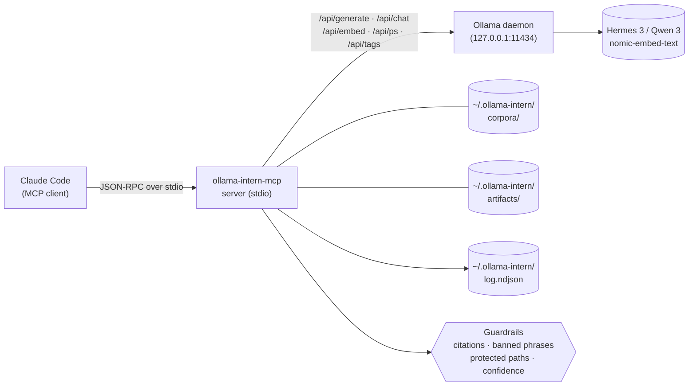

<p align="center">
  <a href="README.ja.md">日本語</a> | <a href="README.zh.md">中文</a> | <a href="README.es.md">Español</a> | <a href="README.fr.md">Français</a> | <a href="README.hi.md">हिन्दी</a> | <a href="README.md">English</a> | <a href="README.pt-BR.md">Português (BR)</a>
</p>

<p align="center">
  
</p>

<p align="center">
  <a href="https://github.com/mcp-tool-shop-org/ollama-intern-mcp/actions"></a>
  <a href="LICENSE"></a>
  <a href="https://mcp-tool-shop-org.github.io/ollama-intern-mcp/"></a>
  <a href="https://mcp-tool-shop-org.github.io/ollama-intern-mcp/handbook/"></a>
</p>

> **Lo stagista locale per Claude Code.** <!-- TOOL_COUNT:start -->42<!-- TOOL_COUNT:end --> strumenti a forma di lavoro, brief basati sull'evidenza, artefatti durevoli.

Un server MCP che fornisce a Claude Code uno **stagista locale** con regole, livelli, una scrivania e un archivio. Claude sceglie lo _strumento_; lo strumento sceglie il _livello_ (Instant / Workhorse / Deep / Embed); il livello scrive un file che potrai aprire la prossima settimana.

**Gestisce anche [Hermes Agent](https://github.com/NousResearch/hermes-agent) su `hermes3:8b`** — validato end-to-end il 2026-04-19. Il modello predefinito è `hermes3:8b`; `qwen3:*` è la rotaia alternativa. Vedi [Usare con Hermes](#use-with-hermes) qui sotto.

**Requisiti hardware:** ~6 GB di VRAM per `hermes3:8b`, oppure ~16 GB di RAM per l'inferenza su CPU. Vedi [handbook/getting-started](https://mcp-tool-shop-org.github.io/ollama-intern-mcp/handbook/getting-started/#hardware-minimums) per il riepilogo completo.

**Non usi Claude?** La directory [`examples/`](./examples/) contiene un client MCP minimale in Node.js e Python che puoi avviare via stdio. Vedi anche [handbook/with-hermes](https://mcp-tool-shop-org.github.io/ollama-intern-mcp/handbook/with-hermes/).

**Prima il locale** — zero traffico di rete in uscita finché non acconsenti. Nessuna telemetria. Niente "autonomia" di nessun tipo. Ogni chiamata mostra il proprio lavoro. L'instradamento opzionale verso [Ollama Cloud](#ollama-cloud-optional) mette modelli di classe 600B dietro gli stessi strumenti quando l'hardware locale è il collo di bottiglia — con fallback automatico al locale.

---

## Novità nella v2.7.0

**Instradamento opzionale verso Ollama Cloud — cloud primario, fallback locale.** Attivalo con una chiave + un flag e i livelli generativi vengono instradati verso un modello cloud di classe 600B; gli embedding restano locali; un interruttore di sicurezza ripiega sul profilo locale in caso di qualsiasi errore cloud. **Disattivato per impostazione predefinita — zero traffico in uscita a meno che non imposti sia `OLLAMA_API_KEY` sia `OLLAMA_CLOUD_PRIMARY=1`.** Modifica additiva minore — i chiamanti pre-v2.7.0 (e chiunque non aderisca) vedono un comportamento identico bit per bit. Vedi [Ollama Cloud (opzionale)](#ollama-cloud-optional).

- **Cloud primario con rete di sicurezza.** Un `RoutingOllamaClient` prova prima il cloud e ripiega sul profilo locale in caso di timeout / 5xx / 429 / problemi di rete. Le chiavi errate (401/403) vengono segnalate rumorosamente tramite un interruttore persistente invece di degradarsi silenziosamente per sempre; anche un ID modello cloud ritirato/sbagliato (404) viene segnalato.
- **Mai un downgrade silenzioso.** Ogni busta acquisisce `backend` (`cloud`|`local`), `degraded` e `degrade_reason` così sai sempre quando hai ottenuto il modello locale invece di quello grande. Un evento NDJSON `backend_fallback` rende visibile il tasso di fallback cloud→locale in `ollama_log_tail`.
- **`ollama_doctor` riporta autenticazione e raggiungibilità cloud** come blocco separato; `ollama-intern-mcp doctor` mostra una sezione `Cloud (primary)`.
- Il modello cloud predefinito è `minimax-m3:cloud`; sovrascrivilo per livello con `INTERN_CLOUD_MODEL` / `INTERN_CLOUD_DEEP_MODEL` (es. `deepseek-v3.1:671b`).

## Novità nella v2.6.0

Override del budget per livello per singola chiamata su `ollama_extract`. Modifica additiva minore — i chiamanti pre-v2.6.0 rimangono invariati. Voce dettagliata in [CHANGELOG.md](./CHANGELOG.md).

- **`tier_budget_ms_override?: number` campo dello schema su `ollama_extract`** (opzionale, delimitato `[1, 600000]` ms). Quando presente, applica l'override a ogni tier visitato dal runner così che il meccanismo interno `runWithTimeoutAndFallback` in `src/guardrails/timeouts.ts:61` rispetti il budget fornito dall'operatore invece del default del profilo. La cascata (workhorse → instant al timeout) scatta comunque; l'override governa uniformemente ogni hop della cascata.
- **Perché esiste.** Il wrapper R-018 di research-os (v0.12.1) ha avvolto `callTool` di MCP con `Promise.race` e ha scoperto che il budget del wrapper non raggiungeva il tier interno — `DEV_RTX5080_TIMEOUTS.instant = 15_000` continuava a far scattare `TIER_TIMEOUT` a 15000ms indipendentemente da un budget del wrapper di 180000ms. v2.6.0 fornisce il budget autorevole lato MCP così che il flag `--planner-timeout-ms` dell'operatore (research-os) finalmente controlli i timeout dei tier interni come progettato.
- **Comportamento predefinito preservato.** Campo omesso = i default del profilo governano in modo byte-identico. I chiamanti pre-v2.6.0 non vedono alcun cambiamento.
- **Regex R-010 per la causa di fallback preservata.** Il messaggio di errore `TIER_TIMEOUT` lato server continua a corrispondere a `/elapsed=(\d+)ms/` + `/budget=(\d+)ms/` così che la visibilità dell'AI-advisor a valle funzioni sia sul percorso di override che su quello di default.
- Consumato da research-os v0.13.0 (cumulative R-019 client wire-up + R-020 + R-021) in un rilascio multi-repo coordinato.

### Storico — deliverable di v2.4.0

Vedi [CHANGELOG.md](./CHANGELOG.md) e [docs/release-notes/v2.4.0.md](./docs/release-notes/v2.4.0.md) per la voce completa di v2.4.0 (controllo per-tier di `num_ctx` sul sistema di profili).

## Novità in v2.4.0

Controllo per-tier di `num_ctx` (context window) sul sistema di profili. Minor additivo — i chiamanti v2.3.0 restano invariati. Voci dettagliate in [CHANGELOG.md](./CHANGELOG.md) e [docs/release-notes/v2.4.0.md](./docs/release-notes/v2.4.0.md).

- **Mappa `TierConfig.num_ctx` (nuova)** — opzionale `{ instant?, workhorse?, deep?, embed? }` sul profilo. Quando impostato per un tier, il server MCP inserisce `options.num_ctx = <value>` in ogni richiesta generate/chat di Ollama instradata a quel tier (iniziale + fallback). Quando non impostato, la richiesta omette interamente `num_ctx` così che Ollama usi il default caricato dal modello — comportamento v2.3.0 preservato esattamente.
- **Nuovo campo envelope `num_ctx_used?: number`** — presente solo quando il server MCP ha effettivamente inviato `num_ctx`. Assente quando la richiesta lascia scegliere a Ollama. Non inferire un default — il server MCP non interroga Ollama per il valore effettivo.
- **Default del profilo**: `dev-rtx5080` / `dev-rtx5080-qwen3` vengono forniti con `instant: 4096`, `workhorse: 8192`, `deep`/`embed` NON IMPOSTATO. Dimensionati per mantenere `hermes3:8b` residente nel budget VRAM di 16GB della RTX 5080 per strumenti veloci. `m5-max` lascia ogni tier NON IMPOSTATO — la memoria unificata da 128GB non ha problemi di spill.
- **Chiude la diagnostica di Fase 1 di v0.8.0** — `hermes3:8b` al context di default 32K sulla RTX 5080 andava in spill sulla CPU e ha iniziato a causare timeout delle chiamate `ollama_extract` workhorse. v2.4.0 lo previene a livello di profilo.

### Controllo per-tier di `num_ctx` (novità in v2.4.0)

Profilo (estratto da `src/profiles.ts`):

```ts
"dev-rtx5080": {
  tiers: {
    instant: "hermes3:8b",
    workhorse: "hermes3:8b",
    deep: "hermes3:8b",
    embed: "nomic-embed-text",
    num_ctx: {
      instant: 4096,    // fast classify/summarize
      workhorse: 8192,  // schema-bound extract / batch
      // deep: UNSET — long-context briefs keep current behavior
      // embed: UNSET — no context-window pressure on embed
    },
  },
  // ... timeouts, prewarm
}
```

Envelope su una chiamata di tier workhorse (es. `ollama_extract`):

```jsonc
{
  "result": { /* extracted data */ },
  "tier_used": "workhorse",
  "model": "hermes3:8b",
  "num_ctx_used": 8192,        // present because the profile set workhorse=8192
  // ... rest of envelope unchanged
}
```

Su `m5-max` (o qualsiasi profilo che lascia un tier non impostato), `num_ctx_used` è assente dall'envelope e la richiesta via cavo a Ollama non include il campo `num_ctx` — Ollama usa il default caricato dal modello.

Gli operatori fanno il tuning selezionando/modificando il profilo; non c'è input `num_ctx` per-chiamata sugli schemi degli strumenti. Se una futura chiamata rivela la necessità, il pattern segue l'override `model` di v2.3.0.

### Storico — deliverable di v2.3.0

Vedi [CHANGELOG.md](./CHANGELOG.md) e [docs/release-notes/v2.3.0.md](./docs/release-notes/v2.3.0.md) per la voce completa di v2.3.0 (override del modello per-chiamata).

## Novità in v2.3.0

Override del modello per singola chiamata negli strumenti atom basati su LLM. Minor additivo — i chiamanti della v2.2.0 rimangono invariati. Voci dettagliate in [CHANGELOG.md](./CHANGELOG.md) e [docs/release-notes/v2.3.0.md](./docs/release-notes/v2.3.0.md).

- **Input opzionale `model: string` su 8 strumenti atom** — `ollama_extract`, `ollama_classify`, `ollama_summarize_fast`, `ollama_summarize_deep`, `ollama_research`, `ollama_corpus_answer`, `ollama_chat`, `ollama_code_citation`. Il primo tentativo sul tier dello strumento viene eseguito con il modello specificato dal chiamante; in caso di timeout, la cascata `TIER_FALLBACK` esistente risolve il modello proprio del tier più economico (NON l'override del chiamante). Gli strumenti composite/brief/pack deliberatamente NON accettano `model` — gli atomi ottengono il controllo per singola chiamata, i composite usano i default del tier.
- **Nuovo campo envelope `model_requested?: string`** — presente solo quando l'override è stato fornito. I chiamanti consapevoli della calibrazione confrontano `model_requested` con `model` per rilevare la sostituzione di fallback: `if (env.model_requested && env.model !== env.model_requested) { /* sostituzione */ }`. Input vuoti o solo con spazi generano `ZodError` al parsing dello schema, non un fallback silenzioso.
- **Correzione bug — drift in `src/version.ts`.** La costante runtime `VERSION` viene ora letta da `package.json` al caricamento del modulo; v2.1.0 e v2.2.0 erano state rilasciate riportando la stringa di identità obsoleta `"2.0.0"`. Il nuovo `tests/version.test.ts` blocca `VERSION === pkg.version`.

### Override del modello per singola chiamata (novità in v2.3.0)

```jsonc
{
  "tool": "ollama_classify",
  "arguments": {
    "text": "patch null pointer in auth",
    "labels": ["feat", "fix", "chore"],
    "frame": "what is the change kind?",
    "model": "hermes3:8b"
  }
}
```

Envelope:

```jsonc
{
  "result": { "label": "fix", "confidence": 0.9, "off_topic": false, ... },
  "tier_used": "instant",
  "model": "hermes3:8b",
  "model_requested": "hermes3:8b",       // present because override was supplied
  // ... rest of envelope unchanged
}
```

Se il tier workhorse/deep fosse andato in timeout e la chiamata fosse cascata sul tier istantaneo, `env.model` sarebbe il modello risolto del tier istantaneo e `env.fallback_from` sarebbe `"workhorse"` — `env.model_requested` sarebbe ancora `"hermes3:8b"`, e `env.model !== env.model_requested` è il segnale di sostituzione. L'override è deliberatamente NON portato nel tier più economico; il modello scelto potrebbe non essere adatto al ruolo di quel tier.

### Storico — deliverable v2.2.0

Vedi [CHANGELOG.md](./CHANGELOG.md) e [docs/release-notes/v2.2.0.md](./docs/release-notes/v2.2.0.md) per la voce completa v2.2.0 (topicalità vincolata al frame + astensione strutturata).

## Novità in v2.2.0

Contratto di ruolo per il worker di evidenza locale: topicalità vincolata al frame e astensione strutturata. Minor additivo — i chiamanti della v2.1.0 rimangono invariati. Voci dettagliate in [CHANGELOG.md](./CHANGELOG.md) e [docs/release-notes/v2.2.0.md](./docs/release-notes/v2.2.0.md).

- **Estrazione vincolata al frame** su `ollama_extract`, `ollama_classify`, `ollama_summarize_fast`, `ollama_summarize_deep` — input opzionale `frame: string` + output strutturati `frame_alignment` / `on_topic` / `frame_addressed`. Le fonti fuori tema vengono segnalate invece di essere parafrasate nello schema.
- **Astensione strutturata** su `ollama_research` — campi `weak` / `abstained` / `sources_address_question`. `citations[]` vuoto con `answer` non vuoto non è più un successo silenzioso.
- **Soglia di topicalità** su `ollama_corpus_answer` — opzionale `min_top_score`. Sotto la soglia minima, lo strumento si interrompe con `abstained: true` e salta la sintesi. `score` per citazione ora visibile su ogni citazione.
- **Conservazione dello score di retrieval** attraverso le evidenze del brief — `corpusHitsToEvidence` trasporta `score` (e il knob `corpus_min_evidence_score` filtra in fase di assemblaggio su `incident_brief` / `repo_brief` / `change_brief`).
- **Limiti di intervallo di riga nelle citazioni** — `guardrails/citations.ts` rifiuta intervalli fuori limite su `ollama_research`, coerentemente con la postura esistente su `ollama_code_citation`.
- **Documenti del contratto operatore corretti** — correzione di `chunk_id`/`chunk_index` nel README, riformulazione di "validato lato server", qualificazione della sezione Leggi dell'Evidenza, annotazione dello slogan marketing.

### Regressione del seed — la verifica

Il contratto della slice è verificato rispetto al fallimento letterale del fresh-pack di research-os: arxiv 2112.10422 (Cosmological Standard Timers) sotto il frame della sezione-01 *"Cosa significa custodia delle evidenze nei workflow di deep-research LLM local-first vs cloud?"* — 9 / 9 test del contratto LLM-mock confermano che la sorgente fuori tema è ora contenuta (`frame_alignment.on_topic = false` su extract; `off_topic: true` su classify; `frame_addressed: false` su summarize_deep; `abstained: true` su corpus_answer con `min_top_score` impostato).

### Storico — deliverable di v2.1.0

Vedi [CHANGELOG.md](./CHANGELOG.md) per la voce completa di v2.1.0 (pass di funzionalità: 13 nuovi strumenti + 4 miglioramenti + rimozione del freeze).

---

## Architettura in sintesi



Ogni chiamata di strumento di Claude entra nel server MCP tramite stdio JSON-RPC. Il server valida la chiamata rispetto allo schema [zod](https://zod.dev) dello strumento, esegue le guardie configurate (validazione delle citazioni, rimozione delle frasi vietate, applicazione dei percorsi protetti, soglie di confidenza), quindi instrada verso un renderer deterministico (livello artifact) o una chiamata HTTP a Ollama (ogni altro livello). Il demone Ollama non vede mai i percorsi forniti dall'utente — solo il livello del modello e il prompt preparato. Ogni chiamata accoda un evento strutturato al log NDJSON in `~/.ollama-intern/log.ndjson`, dove `ollama_log_tail` e la tua shell possono leggerlo.

---

## Esempio guida — una chiamata, un artifact

```jsonc
// Claude → ollama-intern-mcp
{
  "tool": "ollama_incident_pack",
  "arguments": {
    "title": "sprite pipeline 5 AM paging regression",
    "logs": "[2026-04-16 05:07] worker-3 OOM killed\n[2026-04-16 05:07] ollama /api/ps reports evicted=true size=8.1GB\n...",
    "source_paths": ["F:/AI/sprite-foundry/src/worker.ts", "memory/sprite-foundry-visual-mastery.md"]
  }
}
```

Restituisce un'envelope che punta a un file su disco:

```jsonc
{
  "result": {
    "pack": "incident",
    "slug": "2026-04-16-sprite-pipeline-5-am-paging-regression",
    "artifact_md":   "~/.ollama-intern/artifacts/incident/2026-04-16-sprite-pipeline-5-am-paging-regression.md",
    "artifact_json": "~/.ollama-intern/artifacts/incident/2026-04-16-sprite-pipeline-5-am-paging-regression.json",
    "weak": false,
    "evidence_count": 6,
    "next_checks": ["residency.evicted across last 24h", "OLLAMA_MAX_LOADED_MODELS vs loaded size"]
  },
  "tier_used": "deep",
  "model": "hermes3:8b",
  "hardware_profile": "dev-rtx5080",
  "tokens_in": 4180, "tokens_out": 612,
  "elapsed_ms": 8410,
  "residency": { "in_vram": true, "evicted": false }
}
```

→ `weak: false` significa che sono stati assemblati ≥2 elementi di evidenza; NON significa che le ipotesi siano verificate. Vedi [Leggi dell'evidenza](#leggi-dellevidenza) sotto.

Quel file markdown è l'output della scrivania dell'intern — intestazioni, blocco di evidenza con id citati, `next_checks` investigativi, banner `weak: true` se l'evidenza è debole. È deterministico: il renderer è codice, non un prompt. (Il renderer è deterministico; il *contenuto* delle ipotesi e delle superfici è generativo — leggili come bozza, non come verificato.) Aprilo domani, fai il diff la prossima settimana, esportalo in un manuale con `ollama_artifact_export_to_path`.

Ogni concorrente in questa categoria parte con "risparmia token." Noi partiamo con _ecco il file che l'intern ha scritto._

### Secondo esempio — costruisci un corpus, poi interrogalo

```jsonc
// 1. Build a persistent, searchable corpus over your project.
{ "tool": "ollama_corpus_index",
  "arguments": { "name": "sprite-foundry",
                 "paths": ["F:/AI/sprite-foundry/src"],
                 "embed_model": "nomic-embed-text" } }
// → { chunks_written: 1204, paths_indexed: 312, failed_paths: [] }

// 2. Ask an evidence-bound question against it.
{ "tool": "ollama_corpus_answer",
  "arguments": { "name": "sprite-foundry",
                 "query": "how does the worker handle OOM eviction?",
                 "top_k": 8 } }
// → { answer: "...", citations: [{chunk_index, path}...], weak: false }
```

Il server valida l'identità della citazione e che ogni `chunk_index` sia nell'intervallo degli hit recuperati. NON dimostra che ogni affermazione generata sia supportata semanticamente dal contenuto del chunk citato — quella è responsabilità del modello, e un recupero debole può comunque produrre risposte a forma di citazione. Procedura completa in [handbook/corpora](https://mcp-tool-shop-org.github.io/ollama-intern-mcp/handbook/corpora/).

---

## Estrazione vincolata al frame (novità di v2.2.0)

`ollama_extract`, `ollama_classify`, `ollama_summarize_fast` e `ollama_summarize_deep` accettano un input opzionale `frame: string`. Il frame nomina la domanda a cui la sorgente deve rispondere; al modello viene istruito di astenersi piuttosto che emettere contenuto vero-ma-fuori-tema quando la sorgente non affronta il frame.

```jsonc
{
  "tool": "ollama_extract",
  "arguments": {
    "text": "<long source document>",
    "schema": { /* your fields */ },
    "frame": "section purpose here — e.g. 'OOM eviction behavior in the sprite worker'"
  }
}
// → result includes frame_alignment: { on_topic: boolean, reason: string, unaddressed_aspects: string[] }
```

Se `frame` viene omesso, il comportamento è invariato rispetto a v2.1.0. Quando viene fornito, `frame_alignment.on_topic = false` segnala che i campi estratti possono essere veri-rispetto-alla-sorgente ma non rilevanti per il frame — trattalo come avente la stessa forma di un brief `weak: true`: utile, ma da verificare prima di promuoverlo a evidenza a valle.

---

## Contratto di astensione (novità di v2.2.0)

`ollama_research` restituisce campi di astensione strutturati: `weak: boolean`, `abstained: boolean`, `sources_address_question: boolean | null`. Un `citations[]` vuoto con un `answer` non vuoto non è più silenzioso: `abstained: true` indica che il modello ha rifiutato di sintetizzare perché i percorsi forniti dal chiamante non affrontavano la domanda. Considera l'astensione come un successo, non come un fallimento: è lo strumento che rifiuta di riciclare un recupero debole in output autorevole.

`ollama_corpus_answer` accetta una soglia opzionale di topicalità `min_top_score: number` (0.0–1.0). Quando il punteggio di recupero massimo per una query scende al di sotto di `min_top_score`, lo strumento si interrompe con `abstained: true` e salta la sintesi, prevenendo la modalità di errore "5 chunk fuori tema con punteggio 0.21 generano comunque una risposta completa" che la regola `weak: true` di v2.1.0 non rilevava (`weak: true` si attivava solo con `hits.length < 2`). Associa questo al campo `score` per citazione, appena esposto su ogni citazione, per verificare la qualità del recupero direttamente dall'envelope.

---

## Cosa c'è qui — quattro livelli, <!-- TOOL_COUNT:start -->42<!-- TOOL_COUNT:end --> strumenti

**Job-shaped** (orientato al compito) significa che ogni strumento definisce un lavoro che affideresti a uno stagista: classifica questo, estrai quello, fai il triage di questi log, redigi questa nota di rilascio, prepara questo incidente. L'input dello strumento è la specifica del lavoro; l'output è il deliverable. Nessuna primitiva generica `run_model` / `chat_with_llm` in cima.

| Livello | Conteggio | Cosa risiede qui |
|---|---|---|
| **Atoms** | 28 | Primitive job-shaped. **15 originali:** `classify`, `extract`, `triage_logs`, `summarize_fast` / `deep`, `draft`, `research`, `corpus_search` / `answer` / `index` / `refresh` / `list`, `embed_search`, `embed`, `chat`. **+13 aggiunti in v2.1.0:** `doctor`, `log_tail`, `batch_proof_check` (ops); `code_map`, `code_citation`, `multi_file_refactor_propose`, `refactor_plan` (refactor); `artifact_prune`, `hypothesis_drill` (artifact/brief); `corpus_health`, `corpus_amend`, `corpus_amend_history`, `corpus_rerank` (corpus). Atomi con capacità batch (`classify`, `extract`, `triage_logs`) accettano `items: [{id, text}]`. |
| **Briefs** | 3 | Brief operativi strutturati e supportati da evidenze. `incident_brief`, `repo_brief`, `change_brief`. Ogni affermazione cita un id di evidenza; gli elementi sconosciuti vengono eliminati lato server. Evidenze deboli generano `weak: true` anziché una narrazione fittizia. |
| **Packs** | 3 | Lavori composti a pipeline fissa che scrivono markdown + JSON durevoli in `~/.ollama-intern/artifacts/`. `incident_pack`, `repo_pack`, `change_pack`. Renderer deterministici — nessuna chiamata al modello sulla forma dell'artefatto. |
| **Artifacts** | 7 | Superficie di continuità sugli output dei pack. `artifact_list` / `read` / `diff` / `export_to_path`, più tre snippet deterministici: `incident_note`, `onboarding_section`, `release_note`. |

Totale: **28 atomi + 3 brief + 3 pack + 7 strumenti artifact = <!-- TOOL_COUNT:start -->42<!-- TOOL_COUNT:end -->**.

Linee di blocco:
- Atomi: blocco **rimosso in v2.1.0** (28 oggi; +13 aggiunti nel passaggio di funzionalità v2.1.0). I nuovi atomi richiedono comunque un gap giustificato da audit, test, pagina del manuale e voce nel CHANGELOG — niente aggiunte estemporanee.
- Pack bloccati a 3. Nessun nuovo tipo di pack.
- Livello artifact bloccato a 7.

Il riferimento completo degli strumenti si trova nel [manuale](https://mcp-tool-shop-org.github.io/ollama-intern-mcp/handbook/tools/).

---

## Installazione

Richiede [Ollama](https://ollama.com) in esecuzione in locale e i modelli del livello scaricati (vedi [Download dei modelli](#model-pulls) sotto).

### Claude Code (consigliato)

La maggior parte degli utenti installa questo aggiungendolo alla configurazione del server MCP di Claude Code — nessuna installazione globale richiesta. Claude Code esegue il server on demand tramite `npx`:

```json
{
  "mcpServers": {
    "ollama-intern": {
      "command": "npx",
      "args": ["-y", "ollama-intern-mcp"],
      "env": {
        "OLLAMA_HOST": "http://127.0.0.1:11434",
        "INTERN_PROFILE": "dev-rtx5080"
      }
    }
  }
}
```

### Claude Desktop

Stesso blocco, scritto in `~/Library/Application Support/Claude/claude_desktop_config.json` (macOS) o `%APPDATA%\Claude\claude_desktop_config.json` (Windows).

### Installazione globale (avanzata)

Necessario solo se vuoi il binario nel tuo `PATH` per uso ad-hoc al di fuori di Claude Code:

```bash
npm install -g ollama-intern-mcp
```

### Utilizzo con Hermes

Questo MCP è stato validato end-to-end con [Hermes Agent](https://github.com/NousResearch/hermes-agent) contro `hermes3:8b` su Ollama (2026-04-19). Hermes è un agent esterno che *invoca* la superficie di primitive congelata di questo MCP — fa la pianificazione, noi facciamo il lavoro.

Configurazione di riferimento ([hermes.config.example.yaml](hermes.config.example.yaml) in questo repo):

```yaml
model:
  provider: custom
  base_url: http://localhost:11434/v1
  default: hermes3:8b
  context_length: 65536    # Hermes requires 64K floor under model.*

providers:
  local-ollama:
    name: local-ollama
    base_url: http://localhost:11434/v1
    api_mode: openai_chat
    api_key: ollama
    model: hermes3:8b

mcp_servers:
  ollama-intern:
    command: npx
    args: ["-y", "ollama-intern-mcp"]
    env:
      OLLAMA_HOST: http://localhost:11434
      INTERN_PROFILE: dev-rtx5080
      # hermes3:8b is the default ladder in v2.0.0, so tier overrides are
      # only needed if you're pinning a different local model.
```

**La forma del prompt è importante.** I prompt imperativi di invocazione tool ("Chiama X con argomenti …") sono il test di integrazione — forniscono a un modello locale 8B abbastanza scaffolding per emettere `tool_calls` puliti. I prompt multi-task in forma di lista ("fai A, poi B, poi C") sono benchmark di capacità per modelli più grandi; non interpretare un fallimento in forma di lista su 8B come "il cablaggio è rotto". Vedi [handbook/with-hermes](https://mcp-tool-shop-org.github.io/ollama-intern-mcp/handbook/with-hermes/) per la procedura completa di integrazione + le caveat note sul trasporto (Ollama `/v1` streaming + shim non-streaming openai-SDK).

### Pull dei modelli

**Profilo dev predefinito (RTX 5080 16GB e simili):**

```bash
ollama pull hermes3:8b
ollama pull nomic-embed-text
export OLLAMA_MAX_LOADED_MODELS=2
export OLLAMA_KEEP_ALIVE=-1
```

**Binario alternativo Qwen 3 (stesso hardware, per il tooling Qwen):**

```bash
ollama pull qwen3:8b
ollama pull qwen3:14b
ollama pull nomic-embed-text
export INTERN_PROFILE=dev-rtx5080-qwen3
```

**Profilo M5 Max (128GB unificato):**

```bash
ollama pull qwen3:14b
ollama pull qwen3:32b
ollama pull nomic-embed-text
export INTERN_PROFILE=m5-max
```

Le variabili d'ambiente per livello (`INTERN_TIER_INSTANT`, `INTERN_TIER_WORKHORSE`, `INTERN_TIER_DEEP`, `INTERN_EMBED_MODEL`) continuano a sovrascrivere le scelte del profilo per i casi una tantum.

---

## Envelope uniforme

Ogni tool restituisce la stessa forma:

```ts
{
  result: <tool-specific>,
  tier_used: "instant" | "workhorse" | "deep" | "embed",
  model: string,
  hardware_profile: string,     // "dev-rtx5080" | "dev-rtx5080-qwen3" | "m5-max"
  tokens_in: number,
  tokens_out: number,
  elapsed_ms: number,
  residency: {
    in_vram: boolean,
    size_bytes: number,
    size_vram_bytes: number,
    evicted: boolean
  } | null
}
```

`residency` proviene da `/api/ps` di Ollama. Quando `evicted: true` o `size_vram < size`, il modello è stato paginato su disco e l'inferenza è calata di 5–10× — comunica questo all'utente così sa di riavviare Ollama o ridurre il numero di modelli caricati.

In modalità [Ollama Cloud](#ollama-cloud-optional) l'envelope trasporta anche `backend` (`"cloud"` | `"local"`) e, in caso di fallback cloud→local, `degraded: true` + `degrade_reason`. Questi campi sono **assenti** nel percorso predefinito solo locale, quindi i consumer esistenti non sono interessati. `residency` è `null` per le chiamate servite dal cloud (il cloud stateless non ha residenza VRAM locale).

Ogni chiamata viene registrata come una riga NDJSON in `~/.ollama-intern/log.ndjson`. Filtra per `hardware_profile` per escludere i numeri di sviluppo dai benchmark pubblicabili.

---

## Profili hardware

| Profilo | Instant | Workhorse | Deep | Embed |
|---|---|---|---|---|
| **`dev-rtx5080`** (predefinito) | hermes3 8B | hermes3 8B | hermes3 8B | nomic-embed-text |
| `dev-rtx5080-qwen3` | qwen3 8B | qwen3 8B | qwen3 14B | nomic-embed-text |
| `m5-max` | qwen3 14B | qwen3 14B | qwen3 32B | nomic-embed-text |

**Il dev predefinito** collassa tutti e tre i livelli di lavoro su `hermes3:8b` — il percorso di integrazione validato di Hermes Agent. Lo stesso modello dall'inizio alla fine significa che c'è una cosa da pullare, un costo di residenza, un set di comportamenti da capire. Gli utenti che preferiscono Qwen 3 (con la sua impalcatura `THINK_BY_SHAPE`) optano per `dev-rtx5080-qwen3`. `m5-max` è la scaletta Qwen 3 dimensionata per la memoria unificata.

---

## Ollama Cloud (opzionale)

I modelli locali 8B sono il collo di bottiglia hardware che la maggior parte delle persone incontra. [Ollama Cloud](https://ollama.com/cloud) serve modelli di classe 600B dietro la **stessa** superficie `/api/*`, così puoi instradare i tool pesanti verso un modello molto più potente e liberare VRAM locale — mantenendo il locale come fallback sempre attivo.

**Questo è opt-in e disattivato per impostazione predefinita.** Il package rimane local-first con **zero egress** a meno che tu non imposti *entrambi*. Chi non opta non è interessato.

```json
{
  "mcpServers": {
    "ollama-intern": {
      "command": "npx",
      "args": ["-y", "ollama-intern-mcp"],
      "env": {
        "OLLAMA_CLOUD_PRIMARY": "1",
        "OLLAMA_API_KEY": "sk-...your-key...",
        "INTERN_PROFILE": "dev-rtx5080"
      }
    }
  }
}
```

> **La chiave è una variabile d'ambiente di runtime, non un segreto CI.** Un segreto di GitHub Actions è visibile solo all'interno delle esecuzioni CI — non raggiunge mai il server in esecuzione. Crea una chiave su [ollama.com/settings/keys](https://ollama.com/settings/keys) e inseriscila nel blocco `env` del tuo client MCP (o nel tuo ambiente shell).

**Come funziona il routing.** Quando il cloud è attivo, i livelli generativi (instant / workhorse / deep) vanno al modello cloud; **gli embedding rimangono sempre locali** (Ollama Cloud non serve modelli di embedding, quindi gli strumenti corpus/embed non sono interessati). Un circuit breaker tenta prima il cloud e ripiega sul tuo profilo locale in caso di timeout / 5xx / 429 / errori di rete. Una chiave errata (401/403) fa scattare un interruttore *persistente* che si manifesta in modo evidente anziché degradarsi silenziosamente. Il profilo locale (`INTERN_PROFILE`) è la scala di fallback, quindi mantieni i suoi modelli scaricati.

**Non vieni mai retrocesso silenziosamente.** Ogni envelope riporta quale backend ha servito la chiamata:

```ts
{ ...envelope, backend: "cloud" | "local", degraded?: true, degrade_reason?: "cloud_timeout" | "cloud_5xx" | "cloud_rate_limited" | "cloud_unreachable" | "cloud_auth_failed" | "circuit_open" }
```

Una riga `backend_fallback` viene scritta in `~/.ollama-intern/log.ndjson` ad ogni fallback cloud→locale (`ollama_log_tail --filter_kind backend_fallback`), e `ollama-intern-mcp doctor` mostra un blocco **Cloud (primary)** con raggiungibilità + stato di autenticazione.

**Latenza vs qualità.** I modelli cloud di grandi dimensioni sono molto più lenti per token rispetto a un 8B locale (secondi, non millisecondi) — un upgrade di qualità, non di velocità. I livelli cloud usano una generosa scala di timeout (instant 30s / workhorse 120s / deep 300s per impostazione predefinita).

### Variabili d'ambiente cloud

| Var | Predefinito | Scopo |
|---|---|---|
| `OLLAMA_CLOUD_PRIMARY` | _(non impostata)_ | **L'interruttore opt-in.** `1`/`true`/`yes`/`on` abilita cloud-primary. Non impostata = solo locale, zero uscita dati. |
| `OLLAMA_API_KEY` | _(non impostata)_ | Chiave Bearer per Ollama Cloud. **Richiesta** quando il cloud è abilitato (fail-fast all'avvio se mancante). |
| `OLLAMA_CLOUD_HOST` | `https://ollama.com` | Host base del cloud. |
| `INTERN_CLOUD_MODEL` | `minimax-m3:cloud` | Modello cloud per instant + workhorse + deep. |
| `INTERN_CLOUD_DEEP_MODEL` | _(= `INTERN_CLOUD_MODEL`)_ | Override opzionale solo per il livello deep, ad es. `deepseek-v3.1:671b`. |
| `INTERN_CLOUD_TIMEOUT_{INSTANT,WORKHORSE,DEEP}_MS` | `30000`/`120000`/`300000` | Timeout dei tentativi cloud per livello. |
| `INTERN_CLOUD_NUM_CTX` | `32768` | Limite della finestra di contesto per le chiamate cloud (il cloud fattura in base al tempo GPU; il limite controlla il costo). |

> **Modifiche alla disponibilità dei modelli.** Ollama ritira periodicamente i modelli cloud. `minimax-m3:cloud`, `deepseek-v3.1:671b`, `gpt-oss:120b` e `qwen3-coder:480b` sono le scelte attuali; controlla [ollama.com/search?c=cloud](https://ollama.com/search?c=cloud) prima di fissare un ID.

**Nota sulla privacy.** Instradare verso Ollama Cloud invia i prompt a una terza parte. La [privacy policy](https://ollama.com/privacy) di Ollama afferma che i prompt cloud vengono elaborati in modo transitorio, non conservati oltre la richiesta e non utilizzati per l'addestramento — ma si tratta comunque di un'uscita di dati, motivo per cui è opt-in e dichiarato. La modalità solo locale (l'impostazione predefinita) non invia nulla fuori dalla macchina.

---

## Leggi sulle prove

Queste sono applicate nel server, non nel prompt:

- **Citazioni richieste.** Ogni affermazione del brief cita un id di evidenza.
- **Elementi sconosciuti rimossi lato server.** I modelli che citano id non presenti nel pacchetto di evidenze vedono tali id eliminati con un avviso prima della restituzione del risultato.
- **Convalidato per ID, non per contenuto.** Il server verifica che ogni `evidence_ref` citato punti a un id di evidenza reale nell'insieme assemblato. NON verifica che il testo dell'affermazione sia derivabile dall'evidenza citata — quello è compito del modello, e i brief deboli a volte contengono affermazioni non supportate con riferimenti validi. Usa `weak: true` + `coverage_notes` + il campo `excerpt` incluso per effettuare verifiche a campione.
- **Debole è debole.** Evidenze scarse vengono segnalate con `weak: true` e note di copertura. Mai appiattite in una narrazione fittizia.
- **Investigativo, non prescrittivo.** Solo `next_checks` / `read_next` / `likely_breakpoints`. I prompt vietano "applica questa correzione".
- **Renderer deterministici.** La forma markdown dell'artefatto è codice, non un prompt. `draft` resta riservato alla prosa in cui la formulazione del modello conta.
- **Solo differenze all'interno dello stesso pacchetto.** L'`artifact_diff` tra pacchetti diversi viene rifiutato rumorosamente; i payload restano distinti.

---

## Artefatti e continuità

I pacchetti scrivono in `~/.ollama-intern/artifacts/{incident,repo,change}/<slug>.(md|json)`. Il livello degli artefatti fornisce una superficie di continuità senza trasformare questo strumento in un gestore di file:

- `artifact_list` — indice solo dei metadati, filtrabile per pacchetto, data, glob sullo slug
- `artifact_read` — lettura tipizzata per `{pack, slug}` o `{json_path}`
- `artifact_diff` — confronto strutturato nello stesso pacchetto; weak-flip messo in evidenza
- `artifact_export_to_path` — scrive un artefatto esistente (con intestazione di provenienza) in un `allowed_roots` dichiarato dal chiamante. Rifiuta i file esistenti a meno che `overwrite: true`.
- `artifact_incident_note_snippet` — frammento di nota dell'operatore
- `artifact_onboarding_section_snippet` — frammento del manuale
- `artifact_release_note_snippet` — frammento di release note in DRAFT

Nessuna chiamata al modello in questo livello. Tutto viene reso dal contenuto memorizzato.

---

## Modello di minaccia e telemetria

**Dati toccati:** percorsi di file che il chiamante fornisce esplicitamente (`ollama_research`, strumenti del corpus), testo inline, e artefatti che il chiamante chiede di scrivere sotto `~/.ollama-intern/artifacts/` o in un `allowed_roots` dichiarato dal chiamante.

**Dati NON toccati:** nulla al di fuori di `source_paths` / `allowed_roots`. `..` viene rifiutato prima della normalizzazione. `artifact_export_to_path` rifiuta i file esistenti a meno che `overwrite: true`. Le bozze destinate a percorsi protetti (`memory/`, `.claude/`, `docs/canon/`, ecc.) richiedono `confirm_write: true` esplicito, applicato lato server.

**Egress di rete:** **disattivato per impostazione predefinita.** Subito pronto all'uso, l'unico traffico in uscita è verso l'endpoint HTTP locale di Ollama — nessuna chiamata al cloud, nessun ping di aggiornamento, nessuna segnalazione di crash. **Eccezione opt-in:** se abiliti [Ollama Cloud](#ollama-cloud-opzionale) (`OLLAMA_CLOUD_PRIMARY=1` + `OLLAMA_API_KEY`), i prompt per i livelli generativi vengono inviati a `ollama.com` su HTTPS con una chiave Bearer. Questo è esplicito, dichiarato, e disattivato a meno che non vengano impostate entrambe le variabili; gli embedding non lasciano mai la macchina. Vedi [SECURITY.md](SECURITY.md) §11.

**Telemetria:** **nessuna.** Ogni chiamata viene registrata come una riga NDJSON in `~/.ollama-intern/log.ndjson` sulla tua macchina. Il server stesso non telefona a nessuno.

**Errori:** forma strutturata `{ code, message, hint, retryable }`. Gli stack trace non vengono mai esposti attraverso i risultati degli strumenti.

Policy completa: [SECURITY.md](SECURITY.md).

---

## Standard

Costruito secondo lo standard [Shipcheck](https://github.com/mcp-tool-shop-org/shipcheck). I gate rigidi A–D passano; vedi [SHIP_GATE.md](SHIP_GATE.md) e [SCORECARD.md](SCORECARD.md).

- **A. Sicurezza** — SECURITY.md, modello delle minacce, nessuna telemetria, sicurezza dei percorsi, `confirm_write` sui percorsi protetti
- **B. Errori** — forma strutturata in tutti i risultati degli strumenti; nessuno stack grezzo
- **C. Documentazione** — README aggiornato, CHANGELOG, LICENSE; gli schemi degli strumenti si autodocumentano
- **D. Igiene** — `npm run verify` (suite completa di vitest), CI con scansione delle dipendenze, Dependabot, lockfile, `engines.node`

---

## Roadmap (consolidamento, non espansione dell'ambito)

- **Fase 1 — Spina della Delega** ✓ rilasciata: superficie degli atomi, involucro uniforme, instradamento a livelli, barriere di protezione
- **Fase 2 — Spina della Verità** ✓ rilasciata: chunking dello schema v2, BM25 + RRF, corpora viventi, brief basati su evidenze, pacchetto di valutazione del recupero
- **Fase 3 — Spina dei Pacchetti e degli Artefatti** ✓ rilasciata: pacchetti a pipeline fissa con artefatti durevoli + livello di continuità
- **Fase 4 — Spina dell'Adozione** ✓ v2.0.1: passaggio di salute in tre fasi ha consolidato il corpus (TOCTOU, limite dei file a 50 MB, rifiuto dei symlink, scritture atomiche, cattura degli errori per file), attraversamento del percorso degli strumenti, osservabilità (eventi di attesa del semaforo, contesto dell'errore di timeout, registrazione dell'override delle variabili d'ambiente del profilo, segnale di avvio a freddo con preriscaldamento), sicurezza dei test (snapshot dell'ambiente al caricamento del modulo su 10 file, E2E di `tools/call`). Manuale di risoluzione dei problemi + requisiti hardware minimi aggiunti per gli operatori.
- **Fase 5 — Benchmark M5 Max** — numeri pubblicabili una volta arrivato l'hardware (~2026-04-24)

Fase per livello di consolidamento. I livelli dei pacchetti e degli artefatti rimangono congelati a 3 e 7. Il congelamento degli atomi è stato revocato alla v2.1.0 — i nuovi atomi richiedono una lacuna giustificata tramite audit, test, pagina nel manuale e voce nel CHANGELOG.

---

## Licenza

MIT — vedi [LICENSE](LICENSE).

---

<p align="center">Built by <a href="https://mcp-tool-shop.github.io/">MCP Tool Shop</a></p>
