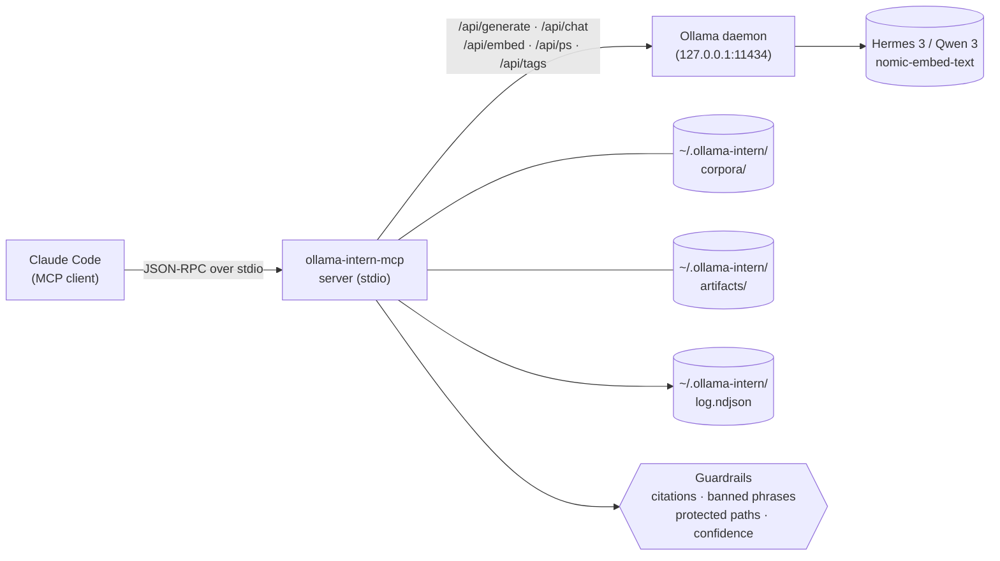

<p align="center">
  <a href="README.ja.md">日本語</a> | <a href="README.zh.md">中文</a> | <a href="README.es.md">Español</a> | <a href="README.fr.md">Français</a> | <a href="README.hi.md">हिन्दी</a> | <a href="README.md">English</a> | <a href="README.pt-BR.md">Português (BR)</a>
</p>

<p align="center">
  
</p>

<p align="center">
  <a href="https://github.com/mcp-tool-shop-org/ollama-intern-mcp/actions"></a>
  <a href="LICENSE"></a>
  <a href="https://mcp-tool-shop-org.github.io/ollama-intern-mcp/"></a>
  <a href="https://mcp-tool-shop-org.github.io/ollama-intern-mcp/handbook/"></a>
</p>

> **Lo stagista locale per Claude Code.** <!-- TOOL_COUNT:start -->42<!-- TOOL_COUNT:end --> strumenti specifici per ogni compito, istruzioni basate sull'evidenza, artefatti durevoli.

Un server MCP che fornisce a Claude Code uno **stagista locale** con regole, livelli di accesso, una scrivania e un archivio. Claude seleziona lo _strumento_; lo strumento seleziona il _livello_ (Istante / Robusto / Approfondito / Incorporato); il livello scrive un file che è possibile aprire la prossima settimana.

**Gestisce anche [Hermes Agent](https://github.com/NousResearch/hermes-agent) su `hermes3:8b`** — validato end-to-end il 2026-04-19. La configurazione predefinita è `hermes3:8b`; `qwen3:*` è la configurazione alternativa. Consultare [Utilizzo con Hermes](#use-with-hermes) di seguito.

**Requisiti hardware:** circa 6 GB di VRAM per `hermes3:8b`, o circa 16 GB di RAM per l'inferenza su CPU. Consultare [handbook/getting-started](https://mcp-tool-shop-org.github.io/ollama-intern-mcp/handbook/getting-started/#hardware-minimums) per i dettagli completi.

**Non si utilizza Claude?** La directory [`examples/`](./examples/) contiene un client MCP Node.js e Python minimo che è possibile avviare tramite stdio. Consultare anche [handbook/with-hermes](https://mcp-tool-shop-org.github.io/ollama-intern-mcp/handbook/with-hermes/).

**Priorità locale** — nessun trasferimento di dati in rete finché non si sceglie di abilitarlo. Nessun telemetria. Nessuna funzionalità "autonoma". Ogni chiamata mostra il suo funzionamento. Il routing opzionale [Ollama Cloud](#ollama-cloud-optional) consente di utilizzare modelli di classe 600B con gli stessi strumenti quando l'hardware locale è un collo di bottiglia, con fallback automatico all'utilizzo locale.

---

## Nuovo nella versione 2.9.0

**La funzionalità cloud è disponibile: verifica tra diverse famiglie di modelli, attivazione della modalità cloud su richiesta e i vantaggi economici che ne derivano.** La priorità locale rimane invariata: in assenza di una chiave configurata, il comportamento è identico alla versione 2.8.0 (nessun trasferimento dati verso l'esterno, nessuna verifica iniziale del servizio cloud).

- **`ollama_verify_claims`: verifica tra diverse famiglie di modelli.** `ollama_code_review` *genera* i risultati; questo li *valuta*. Esegue un pannello di valutazione principale di Ollama Cloud (deepseek / kimi / glm per impostazione predefinita) su una famiglia di modelli diversa rispetto alle richieste e alle prove fornite, restituendo per ogni richiesta lo stato CONFIRMATA / SMENTITA / NECESSITA_REVISIONE. L'aggregazione segue la regola secondo cui un singolo dissenso non determina l'esito (≥2 voti necessari per smentire, ≥2 voti necessari per confermare); ogni valutatore utilizza un modello verificato localmente (un fallback locale o un modello sostitutivo sono esclusi e non vengono conteggiati) e gli input delle richieste sono strutturati in modo da eliminare qualsiasi ragionamento. Il limite massimo di affidabilità è documentato: una conferma rappresenta prove a supporto, non una prova definitiva; è affidabile per segnalare errori grossolani, ma meno efficace nel rilevare le sottili differenze tra modelli all'avanguardia.
- **Attivazione della modalità cloud per singola chiamata + modalità standby.** Imposta *solo* `OLLAMA_API_KEY` (senza `OLLAMA_CLOUD_PRIMARY`) e si attiva la **modalità standby**: priorità locale, nessun trasferimento dati verso l'esterno, nessuna verifica iniziale fino a quando una singola chiamata non richiede esplicitamente l'attivazione con `backend:'cloud'`. È possibile attivare una singola valutazione ad alta priorità su un modello da 600 miliardi di parametri senza reindirizzare tutte le chiamate al cloud. La prima attivazione segnala in modo evidente il trasferimento dati nel momento in cui avviene; un override del parametro `model` per singola chiamata viene ora applicato direttamente alla richiesta cloud.
- **`ollama_log_stats`: i vantaggi economici misurati promessi dallo slogan.** Un riepilogo senza l'utilizzo di LLM dei dati NDJSON: suddivisione tra cloud e locale, frequenza del fallback da cloud a locale, token per strumento, p50/p95 della latenza, limitato da una finestra temporale definita dal parametro `since`.
- **Strumento di diagnostica per CI + strumenti leggibili dalle macchine.** `doctor --json --fail-unhealthy` fornisce alle pipeline un meccanismo di controllo reale (con un flag `healthy` che tiene conto del cloud) e ogni strumento ora include le annotazioni MCP `readOnlyHint`/`destructiveHint`/`title`, in modo che i client ricevano informazioni corrette sui permessi. Inoltre, `init --claude` crea uno script pronto per essere incollato nel file `.mcp.json`.

Dettagli completi in [CHANGELOG.md](./CHANGELOG.md).

## Nuovo nella versione 2.8.0

**Maggiore affidabilità, durata e sicurezza — 25 correzioni, tutte testate in anticipo e verificate su più famiglie di prodotti.** Il comportamento con priorità locale non è cambiato e nessun contratto degli strumenti è stato rimosso; le chiamate esistenti continuano a funzionare. I vantaggi sono evidenti:

- **Non si verificano più perdite silenziose dei dati del corpus.** Un errore di lettura transitorio durante `ollama_corpus_refresh` (un blocco dei file di Windows, un antivirus che blocca l'accesso, una finestra di salvataggio dell'editor) classificava il file come "mancante" e **eliminava in modo permanente il relativo contenuto indicizzato**. Ora solo un file effettivamente assente viene eliminato; un errore transitorio mantiene il percorso, lo contrassegna per un nuovo tentativo e preserva i suoi frammenti.
- **Concorrenza che rispetta i limiti stabiliti.** Un timeout di livello può ora annullare una chiamata ancora in coda per l'ottenimento di un permesso (in precedenza rimaneva in sospeso ben oltre il limite temporale, mentre le ricevute indicavano diversamente) e `ollama_chat` instrada finalmente le richieste attraverso il limite temporale/livello, in modo che una singola generazione locale bloccata non possa rallentare tutti gli strumenti e, in modalità cloud-primary, raggiunga effettivamente il cloud.
- **Cloud che si degrada invece di interrompersi.** Un ID del modello cloud dismesso ora esegue il fallback all'utilizzo locale con un motivo chiaro (`cloud_model_missing`) e un suggerimento specifico per il cloud anziché causare un'interruzione completa; il circuito di interruzione non può bloccarsi in modo permanente; un modello persistentemente assente smette di richiedere una comunicazione con il cloud ad ogni chiamata.
- **Superficie di sicurezza che corrisponde alla documentazione.** `ollama_batch_proof_check` ora applica effettivamente il contenimento della directory corrente (con una nuova limitazione dell'ambiente operativo `INTERN_BATCH_PROOF_ALLOWED_ROOTS`, un chiamante non può ampliarla), i sanitizzatori per l'iniezione di prompt hanno ottenuto una maggiore copertura + un limite onestamente dichiarato e la protezione del percorso è insensibile alle maiuscole/minuscole anche su macOS.
- **Artefatti e ricevute affidabili.** Le scritture dei pacchetti sono atomiche e non sovrascrivono silenziosamente i dati; le buste con degrado riportano il livello effettivamente utilizzato; il rilevatore di scrittura interrotta rileva le scritture incomplete in qualsiasi modifica; gli ID dei frammenti non si sovrappongono più tra file con contenuto identico. L'audit delle dipendenze è completamente pulito (0 vulnerabilità).

Dettagli completi in [CHANGELOG.md](./CHANGELOG.md).

## Nuovo nella versione 2.7.0

**Routing opzionale di Ollama Cloud — priorità al cloud, fallback locale.** Abilitare con una chiave + un flag e i livelli generativi instraderanno le richieste a un modello cloud di classe 600B; gli embedding rimangono locali; un circuito di interruzione esegue il fallback al profilo locale in caso di errore del cloud. **Disabilitato per impostazione predefinita — nessun trasferimento di dati in rete a meno che non si impostino sia `OLLAMA_API_KEY` che `OLLAMA_CLOUD_PRIMARY=1`.** Miglioramento incrementale: i chiamanti precedenti alla versione 2.7.0 (e chiunque non scelga di abilitarlo) vedranno un comportamento identico. Consultare [Ollama Cloud (opzionale)](#ollama-cloud-optional).

- **Priorità cloud con rete di sicurezza.** Un `RoutingOllamaClient` tenta prima di utilizzare il cloud e, in caso di timeout / errore 5xx / 429 / problemi di rete, passa al profilo locale. Chiavi non valide (401/403) vengono segnalate in modo evidente tramite un meccanismo di interruzione invece di causare un degrado silenzioso e permanente; anche un ID di modello cloud obsoleto o con errori di battitura (404) viene segnalato.
- **Nessun downgrade silenzioso.** Ogni messaggio include i parametri `backend` (`cloud`|`local`), `degraded` e `degrade_reason`, in modo che tu sappia sempre quando è stato utilizzato il modello locale anziché quello principale. Un evento NDJSON con il parametro `backend_fallback` rende visibile la frequenza del fallback da cloud a locale nei dati di output di `ollama_log_tail`.
- **`ollama_doctor` segnala l'autenticazione e la raggiungibilità del cloud** come un blocco distinto; `ollama-intern-mcp doctor` mostra una sezione "Cloud (primario)".
- Il modello cloud predefinito era `minimax-m3:cloud` nella versione 2.7.0 *(successivamente modificato in `qwen3-coder-next:cloud`: un'impostazione predefinita più ponderata che restituiva risposte vuote per gli strumenti con il parametro `num_predict` limitato; vedere la [tabella delle variabili d'ambiente](#cloud-env-vars))*; è possibile sovrascrivere questo valore per ogni livello utilizzando i parametri `INTERN_CLOUD_MODEL` / `INTERN_CLOUD_DEEP_MODEL`.

## Nuovo nella versione 2.6.0

Sovrascrittura del budget di livello per chiamata su `ollama_extract`. Miglioramento incrementale: i chiamanti precedenti alla versione 2.6.0 non risentono delle modifiche. Dettagli in [CHANGELOG.md](./CHANGELOG.md).

- **Campo dello schema `tier_budget_ms_override?: number` in `ollama_extract`** (opzionale, con limite `[1, 600000]` ms). Quando presente, applica l'override a ogni livello visitato dall'esecutore, in modo che il meccanismo interno `runWithTimeoutAndFallback` in `src/guardrails/timeouts.ts:61` rispetti il budget specificato dall'operatore anziché quello predefinito del profilo. La cascata (workhorse → istantaneo al timeout) continua a essere attivata; l'override regola uniformemente ogni passaggio della cascata.
- **Motivazione di questa funzionalità.** Il wrapper research-os R-018 (v0.12.1) ha incapsulato MCP `callTool` con `Promise.race` e ha scoperto che il budget del wrapper non raggiungeva il livello interno — `DEV_RTX5080_TIMEOUTS.instant = 15_000` continuava ad attivare `TIER_TIMEOUT` a 15000 ms indipendentemente da un budget di 180000 ms del wrapper. La v2.6.0 fornisce il budget definitivo lato MCP, in modo che il flag `--planner-timeout-ms` dell'operatore (research-os) controlli finalmente i timeout dei livelli interni come previsto.
- **Comportamento predefinito preservato.** Campo omesso = le impostazioni predefinite del profilo regolano byte per byte. Le chiamate precedenti alla v2.6.0 non riscontrano alcuna modifica.
- **Espressione regolare `fallback-cause` di R-010 preservata.** Il messaggio di errore `TIER_TIMEOUT` lato server continua a corrispondere a `/elapsed=(\d+)ms/` + `/budget=(\d+)ms/`, in modo che la visibilità dell'AI-advisor a valle funzioni sia con l'override che con i percorsi predefiniti.
- Utilizzato da research-os v0.13.0 (integrazione cumulativa del client R-019 + R-020 + R-021) in un rilascio multi-repository coordinato.

### Storico — elementi forniti nella v2.4.0

Consultare [CHANGELOG.md](./CHANGELOG.md) e [docs/release-notes/v2.4.0.md](./docs/release-notes/v2.4.0.md) per la voce completa della v2.4.0 (controllo `num_ctx` per livello nel sistema di profili).

## Novità nella v2.4.0

Controllo `num_ctx` per livello (finestra di contesto) nel sistema di profili. Modifica minore aggiuntiva: le chiamate alla v2.3.0 non sono modificate. Voci dettagliate in [CHANGELOG.md](./CHANGELOG.md) e [docs/release-notes/v2.4.0.md](./docs/release-notes/v2.4.0.md).

- **Mappa `TierConfig.num_ctx` (nuova)** — opzionale `{ instant?, workhorse?, deep?, embed? }` nel profilo. Quando impostato per un livello, il server MCP inserisce `options.num_ctx = <value>` in ogni richiesta di generazione/chat Ollama indirizzata a tale livello (iniziale + fallback). Quando non è impostato, la richiesta omette completamente `num_ctx`, quindi Ollama utilizza l'impostazione predefinita caricata nel modello — il comportamento della v2.3.0 viene preservato esattamente.
- **Nuovo campo dell'envelope `num_ctx_used?: number`** — presente solo quando il server MCP invia effettivamente `num_ctx`. Assente quando la richiesta consente a Ollama di scegliere. Non dedurre un valore predefinito: il server MCP non interroga Ollama per ottenere il valore effettivo.
- **Impostazioni predefinite del profilo**: `dev-rtx5080` / `dev-rtx5080-qwen3` vengono fornite con `instant: 4096`, `workhorse: 8192`, `deep`/`embed` NON IMPOSTATO. Dimensionato per mantenere `hermes3:8b` residente nei 16 GB di VRAM della RTX 5080 per strumenti veloci. `m5-max` lascia ogni livello NON IMPOSTATO — i 128 GB di memoria unificata non presentano problemi di overflow.
- **Chiude la diagnostica di Fase 1 della v0.8.0** — `hermes3:8b` con il contesto predefinito di 32K sulla RTX 5080 ha causato l'overflow verso la CPU e ha iniziato a far scadere i timeout delle chiamate `ollama_extract` del workhorse. La v2.4.0 impedisce questo a livello di profilo.

### Controllo `num_ctx` per livello (novità nella v2.4.0)

Profilo (estratto da `src/profiles.ts`):

```ts
"dev-rtx5080": {
  tiers: {
    instant: "hermes3:8b",
    workhorse: "hermes3:8b",
    deep: "hermes3:8b",
    embed: "nomic-embed-text",
    num_ctx: {
      instant: 4096,    // fast classify/summarize
      workhorse: 8192,  // schema-bound extract / batch
      // deep: UNSET — long-context briefs keep current behavior
      // embed: UNSET — no context-window pressure on embed
    },
  },
  // ... timeouts, prewarm
}
```

Envelope in una chiamata al livello workhorse (ad esempio, `ollama_extract`):

```jsonc
{
  "result": { /* extracted data */ },
  "tier_used": "workhorse",
  "model": "hermes3:8b",
  "num_ctx_used": 8192,        // present because the profile set workhorse=8192
  // ... rest of envelope unchanged
}
```

Su `m5-max` (o qualsiasi profilo che lascia un livello non impostato), `num_ctx_used` è assente dall'envelope e la richiesta inviata a Ollama non include il campo `num_ctx`: Ollama utilizza l'impostazione predefinita caricata nel modello.

Gli operatori regolano selezionando/modificando il profilo; non esiste un input `num_ctx` per chiamata negli schemi degli strumenti. Se una chiamata futura rivela la necessità, il modello segue l'override `model` della v2.3.0.

### Storico — elementi forniti nella v2.3.0

Consultare [CHANGELOG.md](./CHANGELOG.md) e [docs/release-notes/v2.3.0.md](./docs/release-notes/v2.3.0.md) per la voce completa della v2.3.0 (override del modello per chiamata).

## Novità nella v2.3.0

Override del modello per chiamata tra gli strumenti atomici basati su LLM. Modifica minore aggiuntiva: le chiamate alla v2.2.0 non sono modificate. Voci dettagliate in [CHANGELOG.md](./CHANGELOG.md) e [docs/release-notes/v2.3.0.md](./docs/release-notes/v2.3.0.md).

- **Input `model: string` opzionale su 8 strumenti atomici** — `ollama_extract`, `ollama_classify`, `ollama_summarize_fast`, `ollama_summarize_deep`, `ollama_research`, `ollama_corpus_answer`, `ollama_chat`, `ollama_code_citation`. Il primo tentativo sul livello dello strumento viene eseguito con il modello specificato dal chiamante; in caso di timeout, la cascata `TIER_FALLBACK` esistente risolve il modello del livello più economico (NON l'override del chiamante). Gli strumenti compositi/brevi/pack non accettano deliberatamente `model`: gli atomi ottengono il controllo per chiamata, i compositi utilizzano le impostazioni predefinite del livello.
- **Nuovo campo dell'envelope `model_requested?: string`** — presente solo quando viene fornito l'override. I chiamanti consapevoli della calibrazione confrontano `model_requested` con `model` per rilevare la sostituzione di fallback: `if (env.model_requested && env.model !== env.model_requested) { /* sostituzione */ }`. Gli input vuoti o contenenti solo spazi bianchi generano un errore `ZodError` durante l'analisi dello schema, non una mancata gestione silenziosa.
- **Correzione di bug — deriva di `src/version.ts`.** La costante runtime `VERSION` viene ora letta da `package.json` al caricamento del modulo; la v2.1.0 e la v2.2.0 hanno fornito l'identità della stringa obsoleta `"2.0.0"`. Il nuovo file `tests/version.test.ts` blocca `VERSION === pkg.version`.

### Override del modello per chiamata (novità nella v2.3.0)

```jsonc
{
  "tool": "ollama_classify",
  "arguments": {
    "text": "patch null pointer in auth",
    "labels": ["feat", "fix", "chore"],
    "frame": "what is the change kind?",
    "model": "hermes3:8b"
  }
}
```

Envelope:

```jsonc
{
  "result": { "label": "fix", "confidence": 0.9, "off_topic": false, ... },
  "tier_used": "instant",
  "model": "hermes3:8b",
  "model_requested": "hermes3:8b",       // present because override was supplied
  // ... rest of envelope unchanged
}
```

Se il livello workhorse/deep aveva superato il timeout e la chiamata era passata al livello istantaneo, `env.model` sarebbe stato il modello risolto del livello istantaneo e `env.fallback_from` sarebbe stato `"workhorse"` — `env.model_requested` sarebbe comunque stato `"hermes3:8b"`, e `env.model !== env.model_requested` è il segnale di sostituzione. L'override non viene deliberatamente portato nel livello più economico; il modello scelto potrebbe non essere adatto al ruolo di quel livello.

### Storico — elementi forniti nella v2.2.0

Consultare [CHANGELOG.md](./CHANGELOG.md) e [docs/release-notes/v2.2.0.md](./docs/release-notes/v2.2.0.md) per la versione completa v2.2.0 (pertinenza vincolata al contesto + astensione strutturata).

## Novità nella versione v2.2.0

Contratto di ruolo locale per l'analisi delle evidenze: pertinenza vincolata al contesto e astensione strutturata. Modifica minore aggiuntiva; le chiamate alla versione v2.1.0 rimangono invariate. Dettagli nelle voci [CHANGELOG.md](./CHANGELOG.md) e [docs/release-notes/v2.2.0.md](./docs/release-notes/v2.2.0.md).

- **Estrazione vincolata al contesto** in `ollama_extract`, `ollama_classify`, `ollama_summarize_fast`, `ollama_summarize_deep` — input opzionale `frame: string` + output strutturato `frame_alignment` / `on_topic` / `frame_addressed`. Le fonti non pertinenti vengono contrassegnate anziché essere riformulate secondo lo schema.
- **Astensione strutturata** in `ollama_research` — campi `weak` / `abstained` / `sources_address_question`. Un array `citations[]` vuoto con un campo `answer` non vuoto non è più considerato un successo silenzioso.
- **Soglia di pertinenza** in `ollama_corpus_answer` — input opzionale `min_top_score`. Al di sotto della soglia, lo strumento interrompe l'esecuzione impostando `abstained: true` e saltando la sintesi. Il valore `score` per ogni citazione è ora visibile.
- **Preservazione del punteggio di recupero** tramite evidenze brevi — `corpusHitsToEvidence` memorizza il `score` (e il parametro `corpus_min_evidence_score` filtra durante l'assemblaggio in `incident_brief` / `repo_brief` / `change_brief`).
- **Limiti dell'intervallo di righe delle citazioni** — `guardrails/citations.ts` rifiuta gli intervalli al di fuori dei limiti in `ollama_research`, in linea con il comportamento esistente in `ollama_code_citation`.
- **Correzioni alla documentazione del contratto dell'operatore** — correzione di `chunk_id`/`chunk_index` nel file README, riscritta la frase "validato lato server", sezione Evidence Laws qualificata, aggiunta annotazione allo slogan di marketing.

### Regressione dei test: verifica

Il contratto dello slice viene verificato rispetto al fallimento letterale del pacchetto fresh-pack di research-os: arxiv 2112.10422 (Cosmological Standard Timers) nella sezione 01 *"Qual è il significato della gestione delle evidenze in flussi di lavoro di deep-research basati su LLM locali rispetto a quelli basati su cloud?"* — 9 test contrattuali con LLM simulati confermano che la fonte non pertinente è ora contenuta (`frame_alignment.on_topic = false` nell'estrazione; `off_topic: true` nella classificazione; `frame_addressed: false` nel riepilogo approfondito; `abstained: true` in corpus_answer con `min_top_score` impostato).

### Risultati storici — versione v2.1.0

Consultare [CHANGELOG.md](./CHANGELOG.md) per la versione completa v2.1.0 (passaggio delle funzionalità: 13 nuovi strumenti + 4 miglioramenti + rimozione del blocco).

---

## Architettura in sintesi


```mermaid
flowchart LR
  Claude["Claude Code<br/>(MCP client)"]
  MCP["ollama-intern-mcp<br/>server (stdio)"]
  Ollama["Ollama daemon<br/>(127.0.0.1:11434)"]
  Models[("Hermes 3 / Qwen 3<br/>nomic-embed-text")]
  Corpus[("~/.ollama-intern/<br/>corpora/")]
  Artifacts[("~/.ollama-intern/<br/>artifacts/")]
  NDJSON[("~/.ollama-intern/<br/>log.ndjson")]
  Guards{{"Guardrails<br/>citations · banned phrases<br/>protected paths · confidence"}}

  Claude -- "JSON-RPC over stdio" --> MCP
  MCP --> Guards
  MCP -- "/api/generate · /api/chat<br/>/api/embed · /api/ps · /api/tags" --> Ollama
  Ollama --> Models
  MCP --- Corpus
  MCP --- Artifacts
  MCP --> NDJSON
```

Ogni chiamata allo strumento Claude entra nel server MCP tramite stdio JSON-RPC. Il server convalida la chiamata rispetto allo schema [zod](https://zod.dev) dello strumento, esegue le guardrail configurate (validazione delle citazioni, rimozione di frasi vietate, applicazione di percorsi protetti, soglie di confidenza), quindi indirizza a un renderer deterministico (livello artefatto) o a una chiamata HTTP Ollama (tutti gli altri livelli). Il daemon Ollama non riceve mai i percorsi forniti dall'utente: solo il livello del modello e il prompt preparato. Ogni chiamata aggiunge un evento strutturato al log NDJSON in `~/.ollama-intern/log.ndjson`, dove `ollama_log_tail` e la shell possono leggerlo.

---

## Esempio principale: una chiamata, un artefatto

```jsonc
// Claude → ollama-intern-mcp
{
  "tool": "ollama_incident_pack",
  "arguments": {
    "title": "sprite pipeline 5 AM paging regression",
    "logs": "[2026-04-16 05:07] worker-3 OOM killed\n[2026-04-16 05:07] ollama /api/ps reports evicted=true size=8.1GB\n...",
    "source_paths": ["F:/AI/sprite-foundry/src/worker.ts", "memory/sprite-foundry-visual-mastery.md"]
  }
}
```

Restituisce un "envelope" che punta a un file su disco:

```jsonc
{
  "result": {
    "pack": "incident",
    "slug": "2026-04-16-sprite-pipeline-5-am-paging-regression",
    "artifact_md":   "~/.ollama-intern/artifacts/incident/2026-04-16-sprite-pipeline-5-am-paging-regression.md",
    "artifact_json": "~/.ollama-intern/artifacts/incident/2026-04-16-sprite-pipeline-5-am-paging-regression.json",
    "weak": false,
    "evidence_count": 6,
    "next_checks": ["residency.evicted across last 24h", "OLLAMA_MAX_LOADED_MODELS vs loaded size"]
  },
  "tier_used": "deep",
  "model": "hermes3:8b",
  "hardware_profile": "dev-rtx5080",
  "tokens_in": 4180, "tokens_out": 612,
  "elapsed_ms": 8410,
  "residency": { "in_vram": true, "evicted": false }
}
```

→ `weak: false` significa che sono state assemblate ≥2 voci di evidenza; NON significa che le ipotesi siano state verificate. Consultare la sezione [Evidence laws](#evidence-laws) qui sotto.

Quel file Markdown è l'output dell'assistente: intestazioni, blocco di evidenze con ID citati, indagini `next_checks`, banner `weak: true` se le evidenze sono scarse. È deterministico: il renderer è codice, non un prompt. (Il renderer è deterministico; il *contenuto* delle ipotesi e dei risultati è generativo: considerateli come bozze, non verificati). Apritelo domani, confrontatelo la prossima settimana, esportatelo in un manuale con `ollama_artifact_export_to_path`.

Ogni concorrente in questa categoria inizia dicendo "risparmia token". Noi iniziamo dicendo _ecco il file che l'assistente ha scritto_.

### Secondo esempio: crea un corpus, quindi interrogalo

```jsonc
// 1. Build a persistent, searchable corpus over your project.
{ "tool": "ollama_corpus_index",
  "arguments": { "name": "sprite-foundry",
                 "paths": ["F:/AI/sprite-foundry/src"],
                 "embed_model": "nomic-embed-text" } }
// → { chunks_written: 1204, paths_indexed: 312, failed_paths: [] }

// 2. Ask an evidence-bound question against it.
{ "tool": "ollama_corpus_answer",
  "arguments": { "name": "sprite-foundry",
                 "query": "how does the worker handle OOM eviction?",
                 "top_k": 8 } }
// → { answer: "...", citations: [{chunk_index, path}...], weak: false }
```

Il server convalida l'identità della citazione e verifica che ogni `chunk_index` sia compreso nell'intervallo dei risultati recuperati. NON dimostra che ogni affermazione generata sia semanticamente supportata dal contenuto del blocco citato: questa è la responsabilità del modello, e un recupero debole può comunque produrre risposte simili a citazioni. Descrizione completa in [handbook/corpora](https://mcp-tool-shop-org.github.io/ollama-intern-mcp/handbook/corpora/).

---

## Estrazione vincolata al contesto (novità nella versione v2.2.0)

`ollama_extract`, `ollama_classify`, `ollama_summarize_fast` e `ollama_summarize_deep` accettano un input opzionale `frame: string`. Il frame indica la domanda a cui si chiede alla fonte di rispondere; al modello viene indicato di astenersi anziché emettere contenuti veri ma non pertinenti quando la fonte non affronta il frame.

```jsonc
{
  "tool": "ollama_extract",
  "arguments": {
    "text": "<long source document>",
    "schema": { /* your fields */ },
    "frame": "section purpose here — e.g. 'OOM eviction behavior in the sprite worker'"
  }
}
// → result includes frame_alignment: { on_topic: boolean, reason: string, unaddressed_aspects: string[] }
```

Se `frame` viene omesso, il comportamento rimane invariato rispetto alla versione v2.1.0. Quando fornito, `frame_alignment.on_topic = false` indica che i campi estratti potrebbero essere veri per la fonte ma non pertinenti al frame: trattatelo come una forma simile a un riepilogo `weak: true`: utile, ma controllatelo prima di promuoverlo nelle evidenze successive.

---

## Contratto di astensione (novità nella versione v2.2.0)

`ollama_research` restituisce campi di astensione strutturati: `weak: boolean`, `abstained: boolean`, `sources_address_question: boolean | null`. Un array `citations[]` vuoto con un campo `answer` non vuoto non è più considerato silenzioso: `abstained: true` indica che il modello ha rifiutato di sintetizzare perché i percorsi forniti dal chiamante non affrontavano la domanda. Considerate l'astensione come un successo, non un fallimento: è lo strumento che si rifiuta di "ripulire" un recupero debole in un output autorevole.

`ollama_corpus_answer` accetta un parametro opzionale `min_top_score: number` che definisce una soglia di rilevanza tematica (da 0.0 a 1.0). Quando il punteggio più alto ottenuto per una query è inferiore a `min_top_score`, lo strumento interrompe l'esecuzione con `abstained: true` e salta la fase di sintesi, evitando così il problema che si verificava nella versione 2.1.0 (`weak: true`), in cui "5 frammenti non pertinenti con un punteggio di 0.21 continuavano a generare una risposta completa". In precedenza, `weak: true` veniva attivato solo quando `hits.length < 2`. Abbina questo al campo `score` per ogni citazione, che ora è disponibile e consente di valutare direttamente la qualità dei risultati ottenuti.

---

## Cosa contiene: quattro livelli, <!-- TOOL_COUNT:start -->42<!-- TOOL_COUNT:end --> strumenti

"Job-shaped" significa che ogni strumento è progettato per svolgere un compito specifico che si potrebbe affidare a uno stagista: classificare questo, estrarre quello, gestire questi log, redigere questa nota di rilascio, elaborare questo incidente. L'input dello strumento è la specifica del compito; l'output è il risultato finale. Non c'è una funzione generica `run_model` / `chat_with_llm` a livello superiore.

| Livello | Conteggio | Cosa contiene |
|---|---|---|
| **Atoms** | 31 | Funzionalità di base organizzate in modo funzionale. **Originali 15:** `classify`, `extract`, `triage_logs`, `summarize_fast` / `deep`, `draft`, `research`, `corpus_search` / `answer` / `index` / `refresh` / `list`, `embed_search`, `embed`, `chat`. **+13 aggiunte nella versione 2.1.0:** `doctor`, `log_tail`, `batch_proof_check` (operazioni); `code_map`, `code_citation`, `multi_file_refactor_propose`, `refactor_plan` (rifattorizzazione); `artifact_prune`, `hypothesis_drill` (artefatto/breve descrizione); `corpus_health`, `corpus_amend`, `corpus_amend_history`, `corpus_rerank` (corpus). **+1 funzionalità di revisione:** `code_review` (risultati strutturati della revisione delle richieste pull, elemento fondamentale; solo per la revisione). **+2 nella versione 2.9:** `verify_claims` (un pannello principale cloud tra diverse famiglie di modelli valuta le richieste; richiede l'utilizzo del cloud) e `log_stats` (aggregazione dei dati NDJSON in vantaggi economici misurati: suddivisione tra cloud e locale, frequenza del fallback, p50/p95 per strumento; non richiede chiamate al modello). Le funzionalità che supportano l'elaborazione batch (`classify`, `extract`, `triage_logs`) accettano il parametro `items: [{id, text}]`. |
| **Briefs** | 3 | Brevi descrizioni strutturate basate su prove. `incident_brief`, `repo_brief`, `change_brief`. Ogni affermazione cita un ID di prova; le informazioni sconosciute vengono eliminate lato server. In caso di prove deboli, viene visualizzato `weak: true` anziché una narrazione falsa. |
| **Packs** | 3 | Funzioni complesse a pipeline fissa che scrivono dati strutturati in formato Markdown e JSON nel percorso `~/.ollama-intern/artifacts/`. `incident_pack`, `repo_pack`, `change_pack`. Renderer deterministici: non vengono effettuate chiamate al modello per definire la struttura dell'artefatto. |
| **Artifacts** | 7 | Interfaccia di continuità sui risultati dei pacchetti. `artifact_list` / `read` / `diff` / `export_to_path`, più tre snippet deterministici: `incident_note`, `onboarding_section`, `release_note`. |

Totale: **29 funzioni + 3 brevi descrizioni + 3 pacchetti + 7 strumenti per gli artefatti = <!-- TOOL_COUNT:start -->42<!-- TOOL_COUNT:end -->**.

Linee di congelamento:
- Funzioni: il congelamento è stato **rimosso nella versione 2.1.0** (29 oggi; +13 aggiunte nel rilascio della versione 2.1.0, +1 `code_review` in seguito). Le nuove funzioni richiedono ancora una giustificazione basata su un'analisi, test, una pagina del manuale e una voce nel registro delle modifiche: non vengono aggiunte casualmente.
- Pacchetti congelati a 3. Nessun nuovo tipo di pacchetto.
- Livello degli artefatti congelato a 7.

Il riferimento completo agli strumenti è disponibile nel [manuale](https://mcp-tool-shop-org.github.io/ollama-intern-mcp/handbook/tools/).

---

## Installazione

Richiede che [Ollama](https://ollama.com) sia in esecuzione localmente e che i modelli del livello siano stati scaricati (vedere la sezione [Download dei modelli](#model-pulls) di seguito).

### Claude Code (consigliato)

La maggior parte degli utenti lo installa aggiungendolo alla configurazione del server Claude Code MCP: non è richiesta un'installazione globale. Claude Code esegue il server su richiesta tramite `npx`:

```json
{
  "mcpServers": {
    "ollama-intern": {
      "command": "npx",
      "args": ["-y", "ollama-intern-mcp"],
      "env": {
        "OLLAMA_HOST": "http://127.0.0.1:11434",
        "INTERN_PROFILE": "dev-rtx5080"
      }
    }
  }
}
```

### Claude Desktop

Stesso blocco, scritto in `~/Library/Application Support/Claude/claude_desktop_config.json` (macOS) o `%APPDATA%\Claude\claude_desktop_config.json` (Windows).

### Installazione globale (avanzata)

Necessaria solo se si desidera che il file binario sia presente nel percorso di sistema (`PATH`) per un utilizzo ad hoc al di fuori di Claude Code:

```bash
npm install -g ollama-intern-mcp
```

### Utilizzo con Hermes

Questo MCP è stato validato end-to-end con [Hermes Agent](https://github.com/NousResearch/hermes-agent) utilizzando `hermes3:8b` su Ollama (2026-04-19). Hermes è un agente esterno che *chiama* le funzioni di base congelate di questo MCP; si occupa della pianificazione, noi ci occupiamo dell'esecuzione.

Configurazione di riferimento ([hermes.config.example.yaml](hermes.config.example.yaml) in questo repository):

```yaml
model:
  provider: custom
  base_url: http://localhost:11434/v1
  default: hermes3:8b
  context_length: 65536    # Hermes requires 64K floor under model.*

providers:
  local-ollama:
    name: local-ollama
    base_url: http://localhost:11434/v1
    api_mode: openai_chat
    api_key: ollama
    model: hermes3:8b

mcp_servers:
  ollama-intern:
    command: npx
    args: ["-y", "ollama-intern-mcp"]
    env:
      OLLAMA_HOST: http://localhost:11434
      INTERN_PROFILE: dev-rtx5080
      # hermes3:8b is the default ladder in v2.0.0, so tier overrides are
      # only needed if you're pinning a different local model.
```

**La forma del prompt è importante.** I prompt imperativi che invocano gli strumenti ("Chiama X con gli argomenti...") rappresentano il test di integrazione: forniscono a un modello locale da 8 miliardi di parametri una struttura sufficiente per generare chiamate di funzione pulite. I prompt multi-task in formato elenco ("fai A, poi B, poi C") sono benchmark delle capacità per modelli più grandi; non interpretare un errore con un prompt in formato elenco su un modello da 8 miliardi di parametri come "il collegamento è interrotto". Consultare [handbook/with-hermes](https://mcp-tool-shop-org.github.io/ollama-intern-mcp/handbook/with-hermes/) per la guida completa all'integrazione e le limitazioni note (streaming Ollama `/v1` + shim non in streaming dell'SDK openai).

### Download dei modelli

**Profilo di sviluppo predefinito (RTX 5080 16GB e simili):**

```bash
ollama pull hermes3:8b
ollama pull nomic-embed-text
export OLLAMA_MAX_LOADED_MODELS=2
export OLLAMA_KEEP_ALIVE=-1
```

**Alternativa Qwen 3 (stesso hardware, per gli strumenti Qwen):**

```bash
ollama pull qwen3:8b
ollama pull qwen3:14b
ollama pull nomic-embed-text
export INTERN_PROFILE=dev-rtx5080-qwen3
```

**Profilo M5 Max (128 GB di memoria unificata):**

```bash
ollama pull qwen3:14b
ollama pull qwen3:32b
ollama pull nomic-embed-text
export INTERN_PROFILE=m5-max
```

Le variabili d'ambiente specifiche per ogni livello (`INTERN_TIER_INSTANT`, `INTERN_TIER_WORKHORSE`, `INTERN_TIER_DEEP`, `INTERN_EMBED_MODEL`) sovrascrivono comunque le scelte del profilo per casi specifici.

---

## Envelope uniforme

Ogni strumento restituisce lo stesso formato:

```ts
{
  result: <tool-specific>,
  tier_used: "instant" | "workhorse" | "deep" | "embed",
  model: string,
  hardware_profile: string,     // "dev-rtx5080" | "dev-rtx5080-qwen3" | "m5-max"
  tokens_in: number,
  tokens_out: number,
  elapsed_ms: number,
  residency: {
    in_vram: boolean,
    size_bytes: number,
    size_vram_bytes: number,
    evicted: boolean
  } | null
}
```

`residency` proviene dall'API `/api/ps` di Ollama. Quando `evicted: true` o `size_vram < size`, il modello viene spostato su disco e l'inferenza rallenta di 5-10 volte; visualizza queste informazioni all'utente in modo che sappia se riavviare Ollama o ridurre il numero di modelli caricati.

Nella modalità [Ollama Cloud](#ollama-cloud-optional), l'envelope contiene anche `backend` (`"cloud"` | `"local"`) e, in caso di fallback da cloud a locale, `degraded: true` + `degrade_reason`. Questi campi sono **assenti** nel percorso predefinito solo locale, quindi i sistemi esistenti non vengono interessati. `residency` è `null` per le chiamate eseguite sul cloud (il cloud stateless non ha una residenza nella memoria VRAM locale).

Ogni chiamata viene registrata come una singola riga NDJSON nel file `~/.ollama-intern/log.ndjson`. Filtra per `hardware_profile` per escludere i numeri di versione dai benchmark pubblicabili.

---

## Profili hardware

| Profilo | Istante | Affidabile | Approfondito | Incorporamento |
|---|---|---|---|---|
| **`dev-rtx5080`** (predefinito) | hermes3 8B | hermes3 8B | hermes3 8B | nomic-embed-text |
| `dev-rtx5080-qwen3` | qwen3 8B | qwen3 8B | qwen3 14B | nomic-embed-text |
| `m5-max` | qwen3 14B | qwen3 14B | qwen3 32B | nomic-embed-text |

**Il profilo predefinito** unifica tutti e tre i livelli di prestazioni su `hermes3:8b`, ovvero il percorso di integrazione dell'agente Hermes validato. L'utilizzo dello stesso modello in ogni livello significa che c'è una sola cosa da scaricare, un unico costo di risorse e un insieme di comportamenti da comprendere. Gli utenti che preferiscono Qwen 3 (con la sua architettura `THINK_BY_SHAPE`) possono optare per `dev-rtx5080-qwen3`. `m5-max` è il livello Qwen 3 dimensionato per una memoria unificata.

---

## Ollama Cloud (opzionale)

I modelli locali da 8B rappresentano il collo di bottiglia hardware che la maggior parte degli utenti incontra. [Ollama Cloud](https://ollama.com/cloud) offre modelli della classe 600B tramite la **stessa** interfaccia `/api/*`, in modo da poter indirizzare gli strumenti più pesanti a un modello molto più potente e liberare la VRAM locale, mantenendo al contempo l'opzione locale come fallback sempre attivo.

**Questa è un'opzione e disattivata per impostazione predefinita.** In assenza di una chiave configurata, il pacchetto rimane in modalità locale con **nessun trasferimento dati verso l'esterno**: chi non attiva questa opzione non ne risentirà. Esistono due modi per attivare questa opzione:

- **Priorità cloud** (vedi sotto): imposta *sia* `OLLAMA_CLOUD_PRIMARY=1` che `OLLAMA_API_KEY`: i livelli generativi vengono indirizzati al cloud con fallback locale.
- **Modalità standby del cloud** (versione 2.9): imposta *solo* `OLLAMA_API_KEY`: tutto rimane in modalità locale (nessun trasferimento dati verso l'esterno, nemmeno una verifica iniziale) fino a quando una singola chiamata non richiede esplicitamente l'attivazione con `backend: "cloud"`. Vedi [Modalità standby del cloud e attivazione per singola chiamata](#cloud-standby--per-call-escalation) di seguito.

```json
{
  "mcpServers": {
    "ollama-intern": {
      "command": "npx",
      "args": ["-y", "ollama-intern-mcp"],
      "env": {
        "OLLAMA_CLOUD_PRIMARY": "1",
        "OLLAMA_API_KEY": "sk-...your-key...",
        "INTERN_PROFILE": "dev-rtx5080"
      }
    }
  }
}
```

> **La chiave è una variabile d'ambiente in fase di esecuzione, non un segreto CI.** Un segreto GitHub Actions è visibile solo all'interno delle esecuzioni CI; non raggiunge mai il server in esecuzione. Crea una chiave su [ollama.com/settings/keys](https://ollama.com/settings/keys) e inseriscila nel blocco `env` del tuo client MCP (o nell'ambiente della shell).

**Come funziona l'instradamento.** Quando il cloud è attivo, i livelli generativi (istantaneo / affidabile / approfondito) vengono indirizzati al modello cloud; **gli incorporamenti rimangono sempre locali** (Ollama Cloud non offre modelli di incorporamento, quindi gli strumenti per la gestione del corpus/incorporamento non sono interessati). Un meccanismo di failover tenta prima di utilizzare il cloud e, in caso di timeout / errore 5xx / 429 / errori di rete, torna al profilo locale. Una chiave errata (401/403) attiva un meccanismo di failover *persistente* che segnala l'errore in modo evidente anziché degradare silenziosamente le prestazioni. Il profilo locale (`INTERN_PROFILE`) è il livello di fallback, quindi mantieni i suoi modelli scaricati.

**Non sarai mai retrocesso silenziosamente.** Ogni risposta indica quale backend ha gestito la richiesta:

```ts
{ ...envelope, backend: "cloud" | "local", degraded?: true, degrade_reason?: "cloud_timeout" | "cloud_5xx" | "cloud_rate_limited" | "cloud_unreachable" | "cloud_auth_failed" | "circuit_open" }
```

Una riga `backend_fallback` viene aggiunta al file `~/.ollama-intern/log.ndjson` ogni volta che si verifica un failover da cloud a locale (`ollama_log_tail --filter_kind backend_fallback`), e il comando `ollama-intern-mcp doctor` mostra un blocco **Cloud (primario)** con lo stato di raggiungibilità e autenticazione.

### Modalità standby del cloud e attivazione per singola chiamata

Impostando `OLLAMA_API_KEY` **senza** `OLLAMA_CLOUD_PRIMARY`, si attiva la **modalità standby**: il routing rimane in modalità locale e nulla viene trasferito all'esterno fino a quando una chiamata non include il parametro `backend: "cloud"` (disponibile in `ollama_chat`, utilizzato internamente da `ollama_verify_claims`). Tale singola chiamata attiva l'utilizzo del modello cloud, con lo stesso meccanismo di interruzione + fallback locale e la stessa provenienza dei dati; tutte le altre chiamate rimangono in modalità locale. La **prima** chiamata attivata stampa un messaggio di avviso sull'errore standard indicando l'host e scrive una riga `cloud_egress` nel log NDJSON: il trasferimento dati viene segnalato nel momento in cui avviene, non solo qui nella documentazione.

Le regole, applicate meccanicamente:

- Nessuna chiave → `backend: "cloud"` genera l'errore `CLOUD_NOT_CONFIGURED`. Il modello locale **non** viene mai utilizzato in modo silenzioso mentre si afferma che è stata effettuata l'attivazione.
- Modalità standby + nessun parametro di attivazione → modalità locale, nessun trasferimento dati verso l'esterno (l'avvio non verifica nemmeno la presenza del servizio cloud).
- In modalità cloud primaria, `backend: "local"` forza una singola chiamata a utilizzare il modello locale: un meccanismo di sicurezza inverso.
- Un override del parametro `model` per singola chiamata viene ora applicato direttamente al percorso cloud (in precedenza veniva sovrascritto dalla mappatura tra livello e modello cloud), in modo che gli orchestratori basati sui dati possano specificare il modello cloud esatto per ogni chiamata.

Il modello di riferimento per gli utenti è **`ollama_verify_claims`**: valuta le affermazioni e i risultati utilizzando un gruppo di esperti su cloud composto da tre modelli appartenenti a famiglie diverse (impostazione predefinita: `deepseek-v4-pro:cloud` / `kimi-k2.7-code:cloud` / `glm-5.2:cloud`). Si applica il principio secondo cui una singola opinione contraria non è sufficiente per prendere una decisione; vengono effettuati controlli sul modello utilizzato da ciascun membro del gruppo e viene utilizzata un'etichetta `weak` (debole) quando il numero di membri del gruppo diminuisce. Una conferma da parte del gruppo su affermazioni formulate utilizzando modelli all'avanguardia costituisce *un elemento a supporto, ma non una prova definitiva*: il gruppo individua in modo affidabile gli errori più evidenti, ma è meno efficace nell'individuare quelli più sottili. Consultare la [pagina del manuale](https://mcp-tool-shop-org.github.io/ollama-intern-mcp/handbook/tools/verify-claims/).

**Latenza rispetto alla qualità.** I modelli cloud più grandi vengono eseguiti molto più lentamente per token rispetto a un modello locale da 8B (secondi, non millisecondi), il che rappresenta un miglioramento della qualità, non della velocità. I livelli cloud utilizzano un limite di timeout generoso (istantaneo: 30 secondi / affidabile: 120 secondi / approfondito: 300 secondi per impostazione predefinita).

### Variabili d'ambiente del cloud

| Variabile | Predefinito | Scopo |
|---|---|---|
| `OLLAMA_CLOUD_PRIMARY` | _(non impostato)_ | **Passaggio all'utilizzo primario di cloud.** `1`/`true`/`yes`/`on` indirizza i livelli generativi al cloud. Per disattivare, utilizzare la chiave = **standby** (utilizzo primario locale, con possibilità di escalation per ogni chiamata). Se non si specifica una chiave, viene utilizzato esclusivamente il modello locale, senza alcun trasferimento di dati verso l'esterno. |
| `OLLAMA_API_KEY` | _(non impostato)_ | Chiave di autenticazione per Ollama Cloud. Impostandola da sola, si attiva la modalità **standby**; è **obbligatoria** quando `OLLAMA_CLOUD_PRIMARY` è abilitato (in caso contrario, l'applicazione non verrà avviata). |
| `OLLAMA_CLOUD_HOST` | `https://ollama.com` | Host base del cloud. |
| `INTERN_CLOUD_MODEL` | `qwen3-coder-next:cloud` | Modello cloud per un utilizzo immediato e intensivo. Mantenere l'impostazione predefinita **non-thinking** (senza capacità di ragionamento): l'utilizzo di un modello con capacità di ragionamento in questo contesto consumerebbe rapidamente le risorse disponibili per la generazione di output brevi (utilizzare modelli più complessi nell'override "deep" indicato di seguito). |
| `INTERN_CLOUD_DEEP_MODEL` | _(= `INTERN_CLOUD_MODEL`)_ | Override opzionale solo per il livello più approfondito, ad esempio `deepseek-v3.1:671b`. |
| `INTERN_CLOUD_TIMEOUT_{INSTANT,WORKHORSE,DEEP}_MS` | `30000`/`120000`/`300000` | Timeout per ogni tentativo di connessione al cloud. |
| `INTERN_CLOUD_NUM_CTX` | `32768` | Limite della finestra di contesto per le chiamate al cloud (il cloud addebita in base al tempo di utilizzo della GPU; il limite controlla i costi). |

> **Modifiche alla disponibilità dei modelli.** Ollama aggiorna/disattiva gli ID cloud sul server. A partire dal 2026-07, `qwen3-coder-next:cloud` (impostazione predefinita senza capacità di ragionamento) e i modelli di riferimento con capacità di ragionamento `deepseek-v4-pro:cloud` / `kimi-k2.7-code:cloud` / `glm-5.2:cloud` sono attualmente disponibili; prima di utilizzare un ID specifico, verificare su [ollama.com/search?c=cloud](https://ollama.com/search?c=cloud). Un ID disattivato mostra chiaramente il suo stato (`cloud_model_missing`), senza operare in modo silenzioso.

**Nota sulla privacy.** L'instradamento a Ollama Cloud invia le richieste a una terza parte. La [norma sulla privacy](https://ollama.com/privacy) di Ollama afferma che le richieste al cloud vengono elaborate in modo transitorio, non conservate oltre la richiesta e non utilizzate per l'addestramento, ma si tratta comunque di una trasmissione di dati verso l'esterno, motivo per cui è necessario abilitare esplicitamente questa opzione e informarne l'utente. La modalità solo locale (impostazione predefinita) non invia nulla al di fuori del dispositivo.

---

## Leggi sull'evidenza

Queste vengono applicate sul server, non nella richiesta:

- **Sono richieste le citazioni.** Ogni affermazione breve cita un ID dell'evidenza.
- **Gli elementi sconosciuti vengono eliminati a livello di server.** I modelli che citano ID non presenti nel set di evidenze vedranno tali ID rimossi con un avviso prima che venga restituito il risultato.
- **Validazione degli ID, non del contenuto.** Il server verifica che ogni `evidence_ref` citato punti a un ID dell'evidenza reale nell'insieme assemblato. Non verifica che il testo dell'affermazione possa essere derivato dall'evidenza citata; questo è compito del modello e le affermazioni deboli a volte contengono affermazioni non supportate con riferimenti validi. Utilizza `weak: true` + note sulla copertura + il campo `excerpt` incluso per effettuare controlli a campione.
- **Debole significa debole.** Le evidenze sottili contrassegnano `weak: true` con note sulla copertura. Non vengono mai "ripulite" per creare una narrazione fittizia.
- **Investigativo, non prescrittivo.** Solo `next_checks` / `read_next` / `likely_breakpoints`. Le richieste vietano l'uso di frasi come "applica questa correzione".
- **Renderer deterministici.** La forma del markdown dell'artefatto è codice, non una richiesta. `draft` rimane riservato alla prosa in cui il linguaggio del modello è importante.
- **Differenze solo all'interno dello stesso pacchetto.** Le differenze tra pacchetti (`artifact_diff`) vengono rifiutate in modo evidente; i payload rimangono distinti.

---

## Artefatti e continuità

I pacchetti scrivono nel file `~/.ollama-intern/artifacts/{incident,repo,change}/<slug>.(md|json)`. Il livello degli artefatti ti offre una superficie di continuità senza trasformare questo strumento in un gestore di file:

- `artifact_list`: indice contenente solo metadati, filtrabile per pacchetto, data e modello di corrispondenza del percorso (glob)
- `artifact_read`: lettura tipizzata tramite `{pacchetto, slug}` o `{json_path}`
- `artifact_diff`: confronto strutturato all'interno dello stesso pacchetto; viene evidenziata la differenza minima.
- `artifact_export_to_path`: scrive un artefatto esistente (con intestazione di provenienza) in una cartella `allowed_roots` specificata dal chiamante. Rifiuta i file esistenti a meno che `overwrite: true`.
- `artifact_incident_note_snippet`: frammento di nota dell'operatore relativa a un incidente.
- `artifact_onboarding_section_snippet`: frammento del manuale per l'inserimento di nuovi utenti.
- `artifact_release_note_snippet`: frammento della bozza delle note di rilascio.

In questo livello non vengono effettuate chiamate al modello. Tutti i dati vengono renderizzati da contenuti memorizzati.

---

## Modello delle minacce e telemetria

**Dati interessati:** percorsi dei file forniti esplicitamente dal chiamante (`ollama_research`, strumenti del corpus), testo inline e artefatti che il chiamante richiede vengano scritti in `~/.ollama-intern/artifacts/` o in una cartella `allowed_roots` specificata dal chiamante.

**Dati NON interessati:** qualsiasi elemento al di fuori di `source_paths` / `allowed_roots`. `..` viene rifiutato prima della normalizzazione. `artifact_export_to_path` rifiuta i file esistenti a meno che `overwrite: true`. Le bozze destinate a percorsi protetti (`memory/`, `.claude/`, `docs/canon/`, ecc.) richiedono un esplicito `confirm_write: true`, applicato lato server.

**Traffico di rete in uscita:** **disattivato per impostazione predefinita.** Per impostazione predefinita, l'unico traffico in uscita è diretto all'endpoint HTTP locale di Ollama; non sono presenti chiamate al cloud, ping di aggiornamento o segnalazioni di errori. **Eccezione facoltativa:** se si abilita [Ollama Cloud](#ollama-cloud-optional) (`OLLAMA_CLOUD_PRIMARY=1` + `OLLAMA_API_KEY`), le richieste per i livelli generativi vengono inviate a `ollama.com` tramite HTTPS con una chiave Bearer. Questo è esplicito, dichiarato e disattivato a meno che non si impostino entrambe le variabili; gli embedding non lasciano mai il sistema. Vedere [SECURITY.md](SECURITY.md) §11.

**Telemetria:** **nessuna.** Ogni chiamata viene registrata come una singola riga NDJSON in `~/.ollama-intern/log.ndjson` sulla macchina dell'utente. Il server stesso non invia dati a nessun altro sistema.

**Errori:** formato strutturato `{code, message, hint, retryable}`. Le tracce dello stack non vengono mai esposte tramite i risultati degli strumenti.

Politica completa: [SECURITY.md](SECURITY.md).

---

## Standard

Progettato in base agli standard di [Shipcheck](https://github.com/mcp-tool-shop-org/shipcheck). I controlli rigorosi A–D sono superati; vedere [SHIP_GATE.md](SHIP_GATE.md) e [SCORECARD.md](SCORECARD.md).

- **A. Sicurezza:** SECURITY.md, modello delle minacce, nessuna telemetria, sicurezza dei percorsi, `confirm_write` sui percorsi protetti.
- **B. Errori:** formato strutturato in tutti i risultati degli strumenti; nessuna traccia di stack non elaborata.
- **C. Documentazione:** README aggiornato, CHANGELOG, LICENSE; gli schemi degli strumenti si auto-documentano.
- **D. Igiene:** `npm run verify` (suite completa di test vitest), CI con scansione delle dipendenze, Dependabot, lockfile, `engines.node`.

---

## Roadmap (miglioramenti, non ampliamento dello scopo)

- **Fase 1 — Nucleo di delega:** ✓ rilasciato: superficie atomica, inviluppo uniforme, routing a più livelli, protezioni.
- **Fase 2 — Nucleo della verità:** ✓ rilasciato: schema v2 con suddivisione in blocchi, BM25 + RRF, corpora dinamici, brevi riepiloghi basati su prove, pacchetto di valutazione del recupero.
- **Fase 3 — Nucleo dei pacchetti e degli artefatti:** ✓ rilasciato: pacchetti a pipeline fissa con artefatti durevoli + livello di continuità.
- **Fase 4 — Nucleo dell'adozione:** ✓ v2.0.1: passaggio di controllo della salute in tre fasi, corpus migliorato (TOCTOU, limite di file di 50 MB, rifiuto dei collegamenti simbolici, scritture atomiche, acquisizione di errori per singolo file), attraversamento del percorso degli strumenti, osservabilità (eventi di attesa del semaforo, contesto dell'errore di timeout, registrazione con override dell'ambiente del profilo, segnale di precaricamento all'avvio a freddo), sicurezza dei test (snapshot dell'ambiente di caricamento del modulo su 10 file, `tools/call` E2E). Manuale per la risoluzione dei problemi e requisiti hardware minimi aggiunti per gli operatori.
- **Fase 5 — Benchmark M5 Max:** numeri pubblicabili una volta che l'hardware sarà disponibile (~24 aprile 2026).

Le fasi sono organizzate in base al livello di miglioramento. I livelli dei pacchetti e degli artefatti rimangono fissi ai valori 3 e 7. Il blocco degli atom è stato rimosso nella versione v2.1.0: i nuovi atom richiedono una giustificazione basata su un'analisi, test, una pagina del manuale e una voce nel CHANGELOG.

---

## Licenza

MIT — vedere [LICENSE](LICENSE).

---

<p align="center">Built by <a href="https://mcp-tool-shop.github.io/">MCP Tool Shop</a></p>
