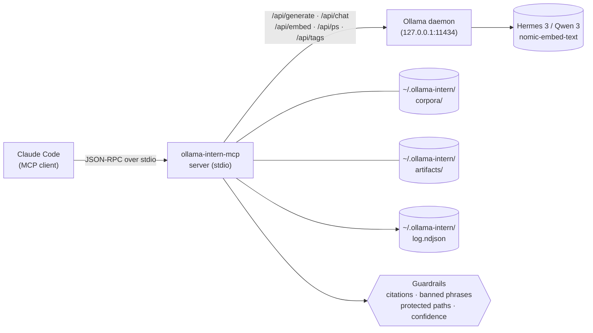

<p align="center">
  <a href="README.ja.md">日本語</a> | <a href="README.zh.md">中文</a> | <a href="README.es.md">Español</a> | <a href="README.fr.md">Français</a> | <a href="README.hi.md">हिन्दी</a> | <a href="README.md">English</a> | <a href="README.pt-BR.md">Português (BR)</a>
</p>

<p align="center">
  
</p>

<p align="center">
  <a href="https://github.com/mcp-tool-shop-org/ollama-intern-mcp/actions"></a>
  <a href="LICENSE"></a>
  <a href="https://mcp-tool-shop-org.github.io/ollama-intern-mcp/"></a>
  <a href="https://www.npmjs.com/package/ollama-intern-mcp"></a>
  <a href="https://mcp-tool-shop-org.github.io/ollama-intern-mcp/handbook/"></a>
  <a href="#ollama-cloud"></a>
</p>

> **Lo stagista locale per Claude Code.** <!-- TOOL_COUNT:start -->44<!-- TOOL_COUNT:end --> strumenti specifici per ogni compito, istruzioni basate sull'evidenza, artefatti durevoli.

Un server MCP che fornisce a Claude Code uno **stagista locale** con regole, livelli, una scrivania e un archivio. Claude seleziona lo _strumento_; lo strumento seleziona il _livello_ (Istante / Robusto / Approfondito / Incorporato); il livello scrive un file che puoi aprire la prossima settimana.

**Inoltre, gestisce [Hermes Agent](https://github.com/NousResearch/hermes-agent) su `hermes3:8b`** — validato end-to-end il 2026-04-19. La configurazione predefinita è `hermes3:8b`; `qwen3:*` è il percorso alternativo. Vedi [Utilizzo con Hermes](#use-with-hermes) di seguito.

**Requisiti hardware:** circa 6 GB di VRAM per `hermes3:8b`, o circa 16 GB di RAM per l'inferenza su CPU. Vedi [handbook/getting-started](https://mcp-tool-shop-org.github.io/ollama-intern-mcp/handbook/getting-started/#hardware-minimums) per i dettagli completi.

**Non si utilizza Claude?** La directory [`examples/`](./examples/) contiene un client MCP Node.js e Python minimo che puoi avviare tramite stdio. Vedi anche [handbook/with-hermes](https://mcp-tool-shop-org.github.io/ollama-intern-mcp/handbook/with-hermes/).

**Priorità locale** — nessun trasferimento di dati in rete finché non si sceglie di abilitarlo. Nessun tracciamento. Nessuna "autonomia". Ogni chiamata mostra il suo processo.

**Non si dispone di una GPU sufficientemente potente? [Ollama Cloud](#ollama-cloud) esegue tutti i <!-- TOOL_COUNT:start -->44<!-- TOOL_COUNT:end --> strumenti su modelli di classe 600B.** La maggior parte delle persone non può ospitare un modello all'avanguardia sul proprio hardware: questo è il vero limite dell'IA locale, e questo lo supera. Stessa interfaccia `/api/*`, stessi strumenti specifici per ogni compito, stesse istruzioni; gli embedding rimangono locali; qualsiasi errore del cloud si ripristina automaticamente al tuo profilo locale. Aumenta **una** chiamata (`backend: "cloud"`) o indirizza ogni chiamata generativa (`OLLAMA_CLOUD_PRIMARY=1`) — e ogni istruzione ti indica quale backend l'ha effettivamente eseguita. Disattivato finché non si imposta una chiave.

---

## Nuovo nella versione 2.10.0

**La versione che garantisce la trasparenza nell'utilizzo del cloud.** La versione 2.9.0 ha introdotto l'escalation al cloud per ogni chiamata e questo file README ha pubblicizzato "aumenta una singola revisione ad alta posta in gioco a un modello da 600B" — ma l'input `backend` esisteva esattamente su **uno** dei 44 strumenti, ed era `ollama_chat`, che la sua stessa descrizione definisce come ultima risorsa. Ogni compito di revisione era assegnato a un modello locale da 8B. La priorità locale rimane invariata: nessuna chiave significa ancora zero trasferimento di dati e nessun controllo all'avvio, gli embedding non lasciano mai il dispositivo e ogni nuova opzione ha come impostazione predefinita il comportamento odierno.

- **L'escalation per ogni chiamata ora raggiunge 15 strumenti, non 1.** `backend: "cloud"` è un input opzionale su `research`, `summarize_deep`, `code_review`, `code_citation`, `corpus_answer`, `hypothesis_drill`, `multi_file_refactor_propose`, `refactor_plan`, tutte e tre le istruzioni, tutti e tre i pacchetti e `chat`. Omettilo e il comportamento sarà identico alla versione 2.9.x. **I pacchetti aumentano solo il loro passaggio di sintesi** — l'assemblaggio delle prove, la classificazione e la scrittura degli artefatti rimangono locali — e rifiutano un'escalation non gestibile *prima* di eseguire qualsiasi operazione locale.
- **`INTERN_CLOUD_STANDBY_TIERS` — definisci la politica una sola volta.** Specifica quali livelli (`instant|workhorse|deep`) devono essere aumentati in caso di inattività senza una direttiva per ogni chiamata. Vuoto per impostazione predefinita. Una direttiva `backend` per ogni chiamata ha comunque la precedenza in entrambe le direzioni. `embed` viene rifiutato al caricamento della configurazione *e* al livello di routing: gli embedding rimangono sempre locali.
- **`doctor --cloud-check` — dimostra che la chiave funziona effettivamente.** Il vecchio controllo utilizzava `/api/tags`, che restituisce 200 per una chiave non valida, quindi l'autenticazione poteva solo leggere "non verificato". Questo esegue una singola generazione di 8 token e restituisce `ok` / `failed` / `unverified` / `unreachable` — quattro stati mantenuti distinti appositamente, perché un errore 404 sull'ID di un modello non è un problema di chiave e non dovrebbe farti cercarne uno. Segnala anche ogni ID cloud configurato come presente o NON NEL CATALOGO con un suggerimento per l'ID attivo più vicino, in modo che un ID dismesso venga trovato prima di pagare per una chiamata degradata.
- **Corretto: `init` era interrotto in ogni installazione npm.** `hermes.config.example.yaml` non è mai stato incluso nel pacchetto pubblicato, quindi il binario ha segnalato il proprio errore di "bug di impacchettamento" a chiunque lo installasse da npm. Ora è incluso e il CI installa ed esegue il pacchetto, quindi non può verificarsi una regressione.
- **I punteggi di recupero sono finalmente comparabili.** `CorpusHit.score` conteneva quattro scale incomparabili sotto un unico campo: la modalità ibrida predefinita raggiungeva il valore massimo di `0.0328`, mentre `corpus_min_evidence_score` era documentato come "0–1", quindi un limite naturale di `0.1` eliminava silenziosamente ogni blocco del corpus. I punteggi unificati vengono ridimensionati a 0–1 e ogni risultato contiene `score_scale`.

Dettagli completi in [CHANGELOG.md](./CHANGELOG.md).

## Nuovo nella versione 2.9.0

**La funzionalità cloud — un percorso di verifica tra diverse famiglie, l'escalation al cloud su richiesta e l'economia per valutarla.** La priorità locale rimane invariata: senza una chiave impostata, il comportamento è identico alla versione 2.8.0 (nessun trasferimento di dati, nessun controllo del cloud all'avvio).

- **`ollama_verify_claims` — verifica incrociata tra diversi modelli.** `ollama_code_review` *genera* risultati; questo *valuta* tali risultati. Esegue un pannello di riferimento di Ollama Cloud con modelli diversi (deepseek / kimi / glm per impostazione predefinita) sulle tue affermazioni + prove e restituisce per ogni affermazione lo stato CONFIRMATA / SMENTITA / NECESSITA_REVISIONE. L'aggregazione si basa sul principio che una singola opinione contraria non è decisiva (≥2 per smentire, ≥2 per confermare); ogni valutatore utilizza un modello verificato (un modello locale di fallback o sostitutivo è escluso e non viene conteggiato) e gli input delle affermazioni sono strutturati in modo da eliminare il ragionamento. Il limite massimo di affidabilità è documentato: una conferma indica prove a sostegno, non una prova definitiva; è affidabile nell'individuare errori grossolani, ma meno efficace nell'individuare errori sottili in un modello all'avanguardia.
- **Scalabilità cloud per chiamata + modalità di standby.** Imposta `OLLAMA_API_KEY` *da solo* (senza `OLLAMA_CLOUD_PRIMARY`) e sarai in **modalità di standby**: modello locale come principale, nessun trasferimento dati, nessuna sonda di avvio, fino a quando una singola chiamata non si attiverà con `backend:'cloud'`. Esegui una revisione ad alto rischio su un modello da 600 miliardi di parametri senza indirizzare ogni chiamata al cloud. La prima scalabilità rivela esplicitamente il trasferimento dati nel momento in cui si verifica; un override per chiamata `model` ora si applica direttamente al tentativo di connessione al cloud.
- **`ollama_log_stats` — la misurazione economica promessa dallo slogan.** Un riepilogo senza l'uso di LLM delle tue ricevute in formato NDJSON: suddivisione cloud/locale, frequenza di fallback da cloud a locale, token per strumento, p50/p95 di latenza, limitato da una finestra `since`.
- **Strumento di controllo per CI + strumenti leggibili dalle macchine.** `doctor --json --fail-unhealthy` fornisce alle pipeline un vero meccanismo di controllo (con un flag `healthy` che tiene conto del cloud) e ogni strumento ora include annotazioni MCP `readOnlyHint`/`destructiveHint`/`title` in modo che i client ricevano le corrette autorizzazioni. Inoltre, `init --claude` crea un modello pronto per essere incollato `.mcp.json`.

Dettagli completi in [CHANGELOG.md](./CHANGELOG.md).

## Nuovo nella versione 2.8.0

**Maggiore affidabilità, durata e sicurezza — 25 correzioni, tutte testate preventivamente e verificate su diversi modelli.** Il comportamento predefinito è locale e non è stato rimosso alcun contratto di strumento; le chiamate esistenti continuano a funzionare. I vantaggi sono evidenti:

- **Non più perdita silenziosa di dati del corpus.** Un errore di lettura transitorio durante `ollama_corpus_refresh` (un blocco di file di Windows, un antivirus che blocca, una finestra di salvataggio di un editor) classificava il file come "mancante" e **eliminava in modo permanente il suo contenuto indicizzato**. Ora viene eliminato solo un file effettivamente assente; un errore transitorio mantiene il percorso, lo contrassegna per un nuovo tentativo e ne conserva i blocchi.
- **Concorrenza che rispetta i limiti stabiliti.** Un timeout di livello può ora annullare una chiamata ancora in coda per un permesso (in precedenza, la chiamata rimaneva in sospeso ben oltre il limite, mentre le ricevute indicavano il contrario) e `ollama_chat` indirizza finalmente il flusso attraverso il limite di timeout/livello, in modo che una singola generazione locale bloccata non possa rallentare tutti gli strumenti e possa effettivamente raggiungere il cloud in modalità cloud-primaria.
- **Cloud che si degrada invece di interrompersi.** Un ID di modello cloud dismesso ora esegue il fallback al modello locale con una chiara motivazione `cloud_model_missing` e un suggerimento specifico per il cloud, invece di causare un'interruzione totale; il circuito di interruzione non può bloccarsi in modo permanente; un modello persistentemente assente smette di richiedere una connessione al cloud per ogni chiamata.
- **Superficie di sicurezza che corrisponde alla documentazione.** `ollama_batch_proof_check` ora applica effettivamente il contenimento della directory di lavoro (con una nuova limitazione dell'ambiente dell'operatore `INTERN_BATCH_PROOF_ALLOWED_ROOTS` che un chiamante non può ampliare), i sanitizzatori di iniezione di prompt hanno ottenuto una maggiore copertura + un limite onestamente dichiarato e la protezione del percorso è insensibile alle maiuscole su macOS.
- **Artefatti e ricevute affidabili.** Le scritture dei pacchetti sono atomiche e non sovrascrivono mai silenziosamente; le buste di batch degradate segnalano il livello effettivamente utilizzato; il rilevatore di scritture interrotte rileva le scritture incomplete su qualsiasi modifica; gli ID dei blocchi non si sovrappongono più tra file con contenuto identico. L'audit delle dipendenze è completamente chiaro (0 vulnerabilità).

Dettagli completi in [CHANGELOG.md](./CHANGELOG.md).

## Nuovo nella versione 2.7.0

**Instradamento opzionale a Ollama Cloud — cloud-primario, fallback locale.** Attiva con una chiave + un flag e i livelli generativi vengono indirizzati a un modello cloud di classe 600B; gli embedding rimangono locali; un circuito di interruzione esegue il fallback al tuo profilo locale in caso di qualsiasi errore del cloud. **Disattivato per impostazione predefinita — nessun trasferimento dati a meno che tu non imposti sia `OLLAMA_API_KEY` che `OLLAMA_CLOUD_PRIMARY=1`.** Miglioramento incrementale: le chiamate precedenti alla versione 2.7.0 (e chiunque non si attivi) vedranno un comportamento identico. Vedi [Ollama Cloud](#ollama-cloud).

- **Cloud-primary with a safety net.** A `RoutingOllamaClient` tries cloud first and falls back to the local profile on timeout / 5xx / 429 / network. Bad keys (401/403) surface loudly via a sticky breaker instead of degrading silently forever; a retired/typo'd cloud model id (404) surfaces too.
- **Never a silent downgrade.** Every envelope gains `backend` (`cloud`|`local`), `degraded`, and `degrade_reason` so you always know when you got the local model instead of the big one. A `backend_fallback` NDJSON event makes the cloud→local fallback rate visible in `ollama_log_tail`.
- **`ollama_doctor` reports cloud auth + reachability** as a distinct block; `ollama-intern-mcp doctor` shows a `Cloud (primary)` section.
- Default cloud model was `minimax-m3:cloud` at v2.7.0 release *(since repinned to `qwen3-coder-next:cloud` — a thinking default returned empty replies on capped-`num_predict` tools; see the [env table](#cloud-env-vars))*; override per-tier with `INTERN_CLOUD_MODEL` / `INTERN_CLOUD_DEEP_MODEL`.

## Nuovo nella versione 2.6.0

Override del budget di livello per chiamata su `ollama_extract`. Miglioramento incrementale: le chiamate precedenti alla versione 2.6.0 rimangono invariate. Dettagli in [CHANGELOG.md](./CHANGELOG.md).

- **`tier_budget_ms_override?: number` schema field on `ollama_extract`** (optional, bounded `[1, 600000]` ms). When present, applies the override to every tier visited by the runner so the inner `runWithTimeoutAndFallback` machinery at `src/guardrails/timeouts.ts:61` honors the operator-supplied budget instead of the profile default. The cascade (workhorse → instant on timeout) still fires; the override governs each cascade hop uniformly.
- **Why this exists.** The research-os R-018 wrapper (v0.12.1) wrapped MCP `callTool` with `Promise.race` and found the wrapper's budget did not reach the inner tier — `DEV_RTX5080_TIMEOUTS.instant = 15_000` continued to fire `TIER_TIMEOUT` at 15000ms regardless of a 180000ms wrapper budget. v2.6.0 supplies the MCP-side authoritative budget so the operator's `--planner-timeout-ms` flag (research-os) finally controls inner-tier timeouts as designed.
- **Default behavior preserved.** Field omitted = profile defaults govern byte-identically. Pre-v2.6.0 callers see zero change.
- **R-010 fallback-cause regex preserved.** Server-side `TIER_TIMEOUT` error message still matches `/elapsed=(\d+)ms/` + `/budget=(\d+)ms/` so AI-advisor visibility downstream works on override and default paths alike.
- Consumed by research-os v0.13.0 (cumulative R-019 client wire-up + R-020 + R-021) in a coordinated multi-repo release.

### Storico — elementi forniti nella v2.4.0

Consultare [CHANGELOG.md](./CHANGELOG.md) e [docs/release-notes/v2.4.0.md](./docs/release-notes/v2.4.0.md) per la voce completa della v2.4.0 (controllo per livello `num_ctx` sul sistema di profili).

## Novità nella v2.4.0

Controllo per livello `num_ctx` (finestra di contesto) sul sistema di profili. Modifica minore aggiuntiva: le chiamate alla v2.3.0 rimangono invariate. Voci dettagliate in [CHANGELOG.md](./CHANGELOG.md) e [docs/release-notes/v2.4.0.md](./docs/release-notes/v2.4.0.md).

- **Mappa `TierConfig.num_ctx` (nuova)** — `{ instant?, workhorse?, deep?, embed? }` opzionale sul profilo. Quando impostato per un livello, il server MCP inserisce `options.num_ctx = <value>` in ogni richiesta di generazione/chat di Ollama indirizzata a tale livello (iniziale + fallback). Quando non è impostato, la richiesta omette completamente `num_ctx`, in modo che Ollama utilizzi il valore predefinito caricato nel modello: comportamento della v2.3.0 preservato esattamente.
- **Nuovo campo dell'intestazione `num_ctx_used?: number`** — presente solo quando il server MCP ha effettivamente inviato `num_ctx`. Assente quando la richiesta consente a Ollama di scegliere. Non dedurre un valore predefinito: il server MCP non interroga Ollama per il valore effettivo.
- **Valori predefiniti del profilo**: `dev-rtx5080` / `dev-rtx5080-qwen3` vengono forniti con `instant: 4096`, `workhorse: 8192`, `deep`/`embed` NON IMPOSTATI. Dimensionati per mantenere `hermes3:8b` residente nei 16 GB di VRAM della RTX 5080 per strumenti veloci. `m5-max` lascia ogni livello NON IMPOSTATO: 128 GB di memoria unificata non presentano problemi di overflow.
- **Chiude la diagnostica di fase 1 della v0.8.0** — `hermes3:8b` con il contesto predefinito di 32K sulla RTX 5080 ha causato overflow sulla CPU e ha iniziato a causare timeout delle chiamate workhorse `ollama_extract`. La v2.4.0 impedisce questo a livello di profilo.

### Controllo per livello `num_ctx` (novità nella v2.4.0)

Profilo (estratto da `src/profiles.ts`):

```ts
"dev-rtx5080": {
  tiers: {
    instant: "hermes3:8b",
    workhorse: "hermes3:8b",
    deep: "hermes3:8b",
    embed: "nomic-embed-text",
    num_ctx: {
      instant: 4096,    // fast classify/summarize
      workhorse: 8192,  // schema-bound extract / batch
      // deep: UNSET — long-context briefs keep current behavior
      // embed: UNSET — no context-window pressure on embed
    },
  },
  // ... timeouts, prewarm
}
```

Intestazione in una chiamata al livello workhorse (ad esempio, `ollama_extract`):

```jsonc
{
  "result": { /* extracted data */ },
  "tier_used": "workhorse",
  "model": "hermes3:8b",
  "num_ctx_used": 8192,        // present because the profile set workhorse=8192
  // ... rest of envelope unchanged
}
```

Su `m5-max` (o qualsiasi profilo che lascia un livello non impostato), `num_ctx_used` è assente dall'intestazione e la richiesta inviata a Ollama non include il campo `num_ctx`: Ollama utilizza il valore predefinito caricato nel modello.

Gli operatori regolano selezionando/modificando il profilo; non esiste un input `num_ctx` per chiamata sugli schemi degli strumenti. Se una chiamata futura evidenzia la necessità, il modello segue l'override della v2.3.0 `model`.

### Storico — elementi forniti nella v2.3.0

Consultare [CHANGELOG.md](./CHANGELOG.md) e [docs/release-notes/v2.3.0.md](./docs/release-notes/v2.3.0.md) per la voce completa della v2.3.0 (override del modello per chiamata).

## Novità nella v2.3.0

Override del modello per chiamata tra gli strumenti atomici basati su LLM. Modifica minore aggiuntiva: le chiamate alla v2.2.0 rimangono invariate. Voci dettagliate in [CHANGELOG.md](./CHANGELOG.md) e [docs/release-notes/v2.3.0.md](./docs/release-notes/v2.3.0.md).

- **Input `model: string` opzionale su 8 strumenti atomici** — `ollama_extract`, `ollama_classify`, `ollama_summarize_fast`, `ollama_summarize_deep`, `ollama_research`, `ollama_corpus_answer`, `ollama_chat`, `ollama_code_citation`. Il primo tentativo sul livello dello strumento viene eseguito con il modello specificato dal chiamante; in caso di timeout, la cascata `TIER_FALLBACK` esistente risolve il modello del livello più economico (NON l'override del chiamante). Gli strumenti compositi/brief/pack non accettano deliberatamente `model`: gli atomi ottengono il controllo per chiamata, i compositi utilizzano i valori predefiniti del livello.
- **Nuovo campo dell'intestazione `model_requested?: string`** — presente solo quando è stato fornito l'override. I chiamanti consapevoli della calibrazione confrontano `model_requested` con `model` per rilevare la sostituzione di fallback: `if (env.model_requested && env.model !== env.model_requested) { /* substitution */ }`. Gli input vuoti o contenenti solo spazi generano `ZodError` durante l'analisi dello schema, non un fallback silenzioso.
- **Correzione di bug — deriva `src/version.ts`.** La costante di runtime `VERSION` viene ora letta da `package.json` al caricamento del modulo; la v2.1.0 e la v2.2.0 avevano fornito la stringa di identità obsoleta `"2.0.0"`. Il nuovo `tests/version.test.ts` blocca `VERSION === pkg.version`.

### Override del modello per chiamata (novità nella v2.3.0)

```jsonc
{
  "tool": "ollama_classify",
  "arguments": {
    "text": "patch null pointer in auth",
    "labels": ["feat", "fix", "chore"],
    "frame": "what is the change kind?",
    "model": "hermes3:8b"
  }
}
```

Intestazione:

```jsonc
{
  "result": { "label": "fix", "confidence": 0.9, "off_topic": false, ... },
  "tier_used": "instant",
  "model": "hermes3:8b",
  "model_requested": "hermes3:8b",       // present because override was supplied
  // ... rest of envelope unchanged
}
```

Se il livello workhorse/deep aveva superato il timeout e la chiamata era passata al livello immediato, `env.model` sarebbe stato il modello risolto del livello immediato e `env.fallback_from` sarebbe stato `"workhorse"`: `env.model_requested` sarebbe ancora stato `"hermes3:8b"` e `env.model !== env.model_requested` è il segnale di sostituzione. L'override non viene deliberatamente trasmesso al livello più economico; il modello scelto potrebbe non essere adatto al ruolo di quel livello.

### Storico — elementi forniti nella v2.2.0

Consultare [CHANGELOG.md](./CHANGELOG.md) e [docs/release-notes/v2.2.0.md](./docs/release-notes/v2.2.0.md) per la voce completa della v2.2.0 (pertinenza limitata al frame + astensione strutturata).

## Novità nella v2.2.0

Contratto di ruolo dell'evidenza-worker locale: pertinenza limitata al frame e astensione strutturata. Modifica minore aggiuntiva: le chiamate alla v2.1.0 rimangono invariate. Voci dettagliate in [CHANGELOG.md](./CHANGELOG.md) e [docs/release-notes/v2.2.0.md](./docs/release-notes/v2.2.0.md).

- **Estrazione delimitata dal frame** su `ollama_extract`, `ollama_classify`, `ollama_summarize_fast`, `ollama_summarize_deep` — input `frame: string` opzionale + output strutturato `frame_alignment` / `on_topic` / `frame_addressed`. Le fonti non pertinenti vengono contrassegnate invece di essere parafrasate nello schema.
- **Astensione strutturata** su `ollama_research` — campi `weak` / `abstained` / `sources_address_question`. `citations[]` vuoto con `answer` non vuoto non è più un successo silenzioso.
- **Soglia di pertinenza** su `ollama_corpus_answer` — `min_top_score` opzionale. Al di sotto della soglia, lo strumento interrompe il processo con `abstained: true` e salta la sintesi. `score` per citazione ora visibile in ogni citazione.
- **Preservazione del punteggio di recupero** tramite evidenze brevi — `corpusHitsToEvidence` contiene `score` (e i filtri a manopola `corpus_min_evidence_score` al momento dell'assemblaggio su `incident_brief` / `repo_brief` / `change_brief`).
- **Limiti dell'intervallo di righe di citazione** — `guardrails/citations.ts` rifiuta gli intervalli fuori limite su `ollama_research`, corrispondendo all'impostazione esistente su `ollama_code_citation`.
- **Documenti del contratto dell'operatore corretti** — correzione README `chunk_id`/`chunk_index`, "server-side validato" riscritto, sezione Evidence Laws qualificata, slogan di marketing annotato.

### Regressione del seed — la verifica

Il contratto dello slice viene verificato rispetto al fallimento letterale del pacchetto fresh-pack di research-os: arxiv 2112.10422 (Cosmological Standard Timers) nella sezione-01 frame *"Cosa significa la custodia delle evidenze nei flussi di lavoro di deep-research basati su LLM locali rispetto al cloud?"* — 9 / 9 test del contratto mock-LLM confermano che la fonte non pertinente è ora contenuta (`frame_alignment.on_topic = false` nell'estrazione; `off_topic: true` nella classificazione; `frame_addressed: false` nel riepilogo approfondito; `abstained: true` nella risposta del corpus con `min_top_score` impostato).

### Storico — risultati di v2.1.0

Consultare [CHANGELOG.md](./CHANGELOG.md) per la voce completa di v2.1.0 (superamento delle funzionalità: 13 nuovi strumenti + 4 miglioramenti + rimozione del blocco).

---

## Architettura in sintesi


```mermaid
flowchart LR
  Claude["Claude Code<br/>(MCP client)"]
  MCP["ollama-intern-mcp<br/>server (stdio)"]
  Ollama["Ollama daemon<br/>(127.0.0.1:11434)"]
  Models[("Hermes 3 / Qwen 3<br/>nomic-embed-text")]
  Corpus[("~/.ollama-intern/<br/>corpora/")]
  Artifacts[("~/.ollama-intern/<br/>artifacts/")]
  NDJSON[("~/.ollama-intern/<br/>log.ndjson")]
  Guards{{"Guardrails<br/>citations · banned phrases<br/>protected paths · confidence"}}

  Claude -- "JSON-RPC over stdio" --> MCP
  MCP --> Guards
  MCP -- "/api/generate · /api/chat<br/>/api/embed · /api/ps · /api/tags" --> Ollama
  Ollama --> Models
  MCP --- Corpus
  MCP --- Artifacts
  MCP --> NDJSON
```

Ogni chiamata allo strumento Claude entra nel server MCP tramite stdio JSON-RPC. Il server convalida la chiamata rispetto allo schema [zod](https://zod.dev) dello strumento, esegue le protezioni configurate (convalida delle citazioni, rimozione di frasi vietate, applicazione di percorsi protetti, soglie di confidenza), quindi indirizza a un renderer deterministico (livello di artefatto) o a una chiamata HTTP di Ollama (ogni altro livello). Il daemon Ollama non vede mai i percorsi forniti dall'utente, ma solo il livello del modello e il prompt preparato. Ogni chiamata aggiunge un evento strutturato al log NDJSON all'indirizzo `~/.ollama-intern/log.ndjson`, dove `ollama_log_tail` e la shell possono leggerlo.

---

## Esempio principale — una chiamata, un artefatto

```jsonc
// Claude → ollama-intern-mcp
{
  "tool": "ollama_incident_pack",
  "arguments": {
    "title": "sprite pipeline 5 AM paging regression",
    "logs": "[2026-04-16 05:07] worker-3 OOM killed\n[2026-04-16 05:07] ollama /api/ps reports evicted=true size=8.1GB\n...",
    "source_paths": ["F:/AI/sprite-foundry/src/worker.ts", "memory/sprite-foundry-visual-mastery.md"]
  }
}
```

Restituisce un envelope che punta a un file su disco:

```jsonc
{
  "result": {
    "pack": "incident",
    "slug": "2026-04-16-sprite-pipeline-5-am-paging-regression",
    "artifact_md":   "~/.ollama-intern/artifacts/incident/2026-04-16-sprite-pipeline-5-am-paging-regression.md",
    "artifact_json": "~/.ollama-intern/artifacts/incident/2026-04-16-sprite-pipeline-5-am-paging-regression.json",
    "weak": false,
    "evidence_count": 6,
    "next_checks": ["residency.evicted across last 24h", "OLLAMA_MAX_LOADED_MODELS vs loaded size"]
  },
  "tier_used": "deep",
  "model": "hermes3:8b",
  "hardware_profile": "dev-rtx5080",
  "tokens_in": 4180, "tokens_out": 612,
  "elapsed_ms": 8410,
  "residency": { "in_vram": true, "evicted": false }
}
```

→ `weak: false` significa che sono stati assemblati ≥2 elementi di evidenza; NON significa che le ipotesi sono state verificate. Vedere [Leggi sull'evidenza](#evidence-laws) di seguito.

Quel file markdown è l'output del tirocinante: intestazioni, blocco di evidenza con ID citati, `next_checks` investigativo, `weak: true` banner se l'evidenza è scarsa. È deterministico: il renderer è codice, non un prompt. (Il renderer è deterministico; il *contenuto* delle ipotesi e delle superfici è generativo: leggerle come bozze, non come verificate). Aprirlo domani, confrontarlo la prossima settimana, esportarlo in un manuale con `ollama_artifact_export_to_path`.

Ogni concorrente in questa categoria inizia con "salva token". Noi iniziamo con _ecco il file che ha scritto il tirocinante_.

### Secondo esempio — crea un corpus, quindi interrogalo

```jsonc
// 1. Build a persistent, searchable corpus over your project.
{ "tool": "ollama_corpus_index",
  "arguments": { "name": "sprite-foundry",
                 "paths": ["F:/AI/sprite-foundry/src"],
                 "embed_model": "nomic-embed-text" } }
// → { chunks_written: 1204, paths_indexed: 312, failed_paths: [] }

// 2. Ask an evidence-bound question against it.
{ "tool": "ollama_corpus_answer",
  "arguments": { "name": "sprite-foundry",
                 "query": "how does the worker handle OOM eviction?",
                 "top_k": 8 } }
// → { answer: "...", citations: [{chunk_index, path}...], weak: false }
```

Il server convalida l'identità della citazione e che ogni `chunk_index` rientri nell'intervallo dei risultati recuperati. NON dimostra che ogni affermazione generata sia semanticamente supportata dal contenuto del blocco citato: questa è la responsabilità del modello e un recupero debole può comunque produrre risposte simili a citazioni. Descrizione completa in [handbook/corpora](https://mcp-tool-shop-org.github.io/ollama-intern-mcp/handbook/corpora/).

---

## Estrazione delimitata dal frame (nuova in v2.2.0)

`ollama_extract`, `ollama_classify`, `ollama_summarize_fast` e `ollama_summarize_deep` accettano un input `frame: string` opzionale. Il frame definisce la domanda a cui la fonte viene invitata a rispondere; al modello viene indicato di astenersi piuttosto che emettere contenuti veri ma non pertinenti quando la fonte non affronta il frame.

```jsonc
{
  "tool": "ollama_extract",
  "arguments": {
    "text": "<long source document>",
    "schema": { /* your fields */ },
    "frame": "section purpose here — e.g. 'OOM eviction behavior in the sprite worker'"
  }
}
// → result includes frame_alignment: { on_topic: boolean, reason: string, unaddressed_aspects: string[] }
```

Se `frame` viene omesso, il comportamento non cambia rispetto a v2.1.0. Quando viene fornito, `frame_alignment.on_topic = false` segnala che i campi estratti potrebbero essere veri per la fonte ma non pertinenti al frame: trattare questo come la stessa forma di un riepilogo `weak: true`: utile, ma controllarlo prima di promuoverlo nelle evidenze a valle.

---

## Contratto di astensione (nuovo in v2.2.0)

`ollama_research` restituisce campi di astensione strutturati: `weak: boolean`, `abstained: boolean`, `sources_address_question: boolean | null`. Un `citations[]` vuoto con un `answer` non vuoto non è più silenzioso: `abstained: true` indica che il modello ha rifiutato di sintetizzare perché i percorsi forniti dal chiamante non affrontavano la domanda. Trattare l'astensione come un successo, non come un fallimento: è lo strumento che si rifiuta di "ripulire" un recupero debole in un output autorevole.

`ollama_corpus_answer` accetta una soglia di pertinenza `min_top_score: number` opzionale (0,0–1,0). Quando il punteggio di recupero più alto per una query scende al di sotto di `min_top_score`, lo strumento interrompe il processo con `abstained: true` e salta la sintesi, impedendo la modalità di errore "5 blocchi non pertinenti con un punteggio di 0,21 guidano comunque una risposta completa" che la regola v2.1.0 `weak: true` non rilevava (`weak: true` si attivava solo su `hits.length < 2`). Abbinalo al campo `score` per citazione, ora visualizzato in ogni citazione, per controllare direttamente la qualità del recupero dall'envelope.

---

## Cosa c'è qui — quattro livelli, <!-- TOOL_COUNT:start -->44<!-- TOOL_COUNT:end --> strumenti

**Definito in base al lavoro** significa che ogni strumento definisce un lavoro che si affiderebbe a un tirocinante: classifica questo, estrai quello, esamina questi log, prepara questa nota di rilascio, gestisci questo incidente. L'input dello strumento è la specifica del lavoro; l'output è il risultato. Nessun primitivo generico `run_model` / `chat_with_llm` in cima.

| Livello | Conteggio | Cosa c'è qui |
|---|---|---|
| **Atoms** | 31 | Elementi di base strutturati per attività specifiche. **Originali 15:** `classify`, `extract`, `triage_logs`, `summarize_fast` / `deep`, `draft`, `research`, `corpus_search` / `answer` / `index` / `refresh` / `list`, `embed_search`, `embed`, `chat`. **+13 aggiunti nella v2.1.0:** `doctor`, `log_tail`, `batch_proof_check` (operazioni); `code_map`, `code_citation`, `multi_file_refactor_propose`, `refactor_plan` (rifattorizzazione); `artifact_prune`, `hypothesis_drill` (artefatto/breve descrizione); `corpus_health`, `corpus_amend`, `corpus_amend_history`, `corpus_rerank` (corpus). **+1 elemento di revisione:** `code_review` (risultati strutturati della revisione del codice, elemento principale; solo per la revisione). **+2 nella v2.9:** `verify_claims` (un pannello di riferimento di punta tra le diverse famiglie di prodotti valuta le richieste; richiede il cloud) e `log_stats` (aggrega i dati NDJSON in dati economici misurati: suddivisione tra cloud e locale, tasso di fallback, p50/p95 per strumento; nessuna chiamata al modello). Elementi di base in grado di gestire batch (`classify`, `extract`, `triage_logs`) accettano `items: [{id, text}]`. |
| **Briefs** | 3 | Brevi descrizioni strutturate e basate su evidenze per gli operatori. `incident_brief`, `repo_brief`, `change_brief`. Ogni affermazione cita un ID di evidenza; le informazioni sconosciute vengono eliminate lato server. Le evidenze deboli fanno emergere `weak: true` anziché una narrazione falsa. |
| **Packs** | 3 | Attività composte con pipeline fissa che scrivono markdown e JSON durevoli in `~/.ollama-intern/artifacts/`. `incident_pack`, `repo_pack`, `change_pack`. Renderer deterministici: nessuna chiamata al modello sulla forma dell'artefatto. |
| **Artifacts** | 7 | Superficie di continuità sui risultati del pacchetto. `artifact_list` / `read` / `diff` / `export_to_path`, più tre snippet deterministici: `incident_note`, `onboarding_section`, `release_note`. |

Totale: **31 elementi di base + 3 brevi descrizioni + 3 pacchetti + 7 strumenti per artefatti = <!-- TOOL_COUNT:start -->44<!-- TOOL_COUNT:end -->**.

Elementi fissi:
- Elementi di base: il congelamento è stato **rilasciato nella v2.1.0** (31 oggi; +13 aggiunti nella versione 2.1.0, +1 `code_review` in seguito, +2 nella v2.9: `verify_claims`, `log_stats`). I nuovi elementi di base richiedono ancora una giustificazione basata su un audit, test, una pagina del manuale e una voce nel registro delle modifiche: non sono ammesse aggiunte casuali.
- Pacchetti congelati a 3. Nessun nuovo tipo di pacchetto.
- Livello di artefatto congelato a 7.

Il riferimento completo degli strumenti è disponibile nel [manuale](https://mcp-tool-shop-org.github.io/ollama-intern-mcp/handbook/tools/).

---

## Installazione

Richiede [Ollama](https://ollama.com) in esecuzione localmente e i modelli del livello scaricati (vedere [Download dei modelli](#model-pulls) di seguito).

### Claude Code (consigliato)

La maggior parte degli utenti lo installa aggiungendolo alla configurazione del server Claude Code MCP: non è richiesta un'installazione globale. Claude Code esegue il server su richiesta tramite `npx`:

```json
{
  "mcpServers": {
    "ollama-intern": {
      "command": "npx",
      "args": ["-y", "ollama-intern-mcp"],
      "env": {
        "OLLAMA_HOST": "http://127.0.0.1:11434",
        "INTERN_PROFILE": "dev-rtx5080"
      }
    }
  }
}
```

### Claude Desktop

Stesso blocco, scritto in `~/Library/Application Support/Claude/claude_desktop_config.json` (macOS) o `%APPDATA%\Claude\claude_desktop_config.json` (Windows).

### Installazione globale (avanzata)

Necessaria solo se si desidera avere il binario sul proprio `PATH` per un uso ad hoc al di fuori di Claude Code:

```bash
npm install -g ollama-intern-mcp
```

### Utilizzo con Hermes

Questo MCP è stato convalidato end-to-end con [Hermes Agent](https://github.com/NousResearch/hermes-agent) rispetto a `hermes3:8b` su Ollama (2026-04-19). Hermes è un agente esterno che *chiama* la superficie di base congelata di questo MCP: si occupa della pianificazione, noi ci occupiamo dell'esecuzione.

Configurazione di riferimento ([hermes.config.example.yaml](hermes.config.example.yaml) in questo repository):

```yaml
model:
  provider: custom
  base_url: http://localhost:11434/v1
  default: hermes3:8b
  context_length: 65536    # Hermes requires 64K floor under model.*

providers:
  local-ollama:
    name: local-ollama
    base_url: http://localhost:11434/v1
    api_mode: openai_chat
    api_key: ollama
    model: hermes3:8b

mcp_servers:
  ollama-intern:
    command: npx
    args: ["-y", "ollama-intern-mcp"]
    env:
      OLLAMA_HOST: http://localhost:11434
      INTERN_PROFILE: dev-rtx5080
      # hermes3:8b is the default ladder in v2.0.0, so tier overrides are
      # only needed if you're pinning a different local model.
```

**La forma del prompt è importante.** I prompt imperativi per l'invocazione degli strumenti ("Chiama X con gli argomenti...") sono il test di integrazione: forniscono a un modello locale da 8B un'impalcatura sufficiente per emettere un `tool_calls` pulito. I prompt multi-attività in formato elenco ("fai A, poi B, poi C") sono benchmark di capacità per modelli più grandi; non interpretare un errore in formato elenco su un modello da 8B come "il cablaggio è difettoso". Consultare [handbook/with-hermes](https://mcp-tool-shop-org.github.io/ollama-intern-mcp/handbook/with-hermes/) per la guida completa all'integrazione e le avvertenze note sul trasporto (streaming Ollama `/v1` + shim non in streaming openai-SDK).

### Download dei modelli

**Profilo di sviluppo predefinito (RTX 5080 16GB e simili):**

```bash
ollama pull hermes3:8b
ollama pull nomic-embed-text
export OLLAMA_MAX_LOADED_MODELS=2
```

**Percorso alternativo Qwen 3 (stesso hardware, per gli strumenti Qwen):**

```bash
ollama pull qwen3:8b
ollama pull qwen3:14b
ollama pull nomic-embed-text
export INTERN_PROFILE=dev-rtx5080-qwen3
```

**Profilo M5 Max (128 GB di memoria unificata):**

```bash
ollama pull qwen3:14b
ollama pull qwen3:32b
ollama pull nomic-embed-text
export INTERN_PROFILE=m5-max
```

Le variabili di ambiente per livello (`INTERN_TIER_INSTANT`, `INTERN_TIER_WORKHORSE`, `INTERN_TIER_DEEP`, `INTERN_EMBED_MODEL`) sovrascrivono comunque le scelte del profilo per casi specifici.

**Residenza.** Sui profili di sviluppo, il server precarica il modello Instant all'avvio con un limite `keep_alive` (10 minuti) in modo che la prima chiamata non sia mai "a freddo"; dopo qualsiasi chiamata effettiva, l'eliminazione inattiva di Ollama (impostazione predefinita di 5 minuti dopo l'ultima richiesta) gestisce il resto. Impostare `INTERN_PREWARM=off` per saltare completamente il precaricamento all'avvio: la modalità corretta quando la GPU è condivisa con l'addestramento o il rendering: i modelli vengono caricati al primo utilizzo e si disattivano da soli. Aumentare `OLLAMA_KEEP_ALIVE` è per le macchine dedicate a Ollama; `-1` mantiene in VRAM ogni modello a cui si è avuto accesso fino al riavvio del server.

---

## Involucro uniforme

Ogni strumento restituisce la stessa struttura:

```ts
{
  result: <tool-specific>,
  tier_used: "instant" | "workhorse" | "deep" | "embed",
  model: string,
  hardware_profile: string,     // "dev-rtx5080" | "dev-rtx5080-qwen3" | "m5-max"
  tokens_in: number,
  tokens_out: number,
  elapsed_ms: number,
  residency: {
    in_vram: boolean,
    size_bytes: number,
    size_vram_bytes: number,
    evicted: boolean
  } | null
}
```

`residency` proviene da `/api/ps` di Ollama. Quando `evicted: true` o `size_vram < size`, il modello viene caricato su disco e l'inferenza rallenta di 5-10 volte: comunicare questo all'utente in modo che sappia di dover riavviare Ollama o ridurre il numero di modelli caricati.

Nella modalità [Ollama Cloud](#ollama-cloud), l'involucro contiene anche `backend` (`"cloud"` | `"local"`) e, in caso di fallback da cloud a locale, `degraded: true` + `degrade_reason`. Questi campi sono **assenti** nel percorso predefinito solo locale, quindi i consumatori esistenti non sono interessati. `residency` è `null` per le chiamate gestite dal cloud (il cloud stateless non ha una residenza VRAM locale).

Ogni chiamata viene registrata come una riga NDJSON in `~/.ollama-intern/log.ndjson`. Filtrare per `hardware_profile` per escludere i numeri di sviluppo dai benchmark pubblicabili.

---

## Profili hardware

| Profilo | Instant | Workhorse | Deep | Embed |
|---|---|---|---|---|
| **`dev-rtx5080`** (predefinito) | hermes3 8B | hermes3 8B | hermes3 8B | nomic-embed-text |
| `dev-rtx5080-qwen3` | qwen3 8B | qwen3 8B | qwen3 14B | nomic-embed-text |
| `m5-max` | qwen3 14B | qwen3 14B | qwen3 32B | nomic-embed-text |

Il **profilo di sviluppo predefinito** unisce tutti e tre i livelli di lavoro in `hermes3:8b`: il percorso di integrazione convalidato di Hermes Agent. Avere lo stesso modello dall'inizio alla fine significa che c'è una sola cosa da scaricare, un solo costo di residenza e un solo insieme di comportamenti da comprendere. Gli utenti che preferiscono Qwen 3 (con la sua `THINK_BY_SHAPE`) possono optare per `dev-rtx5080-qwen3`. `m5-max` è la scala Qwen 3 dimensionata per la memoria unificata.

---

## Ollama Cloud

**Il limite hardware è stato superato.** La maggior parte delle macchine può gestire localmente un modello da 8B, e questo rappresenta il collo di bottiglia che quasi tutti incontrano: non è una questione di budget o di interesse, ma di VRAM. [Ollama Cloud](https://ollama.com/cloud) offre modelli di classe 600B tramite la **stessa** `/api/*` interfaccia, quindi gli strumenti più complessi vengono eseguiti su un modello all'avanguardia e la tua VRAM viene liberata per altri usi. L'esecuzione locale rimane sempre disponibile come fallback, quindi ottieni un aumento delle prestazioni senza rinunciare alla configurazione di base.

Niente cambia nell'interfaccia dello strumento: gli stessi <!-- TOOL_COUNT:start -->44<!-- TOOL_COUNT:end --> strumenti, lo stesso formato, le stesse protezioni. Gli embedding non vengono mai inviati al cloud (Ollama Cloud non offre modelli di embedding), quindi i corpora rimangono interamente locali in entrambi i casi.

**Attivazione facoltativa e disattivazione predefinita.** Se non viene impostata alcuna chiave, il pacchetto rimane in esecuzione locale con **nessun trasferimento di dati verso l'esterno**: chi non attiva l'opzione non viene influenzato. Ci sono due modi per attivare l'opzione:

- **Priorità al cloud** (sotto): imposta sia `OLLAMA_CLOUD_PRIMARY=1` che `OLLAMA_API_KEY`: i livelli generativi vengono indirizzati al cloud con fallback locale.
- **Cloud in standby** (v2.9): imposta **solo** `OLLAMA_API_KEY`: tutto rimane locale (nessun trasferimento di dati verso l'esterno, nemmeno durante l'avvio) fino a quando una singola chiamata non richiede esplicitamente di passare al cloud tramite `backend: "cloud"`. Vedi [Cloud in standby e passaggio al cloud per singola chiamata](#cloud-standby--per-call-escalation) qui sotto.

```json
{
  "mcpServers": {
    "ollama-intern": {
      "command": "npx",
      "args": ["-y", "ollama-intern-mcp"],
      "env": {
        "OLLAMA_CLOUD_PRIMARY": "1",
        "OLLAMA_API_KEY": "sk-...your-key...",
        "INTERN_PROFILE": "dev-rtx5080"
      }
    }
  }
}
```

> **La chiave è una variabile di ambiente in fase di esecuzione, non un segreto CI.** Un segreto di GitHub Actions è visibile solo all'interno delle esecuzioni CI: non raggiunge mai il server in esecuzione. Crea una chiave su [ollama.com/settings/keys](https://ollama.com/settings/keys) e inseriscila nel blocco `env` del tuo client MCP (o nel tuo ambiente shell).

**Come funziona il routing.** Quando il cloud è attivo, i livelli generativi (istantaneo / principale / approfondito) vengono indirizzati al modello cloud; **gli embedding rimangono sempre locali** (Ollama Cloud non offre modelli di embedding, quindi gli strumenti per i corpora/embedding non vengono influenzati). Un meccanismo di controllo tenta prima di utilizzare il cloud e, in caso di timeout / errore 5xx / 429 / errori di rete, esegue il fallback sul tuo profilo locale. Una chiave non valida (401/403) attiva un meccanismo di controllo *persistente* che segnala chiaramente il problema invece di degradare silenziosamente le prestazioni. Il profilo locale (`INTERN_PROFILE`) è la scala di fallback, quindi mantieni i suoi modelli scaricati.

**Non sarai mai silenziosamente declassato.** Ogni risposta indica quale backend ha gestito la chiamata:

```ts
{ ...envelope, backend: "cloud" | "local", degraded?: true, degrade_reason?: "cloud_timeout" | "cloud_5xx" | "cloud_rate_limited" | "cloud_unreachable" | "cloud_auth_failed" | "circuit_open" }
```

Una riga `backend_fallback` viene inserita in `~/.ollama-intern/log.ndjson` per ogni passaggio dal cloud all'esecuzione locale (`ollama_log_tail --filter_kind backend_fallback`), e `ollama-intern-mcp doctor` mostra un blocco **Cloud (primario | standby)** con la modalità, la raggiungibilità e lo stato di autenticazione.

### Cloud in standby e passaggio al cloud per singola chiamata

Impostando `OLLAMA_API_KEY` **senza** `OLLAMA_CLOUD_PRIMARY` si attiva la modalità **standby**: il routing rimane in modalità locale come impostazione predefinita e nulla viene trasferito dalla macchina, fino a quando una chiamata non include `backend: "cloud"` (esposto su `ollama_chat`, utilizzato internamente da `ollama_verify_claims`). Tale chiamata viene quindi indirizzata al modello cloud, con lo stesso meccanismo di controllo + fallback locale e lo stesso formato della risposta; tutte le altre chiamate rimangono locali. La **prima** chiamata indirizzata al cloud stampa un messaggio di errore esplicito che indica l'host e scrive una riga `cloud_egress` nel log NDJSON: il trasferimento dei dati viene segnalato nel momento in cui avviene, non solo qui nella documentazione.

Le regole, applicate meccanicamente:

- Nessuna chiave → `backend: "cloud"` fallisce con `CLOUD_NOT_CONFIGURED`. Non viene **mai** eseguito silenziosamente dal modello locale affermando di aver effettuato il passaggio al cloud.
- Standby + nessuna direttiva → esecuzione locale, nessun trasferimento di dati verso l'esterno (l'avvio non verifica nemmeno la disponibilità dell'host cloud).
- In modalità cloud-primary, `backend: "local"` forza una singola chiamata all'esecuzione locale: la valvola di sicurezza inversa.
- Un override per singola chiamata `model` ora segue il percorso cloud alla lettera (in precedenza veniva sovrascritto dalla mappa livello→modello cloud), quindi gli orchestratori basati su ricevute possono specificare il modello cloud esatto per ogni chiamata.

L'utente principale è **`ollama_verify_claims`**: valuta affermazioni/risultati con un pannello cloud multi-modello (impostazione predefinita `deepseek-v4-pro:cloud` / `kimi-k2.7-code:cloud` / `glm-5.2:cloud`) — aggregazione con il principio "mai decidere in caso di dissenso", controlli sul modello utilizzato per ogni elemento del pannello e un flag `weak` onesto quando il pannello si riduce. Una conferma da parte del pannello su affermazioni generate da un modello all'avanguardia è *una prova a sostegno, non una prova definitiva*: il pannello rileva in modo affidabile gli errori grossolani ed è meno efficace nel rilevare quelli sottili. Vedi la [pagina del manuale](https://mcp-tool-shop-org.github.io/ollama-intern-mcp/handbook/tools/verify-claims/).

**Latenza rispetto alla qualità.** I modelli cloud di grandi dimensioni vengono eseguiti molto più lentamente per token rispetto a un modello locale da 8B (secondi, non millisecondi): si tratta di un miglioramento della qualità, non della velocità. I livelli cloud utilizzano una scala di timeout generosa (istantaneo 30 secondi / principale 120 secondi / approfondito 300 secondi per impostazione predefinita).

### Variabili di ambiente cloud

| Variabile | Predefinita | Scopo |
|---|---|---|
| `OLLAMA_CLOUD_PRIMARY` | _(non impostata)_ | **L'interruttore cloud-primary.** `1`/`true`/`yes`/`on` indirizza i livelli generativi al cloud. Non impostata con una chiave = **standby** (esecuzione locale come impostazione predefinita, passaggio al cloud per singola chiamata). Non impostata senza una chiave = esecuzione solo locale, nessun trasferimento di dati verso l'esterno. |
| `OLLAMA_API_KEY` | _(non impostata)_ | Chiave Bearer per Ollama Cloud. Impostandola da sola si attiva la modalità **standby**: **obbligatoria** quando `OLLAMA_CLOUD_PRIMARY` è abilitata (fallimento immediato all'avvio in caso di mancanza). |
| `OLLAMA_CLOUD_HOST` | `https://ollama.com` | Host di base del cloud. |
| `INTERN_CLOUD_MODEL` | `qwen3-coder-next:cloud` | Modello cloud per istantaneo + principale + approfondito. Mantieni l'impostazione predefinita **non-thinking** (un modello "pensante" qui consumerebbe il budget per le risposte brevi con ragionamento CoT; utilizza i modelli di ragionamento più complessi nell'override per il livello approfondito). |
| `INTERN_CLOUD_DEEP_MODEL` | _(= `INTERN_CLOUD_MODEL`)_ | Override facoltativa solo per il livello approfondito, ad esempio `deepseek-v3.1:671b`. |
| `INTERN_CLOUD_TIMEOUT_{INSTANT,WORKHORSE,DEEP}_MS` | `30000`/`120000`/`300000` | Timeout per i tentativi di connessione al cloud per ogni livello. |
| `INTERN_CLOUD_NUM_CTX` | `32768` | Limite della finestra di contesto per le chiamate al cloud (il cloud addebita in base al tempo di utilizzo della GPU; il limite controlla i costi). |

> **La disponibilità dei modelli cambia.** Ollama ruota/elimina gli ID cloud sul server. A partire dal 2026-07, `qwen3-coder-next:cloud` (impostazione predefinita non-thinking) e i modelli "pensanti" principali `deepseek-v4-pro:cloud` / `kimi-k2.7-code:cloud` / `glm-5.2:cloud` sono attivi; controlla [ollama.com/search?c=cloud](https://ollama.com/search?c=cloud) prima di fissare un ID. Un ID eliminato segnala chiaramente il problema (`cloud_model_missing`), non lo fa in modo silenzioso.

**Nota sulla privacy.** L'instradamento a Ollama Cloud invia le richieste a una terza parte. L'[informativa sulla privacy](https://ollama.com/privacy) di Ollama indica che le richieste inviate al cloud vengono elaborate in modo transitorio, non vengono conservate oltre la richiesta e non vengono utilizzate per l'addestramento, ma si tratta comunque di un trasferimento di dati, motivo per cui è necessario l'esplicito consenso e viene comunicato. La modalità solo locale (impostazione predefinita) non invia nulla al di fuori del sistema.

---

## Leggi sull'ammissibilità delle prove

Queste vengono applicate sul server, non nella richiesta:

- **È necessario citare le fonti.** Ogni affermazione breve cita un ID di prova.
- **Gli elementi sconosciuti vengono eliminati a livello di server.** I modelli che citano ID non presenti nel set di prove vedranno tali ID eliminati con un avviso prima che venga restituito il risultato.
- **Validazione dell'ID, non del contenuto.** Il server verifica che ogni `evidence_ref` citato punti a un ID di prova reale nel set assemblato. NON verifica che il testo dell'affermazione possa essere derivato dalle prove citate; questo è compito del modello e, a volte, le affermazioni brevi deboli contengono affermazioni non supportate con riferimenti validi. Utilizzare `weak: true` + coverage_notes + il campo `excerpt` incluso per effettuare controlli a campione.
- **Debole è debole.** Le prove insufficienti contrassegnano `weak: true` con note sulla copertura. Non vengono mai trasformate in una narrazione fittizia.
- **Investigativo, non prescrittivo.** Solo `next_checks` / `read_next` / `likely_breakpoints`. Le richieste vietano l'uso di "applicare questa correzione".
- **Renderer deterministici.** La forma markdown dell'artefatto è codice, non una richiesta. `draft` rimane riservato alla prosa in cui la formulazione del modello è importante.
- **Solo differenze all'interno dello stesso pacchetto.** Le differenze tra pacchetti `artifact_diff` vengono rifiutate in modo esplicito; i payload rimangono distinti.

---

## Artefatti e continuità

I pacchetti scrivono in `~/.ollama-intern/artifacts/{incident,repo,change}/<slug>.(md|json)`. Il livello degli artefatti offre una superficie di continuità senza trasformare questo in uno strumento di gestione dei file:

- `artifact_list`: indice solo metadati, filtrabile per pacchetto, data, slug glob
- `artifact_read`: lettura tipizzata da `{pack, slug}` o `{json_path}`
- `artifact_diff`: confronto strutturato all'interno dello stesso pacchetto; evidenziazione delle differenze
- `artifact_export_to_path`: scrive un artefatto esistente (con intestazione di provenienza) in un `allowed_roots` dichiarato dal chiamante. Rifiuta i file esistenti a meno che non sia specificato `overwrite: true`.
- `artifact_incident_note_snippet`: frammento di note dell'operatore
- `artifact_onboarding_section_snippet`: frammento del manuale
- `artifact_release_note_snippet`: frammento della nota di rilascio DRAFT

In questo livello non vengono effettuate chiamate al modello. Tutti i rendering provengono da contenuti memorizzati.

---

## Modello di minaccia e telemetria

**Dati interessati:** percorsi dei file forniti esplicitamente dal chiamante (`ollama_research`, strumenti del corpus), testo inline e artefatti per i quali il chiamante richiede che vengano scritti in `~/.ollama-intern/artifacts/` o in un `allowed_roots` dichiarato dal chiamante.

**Dati NON interessati:** qualsiasi cosa al di fuori di `source_paths` / `allowed_roots`. `..` viene rifiutato prima della normalizzazione. `artifact_export_to_path` rifiuta i file esistenti a meno che non sia specificato `overwrite: true`. Le bozze che puntano a percorsi protetti (`memory/`, `.claude/`, `docs/canon/`, ecc.) richiedono un `confirm_write: true` esplicito, applicato a livello di server.

**Trasferimento di dati in rete:** **disattivato per impostazione predefinita.** Per impostazione predefinita, l'unico traffico in uscita è diretto all'endpoint HTTP locale di Ollama: nessuna chiamata al cloud, nessun ping di aggiornamento, nessun rapporto sugli arresti anomali. **Eccezione con consenso esplicito:** se si abilita [Ollama Cloud](#ollama-cloud) (`OLLAMA_CLOUD_PRIMARY=1` + `OLLAMA_API_KEY`), le richieste per i livelli generativi vengono inviate a `ollama.com` tramite HTTPS con una chiave Bearer. Questo è esplicito, comunicato e disattivato a meno che non si impostino entrambe le variabili; gli embedding non lasciano mai il sistema. Vedere [SECURITY.md](SECURITY.md) §11.

**Telemetria:** **nessuna.** Ogni chiamata viene registrata come una singola riga NDJSON in `~/.ollama-intern/log.ndjson` sulla propria macchina. Il server stesso non invia dati a nessun altro sistema.

**Errori:** formato strutturato `{ code, message, hint, retryable }`. Le tracce dello stack non vengono mai esposte attraverso i risultati degli strumenti.

Politica completa: [SECURITY.md](SECURITY.md).

---

## Standard

Creato secondo gli standard di [Shipcheck](https://github.com/mcp-tool-shop-org/shipcheck). I controlli rigorosi A–D sono superati; vedere [SHIP_GATE.md](SHIP_GATE.md) e [SCORECARD.md](SCORECARD.md).

- **A. Sicurezza:** SECURITY.md, modello di minaccia, nessuna telemetria, sicurezza del percorso, `confirm_write` sui percorsi protetti
- **B. Errori:** formato strutturato in tutti i risultati degli strumenti; nessuna traccia di stack non elaborata
- **C. Documentazione:** README aggiornato, CHANGELOG, LICENSE; gli schemi degli strumenti si auto-documentano
- **D. Igiene:** `npm run verify` (suite completa di test vitest), CI con scansione delle dipendenze, Dependabot, lockfile, `engines.node`

---

## Roadmap (miglioramenti, non ampliamento dell'ambito)

- **Fase 1 — Backbone di delega:** ✓ rilasciato: superficie atomica, inviluppo uniforme, instradamento a più livelli, protezioni
- **Fase 2 — Backbone della verità:** ✓ rilasciato: chunking della versione 2 dello schema, BM25 + RRF, corpora dinamici, affermazioni brevi basate su prove, pacchetto di valutazione del recupero
- **Fase 3 — Backbone di pacchetti e artefatti:** ✓ rilasciato: pacchetti a pipeline fissa con artefatti durevoli + livello di continuità
- **Fase 4 — Backbone di adozione:** ✓ v2.0.1: passaggio di integrità a tre fasi, corpus migliorato (TOCTOU, limite di 50 MB per file, rifiuto dei collegamenti simbolici, scritture atomiche, acquisizione di errori per file), percorso di attraversamento degli strumenti, osservabilità (eventi di attesa del semaforo, contesto di errore di timeout, registrazione di override dell'ambiente del profilo, segnale di precaricamento per l'avvio a freddo), test di sicurezza (snapshot dell'ambiente di caricamento del modulo su 10 file, `tools/call` E2E). Aggiunto manuale per la risoluzione dei problemi e requisiti hardware minimi per gli operatori.
- **Fase 5 — Benchmark M5 Max:** numeri pubblicabili una volta che l'hardware sarà disponibile (~2026-04-24)

Fase per livello di miglioramento. I livelli di pacchetti e artefatti rimangono fissi a 3 e 7. Il blocco degli atomi è stato rimosso nella versione v2.1.0: i nuovi atomi richiedono una giustificazione di audit, test, una pagina del manuale e una voce nel CHANGELOG.

---

## Licenza

MIT — vedere [LICENSE](LICENSE).

---

<p align="center">Built by <a href="https://mcp-tool-shop.github.io/">MCP Tool Shop</a></p>
