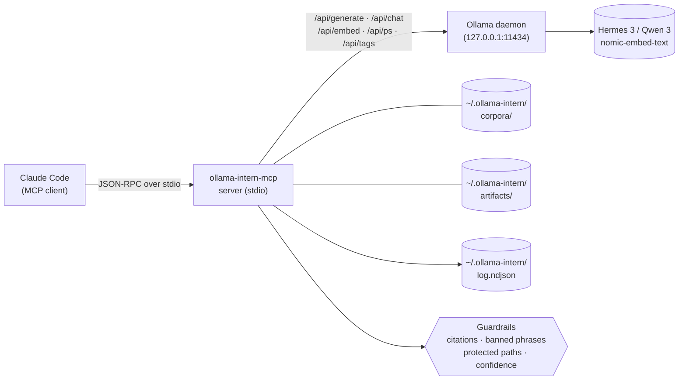

<p align="center">
  <a href="README.md">English</a> | <a href="README.zh.md">中文</a> | <a href="README.es.md">Español</a> | <a href="README.fr.md">Français</a> | <a href="README.hi.md">हिन्दी</a> | <a href="README.it.md">Italiano</a> | <a href="README.pt-BR.md">Português (BR)</a>
</p>

<p align="center">
  
</p>

<p align="center">
  <a href="https://github.com/mcp-tool-shop-org/ollama-intern-mcp/actions"></a>
  <a href="LICENSE"></a>
  <a href="https://mcp-tool-shop-org.github.io/ollama-intern-mcp/"></a>
  <a href="https://mcp-tool-shop-org.github.io/ollama-intern-mcp/handbook/"></a>
</p>

> **Claude Codeのためのローカルインターン。** <!-- TOOL_COUNT:start -->42<!-- TOOL_COUNT:end -->個のジョブ形ツール、エビデンスファーストのブリーフ、永続的な成果物。

Claude Codeにルール、階層、執務スペース、ファイルキャビネットを備えた**ローカルインターン**を提供するMCPサーバー。Claudeが_ツール_を選び、ツールが_階層_(Instant / Workhorse / Deep / Embed)を選び、階層が来週でも開けるファイルを書き出します。

**また [Hermes Agent](https://github.com/NousResearch/hermes-agent) を `hermes3:8b` 上で駆動** — 2026-04-19にエンドツーエンドで検証済み。デフォルトのラダーは `hermes3:8b`、`qwen3:*` が代替レールです。下記の [Hermesと一緒に使用する](#use-with-hermes) を参照してください。

**ハードウェア要件:** `hermes3:8b` には約6GBのVRAM、CPU推論には約16GBのRAM。詳細は [handbook/getting-started](https://mcp-tool-shop-org.github.io/ollama-intern-mcp/handbook/getting-started/#hardware-minimums) を参照してください。

**Claudeを使用していない場合?** [`examples/`](./examples/) ディレクトリには、stdio経由で起動できるミニマルなNode.jsおよびPythonのMCPクライアントがあります。[handbook/with-hermes](https://mcp-tool-shop-org.github.io/ollama-intern-mcp/handbook/with-hermes/) も参照してください。

**ローカルファースト** — オプトインするまでネットワーク送信ゼロ。テレメトリなし。「自律的」な機能は一切なし。すべての呼び出しがその処理内容を表示します。オプションの [Ollama Cloud](#ollama-cloud-optional) ルーティングにより、ローカルハードウェアがボトルネックになった際に同じツール経由で600Bクラスのモデルを利用できます — ローカルへの自動フォールバック付き。

---

## v2.7.0の新機能

**オプションのOllama Cloudルーティング — クラウドプライマリ、ローカルフォールバック。** キーとフラグでオプトインすると、生成系階層が600Bクラスのクラウドモデルにルーティングされ、埋め込みはローカルのまま、クラウド障害時にはサーキットブレーカーがローカルプロファイルにフォールバックします。**デフォルトではオフ — `OLLAMA_API_KEY` と `OLLAMA_CLOUD_PRIMARY=1` の両方を設定しない限り、送信ゼロ。** 追加マイナー版 — v2.7.0以前の呼び出し元(およびオプトインしていないすべての人)はバイト単位で同一の動作を確認できます。[Ollama Cloud (オプション)](#ollama-cloud-optional) を参照。

- **安全網付きクラウドプライマリ。** `RoutingOllamaClient` は最初にクラウドを試行し、タイムアウト/5xx/429/ネットワーク障害時にローカルプロファイルにフォールバックします。不正なキー(401/403)は永久に静かに劣化させるのではなく、ステッキー・ブレーカーによって目に見える形で表面化します;廃止された/タイポのあるクラウドモデルID(404)も同様に表面化されます。
- **無音のダウングレードは決して発生しません。** すべてのエンベロープに `backend` (`cloud`|`local`)、`degraded`、`degrade_reason` が付与されるため、大きなモデルの代わりにローカルモデルが返されたタイミングを常に把握できます。`backend_fallback` NDJSONイベントにより、`ollama_log_tail` でcloud→localフォールバック率が可視化されます。
- **`ollama_doctor` がクラウド認証+到達可能性を独立したブロックとして報告**;`ollama-intern-mcp doctor` が `Cloud (primary)` セクションを表示します。
- デフォルトのクラウドモデルは `minimax-m3:cloud` です;`INTERN_CLOUD_MODEL` / `INTERN_CLOUD_DEEP_MODEL` で階層ごとに上書き可能です(例: `deepseek-v3.1:671b`)。

## v2.6.0の新機能

`ollama_extract` での呼び出しごとの階層予算オーバーライド。追加マイナー版 — v2.6.0以前の呼び出し元は変更なし。詳細は [CHANGELOG.md](./CHANGELOG.md) を参照。

- **`tier_budget_ms_override?: number` スキーマフィールド (`ollama_extract` 上)** (オプション、範囲 `[1, 600000]` ms)。存在する場合、ランナーが訪問する全ティアにオーバーライドが適用され、`src/guardrails/timeouts.ts:61` の内部 `runWithTimeoutAndFallback` 機構がプロファイル既定値ではなくオペレーター指定の予算を遵守する。カスケード (workhorse → タイムアウト時 instant) は依然として発火し、オーバーライドが各カスケードホップを均一に制御する。
- **存在理由。** research-os R-018 ラッパー (v0.12.1) は MCP `callTool` を `Promise.race` でラップしていたが、ラッパーの予算が内部ティアに届かないことが判明した — `DEV_RTX5080_TIMEOUTS.instant = 15_000` は 180000ms のラッパー予算に関わらず 15000ms で `TIER_TIMEOUT` を発火し続けた。v2.6.0 は MCP 側の権威ある予算を提供し、オペレーターの `--planner-timeout-ms` フラグ (research-os) が設計通りに内部ティアのタイムアウトを制御できるようにする。
- **既定動作の保持。** フィールド省略 = プロファイル既定値がバイト単位で完全に支配。v2.6.0 以前の呼び出し元には変更なし。
- **R-010 フォールバック原因正規表現の保持。** サーバー側 `TIER_TIMEOUT` エラーメッセージは依然として `/elapsed=(\d+)ms/` + `/budget=(\d+)ms/` に一致するため、オーバーライドパスと既定パスの両方で下流の AI アドバイザー可視性が機能する。
- research-os v0.13.0 (累積 R-019 クライアントワイヤリング + R-020 + R-021) によって、複数のリポジトリにまたがる連携 リリース で消費される。

### 歴史的 — v2.4.0 成果物

完全な v2.4.0 エントリ (プロファイルシステム上の per-tier `num_ctx` 制御) については、[CHANGELOG.md](./CHANGELOG.md) および [docs/release-notes/v2.4.0.md](./docs/release-notes/v2.4.0.md) を参照。

## v2.4.0 の新機能

プロファイルシステム上の per-tier `num_ctx` (コンテキストウィンドウ) 制御。追加マイナー — v2.3.0 呼び出し元は不変。詳細は [CHANGELOG.md](./CHANGELOG.md) および [docs/release-notes/v2.4.0.md](./docs/release-notes/v2.4.0.md) に記載。

- **`TierConfig.num_ctx` マップ (新規)** — プロファイル上のオプション `{ instant?, workhorse?, deep?, embed? }`。ティアに対して設定されている場合、MCP サーバーはそのティア (初期 + フォールバック) にルーティングされるすべての Ollama generate/chat リクエストに `options.num_ctx = <value>` を配置する。未設定の場合、リクエストは `num_ctx` を完全に省略し、Ollama はモデル読み込み時の既定値を使用する — v2.3.0 の動作が正確に保持される。
- **新しいエンベロープフィールド `num_ctx_used?: number`** — MCP サーバーが実際に `num_ctx` を送信した場合にのみ存在。リクエストが Ollama に選択を委ねた場合は不在。既定値を推測しないこと — MCP サーバーは Ollama に対して有効な値を問い合わせない。
- **プロファイル既定値**: `dev-rtx5080` / `dev-rtx5080-qwen3` は `instant: 4096`、`workhorse: 8192`、`deep`/`embed` 未設定で出荷。高速ツール向けに `hermes3:8b` を RTX 5080 の 16GB VRAM 予算内に常駐させるようサイジング済み。`m5-max` は全ティアを未設定のままにする — 128GB ユニファイドメモリにはスピル問題がない。
- **v0.8.0 Phase 1 診断をクローズ** — RTX 5080 上の既定 32K コンテキストでの `hermes3:8b` は CPU にスピルし、workhorse `ollama_extract` 呼び出しのタイムアウトを開始させていた。v2.4.0 はプロファイル層でこれを防止する。

### per-tier `num_ctx` 制御 (v2.4.0 で新規)

プロファイル (`src/profiles.ts` からの抜粋):

```ts
"dev-rtx5080": {
  tiers: {
    instant: "hermes3:8b",
    workhorse: "hermes3:8b",
    deep: "hermes3:8b",
    embed: "nomic-embed-text",
    num_ctx: {
      instant: 4096,    // fast classify/summarize
      workhorse: 8192,  // schema-bound extract / batch
      // deep: UNSET — long-context briefs keep current behavior
      // embed: UNSET — no context-window pressure on embed
    },
  },
  // ... timeouts, prewarm
}
```

workhorse ティア呼び出しのエンベロープ (例: `ollama_extract`):

```jsonc
{
  "result": { /* extracted data */ },
  "tier_used": "workhorse",
  "model": "hermes3:8b",
  "num_ctx_used": 8192,        // present because the profile set workhorse=8192
  // ... rest of envelope unchanged
}
```

`m5-max` (または任意のティアを未設定のままにするプロファイル) では、`num_ctx_used` はエンベロープから欠落し、Ollama へのワイヤリクエストには `num_ctx` フィールドが含まれない — Ollama はモデル読み込み時の既定値を使用する。

オペレーターはプロファイルの選択 / 編集によって調整する。ツールスキーマ上の呼び出しごとの `num_ctx` 入力は存在しない。将来呼び出しでその必要性が生じた場合、パターンは v2.3.0 の `model` オーバーライドに従う。

### 歴史的 — v2.3.0 成果物

完全な v2.3.0 エントリ (per-call モデルオーバーライド) については、[CHANGELOG.md](./CHANGELOG.md) および [docs/release-notes/v2.3.0.md](./docs/release-notes/v2.3.0.md) を参照。

## v2.3.0 の新機能

LLMバックエンドのアトムツール間での呼び出しごとのモデルオーバーライド。追加マイナー — v2.2.0呼び出し元は変更なし。詳細は[CHANGELOG.md](./CHANGELOG.md)と[docs/release-notes/v2.3.0.md](./docs/release-notes/v2.3.0.md)に記載。

- **8つのアトムツールへのオプション`model: string`入力** — `ollama_extract`、`ollama_classify`、`ollama_summarize_fast`、`ollama_summarize_deep`、`ollama_research`、`ollama_corpus_answer`、`ollama_chat`、`ollama_code_citation`。ツールのティアでの最初の試行は呼び出し元指定のモデルに対して実行され、タイムアウト時には既存の`TIER_FALLBACK`カスケードが安価なティア自身のモデルを解決します(呼び出し元のオーバーライドではありません)。コンポジット/ブリーフ/パックツールは意図的に`model`を受け付けません — アトムは呼び出しごとの制御を取得し、コンポジットはティアのデフォルトを使用します。
- **新しいエンベロープフィールド`model_requested?: string`** — オーバーライドが指定された場合のみ存在。キャリブレーション対応の呼び出し元は`model_requested`と`model`を比較してフォールバック置換を検出します:`if (env.model_requested && env.model !== env.model_requested) { /* 置換 */ }`。空/空白のみの入力は`ZodError`をスキーマパース時にスローし、サイレントフォールスルーは行いません。
- **バグ修正 — `src/version.ts`のドリフト。** ランタイムの`VERSION`定数は、モジュールロード時に`package.json`から読み込まれるようになりました。v2.1.0とv2.2.0では古い`"2.0.0"`の識別文字列をレポートした状態でリリースされていました。新しい`tests/version.test.ts`が`VERSION === pkg.version`を固定します。

### 呼び出しごとのモデルオーバーライド(v2.3.0で新規)

```jsonc
{
  "tool": "ollama_classify",
  "arguments": {
    "text": "patch null pointer in auth",
    "labels": ["feat", "fix", "chore"],
    "frame": "what is the change kind?",
    "model": "hermes3:8b"
  }
}
```

エンベロープ:

```jsonc
{
  "result": { "label": "fix", "confidence": 0.9, "off_topic": false, ... },
  "tier_used": "instant",
  "model": "hermes3:8b",
  "model_requested": "hermes3:8b",       // present because override was supplied
  // ... rest of envelope unchanged
}
```

ワークホース/ディープティアがタイムアウトし、呼び出しがインスタントティアにカスケードされた場合、`env.model`はインスタントティアの解決済みモデルとなり、`env.fallback_from`は`"workhorse"`となります — `env.model_requested`は依然として`"hermes3:8b"`であり、`env.model !== env.model_requested`が置換シグナルです。オーバーライドは意図的に安価なティアには引き継がれません。選択されたモデルがそのティアの役割に合わない可能性があるためです。

### 履歴 — v2.2.0の成果物

完全なv2.2.0エントリ(フレーム境界のトピック性と構造的棄権)については、[CHANGELOG.md](./CHANGELOG.md)と[docs/release-notes/v2.2.0.md](./docs/release-notes/v2.2.0.md)を参照してください。

## v2.2.0で新規

ローカルエビデンスワーカーのロール契約:フレーム境界のトピック性と構造的棄権。追加マイナー — v2.1.0呼び出し元は変更なし。詳細は[CHANGELOG.md](./CHANGELOG.md)と[docs/release-notes/v2.2.0.md](./docs/release-notes/v2.2.0.md)に記載。

- **`ollama_extract`、`ollama_classify`、`ollama_summarize_fast`、`ollama_summarize_deep`でのフレーム境界抽出** — オプションの`frame: string`入力と構造化された`frame_alignment` / `on_topic` / `frame_addressed`出力。オフトピックのソースはスキーマに言い換えられるのではなくフラグ付けされます。
- **`ollama_research`での構造化棄権** — `weak` / `abstained` / `sources_address_question`フィールド。空の`citations[]`と空でない`answer`の組み合わせは、もはやサイレント成功ではありません。
- **`ollama_corpus_answer`のトピック性閾値** — オプションの`min_top_score`。フロアを下回る場合、ツールは`abstained: true`で短絡し、合成をスキップします。引用ごとの`score`が各引用で表示されるようになりました。
- **ブリーフエビデンスを介した検索スコアの保持** — `corpusHitsToEvidence`が`score`を運び(`corpus_min_evidence_score`ノブが`incident_brief` / `repo_brief` / `change_brief`のアセンブリ時にフィルタリング)。
- **引用の行範囲境界** — `guardrails/citations.ts`が`ollama_research`の境界外範囲を拒否し、`ollama_code_citation`の既存の姿勢と一致します。
- **オペレーター契約ドキュメントの修正** — READMEの`chunk_id`/`chunk_index`修正、「validated server-side」の書き直し、Evidence Lawsセクションの修飾、マーケティングスローガンへの注釈追加。

### シードリグレッション — 検証

スライスの契約は、research-os のリテラルな新規パック障害、すなわち arxiv 2112.10422 (Cosmological Standard Timers) に対して、セクション 01 のフレーム「ローカルファースト vs クラウド LLM 深層研究ワークフローにおけるエビデンス・カスタディとは何か？」の下で検証されます — 9 / 9 のモック LLM 契約テストにより、話題外のソースが封じ込められたことが確認されます（抽出時 `frame_alignment.on_topic = false`; 分類時 `off_topic: true`; summarize_deep 時 `frame_addressed: false`; `min_top_score` 設定時の corpus_answer で `abstained: true`）。

### 履歴 — v2.1.0 の成果物

完全な v2.1.0 エントリ（フィーチャーパス: 新規ツール 13 件 + 機能強化 4 件 + 凍結解除）については [CHANGELOG.md](./CHANGELOG.md) を参照してください。

---

## アーキテクチャの概要



すべての Claude ツール呼び出しは stdio JSON-RPC 経由で MCP サーバーに入ります。サーバーはツールの [zod](https://zod.dev) スキーマに対して呼び出しを検証し、設定されたガードレール（引用検証、禁止語句の除去、保護パス強制、信頼度閾値）を実行し、決定論的レンダラー（アーティファクト層）または Ollama HTTP 呼び出し（その他すべての層）のいずれかにルーティングします。Ollama デーモンはユーザーが指定したパスを決して見ません — モデル層と準備済みプロンプトのみを参照します。すべての呼び出しは `~/.ollama-intern/log.ndjson` の NDJSON ログに 1 つの構造化イベントを追加します。`ollama_log_tail` とシェルからそれを読み取れます。

---

## 最初の例 — 1 回の呼び出し、1 つのアーティファクト

```jsonc
// Claude → ollama-intern-mcp
{
  "tool": "ollama_incident_pack",
  "arguments": {
    "title": "sprite pipeline 5 AM paging regression",
    "logs": "[2026-04-16 05:07] worker-3 OOM killed\n[2026-04-16 05:07] ollama /api/ps reports evicted=true size=8.1GB\n...",
    "source_paths": ["F:/AI/sprite-foundry/src/worker.ts", "memory/sprite-foundry-visual-mastery.md"]
  }
}
```

ディスク上のファイルを指すエンベロープを返します:

```jsonc
{
  "result": {
    "pack": "incident",
    "slug": "2026-04-16-sprite-pipeline-5-am-paging-regression",
    "artifact_md":   "~/.ollama-intern/artifacts/incident/2026-04-16-sprite-pipeline-5-am-paging-regression.md",
    "artifact_json": "~/.ollama-intern/artifacts/incident/2026-04-16-sprite-pipeline-5-am-paging-regression.json",
    "weak": false,
    "evidence_count": 6,
    "next_checks": ["residency.evicted across last 24h", "OLLAMA_MAX_LOADED_MODELS vs loaded size"]
  },
  "tier_used": "deep",
  "model": "hermes3:8b",
  "hardware_profile": "dev-rtx5080",
  "tokens_in": 4180, "tokens_out": 612,
  "elapsed_ms": 8410,
  "residency": { "in_vram": true, "evicted": false }
}
```

→ `weak: false` は ≥2 件のエビデンス項目が組み立てられたことを意味します; 仮説が精査されたことを意味するものでは決してありません。下記の [エビデンスの法則](#evidence-laws) を参照してください。

その markdown ファイルはインターンのデスク出力です — 見出し、引用 ID 付きのエビデンスブロック、探索的な `next_checks`、エビデンスが乏しい場合は `weak: true` バナー。これは決定論的です: レンダラーはプロンプトではなくコードです。（レンダラーは決定論的ですが、仮説とサーフェスの *内容* は生成的です — 検証済みではなくドラフトとして読んでください。）明日開いて、来週差分を取り、`ollama_artifact_export_to_path` でハンドブックにエクスポートしてください。

このカテゴリのすべての競合は「トークンを節約」でリードしています。私たちは _インターンが書いたファイルがこれ_ でリードしています。

### 2 番目の例 — コーパスを構築してから質問する

```jsonc
// 1. Build a persistent, searchable corpus over your project.
{ "tool": "ollama_corpus_index",
  "arguments": { "name": "sprite-foundry",
                 "paths": ["F:/AI/sprite-foundry/src"],
                 "embed_model": "nomic-embed-text" } }
// → { chunks_written: 1204, paths_indexed: 312, failed_paths: [] }

// 2. Ask an evidence-bound question against it.
{ "tool": "ollama_corpus_answer",
  "arguments": { "name": "sprite-foundry",
                 "query": "how does the worker handle OOM eviction?",
                 "top_k": 8 } }
// → { answer: "...", citations: [{chunk_index, path}...], weak: false }
```

サーバーは引用 ID と、各 `chunk_index` が取得されたヒットの範囲内であることを検証します。生成されたすべての主張が引用されたチャンク内容によって意味的に裏付けられていることを証明するものでは決してありません — それはモデルの責任であり、弱い検索でも引用の形をした回答が生成される可能性があります。完全なウォークスルーは [handbook/corpora](https://mcp-tool-shop-org.github.io/ollama-intern-mcp/handbook/corpora/) にあります。

---

## フレーム準拠抽出（v2.2.0 で新規）

`ollama_extract`、`ollama_classify`、`ollama_summarize_fast`、および `ollama_summarize_deep` はオプションの `frame: string` 入力を受け付けます。フレームはソースが回答を求められる質問を表します; ソースがフレームに対応していない場合、モデルは真だが話題から外れた内容を出力するのではなく、棄却するように指示されます。

```jsonc
{
  "tool": "ollama_extract",
  "arguments": {
    "text": "<long source document>",
    "schema": { /* your fields */ },
    "frame": "section purpose here — e.g. 'OOM eviction behavior in the sprite worker'"
  }
}
// → result includes frame_alignment: { on_topic: boolean, reason: string, unaddressed_aspects: string[] }
```

`frame` が省略された場合、動作は v2.1.0 から変更されません。指定された場合、`frame_alignment.on_topic = false` は、抽出されたフィールドがソースについては真であるかもしれないが、フレームには関連していない可能性があることを示します — これは `weak: true` ブリーフと同じ形状として扱ってください: 有用ですが、下流のエビデンスに昇格させる前にスポットチェックが必要です。

---

## 棄却契約（v2.2.0 で新規）

`ollama_research`は構造化された拒否フィールドを返します：`weak: boolean`、`abstained: boolean`、`sources_address_question: boolean | null`。空の`citations[]`と非空の`answer`の組み合わせは、もはや無音ではありません — `abstained: true`は、呼び出し元から提供されたパスが質問に対応していなかったため、モデルが統合を拒否したことを意味します。拒否を失敗ではなく成功として扱ってください：これは、弱い検索結果を権威ある出力に偽装することをツールが拒否しているということです。

`ollama_corpus_answer`は、オプションの`min_top_score: number`トピック性閾値（0.0–1.0）を受け付けます。クエリのトップ検索スコアが`min_top_score`を下回った場合、ツールは`abstained: true`で短絡し、合成をスキップします — これは「スコア0.21の無関係なチャンク5つでも完全な回答を駆動してしまう」失敗モードを防ぎます。v2.1.0の`weak: true`ルールではこれを捕捉できませんでした（`weak: true`は`hits.length < 2`の場合にのみ発火していました）。これを、各引用に新たに公開された`score`フィールドと組み合わせて、エンベロープから直接検索品質を監査してください。

---

## ここに含まれるもの — 4つの階層、<!-- TOOL_COUNT:start -->42<!-- TOOL_COUNT:end -->ツール

**ジョブシェイプド**とは、各ツールがインターに引き渡すジョブ名を表していることを意味します — これを分類し、あれを抽出し、これらのログをトリアージし、このリリースノートを起草し、このインシデントをパックします。ツールの入力はジョブ仕様であり、出力は成果物です。トップレベルに汎用的な`run_model` / `chat_with_llm`プリミティブは存在しません。

| 階層 | 数 | ここに含まれるもの |
|---|---|---|
| **Atoms** | 28 | ジョブシェイプドのプリミティブ。**オリジナル15個：**`classify`、`extract`、`triage_logs`、`summarize_fast` / `deep`、`draft`、`research`、`corpus_search` / `answer` / `index` / `refresh` / `list`、`embed_search`、`embed`、`chat`。**v2.1.0で追加された+13：**`doctor`、`log_tail`、`batch_proof_check`（運用）；`code_map`、`code_citation`、`multi_file_refactor_propose`、`refactor_plan`（リファクタ）；`artifact_prune`、`hypothesis_drill`（成果物/ブリーフ）；`corpus_health`、`corpus_amend`、`corpus_amend_history`、`corpus_rerank`（コーパス）。バッチ対応のアトム（`classify`、`extract`、`triage_logs`）は`items: [{id, text}]`を受け付けます。 |
| **Briefs** | 3 | エビデンスに裏付けられた構造化オペレーターブリーフ。`incident_brief`、`repo_brief`、`change_brief`。すべての主張はエビデンスIDを引用し、不明なものはサーバー側で除去されます。弱いエビデンスは、偽のナラティブではなく`weak: true`として表面化されます。 |
| **Packs** | 3 | 耐久性のあるmarkdownとJSONを`~/.ollama-intern/artifacts/`に書き込む固定パイプラインの複合ジョブ。`incident_pack`、`repo_pack`、`change_pack`。決定論的レンダラー — 成果物の形状に対するモデル呼び出しはありません。 |
| **Artifacts** | 7 | パック出力の連続性サーフェス。`artifact_list` / `read` / `diff` / `export_to_path`、および3つの決定論的スニペット：`incident_note`、`onboarding_section`、`release_note`。 |

合計：**28アトム + 3ブリーフ + 3パック + 7成果物ツール = <!-- TOOL_COUNT:start -->42<!-- TOOL_COUNT:end -->**。

凍結ライン：
- アトム：凍結は**v2.1.0で解除**（現在28個；v2.1.0の機能追加で+13）。新規アトムには、監査で正当化されたギャップ、テスト、ハンドブックページ、CHANGELOGエントリが引き続き必要です — 気軽な追加は不可。
- パックは3で凍結。新規パックタイプはありません。
- 成果物階層は7で凍結。

完全なツールリファレンスは[ハンドブック](https://mcp-tool-shop-org.github.io/ollama-intern-mcp/handbook/tools/)にあります。

---

## インストール

ローカルで動作する[Ollama](https://ollama.com)と、プルされた階層モデルが必要です（下記の[モデルプル](#model-pulls)を参照）。

### Claude Code（推奨）

ほとんどのユーザーは、Claude Code MCPサーバー設定に追加することでこれをインストールします — グローバルインストールは不要です。Claude Codeは`npx`経由でオンデマンドでサーバーを実行します：

```json
{
  "mcpServers": {
    "ollama-intern": {
      "command": "npx",
      "args": ["-y", "ollama-intern-mcp"],
      "env": {
        "OLLAMA_HOST": "http://127.0.0.1:11434",
        "INTERN_PROFILE": "dev-rtx5080"
      }
    }
  }
}
```

### Claude Desktop

同じブロックを`~/Library/Application Support/Claude/claude_desktop_config.json`（macOS）または`%APPDATA%\Claude\claude_desktop_config.json`（Windows）に書き込みます。

### グローバルインストール（上級者向け）

Claude Code外でアドホックに使用するためにバイナリを`PATH`に含めたい場合のみ必要です：

```bash
npm install -g ollama-intern-mcp
```

### Hermesでの使用

このMCPは [Hermes Agent](https://github.com/NousResearch/hermes-agent) と Ollama上の `hermes3:8b` を使用してエンドツーエンドで検証されています（2026-04-19）。Hermesは*このMCPの固定されたプリミティブ表面を呼び出す*外部エージェントです ― 計画はHermesが担当し、我々が作業を行います。

参考設定（このリポジトリ内の [hermes.config.example.yaml](hermes.config.example.yaml)）：

```yaml
model:
  provider: custom
  base_url: http://localhost:11434/v1
  default: hermes3:8b
  context_length: 65536    # Hermes requires 64K floor under model.*

providers:
  local-ollama:
    name: local-ollama
    base_url: http://localhost:11434/v1
    api_mode: openai_chat
    api_key: ollama
    model: hermes3:8b

mcp_servers:
  ollama-intern:
    command: npx
    args: ["-y", "ollama-intern-mcp"]
    env:
      OLLAMA_HOST: http://localhost:11434
      INTERN_PROFILE: dev-rtx5080
      # hermes3:8b is the default ladder in v2.0.0, so tier overrides are
      # only needed if you're pinning a different local model.
```

**プロンプトの形式は重要です。** 命令形のツール呼び出しプロンプト（「Xを引数で呼び出せ…」）は統合テストであり、8Bローカルモデルがクリーンな`tool_calls`を出力するための十分な足場を提供します。リスト形式の複数タスクプロンプト（「Aを実行し、次にB、次にC」）は大規模モデル用の能力ベンチマークです。8Bでのリスト形式での失敗を「配線が壊れている」と解釈しないでください。完全な統合ウォークスルー + 既知のトランスポートの注意点（Ollama `/v1` ストリーミング + openai-SDK非ストリーミングシム）については [handbook/with-hermes](https://mcp-tool-shop-org.github.io/ollama-intern-mcp/handbook/with-hermes/) を参照してください。

### モデルプルス

**デフォルト開発プロファイル（RTX 5080 16GBなど）：**

```bash
ollama pull hermes3:8b
ollama pull nomic-embed-text
export OLLAMA_MAX_LOADED_MODELS=2
export OLLAMA_KEEP_ALIVE=-1
```

**Qwen 3代替レール（同じハードウェア、Qwenツール用）：**

```bash
ollama pull qwen3:8b
ollama pull qwen3:14b
ollama pull nomic-embed-text
export INTERN_PROFILE=dev-rtx5080-qwen3
```

**M5 Maxプロファイル（128GBユニファイド）：**

```bash
ollama pull qwen3:14b
ollama pull qwen3:32b
ollama pull nomic-embed-text
export INTERN_PROFILE=m5-max
```

ティアごとの環境変数（`INTERN_TIER_INSTANT`、`INTERN_TIER_WORKHORSE`、`INTERN_TIER_DEEP`、`INTERN_EMBED_MODEL`）は、ワンオフ用途でプロファイル選択をオーバーライドします。

---

## 統一エンベロープ

すべてのツールが同じ形式で応答します：

```ts
{
  result: <tool-specific>,
  tier_used: "instant" | "workhorse" | "deep" | "embed",
  model: string,
  hardware_profile: string,     // "dev-rtx5080" | "dev-rtx5080-qwen3" | "m5-max"
  tokens_in: number,
  tokens_out: number,
  elapsed_ms: number,
  residency: {
    in_vram: boolean,
    size_bytes: number,
    size_vram_bytes: number,
    evicted: boolean
  } | null
}
```

`residency`はOllamaの`/api/ps`から取得されます。`evicted: true`または`size_vram < size`の場合、モデルがディスクにページングされ推論速度が5〜10倍低下しています ― ユーザーにOllamaの再起動またはロード済みモデル数の削減を促す必要があることを通知してください。

[Ollama Cloud](#ollama-cloud-optional)モードでは、エンベロープには`backend`（`"cloud"` | `"local"`）も含まれており、クラウドからローカルへのフォールバック時には`degraded: true`と`degrade_reason`が含まれます。これらのフィールドはデフォルトのローカル専用パスでは**存在しない**ため、既存のコンシューマーには影響しません。クラウド提供の呼び出しでは`residency`は`null`です（ステートレスなクラウドにはローカルVRAMの常駐状態がないため）。

すべての呼び出しは`~/.ollama-intern/log.ndjson`にNDJSONの1行としてログ記録されます。`hardware_profile`でフィルタリングして、開発時の数値を公開可能なベンチマークから除外できます。

---

## ハードウェアプロファイル

| プロファイル | Instant | Workhorse | Deep | Embed |
|---|---|---|---|---|
| **`dev-rtx5080`**（デフォルト） | hermes3 8B | hermes3 8B | hermes3 8B | nomic-embed-text |
| `dev-rtx5080-qwen3` | qwen3 8B | qwen3 8B | qwen3 14B | nomic-embed-text |
| `m5-max` | qwen3 14B | qwen3 14B | qwen3 32B | nomic-embed-text |

**デフォルト開発**は3つの作業ティアをすべて`hermes3:8b`に集約します ― 検証済みのHermes Agent統合パスです。トップからボトムまで同じモデルであることは、プルするものが1つ、常駐コストが1つ、理解すべき動作セットが1つであることを意味します。Qwen 3を好むユーザー（`THINK_BY_SHAPE`プラミング付き）は`dev-rtx5080-qwen3`を選択できます。`m5-max`はユニファイドメモリに合わせてサイズ調整されたQwen 3ラダーです。

---

## Ollama Cloud（オプション）

ローカル8Bモデルが多くの人々が直面するハードウェアのボトルネックです。[Ollama Cloud](https://ollama.com/cloud)は**同じ**`/api/*`サーフェスの背後で600Bクラスのモデルを提供するため、重いツールをより強力なモデルにルーティングしてローカルVRAMを解放できます ― ローカルを常時フォールバックとして維持しながら。

**これはオプトイン機能であり、デフォルトではオフです。** パッケージは**ゼロ送信**でローカルファーストを維持します。両方を設定しない限り有効になりません。オプトインしないユーザーには影響しません。

```json
{
  "mcpServers": {
    "ollama-intern": {
      "command": "npx",
      "args": ["-y", "ollama-intern-mcp"],
      "env": {
        "OLLAMA_CLOUD_PRIMARY": "1",
        "OLLAMA_API_KEY": "sk-...your-key...",
        "INTERN_PROFILE": "dev-rtx5080"
      }
    }
  }
}
```

> **キーはCIシークレットではなくランタイム環境変数である。** GitHub ActionsのシークレットはCI実行内でのみ参照でき、稼働中のサーバーには届かない。[ollama.com/settings/keys](https://ollama.com/settings/keys)でキーを作成し、MCPクライアントの`env`ブロック（またはシェル環境）に配置すること。

**ルーティングの仕組み。** クラウドが有効な場合、生成ティア（instant / workhorse / deep）はクラウドモデルに送られる。**埋め込みは常にローカルに留まる**（Ollama Cloudは埋め込みモデルを提供しないため、corpus/embedツールは影響を受けない）。サーキットブレイカーはまずクラウドを試行し、タイムアウト / 5xx / 429 / ネットワークエラー時にローカルプロファイルへフォールバックする。不正なキー（401/403）は*スティッキー*ブレイカーを作動させ、サイレントに性能低下させるのではなく明示的にエラーを表面化する。ローカルプロファイル（`INTERN_PROFILE`）がフォールバックのはしごとなるため、モデルをダウンロード済みにしておくこと。

**サイレントダウングレードは決して行われない。** すべてのエンベロープがどのバックエンドが処理したかを報告する：

```ts
{ ...envelope, backend: "cloud" | "local", degraded?: true, degrade_reason?: "cloud_timeout" | "cloud_5xx" | "cloud_rate_limited" | "cloud_unreachable" | "cloud_auth_failed" | "circuit_open" }
```

`backend_fallback`の行はクラウド→ローカルへのフォールバックが発生するたびに`~/.ollama-intern/log.ndjson`に記録され（`ollama_log_tail --filter_kind backend_fallback`）、`ollama-intern-mcp doctor`は到達可能性と認証ステータスを表示する**Cloud (primary)**ブロックを示す。

**レイテンシと品質。** 大型クラウドモデルはトークンあたりの処理速度がローカル8Bより大幅に遅く（ミリ秒ではなく秒単位）、これは速度向上ではなく品質向上である。クラウドティアは寛大なタイムアウトはしごを使用し、デフォルトで instant 30秒 / workhorse 120秒 / deep 300秒となっている。

### クラウド環境変数

| 変数 | デフォルト | 目的 |
|---|---|---|
| `OLLAMA_CLOUD_PRIMARY` | _(未設定)_ | **オプトイン切り替え。** `1`/`true`/`yes`/`on`でクラウドプライマリを有効化。未設定＝ローカルのみ、外部送信なし。 |
| `OLLAMA_API_KEY` | _(未設定)_ | Ollama CloudのBearerキー。**クラウド有効時は必須**（未設定時は起動時にfail-fast）。 |
| `OLLAMA_CLOUD_HOST` | `https://ollama.com` | クラウドのベースホスト。 |
| `INTERN_CLOUD_MODEL` | `minimax-m3:cloud` | instant + workhorse + deepのクラウドモデル。 |
| `INTERN_CLOUD_DEEP_MODEL` | _(= `INTERN_CLOUD_MODEL`)_ | deepティアのみのオプション上書き（例：`deepseek-v3.1:671b`）。 |
| `INTERN_CLOUD_TIMEOUT_{INSTANT,WORKHORSE,DEEP}_MS` | `30000`/`120000`/`300000` | ティアごとのクラウド試行タイムアウト。 |
| `INTERN_CLOUD_NUM_CTX` | `32768` | クラウド呼び出しのコンテキストウィンドウ上限（クラウドはGPU時間で課金されるため、上限でコストを制御）。 |

> **モデル提供状況の変化。** Ollamaは定期的にクラウドモデルをリタイアさせる。`minimax-m3:cloud`、`deepseek-v3.1:671b`、`gpt-oss:120b`、`qwen3-coder:480b`が現在の選択肢；IDを固定する前に[ollama.com/search?c=cloud](https://ollama.com/search?c=cloud)を確認すること。

**プライバシーに関する注意。** Ollama Cloudへのルーティングはプロンプトをサードパーティに送信する。Ollamaの[プライバシーポリシー](https://ollama.com/privacy)には、クラウドプロンプトはリクエスト以上には保持されず一時的に処理され、トレーニングには使用されないと記載されているが、それでも外部送信であるためオプトイン方式で明示されている。デフォルトのローカル専用モードでは、マシン外への送信は一切行われない。

---

## エビデンスルール

これらはプロンプトではなくサーバー側で強制される：

- **出典が必要。** すべての簡潔な主張は証拠IDを引用する。
- **未知のものはサーバーサイドで除去される。** 証拠バンドルに存在しないIDを引用したモデルは、警告とともにそのIDが結果が返る前に削除される。
- **IDは検証されるが、内容は検証されない。** サーバーは、引用されたすべての`evidence_ref`が組み立てられたセット内の実際の証拠IDを指していることを確認する。主張のテキストが引用された証拠から導出可能かどうかは検証しない — それはモデルの仕事であり、弱いブリーフには有効な参照を持ちながら根拠のない主張が含まれる場合がある。スポットチェックには`weak: true` + coverage_notes + 含まれる`excerpt`フィールドを使用すること。
- **弱いものは弱いまま。** 薄い証拠はcoverage notesとともに`weak: true`でフラグ付けされる。偽の物語に滑らかにされることはない。
- **調査型であり、指示型ではない。** `next_checks` / `read_next` / `likely_breakpoints`のみ。プロンプトは「この修正を適用」を禁じている。
- **決定論的レンダラー。** アーティファクトのマークダウン形式はプロンプトではなくコードである。`draft`はモデルの言い回しが重要な散文のために予約されたまま。
- **同一パック内の差分のみ。** パック横断の`artifact_diff`は大きく拒否される；ペイロードは明確に区別されたまま。

---

## アーティファクトと継続性

パックは`~/.ollama-intern/artifacts/{incident,repo,change}/<slug>.(md|json)`に書き込む。アーティファクト層は、これをファイル管理ツールにすることなく継続性の表面を提供する：

- `artifact_list` — メタデータのみのインデックス。パック、日付、スラッグglobでフィルタ可能
- `artifact_read` — `{pack, slug}`または`{json_path}`による型付き読み取り
- `artifact_diff` — 構造化された同一パック比較；weak-flipが表面化
- `artifact_export_to_path` — 既存のアーティファクトを（出所ヘッダー付きで）呼び出し側宣言の`allowed_roots`に書き込む。`overwrite: true`がない限り既存ファイルは拒否する。
- `artifact_incident_note_snippet` — オペレーターノートの断片
- `artifact_onboarding_section_snippet` — ハンドブックの断片
- `artifact_release_note_snippet` — DRAFT リリースノートの断片

この層にはモデル呼び出しはない。すべて保存されたコンテンツからレンダリングされる。

---

## 脅威モデルとテレメトリ

**触れるデータ：** 呼び出し側が明示的に渡すファイルパス（`ollama_research`、コーパスツール）、インラインテキスト、および`~/.ollama-intern/artifacts/`以下または呼び出し側宣言の`allowed_roots`に書き込むよう呼び出し側が要求したアーティファクト。

**触れないデータ：** `source_paths` / `allowed_roots`の外にあるすべてのもの。`..`は正規化前に拒否される。`artifact_export_to_path`は`overwrite: true`がない限り既存ファイルを拒否する。保護対象パス（`memory/`、`.claude/`、`docs/canon/`など）を対象とするドラフトには、明示的な`confirm_write: true`が必要で、サーバーサイドで強制される。

**ネットワーク送信：** **デフォルトでオフ。** 初期状態では、ローカルOllama HTTPエンドポイントへの送信のみである — クラウド呼び出し、アップデートping、クラッシュレポートはない。**オプトイン例外：** [Ollama Cloud](#ollama-cloud-optional)（`OLLAMA_CLOUD_PRIMARY=1` + `OLLAMA_API_KEY`）を有効にすると、生成層のプロンプトはBearerキーとともにHTTPS経由で`ollama.com`に送信される。これは明示的で開示されているが、両方の変数を設定しない限りオフである；埋め込みは依然としてボックスから出ない。[SECURITY.md](SECURITY.md) §11を参照。

**テレメトリ：** **なし。** すべての呼び出しはマシン上の`~/.ollama-intern/log.ndjson`にNDJSONの1行として記録される。サーバー自体はどこにも連絡しない。

**エラー：** 構造化された形式`{ code, message, hint, retryable }`。スタックトレースがツール結果を通じて公開されることはない。

完全なポリシー：[SECURITY.md](SECURITY.md)。

---

## 規格

[Shipcheck](https://github.com/mcp-tool-shop-org/shipcheck)の水準に準拠。ハードゲートA〜Dに合格；[SHIP_GATE.md](SHIP_GATE.md)および[SCORECARD.md](SCORECARD.md)を参照。

- **A. セキュリティ** — SECURITY.md、脅威モデル、テレメトリなし、パスの安全性、保護対象パスでの `confirm_write`
- **B. エラー** — すべてのツール結果で統一された構造；生のスタックトレースなし
- **C. ドキュメント** — README最新、CHANGELOG、LICENSE；ツールスキーマは自己文書化
- **D. 衛生管理** — `npm run verify`（完全なvitestスイート）、依存関係スキャン付きCI、Dependabot、ロックファイル、`engines.node`

---

## ロードマップ（スコープクリープではなく堅牢化）

- **フェーズ 1 — 委任スパイン** ✓ リリース済み：アトムサーフェス、統一エンベロープ、階層化ルーティング、ガードレール
- **フェーズ 2 — 真理スパイン** ✓ リリース済み：スキーマv2チャンキング、BM25 + RRF、Living Corpora、エビデンスベースのブリーフ、検索評価パック
- **フェーズ 3 — パック＆アーティファクトスパイン** ✓ リリース済み：耐久アーティファクト+継続性階層を備えた固定パイプラインパック
- **フェーズ 4 — 導入スパイン** ✓ v2.0.1：3段階のヘルスチェックでハードニングされたコーパス（TOCTOU、50MBファイル上限、シンボリックリンクの拒否、アトミック書き込み、ファイル単位の障害キャプチャ）、ツールパストラバーサル、可観測性（セマフォ待機イベント、タイムアウトエラーコンテキスト、プロファイル環境変数オーバーライドログ、プレワームコールドスタートシグナル）、テスト安全性（10ファイルにわたるモジュールロード環境スナップショット、`tools/call` E2E）。オペレーター向けにトラブルシューティングハンドブック+ハードウェア最小要件が追加されました。
- **フェーズ 5 — M5 Maxベンチマーク** — ハードウェア到着時に公開可能な数値（約2026-04-24）

堅牢化レイヤーごとのフェーズ。パックおよびアーティファクト階層は3と7で凍結されたままです。アトムの凍結はv2.1.0で解除されました — 新しいアトムには、監査で正当化されたギャップ、テスト、ハンドブックページ、CHANGELOGエントリが必要です。

---

## ライセンス

MIT — [LICENSE](LICENSE) を参照。

---

<p align="center">Built by <a href="https://mcp-tool-shop.github.io/">MCP Tool Shop</a></p>
