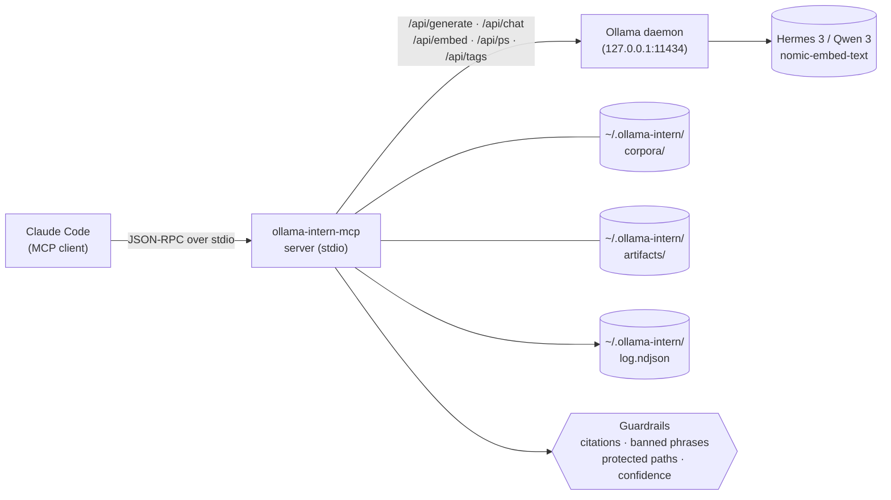

<p align="center">
  <a href="README.md">English</a> | <a href="README.zh.md">中文</a> | <a href="README.es.md">Español</a> | <a href="README.fr.md">Français</a> | <a href="README.hi.md">हिन्दी</a> | <a href="README.it.md">Italiano</a> | <a href="README.pt-BR.md">Português (BR)</a>
</p>

<p align="center">
  
</p>

<p align="center">
  <a href="https://github.com/mcp-tool-shop-org/ollama-intern-mcp/actions"></a>
  <a href="LICENSE"></a>
  <a href="https://mcp-tool-shop-org.github.io/ollama-intern-mcp/"></a>
  <a href="https://mcp-tool-shop-org.github.io/ollama-intern-mcp/handbook/"></a>
</p>

**Claude Codeのローカルインターン。** <!-- TOOL_COUNT:start -->44<!-- TOOL_COUNT:end --> 仕事に合わせたツール、証拠を重視した簡潔な説明、耐久性のある成果物。

ルール、階層、デスク、ファイリングキャビネットを備えたClaude Codeにローカルインターンを提供するMCPサーバー。Claudeが_ツール_を選択し、そのツールが_階層_（Instant / Workhorse / Deep / Embed）を選択します。選択された階層は、次週開けるファイルを作成します。

**また、`hermes3:8b`で[Hermes Agent](https://github.com/NousResearch/hermes-agent)も実行します。** 2026年4月19日にエンドツーエンドの検証が完了しました。デフォルトの階層は`hermes3:8b`、代替のものは`qwen3:*`です。詳細は下記[Hermesとの連携](#use-with-hermes)を参照してください。

**ハードウェア要件：** `hermes3:8b`の場合は約6GBのVRAM、またはCPU推論の場合は約16GBのRAMが必要です。詳細については、[handbook/getting-started](https://mcp-tool-shop-org.github.io/ollama-intern-mcp/handbook/getting-started/#hardware-minimums)を参照してください。

**Claudeを使用していませんか？** [`examples/`](./examples/)ディレクトリには、stdio経由で起動できる最小限のNode.jsおよびPython MCPクライアントがあります。また、[handbook/with-hermes](https://mcp-tool-shop-org.github.io/ollama-intern-mcp/handbook/with-hermes/)も参照してください。

**ローカル優先** — ユーザーが明示的に選択するまで、ネットワークへのデータ送信は行われません。テレメトリーはありません。「自律的」な機能もありません。すべての呼び出しで処理内容が表示されます。オプションの[Ollama Cloud](#ollama-cloud-optional)ルーティングを使用すると、ローカルハードウェアがボトルネックになっている場合に、600Bクラスのモデルを同じツールで使用できます。また、自動的にローカルにフォールバックします。

---

## v2.9.0で新規追加

**クラウド機能パス — 異なるモデル間での検証、オンデマンドでのクラウドへの切り替え、およびその経済性。** ローカル優先の動作は変更されていません。キーが設定されていない場合、v2.8.0と完全に同じ動作になります（データ送信なし、起動時のクラウドプローブも行われません）。

- **`ollama_verify_claims` — 異なるモデル間での検証。** `ollama_code_review`は結果を*生成*し、この機能がそれらを*評価*します。デフォルトでは、deepseek / kimi / glmを使用して、入力された主張と証拠に対して、異なるモデルファミリーのOllama Cloudフラッグシップパネルを実行し、各主張に対してCONFIRMED（確認済み）/ REFUTED（否定）/ NEEDS_REVIEW（再検討が必要）を返します。集計は、単一の反対意見があっても決定されないように行われます（否定するには少なくとも2つ、確認するには少なくとも2つの肯定的な意見が必要です）。すべての審査員は、ローカルで検証されたモデルを使用するか、代替モデルを使用しますが、ローカルにフォールバックしたり、代替モデルを使用したりした場合は、その数はカウントされません。また、主張の入力は構造的に推論が削除されます。正直な上限はドキュメントに記載されています。CONFIRMEDは証拠であり、証明ではありません。重大な誤りを検出するのに役立ちますが、最先端モデルの微妙な誤りについては効果が低い場合があります。
- **各呼び出しごとのクラウドへの切り替え + スタンバイモード。** `OLLAMA_API_KEY`のみを設定します（`OLLAMA_CLOUD_PRIMARY`は設定しません）。これにより、**スタンバイモード**になります。ローカルを優先し、データ送信はなく、起動時のプローブも行われません。ただし、単一の呼び出しで`backend:'cloud'`を指定すると、クラウドに切り替わります。重要なレビューを1つだけ600Bモデルに切り替え、すべての呼び出しをクラウドに切り替える必要はありません。最初の切り替え時にデータ送信が発生することが明確に通知されます。また、各呼び出しで`model`をオーバーライドできるようになり、クラウドへの試行時にその値がそのまま使用されます。
- **`ollama_log_stats` — タグラインで約束されている測定された経済性。** LLMを使用しないNDJSON形式のレシートの集計：クラウド/ローカルの内訳、クラウドからローカルへのフォールバック率、ツールごとのトークン数、p50/p95レイテンシー。これらはすべて`since`ウィンドウで制限されます。
- **CI用の診断機能 + 機械可読なツール。** `doctor --json --fail-unhealthy`を実行すると、パイプラインに実際のゲートが設定され（クラウド対応の`healthy`フラグ付き）、すべてのツールにMCP `readOnlyHint`/`destructiveHint`/`title`注釈が付加されるため、クライアントは正しい権限に関するUXを取得できます。さらに、`init --claude`を実行すると、貼り付け可能な`.mcp.json`ファイルが作成されます。

詳細については、[CHANGELOG.md](./CHANGELOG.md)を参照してください。

## v2.8.0で新規追加

**信頼性、耐久性、セキュリティの強化 — 25件の修正。すべてテストを最初に行い、異なるモデルファミリー間で検証しました。** ローカル優先の動作は変更されておらず、ツールの契約も削除されていません。既存の呼び出しは引き続き機能します。主な改善点は次のとおりです。

- **サイレントなコーパスデータの損失がなくなりました。** `ollama_corpus_refresh`中に一時的な読み取りエラーが発生した場合（Windowsファイルロック、アンチウイルスによる保留、エディターの保存ウィンドウなど）、そのファイルは「存在しない」と分類され、**インデックスされたコンテンツが完全に削除されていました。** 現在では、実際に存在しないファイルのみが削除されます。一時的なエラーの場合、パスを保持し、再試行するようにフラグを設定し、チャンクを保持します。
- **予算を守る同時実行処理。** 階層のタイムアウトが発生した場合でも、許可待ちの状態にある呼び出しをキャンセルできるようになりました（以前は、レシートがそうでないことを示していても、予算を超えてハングしていました）。また、`ollama_chat`はついにタイムアウト/階層の境界を通過するようにルーティングされるため、1つのローカル生成でハングアップしても、他のツールがすべて停止することはありません。クラウド優先モードでは、実際にクラウドに到達します。
- **クラッシュするのではなく、段階的に機能低下するクラウド。** 廃止されたクラウドモデルIDは、総シャットダウンではなく、明確な`cloud_model_missing`理由とクラウド固有のヒントを使用してローカルにフォールバックします。サーキットブレーカーが永久にハングアップすることはありません。永続的に存在しないモデルは、すべての呼び出しでクラウドラウンドトリップを実行することを停止します。
- **ドキュメントと一致するセキュリティ面。** `ollama_batch_proof_check`は現在、cwdの封じ込めを正しく強制します（新しいオペレーター環境キャップ`INTERN_BATCH_PROOF_ALLOWED_ROOTS`があり、呼び出し元がそれを広げることができません）。プロンプトインジェクション対策は、カバレッジと正直に開示された上限を獲得しました。保護されたパスガードは、macOSでも大文字小文字を区別しません。
- **正直な成果物とレシート。** パックの書き込みはアトミックであり、サイレントな上書きは行われません。機能が低下したバッチエンベロープは、実際に使用された階層を報告します。中断された書き込み検出器は、すべての変更で破損した書き込みをキャッチします。チャンクIDは、同じコンテンツのファイル間で衝突しません。依存関係監査は完全に明確です（脆弱性は0）。

詳細については、[CHANGELOG.md](./CHANGELOG.md)を参照してください。

## v2.7.0で新規追加

**オプションの Ollama Cloud ルーティング — クラウド優先、ローカルフォールバック。** キーとフラグを設定することで有効にし、生成レイヤーからのリクエストは 600B クラスのクラウドモデルにルーティングされます。埋め込みはローカルで処理され、クラウドでエラーが発生した場合はローカルプロファイルにフォールバックします。**デフォルトでは無効 — `OLLAMA_API_KEY` と `OLLAMA_CLOUD_PRIMARY=1` の両方を設定しない限り、外部への通信はありません。** 既存の機能に追加されるマイナーな変更です。v2.7.0 より前のバージョンを使用している場合、または有効にしない場合は、動作は変わりません。詳細は [Ollama Cloud (オプション)]([#ollama-cloud-optional]) を参照してください。

- **安全策を備えたクラウド優先モード。** `RoutingOllamaClient` はまずクラウドを試し、タイムアウト / 5xx / 429 / ネットワークエラーが発生した場合はローカルプロファイルにフォールバックします。無効なキー (401/403) が検出された場合、サイレントに機能停止するのではなく、すぐにエラーが表示されます。また、廃止またはタイプミスのあるクラウドモデル ID (404) も同様です。
- **サイレントな機能低下は発生しません。** すべてのリクエストには、`backend` (`cloud`|`local`)、`degraded`、および `degrade_reason` が含まれるため、ローカルモデルが使用された場合に常にそれを知ることができます。`backend_fallback` NDJSON イベントにより、クラウドからローカルへのフォールバック率が `ollama_log_tail` で確認できるようになります。
- **`ollama_doctor` は、クラウド認証と接続可能性を個別のブロックとしてレポートします。** `ollama-intern-mcp doctor` には、「Cloud (primary)」セクションが表示されます。
- デフォルトのクラウドモデルは、v2.7.0 リリース時に `minimax-m3:cloud` でした（現在は `qwen3-coder-next:cloud` に変更されており、これはより適切なデフォルトです。ただし、上限が設定された `num_predict` ツールでは空の結果を返すため、[env table](#cloud-env-vars) を参照してください）。レイヤーごとに `INTERN_CLOUD_MODEL` / `INTERN_CLOUD_DEEP_MODEL` でオーバーライドできます。

## v2.6.0 での新機能

`ollama_extract` の各リクエストに対するレイヤーごとの予算のオーバーライド。既存の機能に追加されるマイナーな変更です。v2.6.0 より前のバージョンを使用している場合、動作は変わりません。詳細は [CHANGELOG.md](./CHANGELOG.md) を参照してください。

- **`ollama_extract` の `tier_budget_ms_override?: number` スキーマフィールド**（オプション、範囲は `[1, 600000]` ミリ秒）。設定されている場合、このオーバーライドはランナーによってアクセスされるすべてのレイヤーに適用され、`src/guardrails/timeouts.ts:61` の内部の `runWithTimeoutAndFallback` メカニズムがプロファイルで定義されたデフォルトではなく、オペレーターが指定した予算を尊重します。カスケード（ワークホース → タイムアウト時の即時処理）は引き続き実行されますが、オーバーライドは各カスケードステップに均一に適用されます。
- **この機能が存在する理由。** research-os R-018 ラッパー (v0.12.1) は MCP の `callTool` を `Promise.race` でラップし、ラッパーの予算が内部レイヤーに到達しないことがわかりました。`DEV_RTX5080_TIMEOUTS.instant = 15_000` が引き続き 15000 ミリ秒で `TIER_TIMEOUT` をトリガーし、180000 ミリ秒のラッパー予算に関係なく動作していました。v2.6.0 では、MCP 側で権限のある予算が提供されるため、オペレーターの `--planner-timeout-ms` フラグ (research-os) が設計どおりに内部レイヤーのタイムアウトを制御できるようになります。
- **デフォルトの動作は維持されます。** フィールドが省略された場合、プロファイルで定義されたデフォルトが変更なしに使用されます。v2.6.0 より前のバージョンを使用している場合は、変更はありません。
- **R-010 フォールバック原因正規表現は維持されます。** サーバー側の `TIER_TIMEOUT` エラーメッセージは引き続き `/elapsed=(\d+)ms/` + `/budget=(\d+)ms/` に一致するため、AI アドバイザーの可視性がオーバーライドとデフォルトの両方のパスで機能します。
- research-os v0.13.0 で使用され、調整されたマルチリポジトリリリースの一部として R-019 クライアントの連携 + R-020 + R-021 が行われます。

### 過去のバージョン — v2.4.0 の成果物

v2.4.0 の完全なエントリについては、[CHANGELOG.md](./CHANGELOG.md) および [docs/release-notes/v2.4.0.md](./docs/release-notes/v2.4.0.md) を参照してください（プロファイルシステムにおけるレイヤーごとの `num_ctx` 制御）。

## v2.4.0 での新機能

プロファイルシステムにおけるレイヤーごとの `num_ctx` (コンテキストウィンドウ) 制御。既存の機能に追加されるマイナーな変更です。v2.3.0 を使用している場合、動作は変わりません。詳細は [CHANGELOG.md](./CHANGELOG.md) および [docs/release-notes/v2.4.0.md](./docs/release-notes/v2.4.0.md) を参照してください。

- **`TierConfig.num_ctx` マップ（新規）** — プロファイルにオプションで `{ instant?, workhorse?, deep?, embed? }` を設定できます。レイヤーに対して設定された場合、MCP サーバーは、そのレイヤーにルーティングされるすべての Ollama generate/chat リクエスト (初期リクエストとフォールバック) で `options.num_ctx = <value>` を設定します。設定されていない場合、リクエストから `num_ctx` が完全に省略され、Ollama はモデルにロードされたデフォルトを使用するため、v2.3.0 の動作が正確に維持されます。
- **新しいエンベロープフィールド `num_ctx_used?: number`** — MCP サーバーが実際に `num_ctx` を送信した場合にのみ存在します。リクエストで Ollama が選択できるようにした場合は存在しません。デフォルト値を推測しないでください。MCP サーバーは、Ollama に有効な値について問い合わせを行いません。
- **プロファイルのデフォルト:** `dev-rtx5080` / `dev-rtx5080-qwen3` は、`instant: 4096`、`workhorse: 8192`、`deep`/`embed` が設定されていない状態で出荷されます。これにより、`hermes3:8b` を RTX 5080 の 16GB VRAM に常駐させ、高速なツールを実現します。`m5-max` はすべてのレイヤーで設定を解除しており、128GB の統合メモリにはスピルが発生しません。
- **v0.8.0 フェーズ 1 の診断を完了します** — `hermes3:8b` をデフォルトの 32K コンテキストで使用すると、RTX 5080 で CPU にスピルし、ワークホース `ollama_extract` コールのタイムアウトが発生しました。v2.4.0 では、プロファイルレイヤーでこれを防止します。

### レイヤーごとの `num_ctx` 制御（v2.4.0 での新機能）

プロファイル（`src/profiles.ts` からの抜粋）：

```ts
"dev-rtx5080": {
  tiers: {
    instant: "hermes3:8b",
    workhorse: "hermes3:8b",
    deep: "hermes3:8b",
    embed: "nomic-embed-text",
    num_ctx: {
      instant: 4096,    // fast classify/summarize
      workhorse: 8192,  // schema-bound extract / batch
      // deep: UNSET — long-context briefs keep current behavior
      // embed: UNSET — no context-window pressure on embed
    },
  },
  // ... timeouts, prewarm
}
```

ワークホースレイヤーでの呼び出し (例: `ollama_extract`) のエンベロープ：

```jsonc
{
  "result": { /* extracted data */ },
  "tier_used": "workhorse",
  "model": "hermes3:8b",
  "num_ctx_used": 8192,        // present because the profile set workhorse=8192
  // ... rest of envelope unchanged
}
```

`m5-max` （またはレイヤーの設定を解除するプロファイルを使用している場合）、`num_ctx_used` はエンベロープに存在せず、Ollama へのワイヤリクエストには `num_ctx` フィールドが含まれません。Ollama はモデルにロードされたデフォルトを使用します。

オペレーターは、プロファイルの選択または編集によって調整できます。ツールスキーマで各リクエストごとに `num_ctx` を入力することはできません。将来的に必要になった場合は、v2.3.0 の `model` オーバーライドと同様のパターンに従います。

### 過去のバージョン — v2.3.0 の成果物

v2.3.0 の完全なエントリについては、[CHANGELOG.md](./CHANGELOG.md) および [docs/release-notes/v2.3.0.md](./docs/release-notes/v2.3.0.md) を参照してください（LLM ベースの原子ツール全体での各リクエストに対するモデルのオーバーライド）。

## v2.3.0 での新機能

LLM ベースのすべての原子ツールで、各リクエストに対してモデルをオーバーライドできます。既存の機能に追加されるマイナーな変更です。v2.2.0 を使用している場合、動作は変わりません。詳細は [CHANGELOG.md](./CHANGELOG.md) および [docs/release-notes/v2.3.0.md](./docs/release-notes/v2.3.0.md) を参照してください。

- **8つのアトムツールに対するオプションの `model: string` 入力** — `ollama_extract`, `ollama_classify`, `ollama_summarize_fast`, `ollama_summarize_deep`, `ollama_research`, `ollama_corpus_answer`, `ollama_chat`, `ollama_code_citation`。ツールの階層で最初の試行は、呼び出し元が指定したモデルに対して実行されます。タイムアウトした場合、既存の `TIER_FALLBACK` カスケードによって、より低価格な階層自身のモデルが解決されます（呼び出し元のオーバーライドではありません）。複合/要約/パックツールは、意図的に `model` を受け入れません。アトムは各呼び出しごとに制御され、複合ツールは階層のデフォルトを使用します。
- **新しいエンベロープフィールド `model_requested?: string`** — オーバーライドが提供された場合にのみ存在します。キャリブレーションを意識した呼び出し元は、`model_requested` と `model` を比較して、フォールバック置換を検出します: `if (env.model_requested && env.model !== env.model_requested) { /* 置換 */ }`。空/空白のみの入力は、スキーマ解析時に `ZodError` をスローし、サイレントなフォールバックにはなりません。
- **バグ修正 — `src/version.ts` のずれ**。実行時の `VERSION` 定数は、モジュールのロード時に `package.json` から読み込まれるようになりました。v2.1.0 および v2.2.0 では、古い `"2.0.0"` ID 文字列が報告される状態でリリースされました。新しい `tests/version.test.ts` は、`VERSION === pkg.version` を検証します。

### 各呼び出しごとのモデルのオーバーライド（v2.3.0 で追加）

```jsonc
{
  "tool": "ollama_classify",
  "arguments": {
    "text": "patch null pointer in auth",
    "labels": ["feat", "fix", "chore"],
    "frame": "what is the change kind?",
    "model": "hermes3:8b"
  }
}
```

エンベロープ：

```jsonc
{
  "result": { "label": "fix", "confidence": 0.9, "off_topic": false, ... },
  "tier_used": "instant",
  "model": "hermes3:8b",
  "model_requested": "hermes3:8b",       // present because override was supplied
  // ... rest of envelope unchanged
}
```

もしワークホース/ディープ階層がタイムアウトし、呼び出しがインスタント階層にカスケードされた場合、`env.model` はインスタント階層の解決されたモデルとなり、`env.fallback_from` は `"workhorse"` となります。`env.model_requested` は依然として `"hermes3:8b"` であり、`env.model !== env.model_requested` が置換シグナルです。オーバーライドは意図的により低価格な階層に引き継がれません。選択されたモデルはその階層の役割に必ずしも適合するとは限りません。

### 過去のもの — v2.2.0 の成果物

完全な v2.2.0 エントリ（フレーム境界内の関連性と構造化された回避）については、[CHANGELOG.md](./CHANGELOG.md) および [docs/release-notes/v2.2.0.md](./docs/release-notes/v2.2.0.md) を参照してください。

## v2.2.0 で追加

ローカルの証拠ワーカー役割契約：フレーム境界内の関連性と構造化された回避。付加的なマイナーアップデート — v2.1.0 の呼び出し元は変更なし。[CHANGELOG.md](./CHANGELOG.md) および [docs/release-notes/v2.2.0.md](./docs/release-notes/v2.2.0.md) に詳細なエントリがあります。

- `ollama_extract`, `ollama_classify`, `ollama_summarize_fast`, `ollama_summarize_deep` での **フレーム境界内の抽出** — オプションの `frame: string` 入力 + 構造化された `frame_alignment` / `on_topic` / `frame_addressed` 出力。関連性のないソースは、スキーマに言い換えられる代わりにフラグが立てられます。
- `ollama_research` での **構造化された回避** — `weak` / `abstained` / `sources_address_question` フィールド。空でない `answer` とともに空の `citations[]` は、これ以上サイレントな成功とは見なしません。
- `ollama_corpus_answer` での **関連性閾値** — オプションの `min_top_score`。閾値を下回ると、ツールは `abstained: true` で処理を中断し、合成をスキップします。各引用に対する `score` が、それぞれの引用で表示されるようになりました。
- **簡潔な証拠を通じた検索スコアの保持** — `corpusHitsToEvidence` は `score` を持ちます（および、`incident_brief` / `repo_brief` / `change_brief` でのアセンブリ時に `corpus_min_evidence_score` ノブでフィルタリングされます）。
- **引用行範囲の境界** — `guardrails/citations.ts` は、`ollama_research` における範囲外の範囲を拒否し、既存の `ollama_code_citation` の姿勢と一致します。
- **オペレーター契約ドキュメントの修正** — README の `chunk_id`/`chunk_index` の修正、「サーバー側で検証済み」という記述の書き換え、証拠法則セクションの注釈、マーケティングスローガンの注釈。

### シード回帰 — 検証

スライスの契約は、リテラルな research-os のフレッシュパック失敗に対して検証されます: arxiv 2112.10422 (Cosmological Standard Timers) のセクション 01 のフレーム *"ローカルファーストとクラウド LLM 深層研究ワークフローにおける証拠の保管とはどういう意味ですか？"* — 9 / 9 のモックされた LLM 契約テストにより、関連性のないソースが現在含まれていることが確認されました (`frame_alignment.on_topic = false` が extract に設定; `off_topic: true` が classify に設定; `frame_addressed: false` が summarize_deep に設定; `abstained: true` が `min_top_score` が設定された corpus_answer に設定)。

### 過去のもの — v2.1.0 の成果物

完全な v2.1.0 エントリ（機能パス：13 個の新しいツール + 4 つの拡張 + フリーズ解除）については、[CHANGELOG.md](./CHANGELOG.md) を参照してください。

---

## アーキテクチャ概要


```mermaid
flowchart LR
  Claude["Claude Code<br/>(MCP client)"]
  MCP["ollama-intern-mcp<br/>server (stdio)"]
  Ollama["Ollama daemon<br/>(127.0.0.1:11434)"]
  Models[("Hermes 3 / Qwen 3<br/>nomic-embed-text")]
  Corpus[("~/.ollama-intern/<br/>corpora/")]
  Artifacts[("~/.ollama-intern/<br/>artifacts/")]
  NDJSON[("~/.ollama-intern/<br/>log.ndjson")]
  Guards{{"Guardrails<br/>citations · banned phrases<br/>protected paths · confidence"}}

  Claude -- "JSON-RPC over stdio" --> MCP
  MCP --> Guards
  MCP -- "/api/generate · /api/chat<br/>/api/embed · /api/ps · /api/tags" --> Ollama
  Ollama --> Models
  MCP --- Corpus
  MCP --- Artifacts
  MCP --> NDJSON
```

すべての Claude ツールの呼び出しは、stdio JSON-RPC 経由で MCP サーバーに入力されます。サーバーは、呼び出しをツールの [zod](https://zod.dev) スキーマに対して検証し、構成されたガードレール（引用の検証、禁止フレーズの削除、保護パスの強制、信頼度閾値）を実行し、次に、決定論的なレンダラー（アーティファクト階層）または Ollama HTTP 呼び出し（他のすべての階層）にルーティングします。Ollama デーモンは、ユーザーが提供したパスを一切参照しません。モデル階層と準備されたプロンプトのみです。各呼び出しは、1 つの構造化イベントを `~/.ollama-intern/log.ndjson` の NDJSON ログに追加し、`ollama_log_tail` とシェルから読み取ることができます。

---

## 主要な例 — 1 回の呼び出し、1 つの成果物

```jsonc
// Claude → ollama-intern-mcp
{
  "tool": "ollama_incident_pack",
  "arguments": {
    "title": "sprite pipeline 5 AM paging regression",
    "logs": "[2026-04-16 05:07] worker-3 OOM killed\n[2026-04-16 05:07] ollama /api/ps reports evicted=true size=8.1GB\n...",
    "source_paths": ["F:/AI/sprite-foundry/src/worker.ts", "memory/sprite-foundry-visual-mastery.md"]
  }
}
```

ディスク上のファイルを参照するエンベロープを返します：

```jsonc
{
  "result": {
    "pack": "incident",
    "slug": "2026-04-16-sprite-pipeline-5-am-paging-regression",
    "artifact_md":   "~/.ollama-intern/artifacts/incident/2026-04-16-sprite-pipeline-5-am-paging-regression.md",
    "artifact_json": "~/.ollama-intern/artifacts/incident/2026-04-16-sprite-pipeline-5-am-paging-regression.json",
    "weak": false,
    "evidence_count": 6,
    "next_checks": ["residency.evicted across last 24h", "OLLAMA_MAX_LOADED_MODELS vs loaded size"]
  },
  "tier_used": "deep",
  "model": "hermes3:8b",
  "hardware_profile": "dev-rtx5080",
  "tokens_in": 4180, "tokens_out": 612,
  "elapsed_ms": 8410,
  "residency": { "in_vram": true, "evicted": false }
}
```

→ `weak: false` は、≥2 個の証拠アイテムがアセンブルされたことを意味します。仮説が検証されたという意味ではありません。[以下に示す証拠法則](#evidence-laws) を参照してください。

その Markdown ファイルは、インターンの作業台にある出力です — 見出し、引用 ID が付いた証拠ブロック、調査の `next_checks`、証拠が少ない場合は `weak: true` バナーが表示されます。これは決定論的です。レンダラーはコードであり、プロンプトではありません。（レンダラーは決定論的ですが、仮説と表面の内容は生成的なものです — 検証されたものではなく、ドラフトとして読んでください。）明日開いて、来週 diff して、`ollama_artifact_export_to_path` を使用してハンドブックにエクスポートします。

このカテゴリのすべての競合他社は、「トークンを節約」することを前面に出しています。私たちは「インターンが書いたファイルはこちらです」と主張します。

### 2 番目の例 — コーパスを作成し、質問する

```jsonc
// 1. Build a persistent, searchable corpus over your project.
{ "tool": "ollama_corpus_index",
  "arguments": { "name": "sprite-foundry",
                 "paths": ["F:/AI/sprite-foundry/src"],
                 "embed_model": "nomic-embed-text" } }
// → { chunks_written: 1204, paths_indexed: 312, failed_paths: [] }

// 2. Ask an evidence-bound question against it.
{ "tool": "ollama_corpus_answer",
  "arguments": { "name": "sprite-foundry",
                 "query": "how does the worker handle OOM eviction?",
                 "top_k": 8 } }
// → { answer: "...", citations: [{chunk_index, path}...], weak: false }
```

サーバーは、引用の識別情報を検証し、各 `chunk_index` が取得された検索結果の範囲内にあることを確認します。ただし、生成されたすべての主張が、引用されたテキストの内容によって意味的に裏付けられていることは証明しません。それはモデルの責任であり、検索結果が不十分な場合でも、引用のような回答を生成する可能性があります。詳細については、[handbook/corpora](https://mcp-tool-shop-org.github.io/ollama-intern-mcp/handbook/corpora/) を参照してください。

---

## フレームで区切られた抽出（v2.2.0 で新規）

`ollama_extract`、`ollama_classify`、`ollama_summarize_fast`、および `ollama_summarize_deep` は、オプションの `frame: string` 入力を受け付けます。フレームは、ソースに対して回答を求める質問の名前を指定します。モデルには、ソースがフレームに関連しない場合でも、真実だがテーマから外れた内容を出力するのではなく、回答を控えるように指示されます。

```jsonc
{
  "tool": "ollama_extract",
  "arguments": {
    "text": "<long source document>",
    "schema": { /* your fields */ },
    "frame": "section purpose here — e.g. 'OOM eviction behavior in the sprite worker'"
  }
}
// → result includes frame_alignment: { on_topic: boolean, reason: string, unaddressed_aspects: string[] }
```

`frame` が省略された場合、v2.1.0 からの動作は変更されません。指定された場合、`frame_alignment.on_topic = false` は、抽出されたフィールドがソースの内容としては正しいものの、フレームには関連しない可能性があることを示します。これを `weak: true` の要約と同じように扱い、有用だが、下流の証拠として使用する前に確認してください。

---

## 回答を控える契約（v2.2.0 で新規）

`ollama_research` は、構造化された回答を控えるフィールドを返します: `weak: boolean`、`abstained: boolean`、`sources_address_question: boolean | null`。空の `citations[]` と空でない `answer` がある場合、以前は何も出力されませんでしたが、現在は `abstained: true` でモデルが合成を拒否したことを示します。これは、呼び出し元によって提供されたパスが質問に答えていないためです。回答を控えることを失敗ではなく成功として扱いましょう。これは、不十分な検索結果を信頼できる出力に変換することをツールが拒否しているだけです。

`ollama_corpus_answer` は、オプションの `min_top_score: number` の関連性しきい値（0.0〜1.0）を受け付けます。クエリに対する上位の検索結果スコアが `min_top_score` を下回ると、ツールは `abstained: true` で処理を中断し、合成をスキップします。これにより、「スコア 0.21 のテーマから外れた 5 つのテキストでも完全な回答につながる」という v2.1.0 の `weak: true` ルールでは検出できなかった失敗モードを防ぎます（`weak: true` は `hits.length < 2` の場合にのみ有効になります）。各引用で新たに公開される `score` フィールドと組み合わせて、エンベロープから直接検索品質を監査します。

---

## ここに何があるか — 4つの階層、<!-- TOOL_COUNT:start -->44<!-- TOOL_COUNT:end --> 個のツール

**ジョブに合わせた**とは、各ツールがインターンに割り当てるジョブの名前を指します。たとえば、「これを分類する」「あれを抽出する」「これらのログをトリアージする」「このリリースノートを作成する」「このインシデントをまとめる」などです。ツールの入力はジョブの仕様であり、出力はその成果物です。最上位に汎用的な `run_model` / `chat_with_llm` プリミティブはありません。

| 階層 | 数 | ここに何があるか |
|---|---|---|
| **Atoms** | 31 | ジョブに合わせたプリミティブ。**オリジナル15個:** `classify`、`extract`、`triage_logs`、`summarize_fast`/`deep`、`draft`、`research`、`corpus_search`/`answer`/`index`/`refresh`/`list`、`embed_search`、`embed`、`chat`。**v2.1.0 で追加された 13 個:** `doctor`、`log_tail`、`batch_proof_check`（運用）；`code_map`、`code_citation`、`multi_file_refactor_propose`、`refactor_plan`（リファクタリング）；`artifact_prune`、`hypothesis_drill`（成果物/要約）；`corpus_health`、`corpus_amend`、`corpus_amend_history`、`corpus_rerank`（コーパス）。**+1 レビューアトム:** `code_review`（構造化されたプルリクエストのレビュー結果。主要なツールであり、レビュー専用）。**v2.9 で追加された 2 個:** `verify_claims`（クロスファミリーのクラウドフラッグシップパネルが主張を審査します。クラウドが必要です）および `log_stats`（NDJSON レシートを集計して、測定可能な経済指標にします。クラウド/ローカルの分割、フォールバック率、各ツールごとの p50/p95。モデル呼び出しはありません）。バッチ処理が可能なアトム (`classify`、`extract`、`triage_logs`) は、`items: [{id, text}]` を受け入れます。 |
| **Briefs** | 3 | 証拠に基づいた構造化されたオペレーターの要約。`incident_brief`、`repo_brief`、`change_brief`。すべての主張は、証拠 ID を引用します。不明な点はサーバー側で削除されます。不十分な証拠の場合、偽の記述ではなく `weak: true` が表示されます。 |
| **Packs** | 3 | 固定パイプラインによる複合ジョブで、永続的なマークダウンと JSON を `~/.ollama-intern/artifacts/` に書き込みます。`incident_pack`、`repo_pack`、`change_pack`。決定論的なレンダラーであり、成果物の形式に対してモデル呼び出しは行いません。 |
| **Artifacts** | 7 | パックの出力に対する連続性の表面。`artifact_list`/`read`/`diff`/`export_to_path` に加えて、3 つの決定論的なスニペットがあります: `incident_note`、`onboarding_section`、`release_note`。 |

合計: **31 個のアトム + 3 個の要約 + 3 個のパック + 7 個の成果物ツール = <!-- TOOL_COUNT:start -->44<!-- TOOL_COUNT:end -->**。

フリーズライン：
- アトム：v2.1.0 で **解除**（現在 31 個、v2.1.0 の機能パスで +13 個追加、その後 `code_review` が 1 つ追加、v2.9 で `verify_claims` と `log_stats` が 2 つ追加）。新しいアトムは、監査によって正当化されたギャップ、テスト、ハンドブックのページ、および CHANGELOG エントリが必要です。カジュアルな追加は行いません。
- パック：3 個でフリーズ。新しいパックタイプはありません。
- 成果物階層：7 個でフリーズ。

完全なツール参照は、[ハンドブック](https://mcp-tool-shop-org.github.io/ollama-intern-mcp/handbook/tools/) にあります。

---

## インストール

ローカルで実行されている [Ollama](https://ollama.com) と、ダウンロードされた階層モデルが必要です（下記「モデルのダウンロード」を参照）。

### Claude Code (推奨)

ほとんどのユーザーは、これを Claude Code MCP サーバー構成に追加することでインストールします。グローバルなインストールは必要ありません。Claude Code は、`npx` を使用してオンデマンドでサーバーを実行します。

```json
{
  "mcpServers": {
    "ollama-intern": {
      "command": "npx",
      "args": ["-y", "ollama-intern-mcp"],
      "env": {
        "OLLAMA_HOST": "http://127.0.0.1:11434",
        "INTERN_PROFILE": "dev-rtx5080"
      }
    }
  }
}
```

### Claude Desktop

同じブロックを `~/Library/Application Support/Claude/claude_desktop_config.json`（macOS）または `%APPDATA%\Claude\claude_desktop_config.json`（Windows）に書き込みます。

### グローバルインストール (上級者向け)

バイナリを `PATH` に配置して、Claude Code 以外の場所でアドホックに使用したい場合にのみ必要です。

```bash
npm install -g ollama-intern-mcp
```

### Hermes との連携

このMCPは、Ollama上で`hermes3:8b`に対して[Hermes Agent](https://github.com/NousResearch/hermes-agent)を用いてエンドツーエンドで検証されました（2026-04-19）。Hermesは外部エージェントであり、このMCPの固定された基本的な機能に*アクセスします*。つまり、計画はHermesが行い、実行は私たちが担当します。

参照設定 ([hermes.config.example.yaml](hermes.config.example.yaml) このリポジトリ内):

```yaml
model:
  provider: custom
  base_url: http://localhost:11434/v1
  default: hermes3:8b
  context_length: 65536    # Hermes requires 64K floor under model.*

providers:
  local-ollama:
    name: local-ollama
    base_url: http://localhost:11434/v1
    api_mode: openai_chat
    api_key: ollama
    model: hermes3:8b

mcp_servers:
  ollama-intern:
    command: npx
    args: ["-y", "ollama-intern-mcp"]
    env:
      OLLAMA_HOST: http://localhost:11434
      INTERN_PROFILE: dev-rtx5080
      # hermes3:8b is the default ladder in v2.0.0, so tier overrides are
      # only needed if you're pinning a different local model.
```

**プロンプトの形式が重要です。** 命令型のツール呼び出しプロンプト（「引数...でXを呼び出す」）は、統合テストであり、8Bローカルモデルに十分な基盤を提供して、クリーンな`tool_calls`を出力させます。リスト形式のマルチタスクプロンプト（「Aを実行し、次にB、次にC」）は、より大規模なモデルに対する機能ベンチマークです。8Bでリスト形式が失敗した場合でも、「配線に問題がある」と解釈しないでください。[handbook/with-hermes](https://mcp-tool-shop-org.github.io/ollama-intern-mcp/handbook/with-hermes/)を参照して、完全な統合手順と既知の転送に関する注意点（Ollama `/v1`ストリーミング + openai-SDK非ストリーミングシム）を確認してください。

### モデルのダウンロード

**デフォルトの開発プロファイル（RTX 5080 16GBおよび同等のもの）：**

```bash
ollama pull hermes3:8b
ollama pull nomic-embed-text
export OLLAMA_MAX_LOADED_MODELS=2
export OLLAMA_KEEP_ALIVE=-1
```

**Qwen 3代替レール（同じハードウェア、Qwenツール用）：**

```bash
ollama pull qwen3:8b
ollama pull qwen3:14b
ollama pull nomic-embed-text
export INTERN_PROFILE=dev-rtx5080-qwen3
```

**M5 Maxプロファイル（128GB統合メモリ）：**

```bash
ollama pull qwen3:14b
ollama pull qwen3:32b
ollama pull nomic-embed-text
export INTERN_PROFILE=m5-max
```

ティアごとの環境変数（`INTERN_TIER_INSTANT`、`INTERN_TIER_WORKHORSE`、`INTERN_TIER_DEEP`、`INTERN_EMBED_MODEL`）は、依然として一時的な設定を上書きします。

---

## 統一されたエンベロープ

すべてのツールは同じ形式で結果を返します：

```ts
{
  result: <tool-specific>,
  tier_used: "instant" | "workhorse" | "deep" | "embed",
  model: string,
  hardware_profile: string,     // "dev-rtx5080" | "dev-rtx5080-qwen3" | "m5-max"
  tokens_in: number,
  tokens_out: number,
  elapsed_ms: number,
  residency: {
    in_vram: boolean,
    size_bytes: number,
    size_vram_bytes: number,
    evicted: boolean
  } | null
}
```

`residency`はOllamaの`/api/ps`から取得されます。`evicted: true`または`size_vram < size`の場合、モデルはディスクにページングされ、推論速度が5〜10倍低下します。これをユーザーに通知し、Ollamaを再起動するか、ロードされたモデル数を減らすように促します。

[Ollama Cloud](#ollama-cloud-optional)モードでは、エンベロープには`backend`（`"cloud"` | `"local"`）も含まれ、クラウドからローカルへのフォールバック時には`degraded: true` + `degrade_reason`が含まれます。これらのフィールドは、デフォルトのローカル専用パスでは**存在しません**。そのため、既存のユーザーには影響がありません。クラウドで提供される呼び出しの場合、`residency`は`null`です（ステートレスなクラウドにはローカルVRAMでの存在情報はありません）。

すべての呼び出しは、1つのNDJSON行として`~/.ollama-intern/log.ndjson`に記録されます。`hardware_profile`でフィルタリングして、開発用の数値を公開可能なベンチマークから除外します。

---

## ハードウェアプロファイル

| プロファイル | インスタント | ワークホース | ディープ | 埋め込み |
|---|---|---|---|---|
| **`dev-rtx5080`（デフォルト）** | hermes3 8B | hermes3 8B | hermes3 8B | nomic-embed-text |
| `dev-rtx5080-qwen3` | qwen3 8B | qwen3 8B | qwen3 14B | nomic-embed-text |
| `m5-max` | qwen3 14B | qwen3 14B | qwen3 32B | nomic-embed-text |

**デフォルトの開発環境**では、検証済みのHermes Agent統合パスである`hermes3:8b`に、すべての3つのワークティアがまとめられます。同じモデルを最初から最後まで使用することで、ダウンロードするものが1つ、ローカルVRAMのコストが1つ、理解する必要のある動作セットが1つになります。Qwen 3（その`THINK_BY_SHAPE`パイプラインを使用）を好むユーザーは、`dev-rtx5080-qwen3`を選択できます。`m5-max`は、統合メモリ用にサイズ調整されたQwen 3ラダーです。

---

## Ollama Cloud（オプション）

ローカルの8Bモデルは、ほとんどのユーザーが遭遇するハードウェアのボトルネックです。[Ollama Cloud](https://ollama.com/cloud)は、**同じ**`/api/*`インターフェースを使用して、600Bクラスのモデルを提供します。これにより、負荷の高いツールをより強力なモデルにルーティングし、ローカルVRAMを解放しながら、常にオンになっているローカル環境をフォールバックとして維持できます。

**これはオプトインであり、デフォルトではオフになっています。** キーが設定されていない場合、パッケージはローカル優先のままであり、**データ送信はゼロ**です。オプトインしないユーザーには影響はありません。オプトインする方法は2つあります：

- **クラウド優先**（下記）：`OLLAMA_CLOUD_PRIMARY=1`と`OLLAMA_API_KEY`の両方を設定します。生成ティアはクラウドにルーティングされ、ローカルでフォールバックされます。
- **クラウドスタンバイ**（v2.9）：**`OLLAMA_API_KEY`のみ**を設定します。すべてがローカルのままになり（データ送信はゼロであり、起動時のプローブも行われません）、単一の呼び出しで明示的に`backend: "cloud"`を要求するまで、クラウドにエスカレートしません。[Cloud standby & per-call escalation](#cloud-standby--per-call-escalation)を参照してください。

```json
{
  "mcpServers": {
    "ollama-intern": {
      "command": "npx",
      "args": ["-y", "ollama-intern-mcp"],
      "env": {
        "OLLAMA_CLOUD_PRIMARY": "1",
        "OLLAMA_API_KEY": "sk-...your-key...",
        "INTERN_PROFILE": "dev-rtx5080"
      }
    }
  }
}
```

> **キーは実行時の環境変数であり、CIシークレットではありません。** GitHub Actionsのシークレットは、CI実行内でのみ表示されます。実行サーバーには到達しません。[ollama.com/settings/keys](https://ollama.com/settings/keys)でキーを作成し、MCPクライアントの`env`ブロック（またはシェル環境）に配置します。

**ルーティングの仕組み。** クラウドがオンになっている場合、生成ティア（インスタント/ワークホース/ディープ）はクラウドモデルに送信されます。**埋め込みは常にローカルのままです**（Ollama Cloudは埋め込みモデルを提供しないため、コーパス/埋め込みツールには影響しません）。サーキットブレーカーは最初にクラウドを試み、タイムアウト/5xx/429/ネットワークエラーが発生した場合にローカルプロファイルにフォールバックします。無効なキー（401/403）は、静かに劣化するのではなく、明確に通知する*スティッキー*ブレーカーをトリガーします。ローカルプロファイル（`INTERN_PROFILE`）はフォールバックラダーであるため、そのモデルがダウンロードされていることを確認してください。

**サイレントなダウングレードはありません。** すべてのエンベロープには、どのバックエンドが呼び出しを処理したかが報告されます：

```ts
{ ...envelope, backend: "cloud" | "local", degraded?: true, degrade_reason?: "cloud_timeout" | "cloud_5xx" | "cloud_rate_limited" | "cloud_unreachable" | "cloud_auth_failed" | "circuit_open" }
```

クラウドからローカルへのフォールバックが発生するたびに（`ollama_log_tail --filter_kind backend_fallback`）、`backend_fallback`行が`~/.ollama-intern/log.ndjson`に記録され、`ollama-intern-mcp doctor`は**Cloud (primary | standby)**ブロックを表示し、モード、到達可能性、および認証ステータスを示します。

### クラウドスタンバイと1回ごとのエスカレーション

`OLLAMA_API_KEY`を**`OLLAMA_CLOUD_PRIMARY`なしで**設定すると、**スタンバイ**が有効になります：ルーティングはローカル優先のままであり、マシンからデータが送信されることはありません。ただし、呼び出しに`backend: "cloud"`が含まれている場合（`ollama_chat`で公開され、内部的に`ollama_verify_claims`で使用されます）、その1回の呼び出しだけがクラウドモデルにエスカレートされ、同じサーキットブレーカーとローカルフォールバックメカニズム、および同じエンベロープのプロビナンスが使用されます。他のすべての呼び出しはローカルのままになります。**最初にエスカレートされた呼び出し**では、ホストの名前が明確にstderrに出力され、`cloud_egress`行がNDJSONログに書き込まれます。データ送信は、ここでドキュメントに記載されているだけでなく、実際に発生した時点で通知されます。

機械的に強制されるルール：

- キーがない場合、`backend: "cloud"` は `CLOUD_NOT_CONFIGURED` で失敗します。ローカルモデルがバックグラウンドで処理し、それがエスカレーションされたと主張することはありません。
- スタンバイ状態 + 指示がない場合：ローカルモード、送信なし（起動時にクラウドホストをプローブすることもありません）。
- クラウド優先の場合、`backend: "local"` は1つのリクエストをローカルに固定します。これは、クラウドから切り替えるための逆の仕組みです。
- 各リクエストに対する `model` のオーバーライドが、クラウドパスに沿ってそのまま適用されるようになりました（以前はティア→クラウドモデルのマッピングによって上書きされていました）。これにより、証拠に基づいてオーケストレーターが各リクエストで使用する正確なクラウドモデルを指定できます。

主要な利用例は **`ollama_verify_claims`** です。3つの異なるモデルを使用したクロスファミリーのクラウドパネル（デフォルト：`deepseek-v4-pro:cloud` / `kimi-k2.7-code:cloud` / `glm-5.2:cloud`）を使用して、主張/調査結果を評価します。単一の反対意見で決定することはありません。各審査員に対して処理されたモデルを確認し、パネルが少数のモデルしか使用できない場合に正直な `weak` フラグを設定します。パネルから得られたフロンティアモデルによる主張は、*証拠となるものであり、証明ではありません*。パネルは重大な誤りを確実に検出し、微妙な誤りには弱い傾向があります。[ハンドブックのページ](https://mcp-tool-shop-org.github.io/ollama-intern-mcp/handbook/tools/verify-claims/)を参照してください。

**レイテンシーと品質。** 大規模なクラウドモデルは、ローカルの8Bモデルと比較して、1つのトークンを処理するのに非常に時間がかかります（ミリ秒ではなく秒単位）。これは速度の向上ではなく、品質の向上です。クラウドティアでは、寛大なタイムアウトラダーを使用します（デフォルト：即時30秒/主要なもの120秒/詳細なもの300秒）。

### クラウド環境変数

| 変数 | デフォルト値 | 目的 |
|---|---|---|
| `OLLAMA_CLOUD_PRIMARY` | _(未設定)_ | **クラウド優先モードの切り替え。** `1`/`true`/`yes`/`on` は、生成ティアをクラウドにルーティングします。キーが設定されていない場合：**スタンバイ**（ローカル優先、リクエストごとのエスカレーションのみ）。キーなしで未設定の場合：ローカルのみ、送信なし。 |
| `OLLAMA_API_KEY` | _(未設定)_ | Ollama Cloudのベアラートークン。これを設定するだけで**スタンバイ**モードが有効になります。`OLLAMA_CLOUD_PRIMARY` が有効になっている場合は**必須**です（起動時に見つからない場合、すぐに失敗します）。 |
| `OLLAMA_CLOUD_HOST` | `https://ollama.com` | クラウドベースホスト。 |
| `INTERN_CLOUD_MODEL` | `qwen3-coder-next:cloud` | 即時 + 主要なもの + 詳細なモデルに使用するクラウドモデル。デフォルトの**思考能力を持たない**モデルを使用してください。ここで思考能力を持つモデルを使用すると、CoT（推論）で短い出力予算を使い果たします（大規模な推論エンジンは、以下の詳細なオーバーライドに配置します）。 |
| `INTERN_CLOUD_DEEP_MODEL` | _(= `INTERN_CLOUD_MODEL`)_ | オプションの、詳細ティアのみのオーバーライド。例：`deepseek-v3.1:671b`。 |
| `INTERN_CLOUD_TIMEOUT_{INSTANT,WORKHORSE,DEEP}_MS` | `30000`/`120000`/`300000` | 各ティアのクラウド試行タイムアウト。 |
| `INTERN_CLOUD_NUM_CTX` | `32768` | クラウドリクエストのコンテキストウィンドウの上限（クラウドはGPU時間に基づいて課金されます。上限を設定することでコストを制御します）。 |

> **モデルの可用性の変更。** Ollamaは、サーバー側でクラウドIDをローテーション/廃止します。2026年7月現在、`qwen3-coder-next:cloud`（思考能力を持たないデフォルト）と、思考能力を持つ主要なモデルである `deepseek-v4-pro:cloud` / `kimi-k2.7-code:cloud` / `glm-5.2:cloud` が利用可能です。IDを固定する前に、[ollama.com/search?c=cloud](https://ollama.com/search?c=cloud) を確認してください。廃止されたIDは、目に見えて劣化します（`cloud_model_missing`）。静かに失敗することはありません。

**プライバシーに関する注意。** Ollama Cloudにルーティングすると、プロンプトがサードパーティに送信されます。Ollamaの[プライバシーポリシー](https://ollama.com/privacy)には、クラウドプロンプトは一時的に処理され、リクエストを超えて保持またはトレーニングに使用されないと記載されていますが、それでも送信が発生するため、オプトインであり、明示的に開示されています。ローカルのみモード（デフォルト）では、何も外部に送信されません。

---

## 証拠に関する法律

これらはプロンプトではなく、サーバーで強制されます：

- **引用が必要。** すべての簡潔な主張は、証拠IDを引用する必要があります。
- **不明なものはサーバー側で削除されます。** 証拠バンドルにないIDを引用するモデルは、結果が返される前に、警告とともにそれらのIDが削除されます。
- **IDによって検証され、コンテンツによって検証されるわけではありません。** サーバーは、すべての引用された `evidence_ref` が、組み立てられたセット内の実際の証拠IDを指していることを確認します。引用された証拠から主張のテキストを導き出すことができるかどうかは検証しません。これはモデルの仕事であり、弱い簡潔な説明には、有効な参照を持つ根拠のない主張が含まれる場合があります。`weak: true` + coverage_notes + 含まれている `excerpt` フィールドを使用して、スポットチェックを行います。
- **弱いものは弱い。** 不十分な証拠は、`weak: true` とともに補足情報でフラグが立てられます。偽の物語に無理やり組み込まれることはありません。
- **調査的であり、処方的ではありません。** `next_checks` / `read_next` / `likely_breakpoints` のみを使用します。プロンプトで「この修正を適用してください」と指示することは禁止されています。
- **決定的なレンダラー。** 成果物のマークダウン形式はコードであり、プロンプトではありません。`draft` は、モデルの言い回しが重要な散文に使用するために予約されています。
- **同じパック内の差分のみ。** パックをまたぐ `artifact_diff` は、明確に拒否されます。ペイロードは常に個別のままです。

---

## 成果物と継続性

パックは、`~/.ollama-intern/artifacts/{incident,repo,change}/<slug>.(md|json)` に書き込みます。成果物ティアを使用すると、このツールをファイル管理ツールにすることなく、継続性の表面を提供できます：

- `artifact_list` - メタデータのみのインデックスで、パック、日付、スラッグのグロブでフィルタリングできます。
- `artifact_read` - `{pack, slug}` または `{json_path}` で型指定された読み取りを行います。
- `artifact_diff` - 構造化された同じパック内の比較。弱い変更が強調表示されます。
- `artifact_export_to_path` - 既存の成果物（プロビナンスヘッダー付き）を、呼び出し側によって宣言された `allowed_roots` に書き込みます。ファイルが存在する場合は、`overwrite: true` が指定されていない限り拒否します。
- `artifact_incident_note_snippet` - オペレーターノートフラグメント
- `artifact_onboarding_section_snippet` - ハンドブックフラグメント
- `artifact_release_note_snippet` - DRAFT リリースノートフラグメント

このティアではモデル呼び出しは行いません。すべてが保存されたコンテンツからレンダリングされます。

---

## 脅威モデルとテレメトリ

**アクセスされるデータ：** 呼び出し側が明示的に渡すファイルパス（`ollama_research`、コーパスツール）、インラインテキスト、および呼び出し側が `~/.ollama-intern/artifacts/` または呼び出し側によって宣言された `allowed_roots` に書き込むように要求する成果物。

**変更されないデータ：** `source_paths` / `allowed_roots` の外にあるすべてのデータ。正規化前に `..` は拒否されます。`artifact_export_to_path` は、`overwrite: true` が指定されていない限り、既存のファイルを上書きしません。保護されたパス（`memory/`、`.claude/`、`docs/canon/` など）を対象とするドラフトには、明示的な `confirm_write: true` が必要であり、これはサーバー側で強制されます。

**ネットワークからのデータ送信：** **デフォルトではオフ。** 初期状態では、ローカルの Ollama HTTP エンドポイントへのアウトバウンドトラフィックのみが発生します。クラウドへの呼び出し、アップデートの確認、クラッシュレポートは行われません。**例外（オプトイン）：** [Ollama Cloud](#ollama-cloud-optional) (`OLLAMA_CLOUD_PRIMARY=1` + `OLLAMA_API_KEY`) を有効にすると、生成レイヤーへのプロンプトが HTTPS 経由で `ollama.com` に Bearer キーとともに送信されます。これは明示的であり、開示されており、両方の変数を設定しない限りオフになっています。埋め込みはローカル環境から送信されません。[SECURITY.md](SECURITY.md) §11 を参照してください。

**テレメトリー：** **なし。** すべての呼び出しは、お使いのマシン上の `~/.ollama-intern/log.ndjson` に 1 つの NDJSON 行として記録されます。サーバー自体は外部にデータを送信しません。

**エラー：** `{ code, message, hint, retryable }` という構造化された形式。スタックトレースは、ツールの結果を通じて公開されることはありません。

完全なポリシー：[SECURITY.md](SECURITY.md)。

---

## 標準

[Shipcheck](https://github.com/mcp-tool-shop-org/shipcheck) の基準に基づいて構築されています。厳格なゲート A～D を通過しています。[SHIP_GATE.md](SHIP_GATE.md) および [SCORECARD.md](SCORECARD.md) を参照してください。

- **A. セキュリティ** — SECURITY.md、脅威モデル、テレメトリーなし、パスの安全性、保護されたパスでの `confirm_write`
- **B. エラー** — すべてのツールの結果で構造化された形式。生のスタックトレースは表示されません。
- **C. ドキュメント** — README は最新の状態、CHANGELOG、LICENSE。ツールのスキーマは自己文書化されています。
- **D. 衛生管理** — `npm run verify`（完全な vitest スイート）、依存関係のスキャンを含む CI、Dependabot、ロックファイル、`engines.node`

---

## ロードマップ（機能追加ではなく、セキュリティ強化）

- **フェーズ 1 — デリゲーション・スパイン** ✓ 配信済み：アトムサーフェス、統一されたエンベロープ、階層型ルーティング、ガードレール
- **フェーズ 2 — トゥルース・スパイン** ✓ 配信済み：スキーマ v2 のチャンキング、BM25 + RRF、動的なコーパス、証拠に基づいた概要、検索評価パック
- **フェーズ 3 — パック＆アーティファクト・スパイン** ✓ 配信済み：永続的なアーティファクトと継続性レイヤーを備えた固定パイプラインパック
- **フェーズ 4 — 導入スパイン** ✓ v2.0.1：3段階の健全性チェック、強化されたコーパス（TOCTOU、50 MB のファイルサイズ制限、シンボリックリンクの拒否、アトミック書き込み、ファイルごとのエラー捕捉）、ツールパスのトラバーサル、可視化（セマフォ待機イベント、タイムアウトエラーコンテキスト、プロファイル環境オーバーライドロギング、コールドスタートシグナルの事前読み込み）、テスト安全性（10 個のファイルにわたるモジュールロード環境のスナップショット、`tools/call` E2E）。オペレーター向けのトラブルシューティングハンドブックとハードウェアの最小要件が追加されました。
- **フェーズ 5 — M5 Max ベンチマーク** — ハードウェアが入手可能になった時点で公開可能な数値（約 2026 年 4 月 24 日）

各フェーズはセキュリティ強化のレイヤーに基づいています。パックとアーティファクトのレイヤーは、3 と 7 で固定されたままです。アトムのフリーズは v2.1.0 で解除されました。新しいアトムには、監査によって正当化されるギャップ、テスト、ハンドブックページ、および CHANGELOG エントリが必要です。

---

## ライセンス

MIT — [LICENSE](LICENSE) を参照してください。

---

<p align="center">Built by <a href="https://mcp-tool-shop.github.io/">MCP Tool Shop</a></p>
