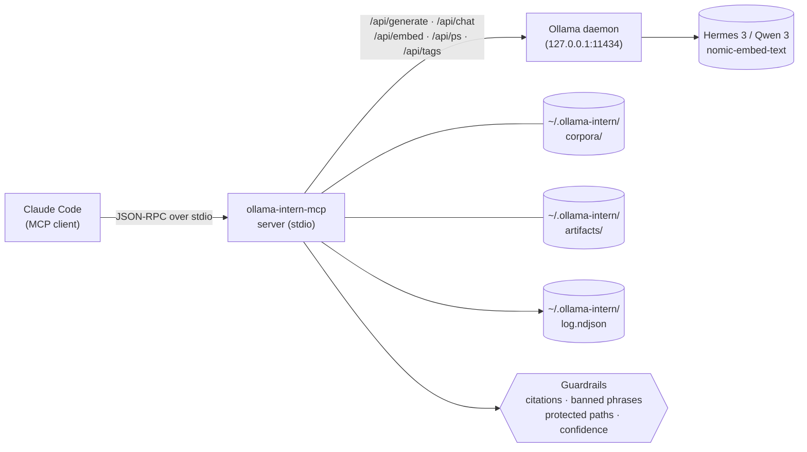

<p align="center">
  <a href="README.md">English</a> | <a href="README.zh.md">中文</a> | <a href="README.es.md">Español</a> | <a href="README.fr.md">Français</a> | <a href="README.hi.md">हिन्दी</a> | <a href="README.it.md">Italiano</a> | <a href="README.pt-BR.md">Português (BR)</a>
</p>

<p align="center">
  
</p>

<p align="center">
  <a href="https://github.com/mcp-tool-shop-org/ollama-intern-mcp/actions"></a>
  <a href="LICENSE"></a>
  <a href="https://mcp-tool-shop-org.github.io/ollama-intern-mcp/"></a>
  <a href="https://www.npmjs.com/package/ollama-intern-mcp"></a>
  <a href="https://mcp-tool-shop-org.github.io/ollama-intern-mcp/handbook/"></a>
  <a href="#ollama-cloud"></a>
</p>

**Claude Codeのローカルインターン。** <!-- TOOL_COUNT:start -->44<!-- TOOL_COUNT:end --> 業務に合わせたツール、証拠に基づいたブリーフ、耐久性のある成果物。

Claude Codeにルール、階層、デスク、ファイリングキャビネットを備えた**ローカルインターン**を提供するMCPサーバー。Claudeが_ツール_を選択し、ツールが_階層_（インスタント／ワークホース／ディープ／埋め込み）を選択し、階層が来週開けるファイルを作成します。

**また、[Hermes Agent](https://github.com/NousResearch/hermes-agent)を`hermes3:8b`上で実行** — 2026-04-19にエンドツーエンドで検証済み。デフォルトのラダーは`hermes3:8b`、代替レールは`qwen3:*`です。下記[Hermesとの連携](#use-with-hermes)を参照してください。

**ハードウェア要件:** `hermes3:8b`の場合は約6GBのVRAM、またはCPU推論の場合は約16GBのRAM。完全な詳細については、[handbook/getting-started](https://mcp-tool-shop-org.github.io/ollama-intern-mcp/handbook/getting-started/#hardware-minimums)を参照してください。

**Claudeを使用していませんか？** [`examples/`](./examples/)ディレクトリには、stdio経由で起動できる最小限のNode.jsおよびPython MCPクライアントがあります。また、[handbook/with-hermes](https://mcp-tool-shop-org.github.io/ollama-intern-mcp/handbook/with-hermes/)も参照してください。

**ローカル優先** — ユーザーが明示的に選択するまで、ネットワークへのデータ送信はゼロ。テレメトリーなし。いかなる「自律的」機能もなし。すべての呼び出しで、その処理内容が表示されます。

**十分なGPUがない場合？[Ollama Cloud](#ollama-cloud)は、すべての<!-- TOOL_COUNT:start -->44<!-- TOOL_COUNT:end -->ツールを600Bクラスのモデル上で実行します。** ほとんどのユーザーは、最先端のモデルを自分のカードでホストすることはできません。それがローカルAIの真の限界であり、このシステムはその限界を克服します。同じ`/api/*`インターフェース、同じ業務に合わせたツール、同じエンベロープ。埋め込みはローカルに保持され、クラウドの障害が発生した場合でも、ローカルプロファイルに自動的に切り替わります。**1つ**の呼び出し（`backend: "cloud"`）をエスカレートするか、すべての生成呼び出し（`OLLAMA_CLOUD_PRIMARY=1`）をルーティングします。そして、すべてのエンベロープには、実際にどのバックエンドが処理したかが表示されます。キーを設定するまで、機能はオフになっています。

---

## v2.10.0で新規追加

**クラウドの透明性を重視したリリース。** v2.9.0では、1回の呼び出しごとにクラウドへのエスカレーションが実装され、このREADMEでは「重要なレビューを600Bモデルにエスカレートする」と宣伝されていました。しかし、`backend`入力は**44のツールのうち1つ**にのみ存在し、それは`ollama_chat`であり、そのツールの説明にもあるように、最終手段として使用されます。すべてのレビューに関連するジョブは、ローカルの8Bモデルに固定されていました。ローカル優先の原則は変更されていません。キーを設定しない場合、データ送信はゼロであり、起動時のクラウドプローブも行われず、埋め込みはローカルに保持され、新しい設定はすべてデフォルトで今日の動作になります。

- **1回の呼び出しごとのエスカレーションは、現在15のツールに拡張されました（以前は1つ）。** `backend: "cloud"`は、`research`、`summarize_deep`、`code_review`、`code_citation`、`corpus_answer`、`hypothesis_drill`、`multi_file_refactor_propose`、`refactor_plan`、すべての3つのブリーフ、すべての3つのパック、および`chat`のオプションの入力です。省略すると、動作はv2.9.xと完全に同じになります。**パックは、合成ステップのみをエスカレートします** — 証拠の組み立て、トリアージ、および成果物の書き込みはローカルで行われ、処理できないエスカレーションは、ローカルで作業を開始する前に拒否されます。
- **`INTERN_CLOUD_STANDBY_TIERS` — ポリシーを一度宣言します。** どの階層（`instant|workhorse|deep`）が、1回の呼び出しごとの指示なしに、スタンバイ状態でエスカレートするかを指定します。デフォルトでは空です。1回の呼び出しごとの`backend`は、両方の方向で優先されます。`embed`は、構成のロード時とルーティングレイヤーの両方で拒否されます。埋め込みは常にローカルに保持されます。
- **`doctor --cloud-check` — キーが実際に機能することを確認します。** 以前のプローブは`/api/tags`にアクセスし、無効なキーに対して200を返していたため、認証は常に「未検証」としか読み取れませんでした。この機能では、8トークンの生成を1回実行し、`ok` / `failed` / `unverified` / `unreachable`を返します。これらはすべて、意図的に異なる状態として保持されます。モデルIDに対する404エラーは、キーの問題ではなく、キーを探させるものではないためです。また、各構成済みのクラウドIDが「存在」または「カタログに存在しない」として報告され、最も近いライブIDが提案されるため、廃止されたIDは、コストがかかる前に見つけることができます。
- **修正：`init`は、すべてのnpmインストールで壊れていました。** `hermes.config.example.yaml`は、公開されたtarballに含まれていなかったため、バイナリは「パッケージングエラー」をnpmからインストールしたすべてのユーザーに報告していました。現在は同梱されており、CIはパッケージ化されたtarballをインストールして実行するため、再発することはありません。
- **検索スコアは、ついに比較可能になりました。** `CorpusHit.score`は、1つのフィールドの下に4つの比較不可能なスケールを持っていました。デフォルトのハイブリッドモードは`0.0328`で上限に達し、`corpus_min_evidence_score`は「0〜1」とドキュメントに記載されていたため、自然な下限である`0.1`が、すべてのコーパスチャンクを無効にしていました。融合されたスコアは0〜1に再調整され、各ヒットには`score_scale`が含まれます。

完全な詳細は、[CHANGELOG.md](./CHANGELOG.md)を参照してください。

## v2.9.0で新規追加

**クラウド機能の導入 — 異なるファミリー間の検証、オンデマンドのクラウドへのエスカレーション、およびその経済性。** ローカル優先の原則は変更されていません。キーを設定しない場合、動作はv2.8.0と完全に同じになります（データ送信はゼロ、起動時のクラウドプローブも行われません）。

- **`ollama_verify_claims` — 異なるモデル間での検証。** `ollama_code_review` は結果を生成し、それらを評価します。これは、複数のモデル（デフォルトでは deepseek / kimi / glm）を使用して、入力された情報と証拠に基づいて、CONFIRMED（確認済み）/ REFUTED（否定）/ NEEDS_REVIEW（再検討が必要）のいずれかの結果を返します。集計は、単一の反対意見があっても決定されないように行われ（少なくとも2つの肯定的な意見が必要）、すべての評価者は、実際に動作するモデルを使用して評価されます（ローカルの代替モデルや、動作しないモデルは使用されず、カウントされません）。また、入力された情報は、推論に必要な構造が取り除かれます。正直な評価の限界は文書化されており、CONFIRMEDは証拠となる情報であり、絶対的な証明ではありません。そのため、重大な誤りを検出するのには適していますが、最新モデルの微妙な誤りを検出するには限界があります。
- **個々の呼び出しごとのクラウドへの切り替え + スタンバイモード。** `OLLAMA_API_KEY` を単独で設定（`OLLAMA_CLOUD_PRIMARY` なし）すると、**スタンバイ**モードになります。ローカルでの処理を優先し、外部へのデータ送信は行われず、起動時のプロセスの実行も行われません。単一の呼び出しで `backend:'cloud'` が指定されるまで、この状態が続きます。重要なレビューを、すべての呼び出しをクラウドに切り替えることなく、600Bモデルに切り替えることができます。最初の切り替え時には、外部へのデータ送信が明確に通知され、個々の呼び出しに対する `model` のオーバーライドが、クラウドへの試行時にそのまま適用されます。
- **`ollama_log_stats` — タグラインで約束されている、測定可能な経済効果。** LLMを使用しない、NDJSON形式のトランザクションデータの集計：クラウドとローカルの処理の割合、クラウドからローカルへのフォールバック率、ツールごとのトークン数、p50/p95のレイテンシー。これらはすべて、`since` の時間ウィンドウ内で集計されます。
- **CI用のツール + 機械可読なツール。** `doctor --json --fail-unhealthy` は、パイプラインに実際のゲート（クラウド対応の `healthy` フラグ付き）を提供し、すべてのツールは MCP `readOnlyHint`/`destructiveHint`/`title` アノテーションを付加するため、クライアントは正しい権限を持つユーザーエクスペリエンスを得ることができます。さらに、`init --claude` は、貼り付け可能な `.mcp.json` を作成します。

詳細については、[CHANGELOG.md](./CHANGELOG.md) を参照してください。

## v2.8.0 の新機能

**信頼性、耐久性、セキュリティの強化 — 25個の修正。すべてテストを最初に行い、異なるモデル間での検証を行っています。** ローカルでの処理を優先する動作は変更されておらず、ツールの契約も削除されていません。既存のユーザーは引き続き問題なく使用できます。主な改善点は次のとおりです。

- **サイレントなデータ損失の防止。** `ollama_corpus_refresh` の実行中に一時的な読み取りエラーが発生した場合（Windowsのファイルロック、アンチウイルスによるブロック、エディターの保存ウィンドウなど）、ファイルが「存在しない」と判断され、**インデックスされたコンテンツが完全に削除されていました。** これからは、実際に存在しないファイルのみが削除され、一時的なエラーが発生した場合は、パスが保持され、再試行するようにフラグが設定され、チャンクが保存されます。
- **予算を遵守する並行処理。** ティアのタイムアウトが発生した場合、許可待ちの呼び出しをキャンセルできるようになりました（以前は、トランザクションデータがそうでないことを示していても、タイムアウトを超えて処理が続行されていました）。また、`ollama_chat` は、タイムアウト/ティアの境界を通過するようにルーティングされるため、1つのローカル生成プロセスが停止しても、他のすべてのツールが停止することはありません。また、クラウドを優先するモードで、実際にクラウドに到達するようになります。
- **停止するのではなく、段階的に機能低下するクラウド。** 使用されなくなったクラウドモデルIDは、総停止ではなく、明確な `cloud_model_missing` の理由とクラウド固有のヒントとともに、ローカルにフォールバックするようになりました。サーキットブレーカーが永久に停止することはありません。また、永続的に存在しないモデルは、すべての呼び出しでクラウドへのラウンドトリップを試行することを停止します。
- **ドキュメントと一致するセキュリティ面。** `ollama_batch_proof_check` は、cwd（カレントワーキングディレクトリ）の封じ込めを実際に強制するようになりました（新しいオペレーター環境制限 `INTERN_BATCH_PROOF_ALLOWED_ROOTS` により、呼び出し元が範囲を広げることができなくなります）。プロンプトインジェクション対策は、カバレッジが向上し、正直に開示された限界が設定されました。また、保護されたパスガードは、macOSでも大文字と小文字を区別しなくなりました。
- **正直な成果物とトランザクションデータ。** パックの書き込みはアトミックであり、サイレントな上書きは行われません。機能が低下したバッチエンベロープは、実際に使用されたティアを報告します。中断された書き込み検出器は、すべての変更で、破損した書き込みを検出します。チャンクIDは、同一のコンテンツを持つファイル間で衝突しなくなりました。依存関係の監査は完全に完了しており（脆弱性は0です）。

詳細については、[CHANGELOG.md](./CHANGELOG.md) を参照してください。

## v2.7.0 の新機能

**オプションのOllama Cloudルーティング — クラウドを優先、ローカルにフォールバック。** キーとフラグを設定することで、生成レイヤーを600Bクラスのクラウドモデルにルーティングできます。埋め込みはローカルに保持され、サーキットブレーカーは、クラウドに障害が発生した場合に、ローカルプロファイルにフォールバックします。**デフォルトではオフ — 両方の `OLLAMA_API_KEY` と `OLLAMA_CLOUD_PRIMARY=1` を設定しない限り、外部へのデータ送信は行われません。** 既存のv2.7.0より前のユーザー（および、この機能を有効にしないユーザー）は、変更の影響を受けません。詳細については、[Ollama Cloud](#ollama-cloud) を参照してください。

- **クラウドを優先し、安全ネットを用意。** `RoutingOllamaClient` は、まずクラウドを試行し、タイムアウト/5xx/429/ネットワークエラーが発生した場合に、ローカルプロファイルにフォールバックします。無効なキー（401/403）は、サイレントに機能低下するのではなく、サーキットブレーカーを通じて明確に通知されます。使用されなくなった/タイプミスのあるクラウドモデルID（404）も同様です。
- **サイレントな機能低下は発生しない。** すべてのエンベロープに `backend`（`cloud`|`local`）、`degraded`、および `degrade_reason` が追加されるため、常にローカルモデルではなく、大規模なモデルが使用されているかどうかを確認できます。`backend_fallback` のNDJSONイベントにより、クラウドからローカルへのフォールバック率が `ollama_log_tail` で表示されます。
- **`ollama_doctor` は、クラウド認証と到達可能性を個別のブロックとして報告します。** `ollama-intern-mcp doctor` には、`Cloud (primary)` セクションが表示されます。
- デフォルトのクラウドモデルは、v2.7.0 リリース時に `minimax-m3:cloud` でした（その後、`qwen3-coder-next:cloud` に変更されました — 制限された `num_predict` のツールに対して空の応答を返すため、より適切なデフォルトモデルに変更されました。詳細については、[env table](#cloud-env-vars) を参照してください）。ティアごとに、`INTERN_CLOUD_MODEL` / `INTERN_CLOUD_DEEP_MODEL` を使用してオーバーライドできます。

## v2.6.0 の新機能

個々の呼び出しに対するティア予算のオーバーライドを `ollama_extract` で設定できます。既存のv2.6.0より前のユーザーには影響はありません。詳細については、[CHANGELOG.md](./CHANGELOG.md) を参照してください。

- **`tier_budget_ms_override?: number` schema field on `ollama_extract`** (optional, bounded `[1, 600000]` ms). When present, applies the override to every tier visited by the runner so the inner `runWithTimeoutAndFallback` machinery at `src/guardrails/timeouts.ts:61` honors the operator-supplied budget instead of the profile default. The cascade (workhorse → instant on timeout) still fires; the override governs each cascade hop uniformly.
- **Why this exists.** The research-os R-018 wrapper (v0.12.1) wrapped MCP `callTool` with `Promise.race` and found the wrapper's budget did not reach the inner tier — `DEV_RTX5080_TIMEOUTS.instant = 15_000` continued to fire `TIER_TIMEOUT` at 15000ms regardless of a 180000ms wrapper budget. v2.6.0 supplies the MCP-side authoritative budget so the operator's `--planner-timeout-ms` flag (research-os) finally controls inner-tier timeouts as designed.
- **Default behavior preserved.** Field omitted = profile defaults govern byte-identically. Pre-v2.6.0 callers see zero change.
- **R-010 fallback-cause regex preserved.** Server-side `TIER_TIMEOUT` error message still matches `/elapsed=(\d+)ms/` + `/budget=(\d+)ms/` so AI-advisor visibility downstream works on override and default paths alike.
- Consumed by research-os v0.13.0 (cumulative R-019 client wire-up + R-020 + R-021) in a coordinated multi-repo release.

### 履歴 — v2.4.0 の成果物

v2.4.0 の完全なエントリについては、[CHANGELOG.md](./CHANGELOG.md) および [docs/release-notes/v2.4.0.md](./docs/release-notes/v2.4.0.md) を参照してください（プロファイルシステムにおけるティアごとの `num_ctx` 制御）。

## v2.4.0 の新機能

プロファイルシステムにおけるティアごとの `num_ctx`（コンテキストウィンドウ）制御。付加的なマイナーバージョン — v2.3.0 の呼び出し元は変更なし。詳細なエントリは、[CHANGELOG.md](./CHANGELOG.md) および [docs/release-notes/v2.4.0.md](./docs/release-notes/v2.4.0.md) を参照してください。

- **`TierConfig.num_ctx` マップ（新規）** — プロファイルのオプションの `{ instant?, workhorse?, deep?, embed? }`。ティアに設定されている場合、MCPサーバーは、そのティアにルーティングされたすべてのOllama generate/chatリクエストに `options.num_ctx = <value>` を配置します（初期 + フォールバック）。設定されていない場合、リクエストは `num_ctx` を完全に省略するため、Ollamaはモデルにロードされたデフォルトを使用します — v2.3.0 の動作を正確に維持します。
- **新しいエンベロープフィールド `num_ctx_used?: number`** — MCPサーバーが実際に `num_ctx` を送信した場合にのみ存在します。リクエストでOllamaが選択できるようにした場合、存在しません。デフォルトを推測しないでください。MCPサーバーは、Ollamaに有効な値を問い合わせません。
- **プロファイルのデフォルト:** `dev-rtx5080` / `dev-rtx5080-qwen3` は、`instant: 4096`、`workhorse: 8192`、`deep`/`embed` が UNSET の状態で出荷されます。RTX 5080 の 16GB VRAM 予算内に `hermes3:8b` を保持し、高速ツールを実現できるようにサイズが調整されています。`m5-max` は、すべてのティアを UNSET のままにします — 128GB の統合メモリには、スピルが発生する問題はありません。
- **v0.8.0 フェーズ 1 の診断をクローズします。** — `hermes3:8b` は、デフォルトの 32K コンテキストで RTX 5080 上で実行された場合、CPU にスピルし、ワークホース `ollama_extract` 呼び出しのタイムアウトを引き起こしました。v2.4.0 は、プロファイルレイヤーでこれを防止します。

### ティアごとの `num_ctx` 制御（v2.4.0 の新機能）

プロファイル（`src/profiles.ts` からの抜粋）：

```ts
"dev-rtx5080": {
  tiers: {
    instant: "hermes3:8b",
    workhorse: "hermes3:8b",
    deep: "hermes3:8b",
    embed: "nomic-embed-text",
    num_ctx: {
      instant: 4096,    // fast classify/summarize
      workhorse: 8192,  // schema-bound extract / batch
      // deep: UNSET — long-context briefs keep current behavior
      // embed: UNSET — no context-window pressure on embed
    },
  },
  // ... timeouts, prewarm
}
```

ワークホースティアの呼び出しにおけるエンベロープ（例：`ollama_extract`）：

```jsonc
{
  "result": { /* extracted data */ },
  "tier_used": "workhorse",
  "model": "hermes3:8b",
  "num_ctx_used": 8192,        // present because the profile set workhorse=8192
  // ... rest of envelope unchanged
}
```

`m5-max`（またはティアを UNSET のままにするプロファイル）の場合、`num_ctx_used` はエンベロープに存在せず、Ollama へのワイヤリクエストには `num_ctx` フィールドが含まれません。Ollama は、モデルにロードされたデフォルトを使用します。

オペレーターは、プロファイルの選択/編集によって調整します。ツールスキーマに、呼び出しごとの `num_ctx` 入力はありません。将来の呼び出しで必要になった場合は、v2.3.0 の `model` オーバーライドに従います。

### 履歴 — v2.3.0 の成果物

v2.3.0 の完全なエントリについては、[CHANGELOG.md](./CHANGELOG.md) および [docs/release-notes/v2.3.0.md](./docs/release-notes/v2.3.0.md) を参照してください（呼び出しごとのモデルオーバーライド）。

## v2.3.0 の新機能

LLM をバックエンドとするアトムツール全体での、呼び出しごとのモデルオーバーライド。付加的なマイナーバージョン — v2.2.0 の呼び出し元は変更なし。詳細なエントリは、[CHANGELOG.md](./CHANGELOG.md) および [docs/release-notes/v2.3.0.md](./docs/release-notes/v2.3.0.md) を参照してください。

- **8 つのアトムツールにおけるオプションの `model: string` 入力** — `ollama_extract`、`ollama_classify`、`ollama_summarize_fast`、`ollama_summarize_deep`、`ollama_research`、`ollama_corpus_answer`、`ollama_chat`、`ollama_code_citation`。ツールのティアでの最初の試行は、呼び出し元が指定したモデルに対して実行されます。タイムアウトが発生した場合、既存の `TIER_FALLBACK` カスケードによって、より安価なティアの独自のモデルが解決されます（呼び出し元のオーバーライドではありません）。コンポジット/ブリーフ/パックツールは、意図的に `model` を受け入れません。アトムは呼び出しごとの制御を受け取り、コンポジットはティアのデフォルトを使用します。
- **新しいエンベロープフィールド `model_requested?: string`** — オーバーライドが提供された場合にのみ存在します。キャリブレーションを意識した呼び出し元は、`model_requested` と `model` を比較して、フォールバックの置換を検出します：`if (env.model_requested && env.model !== env.model_requested) { /* substitution */ }`。空または空白のみの入力は、スキーマの解析時に `ZodError` をスローし、サイレントなフォールバックは行いません。
- **バグ修正 — `src/version.ts` のドリフト。** ランタイム `VERSION` 定数は、モジュールのロード時に `package.json` から読み込まれるようになりました。v2.1.0 および v2.2.0 では、古い `"2.0.0"` ID 文字列が報告されていました。新しい `tests/version.test.ts` が `VERSION === pkg.version` をロックします。

### 呼び出しごとのモデルオーバーライド（v2.3.0 の新機能）

```jsonc
{
  "tool": "ollama_classify",
  "arguments": {
    "text": "patch null pointer in auth",
    "labels": ["feat", "fix", "chore"],
    "frame": "what is the change kind?",
    "model": "hermes3:8b"
  }
}
```

エンベロープ：

```jsonc
{
  "result": { "label": "fix", "confidence": 0.9, "off_topic": false, ... },
  "tier_used": "instant",
  "model": "hermes3:8b",
  "model_requested": "hermes3:8b",       // present because override was supplied
  // ... rest of envelope unchanged
}
```

ワークホース/ディープティアでタイムアウトが発生し、呼び出しがインスタントティアにカスケードされた場合、`env.model` はインスタントティアの解決されたモデルであり、`env.fallback_from` は `"workhorse"` になり、`env.model_requested` は `"hermes3:8b"` のままで、`env.model !== env.model_requested` が置換シグナルになります。オーバーライドは、意図的により安価なティアに伝播されません。選択されたモデルは、そのティアの役割にまったく適合しない可能性があります。

### 履歴 — v2.2.0 の成果物

v2.2.0 の完全なエントリについては、[CHANGELOG.md](./CHANGELOG.md) および [docs/release-notes/v2.2.0.md](./docs/release-notes/v2.2.0.md) を参照してください（フレームに制限されたトピック性 + 構造化された棄権）。

## v2.2.0 の新機能

ローカルの証拠ワーカーの役割契約：フレームに制限されたトピック性および構造化された棄権。付加的なマイナーバージョン — v2.1.0 の呼び出し元は変更なし。詳細なエントリは、[CHANGELOG.md](./CHANGELOG.md) および [docs/release-notes/v2.2.0.md](./docs/release-notes/v2.2.0.md) を参照してください。

- **フレームに限定された抽出**：`ollama_extract`、`ollama_classify`、`ollama_summarize_fast`、`ollama_summarize_deep`で使用。オプションの`frame: string`入力と、構造化された`frame_alignment` / `on_topic` / `frame_addressed`出力。関連性のないソースは、スキーマに沿って言い換えるのではなく、フラグが立てられます。
- **構造化された回答拒否**：`ollama_research`で使用。`weak` / `abstained` / `sources_address_question`フィールド。空の`citations[]`に空でない`answer`が含まれる場合、以前は成功として処理されていましたが、現在はそうではありません。
- **トピック適合性の閾値**：`ollama_corpus_answer`で使用。オプションの`min_top_score`。閾値を下回ると、ツールは`abstained: true`で処理を中断し、合成をスキップします。各引用に表示される、引用ごとの`score`。
- **検索スコアの維持**：簡潔な証拠を通じて。`corpusHitsToEvidence`は`score`を保持し、（`incident_brief` / `repo_brief` / `change_brief`でアセンブリ時に使用される）`corpus_min_evidence_score`のノブフィルターを使用します。
- **引用行範囲の制限**：`guardrails/citations.ts`は、`ollama_research`で範囲外の範囲を拒否し、既存の動作（`ollama_code_citation`）と一致します。
- **オペレーター契約ドキュメントの修正**：README `chunk_id`/`chunk_index`の修正、「サーバー側で検証済み」という記述の書き換え、証拠法則セクションの修正、マーケティングスローガンの注釈。

### シード回帰 — 検証

スライスの契約は、リテラルなresearch-osのフレッシュパックの失敗に対して検証されます：arxiv 2112.10422（宇宙論的標準タイマー）、セクション01のフレーム「ローカルファーストとクラウドLLMの深層研究ワークフローにおいて、証拠の保管とは何を意味するか？」— 9 / 9のモックLLM契約テストにより、関連性のないソースが現在含まれていることが確認されました（`frame_alignment.on_topic = false`で抽出、`off_topic: true`で分類、`frame_addressed: false`で要約、`abstained: true`で`min_top_score`を設定した状態でコーパスの回答）。

### 履歴 — v2.1.0の成果物

完全なv2.1.0のエントリについては、[CHANGELOG.md](./CHANGELOG.md)を参照してください（機能パス：13個の新しいツール + 4つの機能強化 + 制限の解除）。

---

## アーキテクチャの概要


```mermaid
flowchart LR
  Claude["Claude Code<br/>(MCP client)"]
  MCP["ollama-intern-mcp<br/>server (stdio)"]
  Ollama["Ollama daemon<br/>(127.0.0.1:11434)"]
  Models[("Hermes 3 / Qwen 3<br/>nomic-embed-text")]
  Corpus[("~/.ollama-intern/<br/>corpora/")]
  Artifacts[("~/.ollama-intern/<br/>artifacts/")]
  NDJSON[("~/.ollama-intern/<br/>log.ndjson")]
  Guards{{"Guardrails<br/>citations · banned phrases<br/>protected paths · confidence"}}

  Claude -- "JSON-RPC over stdio" --> MCP
  MCP --> Guards
  MCP -- "/api/generate · /api/chat<br/>/api/embed · /api/ps · /api/tags" --> Ollama
  Ollama --> Models
  MCP --- Corpus
  MCP --- Artifacts
  MCP --> NDJSON
```

すべてのClaudeツールの呼び出しは、stdio JSON-RPCを介してMCPサーバーに入力されます。サーバーは、ツールの[zod](https://zod.dev)スキーマに対して呼び出しを検証し、構成されたガードレール（引用の検証、禁止フレーズの削除、保護されたパスの強制、信頼度の閾値）を実行し、次に、決定論的なレンダラー（アーティファクト層）またはOllama HTTP呼び出し（他のすべての層）にルーティングします。Ollamaデーモンは、ユーザーが提供したパスを直接参照することはありません。モデル層と準備されたプロンプトのみです。すべての呼び出しは、構造化されたイベントを`~/.ollama-intern/log.ndjson`のNDJSONログに追加し、そこで`ollama_log_tail`とシェルがそれを読み取ることができます。

---

## 主要な例 — 1つの呼び出し、1つの成果物

```jsonc
// Claude → ollama-intern-mcp
{
  "tool": "ollama_incident_pack",
  "arguments": {
    "title": "sprite pipeline 5 AM paging regression",
    "logs": "[2026-04-16 05:07] worker-3 OOM killed\n[2026-04-16 05:07] ollama /api/ps reports evicted=true size=8.1GB\n...",
    "source_paths": ["F:/AI/sprite-foundry/src/worker.ts", "memory/sprite-foundry-visual-mastery.md"]
  }
}
```

ディスク上のファイルへのパスを含むエンベロープを返します。

```jsonc
{
  "result": {
    "pack": "incident",
    "slug": "2026-04-16-sprite-pipeline-5-am-paging-regression",
    "artifact_md":   "~/.ollama-intern/artifacts/incident/2026-04-16-sprite-pipeline-5-am-paging-regression.md",
    "artifact_json": "~/.ollama-intern/artifacts/incident/2026-04-16-sprite-pipeline-5-am-paging-regression.json",
    "weak": false,
    "evidence_count": 6,
    "next_checks": ["residency.evicted across last 24h", "OLLAMA_MAX_LOADED_MODELS vs loaded size"]
  },
  "tier_used": "deep",
  "model": "hermes3:8b",
  "hardware_profile": "dev-rtx5080",
  "tokens_in": 4180, "tokens_out": 612,
  "elapsed_ms": 8410,
  "residency": { "in_vram": true, "evicted": false }
}
```

→ `weak: false`は、≥2個の証拠項目がアセンブルされたことを意味します。仮説が検証されたことを意味するわけではありません。以下の[証拠法則](#evidence-laws)を参照してください。

そのマークダウンファイルは、インターンの作業台の出力です。見出し、引用されたIDを含む証拠ブロック、調査の`next_checks`、証拠が少ない場合の`weak: true`バナー。これは決定論的です。レンダラーはコードであり、プロンプトではありません。（レンダラーは決定論的ですが、仮説と表面の*内容*は生成されます。草案として読み、検証されたものとして扱わないでください。）明日開いて、来週diffして、`ollama_artifact_export_to_path`でハンドブックにエクスポートしてください。

このカテゴリのすべての競合他社は、「トークンを節約」することを前面に打ち出しています。当社は、「インターンが書いたファイルはこちらです」と打ち出します。

### 2番目の例 — コーパスを構築し、次に質問する

```jsonc
// 1. Build a persistent, searchable corpus over your project.
{ "tool": "ollama_corpus_index",
  "arguments": { "name": "sprite-foundry",
                 "paths": ["F:/AI/sprite-foundry/src"],
                 "embed_model": "nomic-embed-text" } }
// → { chunks_written: 1204, paths_indexed: 312, failed_paths: [] }

// 2. Ask an evidence-bound question against it.
{ "tool": "ollama_corpus_answer",
  "arguments": { "name": "sprite-foundry",
                 "query": "how does the worker handle OOM eviction?",
                 "top_k": 8 } }
// → { answer: "...", citations: [{chunk_index, path}...], weak: false }
```

サーバーは、引用のIDを検証し、各`chunk_index`が取得されたヒットの範囲内にあることを確認します。生成されたすべての主張が、引用されたチャンクの内容によって意味的にサポートされていることを証明するわけではありません。これはモデルの責任であり、検索が不十分な場合でも、引用のような回答が生成される可能性があります。完全なウォークスルーについては、[handbook/corpora](https://mcp-tool-shop-org.github.io/ollama-intern-mcp/handbook/corpora/)を参照してください。

---

## フレームに限定された抽出（v2.2.0で新規）

`ollama_extract`、`ollama_classify`、`ollama_summarize_fast`、および`ollama_summarize_deep`は、オプションの`frame: string`入力を受け入れます。フレームは、ソースに回答させる質問を定義します。ソースがフレームに答えない場合、モデルは、真実であるが関連性のないコンテンツを出力するのではなく、回答を拒否するように指示されます。

```jsonc
{
  "tool": "ollama_extract",
  "arguments": {
    "text": "<long source document>",
    "schema": { /* your fields */ },
    "frame": "section purpose here — e.g. 'OOM eviction behavior in the sprite worker'"
  }
}
// → result includes frame_alignment: { on_topic: boolean, reason: string, unaddressed_aspects: string[] }
```

`frame`が省略された場合、動作はv2.1.0から変更されません。指定された場合、`frame_alignment.on_topic = false`は、抽出されたフィールドがソースに対しては真実であるが、フレームには関連しない可能性があることを示します。これを、`weak: true`の簡潔な説明と同じものとして扱い、有用ですが、下流の証拠に昇格する前に、スポットチェックしてください。

---

## 回答拒否契約（v2.2.0で新規）

`ollama_research`は、構造化された回答拒否フィールドを返します：`weak: boolean`、`abstained: boolean`、`sources_address_question: boolean | null`。空の`citations[]`に空でない`answer`が含まれる場合、以前はサイレントに処理されていましたが、現在はそうではありません。`abstained: true`は、モデルが、呼び出し元が提供したパスが質問に答えていないため、合成を拒否したことを示します。回答拒否を失敗ではなく成功として扱ってください。これは、ツールが、不十分な検索を権威のある出力に変換することを拒否していることを意味します。

`ollama_corpus_answer`は、オプションの`min_top_score: number`トピック適合性の閾値（0.0〜1.0）を受け入れます。クエリの最上位の検索スコアが`min_top_score`を下回ると、ツールは`abstained: true`で処理を中断し、合成をスキップします。これにより、「スコア0.21の5つの関連性のないチャンクが、完全な回答を生成する」というv2.1.0の`weak: true`ルールでは検出されなかった失敗モードを防ぎます（`weak: true`は`hits.length < 2`でのみトリガーされます）。各引用に新たに表示される、引用ごとの`score`フィールドと組み合わせて、エンベロープから直接検索品質を監査します。

---

## ここに何があるか — 4つの層、<!-- TOOL_COUNT:start -->44<!-- TOOL_COUNT:end -->ツール

**ジョブに合わせた**とは、各ツールがインターンに依頼するジョブを定義することを意味します。これを分類する、あれを抽出する、これらのログをトリアージする、このリリースノートを作成する、このインシデントをまとめる。ツールの入力はジョブ仕様であり、出力は成果物です。最上位に汎用的な`run_model` / `chat_with_llm`プリミティブはありません。

| 層 | 数 | ここに何があるか |
|---|---|---|
| **Atoms** | 31 | ジョブに合わせた基本的な要素。**オリジナル15:** `classify`、`extract`、`triage_logs`、`summarize_fast` / `deep`、`draft`、`research`、`corpus_search` / `answer` / `index` / `refresh` / `list`、`embed_search`、`embed`、`chat`。**v2.1.0で追加された13個:** `doctor`、`log_tail`、`batch_proof_check`（オペレーション）；`code_map`、`code_citation`、`multi_file_refactor_propose`、`refactor_plan`（リファクタリング）；`artifact_prune`、`hypothesis_drill`（成果物/概要）；`corpus_health`、`corpus_amend`、`corpus_amend_history`、`corpus_rerank`（コーパス）。**+1レビューアトム:** `code_review`（構造化されたPRレビューの結果、主要なツール、レビュー専用）。**v2.9で追加された2個:** `verify_claims`（クロスファミリーのクラウド主要パネルが主張を評価、クラウドが必要）および`log_stats`（NDJSON形式のデータを集計して、測定可能な経済指標を算出 - クラウド/ローカルの分割、フォールバック率、各ツールのp50/p95、モデルの呼び出しはなし）。バッチ処理が可能なアトム（`classify`、`extract`、`triage_logs`）は、`items: [{id, text}]`を受け入れます。 |
| **Briefs** | 3 | 証拠に基づいた構造化されたオペレーター向け概要。`incident_brief`、`repo_brief`、`change_brief`。すべての主張は、証拠IDを参照します。不明な点はサーバー側で削除されます。信頼性の低い証拠は、偽の物語ではなく、`weak: true`を提示します。 |
| **Packs** | 3 | 固定パイプラインの複合ジョブで、永続的なマークダウンとJSONを`~/.ollama-intern/artifacts/`に書き込みます。`incident_pack`、`repo_pack`、`change_pack`。決定的なレンダラー - 成果物の形状に対してモデルを呼び出すことはありません。 |
| **Artifacts** | 7 | パックの出力全体にわたる連続性。`artifact_list` / `read` / `diff` / `export_to_path`、さらに3つの決定的なスニペット：`incident_note`、`onboarding_section`、`release_note`。 |

合計：**31個のアトム + 3個の概要 + 3個のパック + 7個の成果物ツール = <!-- TOOL_COUNT:start -->44<!-- TOOL_COUNT:end -->**。

フリーズライン：
- アトム：**v2.1.0でフリーズを解除**（現在31個、v2.1.0の機能追加で13個追加、その後1個（`code_review`）、v2.9で2個（`verify_claims`、`log_stats`））。新しいアトムには、監査による正当化、テスト、ハンドブックのページ、およびCHANGELOGのエントリが必要です。安易な追加は行いません。
- パック：3でフリーズ。新しいパックタイプはありません。
- 成果物ティア：7でフリーズ。

完全なツールリファレンスは、[ハンドブック](https://mcp-tool-shop-org.github.io/ollama-intern-mcp/handbook/tools/)にあります。

---

## インストール

ローカルで実行されている[Ollama](https://ollama.com)と、ティアモデルをダウンロードする必要があります（以下「[モデルのダウンロード](#model-pulls)」を参照）。

### Claude Code（推奨）

ほとんどのユーザーは、これをClaude Code MCPサーバー構成に追加してインストールします。グローバルインストールは必要ありません。Claude Codeは、必要に応じてサーバーを`npx`経由で実行します。

```json
{
  "mcpServers": {
    "ollama-intern": {
      "command": "npx",
      "args": ["-y", "ollama-intern-mcp"],
      "env": {
        "OLLAMA_HOST": "http://127.0.0.1:11434",
        "INTERN_PROFILE": "dev-rtx5080"
      }
    }
  }
}
```

### Claude Desktop

同じブロックを、`~/Library/Application Support/Claude/claude_desktop_config.json`（macOS）または`%APPDATA%\Claude\claude_desktop_config.json`（Windows）に書き込みます。

### グローバルインストール（上級者向け）

Claude Codeの外で、アドホックに使用するためにバイナリを`PATH`に配置したい場合にのみ必要です。

```bash
npm install -g ollama-intern-mcp
```

### Hermesとの連携

このMCPは、[Hermes Agent](https://github.com/NousResearch/hermes-agent)を使用して、Ollama上で`hermes3:8b`に対してエンドツーエンドで検証されました（2026-04-19）。Hermesは、このMCPのフリーズされた基本的な要素に*アクセスする*外部エージェントです。計画はHermesが行い、作業は私たちが実行します。

リファレンス構成（このリポジトリの[hermes.config.example.yaml](hermes.config.example.yaml)）：

```yaml
model:
  provider: custom
  base_url: http://localhost:11434/v1
  default: hermes3:8b
  context_length: 65536    # Hermes requires 64K floor under model.*

providers:
  local-ollama:
    name: local-ollama
    base_url: http://localhost:11434/v1
    api_mode: openai_chat
    api_key: ollama
    model: hermes3:8b

mcp_servers:
  ollama-intern:
    command: npx
    args: ["-y", "ollama-intern-mcp"]
    env:
      OLLAMA_HOST: http://localhost:11434
      INTERN_PROFILE: dev-rtx5080
      # hermes3:8b is the default ladder in v2.0.0, so tier overrides are
      # only needed if you're pinning a different local model.
```

**プロンプトの形式が重要です。**命令型のツール呼び出しプロンプト（「引数...でXを呼び出す」）は、統合テストです。これにより、8Bのローカルモデルに十分な足場が与えられ、クリーンな`tool_calls`を出力できます。リスト形式のマルチタスクプロンプト（「Aを実行し、次にBを実行し、次にCを実行する」）は、より大きなモデルの機能ベンチマークです。8Bでリスト形式の失敗を「配線が壊れている」と解釈しないでください。完全な統合ウォークスルーと、既知のトランスポートの注意事項（Ollama `/v1`ストリーミング + openai-SDK非ストリーミングシム）については、[handbook/with-hermes](https://mcp-tool-shop-org.github.io/ollama-intern-mcp/handbook/with-hermes/)を参照してください。

### モデルのダウンロード

**デフォルトの開発プロファイル（RTX 5080 16GBおよび同等のハードウェア）：**

```bash
ollama pull hermes3:8b
ollama pull nomic-embed-text
export OLLAMA_MAX_LOADED_MODELS=2
```

**Qwen 3代替レール（同じハードウェア、Qwenツール用）：**

```bash
ollama pull qwen3:8b
ollama pull qwen3:14b
ollama pull nomic-embed-text
export INTERN_PROFILE=dev-rtx5080-qwen3
```

**M5 Maxプロファイル（128GBの統合メモリ）：**

```bash
ollama pull qwen3:14b
ollama pull qwen3:32b
ollama pull nomic-embed-text
export INTERN_PROFILE=m5-max
```

ティアごとの環境変数（`INTERN_TIER_INSTANT`、`INTERN_TIER_WORKHORSE`、`INTERN_TIER_DEEP`、`INTERN_EMBED_MODEL`）は、必要に応じてプロファイル設定を上書きします。

**Residency.** On the dev profiles the server prewarms the Instant model at startup with a **bounded** `keep_alive` (10 minutes) so the first call is never cold; after any real call, Ollama's own idle eviction (default 5 minutes after the last request) governs. Set `INTERN_PREWARM=off` to skip the startup warm entirely — the right mode when the GPU is shared with training or rendering: models load on first use and idle out on their own. Raising `OLLAMA_KEEP_ALIVE` is for boxes dedicated to Ollama; `-1` pins every touched model in VRAM until the server restarts.

---

## 均一なエンベロープ

すべてのツールは、同じ形式を返します。

```ts
{
  result: <tool-specific>,
  tier_used: "instant" | "workhorse" | "deep" | "embed",
  model: string,
  hardware_profile: string,     // "dev-rtx5080" | "dev-rtx5080-qwen3" | "m5-max"
  tokens_in: number,
  tokens_out: number,
  elapsed_ms: number,
  residency: {
    in_vram: boolean,
    size_bytes: number,
    size_vram_bytes: number,
    evicted: boolean
  } | null
}
```

`residency`は、Ollamaの`/api/ps`から取得されます。`evicted: true`または`size_vram < size`の場合、モデルはディスクにページングされ、推論速度が5〜10倍低下します。これをユーザーに通知し、Ollamaを再起動するか、ロードされたモデルの数を減らすように指示します。

[Ollama Cloud](#ollama-cloud)モードでは、エンベロープには`backend`（`"cloud"` | `"local"`）も含まれ、クラウドからローカルへのフォールバック時には、`degraded: true` + `degrade_reason`も含まれます。これらのフィールドは、デフォルトのローカルモードでのみ存在しないため、既存のクライアントには影響しません。`residency`は、クラウドで提供される呼び出しの場合、`null`です（ステートレスなクラウドにはローカルVRAMの常駐はありません）。

すべての呼び出しは、1つのNDJSON行として`~/.ollama-intern/log.ndjson`にログ記録されます。公開可能なベンチマークから開発番号を除外するには、`hardware_profile`でフィルタリングします。

---

## ハードウェアプロファイル

| プロファイル | Instant | Workhorse | Deep | Embed |
|---|---|---|---|---|
| **`dev-rtx5080`**（デフォルト） | hermes3 8B | hermes3 8B | hermes3 8B | nomic-embed-text |
| `dev-rtx5080-qwen3` | qwen3 8B | qwen3 8B | qwen3 14B | nomic-embed-text |
| `m5-max` | qwen3 14B | qwen3 14B | qwen3 32B | nomic-embed-text |

**デフォルトの開発**は、検証済みのHermes Agent統合パスである、3つのワークティアすべてを`hermes3:8b`に統合します。上から下まで同じモデルを使用するため、ダウンロードするものが1つ、常駐コストが1つ、理解する必要がある動作が1つだけです。Qwen 3（その`THINK_BY_SHAPE`のパイプラインを使用）を好むユーザーは、`dev-rtx5080-qwen3`を選択できます。`m5-max`は、統合メモリ用にサイズ調整されたQwen 3ラダーです。

---

## Ollama Cloud

**ハードウェアの制約を解消。** ほとんどの機械が実際に扱えるのは、ローカルの8Bモデルであり、これがほぼすべてのユーザーが直面するボトルネックです。予算や関心の問題ではなく、VRAMの問題です。[Ollama Cloud](https://ollama.com/cloud)は、**同じ**`/api/*`インターフェースを通じて600Bクラスのモデルを提供するため、高度なツールは最先端のモデルで実行され、VRAMは他の必要なタスクに割り当てられます。ローカル環境は常に利用可能なバックアップとして機能するため、制約を緩和しながら、基本的な機能は維持されます。

ツールのインターフェースは変更されません。同じ<!-- TOOL_COUNT:start -->44<!-- TOOL_COUNT:end -->種類のツール、同じ設定、同じ安全対策が適用されます。埋め込みはクラウドに送信されません（Ollama Cloudは埋め込みモデルを提供しないため）、そのため、データセットは常にローカルに保持されます。

**オプトイン方式で、デフォルトはオフ。** キーが設定されていない場合、パッケージはローカル優先で動作し、**データ送信は一切行われません**。オプトインしないユーザーには影響がありません。オプトインする方法は2つあります。

- **クラウド優先**（以下）：`OLLAMA_CLOUD_PRIMARY=1`と`OLLAMA_API_KEY`の両方を設定します。生成モデルはクラウドにルーティングされ、ローカルでバックアップされます。
- **クラウド待機**（v2.9）：**`OLLAMA_API_KEY`のみ**を設定します。すべての処理はローカルで行われ（データ送信は一切行われません。起動時のプローブも行われません）、単一の呼び出しで明示的に`backend: "cloud"`を使用してクラウドに切り替えるまで、この状態が維持されます。詳細は、以下「クラウド待機と、呼び出しごとのエスカレーション」を参照してください。

```json
{
  "mcpServers": {
    "ollama-intern": {
      "command": "npx",
      "args": ["-y", "ollama-intern-mcp"],
      "env": {
        "OLLAMA_CLOUD_PRIMARY": "1",
        "OLLAMA_API_KEY": "sk-...your-key...",
        "INTERN_PROFILE": "dev-rtx5080"
      }
    }
  }
}
```

> **キーは、CIのシークレットではなく、実行時の環境変数です。** GitHub Actionsのシークレットは、CIの実行中にのみアクセスできます。実行中のサーバーには到達しません。[ollama.com/settings/keys](https://ollama.com/settings/keys)でキーを作成し、MCPクライアントの`env`ブロック（またはシェル環境）に配置します。

**ルーティングの仕組み。** クラウドが有効になっている場合、生成モデル（インスタント/ワークホース/ディープ）はクラウドモデルにルーティングされます。**埋め込みは常にローカルに保持されます**（Ollama Cloudは埋め込みモデルを提供しないため、データセット/埋め込みツールには影響しません）。サーキットブレーカーは、最初にクラウドを試み、タイムアウト/5xx/429/ネットワークエラーが発生した場合にローカルプロファイルに切り替えます。無効なキー（401/403）は、サイレントに機能停止するのではなく、明確にエラーを表示するサーキットブレーカーをトリガーします。ローカルプロファイル（`INTERN_PROFILE`）はフォールバックラダーであるため、モデルを常に最新の状態に保ってください。

**サイレントな機能低下は発生しません。** すべての応答には、どのバックエンドが呼び出しを処理したかが含まれます。

```ts
{ ...envelope, backend: "cloud" | "local", degraded?: true, degrade_reason?: "cloud_timeout" | "cloud_5xx" | "cloud_rate_limited" | "cloud_unreachable" | "cloud_auth_failed" | "circuit_open" }
```

クラウドからローカルへのフォールバックが発生するたびに、`backend_fallback`行が`~/.ollama-intern/log.ndjson`に記録され（`ollama_log_tail --filter_kind backend_fallback`）、`ollama-intern-mcp doctor`には、モード、到達可能性、認証ステータスを含む**クラウド（プライマリ | 待機）**ブロックが表示されます。

### クラウド待機と、呼び出しごとのエスカレーション

`OLLAMA_API_KEY`を**設定せずに**`OLLAMA_CLOUD_PRIMARY`を設定すると、**待機モード**が有効になります。ルーティングはローカル優先のままになり、データはマシンから送信されません。ただし、呼び出しに`backend: "cloud"`が含まれている場合（`ollama_chat`で公開され、内部的に`ollama_verify_claims`で使用されます）、クラウドに切り替わります。この1回の呼び出しでクラウドモデルにエスカレーションされ、同じサーキットブレーカーとローカルフォールバックの仕組み、および同じ応答の追跡が適用されます。他のすべての呼び出しはローカルで処理されます。**最初に**エスカレーションされた呼び出しでは、ホスト名が明確にstderrに出力され、NDJSONログに`cloud_egress`行が書き込まれます。データ送信は、ドキュメントに記載されているだけでなく、実際に発生した時点で開示されます。

機械的に強制されるルール：

- キーがない場合、`backend: "cloud"`は`CLOUD_NOT_CONFIGURED`で失敗します。ローカルモデルがサイレントに動作し、エスカレーションしたかのように装うことはありません。
- 待機モードで、かつ指示がない場合、ローカルで動作し、データ送信は一切行われません（起動時にクラウドホストをプローブすることはありません）。
- クラウド優先モードで、`backend: "local"`は1つの呼び出しをローカルに固定します。これは、クラウドからローカルに切り替えるための逆のメカニズムです。
- 呼び出しごとの`model`オーバーライドは、クラウドパスをそのまま使用するようになりました（以前は、ティアからクラウドモデルへのマッピングによって上書きされていました）。これにより、証拠に基づいてオーケストレーターが、呼び出しごとに正確なクラウドモデルを指定できます。

この機能の主な用途は、**`ollama_verify_claims`**です。3つのモデルを使用したクロスファミリーのクラウドパネル（デフォルトは`deepseek-v4-pro:cloud`/`kimi-k2.7-code:cloud`/`glm-5.2:cloud`）を使用して、主張/調査結果を評価します。単一の異論は決定に影響を与えません。すべての審査員に対して、使用されたモデルがチェックされ、パネルが縮小された場合には、正直な`weak`フラグが設定されます。パネルによって確認された、最先端のモデルによって作成された主張は、*証拠として使用できますが、決定的な証拠ではありません*。パネルは、重大なエラーを確実に検出し、微妙なエラーには弱い傾向があります。詳細は、[ハンドブックページ](https://mcp-tool-shop-org.github.io/ollama-intern-mcp/handbook/tools/verify-claims/)を参照してください。

**レイテンシーと品質。** 大規模なクラウドモデルは、ローカルの8Bモデルよりもトークンあたりの処理速度が大幅に遅くなります（ミリ秒ではなく秒単位）。これは、速度の向上ではなく、品質の向上です。クラウドティアは、寛大なタイムアウトラダーを使用します（デフォルトでは、インスタントは30秒、ワークホースは120秒、ディープは300秒）。

### クラウド環境変数

| 変数 | デフォルト値 | 目的 |
|---|---|---|
| `OLLAMA_CLOUD_PRIMARY` | _(未設定)_ | **クラウド優先モードの切り替え。** `1`/`true`/`yes`/`on`は、生成モデルをクラウドにルーティングします。キーを設定せずに未設定の場合、**待機モード**（ローカル優先、呼び出しごとのエスカレーションのみ）になります。キーを設定せずに未設定の場合、ローカルのみで動作し、データ送信は一切行われません。 |
| `OLLAMA_API_KEY` | _(未設定)_ | Ollama Cloudのベアラートークン。これを設定するだけで**待機モード**が有効になります。`OLLAMA_CLOUD_PRIMARY`が有効になっている場合は**必須**です（設定されていない場合、起動時にエラーが発生します）。 |
| `OLLAMA_CLOUD_HOST` | `https://ollama.com` | クラウドの基本ホスト。 |
| `INTERN_CLOUD_MODEL` | `qwen3-coder-next:cloud` | インスタント、ワークホース、ディープのクラウドモデル。デフォルトの**思考能力を持たない**モデルを使用することをお勧めします。思考能力を持つモデルをここに設定すると、CoT（Chain of Thought）で短い出力の予算を使い果たします。高度な推論を行うモデルは、以下のディープティアのオーバーライドに設定してください。 |
| `INTERN_CLOUD_DEEP_MODEL` | _（= `INTERN_CLOUD_MODEL`）_ | オプションのディープティア専用のオーバーライド（例：`deepseek-v3.1:671b`）。 |
| `INTERN_CLOUD_TIMEOUT_{INSTANT,WORKHORSE,DEEP}_MS` | `30000`/`120000`/`300000` | ティアごとのクラウド試行のタイムアウト。 |
| `INTERN_CLOUD_NUM_CTX` | `32768` | クラウド呼び出しのコンテキストウィンドウの上限（クラウドはGPU時間に基づいて課金されるため、上限を設定することでコストを管理できます）。 |

> **モデルの可用性は変更される可能性があります。** Ollamaは、クラウドIDをサーバー側でローテーション/廃止します。2026年7月現在、`qwen3-coder-next:cloud`（デフォルトの思考能力を持たないモデル）と、思考能力を持つ主要モデル`deepseek-v4-pro:cloud`/`kimi-k2.7-code:cloud`/`glm-5.2:cloud`が利用可能です。IDを固定する前に、[ollama.com/search?c=cloud](https://ollama.com/search?c=cloud)で確認してください。廃止されたIDは、サイレントに機能停止するのではなく、明確に機能低下します（`cloud_model_missing`）。

**プライバシーに関する注意。** Ollama Cloud にルーティングすると、プロンプトがサードパーティに送信されます。Ollama の [プライバシーポリシー](https://ollama.com/privacy) には、クラウドプロンプトは一時的に処理され、リクエストを超えて保持またはトレーニングに使用されないことが記載されていますが、それでも外部への送信が発生するため、オプトイン方式であり、その旨が明示されています。ローカルモードのみ（デフォルト）では、外部に何も送信されません。

---

## 証拠法

これらはプロンプトではなく、サーバーで適用されます。

- **引用が必要です。** すべての簡潔な主張は、証拠 ID を引用します。
- **不明な要素はサーバー側で削除されます。** 証拠バンドルにない ID を引用するモデルは、結果が返される前に、警告とともにこれらの ID を削除します。
- **ID で検証し、コンテンツで検証するわけではありません。** サーバーは、引用された `evidence_ref` が、組み立てられたセット内の実際の証拠 ID を指していることを確認します。引用された証拠から主張のテキストを導き出すことができるかどうかは検証しません。これはモデルの役割であり、簡潔な記述には、有効な参照を持つ、根拠のない主張が含まれている場合があります。`weak: true` + 補足情報 + 含まれる `excerpt` フィールドを使用して、スポットチェックを行います。
- **根拠が弱いものは、弱いままです。** 証拠が不十分な場合は、補足情報とともに `weak: true` にフラグが立てられます。偽の物語に無理やり組み込むことはありません。
- **調査的であり、処方的ではありません。** `next_checks` / `read_next` / `likely_breakpoints` のみ。プロンプトで「この修正を適用してください」と指示することはできません。
- **決定的なレンダラー。** アーティファクトのマークダウン形式はコードであり、プロンプトではありません。`draft` は、モデルの表現が重要な箇所で使用するために予約されています。
- **同じパック内の差分のみ。** 異なるパック間の `artifact_diff` は、明確に拒否されます。ペイロードは明確に区別されます。

---

## アーティファクトと継続性

パックは `~/.ollama-intern/artifacts/{incident,repo,change}/<slug>.(md|json)` に書き込みます。アーティファクト層は、これをファイル管理ツールにすることなく、継続性の表面を提供します。

- `artifact_list` — メタデータのみのインデックス。パック、日付、slug glob でフィルタリングできます。
- `artifact_read` — `{pack, slug}` または `{json_path}` によって読み取られる型付きデータ。
- `artifact_diff` — 構造化された同じパック内の比較。根拠が弱い場合の変更が強調表示されます。
- `artifact_export_to_path` — 既存のアーティファクト（プロビナンスヘッダー付き）を、呼び出し元が宣言した `allowed_roots` に書き込みます。`overwrite: true` がない限り、既存のファイルを拒否します。
- `artifact_incident_note_snippet` — オペレーターノートのフラグメント
- `artifact_onboarding_section_snippet` — ハンドブックのフラグメント
- `artifact_release_note_snippet` — DRAFT リリースノートのフラグメント

この層では、モデルの呼び出しは行いません。すべて、保存されたコンテンツからレンダリングされます。

---

## 脅威モデルとテレメトリー

**アクセスされるデータ:** 呼び出し元が明示的に渡すファイルパス（`ollama_research`、コーパスツール）、インラインテキスト、および呼び出し元が `~/.ollama-intern/artifacts/` または呼び出し元が宣言した `allowed_roots` に書き込むように要求するアーティファクト。

**アクセスされないデータ:** `source_paths` / `allowed_roots` 以外のすべてのデータ。`..` は正規化前に拒否されます。`artifact_export_to_path` は、`overwrite: true` がない限り、既存のファイルを拒否します。保護されたパス（`memory/`、`.claude/`、`docs/canon/` など）をターゲットとするドラフトには、明示的な `confirm_write: true` が必要であり、サーバー側で適用されます。

**ネットワークへのデータ送信:** **デフォルトではオフ。** デフォルトでは、唯一の外部トラフィックは、ローカルの Ollama HTTP エンドポイントへのものです。クラウドへの呼び出し、更新の確認、クラッシュレポートは行いません。**オプトインの例外:** [Ollama Cloud](#ollama-cloud)（`OLLAMA_CLOUD_PRIMARY=1` + `OLLAMA_API_KEY`）を有効にすると、生成層のプロンプトが HTTPS 経由で Bearer キーとともに `ollama.com` に送信されます。これは明示的であり、開示されており、両方の変数を設定しない限りオフになっています。埋め込みは、外部に送信されることはありません。[SECURITY.md](SECURITY.md) §11 を参照してください。

**テレメトリー:** **なし。** すべての呼び出しは、マシンの `~/.ollama-intern/log.ndjson` に 1 つの NDJSON 行としてログに記録されます。サーバー自体は、どこにも情報を送信しません。

**エラー:** 構造化された形式 `{ code, message, hint, retryable }`。スタックトレースは、ツールの結果を通じて公開されることはありません。

完全なポリシー: [SECURITY.md](SECURITY.md)。

---

## 標準

[Shipcheck](https://github.com/mcp-tool-shop-org/shipcheck) の基準に基づいて構築されています。厳格なゲート A〜D を通過しています。詳細については、[SHIP_GATE.md](SHIP_GATE.md) および [SCORECARD.md](SCORECARD.md) を参照してください。

- **A. セキュリティ** — SECURITY.md、脅威モデル、テレメトリーなし、パスの安全性、保護されたパスの `confirm_write`
- **B. エラー** — すべてのツールの結果で構造化された形式。生のスタックトレースはありません。
- **C. ドキュメント** — README は最新、CHANGELOG、LICENSE。ツールのスキーマは自己文書化されています。
- **D. 衛生** — `npm run verify`（完全な vitest スイート）、依存関係のスキャン、Dependabot、ロックファイル、`engines.node` を備えた CI。

---

## ロードマップ（機能の追加ではなく、堅牢性の向上）

- **フェーズ 1 — 委任の基盤** ✓ 配信済み：アトムの表面、一貫したエンベロープ、階層化されたルーティング、ガードレール
- **フェーズ 2 — 真実の基盤** ✓ 配信済み：スキーマ v2 のチャンク化、BM25 + RRF、動的なコーパス、証拠に基づいた簡潔な記述、検索評価パック
- **フェーズ 3 — パックとアーティファクトの基盤** ✓ 配信済み：耐久性のあるアーティファクトと継続性層を備えた、固定パイプラインのパック
- **フェーズ 4 — 導入の基盤** ✓ v2.0.1：3段階の健全性チェック、堅牢化されたコーパス（TOCTOU、50 MB のファイルサイズの制限、シンボリックリンクの拒否、アトミックな書き込み、ファイルごとの失敗のキャプチャ）、ツールのパスのトラバーサル、可視化（セマフォの待機イベント、タイムアウトエラーのコンテキスト、プロファイル環境オーバーライドロギング、コールドスタートシグナルの事前ウォームアップ）、テストの安全性（10 個のファイルにわたるモジュールロード環境のスナップショット、`tools/call` E2E）。オペレーター向けのトラブルシューティングハンドブックとハードウェアの最小要件が追加されました。
- **フェーズ 5 — M5 Max ベンチマーク** — ハードウェアが利用可能になったら公開可能な数値（〜2026-04-24）

フェーズは、堅牢化の層によって分類されます。パックとアーティファクト層は、3 と 7 で固定されたままです。アトムの固定は v2.1.0 で解除されました。新しいアトムには、監査によって正当化されたギャップ、テスト、ハンドブックページ、および CHANGELOG エントリが必要です。

---

## ライセンス

MIT — [LICENSE](LICENSE) を参照してください。

---

<p align="center">Built by <a href="https://mcp-tool-shop.github.io/">MCP Tool Shop</a></p>
