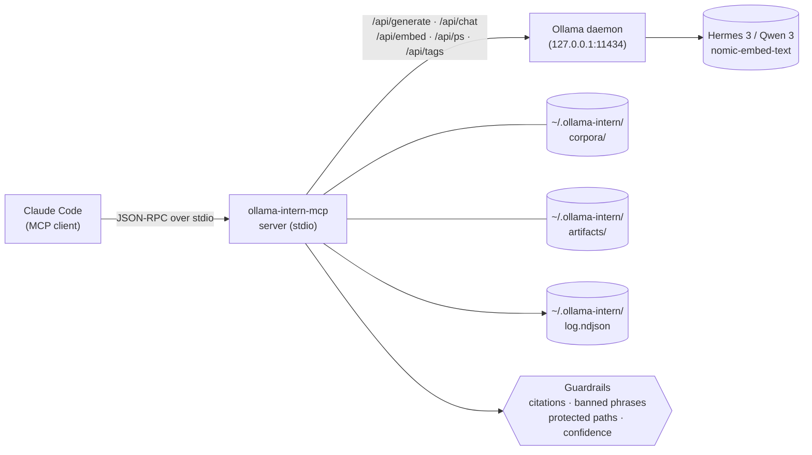

<p align="center">
  <a href="README.md">English</a> | <a href="README.zh.md">中文</a> | <a href="README.es.md">Español</a> | <a href="README.fr.md">Français</a> | <a href="README.hi.md">हिन्दी</a> | <a href="README.it.md">Italiano</a> | <a href="README.pt-BR.md">Português (BR)</a>
</p>

<p align="center">
  
</p>

<p align="center">
  <a href="https://github.com/mcp-tool-shop-org/ollama-intern-mcp/actions"></a>
  <a href="LICENSE"></a>
  <a href="https://mcp-tool-shop-org.github.io/ollama-intern-mcp/"></a>
  <a href="https://mcp-tool-shop-org.github.io/ollama-intern-mcp/handbook/"></a>
</p>

**Claude Codeのローカルインターン。** <!-- TOOL_COUNT:start -->42<!-- TOOL_COUNT:end --> 仕事に合わせたツール、証拠に基づいた簡潔な説明、耐久性の高い成果物。

ルール、階層、デスク、ファイリングキャビネットを備えたClaude Codeにローカルインターンを提供するMCPサーバー。Claudeが_ツール_を選択し、そのツールが_階層_（Instant / Workhorse / Deep / Embed）を選択します。選択された階層は、来週開けるファイルを作成します。

**また、`hermes3:8b`で[Hermes Agent](https://github.com/NousResearch/hermes-agent)も実行します。** 2026年4月19日にエンドツーエンドの検証が完了しました。デフォルトの階層は`hermes3:8b`です。`qwen3:*`は代替のレールです。[Hermesとの連携](#use-with-hermes)を参照してください。

**ハードウェア要件：** `hermes3:8b`の場合は約6GBのVRAM、またはCPU推論の場合は約16GBのRAMが必要です。詳細については、[handbook/getting-started](https://mcp-tool-shop-org.github.io/ollama-intern-mcp/handbook/getting-started/#hardware-minimums)を参照してください。

**Claudeを使用していませんか？** [`examples/`](./examples/)ディレクトリには、stdio経由で起動できる最小限のNode.jsおよびPython MCPクライアントがあります。[handbook/with-hermes](https://mcp-tool-shop-org.github.io/ollama-intern-mcp/handbook/with-hermes/)も参照してください。

**ローカル優先** — 明示的に選択するまで、ネットワークへのデータ送信はゼロです。テレメトリーはありません。「自律的」な機能もありません。すべての呼び出しで処理内容が表示されます。オプションの[Ollama Cloud](#ollama-cloud-optional)ルーティングを使用すると、ローカルハードウェアがボトルネックになっている場合に、600Bクラスのモデルを同じツールで使用できます。また、自動的にローカルにフォールバックします。

---

## v2.8.0で新規追加

**信頼性、耐久性、セキュリティの強化 — 25件の修正。すべてテストを最初に行い、ファミリー全体で検証済みです。** ローカル優先の動作は変更されておらず、ツールの契約も削除されていません。既存の呼び出しは引き続き機能します。重要な改善点は次のとおりです。

- **サイレントなコーパスデータの損失はなくなりました。** `ollama_corpus_refresh`中に一時的な読み取りエラーが発生した場合（Windowsファイルロック、アンチウイルスによる保留、エディターの保存ウィンドウなど）、そのファイルを「存在しない」と判断し、**インデックスされたコンテンツを完全に削除していました。** 現在では、実際に存在しないファイルのみが削除され、一時的なエラーの場合はパスを保持し、再試行するようにフラグを設定し、チャンクを保存します。
- **予算を守る同時実行処理。** 階層のタイムアウトにより、許可待ちの状態にある呼び出しをキャンセルできるようになりました（以前は、リクエストが完了するまで時間がかかり、レシートにはそう表示されていませんでした）。また、`ollama_chat`はついにタイムアウト/階層の境界を通過するようにルーティングされるため、ローカル生成で問題が発生しても、他のツールに影響を与えたり、クラウド優先モードで実際にクラウドに到達したりすることはありません。
- **クラッシュするのではなく、段階的に劣化するクラウド。** 廃止されたクラウドモデルIDは、総停止ではなく、明確な`cloud_model_missing`理由とクラウド固有のヒントとともにローカルにフォールバックします。サーキットブレーカーが永久に機能しなくなることはありません。永続的に存在しないモデルは、すべての呼び出しでクラウドへのラウンドトリップを実行することを停止します。
- **ドキュメントと一致するセキュリティ範囲。** `ollama_batch_proof_check`は現在、cwdの封じ込めを実際に強制します（新しいオペレーター環境キャップ`INTERN_BATCH_PROOF_ALLOWED_ROOTS`があり、呼び出し元がそれを広げることができません）。プロンプトインジェクション対策はカバレッジが増加し、正直に開示された上限も設定されました。また、保護されたパスガードはmacOSでも大文字と小文字を区別しません。
- **信頼できる成果物とレシート。** パックの書き込みはアトミックであり、サイレントな上書きは発生しません。劣化しているバッチエンベロープは、実際に使用されている階層を報告します。中断された書き込み検出器は、すべての変更で破損した書き込みをキャッチします。チャンクIDが、同一の内容を持つファイル間で衝突することはなくなりました。依存関係の監査は完全にクリアです（脆弱性0）。

詳細については、[CHANGELOG.md](./CHANGELOG.md)を参照してください。

## v2.7.0で新規追加

**オプションのOllama Cloudルーティング — クラウド優先、ローカルフォールバック。** キーとフラグを設定して有効にすると、生成階層は600Bクラスのクラウドモデルにルーティングされます。埋め込みはローカルに残ります。サーキットブレーカーは、クラウドで障害が発生した場合にローカルプロファイルにフォールバックします。**デフォルトではオフ — `OLLAMA_API_KEY`と`OLLAMA_CLOUD_PRIMARY=1`の両方を設定しない限り、データ送信は発生しません。** わずかな追加機能です。v2.7.0より前の呼び出し元（および有効にしないユーザー）は、バイト単位で同一の動作を維持します。[Ollama Cloud (オプション)](#ollama-cloud-optional)を参照してください。

- **安全ネットを備えたクラウド優先。** `RoutingOllamaClient`は最初にクラウドを試行し、タイムアウト/5xx/429/ネットワークエラーが発生した場合にローカルプロファイルにフォールバックします。無効なキー（401/403）は、サイレントに劣化するのではなく、粘着性のあるサーキットブレーカーを通じて明確に表示されます。廃止またはタイプミスされたクラウドモデルID（404）も表示されます。
- **サイレントなダウングレードは発生しません。** すべてのエンベロープに`backend`（`cloud`|`local`）、`degraded`、および`degrade_reason`が追加されるため、大規模モデルではなくローカルモデルを取得したときに常にわかります。`backend_fallback` NDJSONイベントにより、クラウドからローカルへのフォールバック率が`ollama_log_tail`で表示されます。
- **`ollama_doctor`は、クラウド認証と到達可能性を個別のブロックとして報告します。** `ollama-intern-mcp doctor`には、「Cloud（primary）」セクションが表示されます。
- デフォルトのクラウドモデルは`minimax-m3:cloud`です。`INTERN_CLOUD_MODEL`/`INTERN_CLOUD_DEEP_MODEL`を使用して、階層ごとにオーバーライドできます（例：`deepseek-v3.1:671b`）。

## v2.6.0で新規追加

`ollama_extract`での呼び出しごとの階層予算のオーバーライド。わずかな追加機能です。v2.6.0より前の呼び出し元は変更されません。詳細については、[CHANGELOG.md](./CHANGELOG.md)を参照してください。

- **`ollama_extract` の `tier_budget_ms_override?: number` スキーマフィールド** (オプション、上限は `[1, 600000]` ミリ秒)。指定された場合、その値がランナーによってアクセスされるすべてのティアに適用され、`src/guardrails/timeouts.ts:61` の内部の `runWithTimeoutAndFallback` メカニズムは、プロファイルのデフォルトではなく、オペレーターが指定した予算を尊重します。カスケード（ワークホース → タイムアウト時のインスタント）は引き続き実行されます。このオーバーライドは、各カスケードステップに一様に適用されます。
- **この機能が存在する理由。** research-os R-018 ラッパー (v0.12.1) は、MCP の `callTool` を `Promise.race` でラップし、ラッパーの予算が内部ティアに到達しないことを確認しました。具体的には、`DEV_RTX5080_TIMEOUTS.instant = 15_000` が 15000 ミリ秒で `TIER_TIMEOUT` をトリガーし続け、これは 180000 ミリ秒のラッパー予算に関係なく発生しました。v2.6.0 では、MCP 側から権限のある予算が提供されるため、オペレーターの `--planner-timeout-ms` フラグ (research-os) が最終的に設計どおりに内部ティアのタイムアウトを制御します。
- **デフォルトの動作は維持されます。** フィールドが省略された場合、プロファイルのデフォルト設定が変更なしに使用されます。v2.6.0 よりも前のバージョンを使用している場合は、変更はありません。
- **R-010 のフォールバック原因正規表現は維持されます。** サーバー側の `TIER_TIMEOUT` エラーメッセージは、引き続き `/elapsed=(\d+)ms/` + `/budget=(\d+)ms/` に一致するため、AI アドバイザーの可視性がオーバーライドとデフォルトの両方のパスで機能します。
- research-os v0.13.0 で使用されます (R-019 クライアントの連携 + R-020 + R-021)。これは、複数のリポジトリを対象とした統合リリースの一部です。

### 過去のバージョン — v2.4.0 の成果物

完全な v2.4.0 のエントリについては、[CHANGELOG.md](./CHANGELOG.md) および [docs/release-notes/v2.4.0.md](./docs/release-notes/v2.4.0.md) を参照してください (プロファイルシステムにおけるティアごとの `num_ctx` 制御)。

## v2.4.0 での新機能

プロファイルシステムにおけるティアごとの `num_ctx`（コンテキストウィンドウ）制御。追加されたマイナーバージョンであり、v2.3.0 を使用している場合は変更ありません。詳細なエントリは [CHANGELOG.md](./CHANGELOG.md) および [docs/release-notes/v2.4.0.md](./docs/release-notes/v2.4.0.md) にあります。

- **`TierConfig.num_ctx` マップ（新規）** — プロファイルにオプションで `{ instant?, workhorse?, deep?, embed? }` を指定できます。ティアに対して設定された場合、MCP サーバーは、そのティアにルーティングされるすべての Ollama の generate/chat リクエストに `options.num_ctx = <value>` を追加します（初期リクエストとフォールバックの両方）。設定されていない場合、リクエストから `num_ctx` が完全に省略され、Ollama はモデルにロードされたデフォルト値を使用します。v2.3.0 の動作は正確に維持されます。
- **新しいエンベロープフィールド `num_ctx_used?: number`** — MCP サーバーが実際に `num_ctx` を送信した場合にのみ存在します。リクエストで Ollama が選択できるようにした場合は、このフィールドは存在しません。デフォルト値を推測しないでください。MCP サーバーは、Ollama に対して有効な値を確認しません。
- **プロファイルのデフォルト設定**: `dev-rtx5080` / `dev-rtx5080-qwen3` には、`instant: 4096`, `workhorse: 8192`, `deep`/`embed` が UNSET で含まれます。これにより、RTX 5080 の 16GB VRAM バジェット内に `hermes3:8b` を常駐させ、高速なツールを実現します。`m5-max` はすべてのティアを UNSET に設定します。128GB の統合メモリには、オーバーフローの問題はありません。
- **v0.8.0 Phase 1 の診断を完了します** — RTX 5080 でデフォルトの 32K コンテキストを使用する `hermes3:8b` が CPU にスピルし、ワークホースの `ollama_extract` コールのタイムアウトが発生しました。v2.4.0 は、プロファイルレイヤーでこれを防止します。

### ティアごとの `num_ctx` 制御（v2.4.0 での新機能）

プロファイル（`src/profiles.ts` からの抜粋）：

```ts
"dev-rtx5080": {
  tiers: {
    instant: "hermes3:8b",
    workhorse: "hermes3:8b",
    deep: "hermes3:8b",
    embed: "nomic-embed-text",
    num_ctx: {
      instant: 4096,    // fast classify/summarize
      workhorse: 8192,  // schema-bound extract / batch
      // deep: UNSET — long-context briefs keep current behavior
      // embed: UNSET — no context-window pressure on embed
    },
  },
  // ... timeouts, prewarm
}
```

ワークホースティアへの呼び出しにおけるエンベロープ（例：`ollama_extract`）：

```jsonc
{
  "result": { /* extracted data */ },
  "tier_used": "workhorse",
  "model": "hermes3:8b",
  "num_ctx_used": 8192,        // present because the profile set workhorse=8192
  // ... rest of envelope unchanged
}
```

`m5-max`（またはティアを UNSET に設定するプロファイル）の場合、`num_ctx_used` はエンベロープに存在せず、Ollama へのワイヤリクエストには `num_ctx` フィールドが含まれません。Ollama はモデルにロードされたデフォルト値を使用します。

オペレーターは、プロファイルの選択または編集によって調整を行います。ツールスキーマで、呼び出しごとに `num_ctx` を入力することはできません。将来の呼び出しで必要になった場合は、v2.3.0 の `model` オーバーライドと同じパターンに従います。

### 過去のバージョン — v2.3.0 の成果物

完全な v2.3.0 のエントリについては、[CHANGELOG.md](./CHANGELOG.md) および [docs/release-notes/v2.3.0.md](./docs/release-notes/v2.3.0.md) を参照してください（呼び出しごとのモデルオーバーライド）。

## v2.3.0 での新機能

LLM をバックエンドとするアトムツール全体での、呼び出しごとのモデルオーバーライド。追加されたマイナーバージョンであり、v2.2.0 を使用している場合は変更ありません。詳細なエントリは [CHANGELOG.md](./CHANGELOG.md) および [docs/release-notes/v2.3.0.md](./docs/release-notes/v2.3.0.md) にあります。

- **8 つのアトムツール（`ollama_extract`, `ollama_classify`, `ollama_summarize_fast`, `ollama_summarize_deep`, `ollama_research`, `ollama_corpus_answer`, `ollama_chat`, `ollama_code_citation`）に対するオプションの `model: string` 入力** — ツールのティアでの最初の試行は、呼び出し元が指定したモデルに対して実行されます。タイムアウトが発生した場合、既存の `TIER_FALLBACK` カスケードによって、より安価なティア自体のモデル（呼び出し元のオーバーライドではありません）が解決されます。コンポジット/ブリーフ/パックツールは意図的に `model` を受け入れません。アトムは呼び出しごとに制御できますが、コンポジットはティアのデフォルトを使用します。
- **新しいエンベロープフィールド `model_requested?: string`** — オーバーライドが提供された場合にのみ存在します。キャリブレーションに対応した呼び出し元は、`model_requested` と `model` を比較して、フォールバック置換を検出します: `if (env.model_requested && env.model !== env.model_requested) { /* 置換 */ }`。空または空白のみの入力の場合、スキーマ解析時に `ZodError` がスローされ、サイレントなフォールバックは発生しません。
- **バグ修正 — `src/version.ts` のドリフト** — ランタイムの `VERSION` 定数は、モジュールのロード時に `package.json` から読み込まれるようになりました。v2.1.0 と v2.2.0 では、古い `"2.0.0"` ID 文字列が報告されていました。新しい `tests/version.test.ts` は、`VERSION === pkg.version` を検証します。

### 呼び出しごとのモデルオーバーライド（v2.3.0 での新機能）

```jsonc
{
  "tool": "ollama_classify",
  "arguments": {
    "text": "patch null pointer in auth",
    "labels": ["feat", "fix", "chore"],
    "frame": "what is the change kind?",
    "model": "hermes3:8b"
  }
}
```

エンベロープ：

```jsonc
{
  "result": { "label": "fix", "confidence": 0.9, "off_topic": false, ... },
  "tier_used": "instant",
  "model": "hermes3:8b",
  "model_requested": "hermes3:8b",       // present because override was supplied
  // ... rest of envelope unchanged
}
```

ワークホース/ディープティアがタイムアウトし、呼び出しがインスタントティアにカスケードされた場合、`env.model` はインスタントティアの解決されたモデルになり、`env.fallback_from` は `"workhorse"` になります。`env.model_requested` は引き続き `"hermes3:8b"` であり、`env.model !== env.model_requested` が置換のシグナルになります。オーバーライドは意図的により安価なティアに伝播されません。選択されたモデルが、そのティアの役割に適していない可能性があります。

### 過去のバージョン — v2.2.0 の成果物

v2.2.0 の完全なエントリについては、[CHANGELOG.md](./CHANGELOG.md) および [docs/release-notes/v2.2.0.md](./docs/release-notes/v2.2.0.md) を参照してください（フレームに依存した関連性 + 構造化された保留）。

## v2.2.0 の新機能

ローカルの証拠収集ワーカーロール契約：フレームに依存した関連性と構造化された保留。付加的なマイナーアップデート — v2.1.0 の呼び出しは変更なし。[CHANGELOG.md](./CHANGELOG.md) および [docs/release-notes/v2.2.0.md](./docs/release-notes/v2.2.0.md) に詳細なエントリがあります。

- `ollama_extract`、`ollama_classify`、`ollama_summarize_fast`、`ollama_summarize_deep` での **フレームに依存した抽出** — オプションの `frame: string` 入力 + 構造化された `frame_alignment` / `on_topic` / `frame_addressed` 出力。関連性のないソースは、スキーマに準拠して言い換えられる代わりにフラグが立てられます。
- `ollama_research` での **構造化された保留** — `weak` / `abstained` / `sources_address_question` フィールド。空でない `answer` とともに空の `citations[]` がある場合、以前は成功として扱われていましたが、これからはそうではなくなります。
- `ollama_corpus_answer` での **関連性閾値** — オプションの `min_top_score`。閾値を下回ると、ツールは `abstained: true` で処理を中断し、合成をスキップします。各引用の `score` が表示されるようになりました。
- 簡潔な証拠による **検索スコアの保持** — `corpusHitsToEvidence` は `score` を持ちます（および、`incident_brief` / `repo_brief` / `change_brief` でのアセンブリ時に `corpus_min_evidence_score` ノブでフィルタリングされます）。
- **引用行範囲の境界** — `guardrails/citations.ts` は、`ollama_research` における範囲外の範囲を拒否し、既存の `ollama_code_citation` の動作と一致します。
- **オペレーター契約ドキュメントの修正** — README の `chunk_id`/`chunk_index` の修正、「サーバー側で検証済み」という記述の書き換え、証拠に関する法律セクションの明確化、マーケティングスローガンの注釈。

### シード回帰 — 検証

スライスの契約は、リテラルな research-os のフレッシュパック失敗に対して検証されます：arxiv 2112.10422（宇宙論的標準タイマー）、セクション 01 のフレーム「ローカルファーストとクラウド LLM の深層研究ワークフローにおいて、証拠の保管とは何を意味するか？」— 9 / 9 のモック LLM 契約テストにより、関連性のないソースが現在含まれていることが確認されました（`frame_alignment.on_topic = false` が抽出時に設定され、`off_topic: true` が分類に設定され、`frame_addressed: false` が `summarize_deep` に設定され、`min_top_score` が設定された `corpus_answer` で `abstained: true` が設定されます）。

### 過去のバージョン — v2.1.0 の成果物

v2.1.0 の完全なエントリについては、[CHANGELOG.md](./CHANGELOG.md) を参照してください（機能パス：13 個の新しいツール + 4 つの改善 + 制約解除）。

---

## アーキテクチャ概要


```mermaid
flowchart LR
  Claude["Claude Code<br/>(MCP client)"]
  MCP["ollama-intern-mcp<br/>server (stdio)"]
  Ollama["Ollama daemon<br/>(127.0.0.1:11434)"]
  Models[("Hermes 3 / Qwen 3<br/>nomic-embed-text")]
  Corpus[("~/.ollama-intern/<br/>corpora/")]
  Artifacts[("~/.ollama-intern/<br/>artifacts/")]
  NDJSON[("~/.ollama-intern/<br/>log.ndjson")]
  Guards{{"Guardrails<br/>citations · banned phrases<br/>protected paths · confidence"}}

  Claude -- "JSON-RPC over stdio" --> MCP
  MCP --> Guards
  MCP -- "/api/generate · /api/chat<br/>/api/embed · /api/ps · /api/tags" --> Ollama
  Ollama --> Models
  MCP --- Corpus
  MCP --- Artifacts
  MCP --> NDJSON
```

すべての Claude ツールの呼び出しは、stdio JSON-RPC 経由で MCP サーバーに入力されます。サーバーは、ツールの [zod](https://zod.dev) スキーマに対して呼び出しを検証し、構成されたガードレール（引用の検証、禁止句の削除、保護パスの強制、信頼度閾値）を実行し、次に、決定論的なレンダラー（アーティファクト層）または Ollama HTTP 呼び出し（他のすべての層）にルーティングします。Ollama デーモンは、ユーザーが提供したパスを一切参照しません — モデル層と準備されたプロンプトのみです。すべての呼び出しは、`~/.ollama-intern/log.ndjson` に構造化されたイベントを 1 つ追加し、`ollama_log_tail` とシェルから読み取ることができます。

---

## 主要な例 — 1 回の呼び出し、1 つのアーティファクト

```jsonc
// Claude → ollama-intern-mcp
{
  "tool": "ollama_incident_pack",
  "arguments": {
    "title": "sprite pipeline 5 AM paging regression",
    "logs": "[2026-04-16 05:07] worker-3 OOM killed\n[2026-04-16 05:07] ollama /api/ps reports evicted=true size=8.1GB\n...",
    "source_paths": ["F:/AI/sprite-foundry/src/worker.ts", "memory/sprite-foundry-visual-mastery.md"]
  }
}
```

ディスク上のファイルへのポインタを含むエンベロープを返します。

```jsonc
{
  "result": {
    "pack": "incident",
    "slug": "2026-04-16-sprite-pipeline-5-am-paging-regression",
    "artifact_md":   "~/.ollama-intern/artifacts/incident/2026-04-16-sprite-pipeline-5-am-paging-regression.md",
    "artifact_json": "~/.ollama-intern/artifacts/incident/2026-04-16-sprite-pipeline-5-am-paging-regression.json",
    "weak": false,
    "evidence_count": 6,
    "next_checks": ["residency.evicted across last 24h", "OLLAMA_MAX_LOADED_MODELS vs loaded size"]
  },
  "tier_used": "deep",
  "model": "hermes3:8b",
  "hardware_profile": "dev-rtx5080",
  "tokens_in": 4180, "tokens_out": 612,
  "elapsed_ms": 8410,
  "residency": { "in_vram": true, "evicted": false }
}
```

→ `weak: false` は、≥2 個の証拠項目がアセンブルされたことを意味します。仮説が検証されたという意味ではありません。[以下に示す「証拠に関する法律」](#evidence-laws) を参照してください。

その Markdown ファイルは、インターンの作業台の出力です — 見出し、引用 ID 付きの証拠ブロック、調査用の `next_checks`、証拠が少ない場合は `weak: true` バナーが表示されます。これは決定論的です：レンダラーはコードであり、プロンプトではありません。（レンダラーは決定論的ですが、仮説と表面の内容は生成されます — 検証されたものではなく、ドラフトとして扱ってください。）明日開いて、来週 diff を実行し、`ollama_artifact_export_to_path` でハンドブックにエクスポートします。

このカテゴリのすべての競合他社は、「トークンを節約」することを前面に出しています。当社は「インターンが作成したファイルはこちらです」という点を強調しています。

### 2 番目の例 — コーパスを作成し、次に質問する

```jsonc
// 1. Build a persistent, searchable corpus over your project.
{ "tool": "ollama_corpus_index",
  "arguments": { "name": "sprite-foundry",
                 "paths": ["F:/AI/sprite-foundry/src"],
                 "embed_model": "nomic-embed-text" } }
// → { chunks_written: 1204, paths_indexed: 312, failed_paths: [] }

// 2. Ask an evidence-bound question against it.
{ "tool": "ollama_corpus_answer",
  "arguments": { "name": "sprite-foundry",
                 "query": "how does the worker handle OOM eviction?",
                 "top_k": 8 } }
// → { answer: "...", citations: [{chunk_index, path}...], weak: false }
```

サーバーは、引用の ID と各 `chunk_index` が取得されたヒットの範囲内にあることを検証します。生成されたすべての主張が、引用されたチャンクの内容によって意味的にサポートされていることを証明するわけではありません — それはモデルの責任であり、検索が不十分な場合でも、引用のような回答が生成される可能性があります。[handbook/corpora](https://mcp-tool-shop-org.github.io/ollama-intern-mcp/handbook/corpora/) で完全な手順を確認してください。

---

## フレームに依存した抽出（v2.2.0 の新機能）

`ollama_extract`、`ollama_classify`、`ollama_summarize_fast`、および `ollama_summarize_deep` は、オプションの `frame: string` 入力を受け入れます。フレームは、ソースに回答させる質問の名前です。モデルには、ソースがフレームに対応していない場合に、真実だが関連性のないコンテンツを出力するのではなく、保留するように指示されます。

```jsonc
{
  "tool": "ollama_extract",
  "arguments": {
    "text": "<long source document>",
    "schema": { /* your fields */ },
    "frame": "section purpose here — e.g. 'OOM eviction behavior in the sprite worker'"
  }
}
// → result includes frame_alignment: { on_topic: boolean, reason: string, unaddressed_aspects: string[] }
```

`frame` が省略されている場合、v2.1.0 からの動作は変更されません。指定された場合、`frame_alignment.on_topic = false` は、抽出されたフィールドがソースに対しては真実である可能性があるが、フレームには関連しないことを示します — これを `weak: true` の簡潔なものと同じように扱い、下流の証拠に昇格する前にスポットチェックしてください。

---

## 保留契約（v2.2.0 の新機能）

`ollama_research` は、構造化された保留フィールドを返します：`weak: boolean`、`abstained: boolean`、`sources_address_question: boolean | null`。空でない `answer` とともに空の `citations[]` がある場合、以前はサイレントに成功として扱われていましたが、これからはそうではなくなります。`abstained: true` は、モデルが呼び出し元によって提供されたパスが質問に対応していないため、合成を拒否したことを示します。保留を失敗ではなく成功として扱いましょう。これは、ツールが弱い検索を権威のある出力に変換することを拒否しているのです。

`ollama_corpus_answer`は、オプションのトピック適合性閾値`min_top_score: number`（0.0〜1.0）を受け入れます。クエリに対する上位検索スコアが`min_top_score`を下回ると、ツールは`abstained: true`で処理を中断し、合成をスキップします。これにより、v2.1.0の`weak: true`ルールでは検出されなかった「スコア0.21の5つの関連性の低いチャンクが完全な回答を引き起こす」という問題が発生するのを防ぎます（`weak: true`は`hits.length < 2`の場合にのみ有効になります）。これを、各引用に新たに追加された`score`フィールドと組み合わせて、エンベロープから直接検索品質を監査します。

---

## ここに何があるか — 4つの階層、<!-- TOOL_COUNT:start -->42<!-- TOOL_COUNT:end -->個のツール

**ジョブ指向**とは、各ツールがインターンに割り当てるジョブを定義することを意味します。たとえば、「これを分類する」「あれを抽出する」「これらのログをトリアージする」「このリリースノートを作成する」「このインシデントをまとめる」などです。ツールの入力はジョブの仕様であり、出力は成果物です。最上位に汎用的な`run_model`/`chat_with_llm`プリミティブはありません。

| 階層 | 数 | ここに何があるか |
|---|---|---|
| **Atoms** | 29 | ジョブ指向のプリミティブ。**元の15個:** `classify`、`extract`、`triage_logs`、`summarize_fast`/`deep`、`draft`、`research`、`corpus_search`/`answer`/`index`/`refresh`/`list`、`embed_search`、`embed`、`chat`。**v2.1.0で追加された13個:** `doctor`、`log_tail`、`batch_proof_check`（運用）；`code_map`、`code_citation`、`multi_file_refactor_propose`、`refactor_plan`（リファクタリング）；`artifact_prune`、`hypothesis_drill`（成果物/概要）；`corpus_health`、`corpus_amend`、`corpus_amend_history`、`corpus_rerank`（コーパス）。**+1つのレビューアトム:** `code_review`（構造化されたPRレビューの結果、主要なツール、レビュー専用）。バッチ処理が可能なアトム（`classify`、`extract`、`triage_logs`）は、`items: [{id, text}]`を受け入れます。 |
| **Briefs** | 3 | 証拠に基づいた構造化されたオペレーター向け概要。`incident_brief`、`repo_brief`、`change_brief`。すべての主張は証拠IDを引用します。不明な点はサーバー側で削除されます。信頼性の低い証拠は、偽の記述ではなく、`weak: true`として表示されます。 |
| **Packs** | 3 | 固定パイプラインによる複合ジョブで、永続的なマークダウンとJSONを`~/.ollama-intern/artifacts/`に書き込みます。`incident_pack`、`repo_pack`、`change_pack`。決定論的なレンダラーであり、成果物の形状に対してモデル呼び出しは行いません。 |
| **Artifacts** | 7 | パック出力に対する連続性の表面。`artifact_list`/`read`/`diff`/`export_to_path`に加えて、3つの決定論的なスニペットがあります：`incident_note`、`onboarding_section`、`release_note`。 |

合計：**29個のアトム+3つの概要+3つのパック+7つの成果物ツール=<!-- TOOL_COUNT:start -->42<!-- TOOL_COUNT:end -->**。

フリーズライン：
- アトム：**v2.1.0で解除**（本日29個、v2.1.0の機能パスで+13個追加、その後`code_review`が1つ追加）。新しいアトムは、監査による正当化されたギャップ、テスト、ハンドブックページ、およびCHANGELOGエントリが必要です。安易な追加は行いません。
- パック：3つのまま。新しいパックタイプはありません。
- 成果物階層：7つのまま。

完全なツール参照は、[ハンドブック](https://mcp-tool-shop-org.github.io/ollama-intern-mcp/handbook/tools/)にあります。

---

## インストール

ローカルで実行されている[Ollama](https://ollama.com)と、プルされた階層モデルが必要です（下記「モデルのプル」を参照）。

### Claude Code（推奨）

ほとんどのユーザーは、これをClaude Code MCPサーバー構成に追加することでインストールします。グローバルなインストールは必要ありません。Claude Codeは、`npx`を使用してオンデマンドでサーバーを実行します。

```json
{
  "mcpServers": {
    "ollama-intern": {
      "command": "npx",
      "args": ["-y", "ollama-intern-mcp"],
      "env": {
        "OLLAMA_HOST": "http://127.0.0.1:11434",
        "INTERN_PROFILE": "dev-rtx5080"
      }
    }
  }
}
```

### Claude Desktop

同じブロックを、macOSでは`~/Library/Application Support/Claude/claude_desktop_config.json`に、Windowsでは`%APPDATA%\Claude\claude_desktop_config.json`に書き込みます。

### グローバルインストール（上級者向け）

Claude Codeの外でアドホックに使用するために、バイナリをPATHに追加したい場合にのみ必要です。

```bash
npm install -g ollama-intern-mcp
```

### Hermesとの連携

このMCPは、[Hermes Agent](https://github.com/NousResearch/hermes-agent)を使用して`hermes3:8b`に対してOllama上でエンドツーエンドで検証されました（2026年4月19日）。Hermesは、このMCPのフリーズされたプリミティブ表面に*呼び出す*外部エージェントであり、計画を立て、私たちは作業を行います。

参照構成（このリポジトリの[hermes.config.example.yaml](hermes.config.example.yaml)）：

```yaml
model:
  provider: custom
  base_url: http://localhost:11434/v1
  default: hermes3:8b
  context_length: 65536    # Hermes requires 64K floor under model.*

providers:
  local-ollama:
    name: local-ollama
    base_url: http://localhost:11434/v1
    api_mode: openai_chat
    api_key: ollama
    model: hermes3:8b

mcp_servers:
  ollama-intern:
    command: npx
    args: ["-y", "ollama-intern-mcp"]
    env:
      OLLAMA_HOST: http://localhost:11434
      INTERN_PROFILE: dev-rtx5080
      # hermes3:8b is the default ladder in v2.0.0, so tier overrides are
      # only needed if you're pinning a different local model.
```

**プロンプトの形状が重要です。**命令的なツール呼び出しプロンプト（「引数とともにXを呼び出す」）は、統合テストであり、8Bのローカルモデルに十分な足場を与え、クリーンな`tool_calls`を出力させます。リスト形式のマルチタスクプロンプト（「Aを実行し、次にBを実行し、次にCを実行する」）は、より大きなモデルの機能ベンチマークです。8Bでリスト形式の失敗を「配線が壊れている」と解釈しないでください。[handbook/with-hermes](https://mcp-tool-shop-org.github.io/ollama-intern-mcp/handbook/with-hermes/)には、完全な統合ウォークスルーと既知のトランスポートに関する注意事項（Ollama `/v1`ストリーミング+openai-SDK非ストリーミングシム）が記載されています。

### モデルのプル

**デフォルトの開発プロファイル（RTX 5080 16GBおよび同等のハードウェア）：**

```bash
ollama pull hermes3:8b
ollama pull nomic-embed-text
export OLLAMA_MAX_LOADED_MODELS=2
export OLLAMA_KEEP_ALIVE=-1
```

**Qwen 3代替レール（同じハードウェア、Qwenツール用）：**

```bash
ollama pull qwen3:8b
ollama pull qwen3:14b
ollama pull nomic-embed-text
export INTERN_PROFILE=dev-rtx5080-qwen3
```

**M5 Maxプロファイル（128GBの統合メモリ）：**

```bash
ollama pull qwen3:14b
ollama pull qwen3:32b
ollama pull nomic-embed-text
export INTERN_PROFILE=m5-max
```

階層ごとの環境変数（`INTERN_TIER_INSTANT`、`INTERN_TIER_WORKHORSE`、`INTERN_TIER_DEEP`、`INTERN_EMBED_MODEL`）は、個別の設定を上書きします。

---

## 統一されたエンベロープ

すべてのツールは同じ形式で結果を返します：

```ts
{
  result: <tool-specific>,
  tier_used: "instant" | "workhorse" | "deep" | "embed",
  model: string,
  hardware_profile: string,     // "dev-rtx5080" | "dev-rtx5080-qwen3" | "m5-max"
  tokens_in: number,
  tokens_out: number,
  elapsed_ms: number,
  residency: {
    in_vram: boolean,
    size_bytes: number,
    size_vram_bytes: number,
    evicted: boolean
  } | null
}
```

`residency`はOllamaの`/api/ps`から取得されます。`evicted: true`または`size_vram < size`の場合、モデルがディスクにページングされ、推論速度が5〜10倍低下します。これをユーザーに表示し、Ollamaを再起動するか、ロードされたモデル数を減らすように指示します。

[Ollama Cloud](#ollama-cloud-optional)モードでは、エンベロープには`backend`（`"cloud"` | `"local"`）も含まれ、クラウドからローカルへのフォールバック時には、`degraded: true` + `degrade_reason`が含まれます。これらのフィールドは、デフォルトのローカル専用パスでは**存在しません**。そのため、既存のクライアントには影響がありません。クラウドで提供される呼び出しの場合、`residency`は`null`です（ステートレスなクラウドにはローカルVRAMでのレジデンシーはありません）。

すべてのリクエストは、`~/.ollama-intern/log.ndjson` に1つのNDJSON行として記録されます。`hardware_profile`でフィルタリングすることで、公開可能なベンチマークから開発用番号を除外できます。

---

## ハードウェアプロファイル

| プロファイル | インスタント | ワークホース | ディープ | 埋め込み |
|---|---|---|---|---|
| **`dev-rtx5080`**（デフォルト） | hermes3 8B | hermes3 8B | hermes3 8B | nomic-embed-text |
| `dev-rtx5080-qwen3` | qwen3 8B | qwen3 8B | qwen3 14B | nomic-embed-text |
| `m5-max` | qwen3 14B | qwen3 14B | qwen3 32B | nomic-embed-text |

**デフォルトのdev**は、検証済みのHermes Agent統合パスである`hermes3:8b`に、3つのワークティアすべてをまとめます。モデルが上から下まで同じであれば、取得するものが1つ、リソースコストが1つ、理解すべき動作セットが1つだけになります。Qwen 3（`THINK_BY_SHAPE`の仕組みを使用）を好むユーザーは、`dev-rtx5080-qwen3`を選択できます。`m5-max`は、統合メモリ用にサイズ調整されたQwen 3ラダーです。

---

## Ollama Cloud（オプション）

ローカルの8Bモデルが、ほとんどのユーザーにとってハードウェアのボトルネックとなります。[Ollama Cloud](https://ollama.com/cloud)は、**同じ**`/api/*`インターフェースを通じて、600Bクラスのモデルを提供します。これにより、負荷の高いツールをより強力なモデルにルーティングし、ローカルVRAMを解放しながら、常に利用可能なフォールバックとしてローカル環境を維持できます。

**これはオプトインであり、デフォルトでは無効になっています。**パッケージはローカル優先のままであり、**外部へのデータ送信は一切行われません**。ただし、以下の両方を設定した場合にのみ有効になります。オプトインしないユーザーには影響はありません。

```json
{
  "mcpServers": {
    "ollama-intern": {
      "command": "npx",
      "args": ["-y", "ollama-intern-mcp"],
      "env": {
        "OLLAMA_CLOUD_PRIMARY": "1",
        "OLLAMA_API_KEY": "sk-...your-key...",
        "INTERN_PROFILE": "dev-rtx5080"
      }
    }
  }
}
```

> **重要なのは、CIシークレットではなく、実行時の環境変数です。** GitHub Actionsのシークレットは、CI実行中にのみ表示されます。サーバーで実行されることはありません。[ollama.com/settings/keys](https://ollama.com/settings/keys)でキーを作成し、MCPクライアントの`env`ブロック（またはシェル環境）に配置します。

**ルーティングの仕組み。**クラウドが有効になっている場合、生成レイヤー（インスタント/ワークホース/ディープ）はクラウドモデルに送信されます。**埋め込みは常にローカルに残ります**（Ollama Cloudは埋め込みモデルを提供しないため、コーパス/埋め込みツールには影響しません）。サーキットブレーカーは最初にクラウドを試み、タイムアウト/5xx/429/ネットワークエラーが発生した場合にローカルプロファイルにフォールバックします。無効なキー（401/403）の場合、サイレントに劣化するのではなく、明確に通知する「スティッキー」サーキットブレーカーがトリガーされます。ローカルプロファイル（`INTERN_PROFILE`）はフォールバックラダーであるため、そのモデルを常に取得しておく必要があります。

**サイレントなダウングレードは行われません。**すべてのリクエストには、どのバックエンドがリクエストを処理したかが記録されます。

```ts
{ ...envelope, backend: "cloud" | "local", degraded?: true, degrade_reason?: "cloud_timeout" | "cloud_5xx" | "cloud_rate_limited" | "cloud_unreachable" | "cloud_auth_failed" | "circuit_open" }
```

`cloud→local`フォールバックが発生するたびに、`~/.ollama-intern/log.ndjson`に`backend_fallback`行が記録されます（`ollama_log_tail --filter_kind backend_fallback`）、また、`ollama-intern-mcp doctor`は、到達可能性と認証ステータスを示す**Cloud (primary)**ブロックを表示します。

**レイテンシーと品質。**大規模なクラウドモデルのトークンあたりの処理速度は、ローカルの8Bモデルよりもはるかに遅くなります（ミリ秒ではなく秒単位）。これは速度の向上ではなく、品質の向上です。クラウドレイヤーでは、寛大なタイムアウトラダーが使用されます（デフォルトでは、インスタント30秒/ワークホース120秒/ディープ300秒）。

### クラウド環境変数

| 変数 | デフォルト値 | 目的 |
|---|---|---|
| `OLLAMA_CLOUD_PRIMARY` | _(未設定)_ | **オプトインスイッチ。** `1`/`true`/`yes`/`on`は、クラウド優先を有効にします。未設定の場合、ローカルのみで、外部へのデータ送信はありません。 |
| `OLLAMA_API_KEY` | _(未設定)_ | Ollama Cloudのベアラートークン。クラウドが有効になっている場合は**必須**です（起動時に欠落している場合、すぐにエラーが発生します）。 |
| `OLLAMA_CLOUD_HOST` | `https://ollama.com` | クラウドベースホスト。 |
| `INTERN_CLOUD_MODEL` | `minimax-m3:cloud` | インスタント+ワークホース+ディープ用のクラウドモデル。 |
| `INTERN_CLOUD_DEEP_MODEL` | _(= `INTERN_CLOUD_MODEL`)_ | オプションのディープティア専用の上書き（例：`deepseek-v3.1:671b`）。 |
| `INTERN_CLOUD_TIMEOUT_{INSTANT,WORKHORSE,DEEP}_MS` | `30000`/`120000`/`300000` | ティアごとのクラウド試行タイムアウト。 |
| `INTERN_CLOUD_NUM_CTX` | `32768` | クラウドリクエストのコンテキストウィンドウ上限（クラウドはGPU時間に基づいて課金されるため、上限を設定することでコストを制御します）。 |

> **モデルの可用性は変更される可能性があります。** Ollamaは、クラウドモデルを定期的に廃止します。`minimax-m3:cloud`、`deepseek-v3.1:671b`、`gpt-oss:120b`、および`qwen3-coder:480b`が現在の推奨モデルです。[ollama.com/search?c=cloud](https://ollama.com/search?c=cloud)で確認してから、IDを固定してください。

**プライバシーに関する注意。** Ollama Cloudにルーティングすると、プロンプトがサードパーティに送信されます。Ollamaの[プライバシーポリシー](https://ollama.com/privacy)には、クラウドプロンプトは一時的に処理され、リクエストを超えて保持またはトレーニングに使用されないことが記載されていますが、それでも外部へのデータ送信となるため、オプトインであり、その旨が開示されています。ローカルのみモード（デフォルト）では、何も外部に送信されません。

---

## 証拠法

これらはプロンプトではなく、サーバーで強制されます。

- **引用が必要です。**すべての簡潔な主張は、証拠IDを引用します。
- **不明なものはサーバー側で削除されます。**証拠バンドルにないIDを引用するモデルは、結果が返される前に警告とともにそれらのIDが削除されます。
- **IDによって検証され、コンテンツによって検証されるわけではありません。**サーバーは、すべての引用された`evidence_ref`が、組み立てられたセット内の実際の証拠IDを指していることを確認します。引用された証拠から主張のテキストが導き出せるかどうかは検証しません。これはモデルの仕事であり、弱い簡潔な表現には、有効な参照を持つ根拠のない主張が含まれる場合があります。`weak: true` + `coverage_notes` + 含まれている`excerpt`フィールドを使用して、スポットチェックを行います。
- **「弱い」とは、証拠が薄いということです。** 薄い証拠は、`weak: true`でマークされ、カバレッジノートが付加されます。偽の物語に無理やり組み込まれることはありません。
- **調査的であり、処方的ではありません。** `next_checks`/`read_next`/`likely_breakpoints`のみです。プロンプトで「この修正を適用してください」と指示することはできません。
- **決定的なレンダラー。**アーティファクトのマークダウン形式はコードであり、プロンプトではありません。`draft`は、モデルの表現が重要な散文に使用するために予約されています。
- **同じパック内の差分のみ。** パックをまたぐ`artifact_diff`は、明確に拒否され、ペイロードは個別のままです。

---

## アーティファクトと継続性

パックは、`~/.ollama-intern/artifacts/{incident,repo,change}/<slug>.(md|json)`に書き込まれます。アーティファクトレイヤーは、このシステムをファイル管理ツールに変えることなく、継続性のインターフェースを提供します。

- `artifact_list` - メタデータのみのインデックス。パック、日付、slug globでフィルタリング可能
- `artifact_read` - `{pack, slug}`または`{json_path}`による型付き読み込み
- `artifact_diff` - 同じパック内での構造化された比較。弱い反転が適用
- `artifact_export_to_path` - 既存のアーティファクト（プロビナンスヘッダー付き）を、呼び出し元によって指定された`allowed_roots`に書き込む。`overwrite: true`でない限り、既存のファイルは拒否される。
- `artifact_incident_note_snippet` - オペレーター向けメモの断片
- `artifact_onboarding_section_snippet` - ハンドブックの断片
- `artifact_release_note_snippet` - リリースノートのドラフト

このレベルではモデル呼び出しは行われません。すべて、保存されたコンテンツからレンダリングされます。

---

## 脅威モデリングとテレメトリー

**アクセスされるデータ:** 呼び出し元が明示的に渡すファイルパス（`ollama_research`、コーパスツール）、インラインテキスト、および呼び出し元が`~/.ollama-intern/artifacts/`または呼び出し元によって指定された`allowed_roots`に書き込むように要求するアーティファクト。

**アクセスされないデータ:** `source_paths`/`allowed_roots`の外部にあるものすべて。正規化前に`..`は拒否されます。`artifact_export_to_path`は、`overwrite: true`でない限り、既存のファイルを拒否します。保護されたパス（`memory/`、`.claude/`、`docs/canon/`など）を対象とするドラフトには、明示的な`confirm_write: true`が必要であり、サーバー側で強制されます。

**ネットワークへのデータ送信:** **デフォルトではオフ。** デフォルトでは、唯一の外部トラフィックはローカルのOllama HTTPエンドポイント宛てです。クラウドへの呼び出し、アップデートの確認、クラッシュレポートなどは行いません。**例外（オプトイン）:** [Ollama Cloud](#ollama-cloud-optional) (`OLLAMA_CLOUD_PRIMARY=1` + `OLLAMA_API_KEY`)を有効にすると、生成レイヤーに対するプロンプトがHTTPS経由でBearerキーとともに`ollama.com`に送信されます。これは明示的であり、開示されており、両方の変数を設定しない限りオフになっています。埋め込みは常にローカルに残ります。[SECURITY.md](SECURITY.md) §11を参照してください。

**テレメトリー:** **なし。** すべての呼び出しは、マシンの`~/.ollama-intern/log.ndjson`に1つのNDJSON行として記録されます。サーバー自体は外部にデータを送信しません。

**エラー:** 構造化された形式 `{ code, message, hint, retryable }`。スタックトレースは、ツールの結果を通じて公開されることはありません。

完全なポリシー: [SECURITY.md](SECURITY.md)。

---

## 標準

[Shipcheck](https://github.com/mcp-tool-shop-org/shipcheck)の基準に基づいて構築されています。厳格なゲートA〜Dをパスしています。[SHIP_GATE.md](SHIP_GATE.md)および[SCORECARD.md](SCORECARD.md)を参照してください。

- **A. セキュリティ** - SECURITY.md、脅威モデリング、テレメトリーなし、パスの安全性、保護されたパスでの`confirm_write`
- **B. エラー** - すべてのツールの結果で構造化された形式。生のスタックは表示されない。
- **C. ドキュメント** - READMEが最新、CHANGELOG、LICENSE。ツールスキーマは自己文書化されている。
- **D. 衛生管理** - `npm run verify`（完全なvitestスイート）、依存関係のスキャンを含むCI、Dependabot、ロックファイル、`engines.node`

---

## ロードマップ（機能追加ではなく、堅牢性の向上）

- **フェーズ1 - デリゲーションスパイン** ✓ 配信済み：アトムサーフェス、統一されたエンベロープ、階層化されたルーティング、ガードレール
- **フェーズ2 - トゥルーススパイン** ✓ 配信済み：スキーマv2チャンキング、BM25 + RRF、動的なコーパス、証拠に基づいた概要、検索評価パック
- **フェーズ3 - パック＆アーティファクトスパイン** ✓ 配信済み：耐久性のあるアーティファクトと継続レイヤーを備えた固定パイプラインパック
- **フェーズ4 - 導入スパイン** ✓ v2.0.1：3段階の健全性チェック、堅牢化されたコーパス（TOCTOU、50MBのファイルサイズ制限、シンボリックリンクの拒否、アトミック書き込み、ファイルごとの失敗キャプチャ）、ツールパスのトラバーサル、可視化（セマフォ待機イベント、タイムアウトエラーコンテキスト、プロファイル環境オーバーライドロギング、コールドスタートシグナルの事前ウォームアップ）、テスト安全性（10個のファイルにわたるモジュールロード環境スナップショット、`tools/call` E2E）。オペレーター向けにトラブルシューティングハンドブックとハードウェアの最小要件が追加されました。
- **フェーズ5 - M5 Maxベンチマーク** - ハードウェアが入手可能になったら公開可能な数値（〜2026年4月24日）

各レイヤーによる段階分け。パックとアーティファクトのレイヤーは、それぞれ3と7で固定されます。アトムのフリーズはv2.1.0で解除されました。新しいアトムには、監査によって正当化されたギャップ、テスト、ハンドブックページ、およびCHANGELOGエントリが必要です。

---

## ライセンス

MIT - [LICENSE](LICENSE)を参照してください。

---

<p align="center">Built by <a href="https://mcp-tool-shop.github.io/">MCP Tool Shop</a></p>
