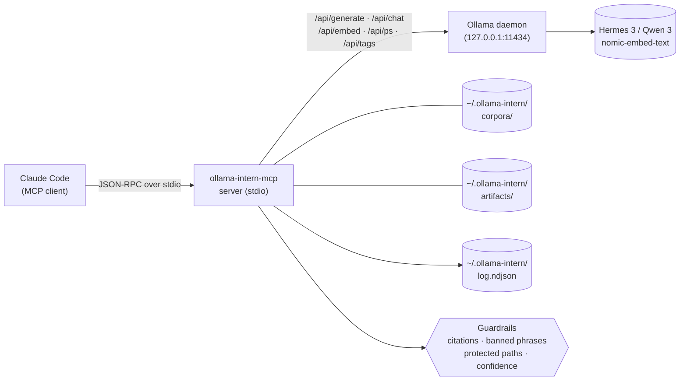

<p align="center">
  <a href="README.ja.md">日本語</a> | <a href="README.zh.md">中文</a> | <a href="README.es.md">Español</a> | <a href="README.fr.md">Français</a> | <a href="README.hi.md">हिन्दी</a> | <a href="README.it.md">Italiano</a> | <a href="README.md">English</a>
</p>

<p align="center">
  
</p>

<p align="center">
  <a href="https://github.com/mcp-tool-shop-org/ollama-intern-mcp/actions"></a>
  <a href="LICENSE"></a>
  <a href="https://mcp-tool-shop-org.github.io/ollama-intern-mcp/"></a>
  <a href="https://mcp-tool-shop-org.github.io/ollama-intern-mcp/handbook/"></a>
</p>

> **O estagiário local do Claude Code.** <!-- TOOL_COUNT:start -->42<!-- TOOL_COUNT:end --> ferramentas em formato de tarefas, briefings com evidência em primeiro lugar, artefatos duráveis.

Um servidor MCP que dá ao Claude Code um **estagiário local** com regras, níveis, uma mesa e um arquivo de documentos. O Claude escolhe a _ferramenta_; a ferramenta escolhe o _nível_ (Instantâneo / Workhorse / Profundo / Embed); o nível grava um arquivo que você pode abrir na semana que vem.

**Também executa o [Hermes Agent](https://github.com/NousResearch/hermes-agent) em `hermes3:8b`** — validado de ponta a ponta em 2026-04-19. A escada padrão é `hermes3:8b`; `qwen3:*` é a via alternativa. Veja [Usando com Hermes](#use-with-hermes) abaixo.

**Requisitos de hardware:** ~6 GB de VRAM para `hermes3:8b`, ou ~16 GB de RAM para inferência em CPU. Veja [handbook/getting-started](https://mcp-tool-shop-org.github.io/ollama-intern-mcp/handbook/getting-started/#hardware-minimums) para a análise completa.

**Não está usando o Claude?** O diretório [`examples/`](./examples/) tem um cliente MCP mínimo em Node.js e Python que você pode iniciar via stdio. Veja também [handbook/with-hermes](https://mcp-tool-shop-org.github.io/ollama-intern-mcp/handbook/with-hermes/).

**Local primeiro** — zero saída de rede até você optar por isso. Sem telemetria. Nada "autônomo". Cada chamada mostra o que está fazendo. O roteamento opcional para o [Ollama Cloud](#ollama-cloud-optional) coloca modelos da classe 600B atrás das mesmas ferramentas quando o hardware local é o gargalo — com fallback automático para o local.

---

## Novidades na v2.7.0

**Roteamento opcional para o Ollama Cloud — nuvem como primário, local como fallback.** Opte ativando com uma chave + um flag e os níveis generativos são roteados para um modelo em nuvem da classe 600B; os embeddings permanecem locais; um disjuntor aciona o fallback para o seu perfil local em qualquer falha na nuvem. **Desligado por padrão — zero saída de rede a menos que você defina tanto `OLLAMA_API_KEY` quanto `OLLAMA_CLOUD_PRIMARY=1`.** Aditivo menor — chamadores anteriores à v2.7.0 (e qualquer pessoa que não opte) veem um comportamento byte a byte idêntico. Veja [Ollama Cloud (opcional)](#ollama-cloud-optional).

- **Nuvem como primário com uma rede de segurança.** Um `RoutingOllamaClient` tenta a nuvem primeiro e faz fallback para o perfil local em caso de timeout / 5xx / 429 / falha de rede. Chaves ruins (401/403) aparecem de forma visível através de um disjuntor persistente em vez de degradar silenciosamente para sempre; um id de modelo em nuvem descontinuado/com erro de digitação (404) também aparece.
- **Nunca um downgrade silencioso.** Cada envelope ganha `backend` (`cloud`|`local`), `degraded` e `degrade_reason` para você sempre saber quando recebeu o modelo local em vez do grande. Um evento NDJSON `backend_fallback` torna visível a taxa de fallback de nuvem→local em `ollama_log_tail`.
- **`ollama_doctor` reporta autenticação + acessibilidade da nuvem** como um bloco distinto; `ollama-intern-mcp doctor` mostra uma seção `Cloud (primário)`.
- O modelo de nuvem padrão é `minimax-m3:cloud`; sobrescreva por nível com `INTERN_CLOUD_MODEL` / `INTERN_CLOUD_DEEP_MODEL` (por exemplo, `deepseek-v3.1:671b`).

## Novidades na v2.6.0

Sobrescrita do orçamento de nível por chamada em `ollama_extract`. Aditivo menor — chamadores anteriores à v2.6.0 inalterados. Entrada detalhada em [CHANGELOG.md](./CHANGELOG.md).

- **`tier_budget_ms_override?: number` campo de schema em `ollama_extract`** (opcional, limitado a `[1, 600000]` ms). Quando presente, aplica a sobreposição a cada nível visitado pelo runner para que a maquinaria interna `runWithTimeoutAndFallback` em `src/guardrails/timeouts.ts:61` respeite o orçamento fornecido pelo operador em vez do padrão do perfil. A cascata (workhorse → instant em timeout) ainda dispara; a sobreposição governa cada salto da cascata uniformemente.
- **Por que isso existe.** O wrapper R-018 do research-os (v0.12.1) envolveu o `callTool` do MCP com `Promise.race` e descobriu que o orçamento do wrapper não chegava ao nível interno — `DEV_RTX5080_TIMEOUTS.instant = 15_000` continuava disparando `TIER_TIMEOUT` em 15000ms independentemente de um orçamento de 180000ms no wrapper. A v2.6.0 fornece o orçamento autoritativo do lado do MCP para que a flag `--planner-timeout-ms` (research-os) finalmente controle os timeouts do nível interno conforme projetado.
- **Comportamento padrão preservado.** Campo omitido = padrões do perfil governam de forma idêntica em bytes. Chamadores anteriores à v2.6.0 não veem nenhuma alteração.
- **Regex de causa de fallback do R-010 preservada.** A mensagem de erro `TIER_TIMEOUT` no servidor ainda casa com `/elapsed=(\d+)ms/` + `/budget=(\d+)ms/` para que a visibilidade do AI-advisor a jusante funcione tanto no caminho da sobreposição quanto no padrão.
- Consumido pelo research-os v0.13.0 (cabeamento cumulativo do cliente R-019 + R-020 + R-021) em uma versão coordenada multi-repo.

### Histórico — entregas da v2.4.0

Consulte [CHANGELOG.md](./CHANGELOG.md) e [docs/release-notes/v2.4.0.md](./docs/release-notes/v2.4.0.md) para a entrada completa da v2.4.0 (controle de `num_ctx` por nível no sistema de perfis).

## Novidades na v2.4.0

Controle de `num_ctx` (janela de contexto) por nível no sistema de perfis. Minor aditiva — chamadores da v2.3.0 inalterados. Entradas detalhadas em [CHANGELOG.md](./CHANGELOG.md) e [docs/release-notes/v2.4.0.md](./docs/release-notes/v2.4.0.md).

- **Mapa `TierConfig.num_ctx` (novo)** — opcional `{ instant?, workhorse?, deep?, embed? }` no perfil. Quando definido para um nível, o servidor MCP coloca `options.num_ctx = <valor>` em toda requisição generate/chat do Ollama roteada para esse nível (inicial + fallback). Quando não definido, a requisição omite `num_ctx` inteiramente para que o Ollama use o padrão carregado pelo modelo — comportamento da v2.3.0 preservado exatamente.
- **Novo campo de envelope `num_ctx_used?: number`** — presente apenas quando o servidor MCP de fato enviou `num_ctx`. Ausente quando a requisição deixou o Ollama escolher. Não infira um padrão — o servidor MCP não consulta o Ollama para obter o valor efetivo.
- **Padrões de perfil**: `dev-rtx5080` / `dev-rtx5080-qwen3` são fornecidos com `instant: 4096`, `workhorse: 8192`, `deep`/`embed` NÃO DEFINIDOS. Dimensionados para manter `hermes3:8b` residente no orçamento de 16GB de VRAM da RTX 5080 para ferramentas rápidas. `m5-max` deixa todos os níveis NÃO DEFINIDOS — 128GB de memória unificada não têm problema de derramamento.
- **Fecha o diagnóstico da Fase 1 da v0.8.0** — `hermes3:8b` no contexto padrão de 32K na RTX 5080 derramou para a CPU e começou a causar timeout nas chamadas `ollama_extract` do nível workhorse. A v2.4.0 previne isso na camada de perfil.

### Controle de `num_ctx` por nível (novo na v2.4.0)

Perfil (excerto de `src/profiles.ts`):

```ts
"dev-rtx5080": {
  tiers: {
    instant: "hermes3:8b",
    workhorse: "hermes3:8b",
    deep: "hermes3:8b",
    embed: "nomic-embed-text",
    num_ctx: {
      instant: 4096,    // fast classify/summarize
      workhorse: 8192,  // schema-bound extract / batch
      // deep: UNSET — long-context briefs keep current behavior
      // embed: UNSET — no context-window pressure on embed
    },
  },
  // ... timeouts, prewarm
}
```

Envelope em uma chamada de nível workhorse (ex.: `ollama_extract`):

```jsonc
{
  "result": { /* extracted data */ },
  "tier_used": "workhorse",
  "model": "hermes3:8b",
  "num_ctx_used": 8192,        // present because the profile set workhorse=8192
  // ... rest of envelope unchanged
}
```

Em `m5-max` (ou qualquer perfil que deixa um nível não definido), `num_ctx_used` está ausente do envelope e a requisição de fio para o Ollama não inclui o campo `num_ctx` — o Ollama usa seu padrão carregado pelo modelo.

Operadores ajustam selecionando / editando o perfil; não há entrada de `num_ctx` por chamada nos schemas de ferramentas. Se uma chamada futura levantar a necessidade, o padrão segue a sobreposição de `model` da v2.3.0.

### Histórico — entregas da v2.3.0

Consulte [CHANGELOG.md](./CHANGELOG.md) e [docs/release-notes/v2.3.0.md](./docs/release-notes/v2.3.0.md) para a entrada completa da v2.3.0 (sobreposição de modelo por chamada).

## Novidades na v2.3.0

Substituição de modelo por chamada nas ferramentas de átomos com suporte a LLM. Aditiva menor — chamadores da v2.2.0 inalterados. Entradas detalhadas em [CHANGELOG.md](./CHANGELOG.md) e [docs/release-notes/v2.3.0.md](./docs/release-notes/v2.3.0.md).

- **Entrada opcional `model: string` em 8 ferramentas de átomos** — `ollama_extract`, `ollama_classify`, `ollama_summarize_fast`, `ollama_summarize_deep`, `ollama_research`, `ollama_corpus_answer`, `ollama_chat`, `ollama_code_citation`. A primeira tentativa no nível da ferramenta é executada com o modelo especificado pelo chamador; em caso de timeout, a cascata `TIER_FALLBACK` existente resolve o modelo do nível mais barato (NÃO a substituição do chamador). Ferramentas compostas/de brief/de pack deliberadamente NÃO aceitam `model` — átomos obtêm controle por chamada, compostos usam padrões de nível.
- **Novo campo no envelope `model_requested?: string`** — presente apenas quando a substituição foi fornecida. Chamadores cientes de calibração comparam `model_requested` vs `model` para detectar substituição por fallback: `if (env.model_requested && env.model !== env.model_requested) { /* substitution */ }`. Entradas vazias ou apenas com espaços em branco lançam `ZodError` no parse do schema, não passagem silenciosa.
- **Correção de bug — drift em `src/version.ts`.** A constante `VERSION` em tempo de execução agora é lida de `package.json` no carregamento do módulo; v2.1.0 e v2.2.0 foram lançadas reportando a string de identidade obsoleta `"2.0.0"`. Novo `tests/version.test.ts` trava `VERSION === pkg.version`.

### Substituição de modelo por chamada (novo na v2.3.0)

```jsonc
{
  "tool": "ollama_classify",
  "arguments": {
    "text": "patch null pointer in auth",
    "labels": ["feat", "fix", "chore"],
    "frame": "what is the change kind?",
    "model": "hermes3:8b"
  }
}
```

Envelope:

```jsonc
{
  "result": { "label": "fix", "confidence": 0.9, "off_topic": false, ... },
  "tier_used": "instant",
  "model": "hermes3:8b",
  "model_requested": "hermes3:8b",       // present because override was supplied
  // ... rest of envelope unchanged
}
```

Se o nível workhorse/deep tivesse sofrido timeout e a chamada tivesse cascateado para o nível instant, `env.model` seria o modelo resolvido do nível instant e `env.fallback_from` seria `"workhorse"` — `env.model_requested` ainda seria `"hermes3:8b"`, e `env.model !== env.model_requested` é o sinal de substituição. A substituição é deliberadamente NÃO carregada para o nível mais barato; o modelo escolhido pode não se adequar ao papel daquele nível.

### Histórico — entregas da v2.2.0

Veja [CHANGELOG.md](./CHANGELOG.md) e [docs/release-notes/v2.2.0.md](./docs/release-notes/v2.2.0.md) para a entrada completa da v2.2.0 (topicalidade vinculada a frame + abstenção estruturada).

## Novo na v2.2.0

Contrato de papel do worker de evidência local: topicalidade vinculada a frame e abstenção estruturada. Aditiva menor — chamadores da v2.1.0 inalterados. Entradas detalhadas em [CHANGELOG.md](./CHANGELOG.md) e [docs/release-notes/v2.2.0.md](./docs/release-notes/v2.2.0.md).

- **Extração vinculada a frame** em `ollama_extract`, `ollama_classify`, `ollama_summarize_fast`, `ollama_summarize_deep` — entrada opcional `frame: string` + saídas estruturadas `frame_alignment` / `on_topic` / `frame_addressed`. Fontes fora do tópico são sinalizadas em vez de parafraseadas para o schema.
- **Abstenção estruturada** em `ollama_research` — campos `weak` / `abstained` / `sources_address_question`. `citations[]` vazio com `answer` não vazio não é mais sucesso silencioso.
- **Limiar de topicalidade** em `ollama_corpus_answer` — `min_top_score` opcional. Abaixo do piso, a ferramenta interrompe com `abstained: true` e pula a síntese. `score` por citação agora visível em cada citação.
- **Preservação do score de recuperação** através da evidência de brief — `corpusHitsToEvidence` carrega `score` (e o knob `corpus_min_evidence_score` filtra no momento da montagem em `incident_brief` / `repo_brief` / `change_brief`).
- **Limites de intervalo de linha de citação** — `guardrails/citations.ts` rejeita intervalos fora dos limites em `ollama_research`, correspondendo à postura existente em `ollama_code_citation`.
- **Documentos de contrato do operador corrigidos** — correção de `chunk_id`/`chunk_index` no README, "validado no servidor" reescrito, seção Leis da Evidência qualificada, slogan de marketing anotado.

### Regressão de seed — a verificação

O contrato do slice é verificado contra a falha literal de research-os fresh-pack: arxiv 2112.10422 (Cosmological Standard Timers) sob a moldura da seção 01 *"O que significa custódia de evidência em fluxos de trabalho de pesquisa profunda com LLM local-first vs nuvem?"* — 9 / 9 testes de contrato LLM simulados confirmam que a fonte fora do tópico agora está contida (`frame_alignment.on_topic = false` na extração; `off_topic: true` na classificação; `frame_addressed: false` em summarize_deep; `abstained: true` em corpus_answer com `min_top_score` definido).

### Histórico — entregas da v2.1.0

Consulte [CHANGELOG.md](./CHANGELOG.md) para a entrada completa da v2.1.0 (passagem de recursos: 13 novas ferramentas + 4 melhorias + levantamento de congelamento).

---

## Arquitetura em um relance



Cada chamada de ferramenta do Claude entra no servidor MCP via stdio JSON-RPC. O servidor valida a chamada contra o esquema [zod](https://zod.dev) da ferramenta, executa as barreiras de proteção configuradas (validação de citação, remoção de frases proibidas, imposição de caminhos protegidos, limiares de confiança) e, em seguida, encaminha para um renderizador determinístico (nível de artefato) ou uma chamada HTTP do Ollama (todos os outros níveis). O daemon do Ollama nunca vê caminhos fornecidos pelo usuário — apenas o nível do modelo e o prompt preparado. Cada chamada anexa um evento estruturado ao log NDJSON em `~/.ollama-intern/log.ndjson`, onde `ollama_log_tail` e seu shell podem lê-lo.

---

## Exemplo principal — uma chamada, um artefato

```jsonc
// Claude → ollama-intern-mcp
{
  "tool": "ollama_incident_pack",
  "arguments": {
    "title": "sprite pipeline 5 AM paging regression",
    "logs": "[2026-04-16 05:07] worker-3 OOM killed\n[2026-04-16 05:07] ollama /api/ps reports evicted=true size=8.1GB\n...",
    "source_paths": ["F:/AI/sprite-foundry/src/worker.ts", "memory/sprite-foundry-visual-mastery.md"]
  }
}
```

Retorna um envelope apontando para um arquivo em disco:

```jsonc
{
  "result": {
    "pack": "incident",
    "slug": "2026-04-16-sprite-pipeline-5-am-paging-regression",
    "artifact_md":   "~/.ollama-intern/artifacts/incident/2026-04-16-sprite-pipeline-5-am-paging-regression.md",
    "artifact_json": "~/.ollama-intern/artifacts/incident/2026-04-16-sprite-pipeline-5-am-paging-regression.json",
    "weak": false,
    "evidence_count": 6,
    "next_checks": ["residency.evicted across last 24h", "OLLAMA_MAX_LOADED_MODELS vs loaded size"]
  },
  "tier_used": "deep",
  "model": "hermes3:8b",
  "hardware_profile": "dev-rtx5080",
  "tokens_in": 4180, "tokens_out": 612,
  "elapsed_ms": 8410,
  "residency": { "in_vram": true, "evicted": false }
}
```

→ `weak: false` significa que ≥2 itens de evidência foram reunidos; NÃO significa que as hipóteses foram avaliadas. Veja [Leis da evidência](#leis-da-evidência) abaixo.

Esse arquivo markdown é a saída da mesa do estagiário — títulos, bloco de evidência com ids citados, `next_checks` investigativos, banner `weak: true` se a evidência for escassa. É determinístico: o renderizador é código, não um prompt. (O renderizador é determinístico; o *conteúdo* das hipóteses e superfícies é generativo — leia-os como rascunho, não como verificado.) Abra-o amanhã, compare na próxima semana, exporte-o para um manual com `ollama_artifact_export_to_path`.

Cada concorrente nesta categoria lidera com "economize tokens." Nós lideramos com _aqui está o arquivo que o estagiário escreveu._

### Segundo exemplo — construa um corpus e depois pergunte a ele

```jsonc
// 1. Build a persistent, searchable corpus over your project.
{ "tool": "ollama_corpus_index",
  "arguments": { "name": "sprite-foundry",
                 "paths": ["F:/AI/sprite-foundry/src"],
                 "embed_model": "nomic-embed-text" } }
// → { chunks_written: 1204, paths_indexed: 312, failed_paths: [] }

// 2. Ask an evidence-bound question against it.
{ "tool": "ollama_corpus_answer",
  "arguments": { "name": "sprite-foundry",
                 "query": "how does the worker handle OOM eviction?",
                 "top_k": 8 } }
// → { answer: "...", citations: [{chunk_index, path}...], weak: false }
```

O servidor valida a identidade da citação e que cada `chunk_index` está no intervalo dos acertos recuperados. NÃO prova que cada afirmação gerada é semanticamente suportada pelo conteúdo do trecho citado — essa é a responsabilidade do modelo, e uma recuperação fraca ainda pode produzir respostas com formato de citação. Tutorial completo em [handbook/corpora](https://mcp-tool-shop-org.github.io/ollama-intern-mcp/handbook/corpora/).

---

## Extração vinculada à moldura (novo na v2.2.0)

`ollama_extract`, `ollama_classify`, `ollama_summarize_fast` e `ollama_summarize_deep` aceitam uma entrada opcional `frame: string`. A moldura nomeia a pergunta que a fonte está sendo solicitada a responder; o modelo é instruído a se abster em vez de emitir conteúdo verdadeiro, mas fora do tópico, quando a fonte não aborda a moldura.

```jsonc
{
  "tool": "ollama_extract",
  "arguments": {
    "text": "<long source document>",
    "schema": { /* your fields */ },
    "frame": "section purpose here — e.g. 'OOM eviction behavior in the sprite worker'"
  }
}
// → result includes frame_alignment: { on_topic: boolean, reason: string, unaddressed_aspects: string[] }
```

Se `frame` for omitido, o comportamento permanece inalterado em relação à v2.1.0. Quando fornecida, `frame_alignment.on_topic = false` sinaliza que os campos extraídos podem ser verdadeiros-com-relação-à-fonte, mas não relevantes para a moldura — trate isso como a mesma forma de um brief `weak: true`: útil, mas verifique pontualmente antes de promover para evidência downstream.

---

## Contrato de abstenção (novo na v2.2.0)

`ollama_research` retorna campos estruturados de abstenção: `weak: boolean`, `abstained: boolean`, `sources_address_question: boolean | null`. Um `citations[]` vazio com um `answer` não vazio não é mais silencioso — `abstained: true` indica que o modelo se recusou a sintetizar porque os caminhos fornecidos pelo chamador não abordaram a pergunta. Trate a abstenção como um sucesso, não como uma falha: é a ferramenta se recusando a maquiar uma recuperação fraca em saída autoritativa.

`ollama_corpus_answer` aceita um limite opcional de topicalidade `min_top_score: number` (0.0–1.0). Quando a pontuação máxima de recuperação para uma consulta fica abaixo de `min_top_score`, a ferramenta faz curto-circuito com `abstained: true` e pula a síntese — prevenindo o modo de falha "5 trechos fora do tópico com pontuação 0.21 ainda conduzem uma resposta completa" que a regra `weak: true` da v2.1.0 não pegava (`weak: true` só disparava em `hits.length < 2`). Combine isso com o campo `score` por citação, recém-exposto em cada citação, para auditar a qualidade da recuperação diretamente a partir do envelope.

---

## O que está aqui — quatro camadas, <!-- TOOL_COUNT:start -->42<!-- TOOL_COUNT:end --> ferramentas

**Em formato de trabalho** significa que cada ferramenta nomeia um trabalho que você entregaria a um estagiário — classifique isso, extraia aquilo, faça a triagem desses logs, rascunhe essa nota de release, empacote esse incidente. A entrada da ferramenta é a especificação do trabalho; a saída é o entregável. Nenhuma primitiva genérica `run_model` / `chat_with_llm` no topo.

| Camada | Contagem | O que vive aqui |
|---|---|---|
| **Atoms** | 28 | Primitivas em formato de trabalho. **Originais 15:** `classify`, `extract`, `triage_logs`, `summarize_fast` / `deep`, `draft`, `research`, `corpus_search` / `answer` / `index` / `refresh` / `list`, `embed_search`, `embed`, `chat`. **+13 adicionados na v2.1.0:** `doctor`, `log_tail`, `batch_proof_check` (ops); `code_map`, `code_citation`, `multi_file_refactor_propose`, `refactor_plan` (refatoração); `artifact_prune`, `hypothesis_drill` (artefato/brief); `corpus_health`, `corpus_amend`, `corpus_amend_history`, `corpus_rerank` (corpus). Átomos com capacidade de lote (`classify`, `extract`, `triage_logs`) aceitam `items: [{id, text}]`. |
| **Briefs** | 3 | Briefs estruturados de operação com evidência. `incident_brief`, `repo_brief`, `change_brief`. Cada afirmação cita um id de evidência; desconhecidos são removidos no servidor. Evidência fraca exibe `weak: true` em vez de narrativa falsa. |
| **Packs** | 3 | Trabalhos compostos de pipeline fixo que escrevem markdown + JSON duráveis em `~/.ollama-intern/artifacts/`. `incident_pack`, `repo_pack`, `change_pack`. Renderizadores determinísticos — nenhuma chamada de modelo no formato do artefato. |
| **Artifacts** | 7 | Superfície de continuidade sobre saídas de pack. `artifact_list` / `read` / `diff` / `export_to_path`, mais três snippets determinísticos: `incident_note`, `onboarding_section`, `release_note`. |

Total: **28 átomos + 3 briefs + 3 packs + 7 ferramentas de artefato = <!-- TOOL_COUNT:start -->42<!-- TOOL_COUNT:end -->**.

Linhas de congelamento:
- Átomos: congelamento **removido na v2.1.0** (28 hoje; +13 adicionados na passagem de recursos da v2.1.0). Novos átomos ainda exigem uma lacuna justificada por auditoria, testes, página do handbook e entrada no CHANGELOG — sem adições casuais.
- Packs congelados em 3. Sem novos tipos de pack.
- Camada de artefato congelada em 7.

A referência completa de ferramentas vive no [handbook](https://mcp-tool-shop-org.github.io/ollama-intern-mcp/handbook/tools/).

---

## Instalação

Requer o [Ollama](https://ollama.com) rodando localmente e os modelos das camadas baixados (veja [Baixar modelos](#model-pulls) abaixo).

### Claude Code (recomendado)

A maioria dos usuários instala isso adicionando-o à configuração de servidor MCP do Claude Code — sem necessidade de instalação global. O Claude Code executa o servidor sob demanda via `npx`:

```json
{
  "mcpServers": {
    "ollama-intern": {
      "command": "npx",
      "args": ["-y", "ollama-intern-mcp"],
      "env": {
        "OLLAMA_HOST": "http://127.0.0.1:11434",
        "INTERN_PROFILE": "dev-rtx5080"
      }
    }
  }
}
```

### Claude Desktop

O mesmo bloco, escrito em `~/Library/Application Support/Claude/claude_desktop_config.json` (macOS) ou `%APPDATA%\Claude\claude_desktop_config.json` (Windows).

### Instalação global (avançado)

Necessário apenas se você quiser o binário no seu `PATH` para uso ad-hoc fora do Claude Code:

```bash
npm install -g ollama-intern-mcp
```

### Uso com Hermes

Este MCP foi validado de ponta a ponta com o [Hermes Agent](https://github.com/NousResearch/hermes-agent) contra o `hermes3:8b` no Ollama (2026-04-19). O Hermes é um agente externo que *chama* a superfície de primitivos congelada deste MCP — ele faz o planejamento, nós fazemos o trabalho.

Configuração de referência ([hermes.config.example.yaml](hermes.config.example.yaml) neste repositório):

```yaml
model:
  provider: custom
  base_url: http://localhost:11434/v1
  default: hermes3:8b
  context_length: 65536    # Hermes requires 64K floor under model.*

providers:
  local-ollama:
    name: local-ollama
    base_url: http://localhost:11434/v1
    api_mode: openai_chat
    api_key: ollama
    model: hermes3:8b

mcp_servers:
  ollama-intern:
    command: npx
    args: ["-y", "ollama-intern-mcp"]
    env:
      OLLAMA_HOST: http://localhost:11434
      INTERN_PROFILE: dev-rtx5080
      # hermes3:8b is the default ladder in v2.0.0, so tier overrides are
      # only needed if you're pinning a different local model.
```

**O formato do prompt importa.** Prompts imperativos de invocação de ferramentas ("Chame X com args …") são o teste de integração — eles fornecem a um modelo local de 8B estrutura suficiente para emitir `tool_calls` limpos. Prompts de múltiplas tarefas em formato de lista ("faça A, depois B, depois C") são benchmarks de capacidade para modelos maiores; não interprete uma falha em formato de lista no 8B como "a fiação está quebrada". Veja [handbook/with-hermes](https://mcp-tool-shop-org.github.io/ollama-intern-mcp/handbook/with-hermes/) para o passo a passo completo de integração + ressalvas de transporte conhecidas (Ollama `/v1` streaming + shim openai-SDK não-streaming).

### Download de modelos

**Perfil de desenvolvimento padrão (RTX 5080 16GB e similares):**

```bash
ollama pull hermes3:8b
ollama pull nomic-embed-text
export OLLAMA_MAX_LOADED_MODELS=2
export OLLAMA_KEEP_ALIVE=-1
```

**Trilho alternativo do Qwen 3 (mesmo hardware, para ferramentas Qwen):**

```bash
ollama pull qwen3:8b
ollama pull qwen3:14b
ollama pull nomic-embed-text
export INTERN_PROFILE=dev-rtx5080-qwen3
```

**Perfil M5 Max (128GB unificada):**

```bash
ollama pull qwen3:14b
ollama pull qwen3:32b
ollama pull nomic-embed-text
export INTERN_PROFILE=m5-max
```

As variáveis de ambiente por nível (`INTERN_TIER_INSTANT`, `INTERN_TIER_WORKHORSE`, `INTERN_TIER_DEEP`, `INTERN_EMBED_MODEL`) ainda substituem as escolhas do perfil para casos pontuais.

---

## Envelope uniforme

Toda ferramenta retorna o mesmo formato:

```ts
{
  result: <tool-specific>,
  tier_used: "instant" | "workhorse" | "deep" | "embed",
  model: string,
  hardware_profile: string,     // "dev-rtx5080" | "dev-rtx5080-qwen3" | "m5-max"
  tokens_in: number,
  tokens_out: number,
  elapsed_ms: number,
  residency: {
    in_vram: boolean,
    size_bytes: number,
    size_vram_bytes: number,
    evicted: boolean
  } | null
}
```

`residency` vem de `/api/ps` do Ollama. Quando `evicted: true` ou `size_vram < size`, o modelo foi paginado para disco e a inferência caiu 5–10× — comunique isso ao usuário para que ele saiba que precisa reiniciar o Ollama ou reduzir a contagem de modelos carregados.

No modo [Ollama Cloud](#ollama-cloud-optional), o envelope também carrega `backend` (`"cloud"` | `"local"`) e, em um fallback de cloud→local, `degraded: true` + `degrade_reason`. Esses campos estão **ausentes** no caminho padrão somente local, então os consumidores existentes não são afetados. `residency` é `null` para chamadas servidas pela cloud (a cloud sem estado não tem residência de VRAM local).

Cada chamada é registrada como uma linha NDJSON em `~/.ollama-intern/log.ndjson`. Filtre por `hardware_profile` para manter os números de desenvolvimento fora de benchmarks publicáveis.

---

## Perfis de hardware

| Perfil | Instant | Workhorse | Deep | Embed |
|---|---|---|---|---|
| **`dev-rtx5080`** (padrão) | hermes3 8B | hermes3 8B | hermes3 8B | nomic-embed-text |
| `dev-rtx5080-qwen3` | qwen3 8B | qwen3 8B | qwen3 14B | nomic-embed-text |
| `m5-max` | qwen3 14B | qwen3 14B | qwen3 32B | nomic-embed-text |

O **dev padrão** colapsa todos os três níveis de trabalho no `hermes3:8b` — o caminho de integração validado do Hermes Agent. O mesmo modelo de cima a baixo significa que há uma coisa para baixar, um custo de residência, um conjunto de comportamentos para entender. Usuários que preferem o Qwen 3 (com sua infraestrutura `THINK_BY_SHAPE`) optam pelo `dev-rtx5080-qwen3`. O `m5-max` é a escada do Qwen 3 dimensionada para memória unificada.

---

## Ollama Cloud (opcional)

Modelos locais de 8B são o gargalo de hardware que a maioria das pessoas encontra. O [Ollama Cloud](https://ollama.com/cloud) serve modelos da classe 600B atrás da **mesma** superfície `/api/*`, então você pode rotear as ferramentas pesadas para um modelo muito mais forte e liberar VRAM local — mantendo o local como fallback sempre ativo.

**Isso é opt-in e está desligado por padrão.** O pacote permanece local-first com **zero egress** a menos que você defina *ambas* estas opções. Qualquer pessoa que não fizer a opção não é afetada.

```json
{
  "mcpServers": {
    "ollama-intern": {
      "command": "npx",
      "args": ["-y", "ollama-intern-mcp"],
      "env": {
        "OLLAMA_CLOUD_PRIMARY": "1",
        "OLLAMA_API_KEY": "sk-...your-key...",
        "INTERN_PROFILE": "dev-rtx5080"
      }
    }
  }
}
```

> **A chave é uma variável de ambiente de runtime, não um segredo de CI.** Um segredo do GitHub Actions só fica visível dentro das execuções de CI — ele nunca chega ao servidor em execução. Crie uma chave em [ollama.com/settings/keys](https://ollama.com/settings/keys) e coloque-a no bloco `env` do seu cliente MCP (ou no seu ambiente de shell).

**Como funciona o roteamento.** Quando o cloud está ativado, os tiers generativos (instant / workhorse / deep) vão para o modelo na nuvem; **as embeddings sempre permanecem locais** (Ollama Cloud não serve modelos de embedding, então as ferramentas corpus/embed não são afetadas). Um circuit breaker tenta primeiro a nuvem e recorre ao seu perfil local em caso de timeout / 5xx / 429 / erros de rede. Uma chave inválida (401/403) aciona um breaker *sticky* (persistente) que se manifesta de forma explícita em vez de degradar silenciosamente. O perfil local (`INTERN_PROFILE`) é a escada de fallback, portanto mantenha os seus modelos baixados.

**Você nunca é rebaixado silenciosamente.** Cada envelope informa qual backend atendeu à chamada:

```ts
{ ...envelope, backend: "cloud" | "local", degraded?: true, degrade_reason?: "cloud_timeout" | "cloud_5xx" | "cloud_rate_limited" | "cloud_unreachable" | "cloud_auth_failed" | "circuit_open" }
```

Uma linha `backend_fallback` é gravada em `~/.ollama-intern/log.ndjson` a cada fallback cloud→local (`ollama_log_tail --filter_kind backend_fallback`), e `ollama-intern-mcp doctor` mostra um bloco **Cloud (primary)** com status de acessibilidade + autenticação.

**Latência vs qualidade.** Modelos grandes na nuvem rodam muito mais lentos por token do que um 8B local (segundos, não milissegundos) — um upgrade de qualidade, não de velocidade. Os tiers na nuvem usam uma escada generosa de timeouts (instant 30s / workhorse 120s / deep 300s por padrão).

### Variáveis de ambiente da nuvem

| Var | Padrão | Propósito |
|---|---|---|
| `OLLAMA_CLOUD_PRIMARY` | _(não definida)_ | **O interruptor de opt-in.** `1`/`true`/`yes`/`on` ativa o cloud-primary. Não definida = somente local, zero egress. |
| `OLLAMA_API_KEY` | _(não definida)_ | Chave Bearer para Ollama Cloud. **Obrigatória** quando o cloud está ativado (falha imediata na inicialização se ausente). |
| `OLLAMA_CLOUD_HOST` | `https://ollama.com` | Host base da nuvem. |
| `INTERN_CLOUD_MODEL` | `minimax-m3:cloud` | Modelo na nuvem para instant + workhorse + deep. |
| `INTERN_CLOUD_DEEP_MODEL` | _(= `INTERN_CLOUD_MODEL`)_ | Override opcional apenas para o tier deep, ex. `deepseek-v3.1:671b`. |
| `INTERN_CLOUD_TIMEOUT_{INSTANT,WORKHORSE,DEEP}_MS` | `30000`/`120000`/`300000` | Timeouts por tentativa de nuvem, por tier. |
| `INTERN_CLOUD_NUM_CTX` | `32768` | Limite de janela de contexto para chamadas na nuvem (a nuvem cobra por tempo de GPU; o limite controla o custo). |

> **Disponibilidade de modelos muda.** Ollama periodicamente descontinua modelos na nuvem. `minimax-m3:cloud`, `deepseek-v3.1:671b`, `gpt-oss:120b` e `qwen3-coder:480b` são escolhas atuais; consulte [ollama.com/search?c=cloud](https://ollama.com/search?c=cloud) antes de fixar um id.

**Nota de privacidade.** O roteamento para o Ollama Cloud envia prompts a terceiros. A [política de privacidade](https://ollama.com/privacy) da Ollama afirma que os prompts na nuvem são processados de forma transitória, não retidos além da requisição, e não usados para treinamento — mas ainda assim é egress, por isso é opt-in e divulgado. O modo somente local (o padrão) não envia nada para fora da máquina.

---

## Leis de evidência

Estas são aplicadas no servidor, não no prompt:

- **Citações obrigatórias.** Cada afirmação breve cita um id de evidência.
- **Desconhecidos removidos no servidor.** Modelos que citam ids que não estão no pacote de evidência têm esses ids descartados com um aviso antes do resultado ser retornado.
- **Validado por ID, não por conteúdo.** O servidor verifica que cada `evidence_ref` citado aponta para um id de evidência real no conjunto montado. NÃO verifica se o texto da afirmação é derivável da evidência citada — isso é trabalho do modelo, e resumos fracos às vezes contêm afirmações sem suporte com refs válidas. Use `weak: true` + coverage_notes + o campo `excerpt` incluído para verificar.
- **Fraco é fraco.** Evidências esparsas sinalizam `weak: true` com notas de cobertura. Nunca suavizado em uma narrativa falsa.
- **Investigativo, não prescritivo.** Apenas `next_checks` / `read_next` / `likely_breakpoints`. Os prompts proíbem "aplique esta correção."
- **Renderizadores determinísticos.** A forma do markdown do artefato é código, não um prompt. `draft` permanece reservado para prosa onde a redação do modelo importa.
- **Apenas diffs do mesmo pacote.** `artifact_diff` entre pacotes é recusado de forma explícita; os payloads permanecem distintos.

---

## Artefatos e continuidade

Os pacotes gravam em `~/.ollama-intern/artifacts/{incident,repo,change}/<slug>.(md|json)`. A camada de artefatos oferece uma superfície de continuidade sem transformar isso em uma ferramenta de gerenciamento de arquivos:

- `artifact_list` — índice somente de metadados, filtrável por pacote, data, glob de slug
- `artifact_read` — leitura tipada por `{pack, slug}` ou `{json_path}`
- `artifact_diff` — comparação estruturada do mesmo pacote; inversão fraca sinalizada
- `artifact_export_to_path` — grava um artefato existente (com cabeçalho de proveniência) em um `allowed_roots` declarado pelo chamador. Recusa arquivos existentes a menos que `overwrite: true`.
- `artifact_incident_note_snippet` — fragmento de nota do operador
- `artifact_onboarding_section_snippet` — fragmento do manual
- `artifact_release_note_snippet` — fragmento de nota de release DRAFT

Nenhuma chamada de modelo nesta camada. Tudo é renderizado a partir do conteúdo armazenado.

---

## Modelo de ameaça e telemetria

**Dados acessados:** caminhos de arquivo que o chamador fornece explicitamente (`ollama_research`, ferramentas de corpus), texto inline e artefatos que o chamador solicita que sejam gravados em `~/.ollama-intern/artifacts/` ou em um `allowed_roots` declarado pelo chamador.

**Dados NÃO acessados:** nada fora de `source_paths` / `allowed_roots`. `..` é rejeitado antes da normalização. `artifact_export_to_path` recusa arquivos existentes a menos que `overwrite: true`. Rascunhos com destino a caminhos protegidos (`memory/`, `.claude/`, `docs/canon/`, etc.) exigem `confirm_write: true` explícito, aplicado no servidor.

**Egresso de rede:** **desligado por padrão.** Pronto para uso, o único tráfego de saída é para o endpoint HTTP local do Ollama — sem chamadas na nuvem, sem pings de atualização, sem relatórios de falhas. **Exceção opt-in:** se você habilitar o [Ollama Cloud](#ollama-cloud-opcional) (`OLLAMA_CLOUD_PRIMARY=1` + `OLLAMA_API_KEY`), os prompts para as camadas generativas são enviados para `ollama.com` via HTTPS com uma chave Bearer. Isso é explícito, divulgado e desativado a menos que você defina ambas as variáveis; os embeddings nunca saem da máquina. Veja [SECURITY.md](SECURITY.md) §11.

**Telemetria:** **nenhuma.** Cada chamada é registrada como uma linha NDJSON em `~/.ollama-intern/log.ndjson` na sua máquina. O próprio servidor não se conecta a lugar nenhum.

**Erros:** formato estruturado `{ code, message, hint, retryable }`. Stack traces nunca são expostos através dos resultados das ferramentas.

Política completa: [SECURITY.md](SECURITY.md).

---

## Padrões

Construído de acordo com o padrão [Shipcheck](https://github.com/mcp-tool-shop-org/shipcheck). Os gates rígidos A–D passam; veja [SHIP_GATE.md](SHIP_GATE.md) e [SCORECARD.md](SCORECARD.md).

- **A. Segurança** — SECURITY.md, modelo de ameaças, sem telemetria, segurança de caminhos, `confirm_write` em caminhos protegidos
- **B. Erros** — formato estruturado em todos os resultados das ferramentas; sem pilhas brutas
- **C. Documentação** — README atualizado, CHANGELOG, LICENSE; esquemas de ferramentas se autodocumentam
- **D. Higiene** — `npm run verify` (suite completa vitest), CI com varredura de dependências, Dependabot, lockfile, `engines.node`

---

## Roadmap (endurecimento, não expansão de escopo)

- **Fase 1 — Espinha de Delegação** ✓ lançada: superfície de átomos, envelope uniforme, roteamento em camadas, barreiras de proteção
- **Fase 2 — Espinha da Verdade** ✓ lançada: fragmentação de esquema v2, BM25 + RRF, corpora vivos, briefings com base em evidências, pacote de avaliação de recuperação
- **Fase 3 — Espinha de Pacote e Artefato** ✓ lançada: pacotes de pipeline fixo com artefatos duráveis + camada de continuidade
- **Fase 4 — Espinha de Adoção** ✓ v2.0.1: verificação de saúde em três etapas endureceu o corpus (TOCTOU, limite de arquivo de 50 MB, rejeição de links simbólicos, escritas atômicas, captura de falhas por arquivo), traversal de caminhos de ferramentas, observabilidade (eventos de espera de semáforo, contexto de erro de tempo limite, registro de substituição de env de perfil, sinal de partida a frio de preaquecimento), segurança de testes (instantâneo de env de carga de módulo em 10 arquivos, `tools/call` E2E). Manual de solução de problemas + requisitos mínimos de hardware adicionados para operadores.
- **Fase 5 — Benchmarks M5 Max** — números publicáveis assim que o hardware chegar (~2026-04-24)

Fase por camada de endurecimento. As camadas de pacote e artefato permanecem congeladas em 3 e 7. O congelamento de átomos foi suspenso na v2.1.0 — novos átomos requerem uma lacuna justificada por auditoria, testes, página do manual e entrada no CHANGELOG.

---

## Licença

MIT — veja [LICENSE](LICENSE).

---

<p align="center">Built by <a href="https://mcp-tool-shop.github.io/">MCP Tool Shop</a></p>
