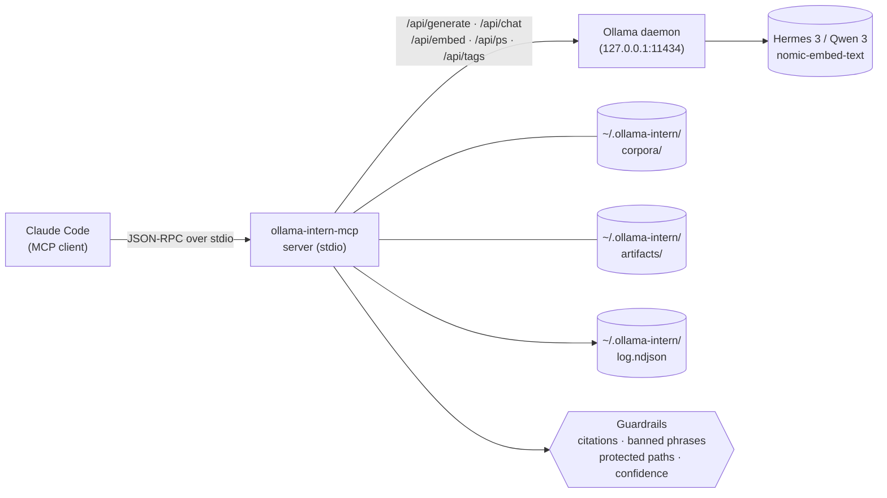

<p align="center">
  <a href="README.ja.md">日本語</a> | <a href="README.zh.md">中文</a> | <a href="README.es.md">Español</a> | <a href="README.fr.md">Français</a> | <a href="README.hi.md">हिन्दी</a> | <a href="README.it.md">Italiano</a> | <a href="README.md">English</a>
</p>

<p align="center">
  
</p>

<p align="center">
  <a href="https://github.com/mcp-tool-shop-org/ollama-intern-mcp/actions"></a>
  <a href="LICENSE"></a>
  <a href="https://mcp-tool-shop-org.github.io/ollama-intern-mcp/"></a>
  <a href="https://www.npmjs.com/package/ollama-intern-mcp"></a>
  <a href="https://mcp-tool-shop-org.github.io/ollama-intern-mcp/handbook/"></a>
  <a href="#ollama-cloud"></a>
</p>

> **O estagiário local para o Claude Code.** <!-- TOOL_COUNT:start -->44<!-- TOOL_COUNT:end --> ferramentas com funcionalidades específicas, resumos baseados em evidências, artefatos duradouros.

Um servidor MCP que fornece ao Claude Code um **estagiário local** com regras, níveis, uma mesa e um arquivo. O Claude seleciona a _ferramenta_; a ferramenta seleciona o _nível_ (Instantâneo / Robusto / Profundo / Incorporado); o nível cria um arquivo que você pode abrir na próxima semana.

**Também executa o [Hermes Agent](https://github.com/NousResearch/hermes-agent) em `hermes3:8b`** — validado de ponta a ponta em 19-04-2026. A escala padrão é `hermes3:8b`; `qwen3:*` é a trilha alternativa. Consulte [Uso com Hermes](#use-with-hermes) abaixo.

**Requisitos de hardware:** ~6 GB de VRAM para `hermes3:8b` ou ~16 GB de RAM para inferência na CPU. Consulte [handbook/getting-started](https://mcp-tool-shop-org.github.io/ollama-intern-mcp/handbook/getting-started/#hardware-minimums) para obter detalhes completos.

**Não está usando o Claude?** O diretório [`examples/`](./examples/) contém um cliente MCP mínimo em Node.js e Python que você pode executar via stdio. Consulte também [handbook/with-hermes](https://mcp-tool-shop-org.github.io/ollama-intern-mcp/handbook/with-hermes/).

**Prioridade local** — emissão de dados de rede zero até que você opte por ativar. Sem telemetria. Sem nada "autônomo". Cada chamada mostra seu processo.

**Não tem GPU potente o suficiente? O [Ollama Cloud](#ollama-cloud) executa todas as <!-- TOOL_COUNT:start -->44<!-- TOOL_COUNT:end --> ferramentas em modelos de classe 600B.** A maioria das pessoas não consegue hospedar um modelo de ponta em seu próprio hardware — esse é o verdadeiro limite da IA local, e é o que isso supera. A mesma superfície `/api/*`, as mesmas ferramentas com funcionalidades específicas, os mesmos envelopes; as incorporações permanecem locais; qualquer falha na nuvem retorna automaticamente para o seu perfil local. Aumente **uma** chamada (`backend: "cloud"`) ou direcione todas as chamadas generativas (`OLLAMA_CLOUD_PRIMARY=1`) — e cada envelope informa qual backend realmente a atendeu. Desativado até que você defina uma chave.

---

## Novo na v2.10.0

**O lançamento da honestidade na nuvem.** A v2.9.0 implementou o aumento de escala na nuvem por chamada e este README anunciou "aumente uma análise de alto risco para um modelo de 600B" — mas a entrada `backend` existia em exatamente **uma** das 44 ferramentas, e era `ollama_chat`, que sua própria descrição chama de último recurso. Cada tarefa de análise foi fixada em um 8B local. A prioridade local permanece inalterada: nenhuma chave ainda significa emissão de dados zero e nenhum teste de inicialização, as incorporações nunca saem da caixa e cada novo parâmetro assume o comportamento de hoje por padrão.

- **O aumento de escala por chamada agora atinge 15 ferramentas, não 1.** `backend: "cloud"` é uma entrada opcional em `research`, `summarize_deep`, `code_review`, `code_citation`, `corpus_answer`, `hypothesis_drill`, `multi_file_refactor_propose`, `refactor_plan`, todos os três resumos, todos os três pacotes e `chat`. Omita-o e o comportamento será idêntico ao da v2.9.x. **Os pacotes aumentam apenas sua etapa de síntese** — a montagem de evidências, a triagem e a gravação de artefatos permanecem locais — e rejeitam um aumento de escala não atendível *antes* de realizar qualquer trabalho local.
- **`INTERN_CLOUD_STANDBY_TIERS` — declare a política uma vez.** Especifique quais níveis (`instant|workhorse|deep`) aumentam a escala em modo de espera sem uma diretiva por chamada. Vazio por padrão. Uma diretiva `backend` por chamada ainda tem precedência em ambas as direções. `embed` é rejeitado no carregamento da configuração *e* na camada de roteamento: as incorporações sempre permanecem locais.
- **`doctor --cloud-check` — prove que a chave realmente funciona.** O teste antigo atingia `/api/tags`, que retorna 200 para uma chave inválida, então a autenticação só podia ler "não verificado". Isso executa uma geração de 8 tokens e retorna `ok` / `failed` / `unverified` / `unreachable` — quatro estados mantidos distintos propositalmente, porque um erro 404 em um ID de modelo não é um problema de chave e não deve levá-lo a procurar uma. Ele também relata cada ID de nuvem configurado como presente ou NÃO NO CATÁLOGO com uma sugestão de ID ativo mais próximo, para que um ID desativado seja encontrado antes que você pague por uma chamada degradada.
- **Corrigido: `init` estava quebrado em cada instalação do npm.** `hermes.config.example.yaml` nunca foi incluído no tarball publicado, então o binário relatava seu próprio erro de "bug de empacotamento" para qualquer pessoa que instalasse do npm. Agora ele é incluído, e o CI instala e executa o tarball empacotado para que não possa regredir.
- **As pontuações de recuperação finalmente são comparáveis.** `CorpusHit.score` continha quatro escalas incomparáveis em um único campo — o modo híbrido padrão atingia o máximo de `0.0328`, enquanto `corpus_min_evidence_score` era documentado como "0–1", então um limite natural de `0.1` silenciava cada fragmento do corpus. As pontuações mescladas são redimensionadas para 0–1 e cada resultado contém `score_scale`.

Detalhes completos em [CHANGELOG.md](./CHANGELOG.md).

## Novo na v2.9.0

**O lançamento dos recursos da nuvem — uma faixa de verificação entre famílias, aumento de escala na nuvem sob demanda e a economia para vê-lo.** A prioridade local permanece inalterada: sem nenhuma chave definida, o comportamento é idêntico ao da v2.8.0 (emissão de dados zero, sem teste de nuvem de inicialização).

- **`ollama_verify_claims` — verificação entre diferentes modelos.** `ollama_code_review` *gera* resultados; isso *valida* esses resultados. Executa um painel de referência do Ollama Cloud (deepseek / kimi / glm por padrão) em seus dados + evidências e retorna, para cada dado, CONFIRMADO / REFUTADO / PRECISA_DE_REVISÃO. A agregação segue a regra de que uma única discordância não define o resultado (≥2 para refutar, ≥2 para confirmar), cada avaliador é verificado com base no modelo utilizado (um modelo local de fallback ou substituído é excluído e não é contabilizado), e os dados de entrada são estruturados de forma a remover qualquer raciocínio. O limite de honestidade é documentado: um resultado CONFIRMADO é uma evidência de suporte, não uma prova — confiável para identificar erros graves, mas menos eficaz em erros sutis de um modelo de ponta.
- **Escalonamento na nuvem por chamada + modo de espera.** Defina `OLLAMA_API_KEY` *sozinho* (sem `OLLAMA_CLOUD_PRIMARY`) e você estará em **modo de espera**: primário local, sem envio de dados, sem sonda de inicialização — até que uma única chamada opte por usar `backend:'cloud'`. Escalone uma revisão de alta importância para um modelo de 600B sem alterar todas as chamadas para a nuvem. O primeiro escalonamento divulga o envio de dados de forma clara no momento em que ocorre; uma substituição `model` por chamada agora acompanha a tentativa na nuvem de forma literal.
- **`ollama_log_stats` — a economia mensurável que a promessa do slogan oferece.** Um resumo sem LLM de seus recibos NDJSON: divisão nuvem/local, taxa de fallback da nuvem para o local, tokens por ferramenta, p50/p95 de latência, limitado por uma janela `since`.
- **Ferramenta de diagnóstico para CI + ferramentas legíveis por máquina.** `doctor --json --fail-unhealthy` fornece aos pipelines um portão real (com uma flag `healthy` que considera a nuvem), e cada ferramenta agora carrega anotações MCP `readOnlyHint`/`destructiveHint`/`title` para que os clientes obtenham a permissão correta na interface do usuário. Além disso, `init --claude` cria um modelo pronto para ser colado em `.mcp.json`.

Detalhes completos em [CHANGELOG.md](./CHANGELOG.md).

## Novo na v2.8.0

**Confiabilidade, durabilidade e segurança aprimoradas — 25 correções, cada uma testada primeiro e verificada entre diferentes modelos.** O comportamento padrão local permanece inalterado e nenhum contrato de ferramenta foi removido; os chamadores existentes continuam funcionando. As melhorias são significativas:

- **Não há mais perda silenciosa de dados do corpus.** Um erro de leitura transitório durante `ollama_corpus_refresh` (um bloqueio de arquivo do Windows, uma retenção de antivírus, uma janela de salvamento de um editor) costumava classificar o arquivo como "ausente" e **excluir permanentemente seu conteúdo indexado**. Agora, apenas um arquivo genuinamente ausente é descartado; um erro transitório mantém o caminho, marca-o para uma nova tentativa e preserva seus fragmentos.
- **Concorrência que respeita seus limites.** Um tempo limite de nível agora pode cancelar uma chamada que ainda está na fila para obter uma permissão (anteriormente, ela ficava pendurada por muito tempo, mesmo que os recibos indicassem o contrário), e `ollama_chat` finalmente roteia através da barreira de tempo limite/nível — para que uma geração local travada não paralise todas as ferramentas e, na verdade, alcance a nuvem no modo primário da nuvem.
- **Nuvem que se degrada em vez de falhar.** Um ID de modelo de nuvem desativado agora retorna ao local com uma razão clara `cloud_model_missing` e uma dica específica da nuvem, em vez de uma falha total; o disjuntor não pode travar permanentemente; um modelo persistentemente ausente deixa de pagar uma viagem de ida e volta à nuvem em cada chamada.
- **Superfície de segurança que corresponde à sua documentação.** `ollama_batch_proof_check` agora realmente aplica o confinamento do diretório de trabalho atual (com uma nova restrição de ambiente do operador `INTERN_BATCH_PROOF_ALLOWED_ROOTS` que um chamador não pode ampliar), os sanitizadores de injeção de prompt ganharam cobertura + um limite honestamente divulgado, e o protetor de caminho protegido não diferencia maiúsculas de minúsculas no macOS.
- **Artefatos e recibos honestos.** As gravações de pacotes são atômicas e nunca silenciam erros; os envelopes de lote degradados relatam o nível realmente usado; o detector de gravação interrompida detecta gravações incompletas em qualquer mutação; os IDs de fragmento não entram mais em conflito entre arquivos com conteúdo idêntico. A auditoria de dependências é totalmente clara (0 vulnerabilidades).

Detalhes completos em [CHANGELOG.md](./CHANGELOG.md).

## Novo na v2.7.0

**Roteamento opcional para o Ollama Cloud — primário na nuvem, fallback local.** Opte por usar com uma chave + uma flag, e os níveis generativos rotearão para um modelo de nuvem de classe 600B; os embeddings permanecem locais; um disjuntor retorna ao seu perfil local em caso de falha na nuvem. **Desativado por padrão — sem envio de dados, a menos que você defina `OLLAMA_API_KEY` e `OLLAMA_CLOUD_PRIMARY=1`.** Melhoria menor e aditiva — os chamadores anteriores à v2.7.0 (e qualquer pessoa que não opte por usar) verão um comportamento idêntico. Consulte [Ollama Cloud](#ollama-cloud).

- **Primário na nuvem com uma rede de segurança.** Um `RoutingOllamaClient` tenta a nuvem primeiro e retorna ao perfil local em caso de tempo limite / 5xx / 429 / problema de rede. Chaves inválidas (401/403) são exibidas de forma clara por meio de um disjuntor persistente, em vez de degradar silenciosamente para sempre; um ID de modelo de nuvem desativado/digitado incorretamente (404) também é exibido.
- **Nunca uma degradação silenciosa.** Cada envelope ganha `backend` (`cloud`|`local`), `degraded` e `degrade_reason` para que você sempre saiba quando obteve o modelo local em vez do modelo grande. Um evento NDJSON `backend_fallback` torna a taxa de fallback da nuvem para o local visível em `ollama_log_tail`.
- **`ollama_doctor` relata a autenticação e a acessibilidade da nuvem** como um bloco distinto; `ollama-intern-mcp doctor` mostra uma seção `Cloud (primary)`.
- O modelo de nuvem padrão era `minimax-m3:cloud` no lançamento da v2.7.0 *(desde então, foi fixado em `qwen3-coder-next:cloud` — um padrão que retornava respostas vazias em ferramentas com limites `num_predict`; consulte a [tabela de variáveis de ambiente](#cloud-env-vars))*; substitua por nível com `INTERN_CLOUD_MODEL` / `INTERN_CLOUD_DEEP_MODEL`.

## Novo na v2.6.0

Substituição do orçamento de nível por chamada em `ollama_extract`. Melhoria menor e aditiva — os chamadores anteriores à v2.6.0 permanecem inalterados. Entrada detalhada em [CHANGELOG.md](./CHANGELOG.md).

- **Campo de esquema `tier_budget_ms_override?: number` em `ollama_extract`** (opcional, limitado a `[1, 600000]` ms). Quando presente, aplica a substituição a cada camada visitada pelo executor, para que o mecanismo interno `runWithTimeoutAndFallback` em `src/guardrails/timeouts.ts:61` respeite o orçamento fornecido pelo operador, em vez do valor padrão do perfil. A cascata (executor principal → ativação instantânea no tempo limite) ainda é acionada; a substituição governa cada etapa da cascata de forma uniforme.
- **Por que isso existe.** O wrapper research-os R-018 (v0.12.1) envolveu o MCP `callTool` com `Promise.race` e descobriu que o orçamento do wrapper não atingiu a camada interna — `DEV_RTX5080_TIMEOUTS.instant = 15_000` continuou a acionar `TIER_TIMEOUT` em 15000 ms, independentemente de um orçamento de wrapper de 180000 ms. A v2.6.0 fornece o orçamento autoritativo do lado do MCP, para que a flag `--planner-timeout-ms` do operador (research-os) finalmente controle os tempos limite da camada interna, conforme o projeto.
- **Comportamento padrão preservado.** Campo omitido = os valores padrão do perfil governam, byte a byte. Os chamadores anteriores à v2.6.0 não veem nenhuma alteração.
- **Regex de causa de fallback R-010 preservado.** A mensagem de erro do lado do servidor `TIER_TIMEOUT` ainda corresponde a `/elapsed=(\d+)ms/` + `/budget=(\d+)ms/`, para que a visibilidade do consultor de IA a jusante funcione tanto nos caminhos de substituição quanto nos caminhos padrão.
- Usado pelo research-os v0.13.0 (acumulativo R-019, conexão de cliente + R-020 + R-021) em um lançamento coordenado multi-repositório.

### Histórico — entregas da v2.4.0

Consulte [CHANGELOG.md](./CHANGELOG.md) e [docs/release-notes/v2.4.0.md](./docs/release-notes/v2.4.0.md) para obter a entrada completa da v2.4.0 (controle por camada `num_ctx` no sistema de perfil).

## Novo na v2.4.0

Controle por camada `num_ctx` (janela de contexto) no sistema de perfil. Adição menor — os chamadores da v2.3.0 permanecem inalterados. Entradas detalhadas em [CHANGELOG.md](./CHANGELOG.md) e [docs/release-notes/v2.4.0.md](./docs/release-notes/v2.4.0.md).

- **Mapa `TierConfig.num_ctx` (novo)** — `{ instant?, workhorse?, deep?, embed? }` opcional no perfil. Quando definido para uma camada, o servidor MCP coloca `options.num_ctx = <value>` em cada solicitação de geração/chat do Ollama roteada para essa camada (inicial + fallback). Quando não definido, a solicitação omite `num_ctx` completamente, para que o Ollama use o valor padrão carregado em seu modelo — o comportamento da v2.3.0 é preservado exatamente.
- **Novo campo de envelope `num_ctx_used?: number`** — presente apenas quando o servidor MCP realmente enviou `num_ctx`. Ausente quando a solicitação permitiu que o Ollama escolhesse. Não infira um valor padrão — o servidor MCP não consulta o Ollama para obter o valor efetivo.
- **Valores padrão do perfil**: `dev-rtx5080` / `dev-rtx5080-qwen3` são enviados com `instant: 4096`, `workhorse: 8192`, `deep`/`embed` NÃO DEFINIDOS. Dimensionados para manter `hermes3:8b` residente nos 16 GB de VRAM da RTX 5080 para ferramentas rápidas. `m5-max` deixa cada camada NÃO DEFINIDA — 128 GB de memória unificada não têm problemas de estouro.
- **Fecha o diagnóstico da Fase 1 da v0.8.0** — `hermes3:8b` no contexto padrão de 32K na RTX 5080 foi transferido para a CPU e começou a causar o tempo limite das chamadas do executor principal `ollama_extract`. A v2.4.0 impede isso na camada do perfil.

### Controle por camada `num_ctx` (novo na v2.4.0)

Perfil (trecho de `src/profiles.ts`):

```ts
"dev-rtx5080": {
  tiers: {
    instant: "hermes3:8b",
    workhorse: "hermes3:8b",
    deep: "hermes3:8b",
    embed: "nomic-embed-text",
    num_ctx: {
      instant: 4096,    // fast classify/summarize
      workhorse: 8192,  // schema-bound extract / batch
      // deep: UNSET — long-context briefs keep current behavior
      // embed: UNSET — no context-window pressure on embed
    },
  },
  // ... timeouts, prewarm
}
```

Envelope em uma chamada da camada do executor principal (por exemplo, `ollama_extract`):

```jsonc
{
  "result": { /* extracted data */ },
  "tier_used": "workhorse",
  "model": "hermes3:8b",
  "num_ctx_used": 8192,        // present because the profile set workhorse=8192
  // ... rest of envelope unchanged
}
```

Em `m5-max` (ou qualquer perfil que deixe uma camada não definida), `num_ctx_used` está ausente do envelope e a solicitação de rede para o Ollama não inclui o campo `num_ctx` — o Ollama usa o valor padrão carregado em seu modelo.

Os operadores ajustam selecionando / editando o perfil; não há entrada `num_ctx` por chamada nos esquemas de ferramentas. Se uma chamada futura revelar a necessidade, o padrão segue a substituição da v2.3.0 `model`.

### Histórico — entregas da v2.3.0

Consulte [CHANGELOG.md](./CHANGELOG.md) e [docs/release-notes/v2.3.0.md](./docs/release-notes/v2.3.0.md) para obter a entrada completa da v2.3.0 (substituição de modelo por chamada).

## Novo na v2.3.0

Substituição de modelo por chamada em ferramentas atômicas baseadas em LLM. Adição menor — os chamadores da v2.2.0 permanecem inalterados. Entradas detalhadas em [CHANGELOG.md](./CHANGELOG.md) e [docs/release-notes/v2.3.0.md](./docs/release-notes/v2.3.0.md).

- **Entrada `model: string` opcional em 8 ferramentas atômicas** — `ollama_extract`, `ollama_classify`, `ollama_summarize_fast`, `ollama_summarize_deep`, `ollama_research`, `ollama_corpus_answer`, `ollama_chat`, `ollama_code_citation`. A primeira tentativa na camada da ferramenta é executada com o modelo especificado pelo chamador; no tempo limite, a cascata `TIER_FALLBACK` existente resolve o modelo da camada mais barata (NÃO a substituição do chamador). As ferramentas compostas/breves/de empacotamento NÃO aceitam deliberadamente `model` — as ferramentas atômicas obtêm controle por chamada, as ferramentas compostas usam os valores padrão da camada.
- **Novo campo de envelope `model_requested?: string`** — presente apenas quando a substituição foi fornecida. Os chamadores com reconhecimento de calibração comparam `model_requested` vs `model` para detectar a substituição de fallback: `if (env.model_requested && env.model !== env.model_requested) { /* substitution */ }`. Entradas vazias / contendo apenas espaços em branco geram `ZodError` na análise do esquema, não uma substituição silenciosa.
- **Correção de bug — desvio de `src/version.ts`.** A constante de tempo de execução `VERSION` agora é lida de `package.json` no carregamento do módulo; a v2.1.0 e a v2.2.0 foram lançadas relatando a string de identidade desatualizada `"2.0.0"`. O novo `tests/version.test.ts` bloqueia `VERSION === pkg.version`.

### Substituição de modelo por chamada (novo na v2.3.0)

```jsonc
{
  "tool": "ollama_classify",
  "arguments": {
    "text": "patch null pointer in auth",
    "labels": ["feat", "fix", "chore"],
    "frame": "what is the change kind?",
    "model": "hermes3:8b"
  }
}
```

Envelope:

```jsonc
{
  "result": { "label": "fix", "confidence": 0.9, "off_topic": false, ... },
  "tier_used": "instant",
  "model": "hermes3:8b",
  "model_requested": "hermes3:8b",       // present because override was supplied
  // ... rest of envelope unchanged
}
```

Se a camada do executor principal ou a camada profunda tivessem atingido o tempo limite e a chamada tivesse sido transferida para a camada instantânea, `env.model` seria o modelo resolvido da camada instantânea e `env.fallback_from` seria `"workhorse"` — `env.model_requested` ainda seria `"hermes3:8b"`, e `env.model !== env.model_requested` é o sinal de substituição. A substituição não é deliberadamente transferida para a camada mais barata; o modelo escolhido pode não se adequar ao papel dessa camada.

### Histórico — entregas da v2.2.0

Consulte [CHANGELOG.md](./CHANGELOG.md) e [docs/release-notes/v2.2.0.md](./docs/release-notes/v2.2.0.md) para obter a entrada completa da v2.2.0 (temporalidade limitada por quadro + abstinência estruturada).

## Novo na v2.2.0

Contrato de função do worker de evidência local: temporalidade limitada por quadro e abstinência estruturada. Adição menor — os chamadores da v2.1.0 permanecem inalterados. Entradas detalhadas em [CHANGELOG.md](./CHANGELOG.md) e [docs/release-notes/v2.2.0.md](./docs/release-notes/v2.2.0.md).

- **Extração delimitada por quadro** em `ollama_extract`, `ollama_classify`, `ollama_summarize_fast`, `ollama_summarize_deep` — entrada `frame: string` opcional + saídas estruturadas `frame_alignment` / `on_topic` / `frame_addressed`. Fontes fora do tópico são sinalizadas em vez de parafraseadas no esquema.
- **Abstenção estruturada** em `ollama_research` — campos `weak` / `abstained` / `sources_address_question`. `citations[]` vazio com `answer` não vazio não é mais um sucesso silencioso.
- **Limite de relevância** em `ollama_corpus_answer` — `min_top_score` opcional. Abaixo do limite, a ferramenta interrompe o processo com `abstained: true` e ignora a síntese. `score` por citação agora visível em cada citação.
- **Preservação da pontuação de recuperação** por meio de evidências concisas — `corpusHitsToEvidence` carrega `score` (e filtros de botão `corpus_min_evidence_score` no momento do conjunto em `incident_brief` / `repo_brief` / `change_brief`).
- **Limites de intervalo da linha de citação** — `guardrails/citations.ts` rejeita intervalos fora dos limites em `ollama_research`, correspondendo à postura existente em `ollama_code_citation`.
- **Documentos de contrato do operador corrigidos** — correção do README `chunk_id`/`chunk_index`, "servidor validado" reescrito, seção das Leis de Evidência qualificada, slogan de marketing anotado.

### Regressão de teste — a verificação

O contrato do trecho é verificado em relação à falha literal do pacote "research-os" recém-criado: arxiv 2112.10422 (Temporizadores Padrão Cosmológicos) na seção-01 do quadro *"O que significa a custódia de evidências em fluxos de trabalho de pesquisa profunda de LLM local-primeiro versus nuvem?"* — 9 / 9 testes de contrato de LLM simulado confirmam que a fonte fora do tópico agora está contida (`frame_alignment.on_topic = false` na extração; `off_topic: true` na classificação; `frame_addressed: false` no resumo profundo; `abstained: true` na resposta do corpus com `min_top_score` definido).

### Histórico — entregas da v2.1.0

Consulte [CHANGELOG.md](./CHANGELOG.md) para a entrada completa da v2.1.0 (aprovação de recursos: 13 novas ferramentas + 4 aprimoramentos + remoção de restrições).

---

## Arquitetura em resumo


```mermaid
flowchart LR
  Claude["Claude Code<br/>(MCP client)"]
  MCP["ollama-intern-mcp<br/>server (stdio)"]
  Ollama["Ollama daemon<br/>(127.0.0.1:11434)"]
  Models[("Hermes 3 / Qwen 3<br/>nomic-embed-text")]
  Corpus[("~/.ollama-intern/<br/>corpora/")]
  Artifacts[("~/.ollama-intern/<br/>artifacts/")]
  NDJSON[("~/.ollama-intern/<br/>log.ndjson")]
  Guards{{"Guardrails<br/>citations · banned phrases<br/>protected paths · confidence"}}

  Claude -- "JSON-RPC over stdio" --> MCP
  MCP --> Guards
  MCP -- "/api/generate · /api/chat<br/>/api/embed · /api/ps · /api/tags" --> Ollama
  Ollama --> Models
  MCP --- Corpus
  MCP --- Artifacts
  MCP --> NDJSON
```

Cada chamada de ferramenta Claude entra no servidor MCP por meio de stdio JSON-RPC. O servidor valida a chamada em relação ao esquema [zod](https://zod.dev) da ferramenta, executa as salvaguardas configuradas (validação de citação, remoção de frases proibidas, aplicação de caminhos protegidos, limites de confiança) e, em seguida, encaminha para um renderizador determinístico (nível de artefato) ou uma chamada HTTP Ollama (todos os outros níveis). O daemon Ollama nunca vê caminhos fornecidos pelo usuário — apenas o nível do modelo e o prompt preparado. Cada chamada anexa um evento estruturado ao log NDJSON em `~/.ollama-intern/log.ndjson`, onde `ollama_log_tail` e seu shell podem lê-lo.

---

## Exemplo principal — uma chamada, um artefato

```jsonc
// Claude → ollama-intern-mcp
{
  "tool": "ollama_incident_pack",
  "arguments": {
    "title": "sprite pipeline 5 AM paging regression",
    "logs": "[2026-04-16 05:07] worker-3 OOM killed\n[2026-04-16 05:07] ollama /api/ps reports evicted=true size=8.1GB\n...",
    "source_paths": ["F:/AI/sprite-foundry/src/worker.ts", "memory/sprite-foundry-visual-mastery.md"]
  }
}
```

Retorna um envelope apontando para um arquivo no disco:

```jsonc
{
  "result": {
    "pack": "incident",
    "slug": "2026-04-16-sprite-pipeline-5-am-paging-regression",
    "artifact_md":   "~/.ollama-intern/artifacts/incident/2026-04-16-sprite-pipeline-5-am-paging-regression.md",
    "artifact_json": "~/.ollama-intern/artifacts/incident/2026-04-16-sprite-pipeline-5-am-paging-regression.json",
    "weak": false,
    "evidence_count": 6,
    "next_checks": ["residency.evicted across last 24h", "OLLAMA_MAX_LOADED_MODELS vs loaded size"]
  },
  "tier_used": "deep",
  "model": "hermes3:8b",
  "hardware_profile": "dev-rtx5080",
  "tokens_in": 4180, "tokens_out": 612,
  "elapsed_ms": 8410,
  "residency": { "in_vram": true, "evicted": false }
}
```

→ `weak: false` significa que ≥2 itens de evidência foram reunidos; NÃO significa que as hipóteses foram validadas. Consulte [Leis de evidência](#evidence-laws) abaixo.

Esse arquivo markdown é a saída da mesa do estagiário — títulos, bloco de evidências com IDs citados, investigação `next_checks`, `weak: true`, se a evidência for escassa. É determinístico: o renderizador é código, não um prompt. (O renderizador é determinístico; o *conteúdo* das hipóteses e superfícies é gerativo — leia-os como rascunho, não como verificados.) Abra-o amanhã, compare-o na próxima semana, exporte-o para um manual com `ollama_artifact_export_to_path`.

Todos os concorrentes nesta categoria começam com "economize tokens". Nós começamos com _aqui está o arquivo que o estagiário escreveu_.

### Segundo exemplo — crie um corpus e, em seguida, faça uma pergunta

```jsonc
// 1. Build a persistent, searchable corpus over your project.
{ "tool": "ollama_corpus_index",
  "arguments": { "name": "sprite-foundry",
                 "paths": ["F:/AI/sprite-foundry/src"],
                 "embed_model": "nomic-embed-text" } }
// → { chunks_written: 1204, paths_indexed: 312, failed_paths: [] }

// 2. Ask an evidence-bound question against it.
{ "tool": "ollama_corpus_answer",
  "arguments": { "name": "sprite-foundry",
                 "query": "how does the worker handle OOM eviction?",
                 "top_k": 8 } }
// → { answer: "...", citations: [{chunk_index, path}...], weak: false }
```

O servidor valida a identidade da citação e que cada `chunk_index` está dentro do intervalo dos resultados recuperados. NÃO prova que cada afirmação gerada seja semanticamente suportada pelo conteúdo do trecho citado — essa é a responsabilidade do modelo, e uma recuperação fraca ainda pode produzir respostas com a forma de uma citação. Visão geral completa em [handbook/corpora](https://mcp-tool-shop-org.github.io/ollama-intern-mcp/handbook/corpora/).

---

## Extração delimitada por quadro (novo na v2.2.0)

`ollama_extract`, `ollama_classify`, `ollama_summarize_fast` e `ollama_summarize_deep` aceitam uma entrada `frame: string` opcional. O quadro nomeia a pergunta à qual a fonte está sendo solicitada a responder; o modelo é instruído a se abster em vez de emitir conteúdo verdadeiro, mas fora do tópico, quando a fonte não aborda o quadro.

```jsonc
{
  "tool": "ollama_extract",
  "arguments": {
    "text": "<long source document>",
    "schema": { /* your fields */ },
    "frame": "section purpose here — e.g. 'OOM eviction behavior in the sprite worker'"
  }
}
// → result includes frame_alignment: { on_topic: boolean, reason: string, unaddressed_aspects: string[] }
```

Se `frame` for omitido, o comportamento não será alterado em relação à v2.1.0. Quando fornecido, `frame_alignment.on_topic = false` sinaliza que os campos extraídos podem ser verdadeiros para a fonte, mas não relevantes para o quadro — trate isso da mesma forma que um resumo `weak: true`: útil, mas verifique antes de promovê-lo para evidências posteriores.

---

## Contrato de abstenção (novo na v2.2.0)

`ollama_research` retorna campos de abstenção estruturados: `weak: boolean`, `abstained: boolean`, `sources_address_question: boolean | null`. Um `citations[]` vazio com um `answer` não vazio não é mais silencioso — `abstained: true` diz que o modelo se recusou a sintetizar porque os caminhos fornecidos pelo chamador não abordaram a pergunta. Trate a abstenção como um sucesso, não como uma falha: é a ferramenta que se recusa a "lavar" uma recuperação fraca em uma saída autoritária.

`ollama_corpus_answer` aceita um limite de relevância `min_top_score: number` opcional (0,0–1,0). Quando a pontuação de recuperação mais alta para uma consulta cair abaixo de `min_top_score`, a ferramenta interrompe o processo com `abstained: true` e ignora a síntese — evitando o modo de falha "5 trechos fora do tópico com pontuação 0,21 ainda geram uma resposta completa" que a regra da v2.1.0 `weak: true` não detectava (`weak: true` só era acionado em `hits.length < 2`). Combine isso com o campo `score` por citação, que agora é exibido em cada citação, para auditar diretamente a qualidade da recuperação a partir do envelope.

---

## O que há aqui — quatro níveis, <!-- TOOL_COUNT:start -->44<!-- TOOL_COUNT:end --> ferramentas

**Orientado para tarefas** significa que cada ferramenta nomeia uma tarefa que você atribuiria a um estagiário — classifique isso, extraia aquilo, faça a triagem desses logs, crie este comunicado de imprensa, organize este incidente. A entrada da ferramenta é a especificação da tarefa; a saída é a entrega. Não há primitivo genérico `run_model` / `chat_with_llm` no topo.

| Nível | Contagem | O que está aqui |
|---|---|---|
| **Atoms** | 31 | Primitivas com formato de tarefa. **Original 15:** `classify`, `extract`, `triage_logs`, `summarize_fast` / `deep`, `draft`, `research`, `corpus_search` / `answer` / `index` / `refresh` / `list`, `embed_search`, `embed`, `chat`. **+13 adicionadas na v2.1.0:** `doctor`, `log_tail`, `batch_proof_check` (operações); `code_map`, `code_citation`, `multi_file_refactor_propose`, `refactor_plan` (refatoração); `artifact_prune`, `hypothesis_drill` (artefato/resumo); `corpus_health`, `corpus_amend`, `corpus_amend_history`, `corpus_rerank` (corpus). **+1 átomo de revisão:** `code_review` (resultados estruturados da revisão de PR, ferramenta principal; apenas para revisão). **+2 na v2.9:** `verify_claims` (painel de referência de nuvem entre famílias que avalia as alegações; requer nuvem) e `log_stats` (agrega os recibos NDJSON em métricas econômicas — divisão entre nuvem e local, taxa de fallback, p50/p95 por ferramenta; sem chamada de modelo). Átomos com capacidade de lote (`classify`, `extract`, `triage_logs`) aceitam `items: [{id, text}]`. |
| **Briefs** | 3 | Resumos estruturados de operadores, com base em evidências. `incident_brief`, `repo_brief`, `change_brief`. Cada alegação cita um ID de evidência; informações desconhecidas são removidas no lado do servidor. Evidências fracas revelam `weak: true` em vez de narrativas falsas. |
| **Packs** | 3 | Tarefas compostas de pipeline fixo que gravam Markdown e JSON duradouros em `~/.ollama-intern/artifacts/`. `incident_pack`, `repo_pack`, `change_pack`. Renderizadores determinísticos — sem chamadas de modelo no formato do artefato. |
| **Artifacts** | 7 | Camada de continuidade sobre as saídas do pacote. `artifact_list` / `read` / `diff` / `export_to_path`, mais três trechos determinísticos: `incident_note`, `onboarding_section`, `release_note`. |

Total: **31 átomos + 3 resumos + 3 pacotes + 7 ferramentas de artefato = <!-- TOOL_COUNT:start -->44<!-- TOOL_COUNT:end -->**.

Linhas congeladas:
- Átomos: congelamento **implementado na v2.1.0** (31 atualmente; +13 adicionados no lançamento de recursos da v2.1.0, +1 `code_review` posteriormente, +2 na v2.9: `verify_claims`, `log_stats`). Novos átomos ainda exigem uma lacuna justificada por auditoria, testes, página do manual e entrada no CHANGELOG — sem adições casuais.
- Pacotes congelados em 3. Nenhum novo tipo de pacote.
- Nível de artefato congelado em 7.

A referência completa das ferramentas está no [manual](https://mcp-tool-shop-org.github.io/ollama-intern-mcp/handbook/tools/).

---

## Instalação

Requer [Ollama](https://ollama.com) em execução localmente e os modelos do nível instalados (veja [Instalação de modelos](#model-pulls) abaixo).

### Claude Code (recomendado)

A maioria dos usuários instala isso adicionando-o à configuração do servidor Claude Code MCP — não é necessária uma instalação global. O Claude Code executa o servidor sob demanda por meio de `npx`:

```json
{
  "mcpServers": {
    "ollama-intern": {
      "command": "npx",
      "args": ["-y", "ollama-intern-mcp"],
      "env": {
        "OLLAMA_HOST": "http://127.0.0.1:11434",
        "INTERN_PROFILE": "dev-rtx5080"
      }
    }
  }
}
```

### Claude Desktop

Mesmo bloco, gravado em `~/Library/Application Support/Claude/claude_desktop_config.json` (macOS) ou `%APPDATA%\Claude\claude_desktop_config.json` (Windows).

### Instalação global (avançada)

Necessário apenas se você quiser o binário em seu `PATH` para uso ad hoc fora do Claude Code:

```bash
npm install -g ollama-intern-mcp
```

### Uso com Hermes

Este MCP foi validado de ponta a ponta com [Hermes Agent](https://github.com/NousResearch/hermes-agent) em relação a `hermes3:8b` no Ollama (2026-04-19). Hermes é um agente externo que *chama* a superfície de primitivas congeladas deste MCP — ele faz o planejamento, nós fazemos o trabalho.

Configuração de referência ([hermes.config.example.yaml](hermes.config.example.yaml) neste repositório):

```yaml
model:
  provider: custom
  base_url: http://localhost:11434/v1
  default: hermes3:8b
  context_length: 65536    # Hermes requires 64K floor under model.*

providers:
  local-ollama:
    name: local-ollama
    base_url: http://localhost:11434/v1
    api_mode: openai_chat
    api_key: ollama
    model: hermes3:8b

mcp_servers:
  ollama-intern:
    command: npx
    args: ["-y", "ollama-intern-mcp"]
    env:
      OLLAMA_HOST: http://localhost:11434
      INTERN_PROFILE: dev-rtx5080
      # hermes3:8b is the default ladder in v2.0.0, so tier overrides are
      # only needed if you're pinning a different local model.
```

**O formato do prompt é importante.** Os prompts imperativos de invocação de ferramentas ("Chame X com os argumentos...") são o teste de integração — eles fornecem a um modelo local de 8B estrutura suficiente para emitir `tool_calls` limpo. Os prompts de várias tarefas em formato de lista ("faça A, depois B, depois C") são benchmarks de capacidade para modelos maiores; não interprete uma falha em formato de lista em 8B como "a conexão está quebrada". Consulte [handbook/with-hermes](https://mcp-tool-shop-org.github.io/ollama-intern-mcp/handbook/with-hermes/) para obter o guia completo de integração + ressalvas conhecidas de transporte (streaming do Ollama `/v1` + shim de não streaming do openai-SDK).

### Instalação de modelos

**Perfil de desenvolvimento padrão (RTX 5080 16 GB e similar):**

```bash
ollama pull hermes3:8b
ollama pull nomic-embed-text
export OLLAMA_MAX_LOADED_MODELS=2
```

**Alternativa Qwen 3 (mesmo hardware, para ferramentas Qwen):**

```bash
ollama pull qwen3:8b
ollama pull qwen3:14b
ollama pull nomic-embed-text
export INTERN_PROFILE=dev-rtx5080-qwen3
```

**Perfil M5 Max (128 GB de memória unificada):**

```bash
ollama pull qwen3:14b
ollama pull qwen3:32b
ollama pull nomic-embed-text
export INTERN_PROFILE=m5-max
```

As variáveis de ambiente por nível (`INTERN_TIER_INSTANT`, `INTERN_TIER_WORKHORSE`, `INTERN_TIER_DEEP`, `INTERN_EMBED_MODEL`) ainda substituem as escolhas do perfil para casos únicos.

**Residência.** Nos perfis de desenvolvimento, o servidor pré-carrega o modelo Instant no início com um `keep_alive` **limitado** (10 minutos) para que a primeira chamada nunca seja "fria"; após qualquer chamada real, o próprio mecanismo de remoção inativa do Ollama (padrão de 5 minutos após a última solicitação) entra em vigor. Defina `INTERN_PREWARM=off` para pular completamente o pré-carregamento inicial — o modo correto quando a GPU é compartilhada com treinamento ou renderização: os modelos são carregados na primeira utilização e descarregados automaticamente. Aumentar `OLLAMA_KEEP_ALIVE` é para caixas dedicadas ao Ollama; `-1` fixa todos os modelos acessados na VRAM até que o servidor seja reiniciado.

---

## Envelope uniforme

Cada ferramenta retorna o mesmo formato:

```ts
{
  result: <tool-specific>,
  tier_used: "instant" | "workhorse" | "deep" | "embed",
  model: string,
  hardware_profile: string,     // "dev-rtx5080" | "dev-rtx5080-qwen3" | "m5-max"
  tokens_in: number,
  tokens_out: number,
  elapsed_ms: number,
  residency: {
    in_vram: boolean,
    size_bytes: number,
    size_vram_bytes: number,
    evicted: boolean
  } | null
}
```

`residency` vem do `/api/ps` do Ollama. Quando `evicted: true` ou `size_vram < size`, o modelo é paginado para o disco e a inferência diminui 5 a 10 vezes — mostre isso ao usuário para que ele saiba que deve reiniciar o Ollama ou reduzir a contagem de modelos carregados.

No modo [Ollama Cloud](#ollama-cloud), o envelope também carrega `backend` (`"cloud"` | `"local"`) e, em um fallback de nuvem para local, `degraded: true` + `degrade_reason`. Esses campos estão **ausentes** no caminho local padrão, portanto, os consumidores existentes não são afetados. `residency` é `null` para chamadas servidas na nuvem (a nuvem sem estado não tem residência na VRAM local).

Cada chamada é registrada como uma linha NDJSON em `~/.ollama-intern/log.ndjson`. Filtre por `hardware_profile` para manter os números de desenvolvimento fora dos benchmarks publicáveis.

---

## Perfis de hardware

| Perfil | Instant | Principal | Profundo | Incorporação |
|---|---|---|---|---|
| **`dev-rtx5080`** (padrão) | hermes3 8B | hermes3 8B | hermes3 8B | nomic-embed-text |
| `dev-rtx5080-qwen3` | qwen3 8B | qwen3 8B | qwen3 14B | nomic-embed-text |
| `m5-max` | qwen3 14B | qwen3 14B | qwen3 32B | nomic-embed-text |

**O perfil de desenvolvimento padrão** combina todos os três níveis de trabalho em `hermes3:8b` — o caminho de integração validado do Hermes Agent. O mesmo modelo de cima para baixo significa que há apenas uma coisa para instalar, um custo de residência e um conjunto de comportamentos para entender. Os usuários que preferem o Qwen 3 (com seu `THINK_BY_SHAPE`) optam por `dev-rtx5080-qwen3`. `m5-max` é a escala Qwen 3 dimensionada para memória unificada.

---

## Ollama Cloud

**O limite de hardware foi superado.** Uma instância local de 8B é o que a maioria das máquinas realmente suporta, e é o gargalo que quase todos enfrentam — não o orçamento, não o interesse, apenas a VRAM. O [Ollama Cloud](https://ollama.com/cloud) oferece modelos da classe 600B por trás da **mesma** `/api/*` interface, para que as ferramentas mais pesadas funcionem em um modelo de ponta e sua VRAM volte a ser usada para o que for necessário. A instância local permanece como a opção de fallback sempre ativa, para que você obtenha um limite maior sem perder a base.

Nada na interface da ferramenta muda: as mesmas <!-- TOOL_COUNT:start -->44<!-- TOOL_COUNT:end --> ferramentas com formato de tarefa, o mesmo envelope, as mesmas salvaguardas. Os embeddings nunca são enviados para a nuvem (o Ollama Cloud não oferece modelos de embedding), portanto, os corpora permanecem totalmente locais, de qualquer forma.

**Ativação opcional e desativada por padrão.** Sem uma chave definida, o pacote permanece com foco no uso local, com **zero transferência de dados** — qualquer pessoa que não optar por ativar não será afetada. Existem duas maneiras de ativar:

- **Prioridade na nuvem** (abaixo): defina *ambas* `OLLAMA_CLOUD_PRIMARY=1` e `OLLAMA_API_KEY` — as camadas generativas são direcionadas para a nuvem, com fallback local.
- **Nuvem em espera** (v2.9): defina **apenas** `OLLAMA_API_KEY` — tudo permanece local (ainda sem transferência de dados, nem mesmo uma verificação de inicialização) até que uma única chamada solicite explicitamente a escalada com `backend: "cloud"`. Consulte [Nuvem em espera e escalada por chamada](#cloud-standby--per-call-escalation) abaixo.

```json
{
  "mcpServers": {
    "ollama-intern": {
      "command": "npx",
      "args": ["-y", "ollama-intern-mcp"],
      "env": {
        "OLLAMA_CLOUD_PRIMARY": "1",
        "OLLAMA_API_KEY": "sk-...your-key...",
        "INTERN_PROFILE": "dev-rtx5080"
      }
    }
  }
}
```

> **A chave é uma variável de ambiente de tempo de execução, não um segredo do CI.** Um segredo do GitHub Actions só é visível dentro das execuções do CI — ele nunca chega ao servidor em execução. Crie uma chave em [ollama.com/settings/keys](https://ollama.com/settings/keys) e coloque-a no bloco `env` do seu cliente MCP (ou no seu ambiente de shell).

**Como o roteamento funciona.** Quando a nuvem está ativada, as camadas generativas (instantânea / principal / profunda) são direcionadas para o modelo da nuvem; **os embeddings sempre permanecem locais** (o Ollama Cloud não oferece modelos de embedding, portanto, as ferramentas de corpus/embedding não são afetadas). Um disjuntor tenta usar a nuvem primeiro e, em caso de tempo limite / 5xx / 429 / erros de rede, retorna ao seu perfil local. Uma chave inválida (401/403) aciona um disjuntor *persistente* que exibe um aviso claro, em vez de degradar silenciosamente. O perfil local (`INTERN_PROFILE`) é a escada de fallback, portanto, mantenha seus modelos carregados.

**Você nunca terá uma degradação silenciosa.** Cada envelope relata qual backend atendeu à chamada:

```ts
{ ...envelope, backend: "cloud" | "local", degraded?: true, degrade_reason?: "cloud_timeout" | "cloud_5xx" | "cloud_rate_limited" | "cloud_unreachable" | "cloud_auth_failed" | "circuit_open" }
```

Uma linha `backend_fallback` é registrada em `~/.ollama-intern/log.ndjson` em cada fallback de nuvem→local (`ollama_log_tail --filter_kind backend_fallback`), e `ollama-intern-mcp doctor` mostra um bloco **Nuvem (primária | em espera)** com o modo, a acessibilidade e o status de autenticação.

### Nuvem em espera e escalada por chamada

Definir `OLLAMA_API_KEY` **sem** `OLLAMA_CLOUD_PRIMARY` ativa o modo de **espera**: o roteamento permanece com prioridade local e nada sai da máquina — até que uma chamada inclua `backend: "cloud"` (exposto em `ollama_chat`, usado internamente por `ollama_verify_claims`). Essa única chamada é escalada para o modelo da nuvem, com o mesmo mecanismo de disjuntor + fallback local e a mesma origem do envelope; todas as outras chamadas permanecem locais. A **primeira** chamada escalada imprime uma mensagem de erro clara no stderr, indicando o host e grava uma linha `cloud_egress` no log NDJSON — a transferência de dados é divulgada no momento em que ocorre, e não apenas aqui, na documentação.

As regras, aplicadas mecanicamente:

- Sem chave → `backend: "cloud"` falha com `CLOUD_NOT_CONFIGURED`. Nunca é atendido silenciosamente pelo modelo local, alegando que foi escalado.
- Em espera + sem diretiva → local, sem transferência de dados (a inicialização também não verifica o host da nuvem).
- Em prioridade na nuvem, `backend: "local"` fixa uma chamada local — a saída de emergência inversa.
- Uma substituição `model` por chamada agora segue o caminho da nuvem literalmente (anteriormente, era substituída pelo mapeamento de camada→modelo da nuvem), para que os orquestradores baseados em recibos possam nomear o modelo de nuvem exato por chamada.

O principal usuário é **`ollama_verify_claims`**: arbitrar reivindicações/descobertas com um painel de nuvem de 3 modelos de famílias diferentes (padrão `deepseek-v4-pro:cloud` / `kimi-k2.7-code:cloud` / `glm-5.2:cloud`) — agregação com a regra de que uma única discordância nunca decide, verificações do modelo servido em cada jurado e uma flag `weak` honesta quando o painel se torna menor. Uma confirmação do painel em reivindicações criadas por modelos de ponta é *evidência de apoio, não prova* — o painel detecta de forma confiável erros grosseiros e é menos eficaz em erros sutis. Consulte a [página do manual](https://mcp-tool-shop-org.github.io/ollama-intern-mcp/handbook/tools/verify-claims/).

**Latência versus qualidade.** Os modelos grandes da nuvem são executados muito mais lentamente por token do que um modelo local de 8B (segundos, não milissegundos) — uma atualização de qualidade, não de velocidade. As camadas da nuvem usam uma escala de tempo limite generosa (instantânea 30s / principal 120s / profunda 300s por padrão).

### Variáveis de ambiente da nuvem

| Variável | Padrão | Finalidade |
|---|---|---|
| `OLLAMA_CLOUD_PRIMARY` | _(não definida)_ | **O interruptor de prioridade na nuvem.** `1`/`true`/`yes`/`on` direciona as camadas generativas para a nuvem. Não definida com uma chave = **em espera** (prioridade local, escalada por chamada apenas). Não definida sem uma chave = apenas local, sem transferência de dados. |
| `OLLAMA_API_KEY` | _(não definida)_ | Chave de portador para o Ollama Cloud. Definir sozinha ativa o modo de **espera**; **obrigatório** quando `OLLAMA_CLOUD_PRIMARY` está ativado (falha rapidamente na inicialização se estiver faltando). |
| `OLLAMA_CLOUD_HOST` | `https://ollama.com` | Host base da nuvem. |
| `INTERN_CLOUD_MODEL` | `qwen3-coder-next:cloud` | Modelo da nuvem para instantânea + principal + profunda. Mantenha o padrão **não pensante** — um modelo pensante aqui consome orçamentos de saída curta em CoT (coloque os modelos de raciocínio mais complexos na substituição da camada profunda abaixo). |
| `INTERN_CLOUD_DEEP_MODEL` | _(= `INTERN_CLOUD_MODEL`)_ | Substituição opcional apenas para a camada profunda, por exemplo, `deepseek-v3.1:671b`. |
| `INTERN_CLOUD_TIMEOUT_{INSTANT,WORKHORSE,DEEP}_MS` | `30000`/`120000`/`300000` | Tempos limite de tentativa de nuvem por camada. |
| `INTERN_CLOUD_NUM_CTX` | `32768` | Limite de janela de contexto para chamadas na nuvem (a nuvem cobra pelo tempo de GPU; o limite controla o custo). |

> **A disponibilidade do modelo muda.** O Ollama rotaciona/remove IDs da nuvem no lado do servidor. Em 2026-07, `qwen3-coder-next:cloud` (padrão não pensante) e os modelos principais com capacidade de raciocínio `deepseek-v4-pro:cloud` / `kimi-k2.7-code:cloud` / `glm-5.2:cloud` estão ativos; verifique [ollama.com/search?c=cloud](https://ollama.com/search?c=cloud) antes de fixar um ID. Um ID removido degrada visivelmente (`cloud_model_missing`), nunca silenciosamente.

**Nota de privacidade.** O encaminhamento para o Ollama Cloud envia solicitações para um terceiro. A [política de privacidade](https://ollama.com/privacy) do Ollama afirma que as solicitações da nuvem são processadas de forma transitória, não são armazenadas além da solicitação e não são usadas para treinamento — mas ainda assim, há uma transferência de dados, o que explica por que é opcional e divulgado. O modo somente local (o padrão) não envia nada para fora.

---

## Leis de evidências

Estas são aplicadas no servidor, não na solicitação:

- **Citações obrigatórias.** Cada afirmação breve cita um ID de evidência.
- **Dados desconhecidos removidos no lado do servidor.** Os modelos que citam IDs que não estão no conjunto de evidências têm esses IDs removidos com um aviso antes que o resultado seja retornado.
- **Validação por ID, não por conteúdo.** O servidor verifica se cada `evidence_ref` citado aponta para um ID de evidência real no conjunto montado. NÃO verifica se o texto da afirmação pode ser derivado da evidência citada — esse é o trabalho do modelo, e afirmações breves fracas às vezes contêm afirmações não comprovadas com referências válidas. Use `weak: true` + coverage_notes + o campo `excerpt` incluído para verificar pontualmente.
- **Fraco é fraco.** Evidências fracas sinalizam `weak: true` com notas de cobertura. Nunca suavizadas em uma narrativa falsa.
- **Investigativo, não prescritivo.** Apenas `next_checks` / `read_next` / `likely_breakpoints`. As solicitações proíbem "aplicar esta correção".
- **Renderizadores determinísticos.** O formato markdown do artefato é código, não uma solicitação. `draft` permanece reservado para prosa onde a formulação do modelo é importante.
- **Apenas diferenças do mesmo pacote.** `artifact_diff` entre pacotes é rejeitado de forma explícita; os dados permanecem distintos.

---

## Artefatos e continuidade

Os pacotes gravam em `~/.ollama-intern/artifacts/{incident,repo,change}/<slug>.(md|json)`. A camada de artefatos oferece uma superfície de continuidade sem transformar isso em uma ferramenta de gerenciamento de arquivos:

- `artifact_list` — índice somente de metadados, filtrável por pacote, data, slug glob
- `artifact_read` — leitura tipada por `{pack, slug}` ou `{json_path}`
- `artifact_diff` — comparação estruturada do mesmo pacote; diferenças fracas destacadas
- `artifact_export_to_path` — grava um artefato existente (com cabeçalho de proveniência) em um `allowed_roots` declarado pelo chamador. Rejeita arquivos existentes, a menos que `overwrite: true`.
- `artifact_incident_note_snippet` — fragmento de nota do operador
- `artifact_onboarding_section_snippet` — fragmento de manual
- `artifact_release_note_snippet` — fragmento de nota de lançamento DRAFT

Nenhuma chamada de modelo nesta camada. Tudo é renderizado a partir do conteúdo armazenado.

---

## Modelo de ameaças e telemetria

**Dados acessados:** caminhos de arquivo que o chamador fornece explicitamente (`ollama_research`, ferramentas de corpus), texto embutido e artefatos que o chamador solicita que sejam gravados em `~/.ollama-intern/artifacts/` ou em um `allowed_roots` declarado pelo chamador.

**Dados NÃO acessados:** qualquer coisa fora de `source_paths` / `allowed_roots`. `..` é rejeitado antes da normalização. `artifact_export_to_path` rejeita arquivos existentes, a menos que `overwrite: true`. Rascunhos direcionados a caminhos protegidos (`memory/`, `.claude/`, `docs/canon/`, etc.) exigem `confirm_write: true` explícito, aplicado no lado do servidor.

**Transferência de dados:** **desativada por padrão.** Por padrão, o único tráfego de saída é para o endpoint HTTP local do Ollama — nenhuma chamada para a nuvem, nenhum ping de atualização, nenhum relatório de falhas. **Exceção opcional:** se você habilitar o [Ollama Cloud](#ollama-cloud) (`OLLAMA_CLOUD_PRIMARY=1` + `OLLAMA_API_KEY`), as solicitações para as camadas generativas são enviadas para `ollama.com` via HTTPS com uma chave Bearer. Isso é explícito, divulgado e desativado, a menos que você defina ambas as variáveis; os embeddings nunca saem. Consulte [SECURITY.md](SECURITY.md) §11.

**Telemetria:** **nenhuma.** Cada chamada é registrada como uma linha NDJSON em `~/.ollama-intern/log.ndjson` em sua máquina. O servidor em si não se comunica com nenhum servidor externo.

**Erros:** formato estruturado `{ code, message, hint, retryable }`. Os rastreamentos de pilha nunca são expostos nos resultados da ferramenta.

Política completa: [SECURITY.md](SECURITY.md).

---

## Padrões

Construído de acordo com o padrão [Shipcheck](https://github.com/mcp-tool-shop-org/shipcheck). Os portões A–D são rigorosos; consulte [SHIP_GATE.md](SHIP_GATE.md) e [SCORECARD.md](SCORECARD.md).

- **A. Segurança** — SECURITY.md, modelo de ameaças, sem telemetria, segurança de caminhos, `confirm_write` em caminhos protegidos
- **B. Erros** — formato estruturado em todos os resultados da ferramenta; sem rastreamentos brutos
- **C. Documentação** — README atualizado, CHANGELOG, LICENSE; os esquemas da ferramenta são autoexplicativos
- **D. Higiene** — `npm run verify` (conjunto completo de testes vitest), CI com verificação de dependências, Dependabot, arquivo de bloqueio, `engines.node`

---

## Roteiro (melhorias, não expansão de escopo)

- **Fase 1 — Backbone de Delegação** ✓ lançado: superfície atômica, envelope uniforme, roteamento em camadas, salvaguardas
- **Fase 2 — Backbone da Verdade** ✓ lançado: fragmentação de esquema v2, BM25 + RRF, corpora dinâmicos, afirmações breves baseadas em evidências, pacote de avaliação de recuperação
- **Fase 3 — Backbone de Pacotes e Artefatos** ✓ lançado: pacotes de pipeline fixo com artefatos duradouros + camada de continuidade
- **Fase 4 — Backbone de Adoção** ✓ v2.0.1: passagem de saúde de três estágios, corpus aprimorado (TOCTOU, limite de arquivo de 50 MB, rejeição de links simbólicos, gravações atômicas, captura de falhas por arquivo), travessia de caminho da ferramenta, observabilidade (eventos de espera de semáforo, contexto de erro de tempo limite, registro de substituição de ambiente de perfil, sinal de pré-aquecimento de inicialização a frio), segurança de teste (instantâneo de ambiente de carregamento de módulo em 10 arquivos, `tools/call` E2E). Manual de solução de problemas + requisitos mínimos de hardware adicionados para operadores.
- **Fase 5 — Benchmarks M5 Max** — números publicáveis quando o hardware estiver disponível (~2026-04-24)

Fase por camada de aprimoramento. As camadas de pacotes e artefatos permanecem congeladas nas versões 3 e 7. O congelamento da camada atômica foi suspenso na v2.1.0 — novos átomos exigem uma lacuna justificada por auditoria, testes, página do manual e entrada no CHANGELOG.

---

## Licença

MIT — consulte [LICENSE](LICENSE).

---

<p align="center">Built by <a href="https://mcp-tool-shop.github.io/">MCP Tool Shop</a></p>
