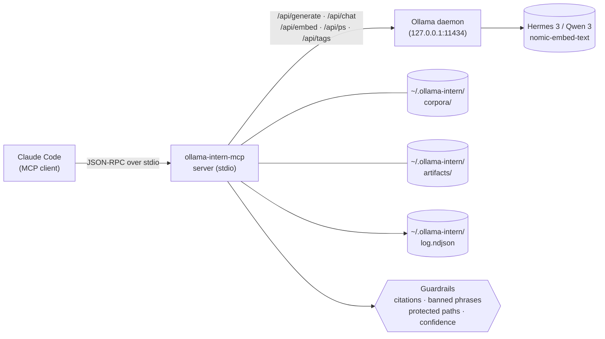

<p align="center">
  <a href="README.ja.md">日本語</a> | <a href="README.zh.md">中文</a> | <a href="README.es.md">Español</a> | <a href="README.fr.md">Français</a> | <a href="README.hi.md">हिन्दी</a> | <a href="README.it.md">Italiano</a> | <a href="README.md">English</a>
</p>

<p align="center">
  
</p>

<p align="center">
  <a href="https://github.com/mcp-tool-shop-org/ollama-intern-mcp/actions"></a>
  <a href="LICENSE"></a>
  <a href="https://mcp-tool-shop-org.github.io/ollama-intern-mcp/"></a>
  <a href="https://mcp-tool-shop-org.github.io/ollama-intern-mcp/handbook/"></a>
</p>

> **O estagiário local para Claude Code.** <!-- TOOL_COUNT:start -->42<!-- TOOL_COUNT:end --> ferramentas adaptadas à tarefa, informações concisas e baseadas em evidências, artefatos duráveis.

Um servidor MCP que fornece ao Claude Code um **estagiário local** com regras, níveis, uma mesa e um arquivo. O Claude escolhe a _ferramenta_; a ferramenta escolhe o _nível_ (Instantâneo / Robusto / Profundo / Incorporado); o nível cria um arquivo que você pode abrir na próxima semana.

**Também executa [Hermes Agent](https://github.com/NousResearch/hermes-agent) em `hermes3:8b`** — validado de ponta a ponta em 19 de abril de 2026. A configuração padrão é `hermes3:8b`; `qwen3:*` é a alternativa. Consulte [Uso com Hermes](#use-with-hermes) abaixo.

**Requisitos de hardware:** ~6 GB de VRAM para `hermes3:8b`, ou ~16 GB de RAM para inferência na CPU. Consulte [handbook/getting-started](https://mcp-tool-shop-org.github.io/ollama-intern-mcp/handbook/getting-started/#hardware-minimums) para obter detalhes completos.

**Não está usando o Claude?** O diretório [`examples/`](./examples/) contém um cliente MCP mínimo em Node.js e Python que você pode executar via stdio. Consulte também [handbook/with-hermes](https://mcp-tool-shop-org.github.io/ollama-intern-mcp/handbook/with-hermes/).

**Prioridade local** — sem envio de dados pela rede até que você opte por isso. Sem telemetria. Nada "autônomo". Cada chamada mostra seu processo. Opcionalmente, o roteamento [Ollama Cloud](#ollama-cloud-optional) coloca modelos da classe 600B atrás das mesmas ferramentas quando o hardware local é o gargalo — com retorno automático para o modo local.

---

## Novo na versão 2.8.0

**Maior confiabilidade, durabilidade e segurança — 25 correções, todas testadas primeiro e verificadas em toda a família.** O comportamento com prioridade local permanece inalterado e nenhum contrato de ferramenta foi removido; as chamadas existentes continuam funcionando. As melhorias são significativas:

- **Não há mais perda silenciosa de dados do corpus.** Um erro de leitura transitório durante `ollama_corpus_refresh` (um bloqueio de arquivo do Windows, um antivírus que retém o acesso, uma janela de salvamento de um editor) costumava classificar o arquivo como "ausente" e **excluir permanentemente seu conteúdo indexado**. Agora, apenas um arquivo genuinamente ausente é removido; um erro transitório mantém o caminho, marca-o para nova tentativa e preserva seus fragmentos.
- **Concorrência que respeita seus limites.** Um tempo limite de nível agora pode cancelar uma chamada ainda em fila para obter uma permissão (antes, ela ficava pendurada por muito mais tempo do que o previsto, enquanto os registros indicavam o contrário), e `ollama_chat` finalmente é roteado através da barreira de tempo limite/nível — para que uma geração local travada não paralise todas as ferramentas e realmente alcance a nuvem no modo primário na nuvem.
- **A nuvem degrada em vez de falhar.** Um ID de modelo de nuvem desativado agora retorna ao modo local com um motivo claro `cloud_model_missing` e uma dica específica da nuvem, em vez de uma interrupção total; o disjuntor não pode travar permanentemente; um modelo persistentemente ausente deixa de solicitar uma comunicação com a nuvem em cada chamada.
- **Superfície de segurança que corresponde à sua documentação.** `ollama_batch_proof_check` agora realmente impõe o confinamento do diretório de trabalho atual (com uma nova restrição de ambiente do operador `INTERN_BATCH_PROOF_ALLOWED_ROOTS`, que um chamador não pode ampliar), os sanitizadores de injeção de prompt ganharam cobertura + um limite honestamente divulgado e a proteção de caminho é insensível a maiúsculas e minúsculas no macOS.
- **Artefatos e registros honestos.** As gravações em lote são atômicas e nunca falham silenciosamente; os envelopes degradados relatam o nível realmente usado; o detector de gravação interrompida detecta gravações incompletas em qualquer mutação; os IDs de fragmento não colidem mais entre arquivos com conteúdo idêntico. A auditoria de dependências está totalmente limpa (0 vulnerabilidades).

Detalhes completos em [CHANGELOG.md](./CHANGELOG.md).

## Novo na versão 2.7.0

**Roteamento opcional para a Ollama Cloud — prioridade na nuvem, retorno ao modo local.** Ative com uma chave + um sinalizador e os níveis generativos serão roteados para um modelo de nuvem da classe 600B; as incorporações permanecem locais; um disjuntor retorna ao seu perfil local em caso de falha na nuvem. **Desativado por padrão — sem envio de dados, a menos que você defina `OLLAMA_API_KEY` e `OLLAMA_CLOUD_PRIMARY=1`.** Melhoria menor — os chamadores anteriores à versão 2.7.0 (e qualquer pessoa que não ative) verão um comportamento idêntico. Consulte [Ollama Cloud (opcional)](#ollama-cloud-optional).

- **Prioridade na nuvem com uma rede de segurança.** Um `RoutingOllamaClient` tenta a nuvem primeiro e retorna ao perfil local em caso de tempo limite / 5xx / 429 / problema de rede. Chaves inválidas (401/403) são exibidas de forma clara por meio de um disjuntor persistente, em vez de degradar silenciosamente para sempre; um ID de modelo de nuvem desativado ou com erro de digitação (404) também é exibido.
- **Nunca uma degradação silenciosa.** Cada envelope recebe `backend` (`cloud`|`local`), `degraded` e `degrade_reason`, para que você sempre saiba quando obteve o modelo local em vez do grande. Um evento NDJSON `backend_fallback` torna a taxa de retorno da nuvem para o modo local visível em `ollama_log_tail`.
- **`ollama_doctor` relata a autenticação e a acessibilidade da nuvem** como um bloco distinto; `ollama-intern-mcp doctor` mostra uma seção `Cloud (primary)`.
- O modelo de nuvem padrão é `minimax-m3:cloud`; substitua por nível com `INTERN_CLOUD_MODEL` / `INTERN_CLOUD_DEEP_MODEL` (por exemplo, `deepseek-v3.1:671b`).

## Novo na versão 2.6.0

Substituição do orçamento de nível por chamada em `ollama_extract`. Melhoria menor — os chamadores anteriores à versão 2.6.0 permanecem inalterados. Entrada detalhada em [CHANGELOG.md](./CHANGELOG.md).

- **Campo de esquema `tier_budget_ms_override?: number` em `ollama_extract`** (opcional, limitado a `[1, 600000]` ms). Quando presente, aplica o valor definido para cada nível visitado pelo executor, de modo que o mecanismo interno `runWithTimeoutAndFallback` em `src/guardrails/timeouts.ts:61` respeite o orçamento fornecido pelo operador, em vez do padrão do perfil. A cascata (executor principal → execução imediata no tempo limite) ainda é acionada; o valor definido controla cada etapa da cascata de forma uniforme.
- **Por que isso existe.** O wrapper R-018 do research-os (v0.12.1) envolveu o `callTool` do MCP com `Promise.race` e descobriu que o orçamento do wrapper não atingia o nível interno — `DEV_RTX5080_TIMEOUTS.instant = 15_000` continuou a acionar `TIER_TIMEOUT` em 15000 ms, independentemente de um orçamento de wrapper de 180000 ms. A v2.6.0 fornece o orçamento autoritativo do lado do MCP para que o sinalizador `--planner-timeout-ms` do operador (research-os) finalmente controle os tempos limite dos níveis internos, conforme projetado.
- **Comportamento padrão preservado.** Campo omitido = os padrões do perfil governam byte a byte. Os chamadores anteriores à v2.6.0 não veem nenhuma alteração.
- **Regex de causa de fallback R-010 preservado.** A mensagem de erro `TIER_TIMEOUT` do lado do servidor ainda corresponde a `/elapsed=(\d+)ms/` + `/budget=(\d+)ms/`, para que a visibilidade do consultor de IA nos níveis subsequentes funcione tanto no caminho com valor definido quanto no padrão.
- Usado pelo research-os v0.13.0 (integração cumulativa do cliente R-019 + R-020 + R-021) em um lançamento coordenado multi-repositório.

### Histórico — entregas da v2.4.0

Consulte [CHANGELOG.md](./CHANGELOG.md) e [docs/release-notes/v2.4.0.md](./docs/release-notes/v2.4.0.md) para obter a entrada completa da v2.4.0 (controle por nível de `num_ctx` no sistema de perfil).

## Novo na v2.4.0

Controle por nível de `num_ctx` (janela de contexto) no sistema de perfil. Adição menor — os chamadores da v2.3.0 permanecem inalterados. Entradas detalhadas em [CHANGELOG.md](./CHANGELOG.md) e [docs/release-notes/v2.4.0.md](./docs/release-notes/v2.4.0.md).

- **Mapa `TierConfig.num_ctx` (novo)** — opcional `{ instant?, workhorse?, deep?, embed? }` no perfil. Quando definido para um nível, o servidor MCP coloca `options.num_ctx = <value>` em cada solicitação de geração/chat do Ollama roteada para esse nível (inicial + fallback). Quando não definido, a solicitação omite completamente `num_ctx`, para que o Ollama use seu padrão carregado no modelo — comportamento da v2.3.0 preservado exatamente.
- **Novo campo de envelope `num_ctx_used?: number`** — presente apenas quando o servidor MCP realmente enviou `num_ctx`. Ausente quando a solicitação permitiu que o Ollama escolhesse. Não inferir um valor padrão — o servidor MCP não consulta o Ollama para obter o valor efetivo.
- **Padrões de perfil**: `dev-rtx5080` / `dev-rtx5080-qwen3` são enviados com `instant: 4096`, `workhorse: 8192`, `deep`/`embed` NÃO DEFINIDO. Dimensionado para manter `hermes3:8b` residente nos 16 GB de VRAM da RTX 5080 para ferramentas rápidas. `m5-max` deixa todos os níveis NÃO DEFINIDOS — 128 GB de memória unificada não têm problemas de estouro.
- **Fecha o diagnóstico da Fase 1 da v0.8.0** — `hermes3:8b` com o contexto padrão de 32K na RTX 5080 transbordou para a CPU e começou a causar tempos limite nas chamadas `ollama_extract` do executor principal. A v2.4.0 impede isso na camada de perfil.

### Controle por nível de `num_ctx` (novo na v2.4.0)

Perfil (trecho de `src/profiles.ts`):

```ts
"dev-rtx5080": {
  tiers: {
    instant: "hermes3:8b",
    workhorse: "hermes3:8b",
    deep: "hermes3:8b",
    embed: "nomic-embed-text",
    num_ctx: {
      instant: 4096,    // fast classify/summarize
      workhorse: 8192,  // schema-bound extract / batch
      // deep: UNSET — long-context briefs keep current behavior
      // embed: UNSET — no context-window pressure on embed
    },
  },
  // ... timeouts, prewarm
}
```

Envelope em uma chamada do nível do executor principal (por exemplo, `ollama_extract`):

```jsonc
{
  "result": { /* extracted data */ },
  "tier_used": "workhorse",
  "model": "hermes3:8b",
  "num_ctx_used": 8192,        // present because the profile set workhorse=8192
  // ... rest of envelope unchanged
}
```

No `m5-max` (ou qualquer perfil que deixe um nível não definido), `num_ctx_used` está ausente no envelope e a solicitação na rede para o Ollama não inclui o campo `num_ctx` — o Ollama usa seu padrão carregado no modelo.

Os operadores ajustam selecionando / editando o perfil; não há entrada de `num_ctx` por chamada nos esquemas de ferramentas. Se uma chamada futura revelar a necessidade, o padrão segue a substituição de `model` da v2.3.0.

### Histórico — entregas da v2.3.0

Consulte [CHANGELOG.md](./CHANGELOG.md) e [docs/release-notes/v2.3.0.md](./docs/release-notes/v2.3.0.md) para obter a entrada completa da v2.3.0 (substituição de modelo por chamada).

## Novo na v2.3.0

Substituição de modelo por chamada em todas as ferramentas atômicas baseadas em LLM. Adição menor — os chamadores da v2.2.0 permanecem inalterados. Entradas detalhadas em [CHANGELOG.md](./CHANGELOG.md) e [docs/release-notes/v2.3.0.md](./docs/release-notes/v2.3.0.md).

- **Entrada opcional `model: string` em 8 ferramentas atômicas** — `ollama_extract`, `ollama_classify`, `ollama_summarize_fast`, `ollama_summarize_deep`, `ollama_research`, `ollama_corpus_answer`, `ollama_chat`, `ollama_code_citation`. A primeira tentativa no nível da ferramenta é executada com o modelo especificado pelo chamador; em caso de tempo limite, a cascata existente `TIER_FALLBACK` resolve o próprio modelo do nível mais barato (NÃO a substituição do chamador). As ferramentas compostas/breves/de pacote deliberadamente NÃO aceitam `model` — as ferramentas atômicas obtêm controle por chamada, as compostas usam os padrões de nível.
- **Novo campo de envelope `model_requested?: string`** — presente apenas quando a substituição foi fornecida. Os chamadores com reconhecimento de calibração comparam `model_requested` vs `model` para detectar a substituição do fallback: `if (env.model_requested && env.model !== env.model_requested) { /* substituição */ }`. Entradas vazias / apenas com espaços em branco geram `ZodError` na análise do esquema, não falha silenciosa.
- **Correção de bug — desvio de `src/version.ts`.** A constante `VERSION` em tempo de execução agora é lida de `package.json` no carregamento do módulo; a v2.1.0 e a v2.2.0 foram lançadas relatando a string de identidade obsoleta `"2.0.0"`. O novo `tests/version.test.ts` bloqueia `VERSION === pkg.version`.

### Substituição de modelo por chamada (novo na v2.3.0)

```jsonc
{
  "tool": "ollama_classify",
  "arguments": {
    "text": "patch null pointer in auth",
    "labels": ["feat", "fix", "chore"],
    "frame": "what is the change kind?",
    "model": "hermes3:8b"
  }
}
```

Envelope:

```jsonc
{
  "result": { "label": "fix", "confidence": 0.9, "off_topic": false, ... },
  "tier_used": "instant",
  "model": "hermes3:8b",
  "model_requested": "hermes3:8b",       // present because override was supplied
  // ... rest of envelope unchanged
}
```

Se o nível do executor principal tivesse atingido o tempo limite e a chamada tivesse sido encaminhada para o nível imediato, `env.model` seria o modelo resolvido do nível imediato e `env.fallback_from` seria `"workhorse"` — `env.model_requested` ainda seria `"hermes3:8b"`, e `env.model !== env.model_requested` é o sinal de substituição. A substituição não é deliberadamente carregada no nível mais barato; o modelo escolhido pode não se adequar ao papel desse nível.

### Histórico — entregas da v2.2.0

Consulte [CHANGELOG.md](./CHANGELOG.md) e [docs/release-notes/v2.2.0.md](./docs/release-notes/v2.2.0.md) para obter a descrição completa da versão v2.2.0 (delimitação por quadro + abstinência estruturada).

## Novidades na v2.2.0

Contrato de função local para análise de evidências: delimitação por quadro e abstinência estruturada. Adição menor — as chamadas da v2.1.0 permanecem inalteradas. Descrições detalhadas em [CHANGELOG.md](./CHANGELOG.md) e [docs/release-notes/v2.2.0.md](./docs/release-notes/v2.2.0.md).

- **Extração delimitada por quadro** em `ollama_extract`, `ollama_classify`, `ollama_summarize_fast`, `ollama_summarize_deep` — entrada opcional `frame: string` + saídas estruturadas `frame_alignment` / `on_topic` / `frame_addressed`. As fontes que não se enquadram no tema são sinalizadas em vez de serem parafraseadas no esquema.
- **Abstinência estruturada** em `ollama_research` — campos `weak` / `abstained` / `sources_address_question`. Um `citations[]` vazio com um `answer` não vazio não é mais considerado um sucesso silencioso.
- **Limite de relevância** em `ollama_corpus_answer` — entrada opcional `min_top_score`. Abaixo desse limite, a ferramenta interrompe o processo com `abstained: true` e ignora a síntese. O `score` por citação agora é visível em cada citação.
- **Preservação da pontuação de recuperação** por meio de evidências concisas — `corpusHitsToEvidence` carrega o `score` (e o parâmetro `corpus_min_evidence_score` filtra no momento do conjunto em `incident_brief` / `repo_brief` / `change_brief`).
- **Limites de intervalo da linha de citação** — `guardrails/citations.ts` rejeita intervalos fora dos limites em `ollama_research`, correspondendo à postura existente em `ollama_code_citation`.
- **Correção da documentação do contrato do operador** — correção de `chunk_id`/`chunk_index` no README, reescrita de "validado no lado do servidor", qualificação da seção das Leis de Evidência e anotação do slogan de marketing.

### Regressão de teste — a verificação

O contrato do trecho é verificado em relação à falha literal do pacote "research-os" recém-criado: arxiv 2112.10422 (Temporizadores Padrão Cosmológicos) na seção-01, sob o tema *"Qual o significado da custódia de evidências em fluxos de trabalho de pesquisa aprofundada com LLM local versus nuvem?"* — 9/9 testes de contrato simulados do LLM confirmam que a fonte que não se enquadra no tema agora está contida (`frame_alignment.on_topic = false` na extração; `off_topic: true` na classificação; `frame_addressed: false` no resumo profundo; `abstained: true` em corpus_answer com `min_top_score` definido).

### Histórico — entregas da v2.1.0

Consulte [CHANGELOG.md](./CHANGELOG.md) para obter a descrição completa da versão v2.1.0 (aprovação de recursos: 13 novas ferramentas + 4 melhorias + remoção do congelamento).

---

## Arquitetura em resumo


```mermaid
flowchart LR
  Claude["Claude Code<br/>(MCP client)"]
  MCP["ollama-intern-mcp<br/>server (stdio)"]
  Ollama["Ollama daemon<br/>(127.0.0.1:11434)"]
  Models[("Hermes 3 / Qwen 3<br/>nomic-embed-text")]
  Corpus[("~/.ollama-intern/<br/>corpora/")]
  Artifacts[("~/.ollama-intern/<br/>artifacts/")]
  NDJSON[("~/.ollama-intern/<br/>log.ndjson")]
  Guards{{"Guardrails<br/>citations · banned phrases<br/>protected paths · confidence"}}

  Claude -- "JSON-RPC over stdio" --> MCP
  MCP --> Guards
  MCP -- "/api/generate · /api/chat<br/>/api/embed · /api/ps · /api/tags" --> Ollama
  Ollama --> Models
  MCP --- Corpus
  MCP --- Artifacts
  MCP --> NDJSON
```

Cada chamada de ferramenta Claude entra no servidor MCP por meio de stdio JSON-RPC. O servidor valida a chamada em relação ao esquema [zod](https://zod.dev) da ferramenta, executa as salvaguardas configuradas (validação de citação, remoção de frases proibidas, aplicação de caminhos protegidos, limites de confiança) e, em seguida, encaminha para um renderizador determinístico (nível de artefato) ou uma chamada HTTP do Ollama (todos os outros níveis). O daemon Ollama nunca vê os caminhos fornecidos pelo usuário — apenas o nível do modelo e o prompt preparado. Cada chamada anexa um evento estruturado ao log NDJSON em `~/.ollama-intern/log.ndjson`, onde `ollama_log_tail` e seu shell podem lê-lo.

---

## Exemplo principal — uma chamada, um artefato

```jsonc
// Claude → ollama-intern-mcp
{
  "tool": "ollama_incident_pack",
  "arguments": {
    "title": "sprite pipeline 5 AM paging regression",
    "logs": "[2026-04-16 05:07] worker-3 OOM killed\n[2026-04-16 05:07] ollama /api/ps reports evicted=true size=8.1GB\n...",
    "source_paths": ["F:/AI/sprite-foundry/src/worker.ts", "memory/sprite-foundry-visual-mastery.md"]
  }
}
```

Retorna um envelope que aponta para um arquivo no disco:

```jsonc
{
  "result": {
    "pack": "incident",
    "slug": "2026-04-16-sprite-pipeline-5-am-paging-regression",
    "artifact_md":   "~/.ollama-intern/artifacts/incident/2026-04-16-sprite-pipeline-5-am-paging-regression.md",
    "artifact_json": "~/.ollama-intern/artifacts/incident/2026-04-16-sprite-pipeline-5-am-paging-regression.json",
    "weak": false,
    "evidence_count": 6,
    "next_checks": ["residency.evicted across last 24h", "OLLAMA_MAX_LOADED_MODELS vs loaded size"]
  },
  "tier_used": "deep",
  "model": "hermes3:8b",
  "hardware_profile": "dev-rtx5080",
  "tokens_in": 4180, "tokens_out": 612,
  "elapsed_ms": 8410,
  "residency": { "in_vram": true, "evicted": false }
}
```

→ `weak: false` significa que ≥2 itens de evidência foram reunidos; NÃO significa que as hipóteses são validadas. Consulte [Leis de Evidência](#evidence-laws) abaixo.

Esse arquivo Markdown é a saída do assistente — títulos, bloco de evidências com IDs citados, investigações `next_checks`, banner `weak: true` se as evidências forem escassas. É determinístico: o renderizador é código, não um prompt. (O renderizador é determinístico; o *conteúdo* das hipóteses e superfícies é gerativo — leia-o como um rascunho, não como algo verificado.) Abra-o amanhã, compare-o na próxima semana, exporte-o para um manual com `ollama_artifact_export_to_path`.

Todos os concorrentes nesta categoria começam com "economize tokens". Nós começamos com _aqui está o arquivo que o assistente escreveu_.

### Segundo exemplo — crie um corpus e, em seguida, faça uma pergunta

```jsonc
// 1. Build a persistent, searchable corpus over your project.
{ "tool": "ollama_corpus_index",
  "arguments": { "name": "sprite-foundry",
                 "paths": ["F:/AI/sprite-foundry/src"],
                 "embed_model": "nomic-embed-text" } }
// → { chunks_written: 1204, paths_indexed: 312, failed_paths: [] }

// 2. Ask an evidence-bound question against it.
{ "tool": "ollama_corpus_answer",
  "arguments": { "name": "sprite-foundry",
                 "query": "how does the worker handle OOM eviction?",
                 "top_k": 8 } }
// → { answer: "...", citations: [{chunk_index, path}...], weak: false }
```

O servidor valida a identidade da citação e se cada `chunk_index` está dentro do intervalo dos resultados recuperados. NÃO prova que cada afirmação gerada seja semanticamente suportada pelo conteúdo citado — essa é a responsabilidade do modelo, e uma recuperação fraca ainda pode produzir respostas com o formato de citação. Descrição completa em [handbook/corpora](https://mcp-tool-shop-org.github.io/ollama-intern-mcp/handbook/corpora/).

---

## Extração delimitada por quadro (novidade na v2.2.0)

`ollama_extract`, `ollama_classify`, `ollama_summarize_fast` e `ollama_summarize_deep` aceitam uma entrada opcional `frame: string`. O quadro nomeia a pergunta à qual a fonte está sendo solicitada a responder; o modelo é instruído a se abster, em vez de emitir conteúdo verdadeiro, mas que não se enquadra no tema, quando a fonte não aborda o quadro.

```jsonc
{
  "tool": "ollama_extract",
  "arguments": {
    "text": "<long source document>",
    "schema": { /* your fields */ },
    "frame": "section purpose here — e.g. 'OOM eviction behavior in the sprite worker'"
  }
}
// → result includes frame_alignment: { on_topic: boolean, reason: string, unaddressed_aspects: string[] }
```

Se `frame` for omitido, o comportamento não será alterado em relação à v2.1.0. Quando fornecido, `frame_alignment.on_topic = false` indica que os campos extraídos podem ser verdadeiros para a fonte, mas não relevantes para o quadro — trate isso como tendo a mesma forma de um resumo `weak: true`: útil, mas verifique antes de promovê-lo para as evidências subsequentes.

---

## Contrato de abstinência (novidade na v2.2.0)

`ollama_research` retorna campos de abstinência estruturados: `weak: boolean`, `abstained: boolean`, `sources_address_question: boolean | null`. Um `citations[]` vazio com um `answer` não vazio não é mais considerado silencioso — `abstained: true` indica que o modelo se recusou a sintetizar porque os caminhos fornecidos pelo chamador não abordaram a pergunta. Trate a abstinência como um sucesso, não como uma falha: é a ferramenta que se recusa a "lavar" uma recuperação fraca em uma saída autoritária.

`ollama_corpus_answer` aceita um limite opcional de relevância tópica (`min_top_score: number`) entre 0,0 e 1,0. Quando a pontuação mais alta obtida para uma consulta for inferior a `min_top_score`, a ferramenta interrompe o processo com `abstained: true` e ignora a síntese — evitando o modo de falha "5 trechos irrelevantes com pontuação 0,21 ainda geram uma resposta completa", que a regra `weak: true` da versão 2.1.0 não detectava (`weak: true` só era ativada quando `hits.length < 2`). Combine isso com o campo `score` por citação, que agora está disponível em cada citação, para avaliar diretamente a qualidade da recuperação a partir dos resultados.

---

## O que há aqui — quatro níveis, <!-- TOOL_COUNT:start -->42<!-- TOOL_COUNT:end --> ferramentas

**"Job-shaped" (moldado para tarefas)** significa que cada ferramenta tem um nome que descreve uma tarefa que você delegaria a um estagiário — classifique isso, extraia aquilo, priorize esses registros, crie este comunicado de lançamento, organize este incidente. A entrada da ferramenta é a especificação da tarefa; a saída é o resultado final. Não há nenhuma função genérica `run_model` / `chat_with_llm` no nível superior.

| Nível | Contagem | O que está aqui |
|---|---|---|
| **Atoms** | 29 | Funções básicas moldadas para tarefas. **Original 15:** `classify`, `extract`, `triage_logs`, `summarize_fast` / `deep`, `draft`, `research`, `corpus_search` / `answer` / `index` / `refresh` / `list`, `embed_search`, `embed`, `chat`. **+13 adicionadas na versão 2.1.0:** `doctor`, `log_tail`, `batch_proof_check` (operações); `code_map`, `code_citation`, `multi_file_refactor_propose`, `refactor_plan` (refatoração); `artifact_prune`, `hypothesis_drill` (artefato/resumo); `corpus_health`, `corpus_amend`, `corpus_amend_history`, `corpus_rerank` (corpus). **+1 "átomo" de revisão:** `code_review` (resultados estruturados da revisão de PR, ferramenta principal; apenas para revisão). Os "átomos" que podem processar lotes (`classify`, `extract`, `triage_logs`) aceitam `items: [{id, text}]`. |
| **Briefs** | 3 | Resumos estruturados e baseados em evidências. `incident_brief`, `repo_brief`, `change_brief`. Cada afirmação cita um ID de evidência; informações desconhecidas são removidas no lado do servidor. Evidências fracas exibem `weak: true` em vez de uma narrativa falsa. |
| **Packs** | 3 | Tarefas compostas com pipeline fixo que gravam Markdown e JSON duradouros em `~/.ollama-intern/artifacts/`. `incident_pack`, `repo_pack`, `change_pack`. Renderizadores determinísticos — nenhuma chamada de modelo na forma do artefato. |
| **Artifacts** | 7 | Camada de continuidade sobre as saídas dos pacotes. `artifact_list` / `read` / `diff` / `export_to_path`, mais três trechos determinísticos: `incident_note`, `onboarding_section`, `release_note`. |

Total: **29 "átomos" + 3 resumos + 3 pacotes + 7 ferramentas de artefato = <!-- TOOL_COUNT:start -->42<!-- TOOL_COUNT:end -->**.

Linhas congeladas:
- "Átomos": o congelamento foi **removido na versão 2.1.0** (29 hoje; +13 adicionados no lançamento de recursos da versão 2.1.0, +1 `code_review` posteriormente). Novos "átomos" ainda exigem uma justificativa baseada em auditoria, testes, página do manual e entrada no CHANGELOG — nenhuma adição casual.
- Pacotes congelados em 3. Nenhum novo tipo de pacote.
- Nível de artefato congelado em 7.

A referência completa das ferramentas está disponível no [manual](https://mcp-tool-shop-org.github.io/ollama-intern-mcp/handbook/tools/).

---

## Instalação

Requer que o [Ollama](https://ollama.com) esteja em execução localmente e que os modelos do nível sejam carregados (veja [Carregamento de modelos](#model-pulls) abaixo).

### Claude Code (recomendado)

A maioria dos usuários instala isso adicionando ao arquivo de configuração do servidor Claude Code MCP — nenhuma instalação global é necessária. O Claude Code executa o servidor sob demanda via `npx`:

```json
{
  "mcpServers": {
    "ollama-intern": {
      "command": "npx",
      "args": ["-y", "ollama-intern-mcp"],
      "env": {
        "OLLAMA_HOST": "http://127.0.0.1:11434",
        "INTERN_PROFILE": "dev-rtx5080"
      }
    }
  }
}
```

### Claude Desktop

O mesmo bloco, gravado em `~/Library/Application Support/Claude/claude_desktop_config.json` (macOS) ou `%APPDATA%\Claude\claude_desktop_config.json` (Windows).

### Instalação global (avançada)

Só é necessário se você quiser que o binário esteja no seu `PATH` para uso ad hoc fora do Claude Code:

```bash
npm install -g ollama-intern-mcp
```

### Uso com Hermes

Este MCP foi validado de ponta a ponta com [Hermes Agent](https://github.com/NousResearch/hermes-agent) usando `hermes3:8b` no Ollama (2026-04-19). Hermes é um agente externo que *chama* a superfície básica congelada deste MCP — ele faz o planejamento, nós fazemos o trabalho.

Arquivo de configuração de referência ([hermes.config.example.yaml](hermes.config.example.yaml) neste repositório):

```yaml
model:
  provider: custom
  base_url: http://localhost:11434/v1
  default: hermes3:8b
  context_length: 65536    # Hermes requires 64K floor under model.*

providers:
  local-ollama:
    name: local-ollama
    base_url: http://localhost:11434/v1
    api_mode: openai_chat
    api_key: ollama
    model: hermes3:8b

mcp_servers:
  ollama-intern:
    command: npx
    args: ["-y", "ollama-intern-mcp"]
    env:
      OLLAMA_HOST: http://localhost:11434
      INTERN_PROFILE: dev-rtx5080
      # hermes3:8b is the default ladder in v2.0.0, so tier overrides are
      # only needed if you're pinning a different local model.
```

**A forma do prompt é importante.** Prompts imperativos que invocam ferramentas ("Chame X com os argumentos...") são o teste de integração — eles fornecem estrutura suficiente para um modelo local de 8B emitir `tool_calls` limpos. Prompts em formato de lista para várias tarefas ("faça A, depois B, depois C") são benchmarks de capacidade para modelos maiores; não interprete uma falha no formato de lista em um modelo de 8B como "a conexão está quebrada". Consulte [handbook/with-hermes](https://mcp-tool-shop-org.github.io/ollama-intern-mcp/handbook/with-hermes/) para obter o guia completo de integração + ressalvas conhecidas sobre o transporte (Ollama `/v1` streaming + shim não em streaming do openai-SDK).

### Carregamento de modelos

**Perfil padrão de desenvolvimento (RTX 5080 16GB e similares):**

```bash
ollama pull hermes3:8b
ollama pull nomic-embed-text
export OLLAMA_MAX_LOADED_MODELS=2
export OLLAMA_KEEP_ALIVE=-1
```

**Alternativa Qwen 3 (mesmo hardware, para ferramentas Qwen):**

```bash
ollama pull qwen3:8b
ollama pull qwen3:14b
ollama pull nomic-embed-text
export INTERN_PROFILE=dev-rtx5080-qwen3
```

**Perfil M5 Max (128 GB unificado):**

```bash
ollama pull qwen3:14b
ollama pull qwen3:32b
ollama pull nomic-embed-text
export INTERN_PROFILE=m5-max
```

As variáveis de ambiente por nível (`INTERN_TIER_INSTANT`, `INTERN_TIER_WORKHORSE`, `INTERN_TIER_DEEP`, `INTERN_EMBED_MODEL`) ainda substituem as escolhas do perfil para casos únicos.

---

## Envelope uniforme

Cada ferramenta retorna o mesmo formato:

```ts
{
  result: <tool-specific>,
  tier_used: "instant" | "workhorse" | "deep" | "embed",
  model: string,
  hardware_profile: string,     // "dev-rtx5080" | "dev-rtx5080-qwen3" | "m5-max"
  tokens_in: number,
  tokens_out: number,
  elapsed_ms: number,
  residency: {
    in_vram: boolean,
    size_bytes: number,
    size_vram_bytes: number,
    evicted: boolean
  } | null
}
```

`residency` vem da API `/api/ps` do Ollama. Quando `evicted: true` ou `size_vram < size`, o modelo é movido para o disco e a inferência diminui 5–10 vezes — exiba isso para o usuário para que ele saiba que deve reiniciar o Ollama ou reduzir o número de modelos carregados.

No modo [Ollama Cloud](#ollama-cloud-optional), o envelope também contém `backend` (`"cloud"` | `"local"`) e, em caso de fallback da nuvem para local, `degraded: true` + `degrade_reason`. Esses campos estão **ausentes** no caminho padrão somente local, portanto, os consumidores existentes não são afetados. `residency` é `null` para chamadas servidas na nuvem (a nuvem sem estado não tem residência de VRAM local).

Cada chamada é registrada como uma linha NDJSON em `~/.ollama-intern/log.ndjson`. Filtre por `hardware_profile` para evitar que os números de desenvolvimento apareçam nos benchmarks publicáveis.

---

## Perfis de hardware

| Perfil | Instantâneo | Principal | Profundo | Incorporação |
|---|---|---|---|---|
| **`dev-rtx5080`** (padrão) | hermes3 8B | hermes3 8B | hermes3 8B | nomic-embed-text |
| `dev-rtx5080-qwen3` | qwen3 8B | qwen3 8B | qwen3 14B | nomic-embed-text |
| `m5-max` | qwen3 14B | qwen3 14B | qwen3 32B | nomic-embed-text |

**Perfil padrão (`dev`)** agrupa os três níveis de desempenho em `hermes3:8b` — o caminho validado para a integração do Hermes Agent. Usar o mesmo modelo em todos os níveis significa que há apenas uma coisa para carregar, um custo de residência e um conjunto de comportamentos para entender. Os usuários que preferem o Qwen 3 (com seu mecanismo `THINK_BY_SHAPE`) podem optar por `dev-rtx5080-qwen3`. `m5-max` é a configuração do Qwen 3 dimensionada para memória unificada.

---

## Ollama Cloud (opcional)

Os modelos locais de 8B são o gargalo de hardware que a maioria das pessoas encontra. O [Ollama Cloud](https://ollama.com/cloud) oferece modelos da classe 600B por trás da **mesma** interface `/api/*`, para que você possa direcionar as ferramentas mais pesadas para um modelo muito mais potente e liberar VRAM local — mantendo o acesso local como uma opção sempre ativa.

**Esta é uma opção ativada manualmente e desativada por padrão.** O pacote permanece com foco no uso local, com **nenhum envio de dados**, a menos que você defina *ambos* os seguintes parâmetros. Qualquer pessoa que não ativar a opção não será afetada.

```json
{
  "mcpServers": {
    "ollama-intern": {
      "command": "npx",
      "args": ["-y", "ollama-intern-mcp"],
      "env": {
        "OLLAMA_CLOUD_PRIMARY": "1",
        "OLLAMA_API_KEY": "sk-...your-key...",
        "INTERN_PROFILE": "dev-rtx5080"
      }
    }
  }
}
```

> **A chave é uma variável de ambiente em tempo de execução, e não um segredo do CI.** Um segredo do GitHub Actions só é visível dentro das execuções do CI — ele nunca chega ao servidor em execução. Crie uma chave em [ollama.com/settings/keys](https://ollama.com/settings/keys) e coloque-a no bloco `env` do seu cliente MCP (ou no ambiente do seu shell).

**Como o roteamento funciona.** Quando a nuvem está ativada, os níveis de geração (instantâneo / principal / profundo) são direcionados para o modelo da nuvem; **as incorporações sempre permanecem locais** (o Ollama Cloud não oferece modelos de incorporação, portanto, as ferramentas de corpus/incorporação não são afetadas). Um mecanismo de segurança tenta usar a nuvem primeiro e retorna ao seu perfil local em caso de tempo limite / erros 5xx / 429 / erros de rede. Uma chave inválida (401/403) aciona um mecanismo de segurança *persistente* que exibe uma mensagem clara, em vez de degradar silenciosamente o desempenho. O perfil local (`INTERN_PROFILE`) é a configuração de fallback, portanto, mantenha seus modelos carregados.

**Você nunca terá seu desempenho reduzido silenciosamente.** Cada solicitação informa qual backend atendeu à chamada:

```ts
{ ...envelope, backend: "cloud" | "local", degraded?: true, degrade_reason?: "cloud_timeout" | "cloud_5xx" | "cloud_rate_limited" | "cloud_unreachable" | "cloud_auth_failed" | "circuit_open" }
```

Uma linha `backend_fallback` é adicionada em `~/.ollama-intern/log.ndjson` a cada retorno da nuvem para o uso local (`ollama_log_tail --filter_kind backend_fallback`), e o comando `ollama-intern-mcp doctor` exibe um bloco **Cloud (primário)** com informações sobre acessibilidade e status de autenticação.

**Latência versus qualidade.** Os modelos grandes da nuvem são executados muito mais lentamente por token do que um modelo local de 8B (segundos, não milissegundos) — uma melhoria na qualidade, não na velocidade. Os níveis da nuvem usam um limite de tempo generoso (instantâneo: 30 segundos / principal: 120 segundos / profundo: 300 segundos por padrão).

### Variáveis de ambiente da nuvem

| Variável | Padrão | Finalidade |
|---|---|---|
| `OLLAMA_CLOUD_PRIMARY` | _(não definido)_ | **O interruptor de ativação.** `1`/`true`/`yes`/`on` habilita o uso primário da nuvem. Não definido = apenas local, sem envio de dados. |
| `OLLAMA_API_KEY` | _(não definido)_ | Chave Bearer para o Ollama Cloud. **Obrigatório** quando a nuvem está habilitada (falha rapidamente na inicialização se estiver ausente). |
| `OLLAMA_CLOUD_HOST` | `https://ollama.com` | Host base da nuvem. |
| `INTERN_CLOUD_MODEL` | `minimax-m3:cloud` | Modelo da nuvem para os níveis instantâneo, principal e profundo. |
| `INTERN_CLOUD_DEEP_MODEL` | _(= `INTERN_CLOUD_MODEL`)_ | Substituição opcional apenas para o nível profundo, por exemplo, `deepseek-v3.1:671b`. |
| `INTERN_CLOUD_TIMEOUT_{INSTANT,WORKHORSE,DEEP}_MS` | `30000`/`120000`/`300000` | Tempos limite de tentativa da nuvem por nível. |
| `INTERN_CLOUD_NUM_CTX` | `32768` | Limite do tamanho da janela de contexto para chamadas na nuvem (a nuvem cobra pelo tempo de GPU; o limite controla os custos). |

> **A disponibilidade dos modelos pode mudar.** O Ollama periodicamente desativa modelos na nuvem. `minimax-m3:cloud`, `deepseek-v3.1:671b`, `gpt-oss:120b` e `qwen3-coder:480b` são as opções atuais; verifique [ollama.com/search?c=cloud](https://ollama.com/search?c=cloud) antes de fixar um ID.

**Observação sobre privacidade.** O roteamento para o Ollama Cloud envia prompts para terceiros. A [política de privacidade](https://ollama.com/privacy) do Ollama afirma que os prompts da nuvem são processados ​​de forma transitória, não retidos além da solicitação e não usados ​​para treinamento — mas ainda assim é um envio de dados, por isso é uma opção ativada manualmente e divulgada. O modo somente local (o padrão) não envia nada para fora do sistema.

---

## Leis sobre evidências

Estas são aplicadas no servidor, e não no prompt:

- **Citações obrigatórias.** Cada afirmação breve cita um ID de evidência.
- **Desconhecidos removidos no lado do servidor.** Os modelos que citam IDs que não estão no conjunto de evidências têm esses IDs removidos com um aviso antes que o resultado seja retornado.
- **Validação de ID, não de conteúdo.** O servidor verifica se cada `evidence_ref` citado aponta para um ID de evidência real no conjunto montado. Ele NÃO verifica se o texto da afirmação pode ser derivado da evidência citada — esse é o trabalho do modelo, e resumos fracos às vezes contêm afirmações não comprovadas com referências válidas. Use `weak: true` + notas de cobertura + o campo `excerpt` incluído para verificar pontualmente.
- **Fraco é fraco.** Evidências fracas sinalizam `weak: true` com notas de cobertura. Nunca suavizadas em uma narrativa falsa.
- **Investigativo, não prescritivo.** Apenas `next_checks` / `read_next` / `likely_breakpoints`. Os prompts proíbem "aplicar esta correção".
- **Renderizadores determinísticos.** O formato markdown do artefato é código, e não um prompt. `draft` permanece reservado para prosa onde a formulação do modelo importa.
- **Diferenças apenas dentro do mesmo pacote.** A diferença entre pacotes (`artifact_diff`) é rejeitada de forma clara; os payloads permanecem distintos.

---

## Artefatos e continuidade

Os pacotes são gravados em `~/.ollama-intern/artifacts/{incident,repo,change}/<slug>.(md|json)`. O nível de artefato oferece uma superfície de continuidade sem transformar isso em uma ferramenta de gerenciamento de arquivos:

- `artifact_list` — índice que contém apenas metadados, filtrável por pacote, data e padrão de nome de arquivo (slug glob)
- `artifact_read` — leitura tipada por `{pacote, slug}` ou `{json_path}`
- `artifact_diff` — comparação estruturada dentro do mesmo pacote; diferenciação fraca implementada
- `artifact_export_to_path` — grava um artefato existente (com cabeçalho de proveniência) em um diretório `allowed_roots` especificado pelo chamador. Recusa arquivos existentes, a menos que `overwrite: true`.
- `artifact_incident_note_snippet` — fragmento de nota do operador
- `artifact_onboarding_section_snippet` — fragmento do manual
- `artifact_release_note_snippet` — fragmento da nota de lançamento (em versão preliminar)

Nenhuma chamada de modelo nesta camada. Tudo é renderizado a partir do conteúdo armazenado.

---

## Modelo de ameaças e telemetria

**Dados acessados:** caminhos de arquivos fornecidos explicitamente pelo chamador (`ollama_research`, ferramentas de corpus), texto embutido e artefatos que o chamador solicita que sejam gravados em `~/.ollama-intern/artifacts/` ou em um diretório `allowed_roots` especificado pelo chamador.

**Dados NÃO acessados:** qualquer coisa fora de `source_paths` / `allowed_roots`. `..` é rejeitado antes da normalização. `artifact_export_to_path` recusa arquivos existentes, a menos que `overwrite: true`. Rascunhos direcionados a caminhos protegidos (`memory/`, `.claude/`, `docs/canon/`, etc.) exigem um `confirm_write: true` explícito, aplicado no lado do servidor.

**Comunicação de rede:** **desativada por padrão.** Por padrão, a única comunicação externa é para o endpoint HTTP local do Ollama — sem chamadas à nuvem, sem pings de atualização, sem relatórios de falhas. **Exceção opcional:** se você habilitar [Ollama Cloud](#ollama-cloud-optional) (`OLLAMA_CLOUD_PRIMARY=1` + `OLLAMA_API_KEY`), as solicitações para as camadas generativas são enviadas para `ollama.com` via HTTPS com uma chave Bearer. Isso é explícito, divulgado e desativado a menos que você defina ambas as variáveis; os embeddings nunca saem do sistema. Consulte [SECURITY.md](SECURITY.md) §11.

**Telemetria:** **nenhuma.** Cada chamada é registrada como uma linha NDJSON em `~/.ollama-intern/log.ndjson` na sua máquina. O servidor em si não envia dados para lugar nenhum.

**Erros:** formato estruturado `{ code, message, hint, retryable }`. Rastreamentos de pilha nunca são expostos nos resultados das ferramentas.

Política completa: [SECURITY.md](SECURITY.md).

---

## Padrões

Construído para atender aos requisitos do [Shipcheck](https://github.com/mcp-tool-shop-org/shipcheck). As etapas A–D são obrigatórias; consulte [SHIP_GATE.md](SHIP_GATE.md) e [SCORECARD.md](SCORECARD.md).

- **A. Segurança** — SECURITY.md, modelo de ameaças, sem telemetria, segurança do caminho, `confirm_write` em caminhos protegidos
- **B. Erros** — formato estruturado em todos os resultados das ferramentas; nenhum rastreamento bruto
- **C. Documentação** — README atualizado, CHANGELOG, LICENSE; esquemas de ferramentas autoexplicativos
- **D. Boas práticas** — `npm run verify` (conjunto completo de testes vitest), CI com verificação de dependências, Dependabot, arquivo lockfile, `engines.node`

---

## Roteiro (melhorias, não expansão do escopo)

- **Fase 1 — Estrutura de Delegação** ✓ lançado: superfície atômica, envelope uniforme, roteamento em camadas, mecanismos de segurança
- **Fase 2 — Estrutura da Verdade** ✓ lançado: fragmentação do esquema v2, BM25 + RRF, corpus dinâmicos, resumos baseados em evidências, pacote de avaliação de recuperação
- **Fase 3 — Estrutura de Pacotes e Artefatos** ✓ lançado: pacotes de pipeline fixo com artefatos duradouros + camada de continuidade
- **Fase 4 — Estrutura de Adoção** ✓ v2.0.1: passagem de saúde em três etapas, corpus aprimorado (TOCTOU, limite de arquivo de 50 MB, rejeição de links simbólicos, gravações atômicas, captura de falhas por arquivo), travessia do caminho da ferramenta, observabilidade (eventos de espera do semáforo, contexto de erro de tempo limite, registro de substituição de ambiente de perfil, sinal de pré-aquecimento de inicialização a frio), segurança dos testes (instantâneo do ambiente de carregamento do módulo em 10 arquivos, `tools/call` E2E). Manual de solução de problemas + requisitos mínimos de hardware adicionados para operadores.
- **Fase 5 — Benchmarks M5 Max** — números publicáveis quando o hardware estiver disponível (~24 de abril de 2026)

Fase por camada de aprimoramento. As camadas de pacotes e artefatos permanecem congeladas nas versões 3 e 7. O congelamento da camada atômica foi suspenso na v2.1.0 — novos átomos exigem uma lacuna justificada por meio de auditoria, testes, página do manual e entrada no CHANGELOG.

---

## Licença

MIT — consulte [LICENSE](LICENSE).

---

<p align="center">Built by <a href="https://mcp-tool-shop.github.io/">MCP Tool Shop</a></p>
