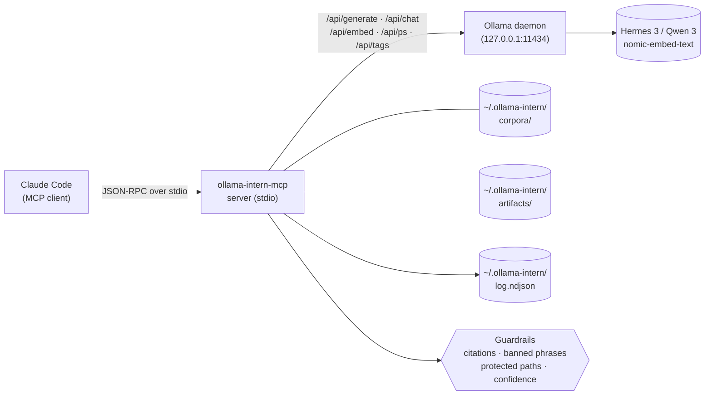

<p align="center">
  <a href="README.ja.md">日本語</a> | <a href="README.md">English</a> | <a href="README.es.md">Español</a> | <a href="README.fr.md">Français</a> | <a href="README.hi.md">हिन्दी</a> | <a href="README.it.md">Italiano</a> | <a href="README.pt-BR.md">Português (BR)</a>
</p>

<p align="center">
  
</p>

<p align="center">
  <a href="https://github.com/mcp-tool-shop-org/ollama-intern-mcp/actions"></a>
  <a href="LICENSE"></a>
  <a href="https://mcp-tool-shop-org.github.io/ollama-intern-mcp/"></a>
  <a href="https://mcp-tool-shop-org.github.io/ollama-intern-mcp/handbook/"></a>
</p>

> **Claude Code 的本地实习生。** <!-- TOOL_COUNT:start -->42<!-- TOOL_COUNT:end --> 个工种化工具，基于证据优先的简报，产出可长期保留的制品。

一个为 Claude Code 提供**本地实习生**的 MCP 服务器,配有规则、层级、办公桌和文件柜。Claude 挑选_工具_;工具挑选_层级_(Instant / Workhorse / Deep / Embed);该层级会写出一个你下周还能打开的文件。

**同时驱动 [Hermes Agent](https://github.com/NousResearch/hermes-agent) 运行 `hermes3:8b`** — 于 2026-04-19 端到端验证通过。默认阶梯为 `hermes3:8b`;`qwen3:*` 为备选轨道。参见下方 [与 Hermes 配合使用](#use-with-hermes)。

**硬件要求:**`hermes3:8b` 需约 6 GB 显存,或 CPU 推理需约 16 GB 内存。完整说明见 [handbook/getting-started](https://mcp-tool-shop-org.github.io/ollama-intern-mcp/handbook/getting-started/#hardware-minimums)。

**不使用 Claude?** [`examples/`](./examples/) 目录中提供可通过 stdio 启动的极简 Node.js 和 Python MCP 客户端。另见 [handbook/with-hermes](https://mcp-tool-shop-org.github.io/ollama-intern-mcp/handbook/with-hermes/)。

**本地优先** — 在你主动开启之前,零网络外发流量。无遥测。无任何"自主"行为。每次调用都展示其工作过程。可选的 [Ollama Cloud](#ollama-cloud-optional) 路由可在本地硬件成为瓶颈时,让 600B 级模型运行于相同的工具之后 — 并具备自动回退至本地的能力。

---

## v2.7.0 新增内容

**可选的 Ollama Cloud 路由 — 云端优先,本地回退。** 凭一个密钥和一个标志位即可开启,生成式层级将路由至 600B 级云端模型;嵌入保持本地;断路器在任何云端故障时回退到你的本地配置。**默认关闭 — 除非同时设置 `OLLAMA_API_KEY` 和 `OLLAMA_CLOUD_PRIMARY=1`,否则零外发流量。** 增量式小版本 — v2.7.0 之前的调用方(以及任何未主动开启者)行为完全一致。参见 [Ollama Cloud(可选)](#ollama-cloud-optional)。

- **云端优先,带安全网。** `RoutingOllamaClient` 优先尝试云端,并在超时 / 5xx / 429 / 网络错误时回退到本地配置。错误的密钥(401/403)会通过粘性断路器大声报错,而不是无声地永久降级;已下线/拼写错误的云端模型 id(404)也会被暴露出来。
- **绝无无声降级。** 每个响应包都附带 `backend`(`cloud`|`local`)、`degraded` 和 `degrade_reason`,让你始终能知晓何时拿到的是本地模型而非大模型。`backend_fallback` NDJSON 事件让 `ollama_log_tail` 中云端→本地的回退率清晰可见。
- **`ollama_doctor` 报告云端鉴权与可达性** 作为独立块呈现;`ollama-intern-mcp doctor` 显示 `Cloud (primary)` 段落。
- 默认云端模型为 `minimax-m3:cloud`;可通过 `INTERN_CLOUD_MODEL` / `INTERN_CLOUD_DEEP_MODEL` 按层级覆盖(例如 `deepseek-v3.1:671b`)。

## v2.6.0 新增内容

`ollama_extract` 支持单次调用的层级预算覆盖。增量式小版本 — v2.6.0 之前的调用方不受影响。详细条目见 [CHANGELOG.md](./CHANGELOG.md)。

- **`tier_budget_ms_override?: number` 模式字段在 `ollama_extract` 上**（可选，有界 `[1, 600000]` 毫秒）。当该字段存在时，将覆盖值应用于运行器访问的每个层级，以便 `src/guardrails/timeouts.ts:61` 中的内部 `runWithTimeoutAndFallback` 机制遵循操作员提供的预算，而不是配置文件默认值。级联（workhorse → 超时时的 instant）仍然触发；该覆盖值统一控制每个级联跳点。
- **存在的原因。** research-os R-018 包装器（v0.12.1）使用 `Promise.race` 包装了 MCP `callTool`，发现包装器的预算无法到达内部层级 —— `DEV_RTX5080_TIMEOUTS.instant = 15_000` 在 15000 毫秒时仍继续触发 `TIER_TIMEOUT`，而无视 180000 毫秒的包装器预算。v2.6.0 提供 MCP 端权威预算，使操作员的 `--planner-timeout-ms` 标志（research-os）终于能够按设计控制内部层级超时。
- **默认行为保持不变。** 字段省略 = 配置文件默认值以字节一致方式生效。v2.6.0 之前的调用方看到零变化。
- **保留 R-010 后备原因正则表达式。** 服务端 `TIER_TIMEOUT` 错误消息仍匹配 `/elapsed=(\d+)ms/` + `/budget=(\d+)ms/`，以便 AI-advisor 的下游可见性在覆盖和默认路径上均能正常工作。
- 由 research-os v0.13.0（累积的 R-019 客户端接入 + R-020 + R-021）在协调的多仓库发布中消费。

### 历史 — v2.4.0 交付内容

有关完整的 v2.4.0 条目（配置文件系统上每层级 `num_ctx` 控制），请参阅 [CHANGELOG.md](./CHANGELOG.md) 和 [docs/release-notes/v2.4.0.md](./docs/release-notes/v2.4.0.md)。

## v2.4.0 中的新功能

配置文件系统上每层级 `num_ctx`（上下文窗口）控制。增量式次要版本 —— v2.3.0 调用方保持不变。详细条目见 [CHANGELOG.md](./CHANGELOG.md) 和 [docs/release-notes/v2.4.0.md](./docs/release-notes/v2.4.0.md)。

- **`TierConfig.num_ctx` 映射（新）** — 配置文件上的可选 `{ instant?, workhorse?, deep?, embed? }`。当为某层级设置时，MCP 服务器在路由到该层级的每个 Ollama generate/chat 请求（初始 + 后备）上放置 `options.num_ctx = <值>`。当未设置时，请求完全省略 `num_ctx`，以便 Ollama 使用其模型加载的默认值 —— 精确保留 v2.3.0 行为。
- **新信封字段 `num_ctx_used?: number`** — 仅在 MCP 服务器实际发送了 `num_ctx` 时存在。当请求让 Ollama 自行选择时则缺失。不要推断默认值 —— MCP 服务器不会向 Ollama 查询有效值。
- **配置文件默认值**：`dev-rtx5080` / `dev-rtx5080-qwen3` 出厂时设置 `instant: 4096`、`workhorse: 8192`、`deep`/`embed` 未设置。旨在使 `hermes3:8b` 在 RTX 5080 的 16GB VRAM 预算中常驻，以实现快速工具调用。`m5-max` 将所有层级留为未设置 —— 128GB 统一内存不存在溢出问题。
- **关闭 v0.8.0 阶段 1 诊断** — `hermes3:8b` 在 RTX 5080 上使用默认 32K 上下文时会溢出到 CPU 并开始导致 workhorse `ollama_extract` 调用超时。v2.4.0 在配置文件层防止了这种情况。

### 每层级 `num_ctx` 控制（v2.4.0 中的新功能）

配置文件（摘自 `src/profiles.ts`）：

```ts
"dev-rtx5080": {
  tiers: {
    instant: "hermes3:8b",
    workhorse: "hermes3:8b",
    deep: "hermes3:8b",
    embed: "nomic-embed-text",
    num_ctx: {
      instant: 4096,    // fast classify/summarize
      workhorse: 8192,  // schema-bound extract / batch
      // deep: UNSET — long-context briefs keep current behavior
      // embed: UNSET — no context-window pressure on embed
    },
  },
  // ... timeouts, prewarm
}
```

workhorse 层级调用（例如 `ollama_extract`）上的信封：

```jsonc
{
  "result": { /* extracted data */ },
  "tier_used": "workhorse",
  "model": "hermes3:8b",
  "num_ctx_used": 8192,        // present because the profile set workhorse=8192
  // ... rest of envelope unchanged
}
```

在 `m5-max`（或任何将层级留为未设置的配置文件）上，信封中不存在 `num_ctx_used`，且发送到 Ollama 的线路请求不包含 `num_ctx` 字段 —— Ollama 使用其模型加载的默认值。

操作员通过选择/编辑配置文件进行调整；工具模式上没有按调用的 `num_ctx` 输入。如果未来的调用出现这种需求，其模式遵循 v2.3.0 的 `model` 覆盖方式。

### 历史 — v2.3.0 交付内容

有关完整的 v2.3.0 条目（按调用模型覆盖），请参阅 [CHANGELOG.md](./CHANGELOG.md) 和 [docs/release-notes/v2.3.0.md](./docs/release-notes/v2.3.0.md)。

## v2.3.0 中的新功能

Per-call 模型覆盖,适用于所有由 LLM 支持的原子工具。附加性 minor 版本 — v2.2.0 调用方不受影响。详细条目见 [CHANGELOG.md](./CHANGELOG.md) 和 [docs/release-notes/v2.3.0.md](./docs/release-notes/v2.3.0.md)。

- **8 个原子工具上的可选 `model: string` 输入** —— `ollama_extract`、`ollama_classify`、`ollama_summarize_fast`、`ollama_summarize_deep`、`ollama_research`、`ollama_corpus_answer`、`ollama_chat`、`ollama_code_citation`。工具所在层级的首次尝试将针对调用方指定的模型运行;超时时,既有的 `TIER_FALLBACK` 级联将解析到更便宜层级自身的模型(而非调用方的覆盖)。组合/简报/打包工具刻意不接受 `model` —— 原子工具获得每次调用的控制权,组合工具使用层级默认值。
- **新的信封字段 `model_requested?: string`** —— 仅在提供了覆盖时存在。支持校准的调用方可比较 `model_requested` 与 `model` 以检测回退替换:`if (env.model_requested && env.model !== env.model_requested) { /* 发生替换 */ }`。空值或仅含空白字符的输入在 schema 解析时抛出 `ZodError`,而非静默穿透。
- **Bug 修复 —— `src/version.ts` 漂移。** 运行时 `VERSION` 常量现在在模块加载时从 `package.json` 读取;v2.1.0 和 v2.2.0 一直发布时报告陈旧的 `"2.0.0"` 标识字符串。新的 `tests/version.test.ts` 锁定了 `VERSION === pkg.version`。

### Per-call 模型覆盖(v2.3.0 新增)

```jsonc
{
  "tool": "ollama_classify",
  "arguments": {
    "text": "patch null pointer in auth",
    "labels": ["feat", "fix", "chore"],
    "frame": "what is the change kind?",
    "model": "hermes3:8b"
  }
}
```

信封(Envelope):

```jsonc
{
  "result": { "label": "fix", "confidence": 0.9, "off_topic": false, ... },
  "tier_used": "instant",
  "model": "hermes3:8b",
  "model_requested": "hermes3:8b",       // present because override was supplied
  // ... rest of envelope unchanged
}
```

如果 workhorse/deep 层级超时,且调用已级联到 instant 层级,则 `env.model` 将是 instant 层级解析到的模型,`env.fallback_from` 将是 `"workhorse"` —— `env.model_requested` 仍将是 `"hermes3:8b"`,而 `env.model !== env.model_requested` 就是替换信号。覆盖刻意不会被携带到更便宜的层级;所选模型可能根本不适合该层级的角色定位。

### 历史 —— v2.2.0 交付物

完整 v2.2.0 条目(框架绑定主题性 + 结构化弃权)见 [CHANGELOG.md](./CHANGELOG.md) 和 [docs/release-notes/v2.2.0.md](./docs/release-notes/v2.2.0.md)。

## v2.2.0 新增

本地证据工作者角色契约:框架绑定主题性与结构化弃权。附加性 minor 版本 — v2.1.0 调用方不受影响。详细条目见 [CHANGELOG.md](./CHANGELOG.md) 和 [docs/release-notes/v2.2.0.md](./docs/release-notes/v2.2.0.md)。

- **`ollama_extract`、`ollama_classify`、`ollama_summarize_fast`、`ollama_summarize_deep` 上的框架绑定抽取** —— 可选 `frame: string` 输入,以及结构化的 `frame_alignment` / `on_topic` / `frame_addressed` 输出。离题来源会被标记,而不是被改写进 schema。
- **`ollama_research` 上的结构化弃权** —— `weak` / `abstained` / `sources_address_question` 字段。`citations[]` 为空而 `answer` 非空不再代表静默成功。
- **`ollama_corpus_answer` 上的主题性阈值** —— 可选 `min_top_score`。低于下限时,工具会通过 `abstained: true` 短路退出,并跳过综合阶段。每条引用的 `score` 现在对各条 citation 可见。
- **通过 brief 证据保留检索分数** —— `corpusHitsToEvidence` 携带 `score`(以及在 `incident_brief` / `repo_brief` / `change_brief` 组装时按 `corpus_min_evidence_score` 旋钮进行过滤)。
- **引用行号范围边界** —— `guardrails/citations.ts` 拒绝 `ollama_research` 上的越界范围,与 `ollama_code_citation` 既有的处理方式保持一致。
- **运维契约文档修正** —— 修正了 README 中 `chunk_id`/`chunk_index` 的说明,重写了"服务端校验"的措辞,对 Evidence Laws 章节进行了限定,并对营销口号加了注释。

### 种子回归 —— 验证工作

该切片的契约已根据字面意义的 research-os fresh-pack 失败案例进行验证：arxiv 2112.10422（宇宙学标准计时器）在第 01 节框架 *"在本地优先与云端 LLM 深度研究工作流中，证据托管意味着什么？"* 下 — 9 / 9 个 mock-LLM 契约测试确认了离题源现已被有效遏制（在 extract 阶段 `frame_alignment.on_topic = false`；在 classify 阶段 `off_topic: true`；在 summarize_deep 阶段 `frame_addressed: false`；在 corpus_answer 阶段 `abstained: true`，并设置了 `min_top_score`）。

### 历史版本 — v2.1.0 交付物

完整 v2.1.0 条目请参阅 [CHANGELOG.md](./CHANGELOG.md)（功能合并：13 个新工具 + 4 项增强 + 解冻）。

---

## 架构概览



每次 Claude 工具调用都通过 stdio JSON-RPC 进入 MCP 服务器。服务器根据该工具的 [zod](https://zod.dev) schema 对调用进行验证，运行配置的护栏（引用验证、禁用词条剥离、受保护路径强制执行、置信度阈值），然后将请求路由到确定性渲染器（产物层）或 Ollama HTTP 调用（所有其他层）。Ollama 守护进程永远看不到用户提供的路径 — 只能看到模型层和准备好的提示。每次调用都会向 `~/.ollama-intern/log.ndjson` 的 NDJSON 日志中追加一条结构化事件，`ollama_log_tail` 和你的 shell 都可以读取该日志。

---

## 主要示例 — 一次调用，一个产物

```jsonc
// Claude → ollama-intern-mcp
{
  "tool": "ollama_incident_pack",
  "arguments": {
    "title": "sprite pipeline 5 AM paging regression",
    "logs": "[2026-04-16 05:07] worker-3 OOM killed\n[2026-04-16 05:07] ollama /api/ps reports evicted=true size=8.1GB\n...",
    "source_paths": ["F:/AI/sprite-foundry/src/worker.ts", "memory/sprite-foundry-visual-mastery.md"]
  }
}
```

返回一个指向磁盘上文件的外壳：

```jsonc
{
  "result": {
    "pack": "incident",
    "slug": "2026-04-16-sprite-pipeline-5-am-paging-regression",
    "artifact_md":   "~/.ollama-intern/artifacts/incident/2026-04-16-sprite-pipeline-5-am-paging-regression.md",
    "artifact_json": "~/.ollama-intern/artifacts/incident/2026-04-16-sprite-pipeline-5-am-paging-regression.json",
    "weak": false,
    "evidence_count": 6,
    "next_checks": ["residency.evicted across last 24h", "OLLAMA_MAX_LOADED_MODELS vs loaded size"]
  },
  "tier_used": "deep",
  "model": "hermes3:8b",
  "hardware_profile": "dev-rtx5080",
  "tokens_in": 4180, "tokens_out": 612,
  "elapsed_ms": 8410,
  "residency": { "in_vram": true, "evicted": false }
}
```

→ `weak: false` 表示已汇集 ≥2 项证据；它**并不**表示假设已被审查。参见下方的[证据法则](#证据法则)。

该 markdown 文件是实习生的桌面输出 — 标题、带引用 id 的证据块、调查性的 `next_checks`、如果证据薄弱则显示 `weak: true` 横幅。它是确定性的：渲染器是代码而非提示。（渲染器是确定性的；假设和层面的*内容*是生成式的 — 将其视为草稿而非已验证的内容。）明天打开它，下周对比差异，使用 `ollama_artifact_export_to_path` 将其导出为手册。

该类别中的每个竞品都以"节省令牌"为主打。我们以*这里就是实习生编写的文件*为主打。

### 第二个示例 — 构建语料库，然后对其进行查询

```jsonc
// 1. Build a persistent, searchable corpus over your project.
{ "tool": "ollama_corpus_index",
  "arguments": { "name": "sprite-foundry",
                 "paths": ["F:/AI/sprite-foundry/src"],
                 "embed_model": "nomic-embed-text" } }
// → { chunks_written: 1204, paths_indexed: 312, failed_paths: [] }

// 2. Ask an evidence-bound question against it.
{ "tool": "ollama_corpus_answer",
  "arguments": { "name": "sprite-foundry",
                 "query": "how does the worker handle OOM eviction?",
                 "top_k": 8 } }
// → { answer: "...", citations: [{chunk_index, path}...], weak: false }
```

服务器验证引用标识，并确保每个 `chunk_index` 都处于检索命中结果的范围内。它**并不能**证明每个生成的主张在语义上都得到所引用块内容的支持 — 那是模型的责任，且弱检索仍可能产生外形像引用的答案。完整演练请参阅 [handbook/corpora](https://mcp-tool-shop-org.github.io/ollama-intern-mcp/handbook/corpora/)。

---

## 框架绑定提取（v2.2.0 中的新功能）

`ollama_extract`、`ollama_classify`、`ollama_summarize_fast` 和 `ollama_summarize_deep` 接受可选的 `frame: string` 输入。该框架命名了源被要求回答的问题；当源未涉及该框架时，模型被指示放弃回答（abstain）而非输出为真但离题的内容。

```jsonc
{
  "tool": "ollama_extract",
  "arguments": {
    "text": "<long source document>",
    "schema": { /* your fields */ },
    "frame": "section purpose here — e.g. 'OOM eviction behavior in the sprite worker'"
  }
}
// → result includes frame_alignment: { on_topic: boolean, reason: string, unaddressed_aspects: string[] }
```

如果省略 `frame`，则行为与 v2.1.0 保持不变。当提供时，`frame_alignment.on_topic = false` 表示提取的字段可能对该源为真，但与该框架无关 — 将其视为与 `weak: true` 简报相同的形态：有用，但在提升到下游证据之前需进行抽查。

---

## 弃权契约（v2.2.0 中的新功能）

`ollama_research` 返回结构化的弃答字段：`weak: boolean`、`abstained: boolean`、`sources_address_question: boolean | null`。当 `answer` 非空而 `citations[]` 为空时不再静默 —— `abstained: true` 表示模型拒绝综合输出，因为调用方提供的路径并未回答该问题。将弃答视为成功而非失败：这是工具拒绝将薄弱检索结果伪装为权威输出。

`ollama_corpus_answer` 接受可选的 `min_top_score: number` 相关性阈值（0.0–1.0）。当查询的最高检索得分低于 `min_top_score` 时，该工具会通过 `abstained: true` 进行短路处理并跳过综合 —— 从而防止"5 个不相关片段得分 0.21 仍驱动完整答案"这一 v2.1.0 中 `weak: true` 规则未能捕获的失败模式（`weak: true` 仅在 `hits.length < 2` 时触发）。将此与每个引用中新近暴露的 `score` 字段配合使用，便可直接从信封层审计检索质量。

---

## 本节内容 —— 四个层级，<!-- TOOL_COUNT:start -->42<!-- TOOL_COUNT:end --> 个工具

**任务型**意味着每个工具都对应一个你会交给实习生的具体工作 —— 分类这个、抽取那个、筛选这些日志、起草这份发布说明、整理这个事件报告。工具的输入是任务规格，输出是交付物。顶层不提供通用的 `run_model` / `chat_with_llm` 原语。

| 层级 | 数量 | 此处包含内容 |
|---|---|---|
| **Atoms** | 28 | 任务型原语。**原始 15 个：**`classify`、`extract`、`triage_logs`、`summarize_fast` / `deep`、`draft`、`research`、`corpus_search` / `answer` / `index` / `refresh` / `list`、`embed_search`、`embed`、`chat`。**v2.1.0 新增 13 个：**`doctor`、`log_tail`、`batch_proof_check`（运维）；`code_map`、`code_citation`、`multi_file_refactor_propose`、`refactor_plan`（重构）；`artifact_prune`、`hypothesis_drill`（工件/简报）；`corpus_health`、`corpus_amend`、`corpus_amend_history`、`corpus_rerank`（语料库）。支持批处理的原子工具（`classify`、`extract`、`triage_logs`）接受 `items: [{id, text}]` 形式输入。 |
| **Briefs** | 3 | 基于证据的结构化运营简报。`incident_brief`、`repo_brief`、`change_brief`。每条论断都引用一个证据 id；未知项在服务端被剔除。薄弱证据会以 `weak: true` 形式呈现，而非编造叙事。 |
| **Packs** | 3 | 固定流水线的复合任务，将持久化的 markdown 和 JSON 写入 `~/.ollama-intern/artifacts/`。`incident_pack`、`repo_pack`、`change_pack`。确定性渲染器 —— 工件形态不调用模型。 |
| **Artifacts** | 7 | 对 pack 输出的连续性面。`artifact_list` / `read` / `diff` / `export_to_path`，以及三个确定性片段：`incident_note`、`onboarding_section`、`release_note`。 |

总计：**28 个原子 + 3 个简报 + 3 个 pack + 7 个工件工具 = <!-- TOOL_COUNT:start -->42<!-- TOOL_COUNT:end -->**。

冻结规则：
- 原子工具：**v2.1.0 起解除冻结**（目前 28 个；v2.1.0 功能迭代中新增了 13 个）。新增原子仍需通过审计论证的必要性、补全测试、添加手册页面以及更新 CHANGELOG —— 不允许随意添加。
- Pack 冻结为 3 个，不再新增 pack 类型。
- 工件层级冻结为 7 个。

完整工具参考见[手册](https://mcp-tool-shop-org.github.io/ollama-intern-mcp/handbook/tools/)。

---

## 安装

需要本地运行 [Ollama](https://ollama.com) 并拉取各层级模型（见下方[模型拉取](#model-pulls)）。

### Claude Code（推荐）

大多数用户通过将其添加到 Claude Code 的 MCP 服务器配置来安装 —— 无需全局安装。Claude Code 通过 `npx` 按需运行服务器：

```json
{
  "mcpServers": {
    "ollama-intern": {
      "command": "npx",
      "args": ["-y", "ollama-intern-mcp"],
      "env": {
        "OLLAMA_HOST": "http://127.0.0.1:11434",
        "INTERN_PROFILE": "dev-rtx5080"
      }
    }
  }
}
```

### Claude Desktop

同样的配置块，写入 `~/Library/Application Support/Claude/claude_desktop_config.json`（macOS）或 `%APPDATA%\Claude\claude_desktop_config.json`（Windows）。

### 全局安装（高级）

仅当你希望将二进制文件放在 `PATH` 中以便在 Claude Code 之外临时使用时才需要：

```bash
npm install -g ollama-intern-mcp
```

### 与 Hermes 配合使用

此 MCP 已于 2026-04-19 在 Ollama 上使用 [Hermes Agent](https://github.com/NousResearch/hermes-agent) 针对 `hermes3:8b` 进行了端到端验证。Hermes 是一个外部代理，它*调用*此 MCP 的冻结基元层接口 —— 它负责规划，我们负责执行。

参考配置（仓库中的 [hermes.config.example.yaml](hermes.config.example.yaml)）：

```yaml
model:
  provider: custom
  base_url: http://localhost:11434/v1
  default: hermes3:8b
  context_length: 65536    # Hermes requires 64K floor under model.*

providers:
  local-ollama:
    name: local-ollama
    base_url: http://localhost:11434/v1
    api_mode: openai_chat
    api_key: ollama
    model: hermes3:8b

mcp_servers:
  ollama-intern:
    command: npx
    args: ["-y", "ollama-intern-mcp"]
    env:
      OLLAMA_HOST: http://localhost:11434
      INTERN_PROFILE: dev-rtx5080
      # hermes3:8b is the default ladder in v2.0.0, so tier overrides are
      # only needed if you're pinning a different local model.
```

**提示词形式很重要。** 命令式工具调用提示（"使用 args 调用 X……"）是集成测试 —— 它们为 8B 本地模型提供了足够的脚手架以发出干净的 `tool_calls`。列表式多任务提示（"执行 A，然后 B，然后 C"）是针对更大模型的能力基准测试；不要将 8B 上的列表式失败解读为"连接已断开"。完整的集成演练和已知传输注意事项（Ollama `/v1` 流式传输 + openai-SDK 非流式 shim），请参见 [handbook/with-hermes](https://mcp-tool-shop-org.github.io/ollama-intern-mcp/handbook/with-hermes/)。

### 模型拉取

**默认开发配置（RTX 5080 16GB 及类似配置）：**

```bash
ollama pull hermes3:8b
ollama pull nomic-embed-text
export OLLAMA_MAX_LOADED_MODELS=2
export OLLAMA_KEEP_ALIVE=-1
```

**Qwen 3 替代轨道（相同硬件，用于 Qwen 工具链）：**

```bash
ollama pull qwen3:8b
ollama pull qwen3:14b
ollama pull nomic-embed-text
export INTERN_PROFILE=dev-rtx5080-qwen3
```

**M5 Max 配置（128GB 统一内存）：**

```bash
ollama pull qwen3:14b
ollama pull qwen3:32b
ollama pull nomic-embed-text
export INTERN_PROFILE=m5-max
```

按层环境变量（`INTERN_TIER_INSTANT`、`INTERN_TIER_WORKHORSE`、`INTERN_TIER_DEEP`、`INTERN_EMBED_MODEL`）仍会针对单次任务覆盖配置选择。

---

## 统一封装

每个工具都返回相同的结构：

```ts
{
  result: <tool-specific>,
  tier_used: "instant" | "workhorse" | "deep" | "embed",
  model: string,
  hardware_profile: string,     // "dev-rtx5080" | "dev-rtx5080-qwen3" | "m5-max"
  tokens_in: number,
  tokens_out: number,
  elapsed_ms: number,
  residency: {
    in_vram: boolean,
    size_bytes: number,
    size_vram_bytes: number,
    evicted: boolean
  } | null
}
```

`residency` 来自 Ollama 的 `/api/ps`。当 `evicted: true` 或 `size_vram < size` 时，模型已分页到磁盘，推理速度下降了 5–10 倍 —— 应向用户展示此信息，以便他们知道要重启 Ollama 或减少已加载模型的数量。

在 [Ollama Cloud](#ollama-cloud-optional) 模式下，封装还包含 `backend`（`"cloud"` | `"local"`），在云端回退到本地的情况下，包含 `degraded: true` + `degrade_reason`。这些字段在默认的仅本地路径中**不存在**，因此现有使用者不受影响。云服务调用的 `residency` 为 `null`（无状态的云端没有本地 VRAM 常驻）。

每次调用都以一行 NDJSON 格式记录到 `~/.ollama-intern/log.ndjson`。按 `hardware_profile` 过滤可将开发数据排除在可发布的基准测试之外。

---

## 硬件配置

| 配置 | 即时 | 主力 | 深度 | 嵌入 |
|---|---|---|---|---|
| **`dev-rtx5080`**（默认） | hermes3 8B | hermes3 8B | hermes3 8B | nomic-embed-text |
| `dev-rtx5080-qwen3` | qwen3 8B | qwen3 8B | qwen3 14B | nomic-embed-text |
| `m5-max` | qwen3 14B | qwen3 14B | qwen3 32B | nomic-embed-text |

**默认开发**配置将所有三个工作层级都合并到 `hermes3:8b` —— 这是经过验证的 Hermes Agent 集成路径。上下使用同一模型意味着只需拉取一个，一次常驻成本，一套需要理解的行为。偏好 Qwen 3（连同其 `THINK_BY_SHAPE` 机制）的用户可选用 `dev-rtx5080-qwen3`。`m5-max` 是为统一内存量身定制的 Qwen 3 阶梯配置。

---

## Ollama Cloud（可选）

本地 8B 模型是大多数人遇到的硬件瓶颈。[Ollama Cloud](https://ollama.com/cloud) 在**相同**的 `/api/*` 接口背后提供 600B 级模型，因此你可以将重量级工具路由到更强大的模型，并释放本地 VRAM —— 同时保留本地作为始终在线的回退方案。

**这是可选加入的，默认关闭。** 除非你同时设置这两项，否则该软件包保持本地优先，**零出站**。未选择加入的用户不受影响。

```json
{
  "mcpServers": {
    "ollama-intern": {
      "command": "npx",
      "args": ["-y", "ollama-intern-mcp"],
      "env": {
        "OLLAMA_CLOUD_PRIMARY": "1",
        "OLLAMA_API_KEY": "sk-...your-key...",
        "INTERN_PROFILE": "dev-rtx5080"
      }
    }
  }
}
```

> **密钥是运行时环境变量，而非 CI 密钥。** GitHub Actions 密钥仅在 CI 运行中可见——它永远不会到达正在运行的服务器。请在 [ollama.com/settings/keys](https://ollama.com/settings/keys) 创建一个密钥，并将其放入你 MCP 客户端的 `env` 块中（或你的 shell 环境）。

**路由工作机制。** 启用云端后，生成层（instant / workhorse / deep）会路由到云端模型；**嵌入始终保留在本地**（Ollama Cloud 不提供嵌入模型，因此 corpus/embed 工具不受影响）。熔断器会优先尝试云端，并在超时 / 5xx / 429 / 网络错误时回退到你的本地配置。错误的密钥（401/403）会触发一个*粘性*熔断器，并显著报错而非静默降级。本地配置（`INTERN_PROFILE`）是回退阶梯，因此请保持其模型已拉取。

**你永远不会在不知情的情况下被降级。** 每个信封都会报告调用由哪个后端处理：

```ts
{ ...envelope, backend: "cloud" | "local", degraded?: true, degrade_reason?: "cloud_timeout" | "cloud_5xx" | "cloud_rate_limited" | "cloud_unreachable" | "cloud_auth_failed" | "circuit_open" }
```

每次发生云端→本地回退时，`~/.ollama-intern/log.ndjson` 中都会生成一行 `backend_fallback`（`ollama_log_tail --filter_kind backend_fallback`），而 `ollama-intern-mcp doctor` 会显示一个 **Cloud (primary)** 块，其中包含可达性 + 身份验证状态。

**延迟与质量的权衡。** 大型云端模型每个令牌的运行速度远慢于本地 8B 模型（以秒计，而非毫秒）——这是质量升级，而非速度升级。云端层使用宽松的超时阶梯（默认 instant 30s / workhorse 120s / deep 300s）。

### 云端环境变量

| 变量 | 默认值 | 用途 |
|---|---|---|
| `OLLAMA_CLOUD_PRIMARY` | _(未设置)_ | **选择性加入开关。** `1`/`true`/`yes`/`on` 启用 cloud-primary。未设置 = 仅本地，零出站。 |
| `OLLAMA_API_KEY` | _(未设置)_ | Ollama Cloud 的 Bearer 密钥。启用云端时**必填**（缺失则在启动时快速失败）。 |
| `OLLAMA_CLOUD_HOST` | `https://ollama.com` | 云端基础主机。 |
| `INTERN_CLOUD_MODEL` | `minimax-m3:cloud` | 用于 instant + workhorse + deep 的云端模型。 |
| `INTERN_CLOUD_DEEP_MODEL` | _(= `INTERN_CLOUD_MODEL`)_ | 仅用于 deep 层的可选覆盖，例如 `deepseek-v3.1:671b`。 |
| `INTERN_CLOUD_TIMEOUT_{INSTANT,WORKHORSE,DEEP}_MS` | `30000`/`120000`/`300000` | 各层云端尝试的超时。 |
| `INTERN_CLOUD_NUM_CTX` | `32768` | 云端调用的上下文窗口上限（云端按 GPU 时间计费；上限可控制成本）。 |

> **模型可用性变化。** Ollama 定期下线云端模型。`minimax-m3:cloud`、`deepseek-v3.1:671b`、`gpt-oss:120b` 和 `qwen3-coder:480b` 是当前可选模型；在固定 ID 之前，请查看 [ollama.com/search?c=cloud](https://ollama.com/search?c=cloud)。

**隐私说明。** 路由到 Ollama Cloud 会将提示词发送给第三方。Ollama 的[隐私政策](https://ollama.com/privacy)指出，云端提示词会被瞬时处理，不会在请求之外保留，也不会用于训练——但这仍然是出站流量，因此采用选择性加入并予以披露。默认的纯本地模式不会向本机外发送任何内容。

---

## 证据法则

这些是在服务器端强制执行的，而非在提示词中：

- **必须引用。** 每条简要声明都引用一个证据 ID。
- **服务端剥离未知项。** 模型若引用了证据包中不存在的 ID，这些 ID 将在结果返回前被丢弃并发出警告。
- **校验 ID，不校验内容。** 服务端会检查每个被引用的 `evidence_ref` 是否指向已组装证据集中的真实证据 ID。它**不会**验证声明文本是否可从被引用的证据中推导得出——这是模型的工作，而薄弱的简要有时会包含带有有效引用但缺乏支撑的声明。可使用 `weak: true` + coverage_notes 以及所含的 `excerpt` 字段进行抽查。
- **薄弱就是薄弱。** 证据单薄会标记 `weak: true` 并附上覆盖度说明。绝不会被粉饰成虚假的叙述。
- **调查性质，非指导性质。** 仅限 `next_checks` / `read_next` / `likely_breakpoints`。提示词中禁止"应用此修复"之类的表述。
- **确定性渲染器。** 工件 Markdown 的形态属于代码，而非提示词。`draft` 仅保留给措辞重要的散文使用。
- **仅同包差异。** 跨包 `artifact_diff` 会被明确拒绝；各包负载保持独立。

---

## 工件与连续性

包写入路径为 `~/.ollama-intern/artifacts/{incident,repo,change}/<slug>.(md|json)`。该工件层级为你提供连续性界面，但不会将其变成一个文件管理工具：

- `artifact_list` — 仅元数据索引，可按包、日期、slug 通配符过滤
- `artifact_read` — 按 `{pack, slug}` 或 `{json_path}` 进行类型化读取
- `artifact_diff` — 同包结构化比较；弱翻转会被显式呈现
- `artifact_export_to_path` — 将已有工件（含来源信息头）写入调用方声明的 `allowed_roots`。除非指定 `overwrite: true`，否则拒绝覆盖已存在文件。
- `artifact_incident_note_snippet` — 运维笔记片段
- `artifact_onboarding_section_snippet` — 手册片段
- `artifact_release_note_snippet` — **DRAFT** 发布说明片段

此层级不调用模型。全部由存储内容渲染生成。

---

## 威胁模型与遥测

**触及的数据：** 调用方显式传入的文件路径（`ollama_research`、语料库工具）、内联文本，以及调用方要求写入 `~/.ollama-intern/artifacts/` 或调用方声明的 `allowed_roots` 之下的工件。

**不触及的数据：** `source_paths` / `allowed_roots` 之外的任何内容。`..` 在规范化前即被拒绝。`artifact_export_to_path` 除非指定 `overwrite: true`，否则拒绝覆盖已存在文件。写入受保护路径（`memory/`、`.claude/`、`docs/canon/` 等）的草稿需要显式 `confirm_write: true`，由服务端强制执行。

**网络出站：** **默认关闭。** 开箱即用情况下，唯一的外向流量是发往本地 Ollama HTTP 端点——无云端调用、无更新探测、无崩溃上报。**显式启用例外：** 若你启用了 [Ollama Cloud](#ollama-cloud-optional)（`OLLAMA_CLOUD_PRIMARY=1` + `OLLAMA_API_KEY`），生成式层级的提示词将通过 HTTPS 与 Bearer 密钥发往 `ollama.com`。此为显式行为、已披露，且除非同时设置这两个变量否则不会启用；嵌入向量始终不会离开本机。详见 [SECURITY.md](SECURITY.md) 第 11 节。

**遥测：** **无。** 每次调用均以一行 NDJSON 记录到本机的 `~/.ollama-intern/log.ndjson`。服务端本身不会向任何外部地址发起回连。

**错误：** 结构化形式为 `{ code, message, hint, retryable }`。堆栈跟踪绝不会通过工具结果暴露。

完整策略请见 [SECURITY.md](SECURITY.md)。

---

## 标准

依照 [Shipcheck](https://github.com/mcp-tool-shop-org/shipcheck) 标准构建。硬性门槛 A–D 均已通过；详见 [SHIP_GATE.md](SHIP_GATE.md) 与 [SCORECARD.md](SCORECARD.md)。

- **A. 安全性** — SECURITY.md、威胁模型、无遥测、路径安全、受保护路径上的 `confirm_write`
- **B. 错误** — 所有工具结果的结构化格式；无原始堆栈
- **C. 文档** — README 保持最新、CHANGELOG、LICENSE；工具模式自描述
- **D. 卫生** — `npm run verify`（完整 vitest 套件）、带依赖扫描的 CI、Dependabot、锁文件、`engines.node`

---

## 路线图（强化，而非范围蔓延）

- **阶段 1 — 委托主干** ✓ 已发布：原子表面、统一封装、分层路由、安全护栏
- **阶段 2 — 真实主干** ✓ 已发布：架构 v2 分块、BM25 + RRF、动态语料库、证据支持的简报、检索评估包
- **阶段 3 — 包与制品主干** ✓ 已发布：固定流水线的包与持久制品 + 连续性层
- **阶段 4 — 采用主干** ✓ v2.0.1：三级健康检查强化语料库（TOCTOU、50 MB 文件上限、拒绝符号链接、原子写入、逐文件失败捕获）、工具路径遍历、可观测性（信号量等待事件、超时错误上下文、配置文件环境覆盖日志记录、预热冷启动信号）、测试安全性（跨 10 个文件的模块加载环境快照、`tools/call` 端到端测试）。为操作员添加了故障排除手册和硬件最低要求。
- **阶段 5 — M5 Max 基准测试** — 一旦硬件到位即可发布数据（约 2026-04-24）

按强化层分阶段。包和制品层在 3 和 7 处保持冻结。原子冻结在 v2.1.0 时解除 —— 新原子需要审计认可的差距、测试、手册页和 CHANGELOG 条目。

---

## 许可证

MIT — 参见 [LICENSE](LICENSE)。

---

<p align="center">Built by <a href="https://mcp-tool-shop.github.io/">MCP Tool Shop</a></p>
