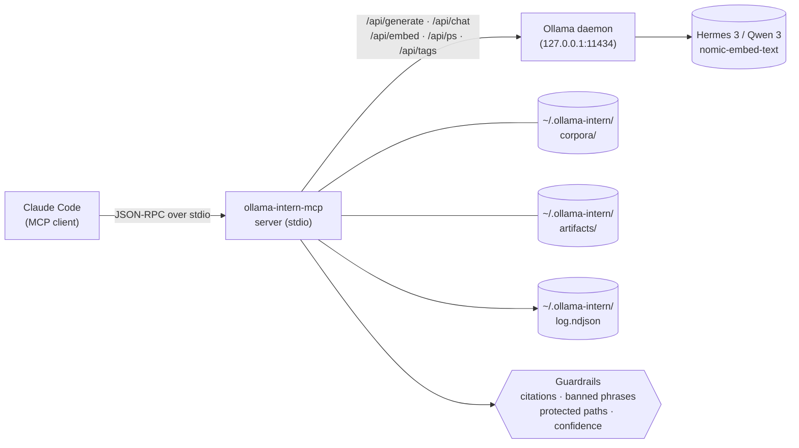

<p align="center">
  <a href="README.ja.md">日本語</a> | <a href="README.md">English</a> | <a href="README.es.md">Español</a> | <a href="README.fr.md">Français</a> | <a href="README.hi.md">हिन्दी</a> | <a href="README.it.md">Italiano</a> | <a href="README.pt-BR.md">Português (BR)</a>
</p>

<p align="center">
  
</p>

<p align="center">
  <a href="https://github.com/mcp-tool-shop-org/ollama-intern-mcp/actions"></a>
  <a href="LICENSE"></a>
  <a href="https://mcp-tool-shop-org.github.io/ollama-intern-mcp/"></a>
  <a href="https://www.npmjs.com/package/ollama-intern-mcp"></a>
  <a href="https://mcp-tool-shop-org.github.io/ollama-intern-mcp/handbook/"></a>
  <a href="#ollama-cloud"></a>
</p>

> **Claude 代码的本地实习生。** <!-- TOOL_COUNT:start -->44<!-- TOOL_COUNT:end --> 具有工作性质的工具、以证据为先的简报、持久的成果。

一个 MCP 服务器，为 Claude 代码提供一个**本地实习生**，配备规则、层级、一张桌子和一个文件柜。Claude 选择_工具_；工具选择_层级_（即时/工作型/深度/嵌入）；该层级会写入一个文件，你可以在下周打开它。

**同时驱动 `hermes3:8b` 上的 [Hermes Agent](https://github.com/NousResearch/hermes-agent)** —— 经过验证的端到端流程，日期为 2026-04-19。默认层级是 `hermes3:8b`；`qwen3:*` 是备用层级。请参阅下方的 [与 Hermes 配合使用](#use-with-hermes)。

**硬件要求：** `hermes3:8b` 需要约 6 GB 的 VRAM，或者 CPU 推理需要约 16 GB 的 RAM。有关完整信息，请参阅 [handbook/getting-started](https://mcp-tool-shop-org.github.io/ollama-intern-mcp/handbook/getting-started/#hardware-minimums)。

**不使用 Claude？** [`examples/`](./examples/) 目录包含一个最小的 Node.js 和 Python MCP 客户端，你可以通过 stdio 启动它。另请参阅 [handbook/with-hermes](https://mcp-tool-shop-org.github.io/ollama-intern-mcp/handbook/with-hermes/)。

**首先是本地**——在选择启用之前，零网络数据传输。没有遥测数据。没有任何“自主”功能。每次调用都会显示其工作过程。

**GPU 不够强大？[Ollama Cloud](#ollama-cloud) 在 600B 级别的模型上运行所有 <!-- TOOL_COUNT:start -->44<!-- TOOL_COUNT:end --> 工具。** 多数人无法在其自己的设备上托管前沿模型——这是本地 AI 的真正瓶颈，而本产品旨在解决这个问题。相同的 `/api/*` 界面、相同的工作性质的工具、相同的信封；嵌入内容保持在本地；任何云端故障都会自动回退到你的本地配置。升级**一次**调用（`backend: "cloud"`），或将所有生成式调用路由到云端（`OLLAMA_CLOUD_PRIMARY=1`）——并且每个信封都会告诉你哪个后端实际处理了它。在设置密钥之前，该功能处于禁用状态。

---

## v2.10.0 版本的新功能

**云端诚实性发布。** v2.9.0 版本发布了每次调用的云端升级功能，并且本 README 广告宣传了“将一次高风险审查升级到 600B 模型”——但 `backend` 输入仅存在于 44 个工具中的**一个**，并且是 `ollama_chat`，其自身描述称其为最后的手段。每个审查性质的工作都被固定到本地的 8B 模型。本地优先策略保持不变：不设置密钥仍然意味着零数据传输，并且没有启动探测，嵌入内容永远不会离开设备，并且每个新旋钮的默认行为都是今天的行为。

- **每次调用的升级现在可以达到 15 个工具，而不是 1 个。** `backend: "cloud"` 是 `research`、`summarize_deep`、`code_review`、`code_citation`、`corpus_answer`、`hypothesis_drill`、`multi_file_refactor_propose`、`refactor_plan`、所有三个简报、所有三个包以及 `chat` 上的可选输入。省略它，行为将与 v2.9.x 版本的行为完全相同。**包仅升级其合成步骤**——证据组装、分类和成果写入保持在本地——并且在执行任何本地工作*之前*，会拒绝无法服务的升级。
- **`INTERN_CLOUD_STANDBY_TIERS`——一次性声明策略。** 指定哪些层级（`instant|workhorse|deep`）在没有每次调用指令的情况下，在备用模式下进行升级。默认情况下为空。每次调用的 `backend` 仍然优先于它。`embed` 在配置加载时*以及*在路由层中都会被拒绝：嵌入内容始终保持在本地。
- **`doctor --cloud-check`——证明密钥实际上有效。** 旧的探测会命中 `/api/tags`，该探测对于无效密钥返回 200，因此身份验证只能读取“未验证”。此功能会运行一次 8 个令牌的生成，并返回 `ok` / `failed` / `unverified` / `unreachable`——出于目的，这四个状态是不同的，因为模型 ID 上的 404 错误不是密钥问题，不应该让你去寻找密钥。它还会报告每个已配置的云 ID 是否存在或不在目录中，并提供最近的可用 ID 建议，以便在支付降级调用的费用之前找到已退役的 ID。
- **已修复：每次 npm 安装都会出现 `init` 错误。** `hermes.config.example.yaml` 没有包含在已发布的 tarball 中，因此二进制文件会向从 npm 安装的任何人报告其自身的“打包错误”。现在它已经包含在内，并且 CI 会安装并运行打包的 tarball，因此它不会再次出现。
- **检索分数终于可以进行比较。** `CorpusHit.score` 在一个字段下包含四个不可比较的比例——默认的混合模式最高达到 `0.0328`，而 `corpus_min_evidence_score` 的文档显示为“0–1”，因此一个 `0.1` 的自然下限会静默地丢弃每个语料库块。融合后的分数会重新缩放到 0–1，并且每个命中都会携带 `score_scale`。

完整详细信息请参阅 [CHANGELOG.md](./CHANGELOG.md)。

## v2.9.0 版本的新功能

**云功能发布——跨家族验证通道、按需云端升级以及经济效益。** 本地优先策略保持不变：如果没有设置密钥，行为将与 v2.8.0 版本的行为完全相同（零数据传输，没有启动云端探测）。

- **`ollama_verify_claims` — 跨模型验证。** `ollama_code_review` *生成*结果；然后*评估*这些结果。它在一个不共享模型的 Ollama Cloud 主流面板（默认情况下为 deepseek / kimi / glm）上运行您的声明 + 证据，并返回每个声明的“已确认/已驳斥/需要审核”结果。聚合采用“少数服从多数”原则（需要 ≥2 才能驳斥，≥2 才能确认），每个评审员都经过模型验证（排除本地回退或替代模型，不计入），并且声明输入经过结构化处理，去除了推理部分。诚实上限已记录：已确认表示存在支持证据，而非绝对证明——在标记明显错误方面可靠，但在识别前沿模型中的细微错误方面效果较弱。
- **每次调用时的云端升级 + 待机模式。** 设置 `OLLAMA_API_KEY` *单独*（不使用 `OLLAMA_CLOUD_PRIMARY`），您将进入**待机模式**：本地优先，零数据传输，无启动探测——直到单个调用通过 `backend:'cloud'` 选择加入。无需将每个调用都切换到云端，即可将一个重要的审核升级到 600B 模型。第一次升级会在发生时明确显示数据传输；每次调用的 `model` 覆盖现在会逐字传递到云端尝试。
- **`ollama_log_stats` — 标语中承诺的衡量经济效益。** 对您的 NDJSON 收据进行无 LLM 汇总：云端/本地拆分、云端→本地回退率、每个工具的令牌数、p50/p95 延迟，受 `since` 窗口限制。
- **用于 CI 的医生 + 可机器读取的工具。** `doctor --json --fail-unhealthy` 为流水线提供了一个真正的网关（带有云感知 `healthy` 标志），并且每个工具现在都带有 MCP `readOnlyHint`/`destructiveHint`/`title` 注释，以便客户端获得正确的权限用户体验。此外，`init --claude` 提供了可粘贴的 `.mcp.json`。

完整详细信息请参见 [CHANGELOG.md](./CHANGELOG.md)。

## v2.8.0 版本的新功能

**可靠性、耐用性和安全性强化 — 25 处修复，每一处都先进行测试，然后进行跨模型验证。** 本地优先行为未更改，并且没有删除任何工具协议；现有的调用者可以继续使用。主要的改进：

- **不再出现无声的语料库数据丢失。** 在 `ollama_corpus_refresh` 期间（例如，Windows 文件锁、防病毒软件阻止、编辑器的保存窗口）发生瞬时读取错误时，该文件过去会被标记为“丢失”，并且**永久删除其索引内容**。现在，只有真正不存在的文件才会被删除；瞬时错误会保留路径，标记为需要重试，并保留其数据块。
- **并发性能够遵守其预算。** 某个层级的超时现在可以取消仍在排队等待获取许可的调用（过去会超出预算，并且收据显示其他结果），并且 `ollama_chat` 最终会通过超时/层级边界进行路由——因此，一个卡住的本地生成过程不会导致所有工具都停止工作，并且在云端优先模式下，它实际上可以访问云端。
- **云端在出现故障时会降级，而不是崩溃。** 停用的云端模型 ID 现在会回退到本地，并提供明确的 `cloud_model_missing` 原因和云端特定的提示，而不是完全中断；断路器不会永久卡住；一个持续丢失的模型将停止在每次调用时进行云端往返。
- **安全表面与其文档相符。** `ollama_batch_proof_check` 现在真正强制执行 cwd 隔离（具有新的操作符环境限制 `INTERN_BATCH_PROOF_ALLOWED_ROOTS`，调用者无法扩大），提示注入清理程序获得了覆盖范围 + 诚实披露的上限，并且受保护路径保护在 macOS 上也区分大小写。
- **诚实的人工制品和收据。** 数据包写入是原子的，并且绝不会无声地覆盖；降级的批处理信封会报告实际使用的层级；中断写入检测器会捕获任何突变上的撕裂写入；数据块 ID 不再在内容相同的文件中发生冲突。依赖项审核完全清晰（0 个漏洞）。

完整详细信息请参见 [CHANGELOG.md](./CHANGELOG.md)。

## v2.7.0 版本的新功能

**可选的 Ollama Cloud 路由 — 云端优先，本地回退。** 通过密钥 + 标志选择加入，生成层级将路由到 600B 级别的云端模型；嵌入保持本地；断路器会在任何云端故障时回退到您的本地配置文件。**默认情况下禁用 — 除非您同时设置 `OLLAMA_API_KEY` 和 `OLLAMA_CLOUD_PRIMARY=1`，否则不会产生任何数据传输。** 附加的次要更新 — 2.7.0 之前的调用者（以及任何未选择加入的人）将看到字节完全相同的行为。请参阅 [Ollama Cloud](#ollama-cloud)。

- **云端优先，并具有安全保障。** `RoutingOllamaClient` 首先尝试云端，并在超时 / 5xx / 429 / 网络错误时回退到本地配置文件。无效的密钥（401/403）会通过持久断路器明确显示，而不是永久降级；停用/拼写错误的云端模型 ID（404）也会显示。
- **绝不会出现无声降级。** 每个信封都包含 `backend`（`cloud`|`local`）、`degraded` 和 `degrade_reason`，因此您始终知道是否获得了本地模型，而不是大型模型。一个 `backend_fallback` NDJSON 事件使云端→本地回退率在 `ollama_log_tail` 中可见。
- **`ollama_doctor` 报告云端身份验证 + 可访问性**，作为一个单独的块；`ollama-intern-mcp doctor` 显示一个 `Cloud (primary)` 部分。
- 默认云端模型在 v2.7.0 版本发布时为 `minimax-m3:cloud` *(后来重新固定到 `qwen3-coder-next:cloud` — 一个经过思考的默认值，在受限的 `num_predict` 工具上返回空回复；请参阅 [env 表](#cloud-env-vars))*；可以通过 `INTERN_CLOUD_MODEL` / `INTERN_CLOUD_DEEP_MODEL` 按层级进行覆盖。

## v2.6.0 版本的新功能

每次调用的层级预算覆盖在 `ollama_extract` 上。附加的次要更新 — 2.6.0 之前的调用者不受影响。详细信息请参见 [CHANGELOG.md](./CHANGELOG.md)。

- **`tier_budget_ms_override?: number` 模式字段在 `ollama_extract` 上**（可选，限制为 `[1, 600000]` 毫秒）。如果存在，则将覆盖应用于运行器访问的每个层级，以便 `src/guardrails/timeouts.ts:61` 处的内部 `runWithTimeoutAndFallback` 机制遵守操作员提供的预算，而不是配置文件中的默认值。级联（工作线程 → 瞬时超时）仍然会触发；覆盖会统一控制每个级联跳跃。
- **为什么存在此功能。** research-os R-018 包装器（v0.12.1）使用 `Promise.race` 包装了 MCP `callTool`，并发现包装器的预算没有达到内部层级——`DEV_RTX5080_TIMEOUTS.instant = 15_000` 无论 180000 毫秒的包装器预算如何，仍然会以 15000 毫秒的频率触发 `TIER_TIMEOUT`。v2.6.0 提供了 MCP 端权威预算，因此操作员的 `--planner-timeout-ms` 标志（research-os）最终可以按照设计控制内部层级的超时。
- **保留默认行为。** 如果省略该字段，则配置文件默认值将完全控制。v2.6.0 之前的调用者不会看到任何变化。
- **保留 R-010 回退原因正则表达式。** 服务器端的 `TIER_TIMEOUT` 错误消息仍然匹配 `/elapsed=(\d+)ms/` + `/budget=(\d+)ms/`，因此下游的 AI 顾问可见性在覆盖和默认路径上都能正常工作。
- research-os v0.13.0 在协调的多仓库发布中使用了此功能（累积 R-019 客户端连接 + R-020 + R-021）。

### 历史版本 — v2.4.0 的交付内容

有关 v2.4.0 的完整信息，请参阅 [CHANGELOG.md](./CHANGELOG.md) 和 [docs/release-notes/v2.4.0.md](./docs/release-notes/v2.4.0.md）（配置文件系统中的每个层级的 `num_ctx` 控制）。

## v2.4.0 中的新功能

配置文件系统中的每个层级的 `num_ctx`（上下文窗口）控制。附加的次要版本——v2.3.0 的调用者不受影响。有关详细信息，请参阅 [CHANGELOG.md](./CHANGELOG.md) 和 [docs/release-notes/v2.4.0.md](./docs/release-notes/v2.4.0.md)。

- **`TierConfig.num_ctx` 映射（新增）**——配置文件的可选 `{ instant?, workhorse?, deep?, embed? }`。当设置为某个层级时，MCP 服务器会在路由到该层级的每个 Ollama generate/chat 请求中放置 `options.num_ctx = <value>`（初始 + 回退）。如果未设置，则请求将完全省略 `num_ctx`，因此 Ollama 将使用其模型加载的默认值——完全保留 v2.3.0 的行为。
- **新的信封字段 `num_ctx_used?: number`**——仅当 MCP 服务器实际发送 `num_ctx` 时才存在。如果请求允许 Ollama 选择，则不存在。不要推断默认值——MCP 服务器不会查询 Ollama 以获取有效值。
- **配置文件默认值：**`dev-rtx5080` / `dev-rtx5080-qwen3` 随 `instant: 4096`、`workhorse: 8192`、`deep`/`embed` 一起提供，这些值均为未设置。大小设置为在 RTX 5080 的 16GB VRAM 预算中保留 `hermes3:8b`，以便快速使用工具。`m5-max` 使每个层级的值都为未设置——128GB 统一内存没有溢出问题。
- **解决了 v0.8.0 第 1 阶段的诊断问题**——在 RTX 5080 上的默认 32K 上下文中，`hermes3:8b` 溢出到 CPU，并开始导致工作线程 `ollama_extract` 调用超时。v2.4.0 在配置文件层面上防止了这种情况。

### 每个层级的 `num_ctx` 控制（v2.4.0 中的新增功能）

配置文件（摘自 `src/profiles.ts`）：

```ts
"dev-rtx5080": {
  tiers: {
    instant: "hermes3:8b",
    workhorse: "hermes3:8b",
    deep: "hermes3:8b",
    embed: "nomic-embed-text",
    num_ctx: {
      instant: 4096,    // fast classify/summarize
      workhorse: 8192,  // schema-bound extract / batch
      // deep: UNSET — long-context briefs keep current behavior
      // embed: UNSET — no context-window pressure on embed
    },
  },
  // ... timeouts, prewarm
}
```

工作线程层级调用的信封（例如 `ollama_extract`）：

```jsonc
{
  "result": { /* extracted data */ },
  "tier_used": "workhorse",
  "model": "hermes3:8b",
  "num_ctx_used": 8192,        // present because the profile set workhorse=8192
  // ... rest of envelope unchanged
}
```

在 `m5-max` 上（或任何将层级设置为未设置状态的配置文件中），信封中不存在 `num_ctx_used`，并且发送到 Ollama 的线路请求不包含 `num_ctx` 字段——Ollama 使用其模型加载的默认值。

操作员通过选择/编辑配置文件来调整；工具模式中没有每个调用的 `num_ctx` 输入。如果未来的调用表明有必要，则模式将遵循 v2.3.0 的 `model` 覆盖。

### 历史版本 — v2.3.0 的交付内容

有关 v2.3.0 的完整信息，请参阅 [CHANGELOG.md](./CHANGELOG.md) 和 [docs/release-notes/v2.3.0.md](./docs/release-notes/v2.3.0.md）（每个调用的模型覆盖）。

## v2.3.0 中的新功能

所有基于 LLM 的原子工具的每个调用模型覆盖。附加的次要版本——v2.2.0 的调用者不受影响。有关详细信息，请参阅 [CHANGELOG.md](./CHANGELOG.md) 和 [docs/release-notes/v2.3.0.md](./docs/release-notes/v2.3.0.md)。

- **8 个原子工具上的可选 `model: string` 输入**——`ollama_extract`、`ollama_classify`、`ollama_summarize_fast`、`ollama_summarize_deep`、`ollama_research`、`ollama_corpus_answer`、`ollama_chat`、`ollama_code_citation`。工具的第一个尝试在其层级上使用调用者指定的模型进行；如果超时，现有的 `TIER_FALLBACK` 级联将解析更便宜的层级自己的模型（而不是调用者的覆盖）。组合/简短/打包工具不会接受 `model`——原子工具具有每个调用的控制权，组合工具使用层级默认值。
- **新的信封字段 `model_requested?: string`**——仅当提供了覆盖时才存在。了解校准的调用者会比较 `model_requested` 与 `model`，以检测回退替换：`if (env.model_requested && env.model !== env.model_requested) { /* substitution */ }`。空/仅包含空格的输入会在模式解析时引发 `ZodError`，而不是静默回退。
- **错误修复——`src/version.ts` 漂移。** 运行时 `VERSION` 常量现在在模块加载时从 `package.json` 读取；v2.1.0 和 v2.2.0 提供了过时的 `"2.0.0"` 标识字符串。新的 `tests/version.test.ts` 锁定了 `VERSION === pkg.version`。

### 每个调用的模型覆盖（v2.3.0 中的新增功能）

```jsonc
{
  "tool": "ollama_classify",
  "arguments": {
    "text": "patch null pointer in auth",
    "labels": ["feat", "fix", "chore"],
    "frame": "what is the change kind?",
    "model": "hermes3:8b"
  }
}
```

信封：

```jsonc
{
  "result": { "label": "fix", "confidence": 0.9, "off_topic": false, ... },
  "tier_used": "instant",
  "model": "hermes3:8b",
  "model_requested": "hermes3:8b",       // present because override was supplied
  // ... rest of envelope unchanged
}
```

如果工作线程/深度层级已超时，并且调用已级联到瞬时层级，则 `env.model` 将是瞬时层级解析的模型，而 `env.fallback_from` 将是 `"workhorse"`——`env.model_requested` 仍然是 `"hermes3:8b"`，并且 `env.model !== env.model_requested` 是替换信号。覆盖不会有意地传递到更便宜的层级；所选的模型可能完全不适合该层级的角色。

### 历史版本 — v2.2.0 的交付内容

有关 v2.2.0 的完整信息，请参阅 [CHANGELOG.md](./CHANGELOG.md) 和 [docs/release-notes/v2.2.0.md](./docs/release-notes/v2.2.0.md）（基于帧的专题性和结构化弃权）。

## v2.2.0 中的新功能

本地证据工作者角色协议：基于帧的专题性和结构化弃权。附加的次要版本——v2.1.0 的调用者不受影响。有关详细信息，请参阅 [CHANGELOG.md](./CHANGELOG.md) 和 [docs/release-notes/v2.2.0.md](./docs/release-notes/v2.2.0.md)。

- **框架约束提取**，应用于 `ollama_extract`、`ollama_classify`、`ollama_summarize_fast`、`ollama_summarize_deep` —— 可选的 `frame: string` 输入 + 结构化的 `frame_alignment` / `on_topic` / `frame_addressed` 输出。对于不相关的内容，系统会进行标记，而不是将其改写成符合模式的内容。
- **结构化弃权**，应用于 `ollama_research` —— `weak` / `abstained` / `sources_address_question` 字段。如果 `citations[]` 为空，但 `answer` 不为空，则不再被视为成功。
- **主题相关性阈值**，应用于 `ollama_corpus_answer` —— 可选的 `min_top_score`。如果低于阈值，该工具将使用 `abstained: true` 提前结束，并跳过合成。每个引用的 `score` 现在都显示在每个引用中。
- **检索分数保留**，通过简短的证据 —— `corpusHitsToEvidence` 携带 `score`（以及 `corpus_min_evidence_score` 旋钮过滤器，在 `incident_brief` / `repo_brief` / `change_brief` 上进行组装时）。
- **引用行范围边界** —— `guardrails/citations.ts` 拒绝超出 `ollama_research` 范围的引用，与 `ollama_code_citation` 上的现有行为保持一致。
- **操作者协议文档已更正** —— README `chunk_id`/`chunk_index` 已修复，“服务器端验证”已重写，证据法部分已进行补充说明，营销口号已添加注释。

### 种子回归 —— 验证

该切片协议针对字面意义上的 research-os 快速打包失败进行验证：arxiv 2112.10422（宇宙学标准计时器），位于 section-01 框架“在本地优先与云端 LLM 深度研究工作流程中，证据保管意味着什么？”——9 / 9 个模拟 LLM 协议测试确认，现在不相关的内容已被包含（`frame_alignment.on_topic = false` 用于提取；`off_topic: true` 用于分类；`frame_addressed: false` 用于 summarize_deep；`abstained: true` 用于 corpus_answer，并设置了 `min_top_score`）。

### 历史 —— v2.1.0 交付成果

有关完整的 v2.1.0 条目（功能通过：13 个新工具 + 4 个增强 + 冻结解除），请参阅 [CHANGELOG.md](./CHANGELOG.md)。

---

## 架构概览


```mermaid
flowchart LR
  Claude["Claude Code<br/>(MCP client)"]
  MCP["ollama-intern-mcp<br/>server (stdio)"]
  Ollama["Ollama daemon<br/>(127.0.0.1:11434)"]
  Models[("Hermes 3 / Qwen 3<br/>nomic-embed-text")]
  Corpus[("~/.ollama-intern/<br/>corpora/")]
  Artifacts[("~/.ollama-intern/<br/>artifacts/")]
  NDJSON[("~/.ollama-intern/<br/>log.ndjson")]
  Guards{{"Guardrails<br/>citations · banned phrases<br/>protected paths · confidence"}}

  Claude -- "JSON-RPC over stdio" --> MCP
  MCP --> Guards
  MCP -- "/api/generate · /api/chat<br/>/api/embed · /api/ps · /api/tags" --> Ollama
  Ollama --> Models
  MCP --- Corpus
  MCP --- Artifacts
  MCP --> NDJSON
```

Every Claude tool call enters the MCP server over stdio JSON-RPC. The server validates the call against the tool's [zod](https://zod.dev) schema, runs the configured guardrails (citation validation, banned-phrase strip, protected-path enforcement, confidence thresholds), then routes to either a deterministic renderer (artifact tier) or an Ollama HTTP call (every other tier). The Ollama daemon never sees user-supplied paths — only the model tier and the prepared prompt. Every call appends one structured event to the NDJSON log at `~/.ollama-intern/log.ndjson`, where `ollama_log_tail` and your shell can read it.

---

## 示例 —— 一次调用，一个工件

```jsonc
// Claude → ollama-intern-mcp
{
  "tool": "ollama_incident_pack",
  "arguments": {
    "title": "sprite pipeline 5 AM paging regression",
    "logs": "[2026-04-16 05:07] worker-3 OOM killed\n[2026-04-16 05:07] ollama /api/ps reports evicted=true size=8.1GB\n...",
    "source_paths": ["F:/AI/sprite-foundry/src/worker.ts", "memory/sprite-foundry-visual-mastery.md"]
  }
}
```

返回一个指向磁盘上文件的信封：

```jsonc
{
  "result": {
    "pack": "incident",
    "slug": "2026-04-16-sprite-pipeline-5-am-paging-regression",
    "artifact_md":   "~/.ollama-intern/artifacts/incident/2026-04-16-sprite-pipeline-5-am-paging-regression.md",
    "artifact_json": "~/.ollama-intern/artifacts/incident/2026-04-16-sprite-pipeline-5-am-paging-regression.json",
    "weak": false,
    "evidence_count": 6,
    "next_checks": ["residency.evicted across last 24h", "OLLAMA_MAX_LOADED_MODELS vs loaded size"]
  },
  "tier_used": "deep",
  "model": "hermes3:8b",
  "hardware_profile": "dev-rtx5080",
  "tokens_in": 4180, "tokens_out": 612,
  "elapsed_ms": 8410,
  "residency": { "in_vram": true, "evicted": false }
}
```

→ `weak: false` 表示组装了 ≥2 个证据项目；这并不意味着已经验证了假设。请参阅下方的 [证据法](#evidence-laws)。

该 markdown 文件是实习生的工作成果——标题、带有引用 ID 的证据块、调查 `next_checks`、如果证据不足，则显示 `weak: true` 标志。它是确定性的：渲染器是代码，而不是提示。（渲染器是确定性的；假设和表面的*内容*是生成的——将其视为草稿，而不是已验证的内容。）明天打开它，下周进行差异比较，将其导出到手册中，并使用 `ollama_artifact_export_to_path`。

该领域的每个竞争对手都以“节省令牌”作为卖点。我们则以“这是实习生写的文件”作为卖点。

### 第二个示例 —— 构建一个语料库，然后进行提问

```jsonc
// 1. Build a persistent, searchable corpus over your project.
{ "tool": "ollama_corpus_index",
  "arguments": { "name": "sprite-foundry",
                 "paths": ["F:/AI/sprite-foundry/src"],
                 "embed_model": "nomic-embed-text" } }
// → { chunks_written: 1204, paths_indexed: 312, failed_paths: [] }

// 2. Ask an evidence-bound question against it.
{ "tool": "ollama_corpus_answer",
  "arguments": { "name": "sprite-foundry",
                 "query": "how does the worker handle OOM eviction?",
                 "top_k": 8 } }
// → { answer: "...", citations: [{chunk_index, path}...], weak: false }
```

服务器会验证引用的身份，并验证每个 `chunk_index` 是否在检索结果的范围内。它不会证明生成的每个声明在语义上都得到引用的内容块的支持——这是模型的责任，并且较弱的检索仍然可以生成类似引用的答案。完整的演示过程请参见 [handbook/corpora](https://mcp-tool-shop-org.github.io/ollama-intern-mcp/handbook/corpora/)。

---

## 框架约束提取（v2.2.0 中的新功能）

`ollama_extract`、`ollama_classify`、`ollama_summarize_fast` 和 `ollama_summarize_deep` 接受可选的 `frame: string` 输入。框架定义了源被要求回答的问题；模型被指示放弃，而不是发出真实但与框架无关的内容，如果源没有解决该框架。

```jsonc
{
  "tool": "ollama_extract",
  "arguments": {
    "text": "<long source document>",
    "schema": { /* your fields */ },
    "frame": "section purpose here — e.g. 'OOM eviction behavior in the sprite worker'"
  }
}
// → result includes frame_alignment: { on_topic: boolean, reason: string, unaddressed_aspects: string[] }
```

If `frame` is omitted, behavior is unchanged from v2.1.0. When supplied, `frame_alignment.on_topic = false` signals that extracted fields may be true-of-the-source but not relevant to the frame — treat that as the same shape as a `weak: true` brief: useful, but spot-check before promoting into downstream evidence.

---

## 弃权协议（v2.2.0 中的新功能）

`ollama_research` 返回结构化弃权字段：`weak: boolean`、`abstained: boolean`、`sources_address_question: boolean | null`。如果 `citations[]` 为空，但 `answer` 不为空，则不再被视为成功——`abstained: true` 表示模型拒绝进行合成，因为调用者提供的路径没有解决问题。将弃权视为成功，而不是失败：这是该工具拒绝将较弱的检索结果转化为权威输出。

`ollama_corpus_answer` 接受可选的 `min_top_score: number` 主题相关性阈值（0.0–1.0）。当查询的最高检索分数低于 `min_top_score` 时，该工具将使用 `abstained: true` 提前结束，并跳过合成——从而防止了 v2.1.0 `weak: true` 规则未能捕获的“5 个不相关的内容块，其分数均为 0.21，仍然可以生成完整的答案”的失败模式（`weak: true` 仅在 `hits.length < 2` 上触发）。将其与每个引用的 `score` 字段结合使用，该字段现在显示在每个引用中，以便直接从信封中审核检索质量。

---

## 这里有什么 —— 四个层级，<!-- TOOL_COUNT:start -->44<!-- TOOL_COUNT:end --> 个工具

**任务型**意味着每个工具都定义了您会交给实习生的任务——对这些内容进行分类、提取这些内容、对这些日志进行分类、起草此版本说明、打包此事件。该工具的输入是任务规范；输出是交付成果。没有通用的 `run_model` / `chat_with_llm` 原始指令。

| 层级 | 数量 | 这里有什么 |
|---|---|---|
| **Atoms** | 31 | 任务导向的基本模块。**原始 15 个：** `classify`、`extract`、`triage_logs`、`summarize_fast` / `deep`、`draft`、`research`、`corpus_search` / `answer` / `index` / `refresh` / `list`、`embed_search`、`embed`、`chat`。**v2.1.0 版本新增 13 个：** `doctor`、`log_tail`、`batch_proof_check`（操作）；`code_map`、`code_citation`、`multi_file_refactor_propose`、`refactor_plan`（重构）；`artifact_prune`、`hypothesis_drill`（工件/概要）；`corpus_health`、`corpus_amend`、`corpus_amend_history`、`corpus_rerank`（语料库）。**+1 个审查原子：** `code_review`（结构化的 PR 审查结果，核心组件；仅用于审查）。**v2.9 版本新增 2 个：** `verify_claims`（跨系列云旗舰面板评估声明；需要云环境）和 `log_stats`（将 NDJSON 记录汇总为可衡量的经济指标——云/本地拆分、回退率、每个工具的 p50/p95；不调用模型）。支持批量处理的原子（`classify`、`extract`、`triage_logs`）接受 `items: [{id, text}]`。 |
| **Briefs** | 3 | 基于证据的结构化操作员概要。`incident_brief`、`repo_brief`、`change_brief`。每个声明都引用了一个证据 ID；服务器端会删除未知信息。弱证据会显示 `weak: true`，而不是虚假叙述。 |
| **Packs** | 3 | 固定流水线的复合任务，将持久的 Markdown + JSON 写入 `~/.ollama-intern/artifacts/`。`incident_pack`、`repo_pack`、`change_pack`。确定性渲染器——不调用工件形状上的模型。 |
| **Artifacts** | 7 | 在包输出之上进行连续性处理。`artifact_list` / `read` / `diff` / `export_to_path`，以及三个确定性代码片段：`incident_note`、`onboarding_section`、`release_note`。 |

总计：**31 个原子 + 3 个概要 + 3 个包 + 7 个工件工具 = <!-- TOOL_COUNT:start -->44<!-- TOOL_COUNT:end -->**。

冻结行：
- 原子：**在 v2.1.0 版本中解除冻结**（当前 31 个；在 v2.1.0 功能版本中新增 13 个，之后新增 1 个 `code_review`，在 v2.9 中新增 2 个：`verify_claims`、`log_stats`）。新的原子仍然需要经过审计验证的差距、测试、手册页面和 CHANGELOG 条目——不允许随意添加。
- 包在 3 个时冻结。没有新的包类型。
- 工件层在 7 个时冻结。

完整的工具参考资料位于 [手册](https://mcp-tool-shop-org.github.io/ollama-intern-mcp/handbook/tools/) 中。

---

## 安装

需要在本地运行 [Ollama](https://ollama.com)，并拉取分层模型（请参阅下面的 [模型拉取](#model-pulls)）。

### Claude Code（推荐）

大多数用户通过将其添加到他们的 Claude Code MCP 服务器配置中来安装它——不需要全局安装。Claude Code 通过 `npx` 按需运行服务器：

```json
{
  "mcpServers": {
    "ollama-intern": {
      "command": "npx",
      "args": ["-y", "ollama-intern-mcp"],
      "env": {
        "OLLAMA_HOST": "http://127.0.0.1:11434",
        "INTERN_PROFILE": "dev-rtx5080"
      }
    }
  }
}
```

### Claude Desktop

相同的代码块，写入 `~/Library/Application Support/Claude/claude_desktop_config.json`（macOS）或 `%APPDATA%\Claude\claude_desktop_config.json`（Windows）。

### 全局安装（高级）

只有在您希望在 `PATH` 中使用二进制文件进行 Claude Code 之外的临时使用时，才需要这样做：

```bash
npm install -g ollama-intern-mcp
```

### 与 Hermes 配合使用

此 MCP 已通过 [Hermes Agent](https://github.com/NousResearch/hermes-agent) 在 Ollama 上对 `hermes3:8b` 进行端到端验证（2026-04-19）。Hermes 是一个外部代理，它*调用*此 MCP 的冻结基本模块——它进行规划，我们完成工作。

参考配置（此存储库中的 [hermes.config.example.yaml](hermes.config.example.yaml)）：

```yaml
model:
  provider: custom
  base_url: http://localhost:11434/v1
  default: hermes3:8b
  context_length: 65536    # Hermes requires 64K floor under model.*

providers:
  local-ollama:
    name: local-ollama
    base_url: http://localhost:11434/v1
    api_mode: openai_chat
    api_key: ollama
    model: hermes3:8b

mcp_servers:
  ollama-intern:
    command: npx
    args: ["-y", "ollama-intern-mcp"]
    env:
      OLLAMA_HOST: http://localhost:11434
      INTERN_PROFILE: dev-rtx5080
      # hermes3:8b is the default ladder in v2.0.0, so tier overrides are
      # only needed if you're pinning a different local model.
```

**提示形式很重要。** 强制性的工具调用提示（“使用参数调用 X……”）是集成测试——它们为 8B 本地模型提供了足够的框架，使其能够生成干净的 `tool_calls`。列表形式的多任务提示（“执行 A，然后执行 B，然后执行 C”）是较大模型的性能基准；不要将列表形式的失败解释为“连接中断”。请参阅 [handbook/with-hermes](https://mcp-tool-shop-org.github.io/ollama-intern-mcp/handbook/with-hermes/)，了解完整的集成演练 + 已知的传输注意事项（Ollama `/v1` 流式传输 + openai-SDK 非流式传输 shim）。

### 模型拉取

**默认开发配置文件（RTX 5080 16GB 及类似配置）：**

```bash
ollama pull hermes3:8b
ollama pull nomic-embed-text
export OLLAMA_MAX_LOADED_MODELS=2
```

**Qwen 3 替代方案（相同的硬件，用于 Qwen 工具）：**

```bash
ollama pull qwen3:8b
ollama pull qwen3:14b
ollama pull nomic-embed-text
export INTERN_PROFILE=dev-rtx5080-qwen3
```

**M5 Max 配置文件（128GB 统一内存）：**

```bash
ollama pull qwen3:14b
ollama pull qwen3:32b
ollama pull nomic-embed-text
export INTERN_PROFILE=m5-max
```

每个分层环境变量（`INTERN_TIER_INSTANT`、`INTERN_TIER_WORKHORSE`、`INTERN_TIER_DEEP`、`INTERN_EMBED_MODEL`）仍然可以覆盖配置文件中的设置，以进行一次性操作。

**驻留。** 在开发配置文件中，服务器会在启动时使用**有限的** `keep_alive`（10 分钟）预热 Instant 模型，因此第一次调用不会是冷启动；在任何实际调用之后，Ollama 自己的空闲驱逐（默认在上次请求后 5 分钟）会生效。设置 `INTERN_PREWARM=off` 以完全跳过启动预热——当 GPU 与训练或渲染共享时，这是正确的模式：模型在首次使用时加载，并在自身空闲时退出。增加 `OLLAMA_KEEP_ALIVE` 是为专门用于 Ollama 的盒子准备的；`-1` 会将每个访问过的模型固定在 VRAM 中，直到服务器重新启动。

---

## 统一信封

每个工具都返回相同的格式：

```ts
{
  result: <tool-specific>,
  tier_used: "instant" | "workhorse" | "deep" | "embed",
  model: string,
  hardware_profile: string,     // "dev-rtx5080" | "dev-rtx5080-qwen3" | "m5-max"
  tokens_in: number,
  tokens_out: number,
  elapsed_ms: number,
  residency: {
    in_vram: boolean,
    size_bytes: number,
    size_vram_bytes: number,
    evicted: boolean
  } | null
}
```

`residency` 来自 Ollama 的 `/api/ps`。当 `evicted: true` 或 `size_vram < size` 时，模型分页到磁盘，推理速度下降 5-10 倍——将其显示给用户，以便他们知道需要重新启动 Ollama 或减少已加载的模型数量。

在 [Ollama Cloud](#ollama-cloud) 模式下，信封还携带 `backend`（`"cloud"` | `"local"`），并且在云到本地的回退中，携带 `degraded: true` + `degrade_reason`。这些字段在默认的仅本地路径中**不存在**，因此现有的消费者不受影响。`residency` 对于云端提供的调用是 `null`（无状态云没有本地 VRAM 驻留）。

每次调用都会作为一条 NDJSON 行记录到 `~/.ollama-intern/log.ndjson`。通过 `hardware_profile` 进行过滤，以防止开发数据出现在可发布的基准测试中。

---

## 硬件配置文件

| 配置文件 | Instant | Workhorse | Deep | Embed |
|---|---|---|---|---|
| **`dev-rtx5080`**（默认） | hermes3 8B | hermes3 8B | hermes3 8B | nomic-embed-text |
| `dev-rtx5080-qwen3` | qwen3 8B | qwen3 8B | qwen3 14B | nomic-embed-text |
| `m5-max` | qwen3 14B | qwen3 14B | qwen3 32B | nomic-embed-text |

**默认开发** 将所有三个工作层合并到 `hermes3:8b` 中——经过验证的 Hermes Agent 集成路径。从上到下使用相同的模型意味着只需拉取一个，有一个驻留成本，并且只需了解一组行为。如果用户更喜欢 Qwen 3（具有其 `THINK_BY_SHAPE` 管道），可以选择 `dev-rtx5080-qwen3`。`m5-max` 是 Qwen 3 梯队，其大小适合统一内存。

---

## Ollama Cloud

**硬件限制已解除。** 大多数机器实际上可以容纳 8B 的本地模型，这是几乎所有人都遇到的瓶颈——不是预算，也不是兴趣，而是 VRAM。 [Ollama Cloud](https://ollama.com/cloud) 在**相同**的`/api/*`界面背后提供 600B 级别的模型，因此大型工具可以在前沿模型上运行，并且您的 VRAM 可以用于其他需要它的任务。本地模式始终作为备用方案，因此您可以在不失去基本功能的条件下获得更高的性能。

工具界面的任何内容都不会改变：相同的<!-- TOOL_COUNT:start -->44<!-- TOOL_COUNT:end -->个工具，相同的范围，相同的安全措施。嵌入模型永远不会上传到云端（Ollama Cloud 不提供嵌入模型），因此无论如何，语料库都将完全保留在本地。

**默认禁用，用户可以选择启用。** 如果未设置密钥，该软件包将始终优先使用本地模式，并且**不会产生任何数据传输**——任何未选择启用的人都不会受到影响。有两种方法可以启用：

- **云优先**（如下所示）：同时设置*两个*`OLLAMA_CLOUD_PRIMARY=1`和`OLLAMA_API_KEY`——生成层将路由到云端，并使用本地备用方案。
- **云备用**（v2.9）：仅设置**`OLLAMA_API_KEY`**——所有内容都将保留在本地（仍然不会产生任何数据传输，甚至不会进行启动探测），直到单个调用明确请求使用`backend: "cloud"`进行升级。请参阅下方的[云备用和每次调用升级](#cloud-standby--per-call-escalation)。

```json
{
  "mcpServers": {
    "ollama-intern": {
      "command": "npx",
      "args": ["-y", "ollama-intern-mcp"],
      "env": {
        "OLLAMA_CLOUD_PRIMARY": "1",
        "OLLAMA_API_KEY": "sk-...your-key...",
        "INTERN_PROFILE": "dev-rtx5080"
      }
    }
  }
}
```

> **密钥是一个运行时环境变量，而不是 CI 密钥。** GitHub Actions 密钥仅在 CI 运行期间可见——它永远不会到达正在运行的服务器。在 [ollama.com/settings/keys](https://ollama.com/settings/keys) 创建一个密钥，并将其放入您的 MCP 客户端的`env`块中（或您的 shell 环境变量中）。

**路由的工作原理。** 当启用云功能时，生成层（即时/主力/深度）将路由到云模型；**嵌入模型始终保留在本地**（Ollama Cloud 不提供嵌入模型，因此语料库/嵌入工具不受影响）。一个熔断器首先尝试连接到云端，如果超时/出现 5xx/429/网络错误，则回退到您的本地配置文件。一个无效的密钥（401/403）会触发一个*持久*熔断器，该熔断器会发出明显的警告，而不是默默地降级。本地配置文件（`INTERN_PROFILE`）是回退层级，因此请确保其模型已下载。

**您永远不会被默默地降级。** 每个请求都会报告哪个后端服务了该请求：

```ts
{ ...envelope, backend: "cloud" | "local", degraded?: true, degrade_reason?: "cloud_timeout" | "cloud_5xx" | "cloud_rate_limited" | "cloud_unreachable" | "cloud_auth_failed" | "circuit_open" }
```

每次从云端回退到本地时，都会在`~/.ollama-intern/log.ndjson`中记录一行`backend_fallback`（`ollama_log_tail --filter_kind backend_fallback`），并且`ollama-intern-mcp doctor`会显示一个**云（主要 | 备用）**块，其中包含模式、可访问性和身份验证状态。

### 云备用和每次调用升级

仅设置`OLLAMA_API_KEY`**而不**设置`OLLAMA_CLOUD_PRIMARY`会启用**备用**模式：路由将保持本地优先，并且没有任何内容会离开该机器——直到某个调用包含`backend: "cloud"`（在`ollama_chat`中公开，由`ollama_verify_claims`内部使用）。该调用将升级到云模型，并使用相同的熔断器+本地回退机制和相同的请求来源；所有其他调用都将保留在本地。**第一个**升级的调用会在标准错误流中打印一条明确的披露信息，并向 NDJSON 日志写入一行`cloud_egress`——数据传输会在发生时进行披露，而不仅仅是在本文档中。

规则（以机械方式执行）：

- 没有密钥 → `backend: "cloud"`失败，并显示`CLOUD_NOT_CONFIGURED`。它**绝不会**在声称已升级时默默地由本地模型提供服务。
- 备用模式 + 没有指令 → 本地模式，零数据传输（启动时也不会探测云端主机）。
- 在云优先模式下，`backend: "local"`会将一个调用固定到本地——反向逃生通道。
- 每次调用的`model`覆盖现在将完全遵循云路径（以前会被层到云模型映射所覆盖），因此基于收据的编排器可以为每次调用指定确切的云模型。

主要的消费者是**`ollama_verify_claims`**：使用 3 个模型的跨家族云面板来评估声明/发现（默认 `deepseek-v4-pro:cloud` / `kimi-k2.7-code:cloud` / `glm-5.2:cloud`）——孤立的异议永远不会决定，对每个陪审员进行已服务模型检查，并在面板缩小到最少时显示一个诚实的`weak`标志。面板对前沿模型生成的声明的确认是*支持证据，而不是确凿证据*——该面板可以可靠地捕获严重的错误，但在处理微妙的错误时效果较差。请参阅[手册页面](https://mcp-tool-shop-org.github.io/ollama-intern-mcp/handbook/tools/verify-claims/)。

**延迟与质量。** 大型云模型每生成一个令牌的速度远低于本地 8B 模型（秒，而不是毫秒）——这是一种质量升级，而不是速度升级。云层使用宽松的超时层级（默认情况下，即时 30 秒/主力 120 秒/深度 300 秒）。

### 云环境变量

| 变量 | 默认值 | 用途 |
|---|---|---|
| `OLLAMA_CLOUD_PRIMARY` | _(未设置)_ | **云优先开关。** `1`/`true`/`yes`/`on`将生成层路由到云端。未设置，并且设置了密钥 = **备用**（本地优先，仅每次调用升级）。未设置，并且没有设置密钥 = 仅本地模式，零数据传输。 |
| `OLLAMA_API_KEY` | _(未设置)_ | Ollama Cloud 的 Bearer 密钥。仅设置它会启用**备用**模式；当启用`OLLAMA_CLOUD_PRIMARY`时，这是**必需的**（如果缺少，则在启动时会快速失败）。 |
| `OLLAMA_CLOUD_HOST` | `https://ollama.com` | 云基础主机。 |
| `INTERN_CLOUD_MODEL` | `qwen3-coder-next:cloud` | 即时 + 主力 + 深度云模型。请保持默认的**非思考**模型——在此处使用思考模型会浪费短输出预算（将大型推理器放在下面的深度覆盖中）。 |
| `INTERN_CLOUD_DEEP_MODEL` | _（= `INTERN_CLOUD_MODEL`）_ | 可选的仅深度层覆盖，例如`deepseek-v3.1:671b`。 |
| `INTERN_CLOUD_TIMEOUT_{INSTANT,WORKHORSE,DEEP}_MS` | `30000`/`120000`/`300000` | 每个层的云尝试超时。 |
| `INTERN_CLOUD_NUM_CTX` | `32768` | 云调用的上下文窗口上限（云端按 GPU 时间计费；上限控制成本）。 |

> **模型可用性会发生变化。** Ollama 会在服务器端轮换/停用云 ID。截至 2026-07，`qwen3-coder-next:cloud`（默认的非思考模型）和思考型旗舰模型`deepseek-v4-pro:cloud`/`kimi-k2.7-code:cloud`/`glm-5.2:cloud`当前可用；在固定 ID 之前，请检查[ollama.com/search?c=cloud](https://ollama.com/search?c=cloud)。停用的 ID 会明显降级（`cloud_model_missing`），而不会默默地降级。

**隐私声明。** 将请求路由到 Ollama Cloud 会将提示发送给第三方。Ollama 的[隐私政策](https://ollama.com/privacy) 规定，云端提示会进行短暂处理，不会超出请求范围进行保留，也不会用于训练——但仍然会进行数据传输，这也是为什么它需要用户选择启用，并且会进行明确说明。仅本地模式（默认模式）不会将任何数据发送到外部。

---

## 证据法

这些规则在服务器端执行，而不是在提示中执行：

- **必须引用。** 每个简要声明都引用一个证据 ID。
- **服务器端删除未知项。** 如果模型引用了证据包中不存在的 ID，则会在返回结果之前删除这些 ID，并发出警告。
- **ID 验证，而非内容验证。** 服务器会检查每个引用的 `evidence_ref` 是否指向已组装集合中的真实证据 ID。它不会验证声明文本是否可以从引用的证据中推导出来——这是模型的任务，并且有时简要声明中包含没有有效引用的、未经证实的主张。使用 `weak: true` + 覆盖说明 + 包含的 `excerpt` 字段进行抽样检查。
- **质量差即质量差。** 质量差的证据会用覆盖说明标记 `weak: true`。绝不会将其平滑处理成虚假叙述。
- **调查性，而非指导性。** 仅限 `next_checks` / `read_next` / `likely_breakpoints`。提示禁止使用“应用此修复”。
- **确定性渲染器。** 构件 Markdown 格式是代码，而不是提示。 `draft` 仅用于模型措辞重要的散文。
- **仅限同一包的差异。** 拒绝跨包 `artifact_diff`，并发出明确的警告；有效负载保持独立。

---

## 构件和连续性

包写入 `~/.ollama-intern/artifacts/{incident,repo,change}/<slug>.(md|json)`。构件层为您提供了一个连续性表面，而无需将其变成文件管理工具：

- `artifact_list` — 仅元数据索引，可以按包、日期、slug 通配符进行筛选
- `artifact_read` — 由 `{pack, slug}` 或 `{json_path}` 读取的类型化数据
- `artifact_diff` — 结构化的同一包比较；突出显示质量差的差异
- `artifact_export_to_path` — 将现有构件（带有来源标头）写入调用方声明的 `allowed_roots`。除非 `overwrite: true`，否则拒绝现有文件。
- `artifact_incident_note_snippet` — 操作员注释片段
- `artifact_onboarding_section_snippet` — 手册片段
- `artifact_release_note_snippet` — DRAFT 发布说明片段

此层不进行任何模型调用。所有内容都从存储的内容中渲染。

---

## 威胁模型和遥测

**涉及的数据：** 调用方明确提供的文件路径（`ollama_research`、语料库工具）、内联文本以及调用方要求写入 `~/.ollama-intern/artifacts/` 或调用方声明的 `allowed_roots` 的构件。

**不涉及的数据：** `source_paths` / `allowed_roots` 之外的任何内容。在规范化之前会拒绝 `..`。除非 `overwrite: true`，否则 `artifact_export_to_path` 会拒绝现有文件。针对受保护路径（`memory/`、`.claude/`、`docs/canon/` 等）的草稿需要明确的 `confirm_write: true`，并在服务器端强制执行。

**网络数据传输：** **默认情况下关闭。** 默认情况下，唯一的出站流量是发送到本地 Ollama HTTP 端点——没有云端调用、没有更新 ping、没有崩溃报告。**例外情况：** 如果您启用了 [Ollama Cloud](#ollama-cloud)（`OLLAMA_CLOUD_PRIMARY=1` + `OLLAMA_API_KEY`），则生成层的提示会通过 HTTPS 使用 Bearer 密钥发送到 `ollama.com`。这是明确的，并且会进行说明，并且在您未设置这两个变量时会关闭；嵌入始终不会离开本地。请参阅 [SECURITY.md](SECURITY.md) §11。

**遥测：** **无。** 每个调用都会记录为一行 NDJSON 数据，并记录到您机器上的 `~/.ollama-intern/log.ndjson` 中。服务器本身不会向任何地方发送数据。

**错误：** 结构化格式 `{ code, message, hint, retryable }`。堆栈跟踪绝不会通过工具结果暴露。

完整策略：[SECURITY.md](SECURITY.md)。

---

## 标准

构建于 [Shipcheck](https://github.com/mcp-tool-shop-org/shipcheck) 标准之上。A–D 严格关卡通过；请参阅 [SHIP_GATE.md](SHIP_GATE.md) 和 [SCORECARD.md](SCORECARD.md)。

- **A. 安全性** — SECURITY.md、威胁模型、无遥测、路径安全性、`confirm_write` 用于受保护的路径
- **B. 错误** — 所有工具结果的结构化格式；没有原始堆栈
- **C. 文档** — README 保持最新、CHANGELOG、LICENSE；工具模式自我记录
- **D. 卫生** — `npm run verify`（完整的 vitest 套件）、带有依赖项扫描的 CI、Dependabot、lockfile、`engines.node`

---

## 路线图（强化，而不是扩大范围）

- **第一阶段 — 委托主干** ✓ 已发布：原子表面、统一信封、分层路由、防护栏
- **第二阶段 — 事实主干** ✓ 已发布：模式 v2 分块、BM25 + RRF、动态语料库、基于证据的简要说明、检索评估包
- **第三阶段 — 包和构件主干** ✓ 已发布：具有持久构件 + 连续性层的固定流水线包
- **第四阶段 — 采用主干** ✓ v2.0.1：三阶段健康通过强化语料库（TOCTOU、50 MB 文件限制、拒绝符号链接、原子写入、每个文件的失败捕获）、工具路径遍历、可观察性（信号量等待事件、超时错误上下文、预热冷启动信号）、测试安全性（跨 10 个文件的模块加载环境快照、`tools/call` E2E）。为操作员添加了故障排除手册和硬件最低要求。
- **第五阶段 — M5 Max 基准测试** — 一旦硬件到位，将发布可发布的数字（~2026-04-24）

按强化层划分阶段。包和构件层保持在 3 和 7 不变。在 v2.1.0 中取消了原子冻结——新的原子需要经过审计并证明其存在的必要性，并且需要进行测试、手册页面和 CHANGELOG 条目。

---

## 许可证

MIT — 请参阅 [LICENSE](LICENSE)。

---

<p align="center">Built by <a href="https://mcp-tool-shop.github.io/">MCP Tool Shop</a></p>
