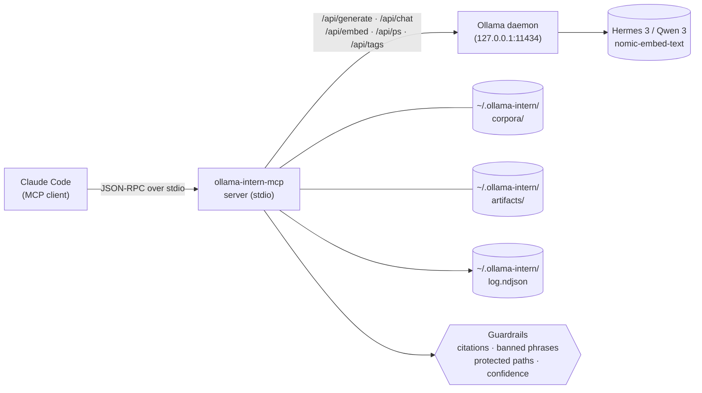

<p align="center">
  <a href="README.ja.md">日本語</a> | <a href="README.md">English</a> | <a href="README.es.md">Español</a> | <a href="README.fr.md">Français</a> | <a href="README.hi.md">हिन्दी</a> | <a href="README.it.md">Italiano</a> | <a href="README.pt-BR.md">Português (BR)</a>
</p>

<p align="center">
  
</p>

<p align="center">
  <a href="https://github.com/mcp-tool-shop-org/ollama-intern-mcp/actions"></a>
  <a href="LICENSE"></a>
  <a href="https://mcp-tool-shop-org.github.io/ollama-intern-mcp/"></a>
  <a href="https://mcp-tool-shop-org.github.io/ollama-intern-mcp/handbook/"></a>
</p>

**Claude 代码的本地实习生。** <!-- TOOL_COUNT:start -->42<!-- TOOL_COUNT:end --> 个与工作相关的工具、以证据为基础的简报、持久的数据。

一个 MCP 服务器，它为 Claude 代码提供了一个具有规则、层级、办公桌和文件柜的**本地实习生**。Claude 选择 _工具_；该工具选择 _层级_（即时/工作型/深度/嵌入）；该层级会写入一个你下周可以打开的文件。

**同时驱动 `hermes3:8b` 上的 [Hermes Agent](https://github.com/NousResearch/hermes-agent)** ——已验证的端到端流程，日期为 2026-04-19。默认层级是 `hermes3:8b`；`qwen3:*` 是备用方案。请参阅下方的 [与 Hermes 一起使用](#use-with-hermes)。

**硬件要求：** 对于 `hermes3:8b`，需要大约 6 GB 的 VRAM；对于 CPU 推理，则需要大约 16 GB 的 RAM。有关完整说明，请参阅 [handbook/getting-started](https://mcp-tool-shop-org.github.io/ollama-intern-mcp/handbook/getting-started/#hardware-minimums)。

**不使用 Claude？** `examples/` 目录中包含一个最小的 Node.js 和 Python MCP 客户端，你可以通过标准输入/输出来运行它。另请参阅 [handbook/with-hermes](https://mcp-tool-shop-org.github.io/ollama-intern-mcp/handbook/with-hermes/)。

**首先关注本地 ——在选择启用之前，不会有任何网络数据传输。没有遥测数据。没有任何“自主”功能。每次调用都会显示其工作过程。可选的 [Ollama Cloud](#ollama-cloud-optional) 路由可以将 600B 级别的模型置于相同的工具之后，当本地硬件成为瓶颈时——并自动回退到本地。**

---

## v2.8.0 版本的新功能

**可靠性、持久性和安全性增强 ——25 个修复，每个修复都首先进行测试并通过跨系列验证。** 首先关注本地的行为没有改变，也没有删除任何工具协议；现有的调用者仍然可以正常工作。最重要的改进是：

- **不再有静默的数据丢失。** 在 `ollama_corpus_refresh` 期间（Windows 文件锁、防病毒软件阻止、编辑器的保存窗口）发生的瞬时读取错误，过去会将该文件标记为“缺失”，并**永久删除其索引内容**。现在，只有真正不存在的文件才会被删除；瞬时错误会保留路径，将其标记以供重试，并保留其数据块。
- **并发性能够遵守预算限制。** 现在，层级超时可以取消仍在排队等待获取许可的调用（过去它会在超出预算后仍然挂起，而收据显示情况并非如此），并且 `ollama_chat` 最终会通过超时/层级边界进行路由——因此，一个卡住的本地生成过程不会导致所有工具都停止工作，并且在云优先模式下，它可以真正地连接到云端。
- **云服务会在出现故障时降级，而不是完全崩溃。** 已停用的云模型 ID 现在会回退到本地，并提供明确的 `cloud_model_missing` 原因和特定于云端的提示，而不是完全停止服务；断路器不会永久卡住；一个持续缺失的模型将停止在每次调用中进行云端往返通信。
- **安全表面与文档相符。** `ollama_batch_proof_check` 现在真正地强制执行 cwd 隔离（具有一个新的运算符环境变量 `INTERN_BATCH_PROOF_ALLOWED_ROOTS`，调用者无法扩展），提示注入清理程序获得了覆盖范围并如实披露了上限，并且受保护的路径防护在 macOS 上也区分大小写。
- **诚实的工件和收据。** 数据包写入是原子性的，绝不会静默地覆盖；降级的数据包会报告实际使用的层级；中断写入检测器会捕获任何突变上的不完整写入；数据块 ID 不再在内容相同的文件中发生冲突。依赖关系审计完全清晰（0 个漏洞）。

完整的详细信息请参见 [CHANGELOG.md](./CHANGELOG.md)。

## v2.7.0 版本的新功能

**可选的 Ollama Cloud 路由 ——云优先，本地回退。** 通过一个密钥和一个标志选择启用，然后生成层级将路由到 600B 级别的云模型；嵌入式内容保留在本地；断路器会在任何云端故障时回退到你的本地配置文件。**默认情况下禁用——除非你同时设置 `OLLAMA_API_KEY` 和 `OLLAMA_CLOUD_PRIMARY=1`，否则不会有任何数据传输。** 这是一个增量式的改进——v2.7.0 之前的调用者（以及任何未选择启用的人）将看到完全相同的行为。请参阅 [Ollama Cloud (可选)](#ollama-cloud-optional)。

- **云优先，并具有安全保障。** `RoutingOllamaClient` 首先尝试连接到云端，并在超时/5xx/429/网络错误时回退到本地配置文件。无效的密钥（401/403）会通过一个持久的断路器进行明确提示，而不是静默地降级；已停用或拼写错误的云模型 ID（404）也会被提示。
- **绝不会发生静默降级。** 每个数据包都将包含 `backend` (`cloud`|`local`)、`degraded` 和 `degrade_reason`，因此你始终知道是否获得了本地模型而不是大型模型。一个 `backend_fallback` NDJSON 事件使云端到本地的回退率在 `ollama_log_tail` 中可见。
- **`ollama_doctor` 会报告云授权和可访问性**作为一个单独的模块；`ollama-intern-mcp doctor` 显示一个“Cloud (primary)”部分。
- 默认云模型是 `minimax-m3:cloud`；可以通过 `INTERN_CLOUD_MODEL` / `INTERN_CLOUD_DEEP_MODEL`（例如，`deepseek-v3.1:671b`）按层级进行覆盖。

## v2.6.0 版本的新功能

在 `ollama_extract` 上对每个调用的层级预算进行覆盖。这是一个增量式的改进——v2.6.0 之前的调用者不会受到影响。有关详细信息，请参阅 [CHANGELOG.md](./CHANGELOG.md)。

- **`tier_budget_ms_override?: number` 模式字段位于 `ollama_extract` 中**（可选，限制在 `[1, 600000]` 毫秒内）。如果存在，则将该设置应用于运行器访问的每个层级，以便 `src/guardrails/timeouts.ts:61` 中的内部 `runWithTimeoutAndFallback` 机制遵循操作员提供的预算，而不是配置文件中的默认值。级联（工作负载 → 超时后的即时响应）仍然会触发；该设置统一控制每个级联步骤。
- **为什么存在这个功能。** research-os R-018 包裹器 (v0.12.1) 使用 `Promise.race` 将 MCP 的 `callTool` 函数包裹起来，并发现该包裹器的预算没有达到内部层级——`DEV_RTX5080_TIMEOUTS.instant = 15_000` 仍然会在 15000 毫秒时触发 `TIER_TIMEOUT`，而不管包裹器预算为 180000 毫秒。v2.6.0 提供了 MCP 端权威的预算设置，因此操作员的 `--planner-timeout-ms` 标志（research-os）最终可以控制内部层级的超时时间，如设计的那样。
- **保留默认行为。** 如果省略该字段，则配置文件中的默认值将完全生效。v2.6.0 之前的调用者不会看到任何变化。
- **保留 R-010 fallback-cause 正则表达式。** 服务器端的 `TIER_TIMEOUT` 错误消息仍然匹配 `/elapsed=(\d+)ms/` + `/budget=(\d+)ms/`，因此下游的 AI 顾问可以识别覆盖和默认路径。
- research-os v0.13.0 在协调的多仓库发布中使用了此功能（累积 R-019 客户端连接 + R-020 + R-021）。

### 历史版本 — v2.4.0 的交付内容

请参阅 [CHANGELOG.md](./CHANGELOG.md) 和 [docs/release-notes/v2.4.0.md](./docs/release-notes/v2.4.0.md)，以获取完整的 v2.4.0 版本说明（配置文件中每个层级的 `num_ctx` 控制）。

## v2.4.0 中的新功能

配置文件中每个层级的 `num_ctx`（上下文窗口）控制。附加的次要更新——v2.3.0 的调用者不受影响。详细信息请参阅 [CHANGELOG.md](./CHANGELOG.md) 和 [docs/release-notes/v2.4.0.md](./docs/release-notes/v2.4.0.md)。

- **`TierConfig.num_ctx` 映射（新增）** — 配置文件的可选 `{ instant?, workhorse?, deep?, embed? }`。如果为某个层级设置了该值，则 MCP 服务器会将 `options.num_ctx = <value>` 添加到路由到该层级的每个 Ollama generate/chat 请求中（初始 + 备用）。如果未设置，请求将完全省略 `num_ctx`，因此 Ollama 将使用其模型加载的默认值——v2.3.0 的行为保持不变。
- **新的信封字段 `num_ctx_used?: number`** —仅当 MCP 服务器实际发送了 `num_ctx` 时才会存在。如果请求让 Ollama 选择，则该字段将不存在。不要推断出默认值——MCP 服务器不会查询 Ollama 以获取有效值。
- **配置文件中的默认值：** `dev-rtx5080` / `dev-rtx5080-qwen3` 具有 `instant: 4096`、`workhorse: 8192`，`deep`/`embed` 未设置。这些配置旨在使 `hermes3:8b` 驻留在 RTX 5080 的 16GB VRAM 中，以便快速执行工具。`m5-max` 使每个层级都未设置——128GB 统一内存没有溢出问题。
- **解决了 v0.8.0 第 1 阶段的诊断问题** — 在 RTX 5080 上，默认情况下 `hermes3:8b` 的上下文为 32K，但它溢出了到 CPU 并开始导致工作负载 `ollama_extract` 调用超时。v2.4.0 通过配置文件层来防止这种情况发生。

### 每个层级的 `num_ctx` 控制（v2.4.0 中的新功能）

配置文件摘录（来自 `src/profiles.ts`）：

```ts
"dev-rtx5080": {
  tiers: {
    instant: "hermes3:8b",
    workhorse: "hermes3:8b",
    deep: "hermes3:8b",
    embed: "nomic-embed-text",
    num_ctx: {
      instant: 4096,    // fast classify/summarize
      workhorse: 8192,  // schema-bound extract / batch
      // deep: UNSET — long-context briefs keep current behavior
      // embed: UNSET — no context-window pressure on embed
    },
  },
  // ... timeouts, prewarm
}
```

工作负载层级调用的信封（例如，`ollama_extract`）：

```jsonc
{
  "result": { /* extracted data */ },
  "tier_used": "workhorse",
  "model": "hermes3:8b",
  "num_ctx_used": 8192,        // present because the profile set workhorse=8192
  // ... rest of envelope unchanged
}
```

在 `m5-max` 上（或任何将某个层级设置为未设置状态的配置文件中），`num_ctx_used` 将不存在于信封中，并且发送到 Ollama 的线上传输请求不会包含 `num_ctx` 字段——Ollama 将使用其模型加载的默认值。

操作员可以通过选择/编辑配置文件来调整；工具模式中没有每个调用的 `num_ctx` 输入。如果未来的调用表明有必要，则该模式将遵循 v2.3.0 的 `model` 覆盖方式。

### 历史版本 — v2.3.0 的交付内容

请参阅 [CHANGELOG.md](./CHANGELOG.md) 和 [docs/release-notes/v2.3.0.md](./docs/release-notes/v2.3.0.md)，以获取完整的 v2.3.0 版本说明（每个调用的模型覆盖）。

## v2.3.0 中的新功能

所有基于 LLM 的原子工具的每个调用模型覆盖。附加的次要更新——v2.2.0 的调用者不受影响。详细信息请参阅 [CHANGELOG.md](./CHANGELOG.md) 和 [docs/release-notes/v2.3.0.md](./docs/release-notes/v2.3.0.md)。

- **8 个原子工具上的可选 `model: string` 输入** — `ollama_extract`、`ollama_classify`、`ollama_summarize_fast`、`ollama_summarize_deep`、`ollama_research`、`ollama_corpus_answer`、`ollama_chat`、`ollama_code_citation`。工具的层级上的第一次尝试将使用调用者指定的模型；如果超时，现有的 `TIER_FALLBACK` 级联将解决更便宜的层级的自身模型（而不是调用者的覆盖）。组合/简短/打包工具不会接受 `model`——原子工具具有每个调用的控制权，而组合工具则使用层级默认值。
- **新的信封字段 `model_requested?: string`** — 仅当提供了覆盖时才会存在。了解校准的调用者会将 `model_requested` 与 `model` 进行比较，以检测备用替换：`if (env.model_requested && env.model !== env.model_requested) { /* substitution */ }`。空/仅包含空格的输入将在模式解析时引发 `ZodError`，而不是静默地失败。
- **错误修复 — `src/version.ts` 漂移。** 运行时 `VERSION` 常量现在在模块加载时从 `package.json` 中读取；v2.1.0 和 v2.2.0 在发布时报告了过时的 `"2.0.0"` 标识字符串。新的 `tests/version.test.ts` 将 `VERSION === pkg.version` 固定下来。

### 每个调用的模型覆盖（v2.3.0 中的新功能）

```jsonc
{
  "tool": "ollama_classify",
  "arguments": {
    "text": "patch null pointer in auth",
    "labels": ["feat", "fix", "chore"],
    "frame": "what is the change kind?",
    "model": "hermes3:8b"
  }
}
```

信封：

```jsonc
{
  "result": { "label": "fix", "confidence": 0.9, "off_topic": false, ... },
  "tier_used": "instant",
  "model": "hermes3:8b",
  "model_requested": "hermes3:8b",       // present because override was supplied
  // ... rest of envelope unchanged
}
```

如果工作负载/深度层级超时，并且调用已级联到即时层级，则 `env.model` 将是即时层级的解析模型，并且 `env.fallback_from` 将是 `"workhorse"`——`env.model_requested` 仍然是 `"hermes3:8b"`，并且 `env.model !== env.model_requested` 是替换信号。该覆盖不会有意地传递到更便宜的层级；所选择的模型可能完全不适合该层级的角色。

### 历史版本 — v2.2.0 的交付内容

请参阅 [CHANGELOG.md](./CHANGELOG.md) 和 [docs/release-notes/v2.2.0.md](./docs/release-notes/v2.2.0.md)，以获取完整的 v2.2.0 版本说明（基于框架的主题相关性 + 结构化的弃权）。

## v2.2.0 中的新功能

本地证据工作者角色协议：基于框架的主题相关性和结构化的弃权。增量式更新——与 v2.1.0 的调用方保持不变。详细信息请参见 [CHANGELOG.md](./CHANGELOG.md) 和 [docs/release-notes/v2.2.0.md](./docs/release-notes/v2.2.0.md)。

- 在 `ollama_extract`、`ollama_classify`、`ollama_summarize_fast` 和 `ollama_summarize_deep` 上进行**基于框架的提取**——可选的 `frame: string` 输入 + 结构化的 `frame_alignment`/`on_topic`/`frame_addressed` 输出。对于不相关的内容，系统会标记而不是将其释义成符合模式的内容。
- 在 `ollama_research` 上进行**结构化弃权**——`weak`/`abstained`/`sources_address_question` 字段。如果 `citations[]` 为空但 `answer` 不为空，则不再被视为成功。
- 在 `ollama_corpus_answer` 上设置**主题相关性阈值**——可选的 `min_top_score`。低于该阈值时，工具将直接返回 `abstained: true` 并跳过合成。每个引用的 `score` 现在都可见。
- 通过简短的证据保留**检索分数**——`corpusHitsToEvidence` 携带 `score`（并且在 `incident_brief`/`repo_brief`/`change_brief` 上进行组装时，可以使用 `corpus_min_evidence_score` 参数进行过滤）。
- **引用行范围边界**——`guardrails/citations.ts` 会拒绝超出范围的 `ollama_research` 上的范围，与现有 `ollama_code_citation` 上的行为保持一致。
- **更正了操作者协议文档**——README 中的 `chunk_id`/`chunk_index` 已修复，“服务器端验证”已重写，证据法部分已进行说明，营销口号已添加注释。

### 种子回归——验证

针对字面意义上的 research-os 快速打包失败，对切片协议进行验证：arxiv 2112.10422（宇宙学标准计时器），在 section-01 框架下，即“在本地优先与云端 LLM 深度研究工作流程中，证据保管意味着什么？”——9/9 个模拟的 LLM 协议测试确认，现在不相关的内容已被包含（`frame_alignment.on_topic = false` 用于提取；`off_topic: true` 用于分类；`frame_addressed: false` 用于 `summarize_deep`；在 `corpus_answer` 中设置了 `min_top_score` 时，返回 `abstained: true`）。

### 历史记录——v2.1.0 的交付成果

请参阅 [CHANGELOG.md](./CHANGELOG.md)，以获取完整的 v2.1.0 版本说明（功能通过：13 个新工具 + 4 个增强 + 取消冻结）。

---

## 架构概览


```mermaid
flowchart LR
  Claude["Claude Code<br/>(MCP client)"]
  MCP["ollama-intern-mcp<br/>server (stdio)"]
  Ollama["Ollama daemon<br/>(127.0.0.1:11434)"]
  Models[("Hermes 3 / Qwen 3<br/>nomic-embed-text")]
  Corpus[("~/.ollama-intern/<br/>corpora/")]
  Artifacts[("~/.ollama-intern/<br/>artifacts/")]
  NDJSON[("~/.ollama-intern/<br/>log.ndjson")]
  Guards{{"Guardrails<br/>citations · banned phrases<br/>protected paths · confidence"}}

  Claude -- "JSON-RPC over stdio" --> MCP
  MCP --> Guards
  MCP -- "/api/generate · /api/chat<br/>/api/embed · /api/ps · /api/tags" --> Ollama
  Ollama --> Models
  MCP --- Corpus
  MCP --- Artifacts
  MCP --> NDJSON
```

每个 Claude 工具调用都通过 stdio JSON-RPC 进入 MCP 服务器。服务器会根据工具的 [zod](https://zod.dev) 模式验证该调用，运行配置的防护措施（引用验证、禁止短语删除、受保护路径强制执行、置信度阈值），然后路由到确定性渲染器（工件层）或 Ollama HTTP 调用（所有其他层）。Ollama 守护程序永远不会看到用户提供的路径——只有模型层和准备好的提示。每次调用都会将一个结构化事件附加到 `~/.ollama-intern/log.ndjson` 处的 NDJSON 日志中，您可以使用 `ollama_log_tail` 和您的 shell 读取该日志。

---

## 主要示例——一次调用，一个工件

```jsonc
// Claude → ollama-intern-mcp
{
  "tool": "ollama_incident_pack",
  "arguments": {
    "title": "sprite pipeline 5 AM paging regression",
    "logs": "[2026-04-16 05:07] worker-3 OOM killed\n[2026-04-16 05:07] ollama /api/ps reports evicted=true size=8.1GB\n...",
    "source_paths": ["F:/AI/sprite-foundry/src/worker.ts", "memory/sprite-foundry-visual-mastery.md"]
  }
}
```

返回一个指向磁盘上文件的信封：

```jsonc
{
  "result": {
    "pack": "incident",
    "slug": "2026-04-16-sprite-pipeline-5-am-paging-regression",
    "artifact_md":   "~/.ollama-intern/artifacts/incident/2026-04-16-sprite-pipeline-5-am-paging-regression.md",
    "artifact_json": "~/.ollama-intern/artifacts/incident/2026-04-16-sprite-pipeline-5-am-paging-regression.json",
    "weak": false,
    "evidence_count": 6,
    "next_checks": ["residency.evicted across last 24h", "OLLAMA_MAX_LOADED_MODELS vs loaded size"]
  },
  "tier_used": "deep",
  "model": "hermes3:8b",
  "hardware_profile": "dev-rtx5080",
  "tokens_in": 4180, "tokens_out": 612,
  "elapsed_ms": 8410,
  "residency": { "in_vram": true, "evicted": false }
}
```

→ `weak: false` 表示已组装了 ≥2 个证据项目；这并不意味着已经验证了假设。请参阅下方的[证据法](#evidence-laws)。

该 markdown 文件是实习生的桌面输出——标题、带有引用 ID 的证据块、调查性的 `next_checks`，如果证据不足，则显示 `weak: true` 标志。它是确定性的：渲染器是代码，而不是提示。（渲染器是确定性的；假设和表面的*内容*是生成的——将其视为草稿，而不是已验证的内容。）明天打开它，下周进行差异比较，使用 `ollama_artifact_export_to_path` 将其导出到手册中。

该领域的每个竞争对手都以“节省令牌”作为宣传点。我们则提供“这是实习生编写的文件”。

### 第二个示例——构建一个语料库，然后对其进行提问

```jsonc
// 1. Build a persistent, searchable corpus over your project.
{ "tool": "ollama_corpus_index",
  "arguments": { "name": "sprite-foundry",
                 "paths": ["F:/AI/sprite-foundry/src"],
                 "embed_model": "nomic-embed-text" } }
// → { chunks_written: 1204, paths_indexed: 312, failed_paths: [] }

// 2. Ask an evidence-bound question against it.
{ "tool": "ollama_corpus_answer",
  "arguments": { "name": "sprite-foundry",
                 "query": "how does the worker handle OOM eviction?",
                 "top_k": 8 } }
// → { answer: "...", citations: [{chunk_index, path}...], weak: false }
```

服务器会验证引用的身份，并确保每个 `chunk_index` 都在检索到的命中范围内。它不会证明生成的每个声明在语义上都得到引用的块内容的支撑——这是模型的责任，并且较弱的检索仍然可以生成类似引用的答案。完整的演练请参见 [handbook/corpora](https://mcp-tool-shop-org.github.io/ollama-intern-mcp/handbook/corpora/)。

---

## 基于框架的提取（v2.2.0 中的新功能）

`ollama_extract`、`ollama_classify`、`ollama_summarize_fast` 和 `ollama_summarize_deep` 接受一个可选的 `frame: string` 输入。框架指定了源被要求回答的问题；当源未涉及该框架时，模型会指示其弃权，而不是输出虽然正确但不相关的内容。

```jsonc
{
  "tool": "ollama_extract",
  "arguments": {
    "text": "<long source document>",
    "schema": { /* your fields */ },
    "frame": "section purpose here — e.g. 'OOM eviction behavior in the sprite worker'"
  }
}
// → result includes frame_alignment: { on_topic: boolean, reason: string, unaddressed_aspects: string[] }
```

如果省略了 `frame`，则行为与 v2.1.0 相同。在提供时，`frame_alignment.on_topic = false` 表示提取的字段可能对源是正确的，但与框架无关——将其视为与 `weak: true` 简报相同的形式：有用，但在将其提升到下游证据之前请进行抽样检查。

---

## 弃权协议（v2.2.0 中的新功能）

`ollama_research` 返回结构化的弃权字段：`weak: boolean`、`abstained: boolean`、`sources_address_question: boolean | null`。如果 `citations[]` 为空但 `answer` 不为空，则不再被视为成功——`abstained: true` 表示模型拒绝进行合成，因为调用方提供的路径未涉及该问题。将弃权视为一种成功，而不是失败：这是工具拒绝将较弱的检索结果转化为权威输出。

`ollama_corpus_answer` 接受一个可选的 `min_top_score: number` 主题相关性阈值（0.0–1.0）。当查询的最佳检索分数低于 `min_top_score` 时，该工具会通过 `abstained: true` 提前结束，并跳过合成——从而防止出现“即使得分只有 0.21 的 5 个不相关的片段仍然可以生成完整的答案”的失败模式。v2.1.0 版本中的 `weak: true` 规则未能捕获这种模式（`weak: true` 仅在 `hits.length < 2` 时触发）。将此与每个引用的新出现的 `score` 字段结合使用，以便直接从响应中审核检索质量。

---

## 这里包含什么——四个层级，<!-- TOOL_COUNT:start -->42<!-- TOOL_COUNT:end --> 个工具

“任务导向”意味着每个工具都指定了一个你可以交给实习生的任务——对这些内容进行分类、提取那些信息、整理这些日志、起草这份发布说明、打包这个事件。该工具的输入是任务规范；输出是交付物。没有通用的 `run_model` / `chat_with_llm` 基础模块。

| 层级 | 数量 | 这里包含的内容 |
|---|---|---|
| **Atoms** | 29 | 任务导向的基础模块。**最初的 15 个：** `classify`、`extract`、`triage_logs`、`summarize_fast`/`deep`、`draft`、`research`、`corpus_search`/`answer`/`index`/`refresh`/`list`、`embed_search`、`embed`、`chat`。**v2.1.0 版本中新增的 13 个：** `doctor`、`log_tail`、`batch_proof_check`（运维）；`code_map`、`code_citation`、`multi_file_refactor_propose`、`refactor_plan`（重构）；`artifact_prune`、`hypothesis_drill`（工件/摘要）；`corpus_health`、`corpus_amend`、`corpus_amend_history`、`corpus_rerank`（语料库）。**+1 个审查原子：** `code_review`（结构化的 PR 审查结果，核心功能；仅用于审查）。支持批量处理的原子（`classify`、`extract`、`triage_logs`）接受 `items: [{id, text}]`。 |
| **Briefs** | 3 | 基于证据的结构化操作员简报。`incident_brief`、`repo_brief`、`change_brief`。每个声明都引用了一个证据 ID；未知的条目在服务器端被删除。如果证据不足，则显示 `weak: true` 而不是虚假叙述。 |
| **Packs** | 3 | 固定的流水线复合任务，将持久的 Markdown + JSON 写入到 `~/.ollama-intern/artifacts/` 中。`incident_pack`、`repo_pack`、`change_pack`。确定性渲染器——不调用模型来确定工件的形状。 |
| **Artifacts** | 7 | 对打包输出进行连续处理。`artifact_list`/`read`/`diff`/`export_to_path`，以及三个确定性的片段：`incident_note`、`onboarding_section`、`release_note`。 |

总计：**29 个原子 + 3 个简报 + 3 个打包工具 + 7 个工件工具 = <!-- TOOL_COUNT:start -->42<!-- TOOL_COUNT:end -->**。

冻结规则：
- 原子：在 v2.1.0 版本中解除冻结（今天有 29 个；v2.1.0 功能版本中新增了 13 个，之后又新增了 1 个 `code_review`）。新的原子仍然需要经过审计验证，并提供测试、手册页面和 CHANGELOG 条目——不能随意添加。
- 打包工具：冻结为 3 个。没有新的打包类型。
- 工件层级：冻结为 7 个。

完整的工具参考资料位于 [手册](https://mcp-tool-shop-org.github.io/ollama-intern-mcp/handbook/tools/) 中。

---

## 安装

需要本地运行的 [Ollama](https://ollama.com)，并下载所需的层级模型（请参阅下面的[模型下载](#model-pulls)）。

### Claude Code（推荐）

大多数用户通过将其添加到他们的 Claude Code MCP 服务器配置中来安装它——不需要全局安装。Claude Code 通过 `npx` 按需运行服务器：

```json
{
  "mcpServers": {
    "ollama-intern": {
      "command": "npx",
      "args": ["-y", "ollama-intern-mcp"],
      "env": {
        "OLLAMA_HOST": "http://127.0.0.1:11434",
        "INTERN_PROFILE": "dev-rtx5080"
      }
    }
  }
}
```

### Claude Desktop

相同的代码块，写入到 `~/Library/Application Support/Claude/claude_desktop_config.json`（macOS）或 `%APPDATA%\Claude\claude_desktop_config.json`（Windows）。

### 全局安装（高级）

只有当你希望在 Claude Code 之外的临时使用中将二进制文件放在你的 `PATH` 中时，才需要这样做：

```bash
npm install -g ollama-intern-mcp
```

### 与 Hermes 一起使用

此 MCP 已通过 [Hermes Agent](https://github.com/NousResearch/hermes-agent) 对其进行了端到端验证，并针对 Ollama 上的 `hermes3:8b` 进行测试（2026-04-19）。Hermes 是一个外部代理，它*调用*此 MCP 的冻结的基础模块——它进行规划，我们完成工作。

参考配置 ([hermes.config.example.yaml](hermes.config.example.yaml) 在此仓库中)：

```yaml
model:
  provider: custom
  base_url: http://localhost:11434/v1
  default: hermes3:8b
  context_length: 65536    # Hermes requires 64K floor under model.*

providers:
  local-ollama:
    name: local-ollama
    base_url: http://localhost:11434/v1
    api_mode: openai_chat
    api_key: ollama
    model: hermes3:8b

mcp_servers:
  ollama-intern:
    command: npx
    args: ["-y", "ollama-intern-mcp"]
    env:
      OLLAMA_HOST: http://localhost:11434
      INTERN_PROFILE: dev-rtx5080
      # hermes3:8b is the default ladder in v2.0.0, so tier overrides are
      # only needed if you're pinning a different local model.
```

**提示的格式很重要。** 强制性的工具调用提示（“使用参数调用 X……”）是集成测试——它们为本地 8B 模型提供了足够的框架，使其能够生成干净的 `tool_calls`。列表形式的多任务提示（“先做 A，然后做 B，再做 C”）是大型模型的性能基准；不要将列表形式的失败解释为“连接出现问题”。请参阅 [handbook/with-hermes](https://mcp-tool-shop-org.github.io/ollama-intern-mcp/handbook/with-hermes/)，以获取完整的集成演练 + 已知的传输注意事项（Ollama `/v1` 流式传输 + openai-SDK 非流式传输的 shim）。

### 模型下载

**默认开发配置文件（RTX 5080 16GB 及类似配置）：**

```bash
ollama pull hermes3:8b
ollama pull nomic-embed-text
export OLLAMA_MAX_LOADED_MODELS=2
export OLLAMA_KEEP_ALIVE=-1
```

**Qwen 3 替代方案（相同的硬件，用于 Qwen 工具）：**

```bash
ollama pull qwen3:8b
ollama pull qwen3:14b
ollama pull nomic-embed-text
export INTERN_PROFILE=dev-rtx5080-qwen3
```

**M5 Max 配置（128GB 统一内存）：**

```bash
ollama pull qwen3:14b
ollama pull qwen3:32b
ollama pull nomic-embed-text
export INTERN_PROFILE=m5-max
```

每个层级的环境变量（`INTERN_TIER_INSTANT`、`INTERN_TIER_WORKHORSE`、`INTERN_TIER_DEEP`、`INTERN_EMBED_MODEL`）仍然可以覆盖配置文件中选择的内容，以用于一次性任务。

---

## 统一的响应格式

每个工具都返回相同的格式：

```ts
{
  result: <tool-specific>,
  tier_used: "instant" | "workhorse" | "deep" | "embed",
  model: string,
  hardware_profile: string,     // "dev-rtx5080" | "dev-rtx5080-qwen3" | "m5-max"
  tokens_in: number,
  tokens_out: number,
  elapsed_ms: number,
  residency: {
    in_vram: boolean,
    size_bytes: number,
    size_vram_bytes: number,
    evicted: boolean
  } | null
}
```

`residency` 来自 Ollama 的 `/api/ps`。当 `evicted: true` 或 `size_vram < size` 时，模型会被分页到磁盘中，并且推理速度下降 5–10 倍——将此信息提供给用户，以便他们知道是否需要重新启动 Ollama 或减少已加载的模型数量。

在 [Ollama Cloud](#ollama-cloud-optional) 模式下，响应还包含 `backend`（“cloud”|“local”）以及在云端到本地回退时，`degraded: true` + `degrade_reason`。这些字段**不存在**于默认的仅本地路径中，因此现有的消费者不受影响。对于通过云端提供的调用，`residency` 为 `null`（无状态的云端没有本地 VRAM 驻留）。

每次调用都会被记录为一条 NDJSON 行，存储在 `~/.ollama-intern/log.ndjson` 中。通过 `hardware_profile` 进行筛选，以避免将设备编号包含在可发布的基准测试中。

---

## 硬件配置

| 配置 | 即时 | 主力 | 深度 | 嵌入 |
|---|---|---|---|---|
| **`dev-rtx5080`**（默认） | hermes3 8B | hermes3 8B | hermes3 8B | nomic-embed-text |
| `dev-rtx5080-qwen3` | qwen3 8B | qwen3 8B | qwen3 14B | nomic-embed-text |
| `m5-max` | qwen3 14B | qwen3 14B | qwen3 32B | nomic-embed-text |

**默认配置**将所有三个工作层合并到 `hermes3:8b` 上——经过验证的 Hermes Agent 集成路径。从上到下使用相同的模型意味着只需下载一个，占用一种资源，并且只需要理解一套行为。如果用户更喜欢 Qwen 3（及其 `THINK_BY_SHAPE` 功能），可以选择 `dev-rtx5080-qwen3`。`m5-max` 是为统一内存设计的 Qwen 3 模型系列。

---

## Ollama Cloud（可选）

本地的 8B 模型是大多数用户遇到的硬件瓶颈。[Ollama Cloud](https://ollama.com/cloud) 提供 600B 级别的模型，并通过**相同**的 `/api/*` 接口进行访问，因此您可以将繁重的任务路由到更强大的模型，并释放本地 VRAM——同时保持本地作为始终可用的备用方案。

**这是一个可选功能，默认情况下是关闭的。**除非您设置了这两个参数，否则该软件包仍会优先使用本地资源，并且**不会产生任何数据传输**。未选择启用此功能的任何人不受影响。

```json
{
  "mcpServers": {
    "ollama-intern": {
      "command": "npx",
      "args": ["-y", "ollama-intern-mcp"],
      "env": {
        "OLLAMA_CLOUD_PRIMARY": "1",
        "OLLAMA_API_KEY": "sk-...your-key...",
        "INTERN_PROFILE": "dev-rtx5080"
      }
    }
  }
}
```

> **关键在于运行时环境变量，而不是 CI 密钥。** GitHub Actions 密钥仅在 CI 运行期间可见——它永远无法到达正在运行的服务器。请在 [ollama.com/settings/keys](https://ollama.com/settings/keys) 创建一个密钥，并将其放入您的 MCP 客户端的 `env` 块中（或您的 shell 环境中）。

**路由的工作原理。**当启用云服务时，生成层（即时 / 主力 / 深度）将使用云模型；**嵌入始终保持本地**（Ollama Cloud 不提供任何嵌入模型，因此语料库/嵌入工具不受影响）。一个熔断器会首先尝试使用云服务，并在超时 / 5xx / 429 / 网络错误时回退到您的本地配置。如果密钥无效（401/403），则会触发一个“粘性”熔断器，并以明显的方式显示错误，而不是默默地降级。本地配置文件 (`INTERN_PROFILE`) 是备用方案，因此请确保其模型已下载。

**您不会被悄无声息地降级。**每个请求都会报告哪个后端服务了该请求：

```ts
{ ...envelope, backend: "cloud" | "local", degraded?: true, degrade_reason?: "cloud_timeout" | "cloud_5xx" | "cloud_rate_limited" | "cloud_unreachable" | "cloud_auth_failed" | "circuit_open" }
```

每当发生云端到本地的回退时，`backend_fallback` 行都会记录在 `~/.ollama-intern/log.ndjson` 中（使用 `ollama_log_tail --filter_kind backend_fallback` 筛选），并且 `ollama-intern-mcp doctor` 会显示一个**Cloud (primary)** 块，其中包含可访问性和身份验证状态。

**延迟与质量。**大型云模型每个令牌的运行速度远低于本地 8B 模型（秒级，而不是毫秒级）——这是一种质量升级，而不是速度升级。云层使用宽松的超时时间（默认情况下，即时为 30 秒 / 主力为 120 秒 / 深度为 300 秒）。

### 云端环境变量

| 变量 | 默认值 | 用途 |
|---|---|---|
| `OLLAMA_CLOUD_PRIMARY` | _(未设置)_ | **启用/禁用云服务的开关。** `1`/`true`/`yes`/`on` 启用云服务优先模式。未设置 = 仅使用本地资源，无数据传输。 |
| `OLLAMA_API_KEY` | _(未设置)_ | 用于 Ollama Cloud 的 Bearer 密钥。当启用云服务时，此项是**必需的**（如果缺少，则启动时会立即失败）。 |
| `OLLAMA_CLOUD_HOST` | `https://ollama.com` | 云端基础主机。 |
| `INTERN_CLOUD_MODEL` | `minimax-m3:cloud` | 即时 + 主力 + 深度使用的云模型。 |
| `INTERN_CLOUD_DEEP_MODEL` | _(= `INTERN_CLOUD_MODEL`)_ | 可选的仅用于深度层的覆盖，例如 `deepseek-v3.1:671b`。 |
| `INTERN_CLOUD_TIMEOUT_{INSTANT,WORKHORSE,DEEP}_MS` | `30000`/`120000`/`300000` | 每个层级的云端尝试超时时间。 |
| `INTERN_CLOUD_NUM_CTX` | `32768` | 云端调用的上下文窗口限制（云服务按 GPU 时间计费；限制用于控制成本）。 |

> **模型可用性可能会发生变化。** Ollama 会定期淘汰云模型。`minimax-m3:cloud`、`deepseek-v3.1:671b`、`gpt-oss:120b` 和 `qwen3-coder:480b` 是当前推荐的模型；在固定使用某个 ID 之前，请查看 [ollama.com/search?c=cloud](https://ollama.com/search?c=cloud)。

**隐私说明。**路由到 Ollama Cloud 会将提示发送给第三方。Ollama 的[隐私政策](https://ollama.com/privacy) 声明，云端提示会进行临时处理，不会超出请求范围进行保留，也不会用于训练——但这仍然是一种数据传输，这就是为什么它是可选功能并且需要明确告知的原因。仅本地模式（默认）不会将任何内容发送到外部。

---

## 证据法则

这些规则在服务器中执行，而不是在提示中执行：

- **必须引用来源。**每个简要声明都必须引用一个证据 ID。
- **服务器端删除未知信息。**如果模型引用的 ID 在证据包中不存在，则会在结果返回之前删除这些 ID，并显示警告。
- **ID 验证，而非内容验证。**服务器会检查每个引用的 `evidence_ref` 是否指向已组装集合中的真实证据 ID。它不会验证声明文本是否可以从引用的证据中得出——这是模型的任务，并且较弱的简要说明有时包含带有有效引用但未经支持的声明。使用 `weak: true` + 覆盖范围说明 + 包含的 `excerpt` 字段进行抽样检查。
- **“弱”即为“弱”。**薄弱的证据会标记 `weak: true`，并附带覆盖范围说明。绝不会将其伪装成虚假叙述。
- **用于调查，而非规定。**仅使用 `next_checks`/`read_next`/`likely_breakpoints`。提示禁止使用“应用此修复”。
- **确定性渲染器。**工件 Markdown 格式是代码，而不是提示。`draft` 始终保留给模型措辞重要的散文。
- **仅限同一包中的差异。**拒绝跨包的 `artifact_diff`，并会发出明确的警告；有效负载保持独立。

---

## 工件和连续性

软件包会将内容写入到 `~/.ollama-intern/artifacts/{incident,repo,change}/<slug>.(md|json)` 中。工件层为您提供了一个连续性表面，而无需将其变成文件管理工具：

- `artifact_list` — 仅包含元数据的索引，可以按包、日期和 slug 通配符进行筛选。
- `artifact_read` — 通过 `{pack, slug}` 或 `{json_path}` 进行类型化读取。
- `artifact_diff` — 同一包内的结构化比较；弱翻转功能已实现。
- `artifact_export_to_path` — 将现有工件（带有来源标头）写入调用方声明的 `allowed_roots` 目录。除非 `overwrite: true`，否则拒绝写入现有文件。
- `artifact_incident_note_snippet` — 操作员备注片段。
- `artifact_onboarding_section_snippet` — 手册片段。
- `artifact_release_note_snippet` — 草稿版本发布说明片段。

此层级不调用任何模型。所有内容均从存储的内容中渲染。

---

## 威胁模型和遥测数据

**涉及的数据：** 调用方明确提供的文件路径（`ollama_research`、语料库工具）、内联文本以及调用方请求写入到 `~/.ollama-intern/artifacts/` 或调用方声明的 `allowed_roots` 目录中的工件。

**不涉及的数据：** 任何位于 `source_paths` / `allowed_roots` 之外的内容。在标准化之前，会拒绝使用 `..`。`artifact_export_to_path` 除非 `overwrite: true`，否则拒绝写入现有文件。针对受保护路径（`memory/`、`.claude/`、`docs/canon/` 等）的草稿需要明确设置 `confirm_write: true`，并在服务器端强制执行。

**网络出口：** **默认关闭。** 默认情况下，唯一的出站流量是发送到本地 Ollama HTTP 端点的流量——没有云调用、没有更新 ping、没有崩溃报告。**可选例外：** 如果您启用了 [Ollama Cloud](#ollama-cloud-optional)（`OLLAMA_CLOUD_PRIMARY=1` + `OLLAMA_API_KEY`），则生成层级的提示将通过 HTTPS 协议使用 Bearer 密钥发送到 `ollama.com`。这是明确的、已公开的，并且在未设置这两个变量时处于关闭状态；嵌入始终不会离开系统。请参阅 [SECURITY.md](SECURITY.md) §11。

**遥测数据：** **无。** 所有调用都会记录为单行 NDJSON 数据，并存储在您的机器上的 `~/.ollama-intern/log.ndjson` 中。服务器本身不会向任何地方发送信息。

**错误：** 结构化格式 `{ code, message, hint, retryable }`。堆栈跟踪绝不会通过工具结果暴露出来。

完整策略：[SECURITY.md](SECURITY.md)。

---

## 标准

构建符合 [Shipcheck](https://github.com/mcp-tool-shop-org/shipcheck) 标准。A–D 严格关卡已通过；请参阅 [SHIP_GATE.md](SHIP_GATE.md) 和 [SCORECARD.md](SCORECARD.md)。

- **A. 安全性** — SECURITY.md、威胁模型、无遥测数据、路径安全性、受保护路径上的 `confirm_write`。
- **B. 错误处理** — 所有工具结果均采用结构化格式；没有原始堆栈信息。
- **C. 文档** — README 已更新，包含 CHANGELOG 和 LICENSE；工具模式自文档化。
- **D. 代码规范** — `npm run verify`（完整的 vitest 测试套件）、带有依赖项扫描的 CI、Dependabot、lockfile、`engines.node`。

---

## 路线图（强化，而不是扩大范围）

- **第一阶段 — 委托骨干** ✓ 已发布：原子表面、统一信封、分层路由、安全防护措施。
- **第二阶段 — 真理骨干** ✓ 已发布：schema v2 分块、BM25 + RRF、动态语料库、基于证据的摘要、检索评估包。
- **第三阶段 — 包和工件骨干** ✓ 已发布：具有持久性工件和连续层级的固定流水线包。
- **第四阶段 — 采用骨干** ✓ v2.0.1：三阶段健康检查通过强化语料库（TOCTOU、50 MB 文件大小限制、拒绝符号链接、原子写入、每个文件失败捕获）、工具路径遍历、可观察性（信号量等待事件、超时错误上下文、预热冷启动信号）、测试安全性（跨 10 个文件的模块加载环境快照、`tools/call` 端到端测试）。已添加操作员手册和硬件最低要求。
- **第五阶段 — M5 Max 基准测试** — 一旦硬件到位，将发布可发布的数字（~2026-04-24）。

按强化层划分阶段。包和工件层级保持在 3 和 7 不变。原子冻结已在 v2.1.0 中解除——新的原子需要经过审计并证明其存在的必要性，并且需要进行测试、编写手册页面以及添加到 CHANGELOG 中。

---

## 许可证

MIT — 请参阅 [LICENSE](LICENSE)。

---

<p align="center">Built by <a href="https://mcp-tool-shop.github.io/">MCP Tool Shop</a></p>
