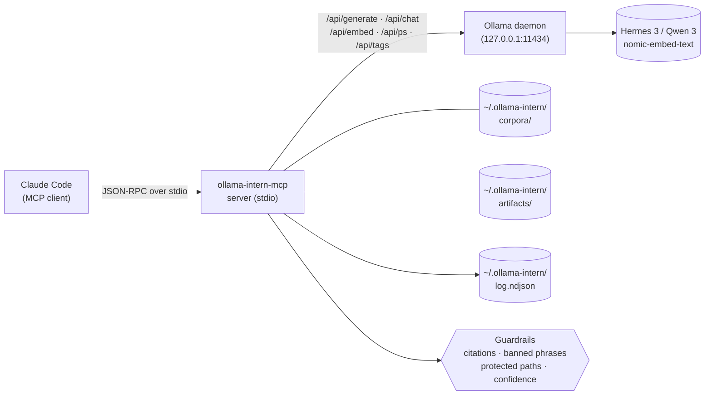

**Ollama Intern MCP** gives Claude Code a local intern with rules, tiers, a desk, and a filing cabinet. Claude picks the _tool_; the tool picks the _tier_ (Instant / Workhorse / Deep / Embed); the tier writes a file you can open next week.

No cloud. No telemetry. No "autonomous" anything. Every call shows its work.

## The shape

Four tiers, 42 tools total.

| Tier | Count | Purpose |
|---|---|---|
| **Atoms** | 28 | Job-shaped primitives (`classify`, `extract`, `triage_logs`, `summarize_*`, `draft`, `research`, `corpus_*`, `embed*`, `chat`, plus the 13 v2.1.0 ops/refactor/corpus/artifact additions — see [Tool reference](./tools/)). Batch-capable atoms accept `items: [{id, text}]`. |
| **Briefs** | 3 | Evidence-backed structured operator briefs — `incident_brief`, `repo_brief`, `change_brief`. |
| **Packs** | 3 | Fixed-pipeline compound jobs that write durable markdown + JSON. `incident_pack`, `repo_pack`, `change_pack`. |
| **Artifacts** | 7 | Continuity surface — `list`, `read`, `diff`, `export_to_path`, plus three deterministic snippet helpers. |

Freeze lines: atoms at 28 (freeze lifted at v2.1.0; new atoms require audit-justified gap + tests + handbook page + CHANGELOG entry); packs and artifact tiers remain frozen at 3 and 7.

## Why this project exists

Every local-LLM MCP server leads with token-savings. Ours leads with _what the intern produces_:

- a durable markdown file you can open tomorrow
- an evidence block where every cited id was verified server-side
- a `weak: true` flag when the evidence doesn't support the claim — never a smoothed narrative
- investigative `next_checks`, never "apply this fix"

## Where to go next

- **[Quickstart](./quickstart/)** — your first 5 minutes, end-to-end, from install to artifact
- [Getting started](./getting-started/) — install, Claude Code config, model pulls
- [Tool reference](./tools/) — every tool grouped by tier (overview + per-tool deep-dives for the most-used tools)
- [Envelope & tiers](./envelope-and-tiers/) — uniform envelope, hardware profiles, residency
- [Artifacts & continuity](./artifacts/) — how packs write to disk and how to use what they wrote
- [Laws & guardrails](./laws/) — evidence-first, no remediation drift, deterministic renderers
- [Security & threat model](./security/) — what's touched, what's not, what's in the log
- [Corpora](./corpora/) — build, refresh, search, answer over a living corpus; manifest v2 + `:latest` drift
- [Error codes](./error-codes/) — every structured error code, when you'll see it, what to do
- [Use with Hermes](./with-hermes/) — drive this MCP from Nous Research's Hermes Agent on hermes3:8b (validated 2026-04-19)
- [Troubleshooting](./troubleshooting/) — Ollama not running, model pull failures, hardware insufficient, MCP server not appearing in Claude Code
- [Observability](./observability/) — read the NDJSON log, field semantics, jq recipes, degradation signatures, `ollama_log_tail`
- [Comparison](./comparison/) — honest matrix vs other local-LLM MCPs, raw Ollama, and Claude-direct

## Architecture at a glance

Every Claude tool call enters the MCP server over stdio JSON-RPC. The server validates the call against the tool's zod schema, runs the configured guardrails (citation validation, banned-phrase strip, protected-path enforcement, confidence thresholds), then routes to either a deterministic renderer (artifact tier) or an Ollama HTTP call (every other tier). The Ollama daemon never sees user-supplied paths — only the model tier and the prepared prompt. Every call appends one structured event to the NDJSON log.
